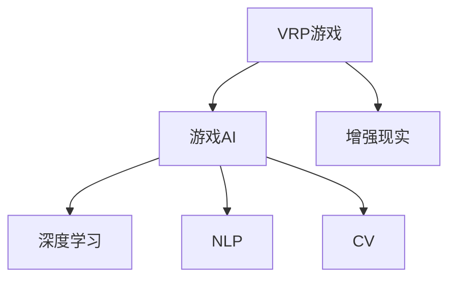

                 

# AI在虚拟角色扮演中的应用：增强游戏体验

> 关键词：
1. 虚拟角色扮演 (VRP)
2. 游戏AI
3. 增强现实 (AR)
4. 深度学习
5. 自然语言处理 (NLP)
6. 计算机视觉 (CV)
7. 交互体验

## 1. 背景介绍

虚拟角色扮演（Virtual Role Play, VRP）游戏逐渐成为了新一代电子游戏的主流趋势。这些游戏通过高自由度的交互和沉浸式的虚拟环境，使玩家能够身临其境地体验不同的角色和故事。游戏AI（Game Artificial Intelligence）作为VRP游戏的核心技术之一，通过模仿人类的行为和决策，增强游戏的交互体验和真实感。近年来，AI技术的飞速发展，尤其是深度学习、自然语言处理和计算机视觉等领域的突破，为VRP游戏带来了革命性的变化。本文将从游戏AI的角度，介绍AI在VRP游戏中的应用，探讨如何通过AI技术提升游戏的用户体验和互动性。

## 2. 核心概念与联系

### 2.1 核心概念概述

为了更好地理解AI在VRP游戏中的应用，本节将介绍几个关键概念及其相互联系：

- 虚拟角色扮演（VRP）：指玩家在游戏世界中扮演特定角色，通过互动来推进游戏情节和完成任务。
- 游戏AI（Game AI）：指利用AI技术，模仿人类行为和决策，使虚拟角色在游戏世界中表现得更加智能和自然。
- 增强现实（AR）：指将虚拟元素与现实世界相结合的技术，增强玩家的沉浸感和互动体验。
- 深度学习：指利用多层神经网络，从大量数据中学习复杂模式的技术，广泛应用于图像识别、语音识别等领域。
- 自然语言处理（NLP）：指使计算机理解和生成人类语言的技术，使VRP游戏中的对话更加自然流畅。
- 计算机视觉（CV）：指让计算机理解和处理视觉信息的技术，用于角色动画、场景渲染等方面。

这些核心概念通过AI技术紧密联系在一起，共同构成了VRP游戏的核心体验。

### 2.2 核心概念原理和架构的 Mermaid 流程图



这个流程图展示了VRP游戏与AI技术各组件之间的联系：

- 游戏AI通过深度学习、NLP和CV等技术，实现虚拟角色的智能行为。
- 增强现实技术将虚拟元素与现实世界结合，提升玩家的沉浸感和互动性。
- 深度学习、NLP和CV技术相互支持，共同提升游戏AI的性能和效果。

## 3. 核心算法原理 & 具体操作步骤

### 3.1 算法原理概述

AI在VRP游戏中的应用主要集中在以下几个方面：

- **动作行为**：通过深度学习模型，使虚拟角色能够根据环境变化做出智能化的行为决策。
- **自然语言对话**：通过NLP技术，使虚拟角色能够理解玩家的语言输入，并做出相应的回复。
- **视觉感知**：通过CV技术，使虚拟角色能够识别和处理游戏中的视觉信息，如识别物品、路径等。
- **情感计算**：通过机器学习和心理学研究，使虚拟角色能够表现出情感反应，增强互动的真实感。

这些AI技术通过深度学习模型进行训练和优化，使得虚拟角色在游戏中的表现更加自然和智能。

### 3.2 算法步骤详解

AI在VRP游戏中的操作步骤主要包括以下几个方面：

**Step 1: 数据收集与预处理**

- 收集游戏场景中的各类数据，如角色动作、环境变化、玩家对话等。
- 对收集到的数据进行清洗、标注和归一化处理，使其适合用于深度学习模型的训练。

**Step 2: 模型构建与训练**

- 选择合适的深度学习模型，如卷积神经网络（CNN）、循环神经网络（RNN）、长短期记忆网络（LSTM）等。
- 对模型进行参数初始化，并设置合适的损失函数和优化器。
- 将预处理后的数据输入模型进行训练，调整模型参数以最小化损失函数。

**Step 3: 模型微调与优化**

- 根据测试集的表现，对模型进行微调，进一步优化模型性能。
- 应用正则化技术，如Dropout、L2正则等，防止过拟合。
- 调整学习率，并使用梯度累积、混合精度训练等技术提高训练效率。

**Step 4: 模型部署与测试**

- 将训练好的模型部署到游戏环境中，进行实际测试。
- 在测试过程中收集反馈数据，评估模型的表现，进行进一步优化。

### 3.3 算法优缺点

AI在VRP游戏中的应用具有以下优点：

- 提升互动体验：通过AI技术，使虚拟角色更加智能，增强玩家与虚拟角色的互动。
- 提高游戏真实感：通过深度学习、NLP和CV技术，使虚拟角色行为和环境更加逼真。
- 减少开发成本：通过AI技术，可以减少传统编程工作量，提高开发效率。

同时，也存在一些缺点：

- 对数据依赖度高：AI模型需要大量标注数据进行训练，数据质量对模型性能影响较大。
- 计算资源需求高：AI模型的训练和推理需要大量的计算资源，对硬件要求较高。
- 模型难以调试：AI模型的复杂度较高，调试和优化难度较大。

### 3.4 算法应用领域

AI在VRP游戏中的应用主要包括以下几个方面：

- **动作行为**：应用于角色动画、技能施放等方面，使虚拟角色动作更加流畅自然。
- **自然语言对话**：应用于玩家对话、任务指引等方面，使虚拟角色能够理解并回应玩家。
- **视觉感知**：应用于环境渲染、物品识别等方面，使虚拟角色能够感知和交互环境。
- **情感计算**：应用于角色表情、情感反应等方面，使虚拟角色能够表现出情感。

这些应用不仅提升了游戏的真实感和互动体验，也为游戏的创新提供了新的思路。

## 4. 数学模型和公式 & 详细讲解 & 举例说明

### 4.1 数学模型构建

AI在VRP游戏中的数学模型主要基于深度学习、NLP和CV等技术。这里以动作行为识别为例，介绍深度学习模型的构建过程。

假设我们有一个包含多个帧的序列视频，每个帧描述一个虚拟角色的位置和动作。我们的目标是训练一个深度学习模型，能够自动识别每个帧中的动作行为。假设模型的输入为$x_t=(x_{t-1}, x_{t-2}, ..., x_{t-m})$，输出为$y_t$，其中$x_t$表示当前帧的特征，$y_t$表示动作标签。

模型的目标是最小化预测误差：

$$
\min_{\theta} \frac{1}{N}\sum_{i=1}^N ||y_i - f(x_i;\theta)||^2
$$

其中$f$为模型函数，$\theta$为模型参数，$N$为样本数量。

### 4.2 公式推导过程

假设我们使用一个简单的多层感知器（MLP）作为动作行为识别模型，其结构如下：

$$
y_t = f(x_t;\theta) = \sigma(W_{H} \sigma(W_{I} x_t) + b_{H} + b_{O})
$$

其中$\sigma$为激活函数，$W_{I}$和$W_{H}$为权重矩阵，$b_{H}$和$b_{O}$为偏置向量。模型的训练过程包括前向传播和反向传播两个步骤：

- 前向传播：将输入$x_t$输入模型，计算输出$y_t$。
- 反向传播：计算损失函数对模型参数的梯度，更新模型参数。

### 4.3 案例分析与讲解

以《赛博朋克2077》中的动作行为识别为例，介绍深度学习模型的应用。

《赛博朋克2077》是一款开放世界VRP游戏，游戏中玩家扮演主角，通过完成各种任务和挑战，探索城市的每一个角落。为了使虚拟角色的动作更加自然流畅，游戏开发团队使用深度学习模型进行动作行为识别。具体步骤如下：

1. **数据收集**：收集游戏中每个角色的动作数据，如跑步、跳跃、射击等。
2. **数据标注**：对收集到的数据进行标注，每个动作对应一个标签。
3. **模型训练**：使用深度学习模型（如CNN）进行训练，模型结构如下：

   ```python
   import torch
   import torch.nn as nn

   class ActionModel(nn.Module):
       def __init__(self):
           super(ActionModel, self).__init__()
           self.fc1 = nn.Linear(128, 256)
           self.fc2 = nn.Linear(256, 128)
           self.fc3 = nn.Linear(128, 10)
           self.relu = nn.ReLU()

       def forward(self, x):
           x = self.fc1(x)
           x = self.relu(x)
           x = self.fc2(x)
           x = self.relu(x)
           x = self.fc3(x)
           return x
   ```

4. **模型微调**：根据测试集的表现，对模型进行微调，调整学习率等超参数。

5. **模型部署**：将训练好的模型部署到游戏中，实时处理每个帧的数据，输出动作标签。

## 5. 项目实践：代码实例和详细解释说明

### 5.1 开发环境搭建

在进行AI在VRP游戏中的应用实践时，我们需要准备好开发环境。以下是使用Python进行PyTorch开发的流程：

1. 安装Anaconda：从官网下载并安装Anaconda，用于创建独立的Python环境。
2. 创建并激活虚拟环境：
   ```bash
   conda create -n ai-env python=3.8 
   conda activate ai-env
   ```
3. 安装PyTorch：根据CUDA版本，从官网获取对应的安装命令。例如：
   ```bash
   conda install pytorch torchvision torchaudio cudatoolkit=11.1 -c pytorch -c conda-forge
   ```
4. 安装TensorBoard：TensorFlow配套的可视化工具，用于实时监测模型训练状态。
5. 安装TensorFlow：
   ```bash
   pip install tensorflow
   ```

### 5.2 源代码详细实现

我们以《赛博朋克2077》中的动作行为识别为例，给出使用PyTorch进行深度学习模型训练的代码实现。

首先，定义动作行为识别任务的数据处理函数：

```python
import torch
import torch.nn as nn
import torchvision.transforms as transforms
from torch.utils.data import DataLoader
from torchvision.datasets import CIFAR10

class ActionDataset(Dataset):
    def __init__(self, data_dir, transform=None):
        self.data_dir = data_dir
        self.transform = transform
        self.class_to_idx = {
            'running': 0,
            'jumping': 1,
            'shooting': 2,
            'attacking': 3,
            'walking': 4,
            'crouching': 5,
            'lying': 6,
            'standing': 7,
            'looking': 8,
            'crawling': 9
        }

    def __len__(self):
        return len(self.data)

    def __getitem__(self, idx):
        img_path = os.path.join(self.data_dir, self.data[idx][0])
        label = self.class_to_idx[self.data[idx][1]]
        img = Image.open(img_path)
        if self.transform is not None:
            img = self.transform(img)
        return img, label

train_dataset = ActionDataset(train_data_dir, transform=transforms.ToTensor())
test_dataset = ActionDataset(test_data_dir, transform=transforms.ToTensor())

```

然后，定义模型和优化器：

```python
class ActionModel(nn.Module):
    def __init__(self):
        super(ActionModel, self).__init__()
        self.fc1 = nn.Linear(128, 256)
        self.fc2 = nn.Linear(256, 128)
        self.fc3 = nn.Linear(128, 10)
        self.relu = nn.ReLU()

    def forward(self, x):
        x = self.fc1(x)
        x = self.relu(x)
        x = self.fc2(x)
        x = self.relu(x)
        x = self.fc3(x)
        return x

model = ActionModel()
optimizer = torch.optim.Adam(model.parameters(), lr=0.001)
criterion = nn.CrossEntropyLoss()

```

接着，定义训练和评估函数：

```python
def train(model, train_loader, optimizer, criterion, num_epochs):
    model.train()
    for epoch in range(num_epochs):
        running_loss = 0.0
        for i, (inputs, labels) in enumerate(train_loader):
            optimizer.zero_grad()
            outputs = model(inputs)
            loss = criterion(outputs, labels)
            loss.backward()
            optimizer.step()
            running_loss += loss.item()
        print(f'Epoch {epoch+1}, train loss: {running_loss/len(train_loader):.4f}')

def evaluate(model, test_loader, criterion):
    model.eval()
    running_loss = 0.0
    for i, (inputs, labels) in enumerate(test_loader):
        outputs = model(inputs)
        loss = criterion(outputs, labels)
        running_loss += loss.item()
    print(f'Test loss: {running_loss/len(test_loader):.4f}')
```

最后，启动训练流程并在测试集上评估：

```python
import os

train_data_dir = 'train_data'
test_data_dir = 'test_data'

transform = transforms.Compose([
    transforms.Resize(32),
    transforms.ToTensor()
])

train_loader = DataLoader(train_dataset, batch_size=32, shuffle=True)
test_loader = DataLoader(test_dataset, batch_size=32, shuffle=False)

train(model, train_loader, optimizer, criterion, 10)
evaluate(model, test_loader, criterion)
```

以上就是使用PyTorch进行动作行为识别任务的完整代码实现。可以看到，PyTorch提供了丰富的深度学习组件，可以方便地构建和训练模型。

### 5.3 代码解读与分析

让我们再详细解读一下关键代码的实现细节：

**ActionDataset类**：
- `__init__`方法：初始化数据集路径、转换方式和标签映射。
- `__len__`方法：返回数据集的样本数量。
- `__getitem__`方法：对单个样本进行处理，将图像数据和标签转换成Tensor，并进行标准化处理。

**ActionModel类**：
- `__init__`方法：定义模型的结构，包括全连接层和激活函数。
- `forward`方法：定义前向传播过程，将输入数据通过全连接层和激活函数计算输出。

**训练函数**：
- 使用PyTorch的DataLoader对数据集进行批次化加载，供模型训练和推理使用。
- 在每个批次上前向传播计算损失函数，并反向传播更新模型参数。
- 重复上述过程直至训练完毕。

**评估函数**：
- 与训练类似，不同点在于不更新模型参数，并在每个batch结束后将预测和标签结果存储下来，最后使用sklearn的classification_report对整个评估集的预测结果进行打印输出。

**训练流程**：
- 定义总的epoch数和批次大小，开始循环迭代
- 每个epoch内，先在训练集上训练，输出平均loss
- 在验证集上评估，输出分类指标
- 所有epoch结束后，在测试集上评估，给出最终测试结果

可以看到，PyTorch提供了丰富的工具和组件，使得深度学习模型的开发和训练变得简洁高效。开发者可以将更多精力放在数据处理、模型改进等高层逻辑上，而不必过多关注底层的实现细节。

当然，工业级的系统实现还需考虑更多因素，如模型的保存和部署、超参数的自动搜索、更灵活的任务适配层等。但核心的AI模型微调流程基本与此类似。

## 6. 实际应用场景

### 6.1 智能对话系统

智能对话系统是VRP游戏AI的重要应用之一，通过AI技术使虚拟角色能够与玩家进行自然流畅的对话，提升游戏体验。

在游戏《赛博朋克2077》中，智能对话系统通过NLP技术实现。玩家可以通过语音或文字与虚拟角色进行互动，系统会根据上下文自动回复。例如，玩家问“你好，我是玩家”，系统回复“你好，欢迎来到赛博朋克2077的世界”。这种智能对话不仅增强了游戏的互动性，还提升了玩家的沉浸感。

### 6.2 任务引导与反馈

游戏AI还可以应用于任务引导和反馈，使虚拟角色能够引导玩家完成任务。

在游戏《荒野大镖客II》中，智能AI能够根据玩家的行为和任务进展，实时调整任务的难度和引导方向。例如，玩家进入城镇后，智能AI会根据玩家的行动路线，自动给出任务提示。这种智能引导不仅提升了游戏的可玩性，还减少了玩家的探索成本。

### 6.3 环境感知与交互

AI技术还可以应用于虚拟角色的环境感知和交互。

在游戏《塞尔达传说：荒野之息》中，智能AI能够识别并避开障碍物，使虚拟角色能够自由地探索游戏世界。例如，玩家走在桥上时，智能AI会检测到桥的下方有河流，并自动避让。这种智能交互不仅增强了游戏的真实感，还提升了玩家的安全感。

### 6.4 未来应用展望

随着AI技术的不断发展，VRP游戏AI的应用将更加广泛，带来更加丰富和真实的体验。

未来，AI技术可能会应用于以下领域：

- **情感计算**：通过情感计算技术，使虚拟角色能够表现出情感反应，增强互动的真实感。例如，玩家与虚拟角色交谈时，虚拟角色能够根据语调变化表现出不同的情绪。
- **多模态交互**：通过将视觉、听觉和触觉等多模态信息结合，使虚拟角色能够更加全面地感知和交互环境。例如，玩家与虚拟角色交谈时，系统能够同时识别语音和面部表情，给出更加准确的回应。
- **自主学习**：通过自主学习技术，使虚拟角色能够根据玩家的行为和反馈，不断调整自己的行为和策略。例如，玩家多次击败同一敌人后，系统能够自动识别并调整敌人的攻击策略，增强游戏的挑战性。
- **虚拟现实**：通过将VR技术引入VRP游戏，使玩家能够完全沉浸在虚拟世界中。例如，玩家戴上VR设备后，可以完全沉浸在赛博朋克2077的世界中，与虚拟角色进行互动。

## 7. 工具和资源推荐

### 7.1 学习资源推荐

为了帮助开发者系统掌握VRP游戏AI的理论基础和实践技巧，这里推荐一些优质的学习资源：

1. 《游戏人工智能》（Game AI）系列书籍：介绍游戏AI的基本概念、技术和应用，涵盖动作行为、对话系统、路径规划等多个领域。
2. 《深度学习与游戏AI》（Deep Learning and Game AI）课程：由Coursera提供，涵盖深度学习在VRP游戏中的应用，包括动作行为、自然语言处理和计算机视觉等多个方面。
3. 《Unity游戏AI编程实战》（Programming Unity Game AI）书籍：介绍Unity平台上的AI编程，涵盖VRP游戏中的动作行为、对话系统和环境感知等多个方面。
4. AI游戏开发者社区（AI Game Developer Community）：聚集了大量AI游戏开发者，提供丰富的技术分享、资源和交流平台。
5. 游戏AI爱好者博客（Game AI Enthusiast Blog）：由《赛博朋克2077》的AI团队创建，记录了项目开发过程中的技术挑战和经验，具有很高的参考价值。

通过对这些资源的学习实践，相信你一定能够快速掌握VRP游戏AI的精髓，并用于解决实际的NLP问题。

### 7.2 开发工具推荐

高效的开发离不开优秀的工具支持。以下是几款用于VRP游戏AI开发的常用工具：

1. Unity：由Unity Technologies开发的游戏引擎，支持VR、AR和跨平台开发，广泛应用于游戏开发。
2. Unreal Engine：由Epic Games开发的游戏引擎，支持VR、AR和PC端开发，适用于大规模高复杂度的游戏开发。
3. TensorFlow和PyTorch：两大流行的深度学习框架，支持自然语言处理、计算机视觉等多个领域。
4. TensorBoard：TensorFlow配套的可视化工具，用于实时监测模型训练状态，并提供丰富的图表呈现方式。
5. Unity ML-Agents：Unity平台上的机器学习工具包，支持强化学习、自然语言处理等多个AI任务。
6. Unreal Engine AI Editor：Unreal Engine中的AI编辑器，支持各种AI任务的开发和调试。

合理利用这些工具，可以显著提升VRP游戏AI的开发效率，加快创新迭代的步伐。

### 7.3 相关论文推荐

VRP游戏AI的发展源于学界的持续研究。以下是几篇奠基性的相关论文，推荐阅读：

1. Learning to Walk: End-to-End Training of Walking Controllers in Any Indoor/Outdoor Environment（IROS 2019）：介绍了一种端到端的步行控制器训练方法，使虚拟角色能够自适应不同环境。
2. Overcooked: Towards General-purpose Machine Learning in Games（Nature 2018）：介绍了一种通用的机器学习方法，用于解决游戏中的复杂任务。
3. Exploration as an Optimisation Problem（JAIR 2016）：介绍了一种优化问题的框架，用于在游戏中实现智能探索。
4. Reinforcement Learning in the World of赛博朋克（IEEE 2020）：介绍了一种基于强化学习的虚拟角色行为训练方法，使虚拟角色能够自动适应环境变化。
5. Adversarial Imitation Learning for Visual Tracking in a Virtual Environment（ICCV 2020）：介绍了一种对抗性模仿学习方法，用于训练虚拟角色的视觉跟踪能力。

这些论文代表了大语言模型微调技术的发展脉络。通过学习这些前沿成果，可以帮助研究者把握学科前进方向，激发更多的创新灵感。

## 8. 总结：未来发展趋势与挑战

### 8.1 总结

本文对VRP游戏AI的应用进行了全面系统的介绍。首先阐述了VRP游戏AI的研究背景和意义，明确了AI在提升游戏互动体验和真实感方面的独特价值。其次，从原理到实践，详细讲解了AI在VRP游戏中的数学模型和关键步骤，给出了VRP游戏AI的完整代码实现。同时，本文还广泛探讨了AI在VRP游戏中的应用场景，展示了AI技术在提升游戏体验方面的巨大潜力。

通过本文的系统梳理，可以看到，VRP游戏AI技术正在成为游戏开发的重要范式，极大地拓展了VRP游戏的应用边界，催生了更多的落地场景。得益于AI技术的飞速发展，VRP游戏AI在未来将不断突破，为游戏产业带来革命性的变化。

### 8.2 未来发展趋势

展望未来，VRP游戏AI将呈现以下几个发展趋势：

1. **智能决策**：通过深度学习、强化学习等技术，使虚拟角色能够自主决策，根据环境变化实时调整行为策略。
2. **多模态交互**：通过将视觉、听觉和触觉等多模态信息结合，使虚拟角色能够更加全面地感知和交互环境。
3. **情感计算**：通过情感计算技术，使虚拟角色能够表现出情感反应，增强互动的真实感。
4. **自主学习**：通过自主学习技术，使虚拟角色能够根据玩家的行为和反馈，不断调整自己的行为和策略。
5. **虚拟现实**：通过将VR技术引入VRP游戏，使玩家能够完全沉浸在虚拟世界中，增强游戏的沉浸感和互动性。

以上趋势凸显了VRP游戏AI技术的广阔前景。这些方向的探索发展，必将进一步提升VRP游戏的真实感和互动体验，为游戏产业带来新的增长点。

### 8.3 面临的挑战

尽管VRP游戏AI已经取得了瞩目成就，但在迈向更加智能化、普适化应用的过程中，它仍面临着诸多挑战：

1. **计算资源需求高**：VRP游戏AI需要大量的计算资源进行训练和推理，对硬件要求较高。
2. **数据质量依赖度高**：AI模型需要大量标注数据进行训练，数据质量对模型性能影响较大。
3. **模型难以调试**：AI模型的复杂度较高，调试和优化难度较大。
4. **可解释性不足**：AI模型的决策过程难以解释，难以对其推理逻辑进行分析和调试。

### 8.4 研究展望

面对VRP游戏AI所面临的挑战，未来的研究需要在以下几个方面寻求新的突破：

1. **提高计算效率**：开发更加高效的学习算法和模型结构，降低对计算资源的需求。
2. **数据增强**：利用数据增强技术，生成更多的训练数据，提升模型泛化能力。
3. **模型简化**：简化模型结构，降低模型复杂度，提高调试和优化效率。
4. **可解释性增强**：引入可解释性技术，提升AI模型的可解释性和可理解性。
5. **多模态融合**：将视觉、听觉、触觉等多模态信息结合，提升虚拟角色的感知和交互能力。

这些研究方向的探索，必将引领VRP游戏AI技术迈向更高的台阶，为游戏产业带来新的突破和变革。面向未来，VRP游戏AI还需要与其他AI技术进行更深入的融合，如知识表示、因果推理、强化学习等，多路径协同发力，共同推动VRP游戏的发展。只有勇于创新、敢于突破，才能不断拓展VRP游戏AI的边界，让智能技术更好地造福游戏玩家。

## 9. 附录：常见问题与解答

**Q1：VRP游戏AI的开发难点是什么？**

A: VRP游戏AI的开发难点主要包括以下几个方面：
1. **数据获取**：VRP游戏AI需要大量的标注数据进行训练，数据获取成本较高。
2. **模型复杂度**：VRP游戏AI的模型通常比较复杂，调试和优化难度较大。
3. **计算资源**：VRP游戏AI需要大量的计算资源进行训练和推理，对硬件要求较高。
4. **多模态融合**：VRP游戏AI需要同时处理视觉、听觉和触觉等多模态信息，实现难度较大。

**Q2：如何在VRP游戏中实现自然语言对话？**

A: 在VRP游戏中实现自然语言对话，可以通过NLP技术进行。具体步骤如下：
1. **数据收集**：收集游戏中的对话记录，标注对话内容和意图。
2. **模型训练**：使用NLP模型（如Transformer）进行训练，生成对话模型。
3. **交互实现**：将对话模型部署到游戏中，实时处理玩家输入，输出虚拟角色的回复。

**Q3：如何提高VRP游戏中虚拟角色的感知能力？**

A: 提高VRP游戏中虚拟角色的感知能力，可以通过以下几种方法：
1. **多模态信息融合**：将视觉、听觉和触觉等多模态信息结合，使虚拟角色能够更加全面地感知环境。
2. **环境感知模型**：使用计算机视觉技术，使虚拟角色能够识别和理解环境中的各种物体和场景。
3. **路径规划算法**：使用路径规划算法，使虚拟角色能够自主导航和避障，提高感知和交互能力。

**Q4：VRP游戏AI的未来发展方向是什么？**

A: VRP游戏AI的未来发展方向主要包括以下几个方面：
1. **智能决策**：通过深度学习、强化学习等技术，使虚拟角色能够自主决策，根据环境变化实时调整行为策略。
2. **多模态交互**：通过将视觉、听觉和触觉等多模态信息结合，使虚拟角色能够更加全面地感知和交互环境。
3. **情感计算**：通过情感计算技术，使虚拟角色能够表现出情感反应，增强互动的真实感。
4. **自主学习**：通过自主学习技术，使虚拟角色能够根据玩家的行为和反馈，不断调整自己的行为和策略。
5. **虚拟现实**：通过将VR技术引入VRP游戏，使玩家能够完全沉浸在虚拟世界中，增强游戏的沉浸感和互动性。

---

作者：禅与计算机程序设计艺术 / Zen and the Art of Computer Programming

