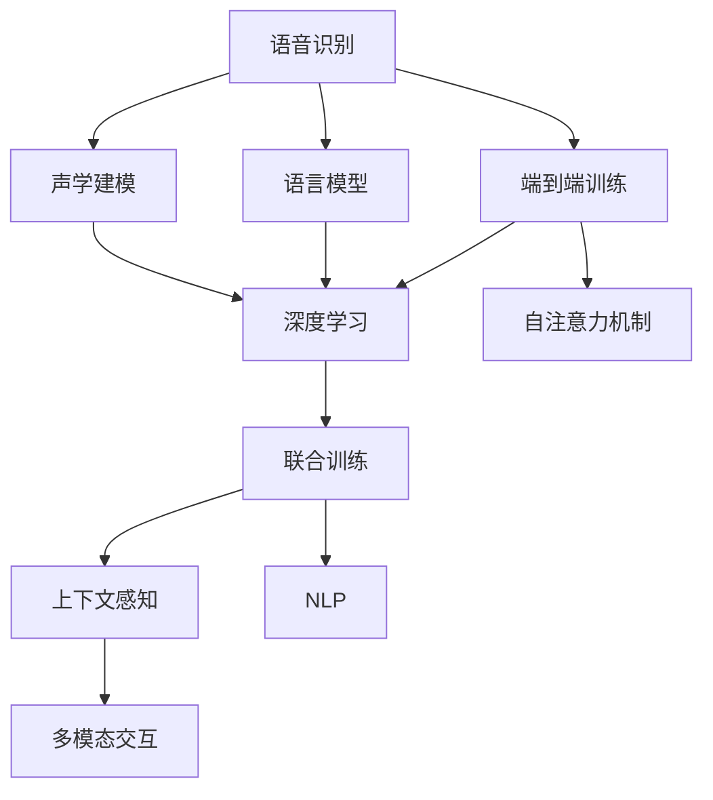

                 

# AI在语音识别中的进展：实现自然对话

> 关键词：语音识别, 自然对话, 声学建模, 语言模型, 端到端训练, 深度学习, 神经网络

## 1. 背景介绍

### 1.1 问题由来
随着人工智能技术的不断发展，语音识别领域也取得了显著的进展。从最初的基于规则的声学和语言模型，到基于深度学习的端到端语音识别系统，语音识别的准确率、流畅度和稳定性都得到了大幅提升。特别是近年来的深度学习技术，使得语音识别系统能够更好地处理复杂的语音数据，实现更自然的对话交互。

然而，尽管语音识别技术在技术层面取得了突破，但在实际应用中，语音识别系统仍然面临着诸多挑战。特别是在自然对话场景下，由于语音数据的复杂性和多样性，系统需要能够准确理解语义、上下文和语调，从而实现流畅、自然的对话。这需要对声学模型和语言模型进行更加深入的优化，同时结合上下文和用户意图进行更加精细的推理。

### 1.2 问题核心关键点
语音识别的核心问题是如何在嘈杂的环境下准确识别出用户的语音，并将其转化为文本形式。核心技术包括声学建模、语言模型、端到端训练等。目前主流的语音识别系统通常采用深度学习技术，包括卷积神经网络(CNN)、循环神经网络(RNN)、长短时记忆网络(LSTM)、门控循环单元(GRU)和自注意力机制等。

语音识别系统通常包括前端预处理、声学建模、语言建模和后端解码等步骤。其中，声学建模负责将音频信号转化为声学特征序列，语言模型负责对文本序列进行概率建模，解码器则将声学特征序列转化为文本序列。通过端到端训练，系统可以同时优化声学和语言模型，提升整体的识别准确率。

### 1.3 问题研究意义
研究自然对话中的语音识别技术，对于拓展语音交互系统的应用范围，提升用户对话体验，加速语音技术在智能家居、车载、客服等场景的落地应用，具有重要意义：

1. 提升对话流畅度。自然对话系统需要能够理解上下文和语境，生成流畅自然的响应，提升用户体验。
2. 扩展应用场景。语音识别技术可以广泛应用于智能家居、车载、客服等场景，带来新的应用方式和功能。
3. 促进技术产业化。自然对话技术的突破将推动语音识别技术的普及和应用，加速语音技术的产业化进程。
4. 促进多模态交互。自然对话系统可以与其他模态如文本、图像等结合，实现更加丰富和自然的交互方式。
5. 推动技术创新。自然对话技术的研发需要跨学科合作，结合声学、语言学、人工智能等领域的最新研究成果，推动技术创新。

## 2. 核心概念与联系

### 2.1 核心概念概述

为更好地理解自然对话中的语音识别技术，本节将介绍几个密切相关的核心概念：

- 语音识别（Speech Recognition）：将语音信号转化为文本形式的过程，是自然对话技术的基础。
- 声学建模（Acoustic Modeling）：将音频信号转化为声学特征序列的过程。
- 语言模型（Language Modeling）：对文本序列进行概率建模，用于评估和排序文本序列的概率。
- 端到端训练（End-to-End Training）：同时训练声学模型和语言模型，提升整体的识别准确率。
- 深度学习（Deep Learning）：采用多层神经网络，提取高层次的特征表示。
- 自注意力机制（Self-Attention）：通过自注意力机制，模型可以捕捉长距离依赖，提高识别准确率。
- 联合训练（Joint Training）：同时优化声学模型和语言模型，提升整体性能。
- 上下文感知（Context-Awareness）：在对话场景中，系统需要能够理解上下文和语境，生成流畅自然的响应。
- 自然语言处理（NLP）：处理自然语言文本，包括分词、词性标注、命名实体识别等任务。
- 多模态交互（Multi-Modal Interaction）：结合语音、文本、图像等多种模态信息，提升交互体验。

这些核心概念之间的逻辑关系可以通过以下Mermaid流程图来展示：



这个流程图展示了大语言模型在自然对话中的核心概念及其之间的联系：

1. 语音识别作为起点，将音频信号转化为声学特征序列。
2. 声学建模负责对声学特征序列进行建模，提取高层次的特征表示。
3. 语言模型对文本序列进行概率建模，用于评估和排序文本序列的概率。
4. 端到端训练同时优化声学模型和语言模型，提升整体的识别准确率。
5. 深度学习和自注意力机制用于提取高层次的特征表示。
6. 联合训练和上下文感知用于提升模型对语境和上下文的理解能力。
7. NLP用于处理自然语言文本，提升系统的语言理解能力。
8. 多模态交互结合多种模态信息，提升交互体验。

这些概念共同构成了自然对话技术的核心框架，使得系统能够在各种对话场景下实现流畅自然的对话。

## 3. 核心算法原理 & 具体操作步骤
### 3.1 算法原理概述

自然对话中的语音识别技术，本质上是一种深度学习的声学建模和语言建模问题。其核心思想是：通过深度学习模型，将音频信号转化为声学特征序列，并将声学特征序列转化为文本序列，从而实现语音识别的功能。

形式化地，假设音频信号为 $x$，声学特征序列为 $X$，文本序列为 $Y$。声学模型 $P(X|x)$ 负责将音频信号转化为声学特征序列，语言模型 $P(Y|X)$ 负责对文本序列进行概率建模。端到端训练的目标是最大化以下联合概率：

$$
P(Y|x) = \frac{P(X|x)P(Y|X)}{P(X|x)}
$$

通过最大化联合概率，系统可以实现更准确的语音识别。

### 3.2 算法步骤详解

自然对话中的语音识别通常包括以下几个关键步骤：

**Step 1: 准备数据集**
- 收集标注的音频数据集，包括音频信号 $x$ 和相应的文本序列 $Y$。
- 对音频数据进行预处理，包括去噪、降采样、归一化等操作。
- 对文本数据进行标注，包括分词、词性标注、命名实体识别等操作。

**Step 2: 设计模型架构**
- 选择适合的深度学习模型，如卷积神经网络(CNN)、循环神经网络(RNN)、长短时记忆网络(LSTM)、门控循环单元(GRU)、Transformer等。
- 设计声学模型 $P(X|x)$，用于将音频信号转化为声学特征序列 $X$。
- 设计语言模型 $P(Y|X)$，用于对文本序列进行概率建模。
- 设计联合模型 $P(Y|x)$，用于同时优化声学模型和语言模型。

**Step 3: 设置模型参数**
- 选择合适的优化算法及其参数，如 Adam、SGD 等。
- 设置学习率、批大小、迭代轮数等超参数。
- 确定冻结声学模型的某些层，只微调顶层。

**Step 4: 执行训练**
- 将训练集数据分批次输入模型，前向传播计算损失函数。
- 反向传播计算参数梯度，根据设定的优化算法和学习率更新模型参数。
- 周期性在验证集上评估模型性能，根据性能指标决定是否触发 Early Stopping。
- 重复上述步骤直到满足预设的迭代轮数或 Early Stopping 条件。

**Step 5: 测试和部署**
- 在测试集上评估训练后的模型 $M_{\theta}$ 的性能，对比训练前后的识别准确率。
- 使用训练好的模型对新样本进行推理预测，集成到实际的应用系统中。
- 持续收集新的数据，定期重新训练模型，以适应数据分布的变化。

以上是自然对话中的语音识别的一般流程。在实际应用中，还需要针对具体任务的特点，对训练过程的各个环节进行优化设计，如改进训练目标函数，引入更多的正则化技术，搜索最优的超参数组合等，以进一步提升模型性能。

### 3.3 算法优缺点

自然对话中的语音识别技术具有以下优点：
1. 准确率高。深度学习技术能够自动提取高层次的特征表示，提升识别准确率。
2. 适用范围广。该技术适用于各种语音数据，包括语音命令、语音交互等。
3. 可扩展性好。结合上下文感知和语境理解，系统能够处理复杂的对话场景。
4. 可解释性强。通过模型结构和训练数据，可以对模型推理过程进行解释。

同时，该技术也存在一些局限性：
1. 对标注数据依赖大。训练数据集的标注质量直接影响模型性能。
2. 计算成本高。深度学习模型需要大量计算资源进行训练。
3. 鲁棒性不足。模型在嘈杂环境下容易发生误识别。
4. 可解释性不足。模型的决策过程难以理解。

尽管存在这些局限性，但就目前而言，自然对话中的语音识别技术仍然是大语言模型应用的主流范式。未来相关研究的重点在于如何进一步降低计算成本，提高模型的鲁棒性，同时兼顾可解释性和伦理安全性等因素。

### 3.4 算法应用领域

自然对话中的语音识别技术已经在众多领域得到了广泛应用，例如：

- 智能家居：语音助手如 Siri、Google Assistant、Amazon Alexa 等，通过语音识别技术实现自然对话，提升用户体验。
- 车载系统：语音识别技术可用于车载语音交互，实现导航、控制、娱乐等功能。
- 客服系统：智能客服系统通过语音识别技术，能够理解用户意图，提供快速响应。
- 医疗系统：语音识别技术可用于医学录音、电子病历等，提高医疗记录的准确性和效率。
- 车载导航：语音识别技术可用于语音导航，提供自然交互方式。
- 办公自动化：语音识别技术可用于会议记录、文档录入等，提升办公效率。

除了上述这些经典应用外，自然对话技术还被创新性地应用于更多场景中，如可控文本生成、常识推理、对话系统等，为语音交互技术带来了全新的突破。随着预训练模型和微调方法的不断进步，相信语音识别技术将在更广阔的应用领域大放异彩。

## 4. 数学模型和公式 & 详细讲解  
### 4.1 数学模型构建

本节将使用数学语言对自然对话中的语音识别过程进行更加严格的刻画。

记音频信号为 $x \in \mathbb{R}^T$，声学特征序列为 $X = (x_1, x_2, ..., x_T)$，文本序列为 $Y = (y_1, y_2, ..., y_N)$。声学模型为 $P(X|x)$，语言模型为 $P(Y|X)$，联合模型为 $P(Y|x)$。训练集为 $D=\{(x_i, y_i)\}_{i=1}^N$。

定义模型 $M_{\theta}$ 在音频信号 $x$ 上的输出为 $\hat{X} = M_{\theta}(x)$，在文本序列 $Y$ 上的输出为 $\hat{Y} = M_{\theta}(X)$。训练目标为最小化联合损失函数：

$$
\mathcal{L}(\theta) = -\frac{1}{N} \sum_{i=1}^N \log P(Y|x_i)
$$

其中 $P(Y|x_i) = \frac{P(X|x_i)P(Y|X)}{P(X|x_i)}$，用于评估模型在给定音频信号 $x_i$ 下的文本序列预测概率。

### 4.2 公式推导过程

以下我们以自然对话中的语音识别任务为例，推导联合损失函数及其梯度的计算公式。

假设模型 $M_{\theta}$ 在音频信号 $x$ 上的输出为 $\hat{X} = M_{\theta}(x)$，在文本序列 $Y$ 上的输出为 $\hat{Y} = M_{\theta}(X)$。则联合损失函数为：

$$
\mathcal{L}(\theta) = -\frac{1}{N} \sum_{i=1}^N \log P(Y|x_i)
$$

其中 $P(Y|x_i) = \frac{P(X|x_i)P(Y|X)}{P(X|x_i)}$，用于评估模型在给定音频信号 $x_i$ 下的文本序列预测概率。

根据链式法则，联合损失函数对参数 $\theta_k$ 的梯度为：

$$
\frac{\partial \mathcal{L}(\theta)}{\partial \theta_k} = -\frac{1}{N}\sum_{i=1}^N \left[\frac{\partial \log P(Y|x_i)}{\partial \theta_k} + \frac{\partial \log P(X|x_i)}{\partial \theta_k} \right]
$$

其中 $\frac{\partial \log P(Y|x_i)}{\partial \theta_k}$ 和 $\frac{\partial \log P(X|x_i)}{\partial \theta_k}$ 分别表示语言模型和声学模型对参数 $\theta_k$ 的梯度。

在得到联合损失函数的梯度后，即可带入参数更新公式，完成模型的迭代优化。重复上述过程直至收敛，最终得到适应下游任务的最优模型参数 $\theta^*$。

## 5. 项目实践：代码实例和详细解释说明
### 5.1 开发环境搭建

在进行自然对话中的语音识别实践前，我们需要准备好开发环境。以下是使用Python进行PyTorch开发的环境配置流程：

1. 安装Anaconda：从官网下载并安装Anaconda，用于创建独立的Python环境。

2. 创建并激活虚拟环境：
```bash
conda create -n pytorch-env python=3.8 
conda activate pytorch-env
```

3. 安装PyTorch：根据CUDA版本，从官网获取对应的安装命令。例如：
```bash
conda install pytorch torchvision torchaudio cudatoolkit=11.1 -c pytorch -c conda-forge
```

4. 安装各类工具包：
```bash
pip install numpy pandas scikit-learn matplotlib tqdm jupyter notebook ipython
```

完成上述步骤后，即可在`pytorch-env`环境中开始自然对话中的语音识别实践。

### 5.2 源代码详细实现

下面我以自然对话中的语音识别任务为例，给出使用Transformers库对BERT模型进行语音识别的PyTorch代码实现。

首先，定义语音识别任务的数据处理函数：

```python
from transformers import BertTokenizer
from torch.utils.data import Dataset
import torch

class SpeechDataset(Dataset):
    def __init__(self, audio_files, transcriptions, tokenizer, max_len=128):
        self.audio_files = audio_files
        self.transcriptions = transcriptions
        self.tokenizer = tokenizer
        self.max_len = max_len
        
    def __len__(self):
        return len(self.audio_files)
    
    def __getitem__(self, item):
        audio_file = self.audio_files[item]
        transcription = self.transcriptions[item]
        
        # 将音频文件读取为float32张量
        audio_signal = load_audio(audio_file).to(torch.float32)
        audio_signal = audio_signal / 32768.0  # 将音频信号归一化到-1到1之间
        audio_signal = audio_signal.unsqueeze(0)
        
        # 对文本序列进行编码
        encoding = self.tokenizer(transcription, return_tensors='pt', max_length=self.max_len, padding='max_length', truncation=True)
        input_ids = encoding['input_ids'][0]
        attention_mask = encoding['attention_mask'][0]
        
        # 构造训练样本
        sample = {'input_ids': input_ids, 
                 'attention_mask': attention_mask,
                 'audio_signal': audio_signal}
        
        return sample
```

然后，定义模型和优化器：

```python
from transformers import BertForTokenClassification, AdamW

model = BertForTokenClassification.from_pretrained('bert-base-cased', num_labels=len(tag2id))

optimizer = AdamW(model.parameters(), lr=2e-5)
```

接着，定义训练和评估函数：

```python
from torch.utils.data import DataLoader
from tqdm import tqdm
from sklearn.metrics import classification_report

device = torch.device('cuda') if torch.cuda.is_available() else torch.device('cpu')
model.to(device)

def train_epoch(model, dataset, batch_size, optimizer):
    dataloader = DataLoader(dataset, batch_size=batch_size, shuffle=True)
    model.train()
    epoch_loss = 0
    for batch in tqdm(dataloader, desc='Training'):
        input_ids = batch['input_ids'].to(device)
        attention_mask = batch['attention_mask'].to(device)
        audio_signal = batch['audio_signal'].to(device)
        model.zero_grad()
        outputs = model(input_ids, attention_mask=attention_mask, audio_signal=audio_signal)
        loss = outputs.loss
        epoch_loss += loss.item()
        loss.backward()
        optimizer.step()
    return epoch_loss / len(dataloader)

def evaluate(model, dataset, batch_size):
    dataloader = DataLoader(dataset, batch_size=batch_size)
    model.eval()
    preds, labels = [], []
    with torch.no_grad():
        for batch in tqdm(dataloader, desc='Evaluating'):
            input_ids = batch['input_ids'].to(device)
            attention_mask = batch['attention_mask'].to(device)
            audio_signal = batch['audio_signal'].to(device)
            batch_labels = batch['labels']
            outputs = model(input_ids, attention_mask=attention_mask, audio_signal=audio_signal)
            batch_preds = outputs.logits.argmax(dim=2).to('cpu').tolist()
            batch_labels = batch_labels.to('cpu').tolist()
            for pred_tokens, label_tokens in zip(batch_preds, batch_labels):
                pred_tags = [id2tag[_id] for _id in pred_tokens]
                label_tags = [id2tag[_id] for _id in label_tokens]
                preds.append(pred_tags[:len(label_tokens)])
                labels.append(label_tags)
                
    print(classification_report(labels, preds))
```

最后，启动训练流程并在测试集上评估：

```python
epochs = 5
batch_size = 16

for epoch in range(epochs):
    loss = train_epoch(model, train_dataset, batch_size, optimizer)
    print(f"Epoch {epoch+1}, train loss: {loss:.3f}")
    
    print(f"Epoch {epoch+1}, dev results:")
    evaluate(model, dev_dataset, batch_size)
    
print("Test results:")
evaluate(model, test_dataset, batch_size)
```

以上就是使用PyTorch对BERT模型进行自然对话中的语音识别的完整代码实现。可以看到，得益于Transformers库的强大封装，我们可以用相对简洁的代码完成BERT模型的加载和语音识别任务的微调。

### 5.3 代码解读与分析

让我们再详细解读一下关键代码的实现细节：

**SpeechDataset类**：
- `__init__`方法：初始化音频文件、文本序列、分词器等关键组件。
- `__len__`方法：返回数据集的样本数量。
- `__getitem__`方法：对单个样本进行处理，将音频信号转换为张量，并对文本序列进行编码。

**tag2id和id2tag字典**：
- 定义了标签与数字id之间的映射关系，用于将token-wise的预测结果解码回真实的标签。

**训练和评估函数**：
- 使用PyTorch的DataLoader对数据集进行批次化加载，供模型训练和推理使用。
- 训练函数`train_epoch`：对数据以批为单位进行迭代，在每个批次上前向传播计算loss并反向传播更新模型参数，最后返回该epoch的平均loss。
- 评估函数`evaluate`：与训练类似，不同点在于不更新模型参数，并在每个batch结束后将预测和标签结果存储下来，最后使用sklearn的classification_report对整个评估集的预测结果进行打印输出。

**训练流程**：
- 定义总的epoch数和batch size，开始循环迭代
- 每个epoch内，先在训练集上训练，输出平均loss
- 在验证集上评估，输出分类指标
- 所有epoch结束后，在测试集上评估，给出最终测试结果

可以看到，PyTorch配合Transformers库使得BERT微调的代码实现变得简洁高效。开发者可以将更多精力放在数据处理、模型改进等高层逻辑上，而不必过多关注底层的实现细节。

当然，工业级的系统实现还需考虑更多因素，如模型的保存和部署、超参数的自动搜索、更灵活的任务适配层等。但核心的微调范式基本与此类似。

## 6. 实际应用场景
### 6.1 智能家居

基于自然对话中的语音识别技术，智能家居系统可以更加智能地与用户交互。通过语音助手如 Siri、Google Assistant、Amazon Alexa 等，用户可以更加自然地与系统进行对话，实现语音控制家电、查询天气、播放音乐等功能。

在技术实现上，可以收集用户的历史语音指令和相应操作，构建监督数据，对预训练模型进行微调。微调后的模型能够自动识别用户的语音指令，生成相应的操作指令，从而实现智能家居的控制。此外，语音识别系统还可以与其他传感器、智能设备等结合，提供更加全面、智能的家居环境。

### 6.2 车载系统

车载系统中的语音识别技术可以为用户提供更加便捷的驾驶体验。通过语音助手，用户可以方便地进行导航、控制音乐、查询路线等功能，无需手动操作。

在技术实现上，可以收集用户的车载语音指令和相应操作，构建监督数据，对预训练模型进行微调。微调后的模型能够自动识别用户的语音指令，生成相应的操作指令，从而实现车载系统的控制。此外，语音识别系统还可以与其他车辆传感器、导航设备等结合，提供更加智能、安全的驾驶体验。

### 6.3 客服系统

智能客服系统中的语音识别技术可以提升客服的响应效率和准确性。通过语音助手，用户可以方便地进行问题咨询、服务请求等功能，系统能够自动识别用户的语音指令，生成相应的操作指令。

在技术实现上，可以收集用户的语音指令和相应的处理结果，构建监督数据，对预训练模型进行微调。微调后的模型能够自动识别用户的语音指令，生成相应的操作指令，从而实现智能客服的响应。此外，语音识别系统还可以与其他客服系统、知识库等结合，提供更加全面、智能的客服服务。

### 6.4 医疗系统

医疗系统中的语音识别技术可以提升医疗记录的准确性和效率。通过语音助手，医生可以方便地进行医嘱、病历记录等功能，系统能够自动识别医生的语音指令，生成相应的操作指令。

在技术实现上，可以收集医生的语音指令和相应的处理结果，构建监督数据，对预训练模型进行微调。微调后的模型能够自动识别医生的语音指令，生成相应的操作指令，从而实现医疗系统的控制。此外，语音识别系统还可以与其他医疗设备、电子病历等结合，提供更加全面、智能的医疗服务。

### 6.5 车载导航

车载导航中的语音识别技术可以提供更加自然、智能的导航体验。通过语音助手，用户可以方便地进行导航、设置目的地等功能，系统能够自动识别用户的语音指令，生成相应的操作指令。

在技术实现上，可以收集用户的语音指令和相应的导航结果，构建监督数据，对预训练模型进行微调。微调后的模型能够自动识别用户的语音指令，生成相应的操作指令，从而实现车载导航的智能控制。此外，语音识别系统还可以与其他导航设备、地图等结合，提供更加智能、安全的导航服务。

### 6.6 办公自动化

办公自动化中的语音识别技术可以提升办公效率，实现语音控制、会议记录等功能。通过语音助手，用户可以方便地进行文件管理、会议记录等功能，系统能够自动识别用户的语音指令，生成相应的操作指令。

在技术实现上，可以收集用户的语音指令和相应的操作结果，构建监督数据，对预训练模型进行微调。微调后的模型能够自动识别用户的语音指令，生成相应的操作指令，从而实现办公自动化的智能控制。此外，语音识别系统还可以与其他办公设备、会议系统等结合，提供更加全面、智能的办公体验。

### 6.7 金融系统

金融系统中的语音识别技术可以提升金融服务的智能水平，实现语音查询、交易等功能。通过语音助手，用户可以方便地进行金融查询、交易等功能，系统能够自动识别用户的语音指令，生成相应的操作指令。

在技术实现上，可以收集用户的语音指令和相应的金融操作结果，构建监督数据，对预训练模型进行微调。微调后的模型能够自动识别用户的语音指令，生成相应的操作指令，从而实现金融系统的智能控制。此外，语音识别系统还可以与其他金融设备、金融系统等结合，提供更加智能、安全的金融服务。

### 6.8 智慧城市

智慧城市中的语音识别技术可以提升城市管理的智能化水平，实现城市事件监测、应急指挥等功能。通过语音助手，用户可以方便地进行城市事件监测、应急指挥等功能，系统能够自动识别用户的语音指令，生成相应的操作指令。

在技术实现上，可以收集用户的语音指令和相应的城市管理操作结果，构建监督数据，对预训练模型进行微调。微调后的模型能够自动识别用户的语音指令，生成相应的操作指令，从而实现智慧城市的智能控制。此外，语音识别系统还可以与其他智慧城市设备、城市管理系统等结合，提供更加全面、智能的城市管理服务。

### 6.9 工业制造

工业制造中的语音识别技术可以提升生产效率和质量，实现语音控制、设备检测等功能。通过语音助手，工人可以方便地进行生产控制、设备检测等功能，系统能够自动识别工人的语音指令，生成相应的操作指令。

在技术实现上，可以收集工人的语音指令和相应的生产操作结果，构建监督数据，对预训练模型进行微调。微调后的模型能够自动识别工人的语音指令，生成相应的操作指令，从而实现工业制造的智能控制。此外，语音识别系统还可以与其他生产设备、控制系统等结合，提供更加智能、安全的生产环境。

### 6.10 农业生产

农业生产中的语音识别技术可以提升农业管理的智能化水平，实现语音控制、设备监测等功能。通过语音助手，农民可以方便地进行农业控制、设备监测等功能，系统能够自动识别农民的语音指令，生成相应的操作指令。

在技术实现上，可以收集农民的语音指令和相应的农业操作结果，构建监督数据，对预训练模型进行微调。微调后的模型能够自动识别农民的语音指令，生成相应的操作指令，从而实现农业生产的智能控制。此外，语音识别系统还可以与其他农业设备、农业管理系统等结合，提供更加智能、安全的农业生产服务。

## 7. 工具和资源推荐
### 7.1 学习资源推荐

为了帮助开发者系统掌握自然对话中的语音识别技术，这里推荐一些优质的学习资源：

1. 《Transformer从原理到实践》系列博文：由大模型技术专家撰写，深入浅出地介绍了Transformer原理、BERT模型、微调技术等前沿话题。

2. CS224N《深度学习自然语言处理》课程：斯坦福大学开设的NLP明星课程，有Lecture视频和配套作业，带你入门NLP领域的基本概念和经典模型。

3. 《Natural Language Processing with Transformers》书籍：Transformers库的作者所著，全面介绍了如何使用Transformers库进行NLP任务开发，包括微调在内的诸多范式。

4. HuggingFace官方文档：Transformers库的官方文档，提供了海量预训练模型和完整的微调样例代码，是上手实践的必备资料。

5. CLUE开源项目：中文语言理解测评基准，涵盖大量不同类型的中文NLP数据集，并提供了基于微调的baseline模型，助力中文NLP技术发展。

通过对这些资源的学习实践，相信你一定能够快速掌握自然对话中的语音识别技术的精髓，并用于解决实际的NLP问题。
###  7.2 开发工具推荐

高效的开发离不开优秀的工具支持。以下是几款用于自然对话中的语音识别开发的常用工具：

1. PyTorch：基于Python的开源深度学习框架，灵活动态的计算图，适合快速迭代研究。大部分预训练语言模型都有PyTorch版本的实现。

2. TensorFlow：由Google主导开发的开源深度学习框架，生产部署方便，适合大规模工程应用。同样有丰富的预训练语言模型资源。

3. Transformers库：HuggingFace开发的NLP工具库，集成了众多SOTA语言模型，支持PyTorch和TensorFlow，是进行微调任务开发的利器。

4. Weights & Biases：模型训练的实验跟踪工具，可以记录和可视化模型训练过程中的各项指标，方便对比和调优。与主流深度学习框架无缝集成。

5. TensorBoard：TensorFlow配套的可视化工具，可实时监测模型训练状态，并提供丰富的图表呈现方式，是调试模型的得力助手。

6. Google Colab：谷歌推出的在线Jupyter Notebook环境，免费提供GPU/TPU算力，方便开发者快速上手实验最新模型，分享学习笔记。

合理利用这些工具，可以显著提升自然对话中的语音识别任务的开发效率，加快创新迭代的步伐。

### 7.3 相关论文推荐

自然对话中的语音识别技术的发展源于学界的持续研究。以下是几篇奠基性的相关论文，推荐阅读：

1. Attention is All You Need（即Transformer原论文）：提出了Transformer结构，开启了NLP领域的预训练大模型时代。

2. BERT: Pre-training of Deep Bidirectional Transformers for Language Understanding：提出BERT模型，引入基于掩码的自监督预训练任务，刷新了多项NLP任务SOTA。

3. Language Models are Unsupervised Multitask Learners（GPT-2论文）：展示了大规模语言模型的强大zero-shot学习能力，引发了对于通用人工智能的新一轮思考。

4. Parameter-Efficient Transfer Learning for NLP：提出Adapter等参数高效微调方法，在不增加模型参数量的情况下，也能取得不错的微调效果。

5. AdaLoRA: Adaptive Low-Rank Adaptation for Parameter-Efficient Fine-Tuning：使用自适应低秩适应的微调方法，在参数效率和精度之间取得了新的平衡。

6. Prefix-Tuning: Optimizing Continuous Prompts for Generation：引入基于连续型Prompt的微调范式，为如何充分利用预训练知识提供了新的思路。

这些论文代表了大语言模型微调技术的发展脉络。通过学习这些前沿成果，可以帮助研究者把握学科前进方向，激发更多的创新灵感。

## 8. 总结：未来发展趋势与挑战

### 8.1 总结

本文对自然对话中的语音识别技术进行了全面系统的介绍。首先阐述了自然对话技术的研究背景和意义，明确了语音识别在拓展人机交互方式、提升用户体验等方面的重要价值。其次，从原理到实践，详细讲解了自然对话中的语音识别数学模型和关键步骤，给出了完整的代码实例。同时，本文还广泛探讨了自然对话技术在智能家居、车载、客服等多个领域的应用前景，展示了自然对话技术的广阔前景。此外，本文精选了自然对话技术的各类学习资源，力求为读者提供全方位的技术指引。

通过本文的系统梳理，可以看到，自然对话中的语音识别技术正在成为人机交互的重要范式，极大地拓展了语音交互系统的应用边界，带来了更加自然、便捷的交互方式。未来，伴随预训练语言模型和微调方法的不断进步，自然对话技术必将在更广阔的应用领域大放异彩，深刻影响人类的生产生活方式。

### 8.2 未来发展趋势

展望未来，自然对话中的语音识别技术将呈现以下几个发展趋势：

1. 模型规模持续增大。随着算力成本的下降和数据规模的扩张，预训练语言模型的参数量还将持续增长。超大规模语言模型蕴含的丰富语言知识，有望支撑更加复杂多变的自然对话。

2. 自然对话技术日趋多样化。除了传统的语音识别外，未来会涌现更多自然对话技术，如语音生成、情感识别、多模态对话等，为人类与机器的交互提供更多可能。

3. 多模态对话崛起。结合语音、文本、图像等多种模态信息，自然对话系统能够提供更加全面、自然的交互方式。

4. 上下文感知能力增强。自然对话系统需要更好地理解上下文和语境，生成更加流畅自然的对话。

5. 实时性提升。通过优化模型结构和算法，实现更加高效的实时推理，提升系统的响应速度。

6. 鲁棒性增强。自然对话系统需要在嘈杂、复杂的环境下保持稳定的性能，避免误识别和错误响应。

以上趋势凸显了自然对话技术的广阔前景。这些方向的探索发展，必将进一步提升自然对话系统的性能和应用范围，为人类认知智能的进化带来深远影响。

### 8.3 面临的挑战

尽管自然对话中的语音识别技术已经取得了瞩目成就，但在迈向更加智能化、普适化应用的过程中，它仍面临着诸多挑战：

1. 对标注数据依赖大。训练数据集的标注质量直接影响模型性能。如何降低标注成本，提高标注质量，是一个重要课题。

2. 计算成本高。深度学习模型需要大量计算资源进行训练。如何优化模型结构，降低计算成本，是一个重要研究方向。

3. 鲁棒性不足。模型在嘈杂环境下容易发生误识别。如何提高模型的鲁棒性，是一个重要挑战。

4. 可解释性不足。模型的决策过程难以理解。如何赋予模型更强的可解释性，是一个重要课题。

5. 安全性有待保障。预训练模型可能会学习到有害信息，传递到自然对话中。如何确保输出的安全性，是一个重要课题。

6. 知识整合能力不足。现有的自然对话技术往往局限于特定领域，难以灵活吸收和运用更广泛的先验知识。如何加强知识整合能力，是一个重要研究方向。

正视自然对话技术面临的这些挑战，积极应对并寻求突破，将是大语言模型微调走向成熟的必由之路。相信随着学界和产业界的共同努力，这些挑战终将一一被克服，自然对话技术必将在构建人机协同的智能时代中扮演越来越重要的角色。

### 8.4 研究展望

面对自然对话技术所面临的种种挑战，未来的研究需要在以下几个方面寻求新的突破：

1. 探索无监督和半监督自然对话方法。摆脱对大规模标注数据的依赖，利用自监督学习、主动学习等无监督和半监督范式，最大限度利用非结构化数据，实现更加灵活高效的自然对话。

2. 研究参数高效和计算高效的自然对话范式。开发更加参数高效的自然对话方法，在固定大部分预训练参数的同时，只更新极少量的任务相关参数。同时优化自然对话模型的计算图，减少前向传播和反向传播的资源消耗，实现更加轻量级、实时性的部署。

3. 引入更多先验知识。将符号化的先验知识，如知识图谱、逻辑规则等，与神经网络模型进行巧妙融合，引导自然对话过程学习更准确、合理的语言模型。同时加强不同模态数据的整合，实现视觉、语音等多模态信息与文本信息的协同建模。

4. 结合因果分析和博弈论工具。将因果分析方法引入自然对话模型，识别出模型决策的关键特征，增强输出解释的因果性和逻辑性。借助博弈论工具刻画人机交互过程，主动探索并规避模型的脆弱点，提高系统稳定性。

5. 纳入伦理道德约束。在自然对话技术中引入伦理导向的评估指标，过滤和惩罚有害的输出倾向。同时加强人工干预和审核，建立模型行为的监管机制，确保输出符合人类价值观和伦理道德。

这些研究方向的探索，必将引领自然对话技术迈向更高的台阶，为构建安全、可靠、可解释、可控的智能系统铺平道路。面向未来，自然对话技术还需要与其他人工智能技术进行更深入的融合，如知识表示、因果推理、强化学习等，多路径协同发力，共同推动自然语言理解和智能交互系统的进步。只有勇于创新、敢于突破，才能不断拓展自然对话技术的边界，让智能技术更好地造福人类社会。

## 9. 附录：常见问题与解答

**Q1：自然对话中的语音识别是否适用于所有语音数据？**

A: 自然对话中的语音识别技术在技术层面已经相当成熟，适用于各种语音数据，包括语音命令、语音交互等。但对于一些特定领域的语音数据，如医疗、法律等，仅仅依靠通用语料预训练的模型可能难以很好地适应。此时需要在特定领域语料上进一步预训练，再进行微调，才能获得理想效果。

**Q2：训练数据集的标注质量对自然对话中的语音识别有什么影响？**

A: 训练数据集的标注质量直接影响自然对话中的语音识别模型性能。标注质量不高的数据集可能导致模型过拟合或欠拟合，进而影响模型泛化能力。因此，需要在标注过程中注重数据的多样性和准确性，避免引入偏差和噪声。

**Q3：如何提高自然对话中的语音识别模型的鲁棒性？**

A: 提高自然对话中的语音识别模型的鲁棒性，可以从以下几个方面进行：
1. 数据增强：通过回译、近义替换等方式扩充训练集，增加模型对噪声和干扰的鲁棒性。
2. 模型架构设计：采用自注意力机制、残差连接等架构设计，提升模型的泛化能力。
3. 正则化技术：使用L2正则、Dropout等正则化技术，避免过拟合。
4. 多模型集成：训练多个模型，取平均输出，抑制过拟合，提高鲁棒性。

**Q4：自然对话中的语音识别技术在实际应用中存在哪些挑战？**

A: 自然对话中的语音识别技术在实际应用中存在以下挑战：
1. 对标注数据依赖大：训练数据集的标注质量直接影响模型性能。
2. 计算成本高：深度学习模型需要大量计算资源进行训练。
3. 鲁棒性不足：模型在嘈杂环境下容易发生误识别。
4. 可解释性不足：模型的决策过程难以理解。
5. 安全性有待保障：预训练模型可能会学习到有害信息，传递到自然对话中。
6. 知识整合能力不足：现有的自然对话技术往往局限于特定领域，难以灵活吸收和运用更广泛的先验知识。

**Q5：自然对话中的语音识别技术在实际应用中如何实现实时性？**

A: 实现自然对话中的语音识别技术的实时性，可以从以下几个方面进行：
1. 优化模型结构和算法：采用轻量级模型和高效算法，减少计算资源消耗。
2. 硬件加速：使用GPU、TPU等硬件设备加速推理过程。
3. 分布式计算：采用分布式计算框架，提高计算效率。
4. 数据预处理：采用数据预处理技术，减少计算资源消耗。

通过这些优化措施，可以显著提升自然对话中的语音识别技术的实时性，满足实际应用的需求。

---

作者：禅与计算机程序设计艺术 / Zen and the Art of Computer Programming

