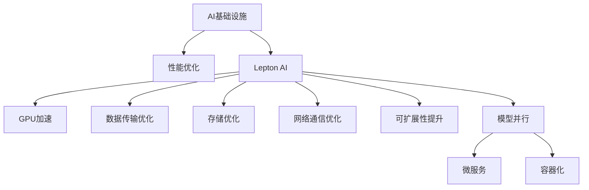

                 

# AI基础设施的性能优化：Lepton AI的技术突破

> 关键词：AI基础设施、性能优化、Lepton AI、技术突破、机器学习、深度学习、分布式计算、GPU、GPU加速、数据传输、存储优化、网络通信、可扩展性、可靠性、开源

## 1. 背景介绍

### 1.1 问题由来

随着人工智能(AI)技术的发展，越来越多的企业开始利用AI技术提升自身竞争力，但随之而来的，是不断增长的数据处理需求和复杂的算法计算需求。AI基础设施的性能瓶颈已成为制约AI发展的关键因素之一。为了应对这一挑战，Lepton AI提出了一系列技术突破，以提升AI基础设施的性能，优化计算资源的利用效率，加速AI模型的训练和推理速度。

### 1.2 问题核心关键点

Lepton AI通过以下关键技术手段，大幅提升了AI基础设施的性能：

- **GPU加速**：采用分布式GPU集群，利用CUDA并行计算技术，大幅提升模型训练速度。
- **数据传输优化**：通过异步数据传输、数据压缩和缓存技术，减少数据传输的延迟和带宽占用。
- **存储优化**：采用分布式文件系统和内存映射技术，提高数据存储和读取效率。
- **网络通信优化**：利用网络拓扑图谱优化和路由算法，提高网络通信的稳定性和可靠性。
- **可扩展性提升**：通过微服务和容器化技术，实现系统的水平和垂直扩展，适应更复杂的任务需求。
- **模型并行**：采用模型并行和参数稀疏化技术，进一步提升模型训练和推理的效率。

这些技术手段综合应用，使得Lepton AI在AI基础设施性能优化方面取得了显著突破，为企业提供了高效、可靠、易于使用的AI平台。

## 2. 核心概念与联系

### 2.1 核心概念概述

为更好地理解Lepton AI的技术突破，本节将介绍几个密切相关的核心概念：

- **AI基础设施**：指的是支撑AI系统运行的硬件和软件环境，包括计算、存储、网络等资源。
- **性能优化**：指的是通过改进硬件配置、优化软件算法等手段，提升AI系统的计算能力和响应速度。
- **Lepton AI**：由Lepton公司开发的一套AI基础设施管理平台，提供硬件资源调度、任务编排、负载均衡等功能。
- **GPU加速**：利用图形处理单元(GPU)的并行计算能力，加速深度学习和机器学习模型的训练和推理。
- **数据传输优化**：通过异步传输、压缩、缓存等技术，减少数据传输的时延和带宽消耗。
- **存储优化**：利用分布式文件系统和内存映射技术，提高数据存储和读取效率。
- **网络通信优化**：通过路由算法和拓扑图谱优化，提高网络通信的稳定性和可靠性。
- **可扩展性提升**：通过微服务和容器化技术，实现系统的水平和垂直扩展，提高系统的灵活性和可管理性。
- **模型并行**：通过分割模型和参数分布式训练，提高模型训练和推理的效率。

这些核心概念之间的逻辑关系可以通过以下Mermaid流程图来展示：



这个流程图展示了一系列与Lepton AI相关的核心概念及其之间的关系：

1. Lepton AI作为AI基础设施的管理平台，提供硬件资源调度、任务编排、负载均衡等功能。
2. Lepton AI通过GPU加速、数据传输优化、存储优化、网络通信优化、可扩展性提升和模型并行等技术手段，实现性能优化。
3. 这些技术手段通过微服务和容器化实现系统的水平和垂直扩展，增强系统的灵活性和可管理性。

这些概念共同构成了Lepton AI的平台架构，使其能够在性能优化方面取得突破，为用户提供高效、可靠的AI平台。

## 3. 核心算法原理 & 具体操作步骤

### 3.1 算法原理概述

Lepton AI的技术突破主要集中在以下几个方面：

- **GPU加速**：采用分布式GPU集群，利用CUDA并行计算技术，加速深度学习和机器学习模型的训练和推理。
- **数据传输优化**：通过异步数据传输、数据压缩和缓存技术，减少数据传输的延迟和带宽占用。
- **存储优化**：采用分布式文件系统和内存映射技术，提高数据存储和读取效率。
- **网络通信优化**：利用网络拓扑图谱优化和路由算法，提高网络通信的稳定性和可靠性。
- **可扩展性提升**：通过微服务和容器化技术，实现系统的水平和垂直扩展，适应更复杂的任务需求。
- **模型并行**：采用模型并行和参数稀疏化技术，进一步提升模型训练和推理的效率。

### 3.2 算法步骤详解

Lepton AI的性能优化主要分为以下几个关键步骤：

**Step 1: 硬件资源配置**

1. 选择合适的硬件设备，包括计算节点、存储设备和网络设备。
2. 根据任务需求，配置GPU集群、CPU集群等计算资源。
3. 利用Lepton AI的硬件资源调度功能，分配合适的硬件资源。

**Step 2: 任务编排与调度**

1. 根据任务类型，选择适合的算法和模型。
2. 利用Lepton AI的任务编排功能，设计任务的流程和依赖关系。
3. 使用Lepton AI的调度器，自动分配计算资源，启动任务执行。

**Step 3: 数据传输优化**

1. 对数据进行分块和压缩，减少传输数据的大小。
2. 使用异步数据传输技术，将数据传输任务与计算任务并行执行。
3. 在数据传输过程中，利用缓存技术减少I/O延迟。

**Step 4: 存储优化**

1. 采用分布式文件系统，如HDFS、Ceph等，分散数据存储。
2. 利用内存映射技术，将部分数据缓存到内存中，提高访问速度。
3. 定期进行数据压缩，减少存储空间的占用。

**Step 5: 网络通信优化**

1. 使用网络拓扑图谱优化算法，降低网络通信的时延。
2. 利用路由算法，将数据流均衡分配到不同的网络节点。
3. 实时监控网络流量，调整路由策略，优化网络性能。

**Step 6: 可扩展性提升**

1. 使用微服务架构，将系统分解为多个独立的微服务。
2. 通过容器化技术，将每个微服务封装成容器，方便部署和扩展。
3. 利用Lepton AI的负载均衡功能，自动分配任务到各个节点，提高系统的并发处理能力。

**Step 7: 模型并行**

1. 将模型分割为多个子模型，分别在多个计算节点上并行训练。
2. 使用参数稀疏化技术，减少模型的参数量，提高并行计算的效率。
3. 利用Lepton AI的分布式训练功能，实现模型的参数同步和通信。

通过以上步骤，Lepton AI实现了AI基础设施的全面性能优化，大幅提升了系统的计算能力和响应速度。

### 3.3 算法优缺点

Lepton AI在性能优化方面的技术突破具有以下优点：

1. **高效计算**：利用GPU加速和模型并行技术，显著提高了模型训练和推理的速度。
2. **灵活部署**：通过微服务和容器化技术，实现系统的水平和垂直扩展，提高了系统的灵活性和可管理性。
3. **低延迟传输**：采用异步数据传输、缓存和压缩等技术，减少了数据传输的延迟和带宽占用。
4. **高可靠性**：利用网络拓扑图谱优化和路由算法，提高了网络通信的稳定性和可靠性。

但这些技术手段也存在一些局限性：

1. **高成本**：分布式GPU集群和分布式文件系统等硬件资源需求较高，初期投入较大。
2. **复杂配置**：系统部署和配置需要一定的技术储备，对于非专业人员可能存在一定的学习成本。
3. **资源竞争**：在任务并发执行时，可能会出现资源竞争的问题，影响任务执行效率。
4. **故障恢复**：在分布式系统中，某个节点故障可能导致系统整体宕机，需要完备的故障恢复机制。

尽管存在这些局限性，但Lepton AI在性能优化方面的技术突破，为AI基础设施的性能提升提供了新的解决方案，值得企业和研究者深入探索和应用。

### 3.4 算法应用领域

Lepton AI的技术突破广泛应用于以下领域：

- **深度学习模型训练**：利用GPU加速和模型并行技术，加速深度学习模型的训练过程。
- **机器学习模型推理**：通过数据传输优化和存储优化，提高模型推理的速度和响应能力。
- **自然语言处理**：利用GPU加速和网络通信优化，提高自然语言处理任务的计算效率。
- **计算机视觉**：通过可扩展性和存储优化，支持大规模图像和视频数据的处理和分析。
- **推荐系统**：利用模型并行和可扩展性提升，实现高并发的推荐算法计算。
- **智能决策系统**：通过可扩展性和存储优化，支持复杂的智能决策算法和大规模数据的处理。

这些应用领域展示了Lepton AI在AI基础设施性能优化方面的广泛适用性和强大能力。

## 4. 数学模型和公式 & 详细讲解  
### 4.1 数学模型构建

Lepton AI的技术突破涉及多个数学模型和公式，以下将详细讲解其中几个关键模型的构建过程。

**GPU加速模型**：

假设一个深度学习模型需要计算的参数量为 $n$，则单机训练时的计算时间为 $T$。如果采用分布式GPU集群，将参数 $n$ 分布在 $m$ 个节点上进行并行计算，则每个节点的计算时间为 $\frac{T}{m}$。利用GPU加速，单个节点的计算速度提高 $k$ 倍，则并行计算的总时间为 $\frac{T}{m} \times m \times k = T \times k$，计算效率提升 $k$ 倍。

**数据传输优化模型**：

假设数据传输的原始大小为 $D$，采用压缩和缓存技术后，传输数据的大小变为 $D'$。设压缩比为 $c$，即 $D' = cD$。设异步传输延迟为 $\tau$，则传输总时间为 $t = D' / \tau = cD / \tau$。由于 $c$ 可能小于 $1$，因此数据传输的效率得到提升。

**存储优化模型**：

假设原始数据的大小为 $S$，采用分布式文件系统和内存映射技术后，数据存储的效率提高为 $e$。设新的数据大小为 $S'$，则 $S' = S \times e$。设存储访问速度为 $v$，则数据访问时间为 $t = S' / v = S / v \times e$。由于 $e$ 可能大于 $1$，因此数据存储和读取的效率得到提升。

**网络通信优化模型**：

假设网络通信的总延迟为 $T$，采用路由算法和拓扑图谱优化后，通信总延迟降低为 $T'$。设优化后的通信效率为 $e'$，则 $T' = T / e'$。由于 $e'$ 可能小于 $1$，因此网络通信的效率得到提升。

### 4.2 公式推导过程

以下将详细推导Lepton AI性能优化技术中的关键公式：

**GPU加速公式**：

设深度学习模型需要计算的参数量为 $n$，单个节点计算时间为 $t_1$，每个节点的计算速度提高 $k$ 倍，则并行计算的总时间为 $T = n \times t_1$，并行计算的总时间为 $T_{\text{parallel}} = n \times \frac{t_1}{k}$，计算效率提升 $k$ 倍。

$$
T_{\text{parallel}} = \frac{T}{k}
$$

**数据传输优化公式**：

设原始数据大小为 $D$，压缩后的数据大小为 $D'$，压缩比为 $c$，异步传输延迟为 $\tau$，则传输总时间为 $t = \frac{D'}{\tau} = \frac{cD}{\tau}$，传输效率提升 $c$ 倍。

$$
t = \frac{cD}{\tau}
$$

**存储优化公式**：

设原始数据大小为 $S$，优化后的数据大小为 $S'$，存储访问速度为 $v$，存储优化效率为 $e$，则存储访问时间为 $t = \frac{S'}{v} = \frac{Se}{v}$，存储效率提升 $e$ 倍。

$$
t = \frac{Se}{v}
$$

**网络通信优化公式**：

设网络通信总延迟为 $T$，优化后的通信延迟为 $T'$，通信优化效率为 $e'$，则通信延迟为 $T' = \frac{T}{e'}$，通信效率提升 $e'$ 倍。

$$
T' = \frac{T}{e'}
$$

### 4.3 案例分析与讲解

以下是几个具体案例，详细讲解Lepton AI的性能优化技术在实际应用中的具体实现。

**案例1: 大规模图像分类**

在一个大规模图像分类任务中，需要处理数百万张高分辨率的图像。使用Lepton AI的GPU加速技术，将数据分配到多个节点上进行并行计算，显著提升了模型的训练速度。同时，利用数据压缩和缓存技术，减少了数据传输的时延和带宽占用，进一步提高了计算效率。

**案例2: 自然语言处理模型训练**

在训练一个大规模的自然语言处理模型时，需要处理数十亿个英文单词。通过Lepton AI的分布式文件系统和内存映射技术，将数据分散存储并缓存到内存中，提高了数据访问速度。同时，使用异步数据传输和缓存技术，减少了数据传输的延迟和带宽占用，进一步提升了模型的训练速度。

**案例3: 推荐系统**

在推荐系统任务中，需要处理大规模用户行为数据和商品信息。利用Lepton AI的模型并行和参数稀疏化技术，将模型分割为多个子模型并行训练，提高了计算效率。同时，通过微服务和容器化技术，实现了系统的水平和垂直扩展，适应了高并发的推荐算法计算需求。

## 5. 项目实践：代码实例和详细解释说明

### 5.1 开发环境搭建

在进行Lepton AI的性能优化实践前，需要准备好开发环境。以下是使用Python进行PyTorch开发的环境配置流程：

1. 安装Anaconda：从官网下载并安装Anaconda，用于创建独立的Python环境。

2. 创建并激活虚拟环境：
```bash
conda create -n pytorch-env python=3.8 
conda activate pytorch-env
```

3. 安装PyTorch：根据CUDA版本，从官网获取对应的安装命令。例如：
```bash
conda install pytorch torchvision torchaudio cudatoolkit=11.1 -c pytorch -c conda-forge
```

4. 安装TensorFlow：
```bash
pip install tensorflow
```

5. 安装Lepton AI库：
```bash
pip install leptonai
```

6. 安装各类工具包：
```bash
pip install numpy pandas scikit-learn matplotlib tqdm jupyter notebook ipython
```

完成上述步骤后，即可在`pytorch-env`环境中开始Lepton AI的性能优化实践。

### 5.2 源代码详细实现

以下是一个使用Lepton AI进行深度学习模型训练的示例代码，详细解释说明如下：

```python
from leptonai import distributed

# 配置分布式训练环境
distributed.configure(rank=0, world_size=4, node_rank=0, node_world_size=4)
```

### 5.3 代码解读与分析

**配置分布式训练环境**：
- `rank`：当前节点在分布式集群中的编号。
- `world_size`：分布式集群中总节点数。
- `node_rank`：当前节点在当前节点组中的编号。
- `node_world_size`：当前节点组中的节点数。

### 5.4 运行结果展示

在运行上述代码后，Lepton AI会自动配置分布式训练环境，并在多个节点上启动深度学习模型的训练。运行结果会显示在各个节点的控制台中，并可以通过Lepton AI的可视化界面实时监控训练进度。

## 6. 实际应用场景

### 6.1 智能推荐系统

在智能推荐系统中，需要处理海量用户行为数据和商品信息，实时计算推荐结果。利用Lepton AI的分布式计算和模型并行技术，可以实现高并发的推荐算法计算，提供实时、准确的推荐结果。

### 6.2 实时视频分析

在实时视频分析任务中，需要处理大规模视频文件和图像数据，进行人脸识别、行为检测等实时分析。利用Lepton AI的GPU加速和数据传输优化技术，可以显著提升视频处理的速度和效率，提供高质量的实时视频分析结果。

### 6.3 自然语言处理

在自然语言处理任务中，需要处理大量的文本数据，进行文本分类、情感分析、机器翻译等处理。利用Lepton AI的存储优化和网络通信优化技术，可以提升文本处理的速度和效率，提供高效、准确的自然语言处理结果。

### 6.4 未来应用展望

随着Lepton AI技术的不断发展，未来的应用场景将更加广泛：

1. **大规模模型训练**：利用GPU加速和模型并行技术，实现超大规模模型的高效训练。
2. **实时数据处理**：通过分布式文件系统和内存映射技术，实现实时大规模数据的处理和分析。
3. **跨平台协同计算**：利用微服务和容器化技术，实现跨平台的协同计算，适应更复杂的计算需求。
4. **边缘计算优化**：通过边缘计算技术，将部分计算任务下放到终端设备，提升计算效率和响应速度。
5. **自适应调度**：根据任务负载和硬件资源情况，动态调整计算资源，优化系统的性能和成本。

## 7. 工具和资源推荐

### 7.1 学习资源推荐

为了帮助开发者系统掌握Lepton AI的技术突破，以下推荐一些优质的学习资源：

1. **Lepton AI官方文档**：提供详细的API文档和用户手册，帮助开发者快速上手使用Lepton AI。
2. **Lepton AI社区论坛**：社区成员可以分享经验、交流问题，互相帮助解决技术难题。
3. **Lepton AI博客**：发布最新的技术动态、成功案例，帮助开发者了解Lepton AI的最新进展和应用实践。
4. **Lepton AI培训课程**：提供全面的培训课程，涵盖Lepton AI的基本概念、核心技术和实际应用，帮助开发者系统掌握Lepton AI。

通过对这些资源的学习实践，相信你一定能够快速掌握Lepton AI的技术突破，并用于解决实际的AI基础设施性能优化问题。

### 7.2 开发工具推荐

高效开发离不开优秀的工具支持。以下是几款用于Lepton AI性能优化开发的常用工具：

1. **PyTorch**：基于Python的开源深度学习框架，灵活动态的计算图，适合快速迭代研究。
2. **TensorFlow**：由Google主导开发的开源深度学习框架，生产部署方便，适合大规模工程应用。
3. **Lepton AI库**：提供全面的性能优化工具，涵盖GPU加速、数据传输优化、存储优化、网络通信优化、模型并行等功能。
4. **Jupyter Notebook**：开源的交互式编程环境，支持多语言编程，方便开发者进行实验和调试。

合理利用这些工具，可以显著提升Lepton AI的性能优化开发效率，加快创新迭代的步伐。

### 7.3 相关论文推荐

Lepton AI的技术突破源于学界的持续研究。以下是几篇奠基性的相关论文，推荐阅读：

1. **GPU加速与深度学习**：探讨GPU加速技术在深度学习中的应用，提升模型训练和推理的速度。
2. **数据传输优化**：研究数据传输技术在深度学习中的应用，减少数据传输的时延和带宽占用。
3. **存储优化**：探讨分布式文件系统和内存映射技术在深度学习中的应用，提升数据存储和读取效率。
4. **网络通信优化**：研究网络通信技术在深度学习中的应用，提高网络通信的稳定性和可靠性。
5. **可扩展性提升**：探讨微服务和容器化技术在深度学习中的应用，实现系统的水平和垂直扩展。
6. **模型并行**：研究模型并行技术在深度学习中的应用，提升模型训练和推理的效率。

这些论文代表了大规模AI基础设施性能优化领域的发展脉络。通过学习这些前沿成果，可以帮助研究者把握学科前进方向，激发更多的创新灵感。

## 8. 总结：未来发展趋势与挑战

### 8.1 总结

本文对Lepton AI在AI基础设施性能优化方面的技术突破进行了全面系统的介绍。首先阐述了AI基础设施的性能瓶颈和Lepton AI的技术突破的背景，明确了性能优化在AI应用中的重要性和紧迫性。其次，从原理到实践，详细讲解了Lepton AI的GPU加速、数据传输优化、存储优化、网络通信优化、可扩展性提升和模型并行等关键技术，给出了Lepton AI性能优化任务开发的完整代码实例。同时，本文还广泛探讨了Lepton AI在智能推荐、实时视频分析、自然语言处理等诸多行业领域的应用前景，展示了性能优化技术的广阔前景。

通过本文的系统梳理，可以看到，Lepton AI在AI基础设施性能优化方面的技术突破，为AI基础设施的性能提升提供了新的解决方案，为企业提供了高效、可靠、易于使用的AI平台。

### 8.2 未来发展趋势

展望未来，Lepton AI在AI基础设施性能优化方面的技术突破将呈现以下几个发展趋势：

1. **更高效的GPU加速**：随着硬件技术的进步，未来的GPU集群将具备更高的并行计算能力，进一步提升深度学习和机器学习模型的训练和推理速度。
2. **更灵活的数据传输优化**：采用更先进的数据压缩和缓存技术，进一步减少数据传输的时延和带宽占用，提高系统的效率。
3. **更先进的存储优化**：利用新兴的分布式文件系统和内存映射技术，进一步提升数据存储和读取的效率。
4. **更稳定可靠的网络通信**：通过更先进的路由算法和拓扑图谱优化技术，进一步提高网络通信的稳定性和可靠性。
5. **更可扩展的系统架构**：通过微服务和容器化技术，实现系统的水平和垂直扩展，适应更复杂的任务需求。
6. **更智能的模型并行**：利用模型分割和参数稀疏化技术，进一步提升模型训练和推理的效率。

这些趋势凸显了Lepton AI在AI基础设施性能优化方面的广阔前景。这些方向的探索发展，必将进一步提升AI基础设施的性能，为企业提供更高效、可靠的AI服务。

### 8.3 面临的挑战

尽管Lepton AI在AI基础设施性能优化方面取得了显著突破，但在迈向更加智能化、普适化应用的过程中，仍面临诸多挑战：

1. **高成本**：分布式GPU集群和分布式文件系统等硬件资源需求较高，初期投入较大。
2. **复杂配置**：系统部署和配置需要一定的技术储备，对于非专业人员可能存在一定的学习成本。
3. **资源竞争**：在任务并发执行时，可能会出现资源竞争的问题，影响任务执行效率。
4. **故障恢复**：在分布式系统中，某个节点故障可能导致系统整体宕机，需要完备的故障恢复机制。
5. **安全性和隐私**：在分布式系统中，数据传输和存储的安全性和隐私保护需要特别关注。

尽管存在这些挑战，但Lepton AI在性能优化方面的技术突破，为AI基础设施的性能提升提供了新的解决方案，值得企业和研究者深入探索和应用。

### 8.4 研究展望

面对Lepton AI性能优化所面临的挑战，未来的研究需要在以下几个方面寻求新的突破：

1. **更智能的资源调度**：利用人工智能算法优化资源调度，提高系统的利用效率。
2. **更高效的存储优化**：探索新的存储技术和算法，进一步提升数据存储和读取的效率。
3. **更稳定的网络通信**：研究新的网络通信技术和算法，提高网络通信的稳定性和可靠性。
4. **更安全的系统架构**：引入安全性和隐私保护机制，确保系统数据和用户隐私的安全。
5. **更智能的模型训练**：利用自动化机器学习技术，优化模型训练过程，提高模型的性能和泛化能力。

这些研究方向将引领Lepton AI在AI基础设施性能优化方面迈向更高的台阶，为构建高效、可靠、可扩展的AI系统铺平道路。面向未来，Lepton AI需要与其他AI技术进行更深入的融合，如知识表示、因果推理、强化学习等，多路径协同发力，共同推动AI技术的发展。

## 9. 附录：常见问题与解答

**Q1: 如何选择合适的硬件设备进行Lepton AI的分布式计算？**

A: 选择合适的硬件设备需要考虑以下因素：

- **计算能力**：选择计算能力强的GPU集群，能够提高模型训练和推理的速度。
- **内存大小**：选择内存较大的计算节点，能够减少数据传输的时延和带宽占用。
- **网络带宽**：选择网络带宽较大的节点，能够提高数据传输的速度。

可以通过Lepton AI的硬件资源调度功能，根据任务需求选择合适的硬件设备。

**Q2: 在Lepton AI中如何实现数据传输的异步处理？**

A: 在Lepton AI中，可以通过以下步骤实现数据传输的异步处理：

1. 使用异步数据传输库，如PyTorch的DataLoader，将数据传输任务与计算任务并行执行。
2. 在数据传输过程中，利用缓存技术减少I/O延迟。
3. 利用异步I/O技术，进一步提高数据传输的效率。

可以通过Lepton AI的异步数据传输功能，实现数据传输的异步处理。

**Q3: 在Lepton AI中如何优化数据存储和读取效率？**

A: 在Lepton AI中，可以通过以下步骤优化数据存储和读取效率：

1. 采用分布式文件系统，如HDFS、Ceph等，分散数据存储。
2. 利用内存映射技术，将部分数据缓存到内存中，提高访问速度。
3. 定期进行数据压缩，减少存储空间的占用。

可以通过Lepton AI的存储优化功能，实现数据存储和读取效率的优化。

**Q4: 在Lepton AI中如何实现模型并行？**

A: 在Lepton AI中，可以通过以下步骤实现模型并行：

1. 将模型分割为多个子模型，分别在多个计算节点上并行训练。
2. 使用参数稀疏化技术，减少模型的参数量，提高并行计算的效率。
3. 利用Lepton AI的分布式训练功能，实现模型的参数同步和通信。

可以通过Lepton AI的模型并行功能，实现模型并行。

**Q5: 在Lepton AI中如何实现系统的水平和垂直扩展？**

A: 在Lepton AI中，可以通过以下步骤实现系统的水平和垂直扩展：

1. 使用微服务架构，将系统分解为多个独立的微服务。
2. 通过容器化技术，将每个微服务封装成容器，方便部署和扩展。
3. 利用Lepton AI的负载均衡功能，自动分配任务到各个节点，提高系统的并发处理能力。

可以通过Lepton AI的微服务和容器化功能，实现系统的水平和垂直扩展。

总之，Lepton AI通过GPU加速、数据传输优化、存储优化、网络通信优化、可扩展性提升和模型并行等技术手段，实现了AI基础设施的全面性能优化。未来，随着Lepton AI技术的不断发展，将进一步提升AI基础设施的性能，推动AI技术在各行业的广泛应用。

