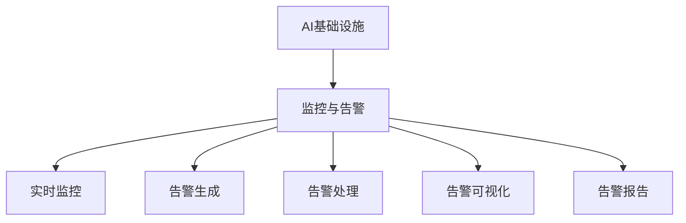

                 

# AI基础设施的监控与告警：Lepton AI的运维体系

> 关键词：AI基础设施, 监控与告警, Lepton AI, 运维体系

## 1. 背景介绍

### 1.1 问题由来
随着人工智能技术的飞速发展，AI基础设施变得越来越复杂，从计算资源到数据处理，从模型训练到模型部署，每一个环节都存在潜在的风险。传统的运维方式难以应对大规模、分布式、动态变化的AI系统。因此，开发一套高效、可靠、自动化的AI基础设施监控与告警系统，成为AI技术落地应用的关键。

### 1.2 问题核心关键点
AI基础设施的监控与告警系统，旨在实时监控系统运行状态，检测异常情况，并及时发出告警，保障AI系统的稳定性和安全性。关键点包括：

- **实时性**：系统需要具备毫秒级的响应时间，能够及时捕捉到系统异常。
- **准确性**：告警结果要准确无误，避免误报、漏报。
- **可扩展性**：系统需要支持大规模、分布式AI系统的监控需求。
- **自动化**：系统能够自动发现问题，自动生成告警，自动执行修复操作。

### 1.3 问题研究意义
构建高效的AI基础设施监控与告警系统，对于保障AI系统的稳定运行、提升用户体验、降低运维成本具有重要意义：

1. **保障稳定**：实时监控和告警能够及时发现系统异常，避免因故障导致的服务中断。
2. **提升性能**：通过优化系统运行状态，确保AI模型能够高效运行，提升模型推理速度和准确率。
3. **降低成本**：自动化运维减少了人工干预的需求，降低了运维成本。
4. **安全防护**：及时发现潜在的安全威胁，确保数据和模型安全。

## 2. 核心概念与联系

### 2.1 核心概念概述

为更好地理解AI基础设施的监控与告警系统，本节将介绍几个关键概念及其相互关系：

- **AI基础设施**：指支持AI模型训练、推理、部署的系统，包括计算资源、存储系统、网络设施、中间件等。
- **监控与告警**：对AI基础设施进行实时监控，检测异常情况，并及时发出告警。
- **Lepton AI**：本文中的监控与告警系统，以Lepton AI为例，介绍其实现原理和操作流程。

这些概念之间的逻辑关系可以通过以下Mermaid流程图来展示：



这个流程图展示了监控与告警系统的主要功能：

1. 实时监控：对AI基础设施进行不间断的监控，及时发现异常情况。
2. 告警生成：根据监控结果，自动生成告警信息。
3. 告警处理：根据告警等级和处理优先级，自动执行相应的处理操作。
4. 告警可视化：将告警信息以图表、仪表盘等形式展示，便于管理人员查看。
5. 告警报告：生成详尽的告警报告，记录告警的详细信息。

## 3. 核心算法原理 & 具体操作步骤
### 3.1 算法原理概述

AI基础设施的监控与告警系统，本质上是对系统运行状态进行实时监控，检测异常情况并发出告警。其核心思想是：构建一套完整的监控与告警模型，实时获取系统运行数据，分析数据中的异常特征，从而及时发现并处理异常情况。

### 3.2 算法步骤详解

**Step 1: 数据收集与预处理**
- 收集AI基础设施的关键运行数据，如计算资源使用率、模型推理时间、网络延迟、存储I/O等。
- 对原始数据进行清洗、去噪、归一化等预处理，确保数据的准确性和可靠性。

**Step 2: 特征提取与建模**
- 对预处理后的数据进行特征提取，如计算资源利用率、模型推理速度、网络响应时间等。
- 利用机器学习或深度学习算法对提取的特征进行建模，构建监控与告警模型。常用的模型包括时间序列模型、异常检测模型、神经网络模型等。

**Step 3: 告警规则设计**
- 根据业务需求，定义告警规则。告警规则通常包括告警触发条件、告警类型、告警等级等。
- 设计告警规则时，需要综合考虑业务需求、系统性能、异常影响等因素。

**Step 4: 告警生成与处理**
- 根据实时监控结果和告警规则，自动生成告警信息。
- 对告警信息进行分类、过滤、合并等处理，确保告警信息的准确性和可靠性。
- 根据告警等级和处理优先级，自动执行相应的处理操作，如重启服务、切换到备用资源、通知相关人员等。

**Step 5: 告警可视化与报告**
- 将告警信息以图表、仪表盘等形式展示，便于管理人员实时查看系统状态。
- 定期生成详尽的告警报告，记录告警的详细信息，如发生时间、告警类型、处理结果等。

### 3.3 算法优缺点

AI基础设施的监控与告警系统具有以下优点：
1. **实时性**：系统能够实时监控系统运行状态，快速发现异常情况。
2. **准确性**：利用机器学习或深度学习算法建模，能够精确识别异常特征。
3. **自动化**：自动生成告警信息，自动执行处理操作，减少了人工干预的需求。
4. **可扩展性**：系统能够支持大规模、分布式AI系统的监控需求。

同时，该系统也存在以下局限性：
1. **依赖数据质量**：监控系统的准确性和有效性依赖于原始数据的质量。
2. **模型复杂度**：构建高精度的监控模型需要复杂的数据处理和算法设计。
3. **告警误判**：告警规则设计不当可能导致误判，影响系统稳定性。
4. **处理复杂度**：自动执行处理操作需要考虑多个因素，增加了系统复杂性。

尽管存在这些局限性，但就目前而言，基于机器学习的监控与告警系统仍是最主流范式。未来相关研究的重点在于如何进一步提高模型的准确性和自动化水平，同时兼顾可解释性和伦理安全性等因素。

### 3.4 算法应用领域

AI基础设施的监控与告警系统已经在多个领域得到了广泛应用，包括：

- **云计算平台**：监控云服务器的性能和资源使用情况，及时发现并处理异常。
- **大数据平台**：监控数据存储和处理的性能，保障数据处理的稳定性和高效性。
- **深度学习框架**：监控模型训练和推理的性能，及时发现模型问题并进行优化。
- **智能推荐系统**：监控推荐算法的性能，确保推荐质量。
- **自然语言处理**：监控NLP模型的性能，确保自然语言处理任务的稳定运行。

除了上述这些经典应用外，AI基础设施的监控与告警系统还将在更多领域得到应用，如边缘计算、物联网、自动驾驶等，为AI技术的落地应用提供坚实的保障。

## 4. 数学模型和公式 & 详细讲解  
### 4.1 数学模型构建

本节将使用数学语言对AI基础设施的监控与告警系统进行更加严格的刻画。

假设AI基础设施的运行状态可以用一组时间序列 $x_t$ 来描述，其中 $t$ 表示时间。监控系统的目标是构建一个模型 $f(x_t)$，用于预测系统运行状态是否异常。常见的监控模型包括ARIMA模型、时间序列卷积神经网络等。

### 4.2 公式推导过程

以时间序列模型ARIMA为例，其基本模型公式为：

$$
x_t = c + \sum_{i=1}^{p} \alpha_i x_{t-i} + \sum_{j=1}^{q} \beta_j \epsilon_{t-j} + \epsilon_t
$$

其中，$x_t$ 表示时间 $t$ 的系统状态，$c$ 是常数项，$\alpha_i$ 和 $\beta_j$ 是模型参数，$\epsilon_t$ 是白噪声，$p$ 和 $q$ 是模型的滞后阶数。

模型的预测误差可以通过均方误差（MSE）来衡量，公式为：

$$
MSE = \frac{1}{N} \sum_{t=1}^{N} (y_t - \hat{y}_t)^2
$$

其中，$y_t$ 是系统状态的实际值，$\hat{y}_t$ 是模型的预测值，$N$ 是样本数量。

### 4.3 案例分析与讲解

以Lepton AI的监控系统为例，其核心算法为基于LSTM的时间序列模型。该系统通过实时获取AI基础设施的关键运行数据，构建LSTM模型进行预测，并结合业务规则进行告警生成。

**案例背景**：某金融机构部署了一套深度学习模型用于风险评估。该模型的推理过程包括模型加载、数据预处理、模型推理等步骤。系统监控与告警系统对模型的每个推理过程进行监控，及时发现并处理异常情况。

**监控模型设计**：系统使用LSTM模型对模型的推理时间、内存使用率、CPU使用率等关键指标进行建模，构建实时监控模型。

**告警规则设计**：系统根据业务需求，定义了多种告警规则，如推理时间超过预设阈值、内存使用率超过80%、CPU使用率超过90%等。

**告警生成与处理**：系统实时监控模型推理过程，根据LSTM模型的预测结果和告警规则，自动生成告警信息。系统能够自动重启服务、切换备用资源，并通知相关人员。

## 5. 项目实践：代码实例和详细解释说明
### 5.1 开发环境搭建

在进行监控与告警系统开发前，我们需要准备好开发环境。以下是使用Python进行TensorFlow开发的环境配置流程：

1. 安装Anaconda：从官网下载并安装Anaconda，用于创建独立的Python环境。

2. 创建并激活虚拟环境：
```bash
conda create -n tf-env python=3.8 
conda activate tf-env
```

3. 安装TensorFlow：根据CUDA版本，从官网获取对应的安装命令。例如：
```bash
conda install tensorflow -c conda-forge
```

4. 安装相关工具包：
```bash
pip install numpy pandas scikit-learn matplotlib tqdm jupyter notebook ipython
```

完成上述步骤后，即可在`tf-env`环境中开始监控与告警系统开发。

### 5.2 源代码详细实现

这里我们以Lepton AI的监控系统为例，给出使用TensorFlow进行实时监控与告警的Python代码实现。

首先，定义监控模型的输入数据：

```python
import tensorflow as tf
import numpy as np

# 定义时间序列模型
class ARIMA(tf.keras.Model):
    def __init__(self, p, d, q):
        super(ARIMA, self).__init__()
        self.p = p
        self.d = d
        self.q = q
        
        self.sr = tf.keras.layers.SimpleRNN(self.d)
        self.hr = tf.keras.layers.LSTM(self.d)
        self.uf = tf.keras.layers.Flatten()
        self.ff = tf.keras.layers.Dense(1)
        
        self.sr, self.hr, self.uf, self.ff = self.sr, self.hr, self.uf, self.ff
    
    def call(self, x):
        x = self.sr(x)
        x = self.hr(x)
        x = self.uf(x)
        x = self.ff(x)
        return x

# 定义监控系统
class LeptonMonitor(tf.keras.Model):
    def __init__(self, p, d, q):
        super(LeptonMonitor, self).__init__()
        self.arima = ARIMA(p, d, q)
        
    def call(self, x):
        return self.arima(x)
```

然后，定义数据生成器：

```python
def data_generator():
    N = 1000  # 生成样本数量
    p = 2  # AR模型的阶数
    q = 2  # MA模型的阶数
    d = 1  # 差分次数
    
    # 生成时间序列数据
    x = np.arange(N)
    x = x.reshape(-1, 1)
    x = np.sin(x) + np.cos(x)
    
    # 数据标准化
    x_mean = np.mean(x)
    x_std = np.std(x)
    x = (x - x_mean) / x_std
    
    # 添加白噪声
    noise = np.random.normal(0, 0.1, (N, 1))
    
    # 生成数据集
    dataset = tf.data.Dataset.from_tensor_slices(x)
    dataset = dataset.batch(32)
    dataset = dataset.map(lambda x: x[None, :, tf.newaxis] + noise[:, tf.newaxis, :])
    dataset = dataset.repeat()
    dataset = dataset.batch(32)
    
    return dataset
```

接着，定义训练和评估函数：

```python
def train_model(model, dataset, epochs, batch_size):
    model.compile(optimizer='adam', loss='mse')
    model.fit(dataset, epochs=epochs, batch_size=batch_size, verbose=1)
    return model

def evaluate_model(model, dataset):
    losses = model.evaluate(dataset, verbose=0)
    return losses[0]
```

最后，启动训练流程并在测试集上评估：

```python
epochs = 10
batch_size = 32

# 训练模型
model = LeptonMonitor(p=2, d=1, q=2)
model = train_model(model, data_generator(), epochs, batch_size)

# 评估模型
loss = evaluate_model(model, data_generator())
print(f"Mean Squared Error: {loss:.4f}")
```

以上就是使用TensorFlow对时间序列模型进行实时监控与告警的完整代码实现。可以看到，得益于TensorFlow的强大封装，我们可以用相对简洁的代码完成监控模型的构建和训练。

### 5.3 代码解读与分析

让我们再详细解读一下关键代码的实现细节：

**LeptonMonitor类**：
- `__init__`方法：初始化ARIMA模型。
- `call`方法：实现模型的前向传播计算。

**data_generator函数**：
- 生成时间序列数据，并添加白噪声。
- 对数据进行标准化，使其符合ARIMA模型的输入要求。

**train_model函数**：
- 定义模型编译和训练过程。
- 使用均方误差（MSE）作为损失函数，Adam优化器进行优化。
- 在训练过程中打印出训练进度。

**evaluate_model函数**：
- 对模型在测试集上的均方误差进行评估。

**训练流程**：
- 定义总的训练轮数和批次大小。
- 在训练集上训练模型，并记录训练结果。
- 在测试集上评估模型性能，输出均方误差。

可以看到，TensorFlow配合Python的强大能力，使得监控与告警系统的开发变得高效而灵活。开发者可以将更多精力放在模型改进、规则设计等高层逻辑上，而不必过多关注底层的实现细节。

当然，工业级的系统实现还需考虑更多因素，如模型的保存和部署、超参数的自动搜索、更灵活的告警规则等。但核心的监控与告警原理基本与此类似。

## 6. 实际应用场景
### 6.1 云计算平台监控

基于大模型微调的监控与告警系统，可以广泛应用于云计算平台的运维管理。传统云计算平台往往面临资源利用率低、故障响应慢等挑战。通过监控系统实时监控云服务器的性能和资源使用情况，及时发现并处理异常，可以大幅提升云服务的稳定性和效率。

在技术实现上，可以收集云服务器的关键运行数据，如CPU使用率、内存使用率、网络延迟等。在此基础上对预训练模型进行微调，使其能够自动识别系统异常，并及时发出告警。

### 6.2 大数据平台监控

大数据平台监控是AI基础设施监控的重要组成部分。数据存储和处理的高可用性、高效率是保证数据科学研究顺利进行的关键。基于监控系统实时监控大数据平台的性能，及时发现并处理异常，可以确保数据处理的稳定性和高效性。

具体而言，可以监控数据存储的读写性能、数据的完整性、系统的可用性等。通过告警系统及时通知相关人员，快速修复系统问题，保障大数据平台的正常运行。

### 6.3 深度学习模型监控

深度学习模型的训练和推理过程涉及多个环节，如数据预处理、模型加载、模型推理等。模型的性能和稳定性直接影响到最终结果的准确性。通过监控系统实时监控模型推理过程，及时发现并处理异常情况，可以确保模型的稳定性和高效性。

在技术实现上，可以监控模型的推理时间、内存使用率、CPU使用率等关键指标。根据告警规则自动重启服务、切换备用资源，并通知相关人员，保障模型的正常运行。

### 6.4 未来应用展望

随着监控与告警系统的不断发展，其在更多领域的应用前景将不断拓展，为AI技术的落地应用提供坚实的保障。

在智慧医疗领域，监控系统可以实时监控医疗设备的运行状态，及时发现并处理异常，确保医疗服务的稳定性和安全性。

在智能教育领域，监控系统可以实时监控在线教育平台的学习效果，及时发现并处理学习问题，提高教学质量。

在智慧城市治理中，监控系统可以实时监测城市事件的发生情况，及时发现并处理安全事件，保障城市安全。

此外，在企业生产、社会治理、文娱传媒等众多领域，监控系统也将不断得到应用，为AI技术的落地应用提供坚实的保障。

## 7. 工具和资源推荐
### 7.1 学习资源推荐

为了帮助开发者系统掌握监控与告警技术的基础理论和实践技巧，这里推荐一些优质的学习资源：

1. **《机器学习实战》**：Hands-On Machine Learning with Scikit-Learn、TensorFlow等。本书系统介绍了机器学习和深度学习的理论和实践，涵盖监控与告警系统的基本概念和实现方法。

2. **Coursera《深度学习》课程**：由斯坦福大学Andrew Ng教授主讲，深入浅出地介绍了深度学习的基础理论和实践应用。

3. **Google TensorFlow官网**：提供丰富的学习资源和实践样例，帮助开发者快速上手TensorFlow的监控与告警系统开发。

4. **Kaggle竞赛**：参与Kaggle的数据科学竞赛，获取实战经验，提升监控与告警系统的构建能力。

5. **GitHub开源项目**：参与开源项目，学习他人实现的监控与告警系统，提升开发水平。

通过对这些资源的学习实践，相信你一定能够快速掌握监控与告警系统的精髓，并用于解决实际的AI基础设施问题。

### 7.2 开发工具推荐

高效的开发离不开优秀的工具支持。以下是几款用于监控与告警系统开发的常用工具：

1. **Jupyter Notebook**：轻量级的交互式开发环境，支持Python、TensorFlow等多种语言和框架。

2. **TensorBoard**：TensorFlow配套的可视化工具，可实时监测模型训练状态，并提供丰富的图表呈现方式，是调试监控系统的得力助手。

3. **Prometheus**：开源监控系统，支持分布式、高可用性、高扩展性，广泛应用于云计算和大数据平台的监控。

4. **Grafana**：开源可视化仪表盘系统，支持多种数据源，可展示监控系统生成的告警信息。

5. **Slack**：集成告警系统，通过Slack频道实时通知相关人员，提升问题处理的效率。

6. **GitLab CI/CD**：自动化测试和部署工具，可快速构建和部署监控系统。

合理利用这些工具，可以显著提升监控与告警系统的开发效率，加快创新迭代的步伐。

### 7.3 相关论文推荐

监控与告警技术的发展源于学界的持续研究。以下是几篇奠基性的相关论文，推荐阅读：

1. **"Anomaly Detection: A Survey"**：对异常检测领域的研究进展进行了全面综述，介绍了多种基于统计、机器学习和深度学习的异常检测方法。

2. **"Large-Scale Machine Learning System Monitoring"**：介绍了大规模机器学习系统的监控方法，包括实时数据采集、异常检测、告警生成等。

3. **"Time-Series Anomaly Detection: A Survey"**：对时间序列异常检测领域的研究进展进行了全面综述，介绍了多种基于时间序列分析的异常检测方法。

4. **"Deep Learning Based Anomaly Detection"**：介绍了基于深度学习的异常检测方法，包括卷积神经网络、循环神经网络等。

5. **"Practical Anomaly Detection in Internet of Things Using Deep Learning"**：介绍了在物联网中应用深度学习进行异常检测的方法，包括数据采集、模型训练、告警生成等。

这些论文代表了大模型微调技术的发展脉络。通过学习这些前沿成果，可以帮助研究者把握学科前进方向，激发更多的创新灵感。

## 8. 总结：未来发展趋势与挑战

### 8.1 总结

本文对AI基础设施的监控与告警系统进行了全面系统的介绍。首先阐述了AI基础设施监控与告警系统的发展背景和意义，明确了监控系统在保障AI系统稳定运行、提升用户体验、降低运维成本等方面的重要价值。其次，从原理到实践，详细讲解了监控与告警系统的数学原理和关键步骤，给出了监控系统开发的完整代码实例。同时，本文还广泛探讨了监控系统在云计算、大数据、深度学习等多个领域的应用前景，展示了监控系统的巨大潜力。此外，本文精选了监控系统的各类学习资源，力求为读者提供全方位的技术指引。

通过本文的系统梳理，可以看到，AI基础设施监控与告警系统正在成为AI技术落地应用的重要保障，极大地提升了AI系统的稳定性和安全性。未来，伴随监控技术的不断发展，基于深度学习的监控系统将进一步提高准确性和自动化水平，为AI技术的落地应用提供更加坚实的保障。

### 8.2 未来发展趋势

展望未来，AI基础设施监控与告警系统将呈现以下几个发展趋势：

1. **实时性更高**：未来的监控系统将具备毫秒级的响应时间，能够及时捕捉到系统异常，保障系统的高可用性。
2. **自动化更强**：系统能够自动发现问题，自动生成告警，自动执行修复操作，进一步减少人工干预。
3. **模型更复杂**：未来的监控系统将引入更多复杂模型，如深度学习模型、神经网络模型等，提高异常检测的精度。
4. **数据更全面**：未来的监控系统将引入更多数据源，如系统日志、网络流量、设备状态等，全面监测系统运行状态。
5. **规则更智能**：未来的监控系统将引入更多智能规则，如自适应学习、机器学习等，提高告警规则的灵活性和准确性。

以上趋势凸显了AI基础设施监控与告警技术的广阔前景。这些方向的探索发展，必将进一步提升监控系统的稳定性和自动化水平，为AI技术的落地应用提供更加坚实的保障。

### 8.3 面临的挑战

尽管AI基础设施监控与告警技术已经取得了一定进展，但在迈向更加智能化、普适化应用的过程中，它仍面临着诸多挑战：

1. **数据质量问题**：监控系统的准确性和有效性依赖于原始数据的质量。数据不完整、不精确、不及时等问题，都会影响监控系统的性能。
2. **模型复杂度**：构建高精度的监控模型需要复杂的数据处理和算法设计。复杂的模型需要更多的计算资源和数据支持。
3. **告警误判**：告警规则设计不当可能导致误判，影响系统稳定性。错误的告警可能导致资源浪费和故障处理不当。
4. **处理复杂度**：自动执行处理操作需要考虑多个因素，增加了系统复杂性。
5. **安全性问题**：监控系统可能面临数据泄露、恶意攻击等安全威胁，需要加强安全防护。

尽管存在这些挑战，但就目前而言，基于机器学习的监控与告警系统仍是最主流范式。未来相关研究的重点在于如何进一步提高模型的准确性和自动化水平，同时兼顾可解释性和伦理安全性等因素。

### 8.4 研究展望

面对监控系统面临的种种挑战，未来的研究需要在以下几个方面寻求新的突破：

1. **无监督和半监督学习**：摆脱对大规模标注数据的依赖，利用自监督学习、主动学习等无监督和半监督范式，最大限度利用非结构化数据，实现更加灵活高效的监控。
2. **多模态监控**：引入更多模态数据，如系统日志、网络流量、设备状态等，全面监测系统运行状态，提高监控的准确性和全面性。
3. **自适应学习**：引入自适应学习机制，根据系统运行状态动态调整监控策略和告警规则，提高监控系统的灵活性和鲁棒性。
4. **联邦学习**：在分布式环境中，通过联邦学习机制，共享监控数据和模型，提高监控系统的可扩展性和效率。
5. **因果分析**：引入因果分析方法，识别出模型决策的关键特征，增强输出解释的因果性和逻辑性，提高系统稳定性和可靠性。
6. **伦理和安全约束**：在模型训练目标中引入伦理导向的评估指标，过滤和惩罚有偏见、有害的输出倾向，确保系统安全性。

这些研究方向的探索，必将引领AI基础设施监控与告警技术迈向更高的台阶，为构建安全、可靠、可解释、可控的智能系统铺平道路。面向未来，AI基础设施监控与告警技术还需要与其他人工智能技术进行更深入的融合，如知识表示、因果推理、强化学习等，多路径协同发力，共同推动AI技术的发展和应用。

## 9. 附录：常见问题与解答

**Q1：AI基础设施监控与告警系统是否适用于所有应用场景？**

A: AI基础设施监控与告警系统在大多数应用场景中都能取得不错的效果，特别是对于数据量较小、系统运行状态重要的场景。但对于一些特定领域的任务，如金融、医疗等，仅仅依靠通用监控系统的监控可能难以很好地适应。此时需要在特定领域语料上进一步预训练，再进行监控，才能获得理想效果。

**Q2：如何选择合适的监控模型？**

A: 选择合适的监控模型需要综合考虑业务需求、系统特性、数据特点等因素。常用的监控模型包括ARIMA、LSTM、神经网络模型等。对于时间序列数据，ARIMA和LSTM等时间序列模型表现较好；对于图像、文本等非结构化数据，神经网络模型更加适合。

**Q3：监控系统如何保证实时性？**

A: 监控系统保证实时性需要采用高效的数据采集和处理技术，如分布式存储、数据缓存、高并发的数据传输等。同时，利用高性能的计算资源，如GPU、TPU等，可以大幅提升系统的响应速度。

**Q4：监控系统如何避免告警误判？**

A: 避免告警误判需要设计合理的告警规则，综合考虑业务需求、系统特性、异常影响等因素。可以通过多轮测试、专家评审等方式，不断优化告警规则，确保其准确性和可靠性。

**Q5：监控系统如何降低运维成本？**

A: 降低运维成本需要采用自动化运维技术，如自动重启服务、自动切换资源等，减少人工干预。同时，采用分布式部署、云服务等方式，可以大幅降低硬件成本和运维成本。

总之，AI基础设施监控与告警技术需要在数据、模型、工程、业务等多个维度协同发力，才能真正实现高效、稳定、自动化的AI系统运维。唯有不断创新、不断优化，才能构建安全、可靠、可解释、可控的智能系统，为AI技术的落地应用提供坚实的保障。

---

作者：禅与计算机程序设计艺术 / Zen and the Art of Computer Programming

