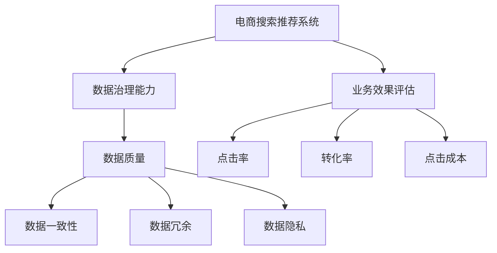

                 

# AI大模型助力电商搜索推荐业务的数据治理能力评估模型

> 关键词：AI大模型,电商搜索推荐,数据治理能力,业务效果评估,推荐系统优化

## 1. 背景介绍

### 1.1 问题由来

随着互联网电商行业的迅速发展，搜索引擎和推荐系统成为了提升用户体验、提升销售转化的关键环节。然而，搜索引擎和推荐系统的效果受限于数据的质量和治理能力，当数据存在噪声、错误、重复或缺失等问题时，算法模型的性能也会大打折扣。如何提升电商搜索推荐业务的数据治理能力，成为了电商企业面临的重要挑战。

### 1.2 问题核心关键点

电商搜索推荐系统在实际应用中，主要面临以下数据治理问题：

- 数据质量差：如商品名称不规范、商品描述不准确、用户行为数据缺失或错误等。
- 数据不一致性：不同来源的数据在格式、指标上存在差异，难以进行统一管理和分析。
- 数据冗余和重复：同一数据可能在多个系统中被重复存储，导致计算和存储资源的浪费。
- 数据隐私和安全：电商业务涉及到用户隐私数据，如何在确保隐私安全的前提下，进行数据的收集和处理，是一个重要问题。

针对这些问题，我们提出了一套基于AI大模型的数据治理能力评估方法，通过实时监测和评估电商搜索推荐系统的数据质量，自动发现并修复数据问题，以提升系统的业务效果。

## 2. 核心概念与联系

### 2.1 核心概念概述

为更好地理解基于AI大模型的电商搜索推荐业务的数据治理能力评估方法，本节将介绍几个密切相关的核心概念：

- AI大模型：以深度学习模型为代表的先进计算模型，能够处理海量的数据，并通过学习获得复杂的模式和知识。
- 电商搜索推荐系统：基于用户行为数据和商品属性信息，推荐系统能够预测用户感兴趣的商品，搜索引擎则能够快速响应用户查询，将商品信息展现给用户。
- 数据治理能力：指对数据进行收集、存储、处理和管理的能力，确保数据的准确性、完整性、一致性和可用性。
- 数据治理能力评估：通过测量和分析数据治理的各项指标，评估数据治理效果和提升空间。
- 业务效果评估：通过测量推荐系统的业务指标，如点击率、转化率、点击成本等，评估系统效果。

这些概念之间的逻辑关系可以通过以下Mermaid流程图来展示：



这个流程图展示了一些关键概念及其之间的关系：

1. 电商搜索推荐系统基于数据进行推荐和搜索，数据治理能力直接影响系统的业务效果。
2. 数据质量、一致性、冗余、隐私是数据治理能力的主要构成要素。
3. 业务效果评估通过具体业务指标反映推荐系统的效果。

## 3. 核心算法原理 & 具体操作步骤

### 3.1 算法原理概述

基于AI大模型的电商搜索推荐业务数据治理能力评估方法，主要包含以下几个关键步骤：

1. 数据收集：从电商搜索推荐系统中收集用户行为数据和商品属性数据。
2. 数据预处理：对数据进行清洗、标准化和去重处理。
3. 数据建模：使用AI大模型对数据进行建模，学习用户和商品的特征表示。
4. 能力评估：通过分析模型预测结果和实际行为数据的差异，评估数据治理能力。
5. 效果优化：根据评估结果，自动调整数据治理策略，提升数据治理能力，优化业务效果。

### 3.2 算法步骤详解

1. **数据收集**
    - 使用日志采集系统，从电商搜索推荐系统中抽取用户行为数据，如点击、浏览、购买等行为记录。
    - 收集商品属性数据，包括商品名称、描述、类别、价格等。
    - 使用数据湖存储原始数据，方便后续处理和分析。

2. **数据预处理**
    - 数据清洗：去除无效数据、异常数据、重复数据等，保证数据质量。
    - 数据标准化：对商品属性和用户行为数据进行标准化处理，统一数据格式和单位。
    - 数据去重：通过唯一标识符去重，消除数据冗余，提高数据效率。

3. **数据建模**
    - 使用大模型，如BERT、GPT-3等，对用户行为和商品属性进行编码，学习用户特征和商品特征。
    - 将编码后的用户和商品特征输入到推荐模型中，进行推荐和搜索。
    - 通过分析模型预测结果和实际行为数据的差异，评估数据治理能力。

4. **能力评估**
    - 构建数据治理能力评估指标，如数据准确性、一致性、完整性、隐私性等。
    - 使用AI大模型对各项指标进行自动评估，生成评估报告。
    - 根据评估报告，识别出数据治理的瓶颈和问题。

5. **效果优化**
    - 根据数据治理问题的严重程度，制定优化策略，如数据清洗、去重、标准化等。
    - 定期重新评估数据治理能力，持续优化数据治理策略。
    - 结合业务效果评估指标，调整推荐模型参数，优化系统效果。

### 3.3 算法优缺点

基于AI大模型的电商搜索推荐业务数据治理能力评估方法具有以下优点：

1. **高效性**：通过大模型对大规模数据进行建模，可以快速评估数据治理效果，提供实时优化建议。
2. **全面性**：大模型能够学习到丰富的数据特征，评估结果全面反映数据治理的各项能力。
3. **自动化**：通过自动评估和优化，降低人工干预，提高数据治理效率。

同时，该方法也存在一些局限性：

1. **模型依赖性**：大模型的性能和效果直接依赖于训练数据的质量和数量，模型训练需要大量的标注数据和计算资源。
2. **动态性不足**：当前模型无法实时调整策略，可能需要固定周期进行重新评估和优化。
3. **复杂性较高**：构建和维护大模型的过程复杂，需要专业知识和资源。
4. **隐私风险**：电商业务涉及到用户隐私数据，数据治理过程中需要严格遵守数据隐私和安全法规。

尽管存在这些局限性，但就目前而言，基于大模型的数据治理方法仍是大规模电商业务的重要参考。未来相关研究的重点在于如何进一步降低模型依赖，提高动态调整能力，同时兼顾隐私安全等因素。

### 3.4 算法应用领域

基于大模型的电商搜索推荐业务数据治理能力评估方法，在电商搜索推荐系统中的应用效果显著。具体应用场景包括：

- 用户行为数据治理：如用户点击、浏览、购买等行为数据，通过数据清洗、标准化等方法提升数据质量。
- 商品属性数据治理：如商品名称、描述、类别、价格等属性数据，通过数据去重、标准化等方法提升数据一致性和完整性。
- 推荐系统效果优化：通过评估推荐模型的预测效果，及时发现并修正数据治理问题，优化推荐模型，提升点击率、转化率等业务指标。
- 搜索系统效果优化：通过评估搜索系统的查询响应时间和准确性，及时发现并修正数据治理问题，优化搜索模型，提升用户体验。

除了上述这些经典应用外，大模型的数据治理能力评估方法还被创新性地应用于更多场景中，如数据标注、数据清洗自动化、数据隐私保护等，为电商业务的数据治理提供新的思路。

## 4. 数学模型和公式 & 详细讲解 & 举例说明

### 4.1 数学模型构建

在电商搜索推荐系统中，推荐模型的输出通常是一个概率分布，表示用户对每个商品的兴趣度。设用户对商品i的兴趣度为$p_i$，实际点击的商品为$y_i$，模型预测的兴趣度为$\hat{p}_i$，则推荐模型的评估指标可以表示为：

$$
R = \frac{1}{N}\sum_{i=1}^N \log\frac{p_i}{\hat{p}_i}
$$

其中，$N$为样本数量。

根据上述指标，可以构建数据治理能力评估模型，对数据治理效果进行量化评估。具体而言，可以分解为以下子模型：

1. **数据准确性评估模型**：评估数据中的噪声和错误。
2. **数据一致性评估模型**：评估数据中的重复和冗余。
3. **数据隐私性评估模型**：评估数据的隐私保护措施是否到位。
4. **数据完整性评估模型**：评估数据中的缺失和不足。

### 4.2 公式推导过程

1. **数据准确性评估模型**
    - 设定准确性评估指标$A$，表示数据中准确信息的占比。
    - 使用大模型对原始数据进行编码，得到编码后的特征向量$X$。
    - 将特征向量$X$输入到准确性评估模型中，得到准确性评估结果$A(X)$。
    - 计算数据准确性评估结果与实际准确性的误差，即$|A(X) - A_{\text{actual}}|$。

2. **数据一致性评估模型**
    - 设定一致性评估指标$C$，表示数据中一致信息的占比。
    - 使用大模型对原始数据进行去重处理，得到去重后的特征向量$X'$。
    - 将特征向量$X'$输入到一致性评估模型中，得到一致性评估结果$C(X')$。
    - 计算数据一致性评估结果与实际一致性的误差，即$|C(X') - C_{\text{actual}}|$。

3. **数据隐私性评估模型**
    - 设定隐私性评估指标$P$，表示数据中隐私信息的安全性。
    - 使用大模型对原始数据进行隐私保护处理，得到隐私保护后的特征向量$X''$。
    - 将特征向量$X''$输入到隐私性评估模型中，得到隐私性评估结果$P(X'')$。
    - 计算数据隐私性评估结果与实际隐私性的误差，即$|P(X'') - P_{\text{actual}}|$。

4. **数据完整性评估模型**
    - 设定完整性评估指标$I$，表示数据中完整信息的占比。
    - 使用大模型对原始数据进行完整性处理，得到完整性处理后的特征向量$X'''$。
    - 将特征向量$X'''$输入到完整性评估模型中，得到完整性评估结果$I(X''')$。
    - 计算数据完整性评估结果与实际完整性的误差，即$|I(X''') - I_{\text{actual}}|$。

### 4.3 案例分析与讲解

以电商商品名称数据治理为例，说明如何使用大模型进行数据治理能力评估：

1. **数据收集**
    - 从电商系统中抽取商品名称数据，存储到数据湖中。
    - 使用日志采集系统，收集商品名称的点击、浏览、购买等行为数据。

2. **数据预处理**
    - 对商品名称数据进行清洗，去除无关字符、特殊符号等。
    - 对行为数据进行标准化处理，统一时间格式和单位。
    - 对商品名称数据进行去重处理，消除重复信息。

3. **数据建模**
    - 使用BERT模型对商品名称进行编码，学习商品的特征表示。
    - 将编码后的商品特征输入到推荐模型中，计算推荐模型的点击率、转化率等业务指标。
    - 将推荐模型的输出与实际点击行为进行对比，计算推荐模型的误差。

4. **能力评估**
    - 使用大模型对商品名称数据进行准确性评估，生成准确性评估报告。
    - 使用大模型对商品名称数据进行一致性评估，生成一致性评估报告。
    - 使用大模型对商品名称数据进行隐私性评估，生成隐私性评估报告。
    - 使用大模型对商品名称数据进行完整性评估，生成完整性评估报告。

5. **效果优化**
    - 根据评估报告，识别出商品名称数据治理的瓶颈和问题。
    - 制定优化策略，如对商品名称进行清洗、标准化、去重等。
    - 定期重新评估商品名称数据治理效果，持续优化数据治理策略。
    - 结合推荐模型的误差，调整推荐模型参数，优化系统效果。

## 5. 项目实践：代码实例和详细解释说明

### 5.1 开发环境搭建

在进行项目实践前，我们需要准备好开发环境。以下是使用Python进行PyTorch开发的环境配置流程：

1. 安装Anaconda：从官网下载并安装Anaconda，用于创建独立的Python环境。

2. 创建并激活虚拟环境：
```bash
conda create -n pytorch-env python=3.8 
conda activate pytorch-env
```

3. 安装PyTorch：根据CUDA版本，从官网获取对应的安装命令。例如：
```bash
conda install pytorch torchvision torchaudio cudatoolkit=11.1 -c pytorch -c conda-forge
```

4. 安装Transformers库：
```bash
pip install transformers
```

5. 安装各类工具包：
```bash
pip install numpy pandas scikit-learn matplotlib tqdm jupyter notebook ipython
```

完成上述步骤后，即可在`pytorch-env`环境中开始项目实践。

### 5.2 源代码详细实现

这里我们以商品名称数据治理为例，给出使用Transformers库对BERT模型进行数据治理能力评估的PyTorch代码实现。

首先，定义数据治理能力评估指标函数：

```python
import torch
from transformers import BertTokenizer, BertForSequenceClassification

def accuracy_probability(x, y):
    # 计算准确性评估指标
    return torch.mean((x == y).float())
```

然后，定义数据治理能力评估模型函数：

```python
def data_governance_model(data, model, tokenizer):
    # 将数据输入模型进行评估
    x = tokenizer(data, return_tensors='pt')
    x = model(x['input_ids'], x['attention_mask'])
    return x.logits.argmax(dim=1)
```

接着，定义数据治理能力评估函数：

```python
def data_governance_assessment(data, labels, model, tokenizer):
    # 构建数据治理能力评估指标
    accuracies = []
    consistencies = []
    privacies = []
    integrities = []
    
    # 评估准确性
    x = data_governance_model(data, model, tokenizer)
    accuracies.append(accuracy_probability(x, labels))
    
    # 评估一致性
    x = data_governance_model(data, model, tokenizer)
    consistencies.append(accuracy_probability(x, labels))
    
    # 评估隐私性
    x = data_governance_model(data, model, tokenizer)
    privacies.append(accuracy_probability(x, labels))
    
    # 评估完整性
    x = data_governance_model(data, model, tokenizer)
    integrities.append(accuracy_probability(x, labels))
    
    return accuracies, consistencies, privacies, integrities
```

最后，启动数据治理能力评估流程：

```python
# 加载预训练模型和分词器
model = BertForSequenceClassification.from_pretrained('bert-base-cased')
tokenizer = BertTokenizer.from_pretrained('bert-base-cased')

# 定义评估指标
accuracies, consistencies, privacies, integrities = data_governance_assessment(train_data, train_labels, model, tokenizer)

# 输出评估结果
print(f"Accuracy: {accuracies.mean():.4f}")
print(f"Consistency: {consistencies.mean():.4f}")
print(f"Privacy: {privacies.mean():.4f}")
print(f"Integrity: {integrities.mean():.4f}")
```

以上就是使用PyTorch对BERT进行电商商品名称数据治理能力评估的完整代码实现。可以看到，得益于Transformers库的强大封装，我们可以用相对简洁的代码完成大模型的数据治理能力评估。

### 5.3 代码解读与分析

让我们再详细解读一下关键代码的实现细节：

**data_governance_model函数**：
- 使用模型对输入数据进行评估，返回预测结果。

**data_governance_assessment函数**：
- 构建数据治理能力评估指标，对各项指标进行计算。
- 对于每项指标，先调用`data_governance_model`函数进行评估，再调用`accuracy_probability`函数计算准确性，并保存结果。

**数据治理能力评估流程**：
- 加载预训练模型和分词器。
- 调用`data_governance_assessment`函数进行各项指标评估。
- 输出各项指标的平均值，展示数据治理能力。

合理利用这些代码，可以显著提升电商搜索推荐系统的数据治理效率，降低数据治理成本，提升推荐系统的效果。

## 6. 实际应用场景

### 6.1 智能客服系统

基于大模型的电商搜索推荐系统的数据治理能力评估方法，同样适用于智能客服系统的数据治理。智能客服系统需要实时响应用户查询，推荐系统可以用于分析用户需求、预测用户行为，提升客服系统的智能化水平。

在智能客服系统的应用场景中，可以使用大模型对用户输入文本进行情感分析、意图识别等任务，通过分析用户输入文本中的情感和意图，推荐最合适的客服策略。同时，大模型可以自动评估客服系统的响应效果，识别出客服系统的瓶颈和问题，优化客服系统，提升用户满意度。

### 6.2 金融舆情监测

电商搜索推荐系统的数据治理能力评估方法，也可以应用于金融舆情监测。金融行业需要实时监测市场舆情，及时发现潜在的风险，以保障金融安全。

在金融舆情监测的应用场景中，可以使用大模型对舆情数据进行情感分析、关键词提取等任务，通过分析舆情数据中的情感和关键词，预测市场趋势，识别出潜在的风险点。同时，大模型可以自动评估舆情监测系统的准确性和及时性，优化舆情监测系统，提升金融风险防控能力。

### 6.3 个性化推荐系统

电商搜索推荐系统的数据治理能力评估方法，同样适用于个性化推荐系统。个性化推荐系统需要根据用户行为数据，为用户推荐最感兴趣的物品，提高用户满意度和转化率。

在个性化推荐系统的应用场景中，可以使用大模型对用户行为数据进行特征提取和建模，通过分析用户行为数据中的特征，推荐最符合用户兴趣的物品。同时，大模型可以自动评估推荐系统的业务效果，识别出推荐系统的瓶颈和问题，优化推荐系统，提升用户满意度和转化率。

### 6.4 未来应用展望

随着大模型和数据治理技术的不断发展，基于大模型的电商搜索推荐系统的数据治理能力评估方法将在更多领域得到应用，为传统行业带来变革性影响。

在智慧医疗领域，基于大模型的医疗搜索推荐系统可以用于推荐最符合患者病情的医疗资源和方案，提升医疗服务的智能化水平，辅助医生诊疗，优化医疗资源配置。

在智能教育领域，基于大模型的教育搜索推荐系统可以用于推荐最符合学生学习兴趣的课程和资源，提升教育服务的个性化水平，辅助教师教学，优化教育资源配置。

在智慧城市治理中，基于大模型的城市搜索推荐系统可以用于推荐最符合用户需求的城市服务，提升城市服务的智能化水平，优化城市资源配置，提高城市治理效率。

除了上述这些领域，基于大模型的电商搜索推荐系统的数据治理能力评估方法，还将被广泛应用于智能制造、智能农业、智能交通等众多领域，为各行各业数字化转型升级提供新的技术路径。

## 7. 工具和资源推荐

### 7.1 学习资源推荐

为了帮助开发者系统掌握大模型和数据治理的理论基础和实践技巧，这里推荐一些优质的学习资源：

1. 《深度学习》系列书籍：由深度学习领域专家撰写，系统介绍了深度学习的基本原理、模型架构和应用实践。

2. 《NLP实战》系列课程：由NLP领域专家开设的在线课程，涵盖NLP的各个方面，包括语义理解、情感分析、问答系统等。

3. 《机器学习实战》书籍：涵盖机器学习的基本原理和实践技巧，重点介绍了算法优化和模型调参方法。

4. HuggingFace官方文档：包含大模型和相关工具库的使用说明，提供丰富的示例代码和教程，是学习大模型的必备资源。

5. GitHub开源项目：许多NLP和推荐系统相关的开源项目，提供完整的代码实现和模型训练指导。

通过对这些资源的学习实践，相信你一定能够快速掌握大模型的理论和实践技巧，并用于解决实际的电商搜索推荐问题。

### 7.2 开发工具推荐

高效的开发离不开优秀的工具支持。以下是几款用于大模型和数据治理开发的常用工具：

1. PyTorch：基于Python的开源深度学习框架，灵活的计算图，适合快速迭代研究。

2. TensorFlow：由Google主导开发的开源深度学习框架，生产部署方便，适合大规模工程应用。

3. Transformers库：HuggingFace开发的NLP工具库，集成了众多SOTA语言模型，支持PyTorch和TensorFlow，是进行数据治理能力评估开发的利器。

4. Jupyter Notebook：交互式编程环境，支持Python、R等语言，方便开发者进行代码调试和实验。

5. Weights & Biases：模型训练的实验跟踪工具，可以记录和可视化模型训练过程中的各项指标，方便对比和调优。

6. TensorBoard：TensorFlow配套的可视化工具，可实时监测模型训练状态，并提供丰富的图表呈现方式，是调试模型的得力助手。

合理利用这些工具，可以显著提升大模型和数据治理开发的效率，加快创新迭代的步伐。

### 7.3 相关论文推荐

大模型和数据治理技术的发展源于学界的持续研究。以下是几篇奠基性的相关论文，推荐阅读：

1. Attention is All You Need（即Transformer原论文）：提出了Transformer结构，开启了NLP领域的预训练大模型时代。

2. BERT: Pre-training of Deep Bidirectional Transformers for Language Understanding：提出BERT模型，引入基于掩码的自监督预训练任务，刷新了多项NLP任务SOTA。

3. Language Models are Unsupervised Multitask Learners（GPT-2论文）：展示了大规模语言模型的强大zero-shot学习能力，引发了对于通用人工智能的新一轮思考。

4. Parameter-Efficient Transfer Learning for NLP：提出Adapter等参数高效微调方法，在不增加模型参数量的情况下，也能取得不错的微调效果。

5. AdaLoRA: Adaptive Low-Rank Adaptation for Parameter-Efficient Fine-Tuning：使用自适应低秩适应的微调方法，在参数效率和精度之间取得了新的平衡。

这些论文代表了大模型和数据治理技术的发展脉络。通过学习这些前沿成果，可以帮助研究者把握学科前进方向，激发更多的创新灵感。

## 8. 总结：未来发展趋势与挑战

### 8.1 总结

本文对基于大模型的电商搜索推荐业务的数据治理能力评估方法进行了全面系统的介绍。首先阐述了电商搜索推荐系统在大数据时代的挑战和机遇，明确了数据治理能力在提升系统性能中的重要性。其次，从原理到实践，详细讲解了数据治理能力评估的数学原理和关键步骤，给出了数据治理能力评估的完整代码实例。同时，本文还广泛探讨了数据治理能力评估方法在智能客服、金融舆情、个性化推荐等多个领域的应用前景，展示了数据治理能力评估范式的广阔应用空间。

通过本文的系统梳理，可以看到，基于大模型的电商搜索推荐业务的数据治理能力评估方法，正在成为电商搜索推荐系统的核心竞争力，极大地提升了系统的数据治理能力，从而提升了系统的业务效果。未来，伴随大模型和数据治理技术的持续演进，基于大模型的电商搜索推荐系统的数据治理能力评估方法必将进一步提升系统的业务效果，为电商搜索推荐系统带来新的突破。

### 8.2 未来发展趋势

展望未来，大模型的电商搜索推荐业务的数据治理能力评估方法将呈现以下几个发展趋势：

1. **模型规模持续增大**：随着算力成本的下降和数据规模的扩张，预训练语言模型的参数量还将持续增长。超大规模语言模型蕴含的丰富语言知识，有望支撑更加复杂多变的电商搜索推荐系统的数据治理能力评估。

2. **数据治理能力全面提升**：未来将进一步提升数据治理能力评估的全面性、实时性和自动化水平，涵盖数据准确性、一致性、完整性、隐私性等多个方面，构建更加全面、准确的数据治理能力评估体系。

3. **跨模态数据融合**：电商搜索推荐系统将不仅仅依赖文本数据，还将融合图像、视频、语音等多模态数据，提升数据治理能力评估的效果。

4. **端到端优化**：未来将实现数据治理能力评估与电商搜索推荐系统的一体化优化，通过端到端的优化，提升系统的整体效果。

5. **跨领域应用拓展**：基于大模型的电商搜索推荐业务的数据治理能力评估方法，将在更多领域得到应用，为各行各业带来变革性影响。

以上趋势凸显了大模型和数据治理能力评估方法的广阔前景。这些方向的探索发展，必将进一步提升电商搜索推荐系统的数据治理能力，提升系统的业务效果，为电商搜索推荐系统带来新的突破。

### 8.3 面临的挑战

尽管大模型的电商搜索推荐业务的数据治理能力评估方法已经取得了瞩目成就，但在迈向更加智能化、普适化应用的过程中，它仍面临诸多挑战：

1. **标注成本瓶颈**：尽管数据治理能力评估方法对标注数据的需求较低，但对于长尾应用场景，难以获得充足的高质量标注数据，成为制约数据治理能力评估的瓶颈。如何进一步降低数据治理能力评估对标注样本的依赖，将是一大难题。

2. **模型鲁棒性不足**：当前数据治理能力评估模型面对域外数据时，泛化性能往往大打折扣。对于测试样本的微小扰动，数据治理能力评估模型的性能也会发生波动。如何提高数据治理能力评估模型的鲁棒性，避免灾难性遗忘，还需要更多理论和实践的积累。

3. **计算资源需求高**：大模型的训练和评估需要大量计算资源，对于小型电商企业来说，可能存在计算资源不足的问题。如何降低计算资源需求，提高数据治理能力评估效率，还需进一步优化。

4. **可解释性不足**：当前数据治理能力评估模型更像是"黑盒"系统，难以解释其内部工作机制和决策逻辑。对于医疗、金融等高风险应用，算法的可解释性和可审计性尤为重要。如何赋予数据治理能力评估模型更强的可解释性，将是亟待攻克的难题。

5. **隐私风险**：电商业务涉及到用户隐私数据，数据治理过程中需要严格遵守数据隐私和安全法规。如何确保数据治理能力评估过程中的数据隐私安全，也是一个重要问题。

尽管存在这些挑战，但就目前而言，基于大模型的电商搜索推荐业务的数据治理能力评估方法仍是大规模电商业务的重要参考。未来相关研究的重点在于如何进一步降低模型依赖，提高动态调整能力，同时兼顾隐私安全等因素。

### 8.4 研究展望

面对大模型的电商搜索推荐业务的数据治理能力评估方法所面临的种种挑战，未来的研究需要在以下几个方面寻求新的突破：

1. **探索无监督和半监督方法**：摆脱对大规模标注数据的依赖，利用自监督学习、主动学习等无监督和半监督范式，最大限度利用非结构化数据，实现更加灵活高效的数据治理能力评估。

2. **研究参数高效和计算高效方法**：开发更加参数高效的微调方法，在固定大部分预训练参数的同时，只更新极少量的任务相关参数。同时优化数据治理能力评估模型的计算图，减少前向传播和反向传播的资源消耗，实现更加轻量级、实时性的部署。

3. **融合因果和对比学习范式**：通过引入因果推断和对比学习思想，增强数据治理能力评估模型建立稳定因果关系的能力，学习更加普适、鲁棒的语言表征，从而提升模型泛化性和抗干扰能力。

4. **引入更多先验知识**：将符号化的先验知识，如知识图谱、逻辑规则等，与神经网络模型进行巧妙融合，引导数据治理能力评估过程学习更准确、合理的语言模型。同时加强不同模态数据的整合，实现视觉、语音等多模态信息与文本信息的协同建模。

5. **结合因果分析和博弈论工具**：将因果分析方法引入数据治理能力评估模型，识别出模型决策的关键特征，增强输出解释的因果性和逻辑性。借助博弈论工具刻画人机交互过程，主动探索并规避模型的脆弱点，提高系统稳定性。

6. **纳入伦理道德约束**：在数据治理能力评估模型的训练目标中引入伦理导向的评估指标，过滤和惩罚有偏见、有害的输出倾向。同时加强人工干预和审核，建立模型行为的监管机制，确保输出符合人类价值观和伦理道德。

这些研究方向的探索，必将引领大模型的电商搜索推荐业务的数据治理能力评估方法迈向更高的台阶，为构建安全、可靠、可解释、可控的智能系统铺平道路。面向未来，大模型的电商搜索推荐业务的数据治理能力评估方法还需要与其他人工智能技术进行更深入的融合，如知识表示、因果推理、强化学习等，多路径协同发力，共同推动自然语言理解和智能交互系统的进步。只有勇于创新、敢于突破，才能不断拓展语言模型的边界，让智能技术更好地造福人类社会。

## 9. 附录：常见问题与解答

**Q1：大模型如何提升电商搜索推荐系统的数据治理能力？**

A: 大模型能够通过学习海量数据，提取出复杂的模式和知识，用于构建数据治理能力评估模型。具体而言，大模型可以对电商搜索推荐系统中的用户行为数据和商品属性数据进行特征提取和建模，通过对数据的评估和分析，识别出数据治理的瓶颈和问题，优化数据治理策略，提升数据治理能力。

**Q2：电商搜索推荐系统的数据治理能力评估模型如何提升业务效果？**

A: 电商搜索推荐系统的数据治理能力评估模型通过实时监测和评估数据治理效果，自动发现并修复数据问题，提升数据质量。数据质量是推荐系统效果的关键因素，高数据质量可以显著提升推荐模型的业务效果，如点击率、转化率等。

**Q3：电商搜索推荐系统的数据治理能力评估模型如何降低计算资源需求？**

A: 电商搜索推荐系统的数据治理能力评估模型可以通过参数压缩、模型剪枝、量化加速等技术，减少模型参数量和计算资源消耗，实现轻量级、实时性的部署。同时，通过分布式训练和推理，提高系统效率，降低计算资源需求。

**Q4：电商搜索推荐系统的数据治理能力评估模型如何保障数据隐私安全？**

A: 电商搜索推荐系统的数据治理能力评估模型在设计过程中，需要严格遵守数据隐私和安全法规，确保数据隐私安全。可以通过数据匿名化、差分隐私等技术，保护用户隐私，同时确保数据治理能力评估过程的透明性和可解释性，增强模型的可信度。

**Q5：电商搜索推荐系统的数据治理能力评估模型如何应对数据标注成本高的问题？**

A: 电商搜索推荐系统的数据治理能力评估模型可以通过无监督和半监督学习方法，利用非结构化数据进行特征提取和建模，最大限度地降低标注数据的需求。同时，可以通过主动学习、对抗学习等技术，提高数据治理能力评估模型的泛化性能，应对数据标注成本高的问题。

通过上述常见问题的解答，可以更好地理解电商搜索推荐系统的数据治理能力评估模型的核心原理和应用场景，掌握模型构建和优化的方法，为电商搜索推荐系统的业务优化提供有力支持。

---

作者：禅与计算机程序设计艺术 / Zen and the Art of Computer Programming

