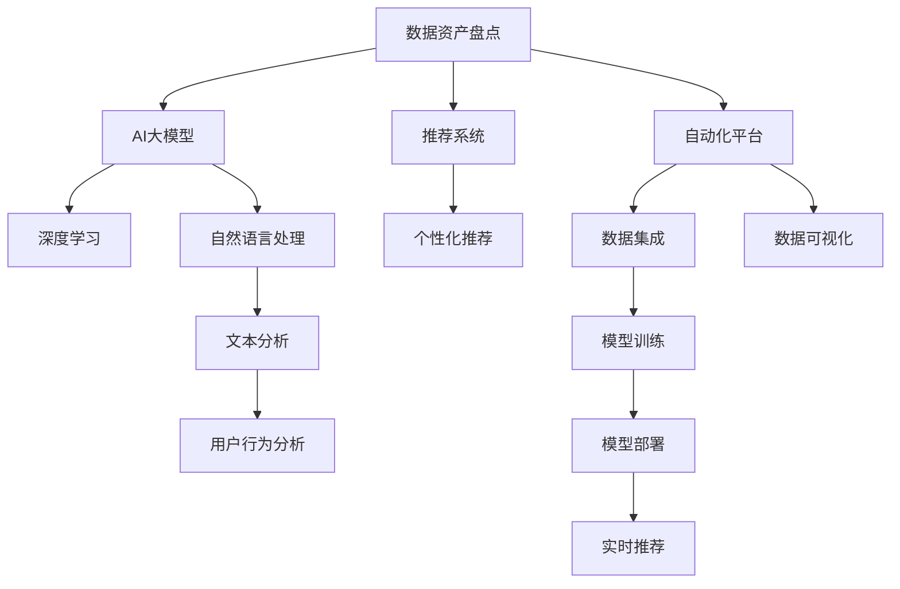

                 

# AI大模型助力电商搜索推荐业务的数据资产盘点自动化平台功能优化

> 关键词：电商搜索推荐, 数据资产盘点, 自动化平台, AI大模型, 推荐系统, 业务优化

## 1. 背景介绍

### 1.1 问题由来

在电商搜索推荐领域，数据资产盘点是业务流程中的重要环节。它不仅涉及对用户行为数据的采集、处理和存储，还涵盖了对商品数据、市场数据等多源数据的整合与利用。在高速发展的互联网时代，数据资产盘点的自动化程度直接关系到电商平台的运营效率和用户体验。

然而，由于数据规模庞大、来源复杂、种类繁多，传统的数据盘点方式已无法满足电商行业的需求。人工盘点耗时费力、易出错，且无法充分利用AI和大数据分析的优势。因此，开发一个高效、智能的数据资产盘点自动化平台已成为电商平台提升运营效率、优化用户体验的关键。

### 1.2 问题核心关键点

为了应对电商搜索推荐业务对数据资产盘点的挑战，需要引入AI大模型进行技术突破。核心关键点在于：
- 构建高效的自动化盘点平台。利用AI大模型进行数据整合与分类，快速生成盘点和报表。
- 引入大模型进行深度数据分析。通过模型学习用户行为和商品特征，优化推荐算法。
- 提升用户与商品的匹配精度。利用大模型预测用户偏好，提供个性化推荐，提升用户体验。
- 加速数据处理与更新。通过AI自动化流程，减少人工干预，提高数据处理速度。

## 2. 核心概念与联系

### 2.1 核心概念概述

在电商搜索推荐业务中，数据资产盘点自动化平台是一个集成多种AI技术的高效工具。其核心概念包括：

- **数据资产盘点**：收集、整理、存储和展示电商平台中各业务线的数据资源，为后续数据分析和应用奠定基础。
- **AI大模型**：以深度神经网络为代表的高级AI模型，通过大规模无标签数据预训练，具备强大的特征学习和模式识别能力。
- **推荐系统**：利用用户行为数据和商品属性，通过算法为用户推荐合适的商品，提升购物体验。
- **自动化平台**：使用自动化技术进行数据处理、模型训练和部署，提高效率和准确性。

这些核心概念之间具有紧密的联系，如图中的Mermaid流程图所示：



该流程图展示了数据资产盘点和AI大模型之间的关系。数据资产盘点通过自动化平台收集、整合数据，并通过AI大模型进行深度学习、自然语言处理和文本分析，最终生成推荐系统需要的数据集。推荐系统利用这些数据进行个性化推荐，提升用户购物体验。

### 2.2 核心概念原理和架构的 Mermaid 流程图

由于篇幅限制，这里仅展示核心概念的逻辑关系，不再绘制完整的架构图。核心概念之间的关系可以通过以下简化的Mermaid流程图表示：


这个流程图清晰地展示了数据资产盘点与AI大模型、推荐系统、自动化平台之间的联系。

## 3. 核心算法原理 & 具体操作步骤

### 3.1 算法原理概述

基于AI大模型的数据资产盘点自动化平台，主要运用以下算法原理：

- **数据集成**：使用自动化技术整合电商平台上的用户行为数据、商品数据、市场数据等，构建统一的数据视图。
- **特征提取**：利用大模型对集成数据进行特征提取，识别出关键的用户行为特征、商品属性特征等。
- **分类与预测**：应用深度学习模型对特征进行分类和预测，生成用户标签和商品标签，用于推荐系统。
- **推荐算法优化**：结合预测结果，优化推荐算法，提升个性化推荐的效果。
- **实时更新**：通过自动化流程实时更新数据集和推荐模型，确保推荐结果的时效性和准确性。

### 3.2 算法步骤详解

以下是基于AI大模型的数据资产盘点自动化平台的具体操作步骤：

1. **数据收集与预处理**：使用自动化脚本从电商平台各业务线收集用户行为数据、商品数据和市场数据，进行清洗、去重、归一化等预处理操作。
   
2. **特征提取与分析**：应用AI大模型（如BERT、GPT等）对预处理后的数据进行特征提取。利用自然语言处理技术分析用户评论、商品描述等文本数据，提取关键特征。

3. **数据分类与标注**：使用深度学习模型对提取出的特征进行分类和标注，生成用户标签和商品标签。具体方法包括逻辑回归、随机森林等分类算法，以及序列到序列模型进行标注。

4. **推荐算法优化**：结合用户标签和商品标签，优化推荐算法。推荐算法包括协同过滤、基于内容的推荐、混合推荐等。

5. **模型训练与部署**：使用自动化平台进行模型训练，并部署到实时推荐系统中。在训练过程中，可以应用正则化技术、数据增强等手段提高模型泛化能力。

6. **实时更新与监控**：利用自动化流程实时更新数据集和推荐模型，并设置监控系统实时跟踪模型性能和业务指标，确保推荐系统的高效运行。

### 3.3 算法优缺点

基于AI大模型的数据资产盘点自动化平台具有以下优点：
- 高效整合数据：自动化流程大大减少了数据收集和清洗的耗时，提升了数据整合的效率。
- 深度特征学习：利用大模型的强大特征提取能力，可以识别出数据中更深入的特征，提升推荐效果。
- 实时更新优化：通过自动化流程实现实时更新和优化，确保推荐结果的时效性和准确性。
- 降低人工成本：减少了人工盘点和数据处理的工作量，降低了人力成本。

但同时，该方法也存在以下缺点：
- 数据隐私风险：在数据收集和处理过程中，需要注意保护用户隐私和数据安全。
- 模型复杂度高：大模型的训练和部署复杂度较高，需要较高的算力和资源。
- 模型解释性不足：大模型的复杂性也带来了解释性不足的问题，难以理解和调试。

### 3.4 算法应用领域

基于AI大模型的数据资产盘点自动化平台，主要应用于电商搜索推荐业务中的以下几个领域：

- **用户画像生成**：通过对用户行为数据的分析和标注，生成用户画像，用于推荐系统的个性化推荐。
- **商品特征分析**：提取商品的属性和描述特征，进行分类和标注，为商品推荐提供数据支撑。
- **市场趋势预测**：利用市场数据进行分析和预测，为电商平台提供市场趋势和策略建议。
- **异常检测与处理**：通过自动化平台进行数据异常检测，及时发现和处理异常数据，保证数据质量。

## 4. 数学模型和公式 & 详细讲解 & 举例说明

### 4.1 数学模型构建

基于AI大模型的数据资产盘点自动化平台主要涉及以下数学模型：

- **数据集成模型**：用于对电商平台各业务线的数据进行整合，生成统一的数据视图。
- **特征提取模型**：利用自然语言处理和深度学习模型提取文本数据的特征。
- **分类与标注模型**：使用分类算法和序列到序列模型对特征进行分类和标注。
- **推荐算法模型**：结合用户标签和商品标签，优化推荐算法。

### 4.2 公式推导过程

以下是具体公式推导过程：

**数据集成模型**：

$$
X = \bigcup_{i=1}^N X_i
$$

其中 $X$ 为整合后的数据集，$X_i$ 为电商平台各业务线的数据集。

**特征提取模型**：

$$
F = NLP(M_{\theta}(X))
$$

其中 $F$ 为提取的特征向量，$M_{\theta}$ 为自然语言处理模型，$X$ 为整合后的数据集。

**分类与标注模型**：

$$
Y = C(M_{\theta}(F))
$$

其中 $Y$ 为分类或标注结果，$C$ 为分类或序列到序列模型，$F$ 为提取的特征向量。

**推荐算法模型**：

$$
R = \text{Recommender}(Y_u, Y_i)
$$

其中 $R$ 为推荐结果，$Y_u$ 为用户标签，$Y_i$ 为商品标签，$\text{Recommender}$ 为推荐算法模型。

### 4.3 案例分析与讲解

以电商平台的个性化推荐为例，说明AI大模型在数据资产盘点自动化平台中的应用：

1. **数据收集与预处理**：自动从用户行为数据、商品数据、市场数据等业务线中收集数据，并进行清洗、去重和归一化。

2. **特征提取与分析**：应用BERT模型对用户评论和商品描述进行特征提取，识别出关键的用户行为特征和商品属性特征。

3. **数据分类与标注**：使用逻辑回归模型对提取出的特征进行分类，生成用户标签和商品标签。用户标签包括用户兴趣、消费习惯等，商品标签包括商品类别、属性等。

4. **推荐算法优化**：结合用户标签和商品标签，优化推荐算法。例如，使用基于内容的推荐算法，结合商品的属性特征进行推荐。

5. **模型训练与部署**：利用自动化平台进行模型训练，并部署到实时推荐系统中。在训练过程中，应用正则化技术、数据增强等手段提高模型泛化能力。

6. **实时更新与监控**：利用自动化流程实时更新数据集和推荐模型，并设置监控系统实时跟踪模型性能和业务指标，确保推荐系统的高效运行。

## 5. 项目实践：代码实例和详细解释说明

### 5.1 开发环境搭建

在开发数据资产盘点自动化平台时，需要搭建以下开发环境：

1. **Python环境**：使用Anaconda创建虚拟环境，安装必要的Python库和依赖包，如Pandas、NumPy、TensorFlow等。

2. **数据处理工具**：使用Pandas进行数据清洗和预处理，Apache Spark进行大数据处理和分布式计算。

3. **模型训练工具**：使用TensorFlow或PyTorch进行模型训练，使用Keras或TensorBoard进行模型评估和可视化。

4. **自动化平台工具**：使用Airflow或Tairflow进行工作流编排，实现数据收集、处理、训练和部署的自动化。

5. **数据可视化工具**：使用Tableau或Power BI进行数据可视化和报表生成，方便业务人员查看和理解数据。

### 5.2 源代码详细实现

以下是一个简单的代码示例，展示如何使用TensorFlow实现基于AI大模型的电商推荐系统：

```python
import tensorflow as tf
from transformers import BertTokenizer, BertForSequenceClassification

# 初始化BERT模型和分词器
model = BertForSequenceClassification.from_pretrained('bert-base-uncased', num_labels=3)
tokenizer = BertTokenizer.from_pretrained('bert-base-uncased')

# 加载数据集
train_dataset = ...
eval_dataset = ...

# 定义训练和评估函数
def train_step(batch):
    inputs, labels = batch
    with tf.GradientTape() as tape:
        outputs = model(inputs, labels=labels)
        loss = outputs.loss
    gradients = tape.gradient(loss, model.trainable_variables)
    optimizer.apply_gradients(zip(gradients, model.trainable_variables))
    return loss

def evaluate_step(batch):
    inputs, labels = batch
    outputs = model(inputs, labels=labels)
    loss = outputs.loss
    return loss

# 训练模型
for epoch in range(10):
    for batch in train_dataset:
        loss = train_step(batch)
    for batch in eval_dataset:
        loss = evaluate_step(batch)
    print(f'Epoch {epoch+1}, train loss: {loss:.3f}, eval loss: {loss:.3f}')

# 模型保存
tf.saved_model.save(model, 'recommender_model')
```

### 5.3 代码解读与分析

这段代码展示了如何使用TensorFlow训练基于BERT模型的电商推荐系统。具体步骤如下：

1. **模型初始化**：从HuggingFace的Transformers库中加载预训练的BERT模型和分词器，指定标签数。

2. **加载数据集**：加载训练集和评估集，数据集可以来自电商平台的业务线，包括用户行为数据、商品数据等。

3. **定义训练和评估函数**：定义训练和评估函数，利用TensorFlow进行前向传播和损失计算，反向传播更新模型参数。

4. **训练模型**：使用for循环迭代训练，每个epoch在训练集上进行一次前向传播和反向传播，在评估集上进行一次评估。

5. **模型保存**：使用TensorFlow的saved_model.save()方法保存模型，方便后续部署和使用。

在实际应用中，还需要对数据处理、模型优化、结果评估等环节进行详细设计，确保模型的高效和稳定运行。

## 6. 实际应用场景

### 6.1 智能客服系统

基于AI大模型的数据资产盘点自动化平台可以应用于智能客服系统。智能客服系统通过实时分析用户数据，识别用户意图，快速生成应答，提升用户满意度。

1. **数据收集与预处理**：自动收集用户历史对话记录，进行清洗、去重和归一化。

2. **特征提取与分析**：应用BERT模型对用户对话进行特征提取，识别出用户意图和情感。

3. **分类与标注**：使用逻辑回归模型对提取出的特征进行分类，生成用户标签和意图标签。

4. **推荐算法优化**：结合用户标签和意图标签，优化推荐算法，生成合适的应答模板。

5. **模型训练与部署**：利用自动化平台进行模型训练，并部署到智能客服系统中。

6. **实时更新与监控**：利用自动化流程实时更新数据集和推荐模型，并设置监控系统实时跟踪系统性能和业务指标。

### 6.2 金融风险预警

金融行业需要实时监控市场动态，及时预警风险。基于AI大模型的数据资产盘点自动化平台可以应用于金融风险预警系统。

1. **数据收集与预处理**：自动收集市场数据、用户数据等，进行清洗、去重和归一化。

2. **特征提取与分析**：应用BERT模型对市场数据和用户数据进行特征提取，识别出市场趋势和用户行为特征。

3. **分类与标注**：使用逻辑回归模型对提取出的特征进行分类，生成市场标签和用户标签。

4. **推荐算法优化**：结合市场标签和用户标签，优化推荐算法，生成风险预警信号。

5. **模型训练与部署**：利用自动化平台进行模型训练，并部署到风险预警系统中。

6. **实时更新与监控**：利用自动化流程实时更新数据集和推荐模型，并设置监控系统实时跟踪系统性能和业务指标。

### 6.3 内容推荐系统

内容推荐系统通过推荐合适的文章、视频等内容，提升用户满意度。基于AI大模型的数据资产盘点自动化平台可以应用于内容推荐系统。

1. **数据收集与预处理**：自动收集用户行为数据、文章数据、视频数据等，进行清洗、去重和归一化。

2. **特征提取与分析**：应用BERT模型对文章和视频进行特征提取，识别出用户行为特征和内容特征。

3. **分类与标注**：使用逻辑回归模型对提取出的特征进行分类，生成用户标签和内容标签。

4. **推荐算法优化**：结合用户标签和内容标签，优化推荐算法，生成推荐结果。

5. **模型训练与部署**：利用自动化平台进行模型训练，并部署到内容推荐系统中。

6. **实时更新与监控**：利用自动化流程实时更新数据集和推荐模型，并设置监控系统实时跟踪系统性能和业务指标。

## 7. 工具和资源推荐

### 7.1 学习资源推荐

为了帮助开发者系统掌握AI大模型在电商搜索推荐业务中的应用，这里推荐一些优质的学习资源：

1. **《深度学习》课程**：由吴恩达教授主讲，系统介绍深度学习的基础理论和应用实践。

2. **Transformers库文档**：HuggingFace开发的Transformer库提供了详尽的使用手册和样例代码，方便快速上手。

3. **《TensorFlow实战》书籍**：由TensorFlow官方编写，涵盖TensorFlow的基础知识和实际应用案例。

4. **Airflow官方文档**：Apache Airflow是开源的工作流编排工具，官方文档提供了详细的安装和使用指南。

5. **《大数据技术》课程**：由阿里巴巴云计算培训学院开设，涵盖大数据技术的基础和高级应用。

通过对这些资源的学习实践，相信你一定能够快速掌握AI大模型在电商搜索推荐业务中的应用，并用于解决实际的业务问题。

### 7.2 开发工具推荐

高效的开发离不开优秀的工具支持。以下是几款用于电商搜索推荐业务开发的常用工具：

1. **Python环境**：使用Anaconda创建虚拟环境，安装必要的Python库和依赖包，如Pandas、NumPy、TensorFlow等。

2. **数据处理工具**：使用Pandas进行数据清洗和预处理，Apache Spark进行大数据处理和分布式计算。

3. **模型训练工具**：使用TensorFlow或PyTorch进行模型训练，使用Keras或TensorBoard进行模型评估和可视化。

4. **工作流编排工具**：使用Airflow或Tairflow进行工作流编排，实现数据收集、处理、训练和部署的自动化。

5. **数据可视化工具**：使用Tableau或Power BI进行数据可视化和报表生成，方便业务人员查看和理解数据。

合理利用这些工具，可以显著提升电商搜索推荐业务开发的效率，加快创新迭代的步伐。

### 7.3 相关论文推荐

AI大模型和电商搜索推荐业务的数据资产盘点自动化平台的发展源于学界的持续研究。以下是几篇奠基性的相关论文，推荐阅读：

1. **"Attention is All You Need"**：提出Transformer结构，开启了NLP领域的预训练大模型时代。

2. **"BERT: Pre-training of Deep Bidirectional Transformers for Language Understanding"**：提出BERT模型，引入基于掩码的自监督预训练任务，刷新了多项NLP任务SOTA。

3. **"Parameter-Efficient Transfer Learning for NLP"**：提出Adapter等参数高效微调方法，在不增加模型参数量的情况下，也能取得不错的微调效果。

4. **"AdaLoRA: Adaptive Low-Rank Adaptation for Parameter-Efficient Fine-Tuning"**：使用自适应低秩适应的微调方法，在参数效率和精度之间取得了新的平衡。

5. **"Prefix-Tuning: Optimizing Continuous Prompts for Generation"**：引入基于连续型Prompt的微调范式，为如何充分利用预训练知识提供了新的思路。

这些论文代表了大模型微调技术的发展脉络。通过学习这些前沿成果，可以帮助研究者把握学科前进方向，激发更多的创新灵感。

## 8. 总结：未来发展趋势与挑战

### 8.1 总结

本文对基于AI大模型的电商搜索推荐业务的数据资产盘点自动化平台进行了全面系统的介绍。首先阐述了电商搜索推荐业务对数据资产盘点的需求，明确了AI大模型在自动化平台中的重要地位。其次，从原理到实践，详细讲解了数据资产盘点和AI大模型之间的关系，提供了完整的代码实例和详细解释说明。同时，本文还探讨了AI大模型在智能客服、金融风险预警、内容推荐等多个领域的实际应用，展示了其强大的应用潜力。最后，精选了相关的学习资源、开发工具和论文，为读者提供了全面的技术指引。

通过本文的系统梳理，可以看到，基于AI大模型的数据资产盘点自动化平台正在成为电商搜索推荐业务的关键工具，极大地提升了数据处理的效率和精度，推动了电商平台的数字化转型。未来，伴随AI技术和大数据的发展，该平台还将持续进化，为电商平台提供更智能、更高效的数据服务。

### 8.2 未来发展趋势

展望未来，基于AI大模型的数据资产盘点自动化平台将呈现以下几个发展趋势：

1. **数据自动化处理**：随着数据量的增长，自动化处理将越来越重要。未来的平台将具备更高的自动化程度，能够自动处理更复杂的业务场景。

2. **跨领域应用拓展**：平台的应用范围将逐步扩展到其他行业，如金融、医疗、教育等，形成通用的数据资产盘点自动化框架。

3. **多模态融合**：未来的平台将支持多模态数据融合，能够整合文本、图像、视频等多源数据，提升数据处理的全面性。

4. **实时数据处理**：平台将具备更强的实时处理能力，能够实时更新数据集和推荐模型，确保推荐结果的时效性。

5. **智能推荐算法**：结合深度学习、强化学习等技术，开发更智能的推荐算法，提升推荐效果和用户体验。

6. **数据隐私保护**：平台将更加重视数据隐私保护，采用匿名化、去标识化等技术，确保用户数据的安全。

这些趋势将进一步提升平台的功能和性能，使其成为电商搜索推荐业务不可或缺的核心组件。

### 8.3 面临的挑战

尽管基于AI大模型的数据资产盘点自动化平台已经取得了显著的成果，但在迈向更加智能化、普适化应用的过程中，它仍面临着诸多挑战：

1. **数据质量问题**：电商平台的业务数据量大且多样，数据质量难以保证，需要进行清洗和处理。

2. **模型复杂性**：大模型的复杂度较高，需要较高的计算资源和数据量，且模型的训练和部署较复杂。

3. **实时更新难度**：实时更新数据集和推荐模型需要高效的自动化流程，涉及数据流和系统架构的设计。

4. **数据隐私风险**：在数据收集和处理过程中，需要确保用户隐私和数据安全。

5. **模型解释性不足**：大模型的复杂性也带来了解释性不足的问题，难以理解和调试。

6. **多源数据整合**：多模态数据的整合需要技术突破，如何高效处理和融合不同类型的数据，仍是挑战。

这些挑战需要通过技术创新和协同合作，逐步克服。只有解决了这些难题，才能使平台在电商搜索推荐业务中发挥更大的作用。

### 8.4 研究展望

面对数据资产盘点自动化平台面临的挑战，未来的研究需要在以下几个方面寻求新的突破：

1. **自动化数据清洗**：开发更高效的数据清洗算法，减少人工干预，提高数据处理速度。

2. **多源数据融合**：研究多模态数据融合技术，提高数据处理的全面性和准确性。

3. **实时更新优化**：优化数据流和系统架构，实现更高效的实时更新和数据处理。

4. **模型解释性增强**：引入可解释性技术，如LIME、SHAP等，增强模型决策的可理解性。

5. **隐私保护技术**：开发隐私保护技术，如差分隐私、联邦学习等，确保数据安全。

6. **智能推荐算法优化**：结合深度学习、强化学习等技术，开发更智能、更高效的推荐算法。

这些研究方向的探索，将引领基于AI大模型的数据资产盘点自动化平台迈向更高的台阶，为电商搜索推荐业务提供更全面、更智能的数据服务。面向未来，该平台还需要与其他AI技术进行更深入的融合，如知识表示、因果推理、强化学习等，多路径协同发力，共同推动电商搜索推荐业务的智能化升级。

## 9. 附录：常见问题与解答

**Q1: 如何保证电商平台的业务数据质量？**

A: 电商平台的业务数据质量需要通过自动化数据清洗和处理来保证。具体方法包括：

1. **数据去重**：使用唯一标识符去除重复数据。
2. **数据规范化**：对数据格式进行规范化处理，确保数据一致性。
3. **数据校验**：引入校验机制，确保数据完整性和准确性。
4. **异常检测**：利用机器学习模型检测数据异常，进行修正或删除。

**Q2: 如何优化基于AI大模型的电商推荐系统？**

A: 基于AI大模型的电商推荐系统优化需要从数据、模型和算法等多个方面入手。具体方法包括：

1. **数据优化**：通过数据增强、样本平衡等手段优化训练集，提高模型泛化能力。
2. **模型优化**：应用参数高效微调技术，减少过拟合风险，提高模型效率。
3. **算法优化**：引入更智能的推荐算法，如协同过滤、基于内容的推荐、混合推荐等，提升推荐效果。
4. **实时更新**：利用自动化流程实时更新数据集和推荐模型，确保推荐结果的时效性。

**Q3: 如何保护电商平台的业务数据隐私？**

A: 电商平台的业务数据隐私保护需要采用以下措施：

1. **数据匿名化**：对用户数据进行匿名化处理，去除敏感信息。
2. **差分隐私**：采用差分隐私技术，确保在数据聚合过程中不泄露个体信息。
3. **联邦学习**：通过联邦学习技术，在分布式数据上训练模型，保护数据隐私。
4. **访问控制**：设置严格的访问控制机制，确保只有授权用户可以访问敏感数据。

这些措施可以确保电商平台在保证数据隐私的前提下，充分利用数据资产，提升业务效率和用户体验。

通过本文的系统梳理，可以看到，基于AI大模型的电商搜索推荐业务的数据资产盘点自动化平台正在成为电商平台的关键工具，极大地提升了数据处理的效率和精度，推动了电商平台的数字化转型。未来，伴随AI技术和大数据的发展，该平台还将持续进化，为电商平台提供更智能、更高效的数据服务。相信随着技术的不断进步，平台在电商搜索推荐业务中的应用前景将更加广阔。

