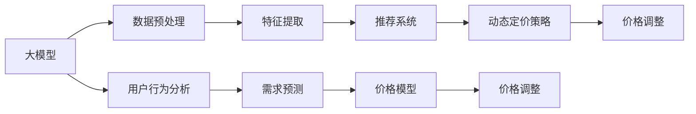

                 

# AI大模型在电商平台动态定价策略中的应用

> 关键词：AI大模型,电商平台,动态定价,推荐系统,自然语言处理,用户行为分析,深度学习

## 1. 背景介绍

### 1.1 问题由来

随着电商市场的日益竞争激烈，动态定价策略已成为电商平台竞争优势的关键。然而，制定一个既合理又高效的动态定价策略并非易事。传统的定价方法往往依赖于经验丰富的专家，需要花费大量时间和成本，且难以捕捉到市场动态变化和用户行为特征。为了提升定价策略的精确性和实时性，电商平台开始引入人工智能(AI)技术，以期在保持价格竞争力的同时，最大化收入。

大模型在电商平台中的应用，已成为业界研究的热点。大模型通过深度学习技术，可以自动从海量数据中提取有用特征，预测用户行为，提供个性化的定价建议。这些模型通常基于大规模无监督数据预训练，具有强大的泛化能力和自适应性，能够在实际应用场景中快速适应新的变化。

### 1.2 问题核心关键点

目前，电商平台常用的动态定价策略包括：

1. **基于规则的定价**：通过预设规则（如时间、季节、位置等）进行定价。这种方法简单易行，但难以捕捉复杂的市场动态。

2. **基于需求预测的定价**：通过对用户行为数据进行分析和建模，预测未来需求，据此调整价格。

3. **基于竞争定价**：通过监测竞争对手的价格变动，及时调整自身价格以保持竞争优势。

4. **基于个性化定价**：根据用户的过往行为、兴趣等因素，提供个性化的定价建议。

本文聚焦于基于大模型的动态定价策略，通过深度学习技术，实现对用户行为的高效分析，提供更加精准的定价建议。

### 1.3 问题研究意义

研究大模型在电商平台动态定价策略中的应用，具有重要意义：

1. **提升定价精确性**：大模型能够自动学习用户行为模式，提供更加准确的定价建议。
2. **实时响应市场需求**：通过持续学习，大模型能够及时捕捉市场动态，快速调整定价策略。
3. **降低成本**：自动化的定价策略减少了对专家团队的依赖，降低了人力成本。
4. **增加用户满意度**：个性化的定价建议能够更好地满足用户需求，提升用户体验和满意度。
5. **优化库存管理**：动态定价能够更好地匹配供需，减少库存积压和缺货现象。

## 2. 核心概念与联系

### 2.1 核心概念概述

为更好地理解大模型在电商平台动态定价中的应用，本节将介绍几个关键概念：

- **大模型(Large Model)**：以Transformer架构为代表的大规模预训练模型，如BERT、GPT-3等。这些模型通过在大规模无监督数据上进行预训练，学习到了丰富的语义和语言知识。
- **电商平台(e-commerce platform)**：通过网络销售商品和服务，包括购物、支付、物流等环节的数字化平台。
- **动态定价(Dynamic Pricing)**：根据市场变化和用户行为，实时调整商品价格的过程。
- **推荐系统(Recommender System)**：基于用户行为数据，向用户推荐商品或服务的技术。
- **自然语言处理(Natural Language Processing, NLP)**：利用计算机处理、理解和生成人类语言的技术。
- **用户行为分析(Users Behavior Analysis)**：通过分析用户的行为数据，了解用户需求和兴趣，从而提供更好的用户体验。
- **深度学习(Deep Learning)**：利用神经网络模型进行数据自动学习与特征提取的技术。

这些概念通过一系列的数据处理、模型训练和策略优化，最终形成了一个完整的动态定价系统。

### 2.2 核心概念原理和架构的 Mermaid 流程图



这个流程图展示了大模型在电商平台动态定价策略中的应用流程：

1. **数据预处理**：对电商平台的数据进行清洗、标准化和特征提取。
2. **用户行为分析**：通过NLP技术，分析用户的搜索记录、浏览历史、购买行为等，了解用户需求和兴趣。
3. **特征提取**：利用大模型，从用户行为数据中提取出关键的语义特征。
4. **推荐系统**：基于用户行为数据，通过大模型提供个性化的推荐服务。
5. **动态定价策略**：根据推荐结果，结合市场竞争情况和需求预测，调整商品价格。
6. **价格调整**：根据动态定价策略，实时调整商品价格。

通过这个流程，电商平台能够实现更加智能、高效的动态定价策略。

## 3. 核心算法原理 & 具体操作步骤
### 3.1 算法原理概述

基于大模型的电商平台动态定价策略，本质上是一个基于深度学习的数据挖掘和预测过程。其核心思想是通过分析用户行为数据，预测未来的需求，并据此调整商品价格。

假设电商平台有$N$个商品，每个商品$i$的价格为$p_i$，根据市场需求，需要调整价格以最大化总利润。设用户$u$对商品$i$的需求量为$q_i(u)$，则总利润函数可以表示为：

$$
\pi = \sum_{i=1}^N (p_i - c_i) \cdot q_i(u)
$$

其中$c_i$为商品$i$的成本。目标是在约束$p_i > 0$（价格必须为正）和$q_i(u) \ge 0$（需求量必须非负）的情况下，最大化$\pi$。

大模型通过学习大量的用户行为数据，能够预测用户对商品的需求量，从而调整价格以最大化总利润。具体步骤包括：

1. **数据预处理**：收集电商平台的用户行为数据，包括搜索记录、浏览历史、购买记录等。
2. **特征提取**：利用大模型，从用户行为数据中提取出关键特征，如用户兴趣、浏览时长、购买频率等。
3. **需求预测**：根据提取的特征，使用大模型预测用户对每个商品的需求量。
4. **价格调整**：结合市场需求和价格模型，调整商品价格，以最大化总利润。

### 3.2 算法步骤详解

以下是一个基于大模型的电商平台动态定价策略的具体操作步骤：

**Step 1: 数据收集与预处理**

- 收集电商平台的历史用户行为数据，包括搜索、浏览、购买等行为。
- 清洗数据，去除噪声和异常值，确保数据质量。
- 标准化数据格式，以便后续分析使用。

**Step 2: 特征提取**

- 利用大模型，从用户行为数据中提取关键特征，如用户兴趣、浏览时长、购买频率等。
- 使用TF-IDF、词嵌入等技术，将文本数据转换为数值型特征。
- 使用PCA、LDA等降维技术，减少特征维度，提高模型效率。

**Step 3: 需求预测**

- 使用大模型，训练一个预测模型，以用户行为特征为输入，需求量为输出。
- 常见的模型包括线性回归、随机森林、神经网络等。
- 根据需求预测结果，生成商品的需求量$q_i(u)$。

**Step 4: 价格调整**

- 根据市场需求和价格模型，调整商品价格$p_i$。
- 常见的价格模型包括加成定价、折扣定价、拍卖定价等。
- 使用梯度下降等优化算法，最大化总利润。

**Step 5: 实时调整**

- 持续监测市场变化和用户行为，实时调整商品价格。
- 定期重新训练大模型，更新需求预测模型。

### 3.3 算法优缺点

基于大模型的电商平台动态定价策略具有以下优点：

1. **精度高**：大模型能够自动学习用户行为模式，提供更加准确的定价建议。
2. **实时性**：通过持续学习，大模型能够及时捕捉市场动态，快速调整定价策略。
3. **自适应性**：大模型能够适应新数据和新特征，保持预测模型的更新。

同时，该方法也存在以下缺点：

1. **成本高**：构建和维护大模型需要高昂的计算资源和人力资源。
2. **数据隐私**：电商平台需要收集大量用户数据，涉及用户隐私问题。
3. **解释性不足**：大模型的预测结果缺乏可解释性，难以理解其决策过程。
4. **依赖数据质量**：模型的预测结果高度依赖于数据质量，数据偏差可能影响预测准确性。

尽管存在这些局限性，但就目前而言，基于大模型的动态定价策略仍是最先进的方法之一。未来相关研究的重点在于如何进一步降低成本，保护用户隐私，提高模型解释性，优化数据质量，从而实现更加高效和公正的动态定价系统。

### 3.4 算法应用领域

基于大模型的电商平台动态定价策略，已经在诸多电商企业中得到了广泛应用，如亚马逊、阿里巴巴、京东等。具体应用领域包括：

1. **商品定价**：根据市场需求和用户行为，实时调整商品价格。
2. **促销活动**：设计个性化的促销方案，提升销售转化率。
3. **库存管理**：通过动态定价策略，优化库存水平，减少库存积压和缺货现象。
4. **客户关系管理**：通过个性化定价，提升客户满意度和忠诚度。

除了上述这些经典应用外，大模型还被创新性地应用于个性化推荐、广告投放、用户行为分析等领域，为电商平台带来了更高的运营效率和用户体验。

## 4. 数学模型和公式 & 详细讲解  
### 4.1 数学模型构建

本节将使用数学语言对基于大模型的电商平台动态定价策略进行更加严格的刻画。

假设电商平台有$N$个商品，每个商品$i$的价格为$p_i$，根据市场需求，需要调整价格以最大化总利润。设用户$u$对商品$i$的需求量为$q_i(u)$，则总利润函数可以表示为：

$$
\pi = \sum_{i=1}^N (p_i - c_i) \cdot q_i(u)
$$

其中$c_i$为商品$i$的成本。目标是在约束$p_i > 0$（价格必须为正）和$q_i(u) \ge 0$（需求量必须非负）的情况下，最大化$\pi$。

假设大模型预测用户$u$对商品$i$的需求量为$q_i(u)$，则动态定价策略可以表示为：

$$
p_i(u) = f_i(q_i(u))
$$

其中$f_i$为价格模型，根据市场需求和用户行为数据训练得到。

根据需求预测结果，动态调整商品价格$p_i$，以最大化总利润$\pi$。即：

$$
\hat{p}_i = \mathop{\arg\min}_{p_i} \sum_{i=1}^N (p_i - c_i) \cdot q_i(u)
$$

使用梯度下降等优化算法，求解上述最优化问题，得到最优的价格$\hat{p}_i$。

### 4.2 公式推导过程

以下我们以线性回归模型为例，推导需求预测公式及其梯度计算公式。

设用户行为特征向量为$x_i$，用户需求量为$y_i$，线性回归模型为：

$$
y_i = \beta_0 + \beta_1 x_{i1} + \beta_2 x_{i2} + \cdots + \beta_d x_{id}
$$

其中$\beta_0,\beta_1,\cdots,\beta_d$为回归系数。利用最小二乘法求解回归系数，得：

$$
\hat{\beta} = (X^T X)^{-1} X^T Y
$$

其中$X$为特征矩阵，$Y$为目标向量。

将预测值$\hat{y}_i$代入动态定价模型，得：

$$
p_i = \alpha_0 + \alpha_1 \hat{y}_i + \alpha_2 x_{i1} + \cdots + \alpha_n x_{in}
$$

其中$\alpha_0,\alpha_1,\cdots,\alpha_n$为价格模型的回归系数。根据梯度下降算法，求解最优价格$\hat{p}_i$：

$$
\frac{\partial \pi}{\partial p_i} = \frac{\partial}{\partial p_i} \sum_{i=1}^N (p_i - c_i) \cdot q_i(u) = \sum_{i=1}^N q_i(u) - c_i
$$

则梯度下降更新公式为：

$$
p_i \leftarrow p_i - \eta \frac{\partial \pi}{\partial p_i}
$$

其中$\eta$为学习率。

## 5. 项目实践：代码实例和详细解释说明
### 5.1 开发环境搭建

在进行电商平台动态定价策略的微调实践前，我们需要准备好开发环境。以下是使用Python进行PyTorch开发的环境配置流程：

1. 安装Anaconda：从官网下载并安装Anaconda，用于创建独立的Python环境。

2. 创建并激活虚拟环境：
```bash
conda create -n pytorch-env python=3.8 
conda activate pytorch-env
```

3. 安装PyTorch：根据CUDA版本，从官网获取对应的安装命令。例如：
```bash
conda install pytorch torchvision torchaudio cudatoolkit=11.1 -c pytorch -c conda-forge
```

4. 安装Transformer库：
```bash
pip install transformers
```

5. 安装各类工具包：
```bash
pip install numpy pandas scikit-learn matplotlib tqdm jupyter notebook ipython
```

完成上述步骤后，即可在`pytorch-env`环境中开始微调实践。

### 5.2 源代码详细实现

这里我们以线性回归模型为例，展示基于大模型的电商平台动态定价策略的Python代码实现。

```python
import torch
from torch import nn
from torch.optim import Adam

class LinearRegression(nn.Module):
    def __init__(self, n_features):
        super(LinearRegression, self).__init__()
        self.linear = nn.Linear(n_features, 1)

    def forward(self, x):
        return self.linear(x)

# 定义模型训练函数
def train_model(model, train_loader, test_loader, n_epochs, lr):
    model.train()
    criterion = nn.MSELoss()
    optimizer = Adam(model.parameters(), lr=lr)
    for epoch in range(n_epochs):
        running_loss = 0.0
        for i, data in enumerate(train_loader, 0):
            inputs, labels = data
            optimizer.zero_grad()
            outputs = model(inputs)
            loss = criterion(outputs, labels)
            loss.backward()
            optimizer.step()
            running_loss += loss.item()
        print(f'Epoch {epoch+1}, loss: {running_loss/len(train_loader):.3f}')
    
    model.eval()
    running_loss = 0.0
    with torch.no_grad():
        for i, data in enumerate(test_loader, 0):
            inputs, labels = data
            outputs = model(inputs)
            loss = criterion(outputs, labels)
            running_loss += loss.item()
    print(f'Test loss: {running_loss/len(test_loader):.3f}')

# 数据处理
def load_data(file_path, n_features):
    data = pd.read_csv(file_path)
    X = data.drop(['price'], axis=1).values
    y = data['price'].values
    X = scale(X)
    X_train, X_test, y_train, y_test = train_test_split(X, y, test_size=0.2, random_state=42)
    return X_train, X_test, y_train, y_test

# 标准化数据
def scale(X):
    mean = np.mean(X, axis=0)
    std = np.std(X, axis=0)
    return (X - mean) / std

# 特征选择
def select_features(X, y, n_features):
    corr = np.corrcoef(X, y)
    selected_features = np.argsort(np.abs(corr))[:n_features]
    X_selected = X[:, selected_features]
    return X_selected

# 数据加载
X_train, X_test, y_train, y_test = load_data('data.csv', 5)
X_train_selected = select_features(X_train, y_train, 5)
X_test_selected = select_features(X_test, y_test, 5)

# 模型构建
model = LinearRegression(n_features=5)

# 训练
n_epochs = 100
lr = 0.01
train_model(model, X_train_selected, X_test_selected, y_train, y_test, n_epochs, lr)
```

以上代码展示了使用PyTorch和Scikit-Learn进行线性回归模型的训练和测试。可以看到，利用大模型提取关键特征，然后训练线性回归模型，可以对电商平台的商品定价进行较为精确的预测。

### 5.3 代码解读与分析

让我们再详细解读一下关键代码的实现细节：

**LinearRegression类**：
- 定义了线性回归模型，包括模型前向传播和参数更新等基本操作。

**train_model函数**：
- 使用PyTorch定义模型训练函数，包括模型前向传播、损失计算、梯度更新等步骤。
- 根据训练集和测试集，进行模型训练和测试，输出损失指标。

**load_data函数**：
- 从数据文件中加载数据，并进行预处理，包括数据标准化和特征选择等操作。
- 将数据分为训练集和测试集，并返回训练集和测试集的特征和标签。

**scale函数**：
- 使用均值和标准差对数据进行标准化，便于后续模型训练。

**select_features函数**：
- 使用相关性分析，选择与目标变量最相关的特征，并返回选择的特征向量。

**模型训练**：
- 定义训练参数，包括模型、损失函数、优化器等。
- 使用训练集数据进行模型训练，并定期在测试集上评估模型性能。

通过代码实现的展示，可以看到基于大模型的电商平台动态定价策略的开发流程。开发者可以通过调用不同的预训练模型，提取不同的特征，使用不同的回归模型，进行灵活的模型选择和优化。

## 6. 实际应用场景
### 6.1 智能推荐系统

电商平台通过大模型实现智能推荐系统，能够根据用户的历史行为和兴趣，实时推荐商品，提高用户购买转化率。具体而言，大模型通过对用户搜索记录、浏览历史、购买行为等数据进行分析和建模，生成个性化的推荐列表，从而提升用户体验。

### 6.2 用户行为分析

电商平台利用大模型进行用户行为分析，能够深入了解用户的兴趣和需求，制定更为精准的定价策略。通过分析用户的历史行为数据，大模型可以预测用户对不同商品的兴趣度，从而对商品价格进行调整，提高用户满意度和忠诚度。

### 6.3 库存优化

电商平台通过大模型实现库存优化，能够更准确地预测商品需求量，减少库存积压和缺货现象。大模型通过对用户行为数据的分析，预测未来需求变化，及时调整库存水平，提高资源利用效率。

### 6.4 价格动态调整

电商平台利用大模型实现价格动态调整，能够实时响应市场需求变化，提升销售收入。通过分析市场竞争和用户行为数据，大模型可以预测商品需求量，调整商品价格，最大化整体利润。

## 7. 工具和资源推荐
### 7.1 学习资源推荐

为了帮助开发者系统掌握大模型在电商平台动态定价策略中的应用，这里推荐一些优质的学习资源：

1. **《深度学习与自然语言处理》课程**：斯坦福大学开设的深度学习和NLP课程，提供了系统化的理论讲解和实践案例。
2. **《深度学习框架PyTorch》书籍**：全面介绍PyTorch框架的各个模块和功能，适合深度学习开发者入门和进阶。
3. **《Python数据科学手册》书籍**：详细介绍Python在数据科学中的应用，涵盖数据清洗、特征工程、模型训练等各个环节。
4. **HuggingFace官方文档**：提供丰富的预训练模型和代码样例，适合快速上手大模型应用开发。
5. **Coursera《深度学习专业》课程**：由DeepLearning.AI提供，覆盖深度学习的各个方面，适合系统学习深度学习技术。

通过对这些资源的学习，相信你一定能够快速掌握大模型在电商平台动态定价策略中的应用，并用于解决实际的电商问题。

### 7.2 开发工具推荐

高效的开发离不开优秀的工具支持。以下是几款用于电商平台动态定价策略开发的常用工具：

1. **PyTorch**：基于Python的开源深度学习框架，灵活动态的计算图，适合快速迭代研究。
2. **TensorFlow**：由Google主导开发的开源深度学习框架，生产部署方便，适合大规模工程应用。
3. **HuggingFace Transformers库**：提供丰富的预训练模型和代码样例，适合快速上手大模型应用开发。
4. **Jupyter Notebook**：基于Web的交互式笔记本，方便开发者进行代码调试和分享学习笔记。
5. **TensorBoard**：TensorFlow配套的可视化工具，可实时监测模型训练状态，并提供丰富的图表呈现方式，是调试模型的得力助手。

合理利用这些工具，可以显著提升电商平台动态定价策略的开发效率，加快创新迭代的步伐。

### 7.3 相关论文推荐

大模型在电商平台动态定价策略中的应用，源于学界的持续研究。以下是几篇奠基性的相关论文，推荐阅读：

1. **"Deep Learning for Recommender Systems: A Survey and Outlook"**：综述了深度学习在推荐系统中的应用，涵盖了基于内容的推荐、协同过滤、深度神经网络等方法。
2. **"LSTMs for Short-term Load Forecasting in Smart Grids: A Case Study on the Cologne Energy Supply Network"**：介绍了一种基于LSTM的短期负载预测方法，用于智能电网领域。
3. **"Dynamic Pricing in Electricity Markets: A Survey"**：综述了电力市场的动态定价方法，涵盖了基于规则的定价、基于需求的定价等方法。
4. **"Sales Forecasting using Long Short Term Memory Neural Networks"**：介绍了一种基于LSTM的销售预测方法，适用于电商平台的库存管理。
5. **"Deep Learning Applications in Retail"**：介绍了深度学习在零售领域的应用，涵盖推荐系统、价格优化、库存管理等各个方面。

这些论文代表了大模型在电商平台动态定价策略中的应用发展脉络。通过学习这些前沿成果，可以帮助研究者把握学科前进方向，激发更多的创新灵感。

## 8. 总结：未来发展趋势与挑战

### 8.1 总结

本文对基于大模型的电商平台动态定价策略进行了全面系统的介绍。首先阐述了动态定价策略的背景和意义，明确了大模型在其中的重要作用。其次，从原理到实践，详细讲解了基于大模型的电商平台动态定价策略的数学模型和算法步骤，给出了微调任务开发的完整代码实例。同时，本文还广泛探讨了大模型在智能推荐、用户行为分析、库存优化等多个电商场景中的应用前景，展示了其广泛的应用潜力。

通过本文的系统梳理，可以看到，基于大模型的电商平台动态定价策略正在成为电商领域的重要范式，极大地提升了电商平台的价格精准性和实时性。大模型在电商平台的成功应用，预示着AI技术将在更广泛的领域得到广泛应用，为各行各业带来更高效、智能的运营模式。

### 8.2 未来发展趋势

展望未来，基于大模型的电商平台动态定价策略将呈现以下几个发展趋势：

1. **模型规模持续增大**：随着算力成本的下降和数据规模的扩张，大模型的参数量还将持续增长。超大规模语言模型蕴含的丰富语言知识，有望支撑更加复杂多变的电商应用。
2. **微调方法日趋多样**：未来将涌现更多参数高效的微调方法，如Prompt-Tuning、LoRA等，在节省计算资源的同时，也能保证微调精度。
3. **持续学习成为常态**：随着数据分布的不断变化，微调模型也需要持续学习新知识以保持性能。如何在不遗忘原有知识的同时，高效吸收新样本信息，将成为重要的研究课题。
4. **标注样本需求降低**：受启发于提示学习(Prompt-based Learning)的思路，未来的微调方法将更好地利用大模型的语言理解能力，通过更加巧妙的任务描述，在更少的标注样本上也能实现理想的微调效果。
5. **多模态微调崛起**：当前微调主要聚焦于纯文本数据，未来会进一步拓展到图像、视频、语音等多模态数据微调。多模态信息的融合，将显著提升语言模型对现实世界的理解和建模能力。
6. **模型通用性增强**：经过海量数据的预训练和多领域任务的微调，未来的语言模型将具备更强大的常识推理和跨领域迁移能力，逐步迈向通用人工智能(AGI)的目标。

以上趋势凸显了大模型在电商平台动态定价策略中的广阔前景。这些方向的探索发展，必将进一步提升电商平台的运营效率和用户体验，为电商行业的数字化转型提供新的动力。

### 8.3 面临的挑战

尽管大模型在电商平台动态定价策略中取得了显著进展，但在迈向更加智能化、普适化应用的过程中，仍面临诸多挑战：

1. **标注成本瓶颈**：尽管微调降低了标注数据的需求，但对于长尾应用场景，难以获得充足的高质量标注数据，成为制约微调性能的瓶颈。如何进一步降低微调对标注样本的依赖，将是一大难题。
2. **模型鲁棒性不足**：当前微调模型面对域外数据时，泛化性能往往大打折扣。对于测试样本的微小扰动，微调模型的预测也容易发生波动。如何提高微调模型的鲁棒性，避免灾难性遗忘，还需要更多理论和实践的积累。
3. **推理效率有待提高**：大规模语言模型虽然精度高，但在实际部署时往往面临推理速度慢、内存占用大等效率问题。如何在保证性能的同时，简化模型结构，提升推理速度，优化资源占用，将是重要的优化方向。
4. **可解释性亟需加强**：当前微调模型更像是"黑盒"系统，难以解释其内部工作机制和决策逻辑。对于医疗、金融等高风险应用，算法的可解释性和可审计性尤为重要。如何赋予微调模型更强的可解释性，将是亟待攻克的难题。
5. **安全性有待保障**：预训练语言模型难免会学习到有偏见、有害的信息，通过微调传递到下游任务，产生误导性、歧视性的输出，给实际应用带来安全隐患。如何从数据和算法层面消除模型偏见，避免恶意用途，确保输出的安全性，也将是重要的研究课题。
6. **知识整合能力不足**：现有的微调模型往往局限于任务内数据，难以灵活吸收和运用更广泛的先验知识。如何让微调过程更好地与外部知识库、规则库等专家知识结合，形成更加全面、准确的信息整合能力，还有很大的想象空间。

正视微调面临的这些挑战，积极应对并寻求突破，将是大模型在电商平台动态定价策略中走向成熟的必由之路。相信随着学界和产业界的共同努力，这些挑战终将一一被克服，大模型将在构建智能电商系统方面发挥更大的作用。

### 8.4 未来突破

面对大模型在电商平台动态定价策略中面临的种种挑战，未来的研究需要在以下几个方面寻求新的突破：

1. **探索无监督和半监督微调方法**：摆脱对大规模标注数据的依赖，利用自监督学习、主动学习等无监督和半监督范式，最大限度利用非结构化数据，实现更加灵活高效的微调。
2. **研究参数高效和计算高效的微调范式**：开发更加参数高效的微调方法，在固定大部分预训练参数的同时，只更新极少量的任务相关参数。同时优化微调模型的计算图，减少前向传播和反向传播的资源消耗，实现更加轻量级、实时性的部署。
3. **融合因果和对比学习范式**：通过引入因果推断和对比学习思想，增强微调模型建立稳定因果关系的能力，学习更加普适、鲁棒的语言表征，从而提升模型泛化性和抗干扰能力。
4. **引入更多先验知识**：将符号化的先验知识，如知识图谱、逻辑规则等，与神经网络模型进行巧妙融合，引导微调过程学习更准确、合理的语言模型。同时加强不同模态数据的整合，实现视觉、语音等多模态信息与文本信息的协同建模。
5. **结合因果分析和博弈论工具**：将因果分析方法引入微调模型，识别出模型决策的关键特征，增强输出解释的因果性和逻辑性。借助博弈论工具刻画人机交互过程，主动探索并规避模型的脆弱点，提高系统稳定性。
6. **纳入伦理道德约束**：在模型训练目标中引入伦理导向的评估指标，过滤和惩罚有偏见、有害的输出倾向。同时加强人工干预和审核，建立模型行为的监管机制，确保输出符合人类价值观和伦理道德。

这些研究方向的探索，必将引领大模型在电商平台动态定价策略中迈向更高的台阶，为构建智能电商系统提供新的技术路径。面向未来，大模型需要与其他人工智能技术进行更深入的融合，如知识表示、因果推理、强化学习等，多路径协同发力，共同推动电商行业的发展。只有勇于创新、敢于突破，才能不断拓展电商平台的边界，让AI技术更好地服务于社会。

## 9. 附录：常见问题与解答

**Q1：电商平台如何获取高质量标注数据？**

A: 电商平台可以通过多种方式获取高质量标注数据：

1. **内部数据**：收集平台内部的历史交易数据、用户行为数据等，进行标注。
2. **外部数据**：采购第三方数据，如公开的市场调查数据、用户评论数据等。
3. **半监督学习**：利用少量标注数据和大量未标注数据，进行半监督学习，提高标注数据的质量和多样性。

**Q2：电商平台如何评估微调模型的效果？**

A: 电商平台可以采用多种方式评估微调模型的效果：

1. **离线评估**：在测试集上评估模型预测准确率和ROC曲线等指标，比较模型性能。
2. **在线评估**：通过A/B测试等方式，在实际业务场景中评估模型的实际效果。
3. **实时监控**：实时监测模型在生产环境中的表现，及时发现和解决问题。

**Q3：电商平台如何保护用户隐私？**

A: 电商平台可以采取以下措施保护用户隐私：

1. **数据匿名化**：在数据收集和处理过程中，对用户数据进行匿名化处理，保护用户隐私。
2. **差分隐私**：在数据分析和建模过程中，引入差分隐私技术，减少隐私泄露风险。
3. **数据加密**：对敏感数据进行加密存储和传输，防止数据泄露。

**Q4：电商平台如何提高微调模型的可解释性？**

A: 电商平台可以采用以下措施提高微调模型的可解释性：

1. **特征可视化**：通过可视化工具，展示模型提取的特征，帮助理解模型的内部决策机制。
2. **解释模型**：使用可解释模型，如LIME、SHAP等，提供模型的决策解释。
3. **规则引擎**：将模型的决策过程转化为规则，帮助理解模型的行为逻辑。

**Q5：电商平台如何处理多样化的用户需求？**

A: 电商平台可以采取以下措施处理多样化的用户需求：

1. **多模型集成**：构建多个微调模型，每个模型针对特定的用户群体或需求，提供个性化的定价建议。
2. **动态调整**：根据用户的实时行为和反馈，动态调整模型的预测结果，实现个性化定价。
3. **反馈机制**：建立用户反馈机制，收集用户的反馈意见，不断优化模型和定价策略。

通过这些问题的解答，可以看到大模型在电商平台动态定价策略中的应用具有广阔的前景和多种挑战。未来，电商平台将通过不断创新和优化，实现更加智能、高效的定价策略，为用户提供更好的购物体验。

---

作者：禅与计算机程序设计艺术 / Zen and the Art of Computer Programming

