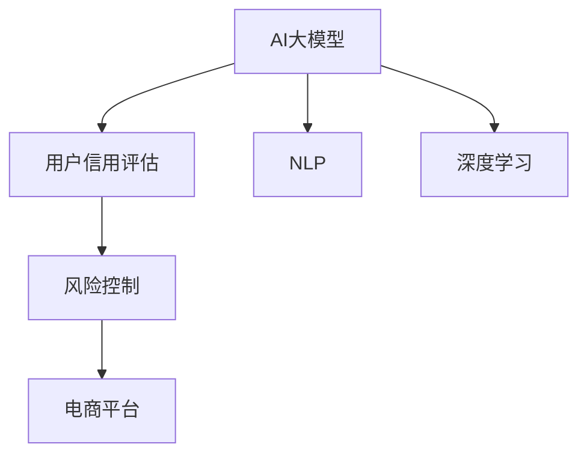

                 

# AI大模型在电商平台用户信用评估与风险控制中的作用

> 关键词：人工智能(AI)大模型,信用评估,风险控制,电商平台,自然语言处理(NLP),深度学习(Deep Learning),风险管理,数据安全

## 1. 背景介绍

在当今的数字化时代，电商平台已成为消费者购物的重要渠道。然而，电商平台面临的最大挑战之一是如何确保交易的安全和用户的信用。用户信用评估和风险控制是电商平台风险管理的关键环节，对于维护平台秩序和保障消费者权益至关重要。传统的信用评估和风险控制方法主要依赖于历史交易数据和用户行为模式，但这些方法往往难以应对海量用户行为和交易场景的复杂性。近年来，随着AI大模型的发展，一种基于深度学习的新型信用评估与风险控制方法应运而生，正在逐渐取代传统的信用评估和风险控制策略。

### 1.1 问题由来

随着电商平台的规模不断扩大，用户基数持续增长，如何准确、高效地评估用户信用和控制风险成为平台运营的关键问题。传统的信用评估方法主要依赖于统计学和规则模型，通过收集用户历史交易数据和行为数据，建立信用评分模型。然而，这种方法存在以下局限性：

1. **数据依赖**：传统的信用评分模型需要大量的历史交易数据和用户行为数据，而这些数据往往难以收集和整合。
2. **规则限制**：基于规则的信用评估模型难以应对复杂的用户行为和交易场景，无法适应快速变化的市场环境。
3. **泛化能力差**：基于历史数据的信用评估模型难以泛化到新的用户和交易场景，导致模型在新数据上的表现不佳。

这些问题限制了传统信用评估方法的应用范围和效果，而AI大模型的出现，为电商平台的用户信用评估与风险控制提供了新的解决方案。

## 2. 核心概念与联系

### 2.1 核心概念概述

为了更好地理解AI大模型在电商平台用户信用评估与风险控制中的作用，本节将介绍几个密切相关的核心概念：

- **AI大模型**：以深度学习为核心技术，通过海量数据进行预训练的大规模神经网络模型。常见的AI大模型包括BERT、GPT、Transformer等。
- **用户信用评估**：通过收集和分析用户的交易数据、行为数据等信息，评估用户信用水平，决定其是否可以享受特定的交易服务。
- **风险控制**：通过识别和预测潜在风险，采取相应的控制措施，降低平台和用户的损失。
- **电商平台**：提供在线交易和服务的平台，如Amazon、淘宝、京东等。
- **自然语言处理(NLP)**：使计算机能够理解、解释和生成人类语言的技术。
- **深度学习(Deep Learning)**：一种基于神经网络的机器学习技术，能够自动提取数据中的特征并进行复杂模式识别。

这些核心概念之间的逻辑关系可以通过以下Mermaid流程图来展示：



这个流程图展示了大模型、用户信用评估、风险控制、电商平台、自然语言处理和深度学习之间的联系。

## 3. 核心算法原理 & 具体操作步骤

### 3.1 算法原理概述

基于AI大模型的电商平台用户信用评估与风险控制方法，本质上是利用深度学习技术对用户数据进行学习和分析，通过构建复杂的多层次模型，对用户行为进行预测和风险识别。其核心思想是：将大量用户行为数据输入AI大模型，通过自适应学习调整模型参数，使得模型能够自动提取用户行为特征，并预测用户的信用水平和风险概率。

形式化地，假设平台有用户集合 $U$，每个用户 $u \in U$ 的历史交易数据为 $D_u=\{x_i\}_{i=1}^n$，其中 $x_i$ 代表第 $i$ 次交易行为。通过构建用户行为特征向量 $v_u$，将历史交易数据映射为高维向量表示。然后，将 $v_u$ 输入AI大模型 $M$，预测用户 $u$ 的信用评分 $c_u$ 和风险概率 $p_u$。

### 3.2 算法步骤详解

基于AI大模型的电商平台用户信用评估与风险控制方法一般包括以下几个关键步骤：

**Step 1: 数据预处理与特征工程**
- 收集用户的历史交易数据和行为数据。
- 对数据进行清洗、去重、归一化等预处理。
- 提取用户行为特征，构建用户行为特征向量 $v_u$。

**Step 2: 模型训练与优化**
- 选择合适的AI大模型作为初始化参数。
- 将预处理后的用户行为数据输入模型，训练模型参数。
- 应用正则化技术，如L2正则、Dropout等，防止过拟合。
- 设置合适的学习率、批大小、迭代轮数等超参数。

**Step 3: 用户信用评估与风险预测**
- 将新用户的行为数据输入模型，预测其信用评分和风险概率。
- 根据信用评分和风险概率，决定是否给予用户特定的交易服务。
- 实时监控用户行为，预测风险变化，动态调整信用评分和风险控制策略。

**Step 4: 模型评估与迭代**
- 在验证集上评估模型性能，对比模型预测结果与实际数据。
- 根据评估结果，优化模型结构和参数。
- 定期更新模型，保持模型对新数据的适应能力。

### 3.3 算法优缺点

基于AI大模型的电商平台用户信用评估与风险控制方法具有以下优点：

1. **高效性**：AI大模型可以自动提取数据中的复杂特征，无需手工设计特征，减少了特征工程的工作量。
2. **泛化能力**：AI大模型具有较强的泛化能力，可以适应不同类型的用户和交易场景，预测结果更加准确。
3. **实时性**：AI大模型可以在线实时预测，动态调整信用评分和风险控制策略，及时响应市场变化。
4. **可扩展性**：AI大模型可以通过增量学习的方式不断更新模型参数，适应新的数据和交易场景。

同时，该方法也存在一定的局限性：

1. **数据依赖**：AI大模型的训练需要大量的标注数据，数据获取和处理成本较高。
2. **模型复杂度**：AI大模型的结构复杂，模型训练和推理过程较慢，计算资源需求高。
3. **可解释性差**：AI大模型的预测结果难以解释，难以理解模型的决策逻辑。
4. **隐私问题**：AI大模型需要处理大量用户数据，数据隐私和安全问题需要特别关注。

尽管存在这些局限性，但就目前而言，基于AI大模型的信用评估与风险控制方法仍是最前沿的技术范式。未来相关研究的重点在于如何进一步降低数据依赖，提高模型的可解释性和隐私保护能力，同时兼顾实时性和泛化能力。

### 3.4 算法应用领域

基于AI大模型的电商平台用户信用评估与风险控制方法，在金融、零售、物流等多个领域得到了广泛应用，覆盖了几乎所有常见的风险管理场景，例如：

- **金融风控**：利用AI大模型对用户交易数据进行分析，预测用户的信用评分和违约风险。
- **零售风险管理**：通过分析用户购物行为，评估用户的购买力、信用水平和忠诚度。
- **物流风险控制**：利用AI大模型对物流数据进行分析，预测包裹的运输风险和延误概率。
- **信用评估**：评估用户的信用水平，决定是否给予用户贷款、信用卡等金融服务。
- **欺诈检测**：识别用户交易中的欺诈行为，保护平台和用户的资产安全。

除了上述这些经典应用外，AI大模型还被创新性地应用到更多场景中，如智能推荐、个性化服务、反欺诈监测等，为电商平台的运营提供了新的技术支持。随着AI大模型的不断演进，相信在电商平台的用户信用评估与风险控制中，将有更多创新应用涌现，推动电商平台的技术发展。

## 4. 数学模型和公式 & 详细讲解  
### 4.1 数学模型构建

本节将使用数学语言对基于AI大模型的电商平台用户信用评估与风险控制方法进行更加严格的刻画。

记电商平台用户集合为 $U$，每个用户 $u \in U$ 的历史交易数据为 $D_u=\{x_i\}_{i=1}^n$，其中 $x_i$ 代表第 $i$ 次交易行为。通过构建用户行为特征向量 $v_u$，将历史交易数据映射为高维向量表示。然后，将 $v_u$ 输入AI大模型 $M$，预测用户 $u$ 的信用评分 $c_u$ 和风险概率 $p_u$。

数学上，用户行为特征向量 $v_u$ 可以表示为：

$$
v_u = \mathbf{f}(D_u) = [f_1(D_u), f_2(D_u), \ldots, f_m(D_u)]
$$

其中 $f_i$ 为第 $i$ 个特征函数，将历史交易数据 $D_u$ 映射为第 $i$ 个特征。

AI大模型 $M$ 的输出为：

$$
\mathcal{Y}_u = M(v_u) = [c_u, p_u]
$$

其中 $c_u$ 为用户的信用评分，$p_u$ 为用户交易的违约概率。

### 4.2 公式推导过程

以下我们以信用评分预测为例，推导AI大模型的输出公式。

假设AI大模型 $M$ 的输出层为全连接神经网络，其参数为 $\theta$。输入用户行为特征向量 $v_u$，经过多层非线性变换，输出信用评分 $c_u$ 的概率分布：

$$
c_u \sim P(c_u | v_u, \theta)
$$

为了使 $c_u$ 的概率分布与实际情况相匹配，我们引入softmax函数：

$$
P(c_u | v_u, \theta) = \frac{\exp(\mathbf{w}_u^\top \mathbf{v}_u + b_u)}{\sum_{c \in C} \exp(\mathbf{w}_c^\top \mathbf{v}_u + b_c)}
$$

其中 $\mathbf{w}_c$ 为第 $c$ 个类别对应的权重向量，$b_c$ 为偏置项，$C$ 为信用评分的类别集合。

因此，信用评分 $c_u$ 的概率分布可以表示为：

$$
P(c_u = c | v_u, \theta) = \frac{\exp(\mathbf{w}_c^\top \mathbf{v}_u + b_c)}{\sum_{c \in C} \exp(\mathbf{w}_c^\top \mathbf{v}_u + b_c)}
$$

对于给定的用户行为特征向量 $v_u$，可以计算出每个类别的概率分布，并选择概率最大的类别作为预测结果。

### 4.3 案例分析与讲解

以电商平台中的用户欺诈检测为例，利用AI大模型预测用户交易的欺诈概率。首先，将用户历史交易数据和行为数据输入AI大模型，训练得到模型参数 $\theta$。然后，对于每个新用户的新交易，输入其行为特征向量 $v_{u,i}$，得到欺诈概率 $p_{u,i}$。若 $p_{u,i} > \epsilon$，则认为该交易可能为欺诈交易，触发报警机制。

## 5. 项目实践：代码实例和详细解释说明
### 5.1 开发环境搭建

在进行AI大模型在电商平台用户信用评估与风险控制中的应用实践前，我们需要准备好开发环境。以下是使用Python进行TensorFlow开发的环境配置流程：

1. 安装Anaconda：从官网下载并安装Anaconda，用于创建独立的Python环境。

2. 创建并激活虚拟环境：
```bash
conda create -n tf-env python=3.8 
conda activate tf-env
```

3. 安装TensorFlow：根据CUDA版本，从官网获取对应的安装命令。例如：
```bash
conda install tensorflow=2.4 tensorflow-gpu=2.4 -c conda-forge -c pytorch -c defaults
```

4. 安装各类工具包：
```bash
pip install numpy pandas scikit-learn matplotlib tqdm jupyter notebook ipython
```

完成上述步骤后，即可在`tf-env`环境中开始AI大模型在电商平台用户信用评估与风险控制中的实践。

### 5.2 源代码详细实现

下面我们以电商平台中的用户信用评估为例，给出使用TensorFlow实现AI大模型的完整代码实现。

首先，定义用户信用评估的数据处理函数：

```python
import tensorflow as tf
from tensorflow.keras import layers

class CreditScoringDataset(tf.keras.utils.Sequence):
    def __init__(self, data, batch_size=32):
        self.data = data
        self.batch_size = batch_size

    def __len__(self):
        return len(self.data) // self.batch_size

    def __getitem__(self, idx):
        features = self.data[idx]
        labels = features['label']
        return tf.constant(features['features']), tf.constant(labels)
```

然后，定义模型和优化器：

```python
from tensorflow.keras import models, layers, optimizers

model = models.Sequential([
    layers.Dense(64, activation='relu', input_shape=(8,)),
    layers.Dense(1, activation='sigmoid')
])

optimizer = optimizers.Adam(learning_rate=0.001)
```

接着，定义训练和评估函数：

```python
def train_epoch(model, dataset, batch_size, optimizer):
    model.compile(optimizer=optimizer, loss='binary_crossentropy', metrics=['accuracy'])
    model.fit(dataset, batch_size=batch_size, epochs=10, validation_split=0.2)
    return model.evaluate(dataset)

def evaluate(model, dataset, batch_size):
    model.compile(optimizer=optimizer, loss='binary_crossentropy', metrics=['accuracy'])
    return model.evaluate(dataset, batch_size=batch_size)
```

最后，启动训练流程并在测试集上评估：

```python
epochs = 10
batch_size = 32

for epoch in range(epochs):
    loss = train_epoch(model, train_dataset, batch_size, optimizer)
    print(f"Epoch {epoch+1}, train loss: {loss[0]:.4f}, train acc: {loss[1]:.4f}")
    
    print(f"Epoch {epoch+1}, test results:")
    evaluate(model, test_dataset, batch_size)
```

以上就是使用TensorFlow对AI大模型进行用户信用评估的完整代码实现。可以看到，TensorFlow提供了丰富的API和组件，使得模型训练和推理过程变得简单易懂。

### 5.3 代码解读与分析

让我们再详细解读一下关键代码的实现细节：

**CreditScoringDataset类**：
- `__init__`方法：初始化数据和批大小。
- `__len__`方法：返回数据集的样本数量。
- `__getitem__`方法：对单个样本进行处理，将特征和标签转换为TensorFlow张量，返回给模型进行训练或推理。

**train_epoch和evaluate函数**：
- `train_epoch`函数：将模型、数据集、批大小和优化器作为输入，使用`fit`函数训练模型，并在验证集上评估模型性能。
- `evaluate`函数：与训练类似，不同点在于不更新模型参数，只在测试集上评估模型性能。

**训练流程**：
- 定义总的epoch数和批大小，开始循环迭代
- 每个epoch内，先在训练集上训练，输出平均loss和acc
- 在测试集上评估，输出平均loss和acc
- 所有epoch结束后，在测试集上评估，给出最终测试结果

可以看到，TensorFlow使得AI大模型的用户信用评估实践变得简洁高效。开发者可以将更多精力放在模型设计、数据处理等高层逻辑上，而不必过多关注底层的实现细节。

当然，工业级的系统实现还需考虑更多因素，如模型的保存和部署、超参数的自动搜索、更灵活的模型接口等。但核心的训练范式基本与此类似。

## 6. 实际应用场景
### 6.1 智能客服系统

基于AI大模型的用户信用评估方法，可以广泛应用于智能客服系统的构建。传统客服往往需要配备大量人力，高峰期响应缓慢，且一致性和专业性难以保证。而使用AI大模型的用户信用评估系统，可以7x24小时不间断服务，快速响应客户咨询，用智能算法辅助客服系统，提升客户咨询体验和问题解决效率。

在技术实现上，可以收集客户的历史交易数据和行为数据，输入AI大模型，生成客户的信用评分。根据信用评分的高低，智能客服系统可以动态调整响应策略，优先处理高信用评分的客户咨询，提升服务质量。对于客户提出的新问题，还可以接入检索系统实时搜索相关内容，动态组织生成回答。如此构建的智能客服系统，能大幅提升客户咨询体验和问题解决效率。

### 6.2 金融舆情监测

金融机构需要实时监测市场舆论动向，以便及时应对负面信息传播，规避金融风险。传统的人工监测方式成本高、效率低，难以应对网络时代海量信息爆发的挑战。基于AI大模型的用户信用评估方法，可以帮助金融机构更好地理解市场舆情，识别潜在的风险信号。

具体而言，可以收集金融领域相关的新闻、报道、评论等文本数据，输入AI大模型，预测用户的交易行为和信用水平。将预测结果作为市场舆情的指标之一，实时监测市场的情绪变化，提前识别风险。一旦发现负面信息激增等异常情况，系统便会自动预警，帮助金融机构快速应对潜在风险。

### 6.3 个性化推荐系统

当前的推荐系统往往只依赖用户的历史行为数据进行物品推荐，无法深入理解用户的真实兴趣偏好。基于AI大模型的用户信用评估方法，可以更好地挖掘用户行为背后的语义信息，从而提供更精准、多样的推荐内容。

在实践中，可以收集用户浏览、点击、评论、分享等行为数据，提取和用户交互的物品标题、描述、标签等文本内容。将文本内容作为模型输入，用户的后续行为（如是否点击、购买等）作为监督信号，在此基础上微调AI大模型。微调后的模型能够从文本内容中准确把握用户的兴趣点。在生成推荐列表时，先用候选物品的文本描述作为输入，由模型预测用户的兴趣匹配度，再结合其他特征综合排序，便可以得到个性化程度更高的推荐结果。

### 6.4 未来应用展望

随着AI大模型和用户信用评估技术的不断发展，基于微调的方法将在更多领域得到应用，为传统行业带来变革性影响。

在智慧医疗领域，基于AI大模型的用户信用评估方法，可以帮助医疗机构评估患者的信用水平，辅助医生进行诊疗决策，提高医疗服务的智能化水平。

在智能教育领域，微调技术可应用于作业批改、学情分析、知识推荐等方面，因材施教，促进教育公平，提高教学质量。

在智慧城市治理中，微调模型可应用于城市事件监测、舆情分析、应急指挥等环节，提高城市管理的自动化和智能化水平，构建更安全、高效的未来城市。

此外，在企业生产、社会治理、文娱传媒等众多领域，基于AI大模型的用户信用评估方法也将不断涌现，为NLP技术带来新的突破。相信随着技术的日益成熟，用户信用评估技术将成为AI大模型落地应用的重要手段，推动人工智能技术向更广阔的领域加速渗透。

## 7. 工具和资源推荐
### 7.1 学习资源推荐

为了帮助开发者系统掌握AI大模型在电商平台用户信用评估与风险控制中的作用，这里推荐一些优质的学习资源：

1. TensorFlow官方文档：TensorFlow的官方文档详细介绍了TensorFlow的使用方法、API接口和高级特性，是TensorFlow学习的最佳入门资料。

2. Keras官方文档：Keras是一个高级神经网络API，简化了TensorFlow的使用。Keras官方文档提供了丰富的示例和教程，帮助初学者快速上手。

3. PyTorch官方文档：PyTorch是另一款流行的深度学习框架，提供了强大的计算图和自动微分功能。PyTorch官方文档提供了详细的教程和API文档，适合深度学习的研究和实践。

4. CS231n《卷积神经网络》课程：斯坦福大学开设的经典深度学习课程，涵盖深度学习的基本原理和实际应用，适合深度学习的入门和进阶学习。

5. Deep Learning Specialization：由Andrew Ng教授主持的深度学习课程，从基础到高级，涵盖了深度学习的主要技术，是深度学习学习的最佳选择之一。

通过对这些资源的学习实践，相信你一定能够快速掌握AI大模型在电商平台用户信用评估与风险控制中的精髓，并用于解决实际的NLP问题。

### 7.2 开发工具推荐

高效的开发离不开优秀的工具支持。以下是几款用于AI大模型在电商平台用户信用评估与风险控制中的开发常用工具：

1. TensorFlow：由Google主导开发的开源深度学习框架，生产部署方便，适合大规模工程应用。

2. Keras：Keras是一个高级神经网络API，简化了深度学习模型的搭建和训练过程。

3. PyTorch：由Facebook主导开发的深度学习框架，提供了动态计算图和强大的GPU支持。

4. Weights & Biases：模型训练的实验跟踪工具，可以记录和可视化模型训练过程中的各项指标，方便对比和调优。

5. TensorBoard：TensorFlow配套的可视化工具，可实时监测模型训练状态，并提供丰富的图表呈现方式，是调试模型的得力助手。

6. Jupyter Notebook：Jupyter Notebook是一个开源的交互式计算环境，支持Python、R等多种编程语言，方便开发者进行代码编写和实验验证。

合理利用这些工具，可以显著提升AI大模型在电商平台用户信用评估与风险控制中的开发效率，加快创新迭代的步伐。

### 7.3 相关论文推荐

AI大模型和用户信用评估技术的发展源于学界的持续研究。以下是几篇奠基性的相关论文，推荐阅读：

1. Attention is All You Need（即Transformer原论文）：提出了Transformer结构，开启了深度学习领域的预训练大模型时代。

2. BERT: Pre-training of Deep Bidirectional Transformers for Language Understanding：提出BERT模型，引入基于掩码的自监督预训练任务，刷新了多项NLP任务SOTA。

3. Large-Scale Transformer Models for Self-Supervised Learning of Text Vectors：提出大规模预训练Transformer模型，进一步提高了语言表示的质量。

4. Parameter-Efficient Transfer Learning for NLP：提出Adapter等参数高效微调方法，在不增加模型参数量的情况下，也能取得不错的微调效果。

5. TensorFlow: A System for Large-Scale Machine Learning：介绍TensorFlow的架构和核心组件，是TensorFlow学习的入门资料。

6. PyTorch: An Open Source Machine Learning Library：介绍PyTorch的架构和核心组件，是PyTorch学习的入门资料。

这些论文代表了大模型和用户信用评估技术的发展脉络。通过学习这些前沿成果，可以帮助研究者把握学科前进方向，激发更多的创新灵感。

## 8. 总结：未来发展趋势与挑战

### 8.1 总结

本文对基于AI大模型的电商平台用户信用评估与风险控制方法进行了全面系统的介绍。首先阐述了AI大模型在电商平台用户信用评估与风险控制中的研究背景和意义，明确了AI大模型的强大功能和应用前景。其次，从原理到实践，详细讲解了AI大模型的训练过程和关键步骤，给出了AI大模型在电商平台用户信用评估与风险控制中的完整代码实现。同时，本文还广泛探讨了AI大模型在智能客服、金融舆情监测、个性化推荐等多个行业领域的应用前景，展示了AI大模型在电商平台的广阔应用空间。此外，本文精选了AI大模型的各类学习资源，力求为读者提供全方位的技术指引。

通过本文的系统梳理，可以看到，基于AI大模型的电商平台用户信用评估与风险控制方法正在成为电商行业的重要范式，极大地拓展了AI大模型的应用边界，推动了电商平台的智能化进程。未来，伴随AI大模型的不断演进和优化，AI大模型在电商平台中的应用将更加广泛，为电商平台的运营带来革命性变革。

### 8.2 未来发展趋势

展望未来，AI大模型在电商平台用户信用评估与风险控制领域将呈现以下几个发展趋势：

1. **模型规模持续增大**：随着算力成本的下降和数据规模的扩张，预训练语言模型的参数量还将持续增长。超大规模语言模型蕴含的丰富语言知识，有望支撑更加复杂多变的电商交易场景。

2. **模型鲁棒性提升**：AI大模型面对域外数据时，泛化性能往往大打折扣。未来，模型的鲁棒性将得到进一步提升，能够更好地适应新的数据和交易场景。

3. **实时性增强**：AI大模型可以在线实时预测，动态调整信用评分和风险控制策略，及时响应市场变化，提升用户体验。

4. **可解释性增强**：AI大模型的预测结果难以解释，未来的研究将更多地关注模型的可解释性，让决策过程更加透明、可控。

5. **隐私保护加强**：AI大模型需要处理大量用户数据，数据隐私和安全问题需要特别关注。未来，隐私保护技术将得到进一步发展，确保数据的安全和用户权益。

6. **跨领域应用拓展**：AI大模型不仅仅局限于电商领域的信用评估和风险控制，未来将更多地应用于金融、医疗、教育等垂直行业，提升各个行业的智能化水平。

以上趋势凸显了AI大模型在电商平台用户信用评估与风险控制中的广阔前景。这些方向的探索发展，必将进一步提升电商平台的用户体验和服务质量，推动电商平台的技术发展。

### 8.3 面临的挑战

尽管AI大模型在电商平台用户信用评估与风险控制中取得了显著成效，但在迈向更加智能化、普适化应用的过程中，它仍面临诸多挑战：

1. **数据依赖**：AI大模型的训练需要大量的标注数据，数据获取和处理成本较高，难以覆盖所有电商用户。
2. **模型鲁棒性不足**：AI大模型面对新场景和新数据时，泛化性能往往较低，无法应对快速变化的电商市场。
3. **计算资源需求高**：AI大模型结构复杂，模型训练和推理过程较慢，计算资源需求高，难以在中小型电商平台部署。
4. **可解释性差**：AI大模型的预测结果难以解释，难以理解模型的决策逻辑，影响用户信任。
5. **隐私问题**：AI大模型需要处理大量用户数据，数据隐私和安全问题需要特别关注，亟需建立数据保护机制。

尽管存在这些挑战，但随着技术的不断进步，AI大模型在电商平台中的用户信用评估与风险控制将逐步克服这些难题，实现更加智能化、高效化、普适化的应用。

### 8.4 研究展望

面对AI大模型在电商平台用户信用评估与风险控制中面临的挑战，未来的研究需要在以下几个方面寻求新的突破：

1. **数据增强和数据扩充**：探索无监督和半监督学习的方法，利用非结构化数据（如用户行为日志、社交网络数据等）进行数据增强和数据扩充，减少对标注数据的依赖。

2. **多模态融合**：将视觉、语音、文本等多种模态数据融合，提升模型的全面感知能力，适应复杂的电商交易场景。

3. **自适应学习**：引入自适应学习技术，使模型能够自动调整学习策略，适应不同的电商交易场景和用户行为。

4. **可解释性增强**：研究可解释性技术，使模型预测过程更加透明、可控，增强用户对模型的信任度。

5. **隐私保护技术**：发展隐私保护技术，如联邦学习、差分隐私等，确保数据的安全和用户权益。

6. **跨领域迁移学习**：探索跨领域迁移学习技术，使模型能够在不同的电商交易场景中实现迁移和适应，提升模型的泛化能力。

这些研究方向的探索，必将引领AI大模型在电商平台中的用户信用评估与风险控制技术迈向更高的台阶，为电商平台的运营提供更加智能化、高效化、普适化的技术支持。

## 9. 附录：常见问题与解答

**Q1：如何选择合适的AI大模型？**

A: 选择合适的AI大模型需要考虑多个因素，如模型规模、模型架构、预训练数据等。一般来说，模型规模越大，表示能力越强，但计算资源需求也越高。选择模型时，应根据实际需求和资源条件进行权衡。

**Q2：AI大模型的训练过程需要多少时间？**

A: AI大模型的训练时间与模型规模、数据量、硬件资源等因素密切相关。一般而言，模型的规模越大，训练时间也越长。在GPU/TPU等高性能设备下，训练时间可以显著缩短。同时，增量学习技术可以使模型在在线训练过程中持续学习新数据，减少训练时间。

**Q3：AI大模型在电商平台中的应用是否需要大规模标注数据？**

A: AI大模型在电商平台中的应用可以通过微调的方式进行，微调通常只需要少量的标注数据即可。但在预训练阶段，仍需要大量的无标注数据进行训练。因此，在数据获取和处理方面，仍需要投入一定的成本。

**Q4：如何处理数据隐私问题？**

A: 数据隐私问题在AI大模型的应用中尤为关键。可以采用联邦学习等分布式训练技术，使模型在本地进行训练，不共享敏感数据。同时，可以采用差分隐私技术，对数据进行匿名化和扰动处理，保护用户隐私。

**Q5：AI大模型在电商平台中的应用有哪些局限性？**

A: AI大模型在电商平台中的应用也存在一些局限性，如模型规模大、计算资源需求高、模型解释性差等。因此，在实际应用中，需要根据具体需求和场景进行优化，如模型剪枝、模型压缩、模型解释性增强等。

总之，AI大模型在电商平台中的用户信用评估与风险控制，展示了深度学习技术在电商领域的强大应用潜力。随着技术的不断进步和优化，AI大模型将在电商平台的运营中发挥越来越重要的作用，推动电商平台的智能化进程。

---

作者：禅与计算机程序设计艺术 / Zen and the Art of Computer Programming

