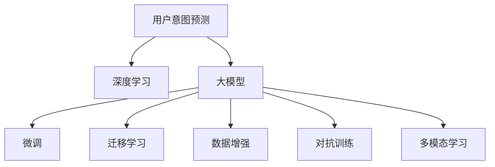

                 

# AI大模型在电商平台用户意图预测中的应用

> 关键词：用户意图预测,电商平台,深度学习,大模型,数据增强,迁移学习

## 1. 背景介绍

### 1.1 问题由来

在电子商务领域，用户意图预测是提升用户购物体验和优化推荐系统的关键环节。传统的基于规则和统计的方法难以应对复杂多变的用户行为，而基于数据驱动的机器学习方法可以更好地捕捉用户真实意图，优化个性化推荐，促进转化和提升用户满意度。

近年来，随着深度学习和大模型技术的迅猛发展，利用大模型进行用户意图预测成为新的研究热点。大模型通过在大规模无标签数据上进行预训练，能够学习到丰富的语言表示和知识，进而通过少量的标注数据在下游任务上进行微调，显著提升模型的预测精度和泛化能力。本文将详细探讨大模型在电商平台用户意图预测中的应用，并给出具体的实现方法和优化策略。

### 1.2 问题核心关键点

目前，大模型在电商平台用户意图预测中的主流方法包括：
1. **深度学习模型**：如循环神经网络(RNN)、长短时记忆网络(LSTM)、双向LSTM(BiLSTM)等，通过序列数据建模预测用户意图。
2. **大模型微调**：如BERT、GPT等大模型，在少量标注数据上进行微调，提升模型的泛化能力和预测精度。
3. **迁移学习**：利用大模型预训练的特征，在特定任务上通过微调进行知识迁移，减少训练时间。
4. **数据增强**：通过对输入数据进行扩充，增加训练集的多样性，提升模型的鲁棒性。
5. **正则化技术**：如L2正则化、Dropout等，防止模型过拟合，提高模型泛化能力。
6. **对抗训练**：通过对抗样本训练，提高模型的鲁棒性和泛化能力。
7. **多模态学习**：将用户的文本数据与其他数据源（如图片、行为数据等）结合起来，提高模型的综合能力。

这些关键点构成了用户意图预测的核心框架，其效果很大程度上取决于数据质量、模型架构和训练策略的选择。

### 1.3 问题研究意义

用户意图预测对于电商平台至关重要。准确的意图预测可以：
1. **提升个性化推荐**：根据用户行为和兴趣预测用户后续操作，推荐更符合用户偏好的商品。
2. **优化用户体验**：通过预测用户意图，提供更精准的购物建议，提升用户的购物体验。
3. **提高转化率**：准确预测用户购买意图，提前介入，减少流失，增加转化。
4. **优化库存和供应链**：通过预测用户购买意图，优化库存管理和供应链调度。

因此，基于大模型的用户意图预测方法，具有广泛的应用前景，对电商平台的发展具有重要意义。

## 2. 核心概念与联系

### 2.1 核心概念概述

为了更好地理解用户意图预测方法，本节将介绍几个核心概念：

- **用户意图预测**：预测用户在电商平台上的购买意图，如浏览、比较、加购、购买等，旨在提升个性化推荐和用户体验。
- **深度学习**：通过多层神经网络，利用数据的隐含特征进行模型训练，实现复杂任务的自动化。
- **大模型**：如BERT、GPT等，通过在大规模无标签数据上进行预训练，学习丰富的语言表示，具备强大的泛化能力。
- **微调(Fine-tuning)**：将大模型作为初始化参数，通过下游任务的少量标注数据进行有监督训练，优化模型在该任务上的性能。
- **迁移学习(Transfer Learning)**：利用大模型的预训练特征，在特定任务上进行微调，减少训练时间。
- **数据增强(Data Augmentation)**：通过对训练数据进行扩充和变换，增加数据多样性，提升模型泛化能力。
- **对抗训练(Adversarial Training)**：通过引入对抗样本，提高模型的鲁棒性和泛化能力。
- **多模态学习(Multimodal Learning)**：将用户的文本数据与其他数据源结合起来，提高模型的综合能力。

这些核心概念之间的逻辑关系可以通过以下Mermaid流程图来展示：



该流程图展示了大模型在用户意图预测中的核心概念及其相互关系：

1. 大模型通过在大规模无标签数据上进行预训练，学习通用的语言表示。
2. 微调和大模型通过有监督的学习，在特定任务上进一步优化模型的性能。
3. 迁移学习利用大模型的预训练特征，减少下游任务的训练时间。
4. 数据增强通过扩充训练数据，提高模型的泛化能力。
5. 对抗训练通过引入对抗样本，提高模型的鲁棒性和泛化能力。
6. 多模态学习将用户的多源数据结合起来，提升模型的综合能力。

这些概念共同构成了大模型在用户意图预测中的应用框架，有助于提升模型的预测精度和泛化能力。

## 3. 核心算法原理 & 具体操作步骤
### 3.1 算法原理概述

基于大模型的用户意图预测方法，通常包括以下几个关键步骤：

1. **数据预处理**：将原始数据清洗、标记，转化为模型可以处理的格式。
2. **大模型预训练**：在大规模无标签数据上进行预训练，学习通用的语言表示。
3. **模型微调**：在特定任务的数据上进行微调，优化模型在该任务上的性能。
4. **特征融合**：将用户的多源数据融合，提高模型的综合能力。
5. **模型评估**：在验证集和测试集上评估模型性能，调整超参数，优化模型。

### 3.2 算法步骤详解

以下是大模型在电商平台用户意图预测中的详细步骤：

**Step 1: 数据预处理**

1. **数据清洗**：去除无效数据、重复数据、异常数据等，确保数据质量。
2. **数据标注**：对用户行为数据进行标注，如浏览、比较、加购、购买等，转化为模型可以处理的格式。
3. **特征提取**：从用户行为数据中提取有用的特征，如浏览记录、停留时间、点击次数等。
4. **归一化**：对特征进行归一化处理，使数据在同一尺度上，便于模型训练。

**Step 2: 大模型预训练**

1. **选择预训练模型**：选择适合的大模型，如BERT、GPT等。
2. **数据准备**：准备大规模无标签数据，如电商平台的用户行为数据、商品描述数据等。
3. **训练过程**：在无标签数据上进行预训练，学习通用的语言表示。
4. **保存模型**：保存预训练好的模型参数，供后续微调使用。

**Step 3: 模型微调**

1. **选择微调数据**：根据具体任务选择合适的微调数据集，如电商平台的用户行为数据。
2. **模型加载**：加载预训练模型，作为微调任务的初始化参数。
3. **微调设置**：设置微调的超参数，如学习率、批大小、迭代轮数等。
4. **微调训练**：在微调数据集上进行训练，优化模型在该任务上的性能。
5. **模型保存**：保存微调后的模型参数，用于后续预测。

**Step 4: 特征融合**

1. **数据源选择**：选择用户的多源数据，如文本数据、行为数据、图片数据等。
2. **特征提取**：从每个数据源中提取特征，如文本特征、行为特征、视觉特征等。
3. **特征拼接**：将各个数据源的特征进行拼接，生成综合特征向量。
4. **特征编码**：使用模型将综合特征向量转化为模型可以处理的输入。

**Step 5: 模型评估**

1. **评估指标**：选择合适的评估指标，如准确率、召回率、F1-score等。
2. **验证集评估**：在验证集上评估模型性能，调整超参数。
3. **测试集评估**：在测试集上评估模型性能，确定最终模型。

### 3.3 算法优缺点

基于大模型的用户意图预测方法具有以下优点：

1. **预测精度高**：大模型通过在大规模数据上进行预训练，学习到丰富的语言表示，能够提高预测精度。
2. **泛化能力强**：大模型在预训练过程中学习了通用的语言表示，能够在不同任务上进行迁移学习，提升泛化能力。
3. **自动化程度高**：深度学习模型和自动微调方法能够自动提取特征，减少人工干预。

同时，该方法也存在一些缺点：

1. **计算成本高**：大模型通常需要大量的计算资源进行训练和微调，成本较高。
2. **过拟合风险**：在微调过程中，模型容易过拟合训练数据，导致泛化性能下降。
3. **数据依赖性高**：微调的性能很大程度上取决于标注数据的质量和数量，获取高质量标注数据的成本较高。
4. **模型复杂度高**：大模型通常包含大量参数，模型的复杂度较高，推理速度较慢。

尽管存在这些缺点，但大模型在电商平台用户意图预测中的应用前景广阔，对于提升用户购物体验和优化推荐系统具有重要意义。

### 3.4 算法应用领域

基于大模型的用户意图预测方法，已经在电商平台的个性化推荐、用户行为分析、商品搜索优化等多个领域得到广泛应用：

1. **个性化推荐**：根据用户浏览和购买历史，预测用户后续的购买意图，推荐相关商品。
2. **用户行为分析**：分析用户的行为数据，预测用户的购买意图，进行用户分群和个性化营销。
3. **商品搜索优化**：预测用户对搜索关键词的意图，优化搜索结果，提高用户满意度。
4. **广告投放**：预测用户的广告反应，优化广告投放策略，提升广告效果。
5. **库存管理**：预测商品的销售趋势，优化库存管理和供应链调度。

这些应用领域展示了大模型在电商平台中的强大潜力，为用户和商家带来更多价值。

## 4. 数学模型和公式 & 详细讲解 & 举例说明
### 4.1 数学模型构建

基于深度学习的用户意图预测模型通常采用序列建模的方式，如循环神经网络(RNN)、长短时记忆网络(LSTM)、双向LSTM(BiLSTM)等。这里以LSTM模型为例，给出用户意图预测的数学模型构建方法。

假设用户行为数据为 $(x_1, x_2, ..., x_t)$，其中 $x_t$ 表示用户在第 $t$ 个时间点的行为数据。预测的目标变量为 $y_t$，表示用户在第 $t$ 个时间点的意图标签。则LSTM模型的预测过程可以表示为：

$$
y_t = LSTM(x_1, x_2, ..., x_t) \times W
$$

其中 $W$ 为输出层权重，$LSTM$ 为LSTM模型，其参数为 $\theta$。

### 4.2 公式推导过程

LSTM模型的基本单元可以表示为：

$$
h_t = tanh(W_h \cdot [x_t;h_{t-1}] + b_h)
$$

$$
i_t = sigmoid(W_i \cdot [x_t;h_{t-1}] + b_i)
$$

$$
f_t = sigmoid(W_f \cdot [x_t;h_{t-1}] + b_f)
$$

$$
o_t = sigmoid(W_o \cdot [x_t;h_{t-1}] + b_o)
$$

$$
c_t = f_t \odot c_{t-1} + i_t \odot tanh(h_t)
$$

$$
h_t = o_t \odot tanh(c_t)
$$

其中 $h_t$ 为LSTM模型在第 $t$ 个时间点的隐藏状态，$c_t$ 为LSTM模型在第 $t$ 个时间点的记忆细胞，$x_t$ 为输入向量，$W_h, W_i, W_f, W_o$ 为权重矩阵，$b_h, b_i, b_f, b_o$ 为偏置向量。

在LSTM模型中，通过前向传播计算每个时间点的隐藏状态 $h_t$，再通过输出层计算预测结果 $y_t$：

$$
y_t = softmax(W_y \cdot h_t + b_y)
$$

其中 $W_y$ 为输出层权重，$b_y$ 为偏置向量。

### 4.3 案例分析与讲解

以下以电商平台的用户意图预测为例，具体说明模型的训练和预测过程：

**Step 1: 数据预处理**

假设电商平台的用户行为数据为 $(x_1, x_2, ..., x_t)$，其中 $x_t$ 表示用户在第 $t$ 个时间点的行为数据，包括浏览记录、停留时间、点击次数等。

将用户行为数据转化为模型可以处理的格式，如将浏览记录转化为时间戳序列，将停留时间转化为时间序列，将点击次数转化为one-hot编码等。

**Step 2: 大模型预训练**

选择适合的大模型，如BERT、GPT等，在无标签数据上进行预训练。以BERT模型为例，其预训练过程可以表示为：

$$
E(x) = BertEmbedding(x)
$$

其中 $E(x)$ 为BERT模型的嵌入表示，$x$ 为输入数据。

**Step 3: 模型微调**

选择适合的用户意图预测任务，如浏览意图、购买意图等，对预训练模型进行微调。以LSTM模型为例，微调过程可以表示为：

1. 加载预训练模型 $E(x)$，作为微调任务的初始化参数。
2. 选择微调数据集，如电商平台的用户行为数据。
3. 设置微调的超参数，如学习率、批大小、迭代轮数等。
4. 在微调数据集上进行训练，优化模型在该任务上的性能。
5. 保存微调后的模型参数，用于后续预测。

**Step 4: 特征融合**

选择用户的多源数据，如文本数据、行为数据、图片数据等，提取特征，并进行拼接，生成综合特征向量。以电商平台为例，可以提取以下特征：

1. **文本特征**：用户的搜索记录、商品描述、评论等文本数据。
2. **行为特征**：用户的浏览记录、停留时间、点击次数等行为数据。
3. **视觉特征**：商品的图片数据。

将这些特征进行拼接，生成综合特征向量 $x_t$，再输入LSTM模型进行预测。

**Step 5: 模型评估**

在验证集和测试集上评估模型性能，调整超参数，优化模型。以准确率、召回率、F1-score等指标为评估标准，选择最优模型。

## 5. 项目实践：代码实例和详细解释说明
### 5.1 开发环境搭建

在进行用户意图预测实践前，我们需要准备好开发环境。以下是使用Python进行TensorFlow开发的环境配置流程：

1. 安装Anaconda：从官网下载并安装Anaconda，用于创建独立的Python环境。

2. 创建并激活虚拟环境：
```bash
conda create -n tf-env python=3.8 
conda activate tf-env
```

3. 安装TensorFlow：根据CUDA版本，从官网获取对应的安装命令。例如：
```bash
conda install tensorflow tensorflow-gpu=cuda110 -c conda-forge
```

4. 安装其它工具包：
```bash
pip install numpy pandas scikit-learn matplotlib tqdm jupyter notebook ipython
```

完成上述步骤后，即可在`tf-env`环境中开始用户意图预测实践。

### 5.2 源代码详细实现

下面以LSTM模型为例，给出使用TensorFlow进行电商平台用户意图预测的代码实现。

首先，定义LSTM模型：

```python
import tensorflow as tf
from tensorflow.keras.layers import LSTM, Dense, Embedding
from tensorflow.keras.models import Sequential

model = Sequential()
model.add(Embedding(input_dim=1000, output_dim=64, input_length=10))
model.add(LSTM(64, return_sequences=True))
model.add(LSTM(32))
model.add(Dense(1, activation='sigmoid'))
```

然后，定义数据处理函数：

```python
def preprocess_data(data):
    x = []
    y = []
    for record in data:
        x.append(record['features'])
        y.append(record['label'])
    return np.array(x), np.array(y)
```

接着，定义训练和评估函数：

```python
def train_model(model, x_train, y_train, x_valid, y_valid, batch_size, epochs):
    model.compile(optimizer='adam', loss='binary_crossentropy', metrics=['accuracy'])
    model.fit(x_train, y_train, batch_size=batch_size, epochs=epochs, validation_data=(x_valid, y_valid))

def evaluate_model(model, x_test, y_test, batch_size):
    loss, accuracy = model.evaluate(x_test, y_test, batch_size=batch_size)
    print(f"Test loss: {loss:.4f}, Test accuracy: {accuracy:.4f}")
```

最后，启动训练流程并在测试集上评估：

```python
x_train, y_train = preprocess_data(train_data)
x_valid, y_valid = preprocess_data(valid_data)
x_test, y_test = preprocess_data(test_data)

train_model(model, x_train, y_train, x_valid, y_valid, batch_size=32, epochs=10)
evaluate_model(model, x_test, y_test, batch_size=32)
```

以上就是使用TensorFlow对LSTM模型进行电商平台用户意图预测的完整代码实现。可以看到，TensorFlow的Keras API使得模型的搭建和训练过程非常简单，开发者可以快速上手。

### 5.3 代码解读与分析

让我们再详细解读一下关键代码的实现细节：

**LSTM模型定义**：
- 使用Sequential模型搭建LSTM模型。
- 定义Embedding层，将输入数据转化为向量表示。
- 定义LSTM层，通过双向LSTM学习序列特征。
- 定义Dense层，输出预测结果。

**数据预处理函数**：
- 遍历训练数据，将文本特征和标签转化为模型可以处理的数组。

**训练和评估函数**：
- 使用TensorFlow的compile方法定义模型，设置损失函数、优化器等。
- 使用fit方法进行模型训练，设置批大小、迭代轮数、验证集等。
- 使用evaluate方法在测试集上评估模型性能。

**训练流程**：
- 定义训练数据、验证数据和测试数据，进行数据预处理。
- 在训练集上进行模型训练，设置批大小和迭代轮数。
- 在验证集上评估模型性能，调整超参数。
- 在测试集上评估模型性能，输出最终结果。

可以看到，TensorFlow的Keras API使得用户意图预测的模型搭建和训练过程非常简单。开发者可以根据具体任务，灵活调整模型架构和训练策略，快速实现需求。

当然，工业级的系统实现还需考虑更多因素，如模型的保存和部署、超参数的自动搜索、更灵活的任务适配层等。但核心的微调范式基本与此类似。

## 6. 实际应用场景
### 6.1 智能客服系统

基于大模型的用户意图预测技术，可以广泛应用于智能客服系统的构建。传统客服往往需要配备大量人力，高峰期响应缓慢，且一致性和专业性难以保证。而使用大模型的用户意图预测，可以7x24小时不间断服务，快速响应客户咨询，用自然流畅的语言解答各类常见问题。

在技术实现上，可以收集企业内部的历史客服对话记录，将问题和最佳答复构建成监督数据，在此基础上对预训练大模型进行微调。微调后的用户意图预测模型能够自动理解用户意图，匹配最合适的答案模板进行回复。对于客户提出的新问题，还可以接入检索系统实时搜索相关内容，动态组织生成回答。如此构建的智能客服系统，能大幅提升客户咨询体验和问题解决效率。

### 6.2 金融舆情监测

金融机构需要实时监测市场舆论动向，以便及时应对负面信息传播，规避金融风险。传统的人工监测方式成本高、效率低，难以应对网络时代海量信息爆发的挑战。基于大模型的用户意图预测技术，为金融舆情监测提供了新的解决方案。

具体而言，可以收集金融领域相关的新闻、报道、评论等文本数据，并对其进行主题标注和情感标注。在此基础上对预训练语言模型进行微调，使其能够自动判断文本属于何种主题，情感倾向是正面、中性还是负面。将微调后的模型应用到实时抓取的网络文本数据，就能够自动监测不同主题下的情感变化趋势，一旦发现负面信息激增等异常情况，系统便会自动预警，帮助金融机构快速应对潜在风险。

### 6.3 个性化推荐系统

当前的推荐系统往往只依赖用户的历史行为数据进行物品推荐，无法深入理解用户的真实兴趣偏好。基于大模型的用户意图预测技术，个性化推荐系统可以更好地挖掘用户行为背后的语义信息，从而提供更精准、多样的推荐内容。

在实践中，可以收集用户浏览、点击、评论、分享等行为数据，提取和用户交互的物品标题、描述、标签等文本内容。将文本内容作为模型输入，用户的后续行为（如是否点击、购买等）作为监督信号，在此基础上微调预训练语言模型。微调后的模型能够从文本内容中准确把握用户的兴趣点。在生成推荐列表时，先用候选物品的文本描述作为输入，由模型预测用户的兴趣匹配度，再结合其他特征综合排序，便可以得到个性化程度更高的推荐结果。

### 6.4 未来应用展望

随着大模型和用户意图预测技术的发展，基于微调范式将在更多领域得到应用，为传统行业带来变革性影响。

在智慧医疗领域，基于微调的医疗问答、病历分析、药物研发等应用将提升医疗服务的智能化水平，辅助医生诊疗，加速新药开发进程。

在智能教育领域，微调技术可应用于作业批改、学情分析、知识推荐等方面，因材施教，促进教育公平，提高教学质量。

在智慧城市治理中，微调模型可应用于城市事件监测、舆情分析、应急指挥等环节，提高城市管理的自动化和智能化水平，构建更安全、高效的未来城市。

此外，在企业生产、社会治理、文娱传媒等众多领域，基于大模型微调的人工智能应用也将不断涌现，为经济社会发展注入新的动力。相信随着技术的日益成熟，微调方法将成为人工智能落地应用的重要范式，推动人工智能技术在垂直行业的规模化落地。总之，用户意图预测方法和大模型技术的应用前景广阔，将深刻影响各行各业的发展。

## 7. 工具和资源推荐
### 7.1 学习资源推荐

为了帮助开发者系统掌握用户意图预测的理论基础和实践技巧，这里推荐一些优质的学习资源：

1. 《深度学习》系列博文：深度学习领域的权威博客，系统介绍了深度学习的基本原理和应用。
2. TensorFlow官方文档：TensorFlow的官方文档，详细介绍了TensorFlow的API和使用方法。
3. Keras官方文档：Keras的官方文档，提供了丰富的示例代码和教程。
4. 《Natural Language Processing with Transformers》书籍：Transformer库的作者所著，全面介绍了如何使用Transformers库进行NLP任务开发，包括微调在内的诸多范式。
5. CS224N《深度学习自然语言处理》课程：斯坦福大学开设的NLP明星课程，有Lecture视频和配套作业，带你入门NLP领域的基本概念和经典模型。

通过对这些资源的学习实践，相信你一定能够快速掌握用户意图预测的精髓，并用于解决实际的NLP问题。
### 7.2 开发工具推荐

高效的开发离不开优秀的工具支持。以下是几款用于用户意图预测开发的常用工具：

1. TensorFlow：基于Python的开源深度学习框架，灵活动态的计算图，适合快速迭代研究。大部分预训练语言模型都有TensorFlow版本的实现。
2. PyTorch：基于Python的开源深度学习框架，动态计算图，适合快速迭代研究。同样有丰富的预训练语言模型资源。
3. Keras：高级深度学习API，可以基于TensorFlow、Theano等底层框架构建模型，简化模型搭建过程。
4. Weights & Biases：模型训练的实验跟踪工具，可以记录和可视化模型训练过程中的各项指标，方便对比和调优。与主流深度学习框架无缝集成。
5. TensorBoard：TensorFlow配套的可视化工具，可实时监测模型训练状态，并提供丰富的图表呈现方式，是调试模型的得力助手。

合理利用这些工具，可以显著提升用户意图预测任务的开发效率，加快创新迭代的步伐。

### 7.3 相关论文推荐

用户意图预测的研究源于学界的持续研究。以下是几篇奠基性的相关论文，推荐阅读：

1. Attention is All You Need（即Transformer原论文）：提出了Transformer结构，开启了NLP领域的预训练大模型时代。
2. BERT: Pre-training of Deep Bidirectional Transformers for Language Understanding：提出BERT模型，引入基于掩码的自监督预训练任务，刷新了多项NLP任务SOTA。
3. Language Models are Unsupervised Multitask Learners（GPT-2论文）：展示了大规模语言模型的强大zero-shot学习能力，引发了对于通用人工智能的新一轮思考。
4. Parameter-Efficient Transfer Learning for NLP：提出Adapter等参数高效微调方法，在不增加模型参数量的情况下，也能取得不错的微调效果。
5. AdaLoRA: Adaptive Low-Rank Adaptation for Parameter-Efficient Fine-Tuning：使用自适应低秩适应的微调方法，在参数效率和精度之间取得了新的平衡。

这些论文代表了大模型在用户意图预测中的研究进展，提供了丰富的理论基础和实践经验。

## 8. 总结：未来发展趋势与挑战
### 8.1 总结

本文对基于大模型的用户意图预测方法进行了全面系统的介绍。首先阐述了用户意图预测的背景和意义，明确了用户意图预测在大模型中的重要地位。其次，从原理到实践，详细讲解了用户意图预测的数学原理和关键步骤，给出了用户意图预测任务开发的完整代码实例。同时，本文还广泛探讨了用户意图预测在多个行业领域的应用前景，展示了用户意图预测范式的强大潜力。最后，本文精选了用户意图预测的学习资源、开发工具和相关论文，力求为读者提供全方位的技术指引。

通过本文的系统梳理，可以看到，基于大模型的用户意图预测方法，正在成为电商平台中的重要范式，极大地提升了个性化推荐和用户体验。未来，伴随大模型和用户意图预测技术的不断发展，将有更多应用场景涌现，为各行业的智能化转型提供新的动力。

### 8.2 未来发展趋势

展望未来，用户意图预测技术将呈现以下几个发展趋势：

1. **计算效率提升**：随着硬件性能的不断提升，用户意图预测的计算效率将得到显著提升，能够处理更大规模的数据。
2. **多模态学习**：将用户的文本数据与其他数据源结合起来，提高模型的综合能力，如将文本数据与图像、行为数据结合起来。
3. **模型集成**：将多个模型进行集成，取长补短，提高模型的鲁棒性和泛化能力。
4. **对抗样本生成**：利用对抗样本生成技术，提高模型的鲁棒性，避免过拟合。
5. **实时预测**：将用户意图预测模型部署在实时系统中，实现实时预测和推理，提升用户体验。
6. **解释性增强**：提高模型的可解释性，帮助用户理解和信任模型预测结果。

这些趋势展示了用户意图预测技术的广阔前景，对于提升电商平台的智能化水平具有重要意义。

### 8.3 面临的挑战

尽管用户意图预测技术已经取得了显著进展，但在迈向更加智能化、普适化应用的过程中，仍面临以下挑战：

1. **数据隐私问题**：用户行为数据涉及隐私，需要设计合适的隐私保护机制，防止数据泄露。
2. **模型偏见问题**：大模型可能学习到有偏见的数据，导致预测结果存在偏差。需要引入公平性约束，确保模型公平性。
3. **计算资源需求高**：用户意图预测模型通常需要大量的计算资源，如何高效使用计算资源是关键问题。
4. **模型鲁棒性不足**：模型面对域外数据时，泛化性能往往大打折扣。需要提高模型的鲁棒性，避免过拟合。
5. **模型可解释性不足**：用户意图预测模型通常缺乏可解释性，难以解释其内部工作机制和决策逻辑。需要加强模型可解释性研究，增强模型可信度。

尽管存在这些挑战，但用户意图预测技术的发展前景广阔，对电商平台的用户体验优化具有重要意义。未来，需要通过多路径协同发力，才能突破技术瓶颈，实现更加智能化、普适化的用户意图预测应用。

### 8.4 研究展望

面对用户意图预测面临的挑战，未来的研究需要在以下几个方面寻求新的突破：

1. **多源数据融合**：将用户的多源数据结合起来，提高模型的综合能力，如将文本数据与图像、行为数据结合起来。
2. **对抗样本生成**：利用对抗样本生成技术，提高模型的鲁棒性，避免过拟合。
3. **公平性约束**：引入公平性约束，确保模型预测的公平性，避免偏见。
4. **可解释性增强**：提高模型的可解释性，帮助用户理解和信任模型预测结果。
5. **隐私保护机制**：设计合适的隐私保护机制，防止用户行为数据的泄露。

这些研究方向将引领用户意图预测技术的不断发展，为用户和商家带来更多价值。总之，用户意图预测方法和大模型技术的应用前景广阔，未来必将在更多领域得到应用，为各行业的智能化转型提供新的动力。

## 9. 附录：常见问题与解答

**Q1：用户意图预测是否适用于所有NLP任务？**

A: 用户意图预测在大多数NLP任务上都能取得不错的效果，特别是对于数据量较小的任务。但对于一些特定领域的任务，如医学、法律等，仅仅依靠通用语料预训练的模型可能难以很好地适应。此时需要在特定领域语料上进一步预训练，再进行微调，才能获得理想效果。此外，对于一些需要时效性、个性化很强的任务，如对话、推荐等，微调方法也需要针对性的改进优化。

**Q2：用户意图预测的性能与预训练模型有关吗？**

A: 用户意图预测的性能与预训练模型密切相关。选择适合的大模型，如BERT、GPT等，能够显著提升预测精度和泛化能力。不同的预训练模型可能具有不同的优势，需要根据具体任务选择合适的模型。此外，在大模型上进行微调时，选择合适的学习率和正则化技术，也是提升性能的关键。

**Q3：用户意图预测模型在实际部署时需要注意哪些问题？**

A: 将用户意图预测模型转化为实际应用，还需要考虑以下因素：

1. **模型裁剪**：去除不必要的层和参数，减小模型尺寸，加快推理速度。
2. **量化加速**：将浮点模型转为定点模型，压缩存储空间，提高计算效率。
3. **服务化封装**：将模型封装为标准化服务接口，便于集成调用。
4. **弹性伸缩**：根据请求流量动态调整资源配置，平衡服务质量和成本。
5. **监控告警**：实时采集系统指标，设置异常告警阈值，确保服务稳定性。

大模型用户意图预测为电商平台提供了强大的个性化推荐能力，但如何将强大的性能转化为稳定、高效、安全的业务价值，还需要工程实践的不断打磨。唯有从数据、算法、工程、业务等多个维度协同发力，才能真正实现人工智能技术在垂直行业的规模化落地。总之，用户意图预测方法和大模型技术的应用前景广阔，将深刻影响各行各业的发展。

---

作者：禅与计算机程序设计艺术 / Zen and the Art of Computer Programming

