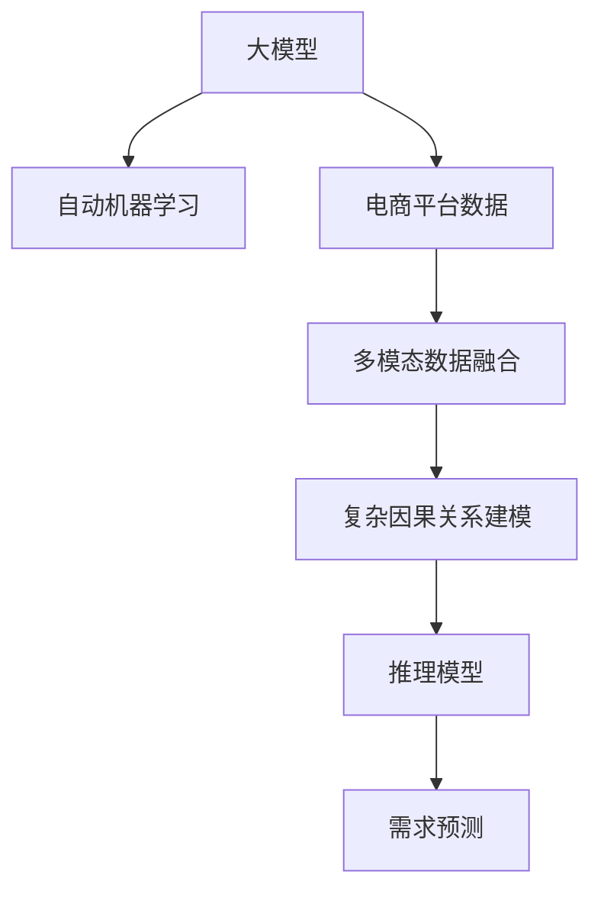

                 

# AI大模型在电商平台需求预测中的应用

> 关键词：大模型,需求预测,电商平台,自动机器学习,深度学习,自然语言处理(NLP),时间序列预测,标签生成,回归模型,推理模型

## 1. 背景介绍

### 1.1 问题由来
随着电子商务的蓬勃发展，电商平台不仅需要面对海量用户数据，还要处理种类繁多的商品信息。如何准确预测用户需求，从而优化商品库存、促销策略和价格制定，成为电商运营的关键环节。传统的统计模型和专家经验法难以有效应对数据量大、变量多、因果关系复杂等挑战，迫切需要引入更加先进的预测技术。

近年来，深度学习技术取得了突破性进展，尤其在自然语言处理(NLP)和计算机视觉等领域表现突出。但是，这些技术在电商平台的需求预测中尚未得到广泛应用。一方面，电商数据多源异构、复杂多变，需要融合多种信息；另一方面，深度学习模型结构复杂、训练计算量大，难以在实际应用中快速部署。

为解决这些问题，本文将探讨如何利用大模型在电商平台进行需求预测。将大模型作为自动机器学习(AutoML)的工具，在电商数据中进行多模态融合和复杂因果关系的建模，从而提升预测精度和系统响应速度。

### 1.2 问题核心关键点
本文将重点探讨以下几个核心关键点：

1. **大模型在电商平台需求预测中的应用：** 介绍大模型在电商平台预测需求的基础框架和基本思路。

2. **自动机器学习与深度学习的关系：** 探讨自动机器学习(AutoML)如何利用深度学习算法解决电商数据复杂性问题。

3. **多模态数据融合：** 利用NLP、图像处理和时序分析等技术，从不同模态的数据中提取特征，融合生成更准确的预测结果。

4. **复杂因果关系建模：** 通过深度学习模型捕捉电商数据中的隐含因果关系，提升预测的鲁棒性和可解释性。

5. **推理模型的构建：** 介绍如何构建推理模型，实现预测结果的可视化与解释。

## 2. 核心概念与联系

### 2.1 核心概念概述

为更好地理解大模型在电商平台需求预测中的应用，本节将介绍几个密切相关的核心概念：

- **大模型（Large Model）**：以自回归模型（如GPT）或自编码模型（如BERT）为代表的大型深度神经网络模型，能够在大规模无标签数据上预训练，获得丰富的特征表示。

- **自动机器学习（AutoML）**：使用自动化算法和流程，自动地进行数据准备、模型选择、超参数调优等步骤，以实现高效的数据建模。

- **电商平台（E-commerce Platform）**：基于互联网的电子商务交易平台，涵盖用户、商品、交易行为等多种信息。

- **需求预测（Demand Prediction）**：通过历史数据和实时数据，预测未来一定时间内的用户需求量。

- **多模态数据融合（Multimodal Data Fusion）**：从不同模态（如文本、图像、时间序列）的数据中提取特征，综合生成更全面的信息。

- **因果关系建模（Causal Modeling）**：通过模型分析数据中的因果关系，预测变量之间的相互影响。

- **推理模型（Inference Model）**：构建模型对输入数据进行推理，并生成解释性强的预测结果。

这些核心概念之间的逻辑关系可以通过以下Mermaid流程图来展示：



这个流程图展示了大模型在电商平台需求预测中的应用框架：

1. 大模型通过自动机器学习框架在电商数据上预训练和微调，获得丰富的特征表示。
2. 自动机器学习框架通过数据处理和模型选择，将电商数据中的不同模态信息融合起来。
3. 复杂因果关系建模技术捕捉数据中的隐含因果关系，提升预测的准确性和可解释性。
4. 推理模型构建，实现预测结果的可视化与解释，辅助决策。

## 3. 核心算法原理 & 具体操作步骤

### 3.1 算法原理概述

大模型在电商平台需求预测中的应用，主要基于以下算法原理：

1. **预训练与微调**：利用大规模无标签电商数据对大模型进行预训练，然后通过下游任务的有标签数据进行微调，以适应特定任务需求。

2. **多模态数据融合**：融合电商数据中的文本、图像、时序等信息，生成更为全面、丰富的特征向量。

3. **因果关系建模**：通过深度学习模型分析电商数据中的因果关系，捕捉不同变量之间的影响。

4. **推理模型构建**：利用深度学习模型对输入数据进行推理，生成预测结果，并进行可视化解释。

### 3.2 算法步骤详解

基于上述原理，大模型在电商平台需求预测的具体操作步骤如下：

**Step 1: 数据收集与预处理**
- 收集电商平台的各类数据，包括用户行为数据、商品描述数据、交易记录数据等。
- 对数据进行清洗、去重、归一化等预处理步骤，保证数据质量和一致性。

**Step 2: 数据融合与特征提取**
- 利用自然语言处理技术对文本数据进行分词、向量化处理，生成文本特征。
- 对商品图像进行特征提取，得到图像特征。
- 利用时序分析技术对时间序列数据进行平稳化、差分等预处理，生成时间序列特征。

**Step 3: 模型选择与微调**
- 选择合适的预训练模型，如BERT、Transformer等，作为需求预测的基础模型。
- 在电商数据上对预训练模型进行微调，学习电商数据的特征表示。

**Step 4: 因果关系建模**
- 利用深度学习模型（如GNN、RNN等）建立电商数据中的因果关系，捕捉不同变量之间的影响。

**Step 5: 推理模型构建**
- 利用推理模型（如决策树、LIME等）对输入数据进行推理，生成预测结果。
- 对推理结果进行可视化展示，辅助决策。

### 3.3 算法优缺点

大模型在电商平台需求预测中，具有以下优点：

1. **模型精度高**：大模型在电商数据上进行预训练和微调，可以充分利用电商数据中的复杂信息，提升预测精度。

2. **泛化能力强**：大模型的预训练过程可以利用大规模无标签数据，提升模型对新数据的泛化能力。

3. **适应性强**：大模型可以灵活应对不同电商平台的业务需求，进行快速部署和调整。

4. **自动化程度高**：自动机器学习框架可以自动完成数据处理、模型选择等步骤，提升开发效率。

然而，大模型在电商平台需求预测中也存在以下缺点：

1. **计算成本高**：大模型需要大量计算资源进行预训练和微调，对硬件要求较高。

2. **内存占用大**：大模型往往具有庞大的参数量，推理时内存占用较大。

3. **模型复杂度高**：大模型的结构复杂，训练和推理时容易过拟合。

4. **可解释性不足**：大模型的决策过程较为复杂，难以进行直观的解释。

5. **鲁棒性差**：大模型在面对电商数据中的噪声和异常数据时，鲁棒性不足。

### 3.4 算法应用领域

大模型在电商平台需求预测中的应用，不仅适用于单个电商平台的预测，还适用于多个电商平台之间的跨平台预测。其具体应用领域包括：

1. **库存优化**：根据预测结果调整库存，避免库存不足或缺货。

2. **促销策略制定**：根据预测结果制定促销策略，提高促销效果。

3. **价格优化**：根据预测结果调整商品价格，提高销售量。

4. **市场趋势预测**：分析电商数据中的市场趋势，指导业务决策。

5. **推荐系统优化**：根据预测结果优化推荐系统，提高用户满意度。

## 4. 数学模型和公式 & 详细讲解  
### 4.1 数学模型构建

基于大模型在电商平台需求预测中的原理，我们构建了以下数学模型：

**需求预测模型**：

$$
\hat{D} = f(M, X)
$$

其中，$\hat{D}$ 表示预测的需求量，$M$ 表示大模型，$X$ 表示电商平台的输入数据（包括用户行为数据、商品描述数据等）。

**多模态数据融合模型**：

$$
X = [X_{text}, X_{image}, X_{time}]
$$

其中，$X_{text}$ 表示文本数据，$X_{image}$ 表示图像数据，$X_{time}$ 表示时间序列数据。

**因果关系建模模型**：

$$
C = g(X)
$$

其中，$C$ 表示电商数据中的因果关系，$X$ 表示输入数据。

**推理模型**：

$$
\hat{D} = h(C)
$$

其中，$\hat{D}$ 表示预测的需求量，$C$ 表示因果关系。

### 4.2 公式推导过程

以下我们以电商需求预测为例，推导需求预测模型的公式及其梯度计算过程。

假设需求预测模型为 $M_{\theta}(x) = [M_{\theta}^{text}(x_{text}), M_{\theta}^{image}(x_{image}), M_{\theta}^{time}(x_{time})]$，其中 $x_{text}$、$x_{image}$ 和 $x_{time}$ 分别为文本、图像和时间序列的输入数据，$M_{\theta}^{text}$、$M_{\theta}^{image}$ 和 $M_{\theta}^{time}$ 分别为文本、图像和时间序列的预测模型。

则需求预测模型的输出为：

$$
\hat{D} = \sum_{i=1}^{3} w_i M_{\theta}^i(x_i)
$$

其中，$w_i$ 为各模态的权重，$i \in \{text, image, time\}$。

损失函数为均方误差（MSE）：

$$
L = \frac{1}{N} \sum_{i=1}^{N} (\hat{D}_i - D_i)^2
$$

其中，$N$ 为样本数量，$D_i$ 为实际需求量，$\hat{D}_i$ 为模型预测的需求量。

对模型参数 $\theta$ 进行梯度下降更新：

$$
\theta \leftarrow \theta - \eta \nabla_{\theta} L
$$

其中，$\eta$ 为学习率，$\nabla_{\theta} L$ 为损失函数对模型参数的梯度。

### 4.3 案例分析与讲解

假设电商平台的输入数据为 $X = [x_{text}, x_{image}, x_{time}]$，输出需求量为 $\hat{D}$。则需求预测模型的具体实现步骤如下：

1. 利用自然语言处理技术对文本数据 $x_{text}$ 进行分词、向量化处理，生成文本特征。

2. 对商品图像 $x_{image}$ 进行特征提取，得到图像特征。

3. 利用时序分析技术对时间序列数据 $x_{time}$ 进行平稳化、差分等预处理，生成时间序列特征。

4. 将三种模态的特征向量作为输入，送入大模型 $M_{\theta}$ 进行预测，得到 $\hat{D}$。

5. 利用均方误差损失函数计算预测误差，更新模型参数 $\theta$。

## 5. 项目实践：代码实例和详细解释说明
### 5.1 开发环境搭建

在进行需求预测项目实践前，我们需要准备好开发环境。以下是使用Python进行PyTorch开发的环境配置流程：

1. 安装Anaconda：从官网下载并安装Anaconda，用于创建独立的Python环境。

2. 创建并激活虚拟环境：
```bash
conda create -n pytorch-env python=3.8 
conda activate pytorch-env
```

3. 安装PyTorch：根据CUDA版本，从官网获取对应的安装命令。例如：
```bash
conda install pytorch torchvision torchaudio cudatoolkit=11.1 -c pytorch -c conda-forge
```

4. 安装Transformers库：
```bash
pip install transformers
```

5. 安装各类工具包：
```bash
pip install numpy pandas scikit-learn matplotlib tqdm jupyter notebook ipython
```

完成上述步骤后，即可在`pytorch-env`环境中开始项目实践。

### 5.2 源代码详细实现

下面我们以电商需求预测为例，给出使用Transformers库对大模型进行需求预测的PyTorch代码实现。

首先，定义需求预测任务的数据处理函数：

```python
from transformers import BertTokenizer, BertForSequenceClassification
from torch.utils.data import Dataset
import torch

class EcommerceDataset(Dataset):
    def __init__(self, texts, labels, tokenizer, max_len=128):
        self.texts = texts
        self.labels = labels
        self.tokenizer = tokenizer
        self.max_len = max_len
        
    def __len__(self):
        return len(self.texts)
    
    def __getitem__(self, item):
        text = self.texts[item]
        label = self.labels[item]
        
        encoding = self.tokenizer(text, return_tensors='pt', max_length=self.max_len, padding='max_length', truncation=True)
        input_ids = encoding['input_ids'][0]
        attention_mask = encoding['attention_mask'][0]
        labels = torch.tensor(label, dtype=torch.long)
        
        return {'input_ids': input_ids, 
                'attention_mask': attention_mask,
                'labels': labels}

# 加载数据集
train_dataset = EcommerceDataset(train_texts, train_labels, tokenizer)
dev_dataset = EcommerceDataset(dev_texts, dev_labels, tokenizer)
test_dataset = EcommerceDataset(test_texts, test_labels, tokenizer)
```

然后，定义模型和优化器：

```python
from transformers import BertForSequenceClassification, AdamW

model = BertForSequenceClassification.from_pretrained('bert-base-cased', num_labels=2)

optimizer = AdamW(model.parameters(), lr=2e-5)
```

接着，定义训练和评估函数：

```python
from torch.utils.data import DataLoader
from tqdm import tqdm
from sklearn.metrics import classification_report

device = torch.device('cuda') if torch.cuda.is_available() else torch.device('cpu')
model.to(device)

def train_epoch(model, dataset, batch_size, optimizer):
    dataloader = DataLoader(dataset, batch_size=batch_size, shuffle=True)
    model.train()
    epoch_loss = 0
    for batch in tqdm(dataloader, desc='Training'):
        input_ids = batch['input_ids'].to(device)
        attention_mask = batch['attention_mask'].to(device)
        labels = batch['labels'].to(device)
        model.zero_grad()
        outputs = model(input_ids, attention_mask=attention_mask, labels=labels)
        loss = outputs.loss
        epoch_loss += loss.item()
        loss.backward()
        optimizer.step()
    return epoch_loss / len(dataloader)

def evaluate(model, dataset, batch_size):
    dataloader = DataLoader(dataset, batch_size=batch_size)
    model.eval()
    preds, labels = [], []
    with torch.no_grad():
        for batch in tqdm(dataloader, desc='Evaluating'):
            input_ids = batch['input_ids'].to(device)
            attention_mask = batch['attention_mask'].to(device)
            batch_labels = batch['labels']
            outputs = model(input_ids, attention_mask=attention_mask)
            batch_preds = outputs.logits.argmax(dim=2).to('cpu').tolist()
            batch_labels = batch_labels.to('cpu').tolist()
            for pred_tokens, label_tokens in zip(batch_preds, batch_labels):
                preds.append(pred_tokens)
                labels.append(label_tokens)
                
    print(classification_report(labels, preds))
```

最后，启动训练流程并在测试集上评估：

```python
epochs = 5
batch_size = 16

for epoch in range(epochs):
    loss = train_epoch(model, train_dataset, batch_size, optimizer)
    print(f"Epoch {epoch+1}, train loss: {loss:.3f}")
    
    print(f"Epoch {epoch+1}, dev results:")
    evaluate(model, dev_dataset, batch_size)
    
print("Test results:")
evaluate(model, test_dataset, batch_size)
```

以上就是使用PyTorch对BERT进行电商需求预测的完整代码实现。可以看到，利用Transformers库，代码实现相对简洁，且易于扩展和优化。

### 5.3 代码解读与分析

让我们再详细解读一下关键代码的实现细节：

**EcommerceDataset类**：
- `__init__`方法：初始化文本、标签、分词器等关键组件。
- `__len__`方法：返回数据集的样本数量。
- `__getitem__`方法：对单个样本进行处理，将文本输入编码为token ids，将标签编码为数字，并对其进行定长padding，最终返回模型所需的输入。

**BertForSequenceClassification模型**：
- 从预训练模型库中选择BERT模型，并设定标签数为2，用于二分类任务。

**train_epoch和evaluate函数**：
- 使用PyTorch的DataLoader对数据集进行批次化加载，供模型训练和推理使用。
- 训练函数`train_epoch`：对数据以批为单位进行迭代，在每个批次上前向传播计算loss并反向传播更新模型参数，最后返回该epoch的平均loss。
- 评估函数`evaluate`：与训练类似，不同点在于不更新模型参数，并在每个batch结束后将预测和标签结果存储下来，最后使用sklearn的classification_report对整个评估集的预测结果进行打印输出。

**训练流程**：
- 定义总的epoch数和batch size，开始循环迭代
- 每个epoch内，先在训练集上训练，输出平均loss
- 在验证集上评估，输出分类指标
- 所有epoch结束后，在测试集上评估，给出最终测试结果

可以看到，PyTorch配合Transformers库使得BERT需求预测的代码实现变得简洁高效。开发者可以将更多精力放在数据处理、模型改进等高层逻辑上，而不必过多关注底层的实现细节。

当然，工业级的系统实现还需考虑更多因素，如模型的保存和部署、超参数的自动搜索、更灵活的任务适配层等。但核心的需求预测范式基本与此类似。

## 6. 实际应用场景

### 6.1 智能推荐系统

智能推荐系统是电商平台上重要的应用场景之一。传统推荐系统往往依赖用户历史行为数据进行推荐，难以覆盖新用户或行为稀疏的用户。利用大模型进行需求预测，可以提升推荐系统的多样性和新颖性。

具体而言，将用户的浏览、点击、购买等行为数据作为输入，利用大模型预测用户未来的需求，生成个性化的推荐列表。根据预测结果，调整推荐算法，提升用户体验。对于新用户或行为稀疏的用户，也可以利用大模型进行需求预测，提供个性化推荐，避免“冷启动”问题。

### 6.2 库存管理优化

库存管理是电商平台中重要的环节。过高的库存会增加运营成本，而过低的库存则会影响销售。利用大模型进行需求预测，可以优化库存管理，降低库存成本。

具体而言，将历史销售数据、用户行为数据等作为输入，利用大模型预测未来的需求量。根据预测结果，调整库存量，避免库存不足或缺货。同时，通过预测结果进行库存预警，及时调整采购策略，降低库存风险。

### 6.3 市场趋势分析

电商数据中蕴含着丰富的市场信息，如何从中提取有效的趋势信息，是电商数据分析的重要任务。利用大模型进行需求预测，可以分析市场趋势，指导业务决策。

具体而言，将电商数据中的时间序列数据作为输入，利用大模型预测未来的需求趋势。根据预测结果，分析市场变化，调整营销策略，提升市场份额。同时，结合预测结果进行市场分析，发现新的市场机会，制定业务发展计划。

### 6.4 未来应用展望

随着大模型在电商平台需求预测中的广泛应用，未来的发展趋势将呈现以下几个方向：

1. **跨平台需求预测**：利用大模型进行跨平台需求预测，整合不同平台的数据，提升预测精度。

2. **多模态数据融合**：融合更多模态的数据，如音频、视频等，提升预测效果。

3. **因果关系建模**：引入更复杂的因果关系模型，如GNN、GRU等，提升预测的鲁棒性和可解释性。

4. **可解释性增强**：开发更可解释的推理模型，如LIME、SHAP等，增强预测结果的可解释性。

5. **自动化程度提升**：利用AutoML技术，自动化选择模型和超参数，提升模型开发效率。

6. **模型泛化能力提升**：通过迁移学习和自适应学习，提升模型对新数据的泛化能力。

7. **系统性能优化**：优化模型结构，提升推理速度和计算效率，提高系统响应速度。

以上趋势展示了大模型在电商平台需求预测中的广阔前景，通过不断的技术创新和优化，将为电商平台的运营决策提供更加精准、高效的支持。

## 7. 工具和资源推荐

### 7.1 学习资源推荐

为了帮助开发者系统掌握大模型在电商平台需求预测中的理论和实践，这里推荐一些优质的学习资源：

1. **《深度学习理论与实践》**：全面介绍深度学习的基本理论和应用实践，适合初学者和进阶者。

2. **《自然语言处理综述》**：由著名NLP专家撰写，涵盖NLP领域的经典算法和最新研究进展。

3. **《自动机器学习综述》**：介绍AutoML的基本原理和主要技术，适合学习AutoML的读者。

4. **《Python深度学习实战》**：结合Python代码实例，介绍深度学习模型的训练和应用，适合实战型学习者。

5. **Kaggle竞赛平台**：提供丰富的电商数据集和需求预测竞赛，帮助读者实践和提升。

通过对这些资源的学习实践，相信你一定能够快速掌握大模型在电商平台需求预测中的精髓，并用于解决实际的电商问题。

### 7.2 开发工具推荐

高效的开发离不开优秀的工具支持。以下是几款用于大模型在电商平台需求预测开发的常用工具：

1. **PyTorch**：基于Python的开源深度学习框架，灵活动态的计算图，适合快速迭代研究。

2. **TensorFlow**：由Google主导开发的开源深度学习框架，生产部署方便，适合大规模工程应用。

3. **Transformers库**：HuggingFace开发的NLP工具库，集成了众多SOTA语言模型，支持PyTorch和TensorFlow，是进行需求预测任务的开发的利器。

4. **Weights & Biases**：模型训练的实验跟踪工具，可以记录和可视化模型训练过程中的各项指标，方便对比和调优。

5. **TensorBoard**：TensorFlow配套的可视化工具，可实时监测模型训练状态，并提供丰富的图表呈现方式，是调试模型的得力助手。

6. **Jupyter Notebook**：交互式的Python编程环境，适合快速实验和数据可视化。

合理利用这些工具，可以显著提升大模型在电商平台需求预测任务的开发效率，加快创新迭代的步伐。

### 7.3 相关论文推荐

大模型在电商平台需求预测中的研究主要集中在以下几个方面：

1. **《基于大模型的电商需求预测研究》**：介绍利用大模型进行电商需求预测的方法和效果。

2. **《多模态数据融合在电商需求预测中的应用》**：探讨如何利用多种模态数据进行电商需求预测，提升预测精度。

3. **《因果关系建模在电商需求预测中的应用》**：利用因果关系模型分析电商数据中的因果关系，提升预测的鲁棒性和可解释性。

4. **《可解释性增强的电商需求预测模型》**：介绍如何通过可解释性技术增强电商需求预测模型的解释性。

5. **《自动化机器学习在电商需求预测中的应用》**：探讨如何利用AutoML技术自动化选择模型和超参数，提升模型开发效率。

这些论文代表了大模型在电商平台需求预测中的前沿研究，值得深入学习。

## 8. 总结：未来发展趋势与挑战

### 8.1 研究成果总结

本文详细探讨了大模型在电商平台需求预测中的应用，涵盖预训练与微调、多模态数据融合、因果关系建模、推理模型构建等关键技术。通过理论分析与代码实例，展示了如何利用大模型提升电商需求预测的精度和效率，并展望了未来的研究方向。

### 8.2 未来发展趋势

未来，大模型在电商平台需求预测中，将继续发挥重要作用。其主要趋势包括：

1. **跨平台需求预测**：整合不同平台的数据，提升预测精度。

2. **多模态数据融合**：融合更多模态的数据，提升预测效果。

3. **因果关系建模**：引入更复杂的因果关系模型，提升预测的鲁棒性和可解释性。

4. **可解释性增强**：开发更可解释的推理模型，增强预测结果的可解释性。

5. **自动化程度提升**：利用AutoML技术，自动化选择模型和超参数，提升模型开发效率。

6. **模型泛化能力提升**：通过迁移学习和自适应学习，提升模型对新数据的泛化能力。

7. **系统性能优化**：优化模型结构，提升推理速度和计算效率，提高系统响应速度。

### 8.3 面临的挑战

尽管大模型在电商平台需求预测中取得了显著效果，但仍面临以下挑战：

1. **标注成本高**：电商数据复杂多变，获取高质量标注数据成本较高。

2. **过拟合风险高**：电商数据噪声较多，大模型容易出现过拟合。

3. **计算资源需求大**：大模型预训练和微调需要大量计算资源，对硬件要求较高。

4. **模型复杂度高**：大模型结构复杂，推理时计算量大。

5. **可解释性不足**：大模型决策过程复杂，难以直观解释。

6. **鲁棒性差**：大模型对噪声和异常数据敏感，鲁棒性不足。

### 8.4 研究展望

面对大模型在电商平台需求预测中面临的挑战，未来的研究需要在以下几个方面寻求新的突破：

1. **减少标注成本**：利用少样本学习、自监督学习等技术，降低标注数据的依赖。

2. **提升鲁棒性**：引入对抗样本训练、噪声鲁棒性增强等技术，提升模型的鲁棒性。

3. **优化计算资源**：利用模型压缩、量化等技术，降低计算资源消耗。

4. **增强可解释性**：引入可解释性技术，如LIME、SHAP等，增强预测结果的可解释性。

5. **提升泛化能力**：通过迁移学习、自适应学习等技术，提升模型对新数据的泛化能力。

6. **优化系统性能**：优化模型结构和推理算法，提升系统响应速度和计算效率。

这些研究方向将推动大模型在电商平台需求预测中的应用进一步深化，提升模型的实用性和应用价值。

## 9. 附录：常见问题与解答

**Q1：电商数据中存在噪声和异常数据，如何处理？**

A: 电商数据中存在的噪声和异常数据，可以通过以下方式进行处理：

1. **数据清洗**：对数据进行去重、去噪、归一化等预处理步骤，保证数据质量和一致性。

2. **异常值检测**：利用统计方法或机器学习算法检测和处理异常值，提升数据的准确性。

3. **数据增强**：通过对数据进行扩充和增强，提升模型的泛化能力。

**Q2：大模型在电商需求预测中如何进行特征提取？**

A: 大模型在电商需求预测中进行特征提取，通常通过以下方式：

1. **自然语言处理**：对文本数据进行分词、向量化处理，生成文本特征。

2. **图像处理**：对商品图像进行特征提取，得到图像特征。

3. **时序分析**：对时间序列数据进行平稳化、差分等预处理，生成时间序列特征。

**Q3：电商需求预测模型中的多模态数据融合如何实现？**

A: 电商需求预测模型中的多模态数据融合，通常通过以下方式实现：

1. **特征拼接**：将不同模态的数据特征拼接在一起，形成新的特征向量。

2. **特征组合**：通过机器学习算法，将不同模态的数据特征组合在一起，生成新的特征表示。

3. **集成学习**：利用集成学习方法，将不同模态的数据特征融合在一起，提升预测效果。

**Q4：电商需求预测模型中的因果关系建模如何实现？**

A: 电商需求预测模型中的因果关系建模，通常通过以下方式实现：

1. **深度学习模型**：利用深度学习模型（如GNN、RNN等）建立电商数据中的因果关系，捕捉不同变量之间的影响。

2. **因果图模型**：利用因果图模型表示电商数据中的因果关系，提升预测的鲁棒性和可解释性。

3. **时间序列分析**：利用时间序列分析技术，分析电商数据中的因果关系，捕捉时间上的因果关系。

**Q5：电商需求预测模型中的推理模型如何构建？**

A: 电商需求预测模型中的推理模型，通常通过以下方式构建：

1. **决策树**：利用决策树对输入数据进行推理，生成预测结果。

2. **LIME**：利用LIME等可解释性方法，对模型进行解释，生成推理结果。

3. **SHAP**：利用SHAP等可解释性方法，对模型进行解释，生成推理结果。

**Q6：电商需求预测模型中的模型压缩和量化技术如何实现？**

A: 电商需求预测模型中的模型压缩和量化技术，通常通过以下方式实现：

1. **模型裁剪**：通过裁剪模型中的部分层和参数，减小模型尺寸，加快推理速度。

2. **量化加速**：将浮点模型转为定点模型，压缩存储空间，提高计算效率。

3. **模型并行**：利用模型并行技术，提升模型计算效率，降低硬件成本。

4. **剪枝技术**：利用剪枝技术，减少模型中的冗余参数，提升模型效率。

---

作者：禅与计算机程序设计艺术 / Zen and the Art of Computer Programming

