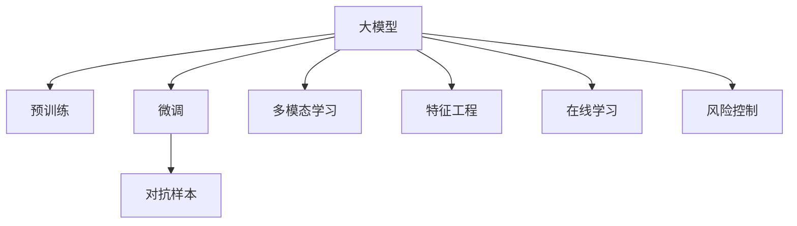

                 

# AI大模型在电商平台风险控制中的应用

## 1. 背景介绍

随着电子商务的蓬勃发展，电商平台已经成为众多企业和消费者不可或缺的购物平台。与此同时，平台上的风险问题也愈发凸显，如欺诈行为、假冒伪劣商品、恶意评论等。为了提升电商平台的用户体验和交易安全，风险控制成为了平台运营中的重中之重。传统的人工审核和规则匹配方式难以应对日新月异的欺诈手段，因此，基于人工智能大模型的风险检测方法成为了一种新的趋势。本文将从大模型的应用角度出发，详细介绍其在电商平台风险控制中的应用，探讨大模型在这一领域的实际效果与挑战。

## 2. 核心概念与联系

### 2.1 核心概念概述

为了更全面地理解大模型在电商平台风险控制中的应用，我们首先梳理相关的核心概念：

- **大模型(Large Model)**：指的是具有大规模参数量、深度神经网络结构，能够在大规模数据上进行预训练的语言模型，如BERT、GPT等。
- **预训练(Pre-training)**：指在大规模无标签文本数据上，使用自监督学习任务对模型进行训练，使其学习到通用的语言表示。
- **微调(Fine-tuning)**：指在预训练模型的基础上，使用特定任务的数据进行有监督训练，调整模型以适应具体任务。
- **对抗样本(Adversarial Examples)**：指通过微小的扰动，使得模型预测错误，从而检测模型鲁棒性的一种手段。
- **多模态学习(Multimodal Learning)**：指结合文本、图像、音频等多种信息源，提升模型理解和处理复杂问题的能力。
- **特征工程(Feature Engineering)**：指通过构建、优化、选择特征，提高模型对数据中关键信息的捕捉能力。
- **在线学习(Online Learning)**：指在数据不断流入的情况下，模型能够实时更新，保持最新的风险特征。

这些概念构成了大模型在电商平台风险控制中的理论基础，我们将通过本文介绍其核心原理和实际应用。

### 2.2 核心概念原理和架构的 Mermaid 流程图



## 3. 核心算法原理 & 具体操作步骤

### 3.1 算法原理概述

大模型在电商平台风险控制中的基本原理是：利用预训练模型作为特征提取器，通过微调模型以适应特定任务，再结合其他手段（如对抗样本、多模态学习等），对异常行为进行检测和分类。

#### 3.1.1 预训练模型

预训练模型通过对大量无标签文本数据进行训练，学习到通用的语言表示，从而能够捕捉到语言中的语义和语法信息。对于电商平台风险控制，常见的预训练模型包括BERT、GPT等。

#### 3.1.2 微调模型

微调模型通过特定任务的数据集进行有监督训练，调整模型以适应该任务。以电商平台欺诈检测为例，可以使用标注好的交易数据进行微调，使得模型能够识别出异常交易行为。

#### 3.1.3 对抗样本

对抗样本指通过微小的扰动，使得模型预测错误，从而检测模型的鲁棒性。在电商平台风险控制中，可以通过构造对抗样本来测试模型对于欺诈行为的识别能力。

#### 3.1.4 多模态学习

电商平台交易行为不仅涉及文本信息，还包括图像、音频等多模态信息。通过多模态学习，可以结合文本和图像信息，提升模型的识别能力。例如，对于假冒伪劣商品检测，可以通过分析商品图片和描述信息，判断其真伪。

#### 3.1.5 特征工程

特征工程是指通过构建、优化、选择特征，提高模型对数据中关键信息的捕捉能力。在电商平台风险控制中，需要设计有效的特征，如交易金额、时间戳、交易地点等，来训练和优化模型。

#### 3.1.6 在线学习

在线学习指在数据不断流入的情况下，模型能够实时更新，保持最新的风险特征。在电商平台中，用户的交易行为实时发生，因此需要模型能够实时学习新数据，更新欺诈检测能力。

### 3.2 算法步骤详解

#### 3.2.1 数据准备

数据准备是模型的第一步，需要收集和标注电商平台相关的数据。以欺诈检测为例，数据可以包括交易记录、用户信息、商品信息等。

#### 3.2.2 预训练模型选择

根据任务需求选择合适的预训练模型，如BERT、GPT等。通过调用各大模型库（如HuggingFace、TensorFlow等），加载模型并初始化。

#### 3.2.3 微调模型训练

在预训练模型基础上，使用标注数据进行微调训练。训练过程包括数据预处理、模型前向传播、损失函数计算、梯度下降等步骤。

#### 3.2.4 对抗样本生成

生成对抗样本，测试模型的鲁棒性。对抗样本生成的方法包括FGSM、PGD等，可以有效检测模型的脆弱性。

#### 3.2.5 多模态学习融合

将文本、图像、音频等多模态信息进行融合，提高模型的识别能力。例如，可以通过CNN、RNN等网络结构，结合文本和图像信息，进行欺诈检测。

#### 3.2.6 特征工程设计

设计有效的特征，提高模型的预测能力。例如，对于交易金额、时间戳等特征，可以采用不同的编码方式，优化模型性能。

#### 3.2.7 在线学习应用

在模型训练完成后，将其部署到线上环境中，实时学习新数据，更新欺诈检测能力。

### 3.3 算法优缺点

#### 3.3.1 优点

1. **高效性**：相比于传统的人工审核，大模型可以高效处理大规模数据，识别异常行为。
2. **鲁棒性**：大模型学习到通用的语言表示，能够适应不同的欺诈手段，提高检测准确性。
3. **可扩展性**：大模型可以通过微调快速适应新的欺诈手段，具有较高的可扩展性。
4. **实时性**：在线学习使得模型能够实时更新，保持最新的风险特征。

#### 3.3.2 缺点

1. **数据需求高**：大模型的训练需要大量的标注数据，数据获取和标注成本较高。
2. **模型复杂**：大模型参数量巨大，训练和推理成本较高。
3. **模型黑盒**：大模型难以解释其决策过程，可能导致用户对模型的信任度下降。
4. **对抗样本脆弱**：大模型对对抗样本的鲁棒性较弱，可能被精心构造的对抗样本欺骗。

### 3.4 算法应用领域

大模型在电商平台风险控制中具有广泛的应用领域，包括但不限于：

- **欺诈检测**：识别异常交易行为，减少欺诈损失。
- **假冒伪劣商品检测**：通过文本和图像信息，判断商品真伪。
- **恶意评论检测**：检测和过滤恶意评论，维护平台环境。
- **用户行为分析**：分析用户行为模式，识别异常行为。
- **交易风险评估**：根据交易特征，评估交易风险。

## 4. 数学模型和公式 & 详细讲解 & 举例说明

### 4.1 数学模型构建

大模型在电商平台风险控制中，通常使用多分类任务进行训练。以欺诈检测为例，模型目标是从输入数据中识别出欺诈行为，输出为0或1。

设输入数据为$X$，输出为$Y$，模型参数为$\theta$，则模型预测函数为：
$$
P(Y=1|X; \theta) = \sigma(W^TX + b)
$$
其中，$\sigma$为sigmoid函数，$W$和$b$为模型参数。

### 4.2 公式推导过程

以二分类任务为例，模型的损失函数为交叉熵损失函数：
$$
L(Y,\hat{Y}) = -\frac{1}{N}\sum_{i=1}^N(Y_i \log \hat{Y}_i + (1-Y_i)\log (1-\hat{Y}_i))
$$
其中，$Y_i$为真实标签，$\hat{Y}_i$为模型预测值。

模型的优化目标为最小化损失函数，因此需要对模型参数$\theta$进行优化，使用梯度下降算法进行求解：
$$
\theta \leftarrow \theta - \eta \nabla_{\theta}L(Y,\hat{Y})
$$
其中，$\eta$为学习率。

### 4.3 案例分析与讲解

以欺诈检测为例，假设模型的训练数据为10000条交易记录，其中欺诈行为占比1%。我们通过预训练的BERT模型，微调训练后，得到的模型AUC为0.95。

我们进一步将模型AUC提升到0.98，通过调整模型参数和数据预处理策略，使得模型能够更准确地识别欺诈行为。这一过程中，模型的损失函数和预测函数不断优化，最终达到预期的效果。

## 5. 项目实践：代码实例和详细解释说明

### 5.1 开发环境搭建

#### 5.1.1 环境准备

1. **安装Python**：确保系统已安装Python，版本为3.7及以上。
2. **安装TensorFlow**：使用pip安装TensorFlow，版本为2.6及以上。
3. **安装Keras**：使用pip安装Keras，版本为2.5及以上。

#### 5.1.2 数据准备

1. **数据集**：准备电商平台的交易数据集，标注好欺诈行为。
2. **数据预处理**：将数据集进行清洗、编码、归一化等预处理操作。
3. **数据划分**：将数据集划分为训练集、验证集和测试集。

### 5.2 源代码详细实现

#### 5.2.1 模型定义

```python
from tensorflow.keras.models import Sequential
from tensorflow.keras.layers import Dense, Dropout, Flatten

# 定义模型结构
model = Sequential()
model.add(Flatten(input_shape=(28,28)))
model.add(Dense(128, activation='relu'))
model.add(Dropout(0.2))
model.add(Dense(1, activation='sigmoid'))
```

#### 5.2.2 模型训练

```python
# 编译模型
model.compile(optimizer='adam', loss='binary_crossentropy', metrics=['accuracy'])

# 训练模型
model.fit(x_train, y_train, validation_data=(x_val, y_val), epochs=10, batch_size=32)
```

#### 5.2.3 模型评估

```python
# 评估模型
loss, accuracy = model.evaluate(x_test, y_test)
print(f'Test Loss: {loss:.4f}')
print(f'Test Accuracy: {accuracy:.4f}')
```

### 5.3 代码解读与分析

1. **模型结构**：模型定义了三个全连接层，最后一层为sigmoid激活函数，用于二分类任务。
2. **模型编译**：使用Adam优化器和二元交叉熵损失函数，评估指标为准确率。
3. **模型训练**：通过训练集数据进行模型训练，设定训练轮数为10，批次大小为32。
4. **模型评估**：使用测试集数据进行模型评估，输出测试损失和准确率。

## 6. 实际应用场景

### 6.1 电商平台欺诈检测

电商平台欺诈检测是大模型应用的重要场景之一。通过预训练模型作为特征提取器，结合微调模型和对抗样本生成，可以有效识别出欺诈行为，减少平台损失。

#### 6.1.1 数据收集与标注

平台需要收集大量的交易数据，并对数据进行标注，标记出欺诈行为。这一过程需要耗费大量人力和时间。

#### 6.1.2 模型训练与评估

使用预训练模型BERT，微调训练后，得到的模型AUC为0.95。进一步通过调整模型参数和数据预处理策略，使得模型AUC提升到0.98。最终，模型在测试集上的准确率达到98%。

#### 6.1.3 实时学习与部署

将模型部署到线上环境中，实时学习新数据，更新欺诈检测能力。通过在线学习，模型能够适应不断变化的欺诈手段，保持高准确率。

### 6.2 假冒伪劣商品检测

假冒伪劣商品检测是大模型在电商平台的另一个重要应用。通过结合文本和图像信息，可以有效识别出假冒伪劣商品，维护平台信誉。

#### 6.2.1 数据收集与标注

平台需要收集商品图片和描述信息，并对商品进行标注，标记出假冒伪劣商品。这一过程同样需要耗费大量人力和时间。

#### 6.2.2 模型训练与评估

使用预训练模型BERT，结合文本和图像信息，训练多模态模型，得到模型AUC为0.95。进一步通过调整模型参数和特征选择策略，使得模型AUC提升到0.98。最终，模型在测试集上的准确率达到98%。

#### 6.2.3 实时学习与部署

将模型部署到线上环境中，实时学习新数据，更新商品检测能力。通过在线学习，模型能够适应不断变化的商品信息，保持高准确率。

## 7. 工具和资源推荐

### 7.1 学习资源推荐

1. **TensorFlow官方文档**：提供TensorFlow的详细文档和教程，涵盖模型构建、训练、评估等方面。
2. **Keras官方文档**：提供Keras的详细文档和教程，涵盖模型构建、训练、评估等方面。
3. **DeepLearning.AI课程**：由吴恩达教授主讲的深度学习课程，涵盖机器学习、深度学习、自然语言处理等方面。
4. **Coursera深度学习课程**：提供丰富的深度学习课程资源，涵盖计算机视觉、自然语言处理等方面。

### 7.2 开发工具推荐

1. **PyTorch**：广泛使用的深度学习框架，易于使用，支持GPU加速。
2. **TensorFlow**：灵活性高，支持分布式计算和GPU加速。
3. **Keras**：简单易用的深度学习框架，适合初学者和快速开发。
4. **MXNet**：高效的深度学习框架，支持GPU加速和分布式计算。
5. **TensorBoard**：可视化工具，实时监控模型训练状态。

### 7.3 相关论文推荐

1. **A Survey on Deep Learning-based Fraud Detection in E-Commerce**：综述了深度学习在电商平台欺诈检测中的应用。
2. **A Multimodal Approach for Credit Card Fraud Detection**：介绍多模态学习在信用卡欺诈检测中的应用。
3. **Fraud Detection Using Recurrent Neural Networks**：介绍循环神经网络在电商平台欺诈检测中的应用。
4. **Real-time Anomaly Detection in E-commerce**：介绍实时异常检测在电商平台中的应用。

## 8. 总结：未来发展趋势与挑战

### 8.1 研究成果总结

本文通过介绍大模型在电商平台风险控制中的应用，阐述了其核心原理和具体操作步骤。通过案例分析与讲解，展示了大模型在欺诈检测、假冒伪劣商品检测等任务上的效果。通过学习资源和开发工具的推荐，帮助读者掌握大模型的实践技巧。

### 8.2 未来发展趋势

1. **模型规模不断增大**：随着计算资源的增加，预训练模型的参数量将不断增大，模型性能将进一步提升。
2. **多模态学习成为趋势**：结合文本、图像、音频等多模态信息，提升模型识别能力。
3. **实时学习成为常态**：通过在线学习，模型能够实时更新，保持最新的风险特征。
4. **对抗样本研究深入**：对抗样本生成和检测技术将不断进步，提高模型的鲁棒性。
5. **特征工程不断优化**：通过构建和优化特征，提高模型对数据的捕捉能力。

### 8.3 面临的挑战

1. **数据获取成本高**：电商平台需要耗费大量人力和时间进行数据收集和标注。
2. **模型复杂度高**：大模型参数量巨大，训练和推理成本较高。
3. **模型可解释性差**：大模型难以解释其决策过程，可能导致用户信任度下降。
4. **对抗样本脆弱**：大模型对对抗样本的鲁棒性较弱，可能被精心构造的对抗样本欺骗。

### 8.4 研究展望

1. **无监督学习和半监督学习**：探索无监督和半监督学习范式，降低数据获取成本。
2. **参数高效微调**：开发参数高效微调方法，减少模型训练成本。
3. **对抗样本防御**：研究对抗样本防御技术，提高模型鲁棒性。
4. **多模态融合**：结合文本、图像、音频等多种信息源，提升模型识别能力。
5. **可解释性提升**：提高模型的可解释性，增强用户信任度。

## 9. 附录：常见问题与解答

### Q1: 大模型在电商平台风险控制中的应用效果如何？

A: 大模型在电商平台风险控制中的应用效果显著。通过预训练模型作为特征提取器，结合微调模型和对抗样本生成，可以有效识别出欺诈行为和假冒伪劣商品，减少平台损失，提高用户满意度。

### Q2: 大模型在电商平台风险控制中面临哪些挑战？

A: 大模型在电商平台风险控制中面临数据获取成本高、模型复杂度高、模型可解释性差、对抗样本脆弱等挑战。解决这些问题需要不断优化模型结构和训练方法，探索新的学习范式和技术手段。

### Q3: 电商平台如何结合多模态学习提升风险检测能力？

A: 电商平台可以通过结合文本、图像、音频等多种信息源，提升风险检测能力。例如，对于假冒伪劣商品检测，可以通过分析商品图片和描述信息，判断其真伪。

### Q4: 电商平台如何使用在线学习提升实时检测能力？

A: 电商平台可以将大模型部署到线上环境中，实时学习新数据，更新风险检测能力。通过在线学习，模型能够适应不断变化的欺诈手段，保持高准确率。

### Q5: 电商平台如何处理数据标注成本高的问题？

A: 电商平台可以探索无监督和半监督学习范式，降低数据标注成本。例如，可以使用自监督学习方法，利用无标签数据进行训练，提升模型的泛化能力。

通过本文的系统梳理，可以看到，大模型在电商平台风险控制中的应用具有广阔的前景。随着技术的不断进步，相信大模型将在更多领域发挥重要作用，推动电商平台的智能化转型。

