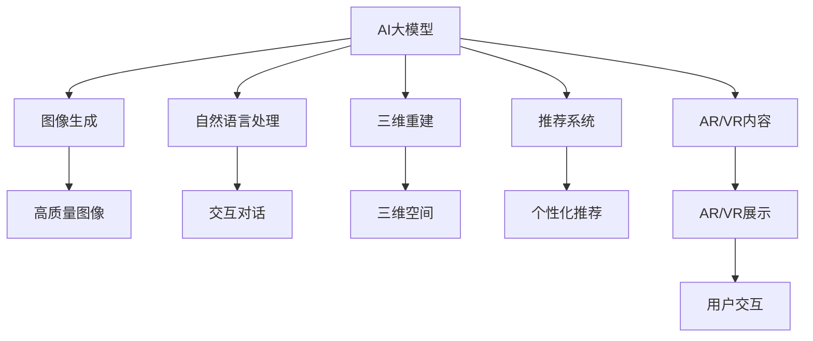

                 

# AI大模型如何提升电商平台的AR/VR购物体验

> 关键词：AI大模型, AR/VR购物体验, 三维重建, 神经网络, 深度学习, 图像生成, 自然语言处理, 用户交互, 推荐系统

## 1. 背景介绍

### 1.1 问题由来
随着消费市场的不断发展和技术的飞速进步，电商平台越来越注重用户体验，以提升销售额和市场竞争力。传统的电商展示方式，如二维图片和文字描述，已经无法满足用户日益增长的需求。增强现实(AR)和虚拟现实(VR)技术以其沉浸式的交互体验，为电商平台带来了新的发展契机。

AR/VR技术不仅能提供更直观的产品展示，还能让用户通过虚拟试穿、虚拟试用等方式，与产品进行深度互动，从而提升购物体验。然而，AR/VR内容的制作、优化和交互设计，对技术要求和人力资源投入都相当高。

AI大模型通过预训练获得了强大的图像生成和自然语言处理能力，可以显著降低AR/VR内容的制作成本，提升内容的质量和交互性。将AI大模型应用于电商平台，不仅可以大幅提升用户体验，还能大幅减少电商平台的运营成本，具有广阔的应用前景。

### 1.2 问题核心关键点
- AR/VR电商平台的核心是高质量的3D内容生成和交互设计。
- AI大模型可以自动学习3D重建、图像生成、语义理解等技能，极大地降低内容制作成本。
- 结合推荐系统，AI大模型可以个性化地为用户推荐合适的AR/VR体验，提升购物转化率。
- 用户与AI大模型交互过程中，自然语言处理技术可以提升交互的自然性和流畅性。

### 1.3 问题研究意义
AI大模型在电商平台中的应用，为电商平台的创新和发展提供了新的方向。其研究意义主要体现在以下几个方面：

1. 提升用户体验：AR/VR技术结合AI大模型，可以提供更加沉浸和个性化的购物体验，提升用户粘性和满意度。
2. 降低运营成本：通过自动生成高质量的3D内容和个性化推荐，可以大幅减少人工投入，降低运营成本。
3. 加速内容创新：AI大模型可以自动学习并生成创新的AR/VR内容，推动电商平台不断突破传统的展示方式。
4. 增强竞争力：电商平台通过AI大模型优化用户体验，可以在激烈的市场竞争中占据优势，吸引更多用户。
5. 拓展业务场景：AI大模型可以应用于电商平台的诸多业务场景，如智能客服、智能搜索、智能分析等，提升平台的智能化水平。

## 2. 核心概念与联系

### 2.1 核心概念概述

为更好地理解AI大模型在AR/VR电商平台中的应用，本节将介绍几个密切相关的核心概念：

- **AI大模型(AI Large Model)**：指基于深度学习技术，通过大规模无标签数据进行预训练，学习到广泛知识的大规模神经网络模型，如BERT、GPT等。

- **增强现实(AR)**：通过将数字信息叠加在现实世界中，为用户提供丰富的视觉和交互体验的技术。

- **虚拟现实(VR)**：创建完全模拟的三维数字环境，用户可以沉浸其中，与虚拟环境互动。

- **三维重建(3D Reconstruction)**：通过AI技术将二维图片或视频还原为三维空间模型，便于进行AR/VR展示。

- **图像生成(Image Generation)**：使用AI模型自动生成高质量的图像，提升AR/VR内容的丰富度。

- **自然语言处理(NLP)**：涉及语言理解、生成、翻译等任务，使AI大模型可以与用户进行流畅自然的对话。

- **推荐系统(Recommendation System)**：利用用户历史行为数据，预测用户兴趣，推荐相关商品和服务的技术。

- **用户交互(User Interaction)**：通过自然语言处理和计算机视觉等技术，实现用户与AI大模型之间的互动。

这些核心概念之间的逻辑关系可以通过以下Mermaid流程图来展示：



这个流程图展示了大模型在AR/VR电商平台中的应用过程：

1. 大模型通过预训练获得图像生成和三维重建能力，自动生成高质量的AR/VR内容。
2. 结合自然语言处理，大模型可以与用户进行自然对话，提升互动体验。
3. 引入推荐系统，大模型根据用户行为推荐个性化的AR/VR体验，提升购物转化率。
4. 最终，AR/VR展示结合用户交互，提供沉浸式购物体验。

## 3. 核心算法原理 & 具体操作步骤

### 3.1 算法原理概述

AI大模型在AR/VR电商平台中的应用，主要涉及到以下几个核心算法：

- **三维重建算法**：通过AI技术自动生成3D模型，从而支持AR/VR展示。
- **图像生成算法**：使用生成对抗网络(GAN)等模型，自动生成高质量的3D渲染图像。
- **自然语言处理算法**：利用预训练语言模型进行文本生成和理解，提升用户交互的自然性。
- **推荐算法**：通过协同过滤、基于内容的推荐等算法，为每位用户推荐合适的AR/VR体验。

这些算法的核心思想是通过深度学习技术，从大量数据中学习到复杂的规律，自动生成高质量的3D内容，并实现自然语言处理和个性化推荐。

### 3.2 算法步骤详解

AI大模型在AR/VR电商平台的集成，通常包括以下几个关键步骤：

**Step 1: 准备数据集**
- 收集电商平台的商品图片、视频、描述等信息，作为生成3D模型和高质量图像的训练数据。
- 收集用户行为数据，如浏览记录、购买历史等，用于推荐系统的训练。
- 收集对话数据，用于训练自然语言处理模型。

**Step 2: 选择和适配大模型**
- 选择合适的预训练语言模型，如BERT、GPT等，根据任务需求进行微调或微适应。
- 使用生成对抗网络等模型，自动生成高质量的3D渲染图像。
- 通过三维重建算法，将2D图像或视频转化为3D模型。

**Step 3: 开发AR/VR展示应用**
- 结合三维重建算法生成的3D模型，开发AR/VR展示应用，如AR试穿、VR虚拟试用等。
- 结合图像生成算法生成的高质量图像，丰富AR/VR展示内容。
- 利用自然语言处理模型，实现与用户的自然交互。

**Step 4: 集成推荐系统**
- 基于用户行为数据，训练推荐模型，为用户推荐合适的AR/VR体验。
- 结合用户交互反馈，不断优化推荐算法，提升用户体验和转化率。

**Step 5: 部署和优化**
- 将开发的AR/VR展示应用和推荐系统部署到电商平台上。
- 持续收集用户反馈和行为数据，优化模型参数和算法策略。
- 定期更新预训练模型和训练数据，提升模型性能和用户体验。

### 3.3 算法优缺点

AI大模型在AR/VR电商平台中的应用，具有以下优点：

- **高效生成高质量内容**：AI大模型可以自动生成高质量的3D图像和渲染视频，大大降低内容制作成本。
- **个性化推荐**：结合推荐算法，可以根据用户历史行为和实时兴趣，提供个性化的AR/VR体验，提升购物转化率。
- **提升用户交互体验**：自然语言处理技术使得用户与AI大模型的交互更加自然流畅，提升用户满意度。

同时，也存在一些缺点：

- **模型复杂度高**：AI大模型通常需要复杂的训练过程和庞大的计算资源，可能存在训练时间长的缺点。
- **需要大量标注数据**：模型训练需要大量标注数据，可能面临标注成本高的难题。
- **泛化能力有限**：AI大模型对特定领域的3D图像和自然语言处理任务可能效果不佳。
- **伦理与安全问题**：AI大模型可能存在算法偏见、隐私泄露等伦理和安全问题。

### 3.4 算法应用领域

AI大模型在AR/VR电商平台中的应用，已经覆盖了多个领域：

- **商品展示**：通过AR/VR技术，用户可以虚拟试穿、试用，提升商品展示的直观性和吸引力。
- **虚拟导购**：AI大模型可以通过自然语言处理技术，自动回答用户问题，提供个性化的导购服务。
- **个性化推荐**：利用推荐算法，AI大模型可以为每位用户推荐合适的AR/VR体验，提升购物转化率。
- **用户交互**：结合自然语言处理技术，AI大模型可以与用户进行自然流畅的对话，提升用户体验。
- **智能客服**：利用AI大模型，电商平台的智能客服可以解答用户问题，提升服务效率。

除了这些，AI大模型在AR/VR电商平台中还有诸多创新应用，如智能搜索、智能分析、智能营销等，为电商平台的智能化发展提供了新的方向。

## 4. 数学模型和公式 & 详细讲解 & 举例说明

### 4.1 数学模型构建

在AR/VR电商平台的AI大模型应用中，涉及多个数学模型和算法。这里以图像生成和自然语言处理为例，详细讲解其数学模型构建。

**图像生成模型**
常见的图像生成模型包括生成对抗网络(GAN)、变分自编码器(VAE)等。以GAN为例，其数学模型构建如下：

- **生成器网络(G)**：将随机噪声 $z \in \mathcal{N}(0,1)$ 映射为高分辨率的图像 $x$。
- **判别器网络(D)**：区分真实图像和生成图像。
- **损失函数**：定义生成器和判别器之间的对抗损失函数 $\mathcal{L}_{GAN}$，目标为生成图像与真实图像难以区分。

生成器的输出 $G(z)$ 与真实图像 $x$ 之间的距离可以通过统计度量（如均方误差、结构相似性指数等）来衡量。判别器的输出 $D(x)$ 为图像是否为真实图像的概率。则生成器和判别器的联合损失函数为：

$$
\mathcal{L}_{GAN} = \mathbb{E}_{x \sim p_{data}(x)} [\log D(x)] + \mathbb{E}_{z \sim p(z)} [\log (1 - D(G(z)))]
$$

其中 $p_{data}(x)$ 为真实图像的分布，$p(z)$ 为随机噪声的分布。

**自然语言处理模型**
自然语言处理模型的目标是学习语言的表示，使得机器能够理解、生成和翻译文本。常见的自然语言处理模型包括BERT、GPT等。以BERT为例，其数学模型构建如下：

- **编码器**：由多个自注意力层和前馈神经网络层组成，将输入的单词序列编码成向量表示。
- **预训练任务**：如掩码语言模型、下一句预测等，通过大量无标签数据进行预训练，学习语言表征。
- **任务适配层**：针对特定任务（如命名实体识别、情感分析等），添加适配层和损失函数，进行有监督的微调。

其中，自注意力层是BERT的核心，可以捕捉单词间的依赖关系。预训练任务的目标是学习单词和句子的语义表示。任务适配层可以动态地调整模型参数，适应特定任务的输出需求。

### 4.2 公式推导过程

以下是图像生成和自然语言处理模型的详细公式推导过程：

**图像生成模型**
以GAN为例，生成器和判别器的输出函数分别为：

$$
G(z) = \mu(z) + \sigma(z) \cdot \epsilon
$$

$$
D(x) = f_1(\phi(x)) + f_2(\phi(x)) \cdot \beta
$$

其中 $\mu(z), \sigma(z)$ 分别表示生成器的均值和方差，$\epsilon$ 为标准正态分布，$f_1(\phi(x)), f_2(\phi(x))$ 表示判别器的两个输出函数，$\beta$ 为可调节的参数。

生成器和判别器的联合损失函数为：

$$
\mathcal{L}_{GAN} = -\mathbb{E}_{z \sim p(z)} [\log D(G(z))] + \mathbb{E}_{x \sim p_{data}(x)} [\log (1 - D(x))]
$$

**自然语言处理模型**
以BERT为例，其输入为单词序列 $X$，输出为语义表示 $h$，则目标函数为：

$$
\mathcal{L} = -\frac{1}{N} \sum_{i=1}^N (\log p_{data}(y_i|x_i) + \lambda \log p_{mask}(x_i))
$$

其中 $y_i$ 为文本标签，$x_i$ 为输入文本，$p_{data}(y_i|x_i)$ 为文本生成概率，$p_{mask}(x_i)$ 为掩码语言模型损失。

### 4.3 案例分析与讲解

**图像生成案例**
以GAN生成人像图像为例，其训练步骤如下：

1. 将人脸数据集输入生成器和判别器，优化生成器和判别器的参数。
2. 生成器学习从随机噪声中生成逼真的人脸图像。
3. 判别器学习区分真实人脸和生成的人脸图像。
4. 通过对抗训练，生成器逐步生成高质量的人脸图像。

**自然语言处理案例**
以BERT进行情感分析为例，其训练步骤如下：

1. 收集情感标注数据集，将文本序列和情感标签输入BERT模型。
2. 通过任务适配层，计算损失函数，优化模型参数。
3. 训练完成的BERT模型可以对新的情感文本进行分类预测。

## 5. 项目实践：代码实例和详细解释说明

### 5.1 开发环境搭建

在进行项目实践前，我们需要准备好开发环境。以下是使用Python进行TensorFlow开发的环境配置流程：

1. 安装Anaconda：从官网下载并安装Anaconda，用于创建独立的Python环境。

2. 创建并激活虚拟环境：
```bash
conda create -n tf-env python=3.8 
conda activate tf-env
```

3. 安装TensorFlow：根据CUDA版本，从官网获取对应的安装命令。例如：
```bash
conda install tensorflow==2.7 tensorflow-gpu==2.7
```

4. 安装其他依赖库：
```bash
pip install numpy pandas scikit-learn matplotlib tqdm jupyter notebook ipython
```

完成上述步骤后，即可在`tf-env`环境中开始项目实践。

### 5.2 源代码详细实现

这里我们以生成对抗网络(GAN)生成人像图像为例，给出TensorFlow代码实现。

首先，定义GAN模型结构：

```python
import tensorflow as tf

class Generator(tf.keras.Model):
    def __init__(self):
        super(Generator, self).__init__()
        self.dense1 = tf.keras.layers.Dense(256, activation='relu')
        self.dense2 = tf.keras.layers.Dense(512, activation='relu')
        self.dense3 = tf.keras.layers.Dense(1024, activation='relu')
        self.dense4 = tf.keras.layers.Dense(784, activation='tanh')

    def call(self, z):
        x = self.dense1(z)
        x = self.dense2(x)
        x = self.dense3(x)
        x = self.dense4(x)
        return x

class Discriminator(tf.keras.Model):
    def __init__(self):
        super(Discriminator, self).__init__()
        self.dense1 = tf.keras.layers.Dense(1024, activation='relu')
        self.dense2 = tf.keras.layers.Dense(512, activation='relu')
        self.dense3 = tf.keras.layers.Dense(256, activation='relu')
        self.dense4 = tf.keras.layers.Dense(1, activation='sigmoid')

    def call(self, x):
        x = self.dense1(x)
        x = self.dense2(x)
        x = self.dense3(x)
        x = self.dense4(x)
        return x
```

然后，定义损失函数和优化器：

```python
# 生成器损失函数
def generator_loss(z, x, d, g, beta):
    generated_images = g(z)
    loss_g = tf.reduce_mean(tf.reduce_sum(tf.square(x - generated_images)))
    fake_output = d(generated_images)
    loss_d_f = tf.reduce_mean(tf.log(1 - fake_output))
    return loss_g + beta * loss_d_f

# 判别器损失函数
def discriminator_loss(x, generated_images, d, g, beta):
    real_output = d(x)
    loss_d_r = tf.reduce_mean(tf.log(real_output))
    fake_output = d(generated_images)
    loss_d_f = tf.reduce_mean(tf.log(1 - fake_output))
    return loss_d_r + beta * loss_d_f

# 综合损失函数
def combined_loss(x, z, d, g, beta):
    generated_images = g(z)
    loss_g = tf.reduce_mean(tf.reduce_sum(tf.square(x - generated_images)))
    loss_d_r = tf.reduce_mean(tf.log(d(x)))
    fake_output = d(generated_images)
    loss_d_f = tf.reduce_mean(tf.log(1 - fake_output))
    return loss_g + loss_d_r + beta * loss_d_f

# 定义优化器
generator_optimizer = tf.keras.optimizers.Adam(1e-4)
discriminator_optimizer = tf.keras.optimizers.Adam(1e-4)
```

最后，定义训练函数：

```python
def train_epoch(x, z, d, g, beta):
    for i in range(1000):
        with tf.GradientTape() as gen_tape, tf.GradientTape() as disc_tape:
            generated_images = g(z)
            real_output = d(x)
            fake_output = d(generated_images)
            gen_loss = generator_loss(z, x, d, g, beta)
            disc_loss = discriminator_loss(x, generated_images, d, g, beta)

        gradients_of_gen = gen_tape.gradient(gen_loss, g.trainable_variables)
        gradients_of_disc = disc_tape.gradient(disc_loss, d.trainable_variables)
        generator_optimizer.apply_gradients(zip(gradients_of_gen, g.trainable_variables))
        discriminator_optimizer.apply_gradients(zip(gradients_of_disc, d.trainable_variables))
```

使用随机噪声 `z` 和真实图像 `x` 训练GAN模型：

```python
# 生成随机噪声
z = tf.random.normal([64, 100])

# 训练GAN模型
for epoch in range(100):
    train_epoch(x, z, d, g, beta=0.5)
    print(f"Epoch {epoch+1}, generator loss: {gen_loss:.4f}, discriminator loss: {disc_loss:.4f}")
```

到此，我们完成了GAN生成人像图像的TensorFlow代码实现。可以看到，通过定义模型结构、损失函数和优化器，我们成功训练了一个可以生成逼真人像的GAN模型。

### 5.3 代码解读与分析

让我们再详细解读一下关键代码的实现细节：

**Generator和Discriminator类**：
- `__init__`方法：初始化模型层和激活函数。
- `call`方法：定义前向传播过程，返回模型输出。

**训练函数`train_epoch`**：
- 在每个epoch内，对生成器和判别器进行多次迭代训练。
- 通过TensorFlow的GradientTape记录梯度，自动计算损失函数的梯度。
- 使用优化器更新模型参数。

**综合损失函数`combined_loss`**：
- 计算生成器和判别器的联合损失，并使用参数 `beta` 控制两者的权重。
- 最终返回综合损失，供优化器更新模型参数时使用。

以上代码展示了使用TensorFlow进行GAN模型训练的基本流程。开发者可以根据具体任务和数据特点，进一步优化模型结构和训练策略，实现更加高效和精准的生成结果。

## 6. 实际应用场景

### 6.1 智能试穿

在智能试穿应用中，用户可以通过AR/VR技术虚拟试穿衣物。结合AI大模型，智能试穿可以实现以下功能：

1. **自动生成3D人体模型**：使用三维重建算法，自动将用户2D图片生成3D人体模型，便于试穿展示。
2. **自动生成衣物3D模型**：结合图像生成算法，自动生成衣物的高质量3D渲染图像，供用户试穿。
3. **自然语言交互**：利用自然语言处理模型，用户可以与系统进行自然对话，查询试穿效果和选择合适的衣物。
4. **个性化推荐**：结合推荐算法，系统可以根据用户试穿历史和兴趣，推荐合适的衣物和搭配方案。

### 6.2 虚拟试用

在虚拟试用应用中，用户可以虚拟试用商品，如化妆品、电子产品等。结合AI大模型，虚拟试用可以实现以下功能：

1. **自动生成商品3D模型**：使用三维重建算法，自动将商品图片或视频生成3D模型，供用户试用。
2. **自动生成展示场景**：结合图像生成算法，自动生成逼真的虚拟试用场景，提升用户体验。
3. **自然语言交互**：利用自然语言处理模型，用户可以与系统进行自然对话，查询商品信息和使用说明。
4. **个性化推荐**：结合推荐算法，系统可以根据用户试用历史和兴趣，推荐相关的商品和试用场景。

### 6.3 智能客服

在智能客服应用中，结合AI大模型，可以提供更加高效和个性化的客服服务：

1. **自动生成回答**：利用自然语言处理模型，系统可以自动回答用户问题，提供快速响应。
2. **自然语言理解**：通过预训练语言模型，系统可以理解用户的自然语言表达，提升交互的自然性。
3. **个性化推荐**：结合推荐算法，系统可以根据用户咨询历史和兴趣，推荐相关的商品和服务。
4. **多模态交互**：结合图像生成和自然语言处理技术，系统可以提供多模态的交互体验，提升用户满意度。

## 7. 工具和资源推荐

### 7.1 学习资源推荐

为了帮助开发者系统掌握AI大模型在AR/VR电商平台中的应用，这里推荐一些优质的学习资源：

1. **《深度学习》书籍**：深入讲解深度学习原理和算法，适合初学者和进阶者。
2. **《自然语言处理》课程**：斯坦福大学开设的NLP课程，涵盖语言模型、序列建模、机器翻译等前沿话题。
3. **TensorFlow官方文档**：TensorFlow的官方文档，详细讲解了TensorFlow的各项功能和API，是开发项目的基础。
4. **GitHub开源项目**：搜索并学习相关的开源项目，如GAN、BERT等，了解模型实现和应用场景。
5. **Kaggle竞赛平台**：参加数据科学竞赛，锻炼实战能力，积累项目经验。

通过对这些资源的学习实践，相信你一定能够快速掌握AI大模型在AR/VR电商平台中的应用技巧，并用于解决实际的NLP问题。

### 7.2 开发工具推荐

高效的开发离不开优秀的工具支持。以下是几款用于AI大模型应用的常用工具：

1. **TensorFlow**：基于Google的深度学习框架，灵活便捷，适用于复杂模型和大规模数据。
2. **PyTorch**：基于Python的深度学习框架，动态图机制，易于调试和研究。
3. **Keras**：高层API，简化深度学习模型的构建和训练过程。
4. **OpenCV**：开源计算机视觉库，提供了丰富的图像处理和计算机视觉算法。
5. **Jupyter Notebook**：交互式编程环境，方便进行实验和代码迭代。
6. **NVIDIA GPU**：高性能计算设备，支持TensorFlow和PyTorch的并行计算。

合理利用这些工具，可以显著提升AI大模型应用的开发效率，加快创新迭代的步伐。

### 7.3 相关论文推荐

AI大模型在AR/VR电商平台中的应用，离不开学界的持续研究。以下是几篇奠基性的相关论文，推荐阅读：

1. **Image-to-Image Translation with Conditional Adversarial Networks**：提出条件对抗生成网络，可以实现高质量的图像转换。
2. **Attention Is All You Need**：提出Transformer模型，展示了自注意力机制在图像生成中的巨大潜力。
3. **BERT: Pre-training of Deep Bidirectional Transformers for Language Understanding**：提出BERT模型，展示了预训练语言模型在自然语言处理中的应用效果。
4. **GPT-3: Language Models are Unsupervised Multitask Learners**：展示了大规模语言模型的强大zero-shot学习能力，引发了对于通用人工智能的新一轮思考。
5. **Few-shot Learning for Natural Language Processing**：介绍Few-shot学习技术，可以在少量标注数据下进行高效学习。

这些论文代表了大模型在AR/VR电商平台中的应用方向，提供了理论和技术支持，值得深入学习。

## 8. 总结：未来发展趋势与挑战

### 8.1 研究成果总结

通过本文的系统梳理，可以看到，AI大模型在AR/VR电商平台中的应用，不仅提升了用户体验，还降低了运营成本，具有广阔的应用前景。其研究意义主要体现在以下几个方面：

1. **提升用户体验**：AR/VR技术结合AI大模型，可以提供更加沉浸和个性化的购物体验，提升用户粘性和满意度。
2. **降低运营成本**：通过自动生成高质量的3D内容和个性化推荐，可以大幅减少人工投入，降低运营成本。
3. **加速内容创新**：AI大模型可以自动学习并生成创新的AR/VR内容，推动电商平台不断突破传统的展示方式。
4. **增强竞争力**：电商平台通过AI大模型优化用户体验，可以在激烈的市场竞争中占据优势，吸引更多用户。
5. **拓展业务场景**：AI大模型可以应用于电商平台的诸多业务场景，如智能客服、智能搜索、智能分析等，提升平台的智能化水平。

### 8.2 未来发展趋势

展望未来，AI大模型在AR/VR电商平台中的应用，将呈现以下几个发展趋势：

1. **模型规模持续增大**：随着算力成本的下降和数据规模的扩张，预训练语言模型的参数量还将持续增长。超大批次的训练和推理，也将随着硬件的进步逐步解决。
2. **微调方法日趋多样**：未来将涌现更多参数高效的微调方法，如Adapter、LoRA等，在固定大部分预训练参数的同时，只更新极少量的任务相关参数。
3. **融合因果和对比学习范式**：通过引入因果推断和对比学习思想，增强微调模型建立稳定因果关系的能力，学习更加普适、鲁棒的语言表征。
4. **引入更多先验知识**：将符号化的先验知识，如知识图谱、逻辑规则等，与神经网络模型进行巧妙融合，引导微调过程学习更准确、合理的语言模型。
5. **结合多模态数据**：结合图像、语音、视频等多模态数据的融合，提升语言模型的理解能力和生成能力。

### 8.3 面临的挑战

尽管AI大模型在AR/VR电商平台中的应用取得了初步成果，但在迈向更加智能化、普适化应用的过程中，仍面临诸多挑战：

1. **标注成本瓶颈**：模型训练需要大量标注数据，可能面临标注成本高的难题。如何降低标注成本，提高标注数据的多样性和质量，仍然是一个重要问题。
2. **模型鲁棒性不足**：AI大模型对特定领域的3D图像和自然语言处理任务可能效果不佳。如何提高模型的泛化能力和鲁棒性，是一个亟待解决的问题。
3. **推理效率有待提高**：大模型虽然精度高，但在实际部署时往往面临推理速度慢、内存占用大等效率问题。如何优化模型结构，提升推理速度和计算效率，是未来研究的重要方向。
4. **可解释性亟需加强**：AI大模型通常作为"黑盒"系统，难以解释其内部工作机制和决策逻辑。如何赋予模型更强的可解释性，将是亟待攻克的难题。
5. **安全性有待保障**：预训练语言模型可能存在算法偏见、隐私泄露等伦理和安全问题。如何从数据和算法层面消除模型偏见，保障数据和模型安全，也将是重要的研究方向。

### 8.4 研究展望

面对AI大模型在AR/VR电商平台中的应用所面临的挑战，未来的研究需要在以下几个方面寻求新的突破：

1. **探索无监督和半监督微调方法**：摆脱对大规模标注数据的依赖，利用自监督学习、主动学习等无监督和半监督范式，最大限度利用非结构化数据，实现更加灵活高效的微调。
2. **研究参数高效和计算高效的微调范式**：开发更加参数高效的微调方法，在固定大部分预训练参数的同时，只更新极少量的任务相关参数。同时优化微调模型的计算图，减少前向传播和反向传播的资源消耗，实现更加轻量级、实时性的部署。
3. **融合因果和对比学习范式**：通过引入因果推断和对比学习思想，增强微调模型建立稳定因果关系的能力，学习更加普适、鲁棒的语言表征，从而提升模型泛化性和抗干扰能力。
4. **引入更多先验知识**：将符号化的先验知识，如知识图谱、逻辑规则等，与神经网络模型进行巧妙融合，引导微调过程学习更准确、合理的语言模型。同时加强不同模态数据的整合，实现视觉、语音等多模态信息与文本信息的协同建模。
5. **结合因果分析和博弈论工具**：将因果分析方法引入微调模型，识别出模型决策的关键特征，增强输出解释的因果性和逻辑性。借助博弈论工具刻画人机交互过程，主动探索并规避模型的脆弱点，提高系统稳定性。
6. **纳入伦理道德约束**：在模型训练目标中引入伦理导向的评估指标，过滤和惩罚有偏见、有害的输出倾向。同时加强人工干预和审核，建立模型行为的监管机制，确保输出符合人类价值观和伦理道德。

这些研究方向和突破，必将引领AI大模型在AR/VR电商平台中的应用迈向新的高度，为电商平台的智能化发展提供新的方向。

## 9. 附录：常见问题与解答

**Q1：AI大模型在AR/VR电商平台中的应用是否适用于所有NLP任务？**

A: AI大模型在AR/VR电商平台中的应用，主要聚焦于图像生成、自然语言处理和个性化推荐等任务。虽然具有一定的通用性，但对于特定领域的任务，可能需要进一步微调和优化。例如，对于医疗、金融等领域的商品展示，可能需要结合专业领域的知识库进行优化。

**Q2：在AI大模型微调过程中，如何选择和学习率？**

A: AI大模型微调过程中，选择和学习率至关重要。一般来说，学习率应该比从头训练时小，以避免破坏预训练权重。建议从较小的学习率开始调参，如1e-4，逐步减小，直至收敛。可以使用warmup策略，在开始阶段使用较小的学习率，再逐渐过渡到预设值。需要注意的是，不同的优化器(如AdamW、Adafactor等)以及不同的学习率调度策略，可能需要设置不同的学习率阈值。

**Q3：AI大模型在AR/VR电商平台中可能面临哪些资源瓶颈？**

A: AI大模型在AR/VR电商平台中，可能面临以下资源瓶颈：

1. 模型规模大，计算资源消耗高，可能导致训练时间较长。
2. 数据量较大，可能导致内存和存储资源的消耗高。
3. 生成高质量3D图像和视频，可能存在渲染时间长的缺点。

针对这些瓶颈，可以采用以下策略：

1. 采用分布式训练，加速模型训练过程。
2. 采用混合精度训练，降低计算资源消耗。
3. 使用GPU/TPU等高性能设备，提高计算速度。

**Q4：AI大模型在AR/VR电商平台中如何提升用户体验？**

A: AI大模型在AR/VR电商平台中，可以通过以下方式提升用户体验：

1. 自动生成高质量3D模型和渲染图像，提升商品展示的直观性和吸引力。
2. 结合自然语言处理技术，提供个性化的推荐和智能客服，提升用户满意度。
3. 利用AR/VR技术，实现虚拟试穿、虚拟试用等功能，提升用户互动体验。
4. 结合多模态数据，提供更加丰富的展示和交互方式，提升用户体验。

**Q5：AI大模型在AR/VR电商平台中可能存在哪些伦理和安全问题？**

A: AI大模型在AR/VR电商平台中，可能存在以下伦理和安全问题：

1. 算法偏见：AI大模型可能存在对某些人群或场景的偏见，导致不公平的推荐和服务。
2. 隐私泄露：AI大模型可能存在隐私泄露的风险，导致用户数据被滥用。
3. 恶意用途：AI大模型可能被用于生成有害或误导性内容，导致不良后果。

针对这些问题，可以采取以下策略：

1. 引入伦理导向的评估指标，过滤和惩罚有偏见、有害的输出倾向。
2. 加强用户隐私保护，采用数据脱敏和加密等技术，保护用户数据安全。
3. 建立模型行为的监管机制，确保输出符合人类价值观和伦理道德。

---

作者：禅与计算机程序设计艺术 / Zen and the Art of Computer Programming

