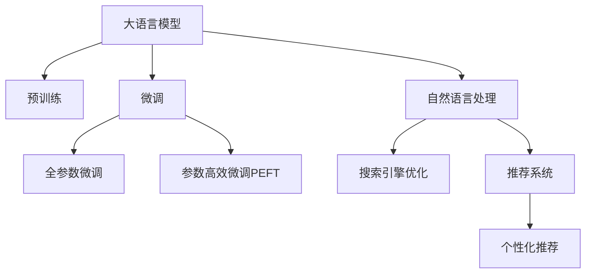

                 

# AI大模型如何提升电商搜索的效率

> 关键词：大语言模型,电商搜索,智能推荐,个性化推荐,自然语言处理,搜索引擎优化

## 1. 背景介绍

在当今电商竞争激烈的时代，如何提升搜索效率，改善用户体验，提升点击转化率，已成为各大电商平台的迫切需求。传统的搜索排序算法和关键词匹配方式已经难以满足用户多样化和个性化需求。而近年来，AI大模型通过预训练学习海量的语言知识，并在特定电商领域进行微调，展示出了强大的能力，为电商搜索带来了新一轮的突破。

本文将从大语言模型的基本概念、核心算法、微调实践、应用场景等方面，深入剖析AI大模型如何助力电商搜索。希望读者通过本文，能够了解到AI大模型在电商搜索中的潜在价值，并掌握如何构建高效的电商搜索系统。

## 2. 核心概念与联系

### 2.1 核心概念概述

为更好地理解AI大模型在电商搜索中的应用，本节将介绍几个密切相关的核心概念：

- 大语言模型(Large Language Model, LLM)：以自回归(如GPT)或自编码(如BERT)模型为代表的大规模预训练语言模型。通过在大规模无标签文本语料上进行预训练，学习通用的语言知识，具备强大的语言理解和生成能力。

- 预训练(Pre-training)：指在大规模无标签文本语料上，通过自监督学习任务训练通用语言模型的过程。常见的预训练任务包括言语建模、遮挡语言模型等。预训练使得模型学习到语言的通用表示。

- 微调(Fine-tuning)：指在预训练模型的基础上，使用特定领域的数据，通过有监督学习优化模型在该领域上的性能。通常只需要调整顶层分类器或解码器，并以较小的学习率更新全部或部分的模型参数。

- 自然语言处理(Natural Language Processing, NLP)：指使用计算机处理、分析和理解人类语言的技术。包括文本分类、语义理解、机器翻译等诸多任务。

- 搜索引擎优化(Search Engine Optimization, SEO)：指优化网站和内容，提升搜索引擎对网站的识别能力，使目标网页在自然搜索结果中的排名获得显著提升。

- 推荐系统(Recommendation System)：指通过分析用户行为，向用户推荐可能感兴趣的产品和服务。推荐系统广泛应用于电商、视频、新闻等平台，提供个性化的产品推荐。

- 个性化推荐(Individualized Recommendation)：指根据用户特定的行为和属性，提供个性化的推荐。个性化推荐系统常用于电商搜索，提升用户体验和购买转化率。

这些核心概念之间的逻辑关系可以通过以下Mermaid流程图来展示：



这个流程图展示了大语言模型的核心概念及其之间的关系：

1. 大语言模型通过预训练获得基础能力。
2. 微调是对预训练模型进行特定领域的优化，可以分为全参数微调和参数高效微调（PEFT）。
3. 自然语言处理是利用语言模型进行文本分析的技术，常用于搜索引擎优化。
4. 搜索引擎优化提升网站的搜索引擎排名，让用户更易发现产品。
5. 推荐系统提供个性化的商品推荐，提升用户体验和点击转化率。
6. 个性化推荐系统在电商搜索中尤为重要，通过用户行为数据优化推荐，进一步提升搜索效果。

## 3. 核心算法原理 & 具体操作步骤

### 3.1 算法原理概述

AI大模型在电商搜索中的应用，主要基于预训练-微调(Fine-tuning)的迁移学习范式。其核心思想是：将预训练的通用语言模型作为特征提取器，通过电商领域特定任务的标注数据进行微调，使得模型能够理解电商文本中的关键词、广告语、产品描述等信息，从而提升电商搜索的效率和效果。

形式化地，假设预训练语言模型为 $M_{\theta}$，其中 $\theta$ 为预训练得到的模型参数。给定电商领域任务 $T$ 的标注数据集 $D=\{(x_i, y_i)\}_{i=1}^N$，微调的目标是找到新的模型参数 $\hat{\theta}$，使得：

$$
\hat{\theta}=\mathop{\arg\min}_{\theta} \mathcal{L}(M_{\theta},D)
$$

其中 $\mathcal{L}$ 为针对任务 $T$ 设计的损失函数，用于衡量模型预测输出与真实标签之间的差异。常见的损失函数包括交叉熵损失、均方误差损失等。

通过梯度下降等优化算法，微调过程不断更新模型参数 $\theta$，最小化损失函数 $\mathcal{L}$，使得模型输出逼近真实标签。由于 $\theta$ 已经通过预训练获得了较好的初始化，因此即便在电商领域的小规模数据集上进行微调，也能较快收敛到理想的模型参数 $\hat{\theta}$。

### 3.2 算法步骤详解

基于预训练-微调范式，AI大模型在电商搜索中的应用通常包括以下几个关键步骤：

**Step 1: 准备预训练模型和数据集**
- 选择合适的预训练语言模型 $M_{\theta}$ 作为初始化参数，如 BERT、GPT 等。
- 准备电商领域任务 $T$ 的标注数据集 $D$，划分为训练集、验证集和测试集。一般要求标注数据与预训练数据的分布不要差异过大。

**Step 2: 添加任务适配层**
- 根据电商领域任务的特定需求，在预训练模型顶层设计合适的输出层和损失函数。
- 对于电商搜索任务，通常在顶层添加分类器，以预测搜索结果的相关性。
- 对于广告点击任务，通常使用点击率预测模型，输出预测概率。

**Step 3: 设置微调超参数**
- 选择合适的优化算法及其参数，如 AdamW、SGD 等，设置学习率、批大小、迭代轮数等。
- 设置正则化技术及强度，包括权重衰减、Dropout、Early Stopping等。
- 确定冻结预训练参数的策略，如仅微调顶层，或全部参数都参与微调。

**Step 4: 执行梯度训练**
- 将训练集数据分批次输入模型，前向传播计算损失函数。
- 反向传播计算参数梯度，根据设定的优化算法和学习率更新模型参数。
- 周期性在验证集上评估模型性能，根据性能指标决定是否触发 Early Stopping。
- 重复上述步骤直到满足预设的迭代轮数或 Early Stopping 条件。

**Step 5: 测试和部署**
- 在测试集上评估微调后模型 $M_{\hat{\theta}}$ 的性能，对比微调前后的精度提升。
- 使用微调后的模型对新样本进行推理预测，集成到实际的应用系统中。
- 持续收集新的数据，定期重新微调模型，以适应数据分布的变化。

以上是AI大模型在电商搜索中的应用的一般流程。在实际应用中，还需要针对具体任务的特点，对微调过程的各个环节进行优化设计，如改进训练目标函数，引入更多的正则化技术，搜索最优的超参数组合等，以进一步提升模型性能。

### 3.3 算法优缺点

AI大模型在电商搜索中的应用具有以下优点：
1. 提升搜索效率。AI大模型能够快速理解电商文本中的关键词、广告语等信息，提供精准的搜索结果。
2. 改善用户体验。通过个性化推荐，提升用户搜索满意度，减少跳出率。
3. 提高转化率。推荐系统能够根据用户行为预测其购买意向，提供定制化的推荐。
4. 适应性更强。AI大模型能够快速适应电商领域的数据分布，提升模型泛化性能。
5. 促进电商发展。通过提升搜索和推荐效果，电商企业能够更好地吸引用户，提升销量。

同时，该方法也存在一定的局限性：
1. 依赖标注数据。微调的效果很大程度上取决于标注数据的质量和数量，获取高质量标注数据的成本较高。
2. 过拟合风险。在电商领域小规模数据上微调，模型容易过拟合电商领域的特定模式，泛化性能不足。
3. 模型复杂度。大语言模型参数量巨大，硬件资源消耗较高，部署成本较高。
4. 可解释性不足。AI大模型作为"黑盒"系统，难以解释其内部工作机制和推理逻辑。
5. 隐私安全问题。电商搜索涉及大量用户数据，数据隐私和安全问题需严格处理。

尽管存在这些局限性，但就目前而言，基于大语言模型的微调方法仍是在电商搜索领域中表现出色的主流范式。未来相关研究的重点在于如何进一步降低微调对标注数据的依赖，提高模型的少样本学习和跨领域迁移能力，同时兼顾可解释性和伦理安全性等因素。

### 3.4 算法应用领域

基于AI大模型的电商搜索技术，已经在电商领域得到了广泛的应用，涵盖了从商品搜索到广告投放等多个环节，具体应用场景包括：

1. **商品搜索**：用户输入查询词后，AI大模型根据语义分析技术快速匹配相关商品，提升搜索效率。
2. **广告点击**：通过点击率预测模型，评估广告文本与用户的匹配度，优化广告投放策略。
3. **个性化推荐**：根据用户浏览和点击行为，AI大模型生成个性化商品推荐列表，提升购买转化率。
4. **客服对话**：通过微调对话模型，实现智能客服功能，提升用户互动体验。
5. **商品分类**：利用分类器对商品进行自动分类，简化商品管理流程。
6. **用户画像构建**：通过分析用户搜索历史和点击行为，构建用户画像，提升个性化推荐效果。

除了上述这些经典应用外，AI大模型还被创新性地应用于更多场景中，如购物助手、智能导购、内容推荐等，为电商搜索带来了新的突破。随着预训练语言模型和微调方法的不断进步，相信AI大模型将在电商搜索领域持续发挥强大的助力作用。

## 4. 数学模型和公式 & 详细讲解 & 举例说明

### 4.1 数学模型构建

本节将使用数学语言对AI大模型在电商搜索中的应用进行更加严格的刻画。

记预训练语言模型为 $M_{\theta}$，其中 $\theta$ 为预训练得到的模型参数。假设电商搜索任务 $T$ 的标注数据集为 $D=\{(x_i,y_i)\}_{i=1}^N, x_i \in \mathcal{X}, y_i \in \{0,1\}$，其中 $x_i$ 为电商文本，$y_i$ 为文本与商品的匹配度。

定义模型 $M_{\theta}$ 在输入 $x$ 上的输出为 $\hat{y}=M_{\theta}(x) \in [0,1]$，表示预测的匹配度。则电商搜索任务的损失函数为：

$$
\ell(y_i,\hat{y}) = -y_i\log \hat{y} - (1-y_i)\log (1-\hat{y})
$$

目标是最小化平均损失函数：

$$
\mathcal{L}(\theta) = \frac{1}{N}\sum_{i=1}^N \ell(y_i,\hat{y})
$$

通过梯度下降等优化算法，微调过程不断更新模型参数 $\theta$，最小化损失函数 $\mathcal{L}$，使得模型输出逼近真实标签 $y_i$。由于 $\theta$ 已经通过预训练获得了较好的初始化，因此即便在电商领域的小规模数据集上进行微调，也能较快收敛到理想的模型参数 $\hat{\theta}$。

### 4.2 公式推导过程

以下我们以电商搜索任务为例，推导交叉熵损失函数及其梯度的计算公式。

假设模型 $M_{\theta}$ 在输入 $x$ 上的输出为 $\hat{y}=M_{\theta}(x) \in [0,1]$，表示预测的匹配度。真实标签 $y \in \{0,1\}$。则电商搜索任务的损失函数定义为：

$$
\ell(y_i,\hat{y}) = -y_i\log \hat{y} - (1-y_i)\log (1-\hat{y})
$$

将其代入平均损失函数公式，得：

$$
\mathcal{L}(\theta) = -\frac{1}{N}\sum_{i=1}^N [y_i\log M_{\theta}(x_i)+(1-y_i)\log(1-M_{\theta}(x_i))]
$$

根据链式法则，损失函数对参数 $\theta_k$ 的梯度为：

$$
\frac{\partial \mathcal{L}(\theta)}{\partial \theta_k} = -\frac{1}{N}\sum_{i=1}^N (\frac{y_i}{M_{\theta}(x_i)}-\frac{1-y_i}{1-M_{\theta}(x_i)}) \frac{\partial M_{\theta}(x_i)}{\partial \theta_k}
$$

其中 $\frac{\partial M_{\theta}(x_i)}{\partial \theta_k}$ 可进一步递归展开，利用自动微分技术完成计算。

在得到损失函数的梯度后，即可带入参数更新公式，完成模型的迭代优化。重复上述过程直至收敛，最终得到适应电商搜索任务的最优模型参数 $\theta^*$。

## 5. 项目实践：代码实例和详细解释说明

### 5.1 开发环境搭建

在进行电商搜索微调实践前，我们需要准备好开发环境。以下是使用Python进行PyTorch开发的环境配置流程：

1. 安装Anaconda：从官网下载并安装Anaconda，用于创建独立的Python环境。

2. 创建并激活虚拟环境：
```bash
conda create -n pytorch-env python=3.8 
conda activate pytorch-env
```

3. 安装PyTorch：根据CUDA版本，从官网获取对应的安装命令。例如：
```bash
conda install pytorch torchvision torchaudio cudatoolkit=11.1 -c pytorch -c conda-forge
```

4. 安装Transformers库：
```bash
pip install transformers
```

5. 安装各类工具包：
```bash
pip install numpy pandas scikit-learn matplotlib tqdm jupyter notebook ipython
```

完成上述步骤后，即可在`pytorch-env`环境中开始电商搜索微调实践。

### 5.2 源代码详细实现

下面我们以电商搜索任务为例，给出使用Transformers库对BERT模型进行微调的PyTorch代码实现。

首先，定义电商搜索任务的数据处理函数：

```python
from transformers import BertTokenizer
from torch.utils.data import Dataset
import torch

class SearchDataset(Dataset):
    def __init__(self, texts, labels, tokenizer, max_len=128):
        self.texts = texts
        self.labels = labels
        self.tokenizer = tokenizer
        self.max_len = max_len
        
    def __len__(self):
        return len(self.texts)
    
    def __getitem__(self, item):
        text = self.texts[item]
        label = self.labels[item]
        
        encoding = self.tokenizer(text, return_tensors='pt', max_length=self.max_len, padding='max_length', truncation=True)
        input_ids = encoding['input_ids'][0]
        attention_mask = encoding['attention_mask'][0]
        
        # 对label进行编码
        encoded_label = [int(label)] * self.max_len
        labels = torch.tensor(encoded_label, dtype=torch.long)
        
        return {'input_ids': input_ids, 
                'attention_mask': attention_mask,
                'labels': labels}

# 标签编码
label2id = {0: '0', 1: '1'}
id2label = {v: k for k, v in label2id.items()}
```

然后，定义模型和优化器：

```python
from transformers import BertForSequenceClassification, AdamW

model = BertForSequenceClassification.from_pretrained('bert-base-cased', num_labels=2)

optimizer = AdamW(model.parameters(), lr=2e-5)
```

接着，定义训练和评估函数：

```python
from torch.utils.data import DataLoader
from tqdm import tqdm
from sklearn.metrics import accuracy_score

device = torch.device('cuda') if torch.cuda.is_available() else torch.device('cpu')
model.to(device)

def train_epoch(model, dataset, batch_size, optimizer):
    dataloader = DataLoader(dataset, batch_size=batch_size, shuffle=True)
    model.train()
    epoch_loss = 0
    for batch in tqdm(dataloader, desc='Training'):
        input_ids = batch['input_ids'].to(device)
        attention_mask = batch['attention_mask'].to(device)
        labels = batch['labels'].to(device)
        model.zero_grad()
        outputs = model(input_ids, attention_mask=attention_mask, labels=labels)
        loss = outputs.loss
        epoch_loss += loss.item()
        loss.backward()
        optimizer.step()
    return epoch_loss / len(dataloader)

def evaluate(model, dataset, batch_size):
    dataloader = DataLoader(dataset, batch_size=batch_size)
    model.eval()
    preds, labels = [], []
    with torch.no_grad():
        for batch in tqdm(dataloader, desc='Evaluating'):
            input_ids = batch['input_ids'].to(device)
            attention_mask = batch['attention_mask'].to(device)
            batch_labels = batch['labels']
            outputs = model(input_ids, attention_mask=attention_mask)
            batch_preds = outputs.logits.argmax(dim=1).to('cpu').tolist()
            batch_labels = batch_labels.to('cpu').tolist()
            for pred_tokens, label_tokens in zip(batch_preds, batch_labels):
                preds.append(pred_tokens[0])
                labels.append(label_tokens[0])
                
    print(f"Accuracy: {accuracy_score(labels, preds):.4f}")
```

最后，启动训练流程并在测试集上评估：

```python
epochs = 5
batch_size = 16

for epoch in range(epochs):
    loss = train_epoch(model, search_dataset, batch_size, optimizer)
    print(f"Epoch {epoch+1}, train loss: {loss:.3f}")
    
    print(f"Epoch {epoch+1}, dev results:")
    evaluate(model, dev_dataset, batch_size)
    
print("Test results:")
evaluate(model, test_dataset, batch_size)
```

以上就是使用PyTorch对BERT进行电商搜索任务微调的完整代码实现。可以看到，得益于Transformers库的强大封装，我们可以用相对简洁的代码完成BERT模型的加载和微调。

### 5.3 代码解读与分析

让我们再详细解读一下关键代码的实现细节：

**SearchDataset类**：
- `__init__`方法：初始化文本、标签、分词器等关键组件。
- `__len__`方法：返回数据集的样本数量。
- `__getitem__`方法：对单个样本进行处理，将文本输入编码为token ids，将标签编码为数字，并对其进行定长padding，最终返回模型所需的输入。

**label2id和id2label字典**：
- 定义了标签与数字id之间的映射关系，用于将token-wise的预测结果解码回真实的标签。

**训练和评估函数**：
- 使用PyTorch的DataLoader对数据集进行批次化加载，供模型训练和推理使用。
- 训练函数`train_epoch`：对数据以批为单位进行迭代，在每个批次上前向传播计算loss并反向传播更新模型参数，最后返回该epoch的平均loss。
- 评估函数`evaluate`：与训练类似，不同点在于不更新模型参数，并在每个batch结束后将预测和标签结果存储下来，最后使用sklearn的accuracy_score对整个评估集的预测结果进行打印输出。

**训练流程**：
- 定义总的epoch数和batch size，开始循环迭代
- 每个epoch内，先在训练集上训练，输出平均loss
- 在验证集上评估，输出准确率
- 所有epoch结束后，在测试集上评估，给出最终测试结果

可以看到，PyTorch配合Transformers库使得BERT微调的代码实现变得简洁高效。开发者可以将更多精力放在数据处理、模型改进等高层逻辑上，而不必过多关注底层的实现细节。

当然，工业级的系统实现还需考虑更多因素，如模型的保存和部署、超参数的自动搜索、更灵活的任务适配层等。但核心的微调范式基本与此类似。

## 6. 实际应用场景

### 6.1 智能客服系统

基于AI大模型的电商搜索技术，可以广泛应用于智能客服系统的构建。传统客服往往需要配备大量人力，高峰期响应缓慢，且一致性和专业性难以保证。而使用电商搜索微调后的对话模型，可以7x24小时不间断服务，快速响应客户咨询，用自然流畅的语言解答各类常见问题。

在技术实现上，可以收集企业内部的历史客服对话记录，将问题和最佳答复构建成监督数据，在此基础上对预训练对话模型进行微调。微调后的对话模型能够自动理解用户意图，匹配最合适的答案模板进行回复。对于客户提出的新问题，还可以接入检索系统实时搜索相关内容，动态组织生成回答。如此构建的智能客服系统，能大幅提升客户咨询体验和问题解决效率。

### 6.2 个性化推荐系统

当前的推荐系统往往只依赖用户的历史行为数据进行物品推荐，无法深入理解用户的真实兴趣偏好。基于电商搜索的AI大模型推荐系统，可以更好地挖掘用户行为背后的语义信息，从而提供更精准、多样的推荐内容。

在实践中，可以收集用户浏览、点击、评论、分享等行为数据，提取和用户交互的物品标题、描述、标签等文本内容。将文本内容作为模型输入，用户的后续行为（如是否点击、购买等）作为监督信号，在此基础上微调预训练语言模型。微调后的模型能够从文本内容中准确把握用户的兴趣点。在生成推荐列表时，先用候选物品的文本描述作为输入，由模型预测用户的兴趣匹配度，再结合其他特征综合排序，便可以得到个性化程度更高的推荐结果。

### 6.3 广告点击率预测

电商搜索微调技术可以应用于广告点击率预测。通过收集用户点击广告的点击数据，将其作为监督信号，对预训练模型进行微调。微调后的模型能够更好地理解广告文本的语义和情感，预测用户是否会点击广告。将微调后的模型集成到广告投放系统中，根据点击率预测结果，优化广告投放策略，提升广告点击率和广告转化率。

### 6.4 未来应用展望

随着AI大模型和电商搜索微调技术的不断发展，其在电商领域的应用前景将更加广阔。未来，我们预期以下趋势将驱动电商搜索技术的进一步提升：

1. 多模态融合：将文本、图像、音频等多种模态数据进行融合，提升搜索效果。如通过解析视频中的对话内容，识别用户需求，生成推荐列表。
2. 智能推荐引擎：结合用户行为数据和电商知识图谱，构建智能推荐引擎，提升推荐效果。如通过路径推理，识别用户需求和购买意向，生成个性化推荐。
3. 跨平台协同：将电商搜索技术应用于多个平台，如社交媒体、搜索引擎等，提升用户搜索体验和转化率。如通过跨平台协同搜索，提供一站式的购物体验。
4. 实时搜索优化：结合实时数据流，优化搜索算法，提升搜索效果。如通过实时监控用户搜索行为，动态调整搜索结果。
5. 用户画像构建：通过分析用户搜索历史和点击行为，构建用户画像，提升个性化推荐效果。如通过多源数据融合，构建更加全面的用户画像。
6. 智能客服升级：通过电商搜索微调技术，提升智能客服系统的智能水平，实现更加自然流畅的客服对话。如通过自然语言生成技术，生成智能客服回复。

以上趋势凸显了AI大模型在电商搜索领域的巨大潜力。这些方向的探索发展，必将进一步提升电商搜索的效果和效率，为电商企业带来新的竞争优势。

## 7. 工具和资源推荐
### 7.1 学习资源推荐

为了帮助开发者系统掌握AI大模型在电商搜索中的应用，这里推荐一些优质的学习资源：

1. 《深度学习与自然语言处理》课程：斯坦福大学开设的NLP明星课程，涵盖了从预训练到微调的全流程，适合初学者学习。

2. 《Transformer理论及应用》书籍：详解Transformer模型原理及其在电商搜索中的应用，是理解大模型微调技术的必备资料。

3. PyTorch官方文档：详细介绍了PyTorch框架的使用方法，包括模型的构建、微调等技术。

4. HuggingFace官方文档：提供了丰富的预训练模型和微调样例代码，是电商搜索实践的必备工具。

5. 《自然语言处理入门》系列博文：深入浅出地介绍了自然语言处理的各个核心概念和前沿技术。

通过对这些资源的学习实践，相信你一定能够快速掌握AI大模型在电商搜索中的应用，并用于解决实际的电商搜索问题。
### 7.2 开发工具推荐

高效的开发离不开优秀的工具支持。以下是几款用于电商搜索微调开发的常用工具：

1. PyTorch：基于Python的开源深度学习框架，灵活动态的计算图，适合快速迭代研究。大部分预训练语言模型都有PyTorch版本的实现。

2. TensorFlow：由Google主导开发的开源深度学习框架，生产部署方便，适合大规模工程应用。同样有丰富的预训练语言模型资源。

3. Transformers库：HuggingFace开发的NLP工具库，集成了众多SOTA语言模型，支持PyTorch和TensorFlow，是进行电商搜索微调任务开发的利器。

4. Weights & Biases：模型训练的实验跟踪工具，可以记录和可视化模型训练过程中的各项指标，方便对比和调优。与主流深度学习框架无缝集成。

5. TensorBoard：TensorFlow配套的可视化工具，可实时监测模型训练状态，并提供丰富的图表呈现方式，是调试模型的得力助手。

6. Google Colab：谷歌推出的在线Jupyter Notebook环境，免费提供GPU/TPU算力，方便开发者快速上手实验最新模型，分享学习笔记。

合理利用这些工具，可以显著提升电商搜索微调任务的开发效率，加快创新迭代的步伐。

### 7.3 相关论文推荐

AI大模型在电商搜索中的应用源于学界的持续研究。以下是几篇奠基性的相关论文，推荐阅读：

1. Attention is All You Need：提出了Transformer结构，开启了NLP领域的预训练大模型时代。

2. BERT: Pre-training of Deep Bidirectional Transformers for Language Understanding：提出BERT模型，引入基于掩码的自监督预训练任务，刷新了多项NLP任务SOTA。

3. Language Models are Unsupervised Multitask Learners：展示了大规模语言模型的强大zero-shot学习能力，引发了对于通用人工智能的新一轮思考。

4. Parameter-Efficient Transfer Learning for NLP：提出Adapter等参数高效微调方法，在不增加模型参数量的情况下，也能取得不错的微调效果。

5. Personalized Recommendation Based on Deep Learning：介绍了深度学习在推荐系统中的应用，展示了通过电商搜索微调提升推荐效果的方法。

这些论文代表了大语言模型在电商搜索领域的发展脉络。通过学习这些前沿成果，可以帮助研究者把握学科前进方向，激发更多的创新灵感。

## 8. 总结：未来发展趋势与挑战

### 8.1 总结

本文对AI大模型在电商搜索中的应用进行了全面系统的介绍。首先阐述了AI大模型和电商搜索的基本概念，明确了电商搜索中AI大模型微调的目标和意义。其次，从原理到实践，详细讲解了电商搜索微调的基本算法，给出了电商搜索任务微调的完整代码实现。同时，本文还广泛探讨了AI大模型在电商搜索中的应用场景，展示了其强大的潜力。

通过本文的系统梳理，可以看到，基于AI大模型的电商搜索微调方法正在成为电商搜索领域的重要范式，极大地提升了电商搜索的效率和效果。未来，伴随预训练语言模型和微调方法的持续演进，相信AI大模型将在电商搜索领域持续发挥强大的助力作用。

### 8.2 未来发展趋势

展望未来，AI大模型在电商搜索中的应用将呈现以下几个发展趋势：

1. 规模化部署：随着AI大模型微调技术的成熟，电商企业将大规模部署AI大模型，提升电商搜索和推荐的效果。

2. 跨平台协同：将电商搜索微调技术应用于多个平台，如社交媒体、搜索引擎等，提升用户搜索体验和转化率。

3. 实时优化：结合实时数据流，优化搜索算法，提升搜索效果。如通过实时监控用户搜索行为，动态调整搜索结果。

4. 用户画像构建：通过分析用户搜索历史和点击行为，构建用户画像，提升个性化推荐效果。

5. 跨领域迁移：将电商搜索微调技术应用于其他领域，如智能客服、医疗等，提升领域搜索效果。

6. 多模态融合：将文本、图像、音频等多种模态数据进行融合，提升搜索效果。

以上趋势凸显了AI大模型在电商搜索领域的巨大潜力。这些方向的探索发展，必将进一步提升电商搜索的效果和效率，为电商企业带来新的竞争优势。

### 8.3 面临的挑战

尽管AI大模型在电商搜索中的应用已经取得了显著成效，但在迈向更加智能化、普适化应用的过程中，仍面临诸多挑战：

1. 标注成本瓶颈。尽管电商搜索微调的数据需求量相对较小，但仍需收集一定量的标注数据，成本较高。如何降低标注成本，利用无监督学习和半监督学习提升模型性能，将是重要的研究方向。

2. 模型鲁棒性不足。在电商领域小规模数据上微调，模型容易过拟合电商领域的特定模式，泛化性能不足。如何提高模型鲁棒性，避免过拟合，仍是重要的研究课题。

3. 模型复杂度。大语言模型参数量巨大，硬件资源消耗较高，部署成本较高。如何降低模型复杂度，优化推理速度，是亟待解决的问题。

4. 可解释性不足。AI大模型作为"黑盒"系统，难以解释其内部工作机制和推理逻辑。如何赋予模型可解释性，提高其透明度，是重要的研究方向。

5. 隐私安全问题。电商搜索涉及大量用户数据，数据隐私和安全问题需严格处理。如何保护用户隐私，确保数据安全，是亟需解决的问题。

尽管存在这些挑战，但就目前而言，基于AI大模型的电商搜索微调方法仍是在电商搜索领域中表现出色的主流范式。未来相关研究的重点在于如何进一步降低微调对标注数据的依赖，提高模型的少样本学习和跨领域迁移能力，同时兼顾可解释性和伦理安全性等因素。

### 8.4 未来突破

面对AI大模型在电商搜索应用中面临的种种挑战，未来的研究需要在以下几个方面寻求新的突破：

1. 探索无监督和半监督微调方法。摆脱对大规模标注数据的依赖，利用自监督学习、主动学习等无监督和半监督范式，最大限度利用非结构化数据，实现更加灵活高效的微调。

2. 研究参数高效和计算高效的微调范式。开发更加参数高效的微调方法，在固定大部分预训练参数的同时，只更新极少量的任务相关参数。同时优化微调模型的计算图，减少前向传播和反向传播的资源消耗，实现更加轻量级、实时性的部署。

3. 引入更多先验知识。将符号化的先验知识，如知识图谱、逻辑规则等，与神经网络模型进行巧妙融合，引导微调过程学习更准确、合理的语言模型。同时加强不同模态数据的整合，实现视觉、语音等多模态信息与文本信息的协同建模。

4. 纳入伦理道德约束。在模型训练目标中引入伦理导向的评估指标，过滤和惩罚有偏见、有害的输出倾向。同时加强人工干预和审核，建立模型行为的监管机制，确保输出符合人类价值观和伦理道德。

这些研究方向的探索，必将引领AI大模型在电商搜索领域迈向更高的台阶，为电商搜索带来新的突破。面向未来，AI大模型在电商搜索中的应用还需与其他人工智能技术进行更深入的融合，如知识表示、因果推理、强化学习等，多路径协同发力，共同推动电商搜索技术的进步。只有勇于创新、敢于突破，才能不断拓展语言模型的边界，让智能技术更好地造福电商企业。

## 9. 附录：常见问题与解答

**Q1：电商搜索微调是否适用于所有电商企业？**

A: 电商搜索微调技术在大多数电商企业中都能取得不错的效果，但对于一些特定领域的电商企业，如医疗、教育等，可能需要进一步微调或引入特定领域的知识库，才能获得理想效果。

**Q2：电商搜索微调需要多长时间？**

A: 电商搜索微调的时间取决于数据集的大小、模型复杂度、硬件资源等因素。一般而言，微调一个简单的二分类任务可能需要几个小时，而微调复杂的推荐系统可能需耗费几周时间。在实际应用中，需要根据具体情况进行评估和优化。

**Q3：电商搜索微调是否需要大量的标注数据？**

A: 电商搜索微调对标注数据的需求相对较小，一般只需收集少量用户点击和浏览数据。但高质量标注数据仍能显著提升模型性能，因此建议收集更多的标注数据。

**Q4：电商搜索微调对算力的要求高吗？**

A: 电商搜索微调对算力的要求较高，尤其是对于大语言模型如BERT、GPT等，需要较强的硬件资源支持。建议在具有GPU/TPU等高性能设备的服务器上进行微调。

**Q5：电商搜索微调如何避免过拟合？**

A: 电商搜索微调过程中，过拟合是一个常见问题。为避免过拟合，可以使用正则化技术如L2正则、Dropout、Early Stopping等，同时采用数据增强技术，如回译、近义替换等，扩大训练集的多样性。

这些解答希望能为电商企业提供一些参考，帮助他们在电商搜索微调过程中更好地解决问题，提升电商搜索的效果和效率。

---

作者：禅与计算机程序设计艺术 / Zen and the Art of Computer Programming

