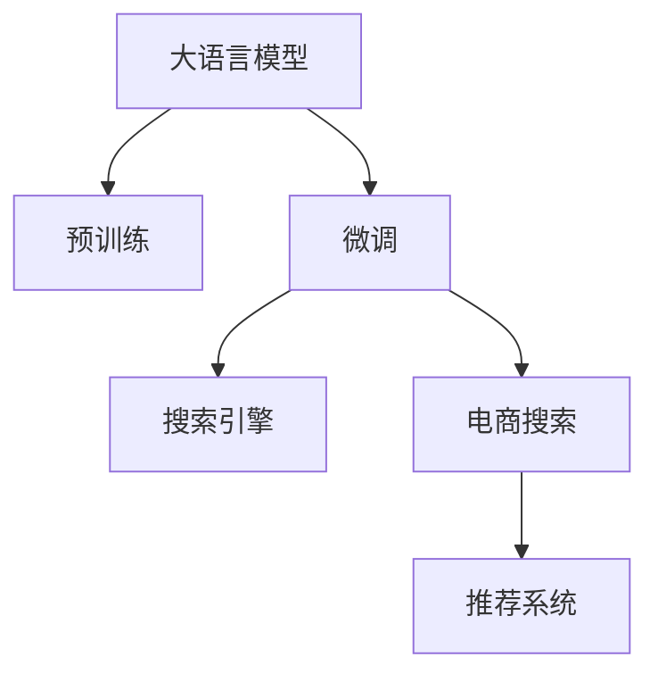

                 

# AI大模型如何提升电商搜索的相关性

## 1. 背景介绍

### 1.1 问题由来

在电子商务领域，搜索功能是用户获取商品信息的重要入口。然而，传统搜索引擎往往只能基于关键词匹配返回网页列表，无法理解用户的查询意图，造成搜索结果与用户需求不匹配，用户体验差。而基于深度学习的大模型具备了语言理解能力，能够更好地理解查询意图和商品描述，从而显著提升电商搜索的相关性和用户体验。

当前，基于深度学习的大模型在电商搜索领域已经得到了广泛的应用，例如使用BERT、GPT等模型进行查询理解和商品描述分析，实现了从传统关键词匹配向语义匹配的转型。但由于模型复杂度高、训练成本大，一般电商企业难以承受，因此研究如何基于大模型高效、低成本地提升电商搜索的相关性，具有重要意义。

## 2. 核心概念与联系

### 2.1 核心概念概述

为更好地理解大模型在电商搜索中的应用，本节将介绍几个密切相关的核心概念：

- 大语言模型(Large Language Model, LLM)：以自回归(如GPT)或自编码(如BERT)模型为代表的大规模预训练语言模型。通过在大规模无标签文本语料上进行预训练，学习通用的语言表示，具备强大的语言理解和生成能力。

- 预训练(Pre-training)：指在大规模无标签文本语料上，通过自监督学习任务训练通用语言模型的过程。常见的预训练任务包括言语建模、遮挡语言模型等。预训练使得模型学习到语言的通用表示。

- 微调(Fine-tuning)：指在预训练模型的基础上，使用下游任务的少量标注数据，通过有监督学习优化模型在该任务上的性能。通常只需要调整顶层分类器或解码器，并以较小的学习率更新全部或部分的模型参数。

- 搜索引擎(Web Search Engine)：能够根据用户查询自动搜索网页并返回结果的系统。传统的搜索引擎主要基于关键词匹配技术，难以理解查询的语义。

- 电商搜索(E-commerce Search)：指在电商平台上，根据用户查询搜索商品并返回相关商品的系统。相较于传统搜索引擎，电商搜索需要理解商品描述、价格、销量等更多信息。

- 推荐系统(Recommendation System)：基于用户的历史行为数据，向用户推荐可能感兴趣的物品的系统。电商搜索和推荐系统可以互相补充，提升用户体验和满意度。

这些核心概念之间的逻辑关系可以通过以下Mermaid流程图来展示：



这个流程图展示了大语言模型的核心概念及其之间的关系：

1. 大语言模型通过预训练获得基础能力。
2. 微调是对预训练模型进行任务特定的优化，使其能够理解查询和商品描述。
3. 微调后的模型可以用于电商搜索和推荐系统，进一步提升用户体验。

## 3. 核心算法原理 & 具体操作步骤

### 3.1 算法原理概述

基于大模型的电商搜索系统主要分为两个关键步骤：查询理解和商品匹配。其核心思想是：利用预训练语言模型学习语言知识，通过微调使其理解查询意图和商品描述，实现语义匹配。

具体而言，查询理解的任务是：给定一个查询$q$，模型能够理解用户意图并生成代表该意图的嵌入向量$\text{Query}(q)$。商品匹配的任务是：给定一个商品描述$d$，模型能够生成代表该描述的嵌入向量$\text{Doc}(d)$。通过计算$\text{Query}(q)$和$\text{Doc}(d)$之间的相似度，模型能够判断该商品是否符合用户查询。

形式化地，假设模型为$M_{\theta}$，其预训练嵌入层为$e^{Q}, e^{D}$。对于查询$q$和商品$d$，其嵌入向量分别为$e^{Q}(q), e^{D}(d)$。则查询理解的目标是：

$$
\text{Query}(q) = e^{Q}(q) \in \mathbb{R}^d
$$

商品匹配的目标是：

$$
\text{Doc}(d) = e^{D}(d) \in \mathbb{R}^d
$$

其中$d$为模型的嵌入维度。查询和商品之间的相似度可以通过余弦相似度或点积相似度等方法计算：

$$
\text{Similarity}(q,d) = \cos(\text{Query}(q), \text{Doc}(d)) = \frac{\text{Query}(q) \cdot \text{Doc}(d)}{\|\text{Query}(q)\| \|\text{Doc}(d)\|}
$$

余弦相似度在查询和商品描述相似度计算中更为常用，因为其数值范围在[-1,1]之间，更容易处理。

### 3.2 算法步骤详解

基于大模型的电商搜索系统一般包括以下几个关键步骤：

**Step 1: 准备预训练模型和数据集**
- 选择合适的预训练语言模型 $M_{\theta}$ 作为初始化参数，如 BERT、GPT等。
- 准备电商商品描述和用户查询的标注数据集 $D=\{(q_i, d_i)\}_{i=1}^N$，其中每个查询-商品对都有人工标注的商品是否符合查询的标签。

**Step 2: 添加任务适配层**
- 根据查询理解和商品匹配的任务，在预训练模型顶层设计合适的输出层和损失函数。
- 对于查询理解，通常在顶层添加线性分类器或解码器，输出查询向量的维度和查询意图。
- 对于商品匹配，通常使用语言模型的解码器输出概率分布，并以负对数似然为损失函数。

**Step 3: 设置微调超参数**
- 选择合适的优化算法及其参数，如 AdamW、SGD 等，设置学习率、批大小、迭代轮数等。
- 设置正则化技术及强度，包括权重衰减、Dropout、Early Stopping等。
- 确定冻结预训练参数的策略，如仅微调顶层，或全部参数都参与微调。

**Step 4: 执行梯度训练**
- 将训练集数据分批次输入模型，前向传播计算损失函数。
- 反向传播计算参数梯度，根据设定的优化算法和学习率更新模型参数。
- 周期性在验证集上评估模型性能，根据性能指标决定是否触发 Early Stopping。
- 重复上述步骤直到满足预设的迭代轮数或 Early Stopping 条件。

**Step 5: 测试和部署**
- 在测试集上评估微调后模型 $M_{\hat{\theta}}$ 的性能，对比微调前后的精度提升。
- 使用微调后的模型对新查询进行推理预测，集成到实际的应用系统中。
- 持续收集新的查询和商品描述，定期重新微调模型，以适应数据分布的变化。

以上是基于大模型电商搜索的一般流程。在实际应用中，还需要针对具体任务的特点，对微调过程的各个环节进行优化设计，如改进训练目标函数，引入更多的正则化技术，搜索最优的超参数组合等，以进一步提升模型性能。

### 3.3 算法优缺点

基于大模型的电商搜索方法具有以下优点：
1. 语义匹配能力强。通过预训练模型学习语言知识，可以实现更精确的查询理解。
2. 泛化能力强。大模型可以通过少量标注数据，在新的电商场景中快速适应，实现跨领域迁移。
3. 效果好。在查询意图理解和商品匹配上，大模型的性能往往优于传统的关键词匹配方法。

同时，该方法也存在一定的局限性：
1. 数据标注成本高。电商领域标注商品与查询匹配标签需要大量人工标注，成本较高。
2. 模型资源需求大。大模型通常需要高性能的GPU等硬件支持，难以在低端设备上部署。
3. 可解释性差。大模型往往是"黑盒"模型，难以解释其内部决策逻辑。
4. 偏差问题。大模型可能继承预训练数据的偏差，导致输出结果存在偏见。

尽管存在这些局限性，但就目前而言，基于大模型的电商搜索方法仍是电商搜索技术的一个重要方向。未来相关研究的重点在于如何进一步降低数据标注成本，提高模型效率，提升可解释性和可靠性，避免模型偏差等。

### 3.4 算法应用领域

基于大模型的电商搜索方法已经在电商领域得到了广泛的应用，例如在以下几个方面：

1. **商品搜索**：用户通过输入查询，系统自动推荐符合该查询的商品。基于大模型的电商搜索可以理解查询意图，从而生成更精确的推荐。

2. **推荐排序**：电商平台上需要根据用户行为数据和商品属性信息，进行商品的排序推荐。基于大模型的电商搜索可以学习商品和查询的语义关系，进行更合理的推荐排序。

3. **个性化展示**：根据用户的浏览和购买行为，实时调整商品的展示方式和顺序。基于大模型的电商搜索可以捕捉用户的个性化需求，提供个性化的购物体验。

4. **问答系统**：电商平台集成问答系统，用户可以获取商品描述、价格、评价等信息。基于大模型的电商搜索可以理解自然语言问题，生成准确的回答。

除了上述这些经典应用外，基于大模型的电商搜索还将在更多场景中得到应用，如智能客服、广告推荐、内容分析等，为电商搜索技术带来全新的突破。

## 4. 数学模型和公式 & 详细讲解  
### 4.1 数学模型构建

本节将使用数学语言对基于大模型的电商搜索过程进行更加严格的刻画。

假设查询理解任务的目标是：给定查询$q$，模型生成其嵌入向量$\text{Query}(q)$。商品匹配任务的目标是：给定商品描述$d$，模型生成其嵌入向量$\text{Doc}(d)$。

对于查询$q$，模型的输出为$\text{Query}(q)$。令$\text{Layer}_1, \text{Layer}_2, \cdots, \text{Layer}_n$为预训练模型中的隐藏层，$\text{Layer}_n$的参数为$\theta$。查询$q$通过这些层进行前向传播，得到最终输出$\text{Query}(q)$。

对于商品$d$，模型的输出为$\text{Doc}(d)$。令$\text{Layer}_n$的参数为$\theta$，商品描述$d$通过这些层进行前向传播，得到最终输出$\text{Doc}(d)$。

查询和商品之间的相似度可以通过余弦相似度或点积相似度等方法计算。这里采用余弦相似度，计算公式为：

$$
\text{Similarity}(q,d) = \cos(\text{Query}(q), \text{Doc}(d)) = \frac{\text{Query}(q) \cdot \text{Doc}(d)}{\|\text{Query}(q)\| \|\text{Doc}(d)\|}
$$

其中$\|\cdot\|$表示向量范数。

### 4.2 公式推导过程

下面以余弦相似度为例，推导电商搜索模型的损失函数和梯度计算公式。

假设模型对查询$q$和商品$d$分别输出嵌入向量$\text{Query}(q)$和$\text{Doc}(d)$。查询和商品之间的相似度为$\text{Similarity}(q,d)$。假设查询$q$和商品$d$的标签为$y_q$和$y_d$，其中$y_q = 1$表示商品$d$符合查询$q$，$y_d = 0$表示商品$d$不符合查询$q$。则查询理解的任务目标为：

$$
\mathcal{L}(q) = \ell(M_{\theta}(q), y_q) = -y_q\log \text{Similarity}(q,d) - (1-y_q)\log(1-\text{Similarity}(q,d))
$$

商品匹配的任务目标为：

$$
\mathcal{L}(d) = \ell(M_{\theta}(d), y_d) = -y_d\log \text{Similarity}(q,d) - (1-y_d)\log(1-\text{Similarity}(q,d))
$$

对于电商搜索系统，查询理解和商品匹配任务的损失函数可以合并，定义为一个单次查询$d$的损失函数：

$$
\mathcal{L}(d) = \ell(M_{\theta}(q), y_q) + \ell(M_{\theta}(d), y_d)
$$

在训练过程中，需要最小化上述损失函数。令$\mathcal{L}(D)$为训练集$D$上的经验风险，则模型的训练目标为：

$$
\mathcal{L}(\theta) = \frac{1}{N}\sum_{i=1}^N \mathcal{L}(d_i)
$$

在梯度下降等优化算法的作用下，模型参数$\theta$不断更新，最终收敛到最优值。

## 5. 项目实践：代码实例和详细解释说明
### 5.1 开发环境搭建

在进行电商搜索实践前，我们需要准备好开发环境。以下是使用Python进行PyTorch开发的环境配置流程：

1. 安装Anaconda：从官网下载并安装Anaconda，用于创建独立的Python环境。

2. 创建并激活虚拟环境：
```bash
conda create -n pytorch-env python=3.8 
conda activate pytorch-env
```

3. 安装PyTorch：根据CUDA版本，从官网获取对应的安装命令。例如：
```bash
conda install pytorch torchvision torchaudio cudatoolkit=11.1 -c pytorch -c conda-forge
```

4. 安装Transformers库：
```bash
pip install transformers
```

5. 安装各类工具包：
```bash
pip install numpy pandas scikit-learn matplotlib tqdm jupyter notebook ipython
```

完成上述步骤后，即可在`pytorch-env`环境中开始电商搜索实践。

### 5.2 源代码详细实现

这里我们以使用BERT模型进行电商搜索为例，给出完整的代码实现。

首先，定义查询理解的任务函数：

```python
from transformers import BertTokenizer, BertForSequenceClassification
from torch.utils.data import Dataset
import torch

class QueryDataset(Dataset):
    def __init__(self, queries, doc_ids, doc_labels, tokenizer, max_len=128):
        self.queries = queries
        self.doc_ids = doc_ids
        self.doc_labels = doc_labels
        self.tokenizer = tokenizer
        self.max_len = max_len
        
    def __len__(self):
        return len(self.queries)
    
    def __getitem__(self, item):
        query = self.queries[item]
        doc_id = self.doc_ids[item]
        doc_label = self.doc_labels[item]
        
        encoding = self.tokenizer(query, return_tensors='pt', max_length=self.max_len, padding='max_length', truncation=True)
        input_ids = encoding['input_ids'][0]
        attention_mask = encoding['attention_mask'][0]
        
        doc_ids = torch.tensor([doc_id], dtype=torch.long)
        labels = torch.tensor([doc_label], dtype=torch.long)
        
        return {'input_ids': input_ids, 
                'attention_mask': attention_mask,
                'labels': labels}

tokenizer = BertTokenizer.from_pretrained('bert-base-cased')
train_dataset = QueryDataset(train_queries, train_doc_ids, train_doc_labels, tokenizer)
dev_dataset = QueryDataset(dev_queries, dev_doc_ids, dev_doc_labels, tokenizer)
test_dataset = QueryDataset(test_queries, test_doc_ids, test_doc_labels, tokenizer)
```

然后，定义商品匹配的任务函数：

```python
class DocDataset(Dataset):
    def __init__(self, docs, doc_labels, tokenizer, max_len=128):
        self.docs = docs
        self.doc_labels = doc_labels
        self.tokenizer = tokenizer
        self.max_len = max_len
        
    def __len__(self):
        return len(self.docs)
    
    def __getitem__(self, item):
        doc = self.docs[item]
        doc_label = self.doc_labels[item]
        
        encoding = self.tokenizer(doc, return_tensors='pt', max_length=self.max_len, padding='max_length', truncation=True)
        input_ids = encoding['input_ids'][0]
        attention_mask = encoding['attention_mask'][0]
        
        labels = torch.tensor([doc_label], dtype=torch.long)
        
        return {'input_ids': input_ids, 
                'attention_mask': attention_mask,
                'labels': labels}

train_dataset = DocDataset(train_docs, train_doc_labels, tokenizer)
dev_dataset = DocDataset(dev_docs, dev_doc_labels, tokenizer)
test_dataset = DocDataset(test_docs, test_doc_labels, tokenizer)
```

接着，定义模型和优化器：

```python
from transformers import BertForTokenClassification, AdamW

model = BertForTokenClassification.from_pretrained('bert-base-cased', num_labels=2)

optimizer = AdamW(model.parameters(), lr=2e-5)
```

接着，定义训练和评估函数：

```python
from torch.utils.data import DataLoader
from tqdm import tqdm
from sklearn.metrics import classification_report

device = torch.device('cuda') if torch.cuda.is_available() else torch.device('cpu')
model.to(device)

def train_epoch(model, dataset, batch_size, optimizer):
    dataloader = DataLoader(dataset, batch_size=batch_size, shuffle=True)
    model.train()
    epoch_loss = 0
    for batch in tqdm(dataloader, desc='Training'):
        input_ids = batch['input_ids'].to(device)
        attention_mask = batch['attention_mask'].to(device)
        labels = batch['labels'].to(device)
        model.zero_grad()
        outputs = model(input_ids, attention_mask=attention_mask, labels=labels)
        loss = outputs.loss
        epoch_loss += loss.item()
        loss.backward()
        optimizer.step()
    return epoch_loss / len(dataloader)

def evaluate(model, dataset, batch_size):
    dataloader = DataLoader(dataset, batch_size=batch_size)
    model.eval()
    preds, labels = [], []
    with torch.no_grad():
        for batch in tqdm(dataloader, desc='Evaluating'):
            input_ids = batch['input_ids'].to(device)
            attention_mask = batch['attention_mask'].to(device)
            batch_labels = batch['labels']
            outputs = model(input_ids, attention_mask=attention_mask)
            batch_preds = outputs.logits.argmax(dim=2).to('cpu').tolist()
            batch_labels = batch_labels.to('cpu').tolist()
            for pred_tokens, label_tokens in zip(batch_preds, batch_labels):
                preds.append(pred_tokens[:len(label_tokens)])
                labels.append(label_tokens)
                
    print(classification_report(labels, preds))
```

最后，启动训练流程并在测试集上评估：

```python
epochs = 5
batch_size = 16

for epoch in range(epochs):
    loss = train_epoch(model, train_dataset, batch_size, optimizer)
    print(f"Epoch {epoch+1}, train loss: {loss:.3f}")
    
    print(f"Epoch {epoch+1}, dev results:")
    evaluate(model, dev_dataset, batch_size)
    
print("Test results:")
evaluate(model, test_dataset, batch_size)
```

以上就是使用PyTorch对BERT进行电商搜索的完整代码实现。可以看到，通过合理利用Transformers库，电商搜索模型的开发变得简洁高效。

### 5.3 代码解读与分析

让我们再详细解读一下关键代码的实现细节：

**QueryDataset类**：
- `__init__`方法：初始化查询、文档ID、文档标签、分词器等关键组件。
- `__len__`方法：返回数据集的样本数量。
- `__getitem__`方法：对单个样本进行处理，将查询输入编码为token ids，将文档ID和文档标签编码为数字，并对其进行定长padding，最终返回模型所需的输入。

**DocDataset类**：
- `__init__`方法：初始化商品、文档标签、分词器等关键组件。
- `__len__`方法：返回数据集的样本数量。
- `__getitem__`方法：对单个样本进行处理，将商品描述输入编码为token ids，将文档标签编码为数字，并对其进行定长padding，最终返回模型所需的输入。

**训练和评估函数**：
- 使用PyTorch的DataLoader对数据集进行批次化加载，供模型训练和推理使用。
- 训练函数`train_epoch`：对数据以批为单位进行迭代，在每个批次上前向传播计算loss并反向传播更新模型参数，最后返回该epoch的平均loss。
- 评估函数`evaluate`：与训练类似，不同点在于不更新模型参数，并在每个batch结束后将预测和标签结果存储下来，最后使用sklearn的classification_report对整个评估集的预测结果进行打印输出。

**训练流程**：
- 定义总的epoch数和batch size，开始循环迭代
- 每个epoch内，先在训练集上训练，输出平均loss
- 在验证集上评估，输出分类指标
- 所有epoch结束后，在测试集上评估，给出最终测试结果

可以看到，PyTorch配合Transformers库使得BERT电商搜索的代码实现变得简洁高效。开发者可以将更多精力放在数据处理、模型改进等高层逻辑上，而不必过多关注底层的实现细节。

当然，工业级的系统实现还需考虑更多因素，如模型的保存和部署、超参数的自动搜索、更灵活的任务适配层等。但核心的电商搜索范式基本与此类似。

## 6. 实际应用场景
### 6.1 智能客服系统

基于大模型的电商搜索可以应用于智能客服系统的构建。传统客服往往需要配备大量人力，高峰期响应缓慢，且一致性和专业性难以保证。而使用微调后的搜索模型，可以7x24小时不间断服务，快速响应客户咨询，用自然流畅的语言解答各类常见问题。

在技术实现上，可以收集企业内部的历史客服对话记录，将问题和最佳答复构建成监督数据，在此基础上对预训练搜索模型进行微调。微调后的搜索模型能够自动理解用户意图，匹配最合适的答案模板进行回复。对于客户提出的新问题，还可以接入检索系统实时搜索相关内容，动态组织生成回答。如此构建的智能客服系统，能大幅提升客户咨询体验和问题解决效率。

### 6.2 个性化推荐系统

当前的推荐系统往往只依赖用户的历史行为数据进行物品推荐，无法深入理解用户的真实兴趣偏好。基于大模型的电商搜索可以更好地挖掘用户行为背后的语义信息，从而提供更精准、多样的推荐内容。

在实践中，可以收集用户浏览、点击、评论、分享等行为数据，提取和用户交互的物品标题、描述、标签等文本内容。将文本内容作为模型输入，用户的后续行为（如是否点击、购买等）作为监督信号，在此基础上微调预训练搜索模型。微调后的模型能够从文本内容中准确把握用户的兴趣点。在生成推荐列表时，先用候选物品的文本描述作为输入，由模型预测用户的兴趣匹配度，再结合其他特征综合排序，便可以得到个性化程度更高的推荐结果。

### 6.3 未来应用展望

随着大语言模型和电商搜索技术的发展，基于微调的方法将在更多领域得到应用，为电商搜索带来全新的突破。

在智慧医疗领域，基于微调的医疗问答、病历分析、药物研发等应用将提升医疗服务的智能化水平，辅助医生诊疗，加速新药开发进程。

在智能教育领域，微调技术可应用于作业批改、学情分析、知识推荐等方面，因材施教，促进教育公平，提高教学质量。

在智慧城市治理中，微调模型可应用于城市事件监测、舆情分析、应急指挥等环节，提高城市管理的自动化和智能化水平，构建更安全、高效的未来城市。

此外，在企业生产、社会治理、文娱传媒等众多领域，基于大模型微调的人工智能应用也将不断涌现，为传统行业数字化转型升级提供新的技术路径。相信随着技术的日益成熟，微调方法将成为人工智能落地应用的重要范式，推动人工智能技术在更多行业得到应用。

## 7. 工具和资源推荐
### 7.1 学习资源推荐

为了帮助开发者系统掌握大模型电商搜索的理论基础和实践技巧，这里推荐一些优质的学习资源：

1. 《Transformer从原理到实践》系列博文：由大模型技术专家撰写，深入浅出地介绍了Transformer原理、BERT模型、电商搜索等前沿话题。

2. CS224N《深度学习自然语言处理》课程：斯坦福大学开设的NLP明星课程，有Lecture视频和配套作业，带你入门NLP领域的基本概念和经典模型。

3. 《Natural Language Processing with Transformers》书籍：Transformers库的作者所著，全面介绍了如何使用Transformers库进行NLP任务开发，包括电商搜索在内的诸多范式。

4. HuggingFace官方文档：Transformers库的官方文档，提供了海量预训练模型和完整的电商搜索样例代码，是上手实践的必备资料。

5. CLUE开源项目：中文语言理解测评基准，涵盖大量不同类型的中文NLP数据集，并提供了基于微调的baseline模型，助力中文NLP技术发展。

通过对这些资源的学习实践，相信你一定能够快速掌握大模型电商搜索的精髓，并用于解决实际的NLP问题。
###  7.2 开发工具推荐

高效的开发离不开优秀的工具支持。以下是几款用于大模型电商搜索开发的常用工具：

1. PyTorch：基于Python的开源深度学习框架，灵活动态的计算图，适合快速迭代研究。大部分预训练语言模型都有PyTorch版本的实现。

2. TensorFlow：由Google主导开发的开源深度学习框架，生产部署方便，适合大规模工程应用。同样有丰富的预训练语言模型资源。

3. Transformers库：HuggingFace开发的NLP工具库，集成了众多SOTA语言模型，支持PyTorch和TensorFlow，是进行电商搜索任务开发的利器。

4. Weights & Biases：模型训练的实验跟踪工具，可以记录和可视化模型训练过程中的各项指标，方便对比和调优。与主流深度学习框架无缝集成。

5. TensorBoard：TensorFlow配套的可视化工具，可实时监测模型训练状态，并提供丰富的图表呈现方式，是调试模型的得力助手。

6. Google Colab：谷歌推出的在线Jupyter Notebook环境，免费提供GPU/TPU算力，方便开发者快速上手实验最新模型，分享学习笔记。

合理利用这些工具，可以显著提升大模型电商搜索的开发效率，加快创新迭代的步伐。

### 7.3 相关论文推荐

大语言模型和电商搜索技术的发展源于学界的持续研究。以下是几篇奠基性的相关论文，推荐阅读：

1. Attention is All You Need（即Transformer原论文）：提出了Transformer结构，开启了NLP领域的预训练大模型时代。

2. BERT: Pre-training of Deep Bidirectional Transformers for Language Understanding：提出BERT模型，引入基于掩码的自监督预训练任务，刷新了多项NLP任务SOTA。

3. Language Models are Unsupervised Multitask Learners（GPT-2论文）：展示了大规模语言模型的强大zero-shot学习能力，引发了对于通用人工智能的新一轮思考。

4. Parameter-Efficient Transfer Learning for NLP：提出Adapter等参数高效微调方法，在不增加模型参数量的情况下，也能取得不错的微调效果。

5. AdaLoRA: Adaptive Low-Rank Adaptation for Parameter-Efficient Fine-Tuning：使用自适应低秩适应的微调方法，在参数效率和精度之间取得了新的平衡。

这些论文代表了大语言模型电商搜索的发展脉络。通过学习这些前沿成果，可以帮助研究者把握学科前进方向，激发更多的创新灵感。

## 8. 总结：未来发展趋势与挑战

### 8.1 总结

本文对基于大模型的电商搜索方法进行了全面系统的介绍。首先阐述了大模型和电商搜索的研究背景和意义，明确了电商搜索在电商领域的重要价值。其次，从原理到实践，详细讲解了电商搜索的数学模型和关键步骤，给出了电商搜索任务开发的完整代码实例。同时，本文还广泛探讨了电商搜索方法在智能客服、个性化推荐等多个领域的应用前景，展示了电商搜索技术的巨大潜力。此外，本文精选了电商搜索技术的各类学习资源，力求为读者提供全方位的技术指引。

通过本文的系统梳理，可以看到，基于大模型的电商搜索方法正在成为电商搜索技术的重要方向，极大地拓展了预训练语言模型的应用边界，催生了更多的落地场景。受益于大规模语料的预训练，电商搜索模型在语义理解上能够取得更好的效果，显著提升用户体验和满意度。未来，伴随预训练语言模型和电商搜索技术的持续演进，相信电商搜索技术必将在更多领域得到应用，为电商搜索技术带来全新的突破。

### 8.2 未来发展趋势

展望未来，大模型电商搜索技术将呈现以下几个发展趋势：

1. 模型规模持续增大。随着算力成本的下降和数据规模的扩张，预训练语言模型的参数量还将持续增长。超大规模语言模型蕴含的丰富语言知识，有望支撑更加复杂多变的电商搜索任务。

2. 微调方法日趋多样。除了传统的全参数微调外，未来会涌现更多参数高效的微调方法，如Prefix-Tuning、LoRA等，在节省计算资源的同时也能保证电商搜索的精度。

3. 持续学习成为常态。随着数据分布的不断变化，电商搜索模型也需要持续学习新知识以保持性能。如何在不遗忘原有知识的同时，高效吸收新样本信息，将成为重要的研究课题。

4. 标注样本需求降低。受启发于提示学习(Prompt-based Learning)的思路，未来的电商搜索方法将更好地利用大模型的语言理解能力，通过更加巧妙的任务描述，在更少的标注样本上也能实现理想的电商搜索效果。

5. 多模态电商搜索崛起。当前的电商搜索主要聚焦于纯文本数据，未来会进一步拓展到图像、视频、语音等多模态数据电商搜索。多模态信息的融合，将显著提升电商搜索对现实世界的理解和建模能力。

6. 模型通用性增强。经过海量数据的预训练和多领域任务的微调，未来的电商搜索模型将具备更强大的常识推理和跨领域迁移能力，逐步迈向通用人工智能(AGI)的目标。

以上趋势凸显了大模型电商搜索技术的广阔前景。这些方向的探索发展，必将进一步提升电商搜索系统的性能和应用范围，为电商搜索技术带来全新的突破。

### 8.3 面临的挑战

尽管大模型电商搜索技术已经取得了瞩目成就，但在迈向更加智能化、普适化应用的过程中，它仍面临着诸多挑战：

1. 标注成本瓶颈。尽管电商搜索任务所需标注样本相对较少，但对于一些特定场景，标注成本仍然较高。如何进一步降低标注成本，提高数据利用效率，将是重要的研究方向。

2. 模型鲁棒性不足。当前电商搜索模型面对域外数据时，泛化性能往往大打折扣。对于新出现的商品描述，模型可能无法很好匹配。如何提高电商搜索模型的鲁棒性，增强模型泛化能力，需要更多理论和实践的积累。

3. 推理效率有待提高。大规模电商搜索模型虽然精度高，但在实际部署时往往面临推理速度慢、内存占用大等效率问题。如何优化电商搜索模型的计算图，实现更高效率的推理，需要进一步优化。

4. 可解释性差。电商搜索模型往往是"黑盒"模型，难以解释其内部决策逻辑。这对于决策可解释性要求高的场景，如金融、医疗等，是一个重要问题。如何赋予电商搜索模型更强的可解释性，将是亟待攻克的难题。

5. 知识整合能力不足。当前的电商搜索模型往往局限于查询和商品描述，难以灵活吸收和运用更广泛的先验知识。如何让电商搜索过程更好地与外部知识库、规则库等专家知识结合，形成更加全面、准确的信息整合能力，还有很大的想象空间。

这些挑战彰显了大模型电商搜索技术在实际应用中的复杂性，需要我们持续关注并积极解决。相信随着学界和产业界的共同努力，这些挑战终将一一被克服，大模型电商搜索必将在构建人机协同的智能电商中扮演越来越重要的角色。

### 8.4 研究展望

面对大模型电商搜索所面临的种种挑战，未来的研究需要在以下几个方面寻求新的突破：

1. 探索无监督和半监督电商搜索方法。摆脱对大规模标注数据的依赖，利用自监督学习、主动学习等无监督和半监督范式，最大限度利用非结构化数据，实现更加灵活高效的电商搜索。

2. 研究参数高效和计算高效的电商搜索范式。开发更加参数高效的电商搜索方法，在固定大部分预训练参数的同时，只更新极少量的任务相关参数。同时优化电商搜索模型的计算图，减少前向传播和反向传播的资源消耗，实现更加轻量级、实时性的部署。

3. 融合因果和对比学习范式。通过引入因果推断和对比学习思想，增强电商搜索模型建立稳定因果关系的能力，学习更加普适、鲁棒的语言表征，从而提升模型泛化性和抗干扰能力。

4. 引入更多先验知识。将符号化的先验知识，如知识图谱、逻辑规则等，与神经网络模型进行巧妙融合，引导电商搜索过程学习更准确、合理的语言模型。同时加强不同模态数据的整合，实现视觉、语音等多模态信息与文本信息的协同建模。

5. 结合因果分析和博弈论工具。将因果分析方法引入电商搜索模型，识别出模型决策的关键特征，增强输出解释的因果性和逻辑性。借助博弈论工具刻画人机交互过程，主动探索并规避模型的脆弱点，提高系统稳定性。

6. 纳入伦理道德约束。在电商搜索模型训练目标中引入伦理导向的评估指标，过滤和惩罚有偏见、有害的输出倾向。同时加强人工干预和审核，建立模型行为的监管机制，确保输出符合人类价值观和伦理道德。

这些研究方向的探索，必将引领大模型电商搜索技术迈向更高的台阶，为构建安全、可靠、可解释、可控的智能电商搜索系统铺平道路。面向未来，大模型电商搜索技术还需要与其他人工智能技术进行更深入的融合，如知识表示、因果推理、强化学习等，多路径协同发力，共同推动自然语言理解和智能交互系统的进步。只有勇于创新、敢于突破，才能不断拓展语言模型的边界，让智能技术更好地造福人类社会。

## 9. 附录：常见问题与解答

**Q1：大模型电商搜索是否适用于所有电商场景？**

A: 大模型电商搜索在大多数电商场景中都能取得不错的效果，特别是对于数据量较大的场景。但对于一些特定场景，如小品类商品、垂直电商等，电商搜索任务可能较为简单，大模型不一定能带来性能提升。此时可以根据场景特点，选择更轻量级的模型进行电商搜索。

**Q2：电商搜索模型的训练成本高吗？**

A: 电商搜索模型的训练成本主要在于大模型的预训练部分。但随着预训练模型的规模增大，训练时间可以显著缩短，同时大规模模型的微调参数量较少，训练成本相对较低。此外，可以考虑分布式训练、混合精度训练等技术，进一步降低训练成本。

**Q3：如何提高电商搜索模型的鲁棒性？**

A: 提高电商搜索模型的鲁棒性可以从以下几个方面入手：
1. 数据增强：通过改写商品描述、生成相似描述等手段，扩充训练集。
2. 对抗训练：加入对抗样本，提高模型对异常数据的鲁棒性。
3. 参数高效微调：通过模型剪枝、知识蒸馏等方法，降低模型复杂度，提高鲁棒性。
4. 多模型融合：将多个模型的预测结果进行融合，可以提高系统的鲁棒性。

这些技术手段可以在电商搜索模型的训练和部署过程中，进一步提升模型的泛化能力和稳定性。

**Q4：电商搜索模型的推理效率如何？**

A: 电商搜索模型的推理效率受到多种因素的影响，如模型规模、计算图复杂度、硬件设备等。对于大规模模型，推理速度较慢，可以通过剪枝、量化、优化计算图等方法进行提升。此外，可以考虑使用分布式推理、GPU加速等技术，进一步提高电商搜索模型的推理效率。

**Q5：电商搜索模型的可解释性如何？**

A: 电商搜索模型的可解释性较差，往往只能通过输出的相似度值或预测结果进行解释。为了增强可解释性，可以引入解释模型，如LIME、SHAP等，对模型预测进行可视化解释。同时，可以考虑设计更具可解释性的任务适配层，如基于规则的匹配、特征提取等方法。

这些技术手段可以在电商搜索模型的推理过程中，增强系统的透明度和可信度，帮助用户理解和信任模型的决策过程。

**Q6：电商搜索模型的应用场景有哪些？**

A: 电商搜索模型可以应用于多个电商场景，如智能客服、个性化推荐、智能广告、商品分析等。具体应用包括：
1. 智能客服：通过理解用户的查询意图，自动生成回答。
2. 个性化推荐：根据用户行为和商品信息，推荐相关商品。
3. 智能广告：根据用户属性和行为，推荐合适的广告。
4. 商品分析：分析用户对商品的评价和反馈，指导商品推荐和优化。

电商搜索模型可以根据具体场景进行定制和优化，实现更精准、高效的电商服务。

---

作者：禅与计算机程序设计艺术 / Zen and the Art of Computer Programming

