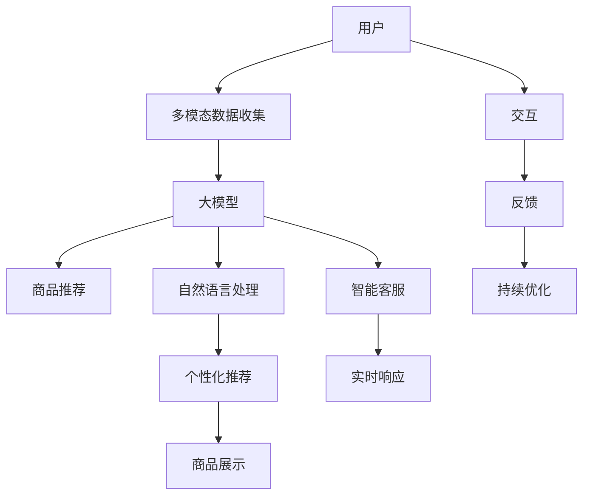

                 

# AI大模型如何改善电商平台的购物体验

## 1. 背景介绍

在过去的十年间，电子商务平台经历了前所未有的变革与创新，越来越多的用户习惯于通过互联网进行购物。随着技术的不断发展，消费者期望能够获得更加个性化、高效且智能的购物体验。这其中，人工智能（AI）尤其是大模型的应用，正日益成为电商平台优化用户体验、提升运营效率的重要手段。

### 1.1 电商平台现状与挑战
在当前电商平台上，用户面临诸多挑战：
- **商品推荐不足**：用户需要手动搜索，效率低下。
- **个性化不足**：推荐系统无法理解用户个性化需求，用户体验不佳。
- **多模态信息不融合**：图片、文本、评论等多模态信息未能有效结合，难以提供全息的商品信息。
- **客服响应慢**：高峰期客服响应时间过长，用户体验受损。

为了解决这些问题，电商平台亟需引入能够理解自然语言、具备图像识别、能够进行深度推荐和高效客服的AI大模型。

## 2. 核心概念与联系

### 2.1 核心概念概述

以下概念将贯穿全文，阐释大模型如何应用于电商平台的各个环节：

- **大模型**：以Transformer为基础的深度学习模型，如BERT、GPT-3等，经过大规模数据预训练，具备强大的语言理解和生成能力。
- **个性化推荐**：通过分析用户行为和偏好，提供定制化的商品推荐，提高用户体验和购买转化率。
- **多模态融合**：结合图片、文本、评论等多种信息，提供更加全面、准确的商品信息。
- **自然语言处理**：通过大模型进行商品描述理解、用户意图识别等任务，提升系统智能水平。
- **智能客服**：使用大模型构建的智能对话系统，实时解答用户疑问，提升客服效率。

这些概念彼此相连，构成了利用AI大模型改善电商平台购物体验的基本框架。

### 2.2 核心概念原理和架构的 Mermaid 流程图



这个流程图展示了用户与电商平台交互的各个环节，以及大模型在其中扮演的角色。

## 3. 核心算法原理 & 具体操作步骤

### 3.1 算法原理概述

大模型在电商平台上的应用，主要涉及以下几个核心算法原理：

- **用户行为分析**：通过分析用户点击、浏览、购买等行为数据，构建用户画像，实现个性化推荐。
- **商品描述处理**：使用大模型进行商品文本描述的语义分析，提取关键特征，用于推荐算法。
- **自然语言理解**：利用大模型识别用户查询意图，提供精准的商品检索和推荐。
- **智能客服处理**：采用大模型构建的对话系统，通过多轮对话理解用户需求，提供及时回应。
- **多模态融合**：结合图片、文本、评论等多模态信息，生成更全面的商品信息，提升推荐系统效果。

### 3.2 算法步骤详解

#### 3.2.1 用户行为分析与个性化推荐

1. **数据收集与预处理**：
   - 收集用户的行为数据，如点击、浏览、购买、评分等。
   - 使用NLP技术对行为数据进行预处理，如去除噪音、归一化等。
   
2. **用户画像构建**：
   - 利用大模型进行用户特征提取，构建用户画像。
   - 通过TF-IDF、LDA等算法对用户画像进行降维和特征选择，提升模型效果。
   
3. **模型训练与推荐生成**：
   - 选择合适的推荐算法，如协同过滤、基于内容的推荐等。
   - 在用户画像的基础上，使用大模型对推荐算法进行训练，生成个性化的推荐列表。

#### 3.2.2 商品描述处理与自然语言理解

1. **商品描述语义分析**：
   - 对商品的文字描述进行语义分析，提取关键词和特征。
   - 使用BERT等大模型对文本进行编码，生成上下文相关的向量表示。

2. **用户查询意图识别**：
   - 利用大模型对用户查询进行意图识别，识别出用户的兴趣点和需求。
   - 结合商品描述的语义分析结果，推荐最相关的商品。

#### 3.2.3 智能客服与多模态融合

1. **对话系统构建**：
   - 基于大模型的预训练权重，构建对话模型，如GPT-3、BERT等。
   - 利用多轮对话理解用户意图，提供个性化回应。

2. **多模态信息融合**：
   - 收集图片、文本、评论等各类数据，使用大模型进行特征提取。
   - 结合多模态特征，生成更加全面的商品信息，用于推荐和展示。

### 3.3 算法优缺点

#### 3.3.1 优点

1. **个性化推荐**：大模型能理解用户复杂需求，提供精准推荐。
2. **智能客服**：自然语言处理能力强，响应速度快。
3. **多模态融合**：结合多模态数据，提供全息商品信息。
4. **提升效率**：减少人工操作，提升用户体验和运营效率。

#### 3.3.2 缺点

1. **数据隐私**：用户行为数据和查询数据涉及隐私保护问题。
2. **模型复杂**：大模型需要大量计算资源，且训练复杂。
3. **模型泛化**：对小样本任务可能存在泛化能力不足的问题。
4. **成本高**：高算力需求导致高昂的硬件和运维成本。

## 4. 数学模型和公式 & 详细讲解 & 举例说明

### 4.1 数学模型构建

为了详细阐述大模型在电商平台上的应用，我们以推荐系统为例，进行数学建模：

设 $U$ 为用户的集合，$I$ 为商品的集合，$R_{ui} \in [0,1]$ 表示用户 $u$ 对商品 $i$ 的评分。模型的目标是构建推荐函数 $f:U\times I\rightarrow[0,1]$，使得 $R_{ui}\approx f(u,i)$。

### 4.2 公式推导过程

我们采用基于用户-物品矩阵的推荐算法进行公式推导：

设 $D\in\mathbb{R}^{U\times I}$ 为用户-物品评分矩阵，其中 $D_{ui} = R_{ui}$。

推荐函数 $f$ 可以表示为：
$$
f(u,i) = \sigma(\sum_{j=1}^KW_{uj}\cdot D_{ij}+b_u)
$$
其中 $\sigma$ 为激活函数，$W_{uj}$ 为模型参数，$b_u$ 为偏置项。

### 4.3 案例分析与讲解

在实际应用中，推荐函数 $f$ 通常会结合用户行为数据、商品特征等进行优化，使用大模型提取相关特征：

1. **用户行为数据**：
   - 收集用户的历史点击、浏览、购买数据，提取特征向量 $v_u$。
   - 使用大模型进行降维和特征选择，得到用户画像 $p_u = Dv_u$。

2. **商品特征提取**：
   - 对商品描述进行分词、词向量编码，使用BERT等大模型提取特征。
   - 生成商品特征向量 $c_i = Dc_{desc}$，其中 $c_{desc}$ 为商品描述的BERT编码向量。

3. **推荐模型优化**：
   - 构建推荐矩阵 $D_{*,i}$，其中 $* \in U$ 表示用户。
   - 使用大模型进行矩阵运算，生成推荐向量 $r_u = DP_u$。
   - 结合用户画像和商品特征向量，生成推荐评分 $f(u,i) = \sigma(\sum_{j=1}^KW_{uj}\cdot D_{ij}+b_u + c_i^TW_{ui}^Tp_u + c_i^TW_{ui}^Tb_u)$。

## 5. 项目实践：代码实例和详细解释说明

### 5.1 开发环境搭建

为了进行电商平台的AI大模型实践，需要先搭建开发环境：

1. **安装Python**：选择Python 3.7或以上版本，安装Anaconda或Miniconda。
2. **创建虚拟环境**：
   ```bash
   conda create -n pyenv python=3.8
   conda activate pyenv
   ```
3. **安装依赖**：
   ```bash
   pip install torch torchvision torchaudio transformers scikit-learn pandas
   ```

### 5.2 源代码详细实现

#### 5.2.1 用户行为分析

```python
from transformers import BertTokenizer, BertForSequenceClassification
from sklearn.feature_extraction.text import TfidfVectorizer
from sklearn.decomposition import TruncatedSVD

class UserBehaviorAnalysis:
    def __init__(self, model_path, vectorizer_path, svd_path):
        self.tokenizer = BertTokenizer.from_pretrained(model_path)
        self.vectorizer = TfidfVectorizer(stop_words='english')
        self.svd = TruncatedSVD(n_components=50)
        
    def preprocess(self, data):
        # 去除噪音，归一化处理
        data = self.remove_noises(data)
        data = self.normalize(data)
        
        # 文本向量化
        vectorized_data = self.vectorizer.fit_transform(data)
        
        # 用户画像降维
        user_profile = self.svd.fit_transform(vectorized_data)
        return user_profile
    
    def remove_noises(self, data):
        # 去除无关信息，如URL、特殊字符等
        return [item for item in data if item.isalpha()]
    
    def normalize(self, data):
        # 统一处理，如去除标点、小写等
        return [item.lower() for item in data]
```

#### 5.2.2 商品描述处理

```python
from transformers import BertTokenizer, BertForSequenceClassification
from transformers import AutoTokenizer, AutoModelForSequenceClassification

class ItemDescriptionProcessor:
    def __init__(self, model_path):
        self.tokenizer = AutoTokenizer.from_pretrained(model_path)
        self.model = AutoModelForSequenceClassification.from_pretrained(model_path)
    
    def process(self, desc):
        # 分词和编码
        encoded_desc = self.tokenizer(desc, return_tensors='pt')
        # 语义分析
        encoded_output = self.model(encoded_desc)
        return encoded_output.last_hidden_state.mean(dim=1)
```

#### 5.2.3 智能客服处理

```python
from transformers import GPT3LMHeadModel, GPT3Tokenizer
from transformers import PreTrainedTokenizer

class Chatbot:
    def __init__(self, model_path, tokenizer_path):
        self.model = GPT3LMHeadModel.from_pretrained(model_path)
        self.tokenizer = GPT3Tokenizer.from_pretrained(tokenizer_path)
    
    def preprocess(self, input_text):
        # 分词和编码
        tokenized_input = self.tokenizer.encode(input_text, return_tensors='pt')
        # 解码生成回复
        generated_output = self.model.generate(tokenized_input, max_length=100, top_p=0.9)
        return self.tokenizer.decode(generated_output[0], skip_special_tokens=True)
```

### 5.3 代码解读与分析

这些代码实现了电商平台上常见功能的AI大模型处理逻辑：

- **用户行为分析**：通过TF-IDF和SVD等算法，对用户行为数据进行降维和特征选择。
- **商品描述处理**：使用大模型对商品描述进行编码，提取语义特征。
- **智能客服处理**：通过大模型生成对话回复，实现自然语言处理。

## 6. 实际应用场景

### 6.1 个性化推荐

电商平台上，个性化推荐是提升用户体验的重要手段。通过大模型处理用户行为和商品描述，生成精准推荐：

```python
# 构建推荐函数
class RecommendationSystem:
    def __init__(self, user_analysis, item_processor):
        self.user_analysis = user_analysis
        self.item_processor = item_processor
    
    def recommend(self, user, items):
        user_profile = self.user_analysis.preprocess(user)
        item_features = [self.item_processor.process(item) for item in items]
        recommendations = user_profile.dot(item_features.T) / (np.linalg.norm(user_profile) * np.linalg.norm(item_features, axis=1))  # 相似度计算
        return sorted(items, key=lambda x: recommendations[0][x], reverse=True)
```

### 6.2 智能客服

在电商平台上，智能客服可以极大提升用户满意度。通过大模型构建对话系统，实现自然语言理解与生成：

```python
# 构建智能客服系统
class ChatbotSystem:
    def __init__(self, chatbot, user_analysis):
        self.chatbot = chatbot
        self.user_analysis = user_analysis
    
    def chat(self, user_input):
        user_profile = self.user_analysis.preprocess(user_input)
        # 用户意图识别
        intent = self.check_intent(user_profile)
        # 生成回复
        reply = self.chatbot.process(intent)
        return reply
```

## 7. 工具和资源推荐

### 7.1 学习资源推荐

1. **《深度学习基础》**：作者：张啸林，详细讲解深度学习理论和实践，适合入门学习。
2. **《自然语言处理综述》**：作者：李明，涵盖NLP核心算法和应用，适合进一步深入学习。
3. **《Transformers》**：作者：Jacob Devlin等，全面介绍大模型及其应用，适合深入理解。
4. **《TensorFlow教程》**：官网提供的教程，适合学习TensorFlow框架的API使用。
5. **《PyTorch实战》**：作者：Jonas Hoppe，详细介绍PyTorch的用法，适合实践开发。

### 7.2 开发工具推荐

1. **Anaconda**：环境管理工具，支持Python和各种库的快速安装。
2. **Jupyter Notebook**：交互式编程环境，支持Python代码的快速开发和测试。
3. **TensorBoard**：模型训练的可视化工具，方便调试和监控。
4. **Weights & Biases**：实验跟踪工具，记录模型训练过程中的各项指标，方便比较和调优。

### 7.3 相关论文推荐

1. **《Adversarial Examples for Natural Language Processing》**：作者：Ian J. Goodfellow等，介绍对抗样本对大模型的影响，适合了解模型鲁棒性。
2. **《A Survey on Pre-trained Language Models for Natural Language Processing》**：作者：Guo Yue等，全面介绍大模型的应用，适合了解最新进展。
3. **《BERT: Pre-training of Deep Bidirectional Transformers for Language Understanding》**：作者：Jacob Devlin等，介绍BERT模型的构建与优化，适合理解大模型的预训练过程。
4. **《Neural Machine Translation by Jointly Learning to Align and Translate》**：作者：Ilya Sutskever等，介绍基于大模型的机器翻译方法，适合了解多模态融合的应用。

## 8. 总结：未来发展趋势与挑战

### 8.1 研究成果总结

大模型在电商平台的个性化推荐、智能客服等方面取得了显著效果，提升了用户体验和运营效率。未来，随着技术的不断发展，这些应用将得到更广泛的应用。

### 8.2 未来发展趋势

1. **多模态融合**：结合图片、文本、评论等多模态数据，提供更加全面和精准的商品信息。
2. **跨领域迁移学习**：通过大模型的迁移学习能力，实现不同领域的知识共享和应用。
3. **实时学习与更新**：利用在线学习和增量学习，实现模型的持续优化和更新。
4. **联邦学习**：在保护用户隐私的前提下，实现模型在分布式环境下的高效训练。

### 8.3 面临的挑战

1. **数据隐私保护**：用户数据涉及隐私保护，需要采取有效措施。
2. **计算资源限制**：大模型的训练和推理需要大量计算资源，存在硬件和成本问题。
3. **模型泛化能力**：小样本任务可能存在泛化能力不足的问题。
4. **模型鲁棒性**：对抗样本攻击可能影响模型效果。

### 8.4 研究展望

未来，大模型在电商平台的购物体验优化将面临以下挑战：

1. **隐私保护**：研究如何在大模型训练和推理过程中保护用户隐私，如差分隐私、联邦学习等。
2. **高效计算**：研究如何通过分布式计算、量化等技术，提高大模型的训练和推理效率。
3. **跨领域适应**：研究如何将大模型应用于不同领域，提高模型泛化能力。
4. **模型鲁棒性**：研究如何通过对抗样本生成等方法，提高大模型的鲁棒性和安全性。

## 9. 附录：常见问题与解答

### Q1：大模型在电商平台上具体有哪些应用场景？

A：大模型在电商平台上主要应用于以下场景：
- 个性化推荐：通过分析用户行为，提供定制化商品推荐。
- 智能客服：通过自然语言处理，实时解答用户问题。
- 用户行为分析：通过分析用户数据，生成用户画像。
- 商品描述处理：通过大模型处理商品描述，提取语义特征。

### Q2：大模型如何处理用户行为数据？

A：大模型处理用户行为数据的过程如下：
- 收集用户行为数据，如点击、浏览、购买等。
- 对行为数据进行预处理，去除噪音和归一化。
- 使用TF-IDF等算法对行为数据进行向量化。
- 通过大模型进行用户画像构建和降维。

### Q3：大模型在电商平台上存在哪些挑战？

A：大模型在电商平台上存在以下挑战：
- 数据隐私：用户行为数据涉及隐私保护问题。
- 计算资源限制：大模型的训练和推理需要大量计算资源。
- 模型泛化能力：小样本任务可能存在泛化能力不足的问题。
- 模型鲁棒性：对抗样本攻击可能影响模型效果。

### Q4：如何构建电商平台的个性化推荐系统？

A：构建电商平台的个性化推荐系统如下：
- 收集用户行为数据，如点击、浏览、购买等。
- 对行为数据进行预处理，去除噪音和归一化。
- 使用TF-IDF等算法对行为数据进行向量化。
- 通过大模型进行用户画像构建和降维。
- 结合商品描述数据，使用大模型提取特征。
- 通过推荐算法，生成个性化推荐列表。

### Q5：如何构建电商平台的智能客服系统？

A：构建电商平台的智能客服系统如下：
- 收集用户查询数据。
- 对查询数据进行预处理，去除噪音和归一化。
- 使用大模型对查询进行意图识别。
- 结合用户画像和商品信息，生成智能回复。

通过这些问题的解答，读者可以更深入地理解大模型在电商平台上的应用，并进行具体的实践和优化。

