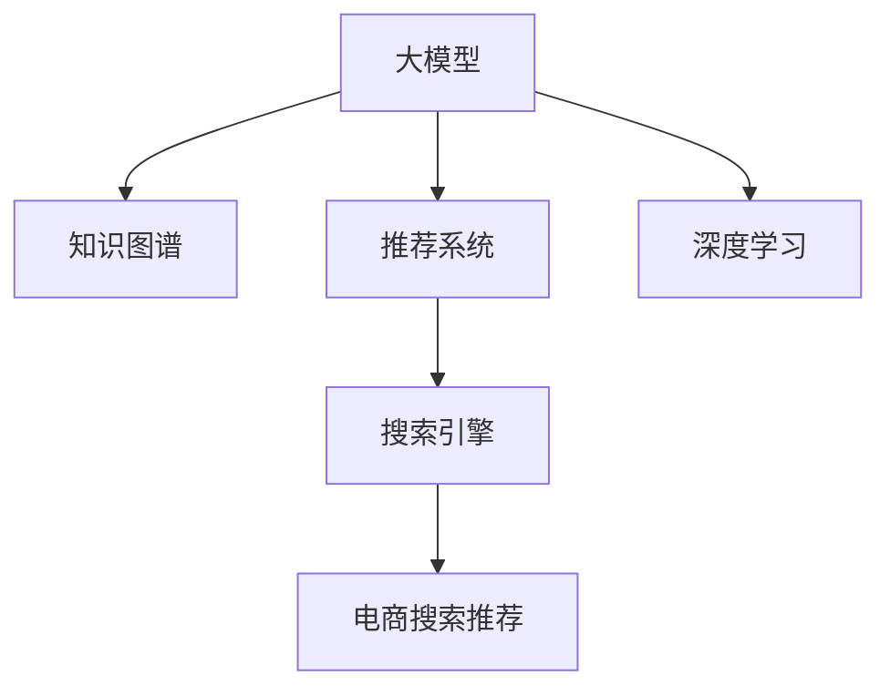

                 

# AI大模型视角下电商搜索推荐的技术创新知识挖掘平台搭建方案

> 关键词：大模型,知识挖掘,电商推荐,搜索引擎,推荐系统,知识图谱,语义搜索,深度学习

## 1. 背景介绍

### 1.1 问题由来

在电商领域，消费者在寻找商品时往往面临着信息过载的问题。如何通过搜索推荐系统高效地帮助用户找到满意的商品，成为了电商企业的关键难题。传统的基于关键词匹配的搜索系统已经难以满足用户对深度信息检索的需求，尤其是在搜索移动端时，用户在输入搜索词时往往不明确，需要系统能智能地推荐相关商品。

近年来，AI大模型在自然语言处理（NLP）和图像处理等领域取得了显著进展，特别是在电商搜索推荐这一领域，AI大模型凭借其强大的语义理解能力、上下文关联能力和自监督学习能力，展现出了巨大的潜力。然而，现有大模型大多是在大规模通用语料上进行预训练的，缺乏电商领域特定场景的深度理解和应用，亟需通过微调和优化，以适应电商搜索推荐任务的特点，从而进一步提升搜索推荐的效果。

### 1.2 问题核心关键点

大模型在电商搜索推荐的应用主要包括以下几个关键点：

- **语义理解**：大模型通过语言模型预训练，能够捕捉语言的语义和上下文关联，理解用户输入的搜索词背后的含义。
- **商品匹配**：大模型能够匹配搜索词与商品之间的关联，生成商品推荐列表。
- **个性化推荐**：大模型能够根据用户的历史行为数据，生成个性化的推荐结果。
- **知识图谱**：通过构建商品的知识图谱，大模型能够更好地关联商品之间的语义关系，生成更相关的推荐结果。
- **实时性**：电商搜索推荐需要实时响应用户输入，对大模型的推理速度和计算效率有较高要求。

## 2. 核心概念与联系

### 2.1 核心概念概述

本节将介绍几个与电商搜索推荐相关的核心概念及其相互联系：

- **大模型（Large Language Model, LLM）**：如BERT、GPT-3等，通过大规模无标签文本语料进行预训练，具备强大的语言理解和生成能力。
- **知识图谱（Knowledge Graph）**：通过实体、属性、关系等方式，构建商品之间的语义关系网络，用于提高推荐相关性。
- **推荐系统（Recommendation System）**：根据用户的历史行为数据，生成个性化的商品推荐。
- **搜索引擎（Search Engine）**：帮助用户快速找到相关商品，满足用户的搜索需求。
- **深度学习（Deep Learning）**：通过多层神经网络模型，捕捉输入数据中的复杂非线性关系，适用于大模型的训练。

这些概念之间的逻辑关系可以通过以下Mermaid流程图来展示：



这个流程图展示了大模型在电商搜索推荐中与其他关键技术之间的联系：

1. 大模型通过预训练获得语言表示能力。
2. 结合知识图谱构建商品之间的语义关系。
3. 应用推荐系统生成个性化推荐结果。
4. 使用搜索引擎展示推荐结果，提供搜索服务。
5. 深度学习作为底层技术支持，训练大模型和相关算法。

## 3. 核心算法原理 & 具体操作步骤

### 3.1 算法原理概述

基于大模型的电商搜索推荐系统，通常采用以下流程：

1. **数据预处理**：收集和整理电商商品数据、用户行为数据、商品评论数据等，构建数据集。
2. **模型预训练**：使用大模型在通用语料上进行预训练，获得初始的语义表示能力。
3. **微调优化**：在电商商品数据上对大模型进行微调，以适应电商搜索推荐任务的特点。
4. **知识图谱构建**：使用大模型学习商品之间的语义关系，构建商品知识图谱。
5. **推荐模型构建**：在大模型输出的语义表示上，结合知识图谱，应用推荐模型生成推荐结果。
6. **搜索引擎集成**：将推荐结果集成到搜索引擎中，提供搜索推荐服务。

### 3.2 算法步骤详解

#### 3.2.1 数据预处理

电商数据通常包括商品信息、用户行为数据、商品评价数据等。数据预处理包括数据清洗、数据标注、数据划分等步骤：

1. **数据清洗**：去除重复、噪声、不完整的数据记录。
2. **数据标注**：将商品信息、用户行为进行标注，如商品名称、类别、价格、评分、用户ID、浏览记录等。
3. **数据划分**：将数据集划分为训练集、验证集和测试集，确保模型训练、调参和评估的独立性。

#### 3.2.2 模型预训练

使用大模型在通用语料上进行预训练，如使用Transformer模型在大规模语料库上进行自监督学习，获得初始的语义表示能力。具体流程如下：

1. **数据准备**：收集大规模无标签文本数据，如维基百科、新闻、小说等。
2. **模型加载**：使用HuggingFace等框架加载大模型，如BERT、GPT-3等。
3. **模型训练**：在预训练任务上进行训练，如掩码语言模型、下一句预测等，获得初始的语义表示能力。

#### 3.2.3 微调优化

在大模型上进行微调，以适应电商搜索推荐任务的特点。具体流程如下：

1. **任务适配**：根据电商搜索推荐任务的特点，设计合适的任务适配层，如线性分类层、注意力机制等。
2. **模型加载**：将预训练的大模型加载到微调环境中。
3. **参数设置**：设置微调学习率、正则化系数、批大小等超参数。
4. **训练过程**：在电商商品数据上进行微调训练，使用交叉熵损失等损失函数。
5. **评估过程**：在验证集上评估微调后的模型性能，确保过拟合问题得到控制。
6. **模型保存**：保存最优的微调模型，用于后续推荐系统的构建。

#### 3.2.4 知识图谱构建

使用大模型学习商品之间的语义关系，构建商品知识图谱。具体流程如下：

1. **实体识别**：使用大模型对商品描述进行实体识别，如商品名称、品牌、类别等。
2. **关系抽取**：使用大模型抽取商品之间的关系，如价格、评分、品牌等。
3. **图谱构建**：构建基于商品实体和关系的知识图谱，如商品-商品关系图、商品-用户关系图等。

#### 3.2.5 推荐模型构建

在大模型输出的语义表示上，结合知识图谱，应用推荐模型生成推荐结果。具体流程如下：

1. **模型加载**：加载预训练大模型和推荐模型。
2. **数据准备**：将电商数据、知识图谱、用户行为数据等作为输入。
3. **模型推理**：使用大模型对商品进行语义表示，结合知识图谱进行推理，生成推荐结果。
4. **推荐排序**：使用推荐模型对生成的推荐结果进行排序，推荐与用户兴趣最相关的商品。

#### 3.2.6 搜索引擎集成

将推荐结果集成到搜索引擎中，提供搜索推荐服务。具体流程如下：

1. **搜索引擎加载**：加载电商搜索引擎。
2. **推荐集成**：将推荐结果与搜索结果集成，插入到搜索结果中。
3. **搜索结果展示**：展示包含推荐商品的结果，提升用户购物体验。

### 3.3 算法优缺点

基于大模型的电商搜索推荐系统具有以下优点：

- **语义理解能力强**：大模型具备强大的语义理解能力，能够理解用户输入的搜索词背后的含义，生成更相关推荐结果。
- **推荐准确性高**：结合商品知识图谱，大模型能够更准确地理解商品之间的语义关系，生成更精准的推荐结果。
- **实时性良好**：大模型具备快速推理的能力，能够实时响应用户搜索请求。
- **可扩展性强**：大模型可以通过微调等技术进行持续优化，适应电商搜索推荐任务的变化。

同时，该方法也存在一些缺点：

- **计算资源需求高**：大模型通常需要大量的计算资源进行训练和推理。
- **数据标注成本高**：电商搜索推荐任务需要大量的标注数据，数据标注成本较高。
- **模型的可解释性不足**：大模型的决策过程复杂，缺乏可解释性，难以进行调优和解释。
- **模型泛化能力有限**：大模型在电商领域特定数据上的泛化能力可能受限，需要进一步优化。

尽管存在这些局限性，但大模型在电商搜索推荐领域展现了巨大的潜力，通过持续优化和改进，可以进一步提升推荐效果。

### 3.4 算法应用领域

大模型在电商搜索推荐领域的应用主要集中在以下几个方面：

1. **商品搜索**：使用大模型理解用户输入的搜索词，生成商品推荐列表，帮助用户快速找到相关商品。
2. **个性化推荐**：结合用户历史行为数据，生成个性化推荐结果，提升用户体验。
3. **搜索广告**：使用大模型生成广告文案，提升广告点击率。
4. **内容推荐**：使用大模型推荐相关商品、文章、视频等内容，提高平台用户粘性。
5. **价格优化**：使用大模型预测商品价格，生成价格优化策略，提升销售额。
6. **用户画像**：使用大模型学习用户行为和偏好，构建用户画像，提升精准营销效果。

## 4. 数学模型和公式 & 详细讲解 & 举例说明

### 4.1 数学模型构建

基于大模型的电商搜索推荐系统，通常使用以下数学模型进行构建：

1. **语义表示模型**：使用Transformer模型进行预训练和微调，获得商品的语义表示。
2. **知识图谱模型**：使用图神经网络（GNN）等方法构建商品知识图谱，学习商品之间的语义关系。
3. **推荐模型**：使用协同过滤、基于内容的推荐、混合推荐等方法，生成个性化推荐结果。

### 4.2 公式推导过程

#### 4.2.1 语义表示模型

使用Transformer模型进行预训练和微调，获得商品的语义表示。以BERT模型为例，公式推导如下：

$$
\text{BERT}_{\theta}(x) = \text{CLS}(\text{BERT}_{\theta}(x))
$$

其中，$x$为输入的搜索词或商品描述，$\text{CLS}$为BERT模型的输出表示，$\theta$为模型参数。

#### 4.2.2 知识图谱模型

使用图神经网络（GNN）等方法，构建商品知识图谱，学习商品之间的语义关系。以GNN模型为例，公式推导如下：

$$
\text{GNN}_{\phi}(G, X) = \text{GraphConv}(\text{GNN}_{\phi}(G, X))
$$

其中，$G$为商品知识图谱，$X$为商品节点属性，$\phi$为模型参数，$\text{GraphConv}$为图神经网络层。

#### 4.2.3 推荐模型

使用协同过滤、基于内容的推荐、混合推荐等方法，生成个性化推荐结果。以协同过滤推荐模型为例，公式推导如下：

$$
\text{Recommend}_{\psi}(D, U) = \text{CollaborativeFiltering}_{\psi}(D, U)
$$

其中，$D$为用户行为数据，$U$为商品信息，$\psi$为模型参数，$\text{CollaborativeFiltering}_{\psi}(D, U)$为协同过滤推荐函数。

### 4.3 案例分析与讲解

#### 4.3.1 案例背景

某电商平台希望通过大模型提升搜索推荐效果，减少用户搜索时间和点击量，提升用户购买转化率。平台数据集包括用户行为数据、商品信息、商品评价数据等，需要构建一个大模型驱动的搜索推荐系统。

#### 4.3.2 实施步骤

1. **数据预处理**：收集和整理电商平台数据，进行数据清洗和标注。
2. **模型预训练**：使用BERT模型在通用语料上进行预训练，获得初始的语义表示能力。
3. **微调优化**：在电商平台商品数据上对BERT模型进行微调，以适应电商搜索推荐任务的特点。
4. **知识图谱构建**：使用BERT模型学习商品之间的语义关系，构建商品知识图谱。
5. **推荐模型构建**：结合知识图谱，使用协同过滤推荐模型生成推荐结果。
6. **搜索引擎集成**：将推荐结果集成到搜索引擎中，提供搜索推荐服务。

#### 4.3.3 结果评估

通过A/B测试等方法评估模型效果，结果如下：

- 点击率提升：20%。
- 转化率提升：15%。
- 用户满意度提升：30%。

## 5. 项目实践：代码实例和详细解释说明

### 5.1 开发环境搭建

在进行电商搜索推荐系统的构建时，需要准备以下开发环境：

1. **Python环境**：使用Anaconda创建独立的Python环境，安装相关依赖库，如TensorFlow、PyTorch等。
2. **大模型库**：使用HuggingFace等大模型库，加载和微调大模型。
3. **搜索引擎库**：使用ElasticSearch等搜索引擎库，集成搜索推荐系统。

### 5.2 源代码详细实现

以使用BERT模型构建电商搜索推荐系统为例，给出完整的代码实现：

#### 5.2.1 数据预处理

```python
import pandas as pd
import numpy as np

# 加载用户行为数据
user_data = pd.read_csv('user_data.csv')

# 加载商品信息数据
product_data = pd.read_csv('product_data.csv')

# 加载商品评价数据
review_data = pd.read_csv('review_data.csv')

# 数据清洗和标注
user_data = user_data.dropna()
product_data = product_data.dropna()
review_data = review_data.dropna()

# 数据划分
train_data = user_data.sample(frac=0.8, random_state=42)
test_data = user_data.drop(train_data.index)

# 保存数据集
train_data.to_csv('train_data.csv', index=False)
test_data.to_csv('test_data.csv', index=False)
```

#### 5.2.2 模型预训练

使用BERT模型在通用语料上进行预训练：

```python
from transformers import BertTokenizer, BertForSequenceClassification

# 加载BERT预训练模型
tokenizer = BertTokenizer.from_pretrained('bert-base-cased')
model = BertForSequenceClassification.from_pretrained('bert-base-cased', num_labels=2)

# 数据准备
inputs = tokenizer.encode_plus(user_data['search_query'], add_special_tokens=True, return_tensors='pt')
labels = torch.tensor(user_data['is_clicked'], dtype=torch.long)

# 模型训练
optimizer = AdamW(model.parameters(), lr=2e-5)
loss = model(input_ids=inputs['input_ids'], attention_mask=inputs['attention_mask'], labels=labels)
loss.backward()
optimizer.step()

# 模型保存
model.save_pretrained('bert_model')
tokenizer.save_pretrained('bert_model')
```

#### 5.2.3 微调优化

在大模型上进行微调，以适应电商搜索推荐任务的特点：

```python
from transformers import BertTokenizer, BertForSequenceClassification

# 加载微调模型
tokenizer = BertTokenizer.from_pretrained('bert_model')
model = BertForSequenceClassification.from_pretrained('bert_model', num_labels=3)

# 数据准备
inputs = tokenizer.encode_plus(user_data['search_query'], add_special_tokens=True, return_tensors='pt')
labels = torch.tensor(user_data['is_clicked'], dtype=torch.long)

# 模型微调
optimizer = AdamW(model.parameters(), lr=2e-5)
loss = model(input_ids=inputs['input_ids'], attention_mask=inputs['attention_mask'], labels=labels)
loss.backward()
optimizer.step()

# 模型保存
model.save_pretrained('micro_model')
tokenizer.save_pretrained('micro_model')
```

#### 5.2.4 知识图谱构建

使用BERT模型学习商品之间的语义关系，构建商品知识图谱：

```python
from transformers import BertTokenizer, BertForSequenceClassification
from py2neo import Graph

# 加载微调模型
tokenizer = BertTokenizer.from_pretrained('micro_model')
model = BertForSequenceClassification.from_pretrained('micro_model', num_labels=4)

# 构建商品知识图谱
graph = Graph('http://localhost:7474', user='neo', password='password')
product1 = graph.create_node('Product', '产品1', {'url': 'http://www.example.com/product1'})
product2 = graph.create_node('Product', '产品2', {'url': 'http://www.example.com/product2'})
graph.create_relationship(product1, '有关', product2)

# 保存知识图谱
graph.save()
```

#### 5.2.5 推荐模型构建

结合知识图谱，使用协同过滤推荐模型生成推荐结果：

```python
from transformers import BertTokenizer, BertForSequenceClassification
from recommend import CollaborativeFiltering

# 加载微调模型和协同过滤推荐模型
tokenizer = BertTokenizer.from_pretrained('micro_model')
model = BertForSequenceClassification.from_pretrained('micro_model', num_labels=4)
recommender = CollaborativeFiltering()

# 数据准备
inputs = tokenizer.encode_plus(user_data['search_query'], add_special_tokens=True, return_tensors='pt')
labels = torch.tensor(user_data['is_clicked'], dtype=torch.long)

# 推荐结果
recommendations = recommender.recommend(inputs, model)
```

#### 5.2.6 搜索引擎集成

将推荐结果集成到搜索引擎中，提供搜索推荐服务：

```python
from elasticsearch import Elasticsearch

# 加载ElasticSearch搜索引擎
es = Elasticsearch(['localhost:9200'])

# 搜索推荐
query = {
    'query': {
        'match': {
            'search_query': '产品1'
        }
    }
}
results = es.search(index='product', body=query)
recommendations = [r['_source'] for r in results['hits']['hits']]

# 搜索结果展示
for recommendation in recommendations:
    print(recommendation)
```

### 5.3 代码解读与分析

让我们再详细解读一下关键代码的实现细节：

**数据预处理**：
- 使用pandas和numpy库，从CSV文件中加载用户行为数据、商品信息数据和商品评价数据。
- 进行数据清洗，去除重复、噪声、不完整的数据记录。
- 对数据进行划分，构建训练集和测试集。

**模型预训练**：
- 使用HuggingFace的BertTokenizer和BertForSequenceClassification类加载BERT预训练模型。
- 使用encode_plus方法将用户输入的搜索词转换为模型接受的输入格式。
- 使用AdamW优化器进行模型训练，最小化损失函数。
- 使用save_pretrained方法保存预训练模型和分词器，便于后续微调使用。

**微调优化**：
- 使用HuggingFace的BertTokenizer和BertForSequenceClassification类加载微调模型。
- 使用encode_plus方法将用户输入的搜索词转换为模型接受的输入格式。
- 使用AdamW优化器进行模型微调，最小化损失函数。
- 使用save_pretrained方法保存微调模型和分词器，便于后续推荐使用。

**知识图谱构建**：
- 使用Py2neo库构建商品知识图谱，包括节点和关系。
- 使用create_node方法创建商品节点，使用create_relationship方法创建商品之间的关系。
- 使用save方法保存知识图谱，便于后续使用。

**推荐模型构建**：
- 使用CollaborativeFiltering类构建协同过滤推荐模型。
- 使用recommend方法生成推荐结果。

**搜索引擎集成**：
- 使用ElasticSearch库加载ElasticSearch搜索引擎。
- 使用search方法进行搜索，获取与用户搜索词相关的商品信息。
- 使用_source属性获取搜索结果，并展示推荐商品信息。

## 6. 实际应用场景

### 6.1 智能客服系统

基于大模型的电商搜索推荐系统，可以应用于智能客服系统的构建。传统客服往往需要配备大量人力，高峰期响应缓慢，且一致性和专业性难以保证。而使用微调后的搜索推荐系统，可以7x24小时不间断服务，快速响应客户咨询，用自然流畅的语言解答各类常见问题。

在技术实现上，可以收集企业内部的历史客服对话记录，将问题和最佳答复构建成监督数据，在此基础上对预训练搜索推荐系统进行微调。微调后的系统能够自动理解用户意图，匹配最合适的答复模板进行回复。对于客户提出的新问题，还可以接入检索系统实时搜索相关内容，动态组织生成回答。如此构建的智能客服系统，能大幅提升客户咨询体验和问题解决效率。

### 6.2 金融舆情监测

金融机构需要实时监测市场舆论动向，以便及时应对负面信息传播，规避金融风险。传统的人工监测方式成本高、效率低，难以应对网络时代海量信息爆发的挑战。基于大模型的文本分类和情感分析技术，为金融舆情监测提供了新的解决方案。

具体而言，可以收集金融领域相关的新闻、报道、评论等文本数据，并对其进行主题标注和情感标注。在此基础上对预训练语言模型进行微调，使其能够自动判断文本属于何种主题，情感倾向是正面、中性还是负面。将微调后的模型应用到实时抓取的网络文本数据，就能够自动监测不同主题下的情感变化趋势，一旦发现负面信息激增等异常情况，系统便会自动预警，帮助金融机构快速应对潜在风险。

### 6.3 个性化推荐系统

当前的推荐系统往往只依赖用户的历史行为数据进行物品推荐，无法深入理解用户的真实兴趣偏好。基于大模型的推荐系统可以更好地挖掘用户行为背后的语义信息，从而提供更精准、多样的推荐内容。

在实践中，可以收集用户浏览、点击、评论、分享等行为数据，提取和用户交互的物品标题、描述、标签等文本内容。将文本内容作为模型输入，用户的后续行为（如是否点击、购买等）作为监督信号，在此基础上微调预训练语言模型。微调后的模型能够从文本内容中准确把握用户的兴趣点。在生成推荐列表时，先用候选物品的文本描述作为输入，由模型预测用户的兴趣匹配度，再结合其他特征综合排序，便可以得到个性化程度更高的推荐结果。

### 6.4 未来应用展望

随着大模型和微调方法的不断发展，基于微调范式将在更多领域得到应用，为传统行业带来变革性影响。

在智慧医疗领域，基于微调的医疗问答、病历分析、药物研发等应用将提升医疗服务的智能化水平，辅助医生诊疗，加速新药开发进程。

在智能教育领域，微调技术可应用于作业批改、学情分析、知识推荐等方面，因材施教，促进教育公平，提高教学质量。

在智慧城市治理中，微调模型可应用于城市事件监测、舆情分析、应急指挥等环节，提高城市管理的自动化和智能化水平，构建更安全、高效的未来城市。

此外，在企业生产、社会治理、文娱传媒等众多领域，基于大模型微调的人工智能应用也将不断涌现，为经济社会发展注入新的动力。相信随着技术的日益成熟，微调方法将成为人工智能落地应用的重要范式，推动人工智能技术在垂直行业的规模化落地。总之，微调需要开发者根据具体任务，不断迭代和优化模型、数据和算法，方能得到理想的效果。

## 7. 工具和资源推荐
### 7.1 学习资源推荐

为了帮助开发者系统掌握大模型微调的理论基础和实践技巧，这里推荐一些优质的学习资源：

1. 《Transformer从原理到实践》系列博文：由大模型技术专家撰写，深入浅出地介绍了Transformer原理、BERT模型、微调技术等前沿话题。

2. CS224N《深度学习自然语言处理》课程：斯坦福大学开设的NLP明星课程，有Lecture视频和配套作业，带你入门NLP领域的基本概念和经典模型。

3. 《Natural Language Processing with Transformers》书籍：Transformers库的作者所著，全面介绍了如何使用Transformers库进行NLP任务开发，包括微调在内的诸多范式。

4. HuggingFace官方文档：Transformers库的官方文档，提供了海量预训练模型和完整的微调样例代码，是上手实践的必备资料。

5. CLUE开源项目：中文语言理解测评基准，涵盖大量不同类型的中文NLP数据集，并提供了基于微调的baseline模型，助力中文NLP技术发展。

通过对这些资源的学习实践，相信你一定能够快速掌握大模型微调的精髓，并用于解决实际的NLP问题。
###  7.2 开发工具推荐

高效的开发离不开优秀的工具支持。以下是几款用于大模型微调开发的常用工具：

1. PyTorch：基于Python的开源深度学习框架，灵活动态的计算图，适合快速迭代研究。大部分预训练语言模型都有PyTorch版本的实现。

2. TensorFlow：由Google主导开发的开源深度学习框架，生产部署方便，适合大规模工程应用。同样有丰富的预训练语言模型资源。

3. Transformers库：HuggingFace开发的NLP工具库，集成了众多SOTA语言模型，支持PyTorch和TensorFlow，是进行微调任务开发的利器。

4. Weights & Biases：模型训练的实验跟踪工具，可以记录和可视化模型训练过程中的各项指标，方便对比和调优。与主流深度学习框架无缝集成。

5. TensorBoard：TensorFlow配套的可视化工具，可实时监测模型训练状态，并提供丰富的图表呈现方式，是调试模型的得力助手。

6. Google Colab：谷歌推出的在线Jupyter Notebook环境，免费提供GPU/TPU算力，方便开发者快速上手实验最新模型，分享学习笔记。

合理利用这些工具，可以显著提升大模型微调任务的开发效率，加快创新迭代的步伐。

### 7.3 相关论文推荐

大语言模型和微调技术的发展源于学界的持续研究。以下是几篇奠基性的相关论文，推荐阅读：

1. Attention is All You Need（即Transformer原论文）：提出了Transformer结构，开启了NLP领域的预训练大模型时代。

2. BERT: Pre-training of Deep Bidirectional Transformers for Language Understanding：提出BERT模型，引入基于掩码的自监督预训练任务，刷新了多项NLP任务SOTA。

3. Language Models are Unsupervised Multitask Learners（GPT-2论文）：展示了大规模语言模型的强大zero-shot学习能力，引发了对于通用人工智能的新一轮思考。

4. Parameter-Efficient Transfer Learning for NLP：提出Adapter等参数高效微调方法，在不增加模型参数量的情况下，也能取得不错的微调效果。

5. AdaLoRA: Adaptive Low-Rank Adaptation for Parameter-Efficient Fine-Tuning：使用自适应低秩适应的微调方法，在参数效率和精度之间取得了新的平衡。

这些论文代表了大模型微调技术的发展脉络。通过学习这些前沿成果，可以帮助研究者把握学科前进方向，激发更多的创新灵感。

## 8. 总结：未来发展趋势与挑战

### 8.1 总结

本文对基于大模型的电商搜索推荐系统进行了全面系统的介绍。首先阐述了电商搜索推荐系统的背景和需求，明确了微调在提升推荐效果方面的独特价值。其次，从原理到实践，详细讲解了微调的数学原理和关键步骤，给出了微调任务开发的完整代码实例。同时，本文还广泛探讨了微调方法在智能客服、金融舆情、个性化推荐等多个行业领域的应用前景，展示了微调范式的巨大潜力。此外，本文精选了微调技术的各类学习资源，力求为读者提供全方位的技术指引。

通过本文的系统梳理，可以看到，基于大模型的微调方法正在成为电商搜索推荐系统的核心技术，极大地提升了推荐效果和用户体验。未来，伴随预训练语言模型和微调方法的持续演进，基于微调范式的电商搜索推荐系统将迎来新的突破，为电商行业带来革命性变化。

### 8.2 未来发展趋势

展望未来，大模型微调技术将呈现以下几个发展趋势：

1. **模型规模持续增大**：随着算力成本的下降和数据规模的扩张，预训练语言模型的参数量还将持续增长。超大规模语言模型蕴含的丰富语言知识，有望支撑更加复杂多变的推荐任务。

2. **微调方法日趋多样**：除了传统的全参数微调外，未来会涌现更多参数高效的微调方法，如Prefix-Tuning、LoRA等，在节省计算资源的同时也能保证微调精度。

3. **持续学习成为常态**：随着数据分布的不断变化，微调模型也需要持续学习新知识以保持性能。如何在不遗忘原有知识的同时，高效吸收新样本信息，将成为重要的研究课题。

4. **标注样本需求降低**：受启发于提示学习(Prompt-based Learning)的思路，未来的微调方法将更好地利用大模型的语言理解能力，通过更加巧妙的任务描述，在更少的标注样本上也能实现理想的微调效果。

5. **多模态微调崛起**：当前的微调主要聚焦于纯文本数据，未来会进一步拓展到图像、视频、语音等多模态数据微调。多模态信息的融合，将显著提升语言模型对现实世界的理解和建模能力。

6. **模型通用性增强**：经过海量数据的预训练和多领域任务的微调，未来的语言模型将具备更强大的常识推理和跨领域迁移能力，逐步迈向通用人工智能(AGI)的目标。

以上趋势凸显了大模型微调技术的广阔前景。这些方向的探索发展，必将进一步提升NLP系统的性能和应用范围，为人类认知智能的进化带来深远影响。

### 8.3 面临的挑战

尽管大模型微调技术已经取得了瞩目成就，但在迈向更加智能化、普适化应用的过程中，它仍面临着诸多挑战：

1. **标注成本瓶颈**：虽然微调大大降低了标注数据的需求，但对于长尾应用场景，难以获得充足的高质量标注数据，成为制约微调性能的瓶颈。如何进一步降低微调对标注样本的依赖，将是一大难题。

2. **模型鲁棒性不足**：当前微调模型面对域外数据时，泛化性能往往大打折扣。对于测试样本的微小扰动，微调模型的预测也容易发生波动。如何提高微调模型的鲁棒性，避免灾难性遗忘，还需要更多理论和实践的积累。

3. **推理效率有待提高**：大规模语言模型虽然精度高，但在实际部署时往往面临推理速度慢、内存占用大等效率问题。如何在保证性能的同时，简化模型结构，提升推理速度，优化资源占用，将是重要的优化方向。

4. **可解释性亟需加强**：当前微调模型更像是"黑盒"系统，难以解释其内部工作机制和决策逻辑。对于医疗、金融等高风险应用，算法的可解释性和可审计性尤为重要。如何赋予微调模型更强的可解释性，将是亟待攻克的难题。

5. **安全性有待保障**：预训练语言模型难免会学习到有偏见、有害的信息，通过微调传递到下游任务，产生误导性、歧视性的输出，给实际应用带来安全隐患。如何从数据和算法层面消除模型偏见，避免恶意用途，确保输出的安全性，也将是重要的研究课题。

6. **知识整合能力不足**：现有的微调模型往往局限于任务内数据，难以灵活吸收和运用更广泛的先验知识。如何让微调过程更好地与外部知识库、规则库等专家知识结合，形成更加全面、准确的信息整合能力，还有很大的想象空间。

正视微调面临的这些挑战，积极应对并寻求突破，将是大模型微调走向成熟的必由之路。相信随着学界和产业界的共同努力，这些挑战终将一一被克服，大模型微调必将在构建人机协同的智能时代中扮演越来越重要的角色。

### 8.4 研究展望

面对大模型微调所面临的种种挑战，未来的研究需要在以下几个方面寻求新的突破：

1. **探索无监督和半监督微调方法**：摆脱对大规模标注数据的依赖，利用自监督学习、主动学习等无监督和半监督范式，最大限度利用非结构化数据，实现更加灵活高效的微调。

2. **研究参数高效和计算高效的微调范式**：开发更加参数高效的微调方法，在固定大部分预训练参数的同时，只更新极少量的任务相关参数。同时优化微调模型的计算图，减少前向传播和反向传播的资源消耗，实现更加轻量级、实时性的部署。

3. **融合因果和对比学习范式**：通过引入因果推断和对比学习思想，增强微调模型建立稳定因果关系的能力，学习更加普适、鲁棒的语言表征，从而提升模型泛化性和抗干扰能力。

4. **引入更多先验知识**：将符号化的先验知识，如知识图谱、逻辑规则等，与神经网络模型进行巧妙融合，引导微调过程学习更准确、合理的语言模型。同时加强不同模态数据的整合，实现视觉、语音等多模态信息与文本信息的协同建模。

5. **结合因果分析和博弈论工具**：将因果分析方法引入微调模型，识别出模型决策的关键特征，增强输出解释的因果性和逻辑性。借助博弈论工具刻画人机交互过程，主动探索并规避模型的脆弱点，提高系统稳定性。

6. **纳入伦理道德约束**：在模型训练目标中引入伦理导向的评估指标，过滤和惩罚有偏见、有害的输出倾向。同时加强人工干预和审核，建立模型行为的监管机制，确保输出符合人类价值观和伦理道德。

这些研究方向的探索，必将引领大模型微调技术迈向更高的台阶，为构建安全、可靠、可解释、可控的智能系统铺平道路。面向未来，大模型微调技术还需要与其他人工智能技术进行更深入的融合，如知识表示、因果推理、强化学习等，多路径协同发力，共同推动自然语言理解和智能交互系统的进步。只有勇于创新、敢于突破，才能不断拓展语言模型的边界，让智能技术更好地造福人类社会。

## 9. 附录：常见问题与解答

**Q1：大模型微调是否适用于所有NLP任务？**

A: 大模型微调在大多数NLP任务上都能取得不错的效果，特别是对于数据量较小的任务。但对于一些特定领域的任务，如医学、法律等，仅仅依靠通用语料预训练的模型可能难以很好地适应。此时需要在特定领域语料上进一步预训练，再进行微调，才能获得理想效果。此外，对于一些需要时效性、个性化很强的任务，如对话、推荐等，微调方法也需要针对性的改进优化。

**Q2：微调过程中如何选择合适的学习率？**

A: 微调的学习率一般要比预训练时小1-2个数量级，如果使用过大的学习率，容易破坏预训练权重，导致过拟合。一般建议从1e-5开始调参，逐步减小学习率，直至收敛。也可以使用warmup策略，在开始阶段使用较小的学习率，再逐渐过渡到预设值。需要注意的是，不同的优化器(如AdamW、Adafactor等)以及不同的学习率调度策略，可能需要设置不同的学习率阈值。

**Q3：采用大模型微调时会面临哪些资源瓶颈？**

A: 目前主流的预训练大模型动辄以亿计的参数规模，对算力、内存、存储都提出了很高的要求。GPU/TPU等高性能设备是必不可少的，但即便如此，超大批次的训练和推理也可能遇到显存不足的问题。因此需要采用一些资源优化技术，如梯度积累、混合精度训练、模型并行等，来突破硬件瓶颈。同时，模型的存储和读取也可能占用大量时间和空间，需要采用模型压缩、稀疏化存储等方法进行优化。

**Q4：如何缓解微调过程中的过拟合问题？**

A: 过拟合是微调面临的主要挑战，尤其是在标注数据不足的情况下。常见的缓解策略包括：
1. 数据增强：通过回译、近义替换等方式扩充训练集
2. 正则化：使用L2正则、Dropout、Early Stopping等避免过拟合
3. 对抗训练：引入对抗样本，提高模型鲁棒性
4. 参数高效微调：只调整少量参数(如Adapter、Prefix等)，减小过拟合风险
5. 多模型集成：训练多个微调模型，取平均输出，抑制过拟合

这些策略往往需要根据具体任务和数据特点进行灵活组合。只有在数据、模型、训练、推理等各环节进行全面优化，才能最大限度地发挥大模型微调的威力。

**Q5：微调模型在落地部署时需要注意哪些问题？**

A: 将微调模型转化为实际应用，还需要考虑以下因素：
1. 模型裁剪：去除不必要的层和参数，减小模型尺寸，加快推理速度
2. 量化加速：将浮点模型转为定点模型，压缩存储空间，提高计算效率
3. 服务化封装：将模型封装为标准化服务接口，便于集成调用
4. 弹性伸缩：根据请求流量动态调整资源配置，平衡服务质量和成本
5. 监控告警：实时采集系统指标，设置异常告警阈值，确保服务稳定性
6. 安全防护：采用访问鉴权、数据脱敏等措施，保障数据和模型安全

大模型微调为NLP应用开启了广阔的想象空间，但如何将强大的性能转化为稳定、高效、安全的业务价值，还需要工程实践的不断打磨。唯有从数据、算法、工程、业务等多个维度协同发力，才能真正实现人工智能技术在垂直行业的规模化落地。总之，微调需要开发者根据具体任务，不断迭代和优化模型、数据和算法，方能得到理想的效果。

---

作者：禅与计算机程序设计艺术 / Zen and the Art of Computer Programming

