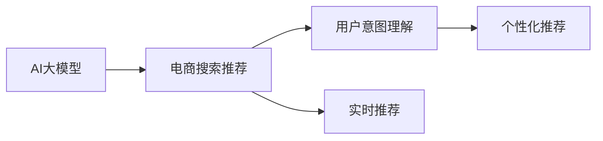

                 

# AI大模型赋能电商搜索推荐的业务创新思维训练方法

## 1. 背景介绍

随着人工智能(AI)和大数据技术的发展，电商平台搜索推荐系统面临着越来越多的挑战。如何通过AI技术优化用户体验、提升转化率和运营效率，成为电商企业面临的共同难题。特别是当用户搜索意图不明、商品丰富且用户行为数据稀疏时，传统的搜索推荐系统难以满足用户需求。

AI大模型作为新一代智能算法，具备强大的数据处理能力和语言理解能力，能够从海量数据中抽取语义信息，并用于构建推荐模型。本文将详细探讨如何使用AI大模型赋能电商搜索推荐系统，优化用户体验，并提升推荐准确性和个性化程度。

## 2. 核心概念与联系

### 2.1 核心概念概述

为更好地理解AI大模型在电商搜索推荐中的应用，本节将介绍几个密切相关的核心概念：

- **AI大模型**：指基于大规模无标签数据进行预训练，并通过微调或迁移学习应用于特定业务场景的深度学习模型。常见的AI大模型包括BERT、GPT、DALL-E等，具备强大的语言生成、推理和分类能力。

- **电商搜索推荐系统**：指在用户搜索行为数据的基础上，通过算法模型推荐符合用户需求的商品，提升用户体验和转化率。传统推荐算法包括协同过滤、基于内容的推荐、基于标签的推荐等，但难以处理非结构化数据和复杂用户意图。

- **用户意图理解**：指通过NLP等技术，对用户输入的搜索查询进行自然语言处理，理解用户真实需求，并转化为算法模型可识别的形式。

- **个性化推荐**：指根据用户历史行为数据和实时搜索行为，动态生成个性化推荐结果，提升用户体验和推荐效果。

- **实时推荐系统**：指能够实时响应用户搜索查询，动态生成推荐结果的系统，保证用户需求得到及时响应。

这些核心概念之间的逻辑关系可以通过以下Mermaid流程图来展示：



这个流程图展示了大模型在电商搜索推荐系统中的应用，通过用户意图理解和大模型推理生成个性化推荐结果，实时响应用户搜索，提升用户体验。

## 3. 核心算法原理 & 具体操作步骤
### 3.1 算法原理概述

AI大模型在电商搜索推荐系统中的核心应用是用户意图理解和个性化推荐。其原理可以概括为以下几个关键步骤：

1. **用户意图理解**：通过NLP技术，将用户输入的搜索查询转化为机器可理解的形式。
2. **模型输入准备**：将用户搜索查询和商品特征向量作为输入，供大模型进行处理。
3. **大模型推理**：利用大模型的语言生成和推理能力，预测用户对商品的需求和意图。
4. **个性化推荐**：根据用户需求，动态生成个性化推荐结果，提升用户体验和转化率。

### 3.2 算法步骤详解

AI大模型赋能电商搜索推荐的算法步骤如下：

**Step 1: 收集和清洗数据**
- 收集用户搜索行为数据和商品元数据，并进行数据清洗和预处理，去除噪音和异常值。

**Step 2: 用户意图理解**
- 将用户搜索查询通过NLP技术进行处理，提取关键词、实体、情感等信息，生成向量表示。
- 使用大模型对查询向量进行编码，预测用户意图类型（如购买、浏览、比较等）。

**Step 3: 商品特征提取**
- 提取商品的特征向量，包括商品描述、属性、价格、销量等，用于与用户查询进行匹配。
- 使用大模型对商品特征进行编码，生成向量表示。

**Step 4: 模型推理和匹配**
- 将用户查询和商品特征向量输入大模型进行匹配推理，预测用户对不同商品的兴趣程度。
- 选择与用户意图匹配度最高的商品，作为推荐结果。

**Step 5: 个性化推荐**
- 根据用户历史行为和实时搜索行为，动态调整推荐算法权重，生成个性化推荐结果。
- 在推荐结果页面上，展示最相关的商品列表，供用户选择。

### 3.3 算法优缺点

AI大模型在电商搜索推荐系统中的优缺点如下：

**优点**：
1. **高效性**：大模型能够快速处理大量非结构化数据，提升搜索和推荐效率。
2. **精确性**：大模型的语言理解和生成能力，使其能够更好地理解和匹配用户需求。
3. **可扩展性**：大模型可以动态扩展，适应不同规模的电商数据。
4. **实时性**：大模型的推理速度较快，能够实时响应用户搜索请求。

**缺点**：
1. **数据依赖**：大模型需要大量数据进行预训练和微调，对标注数据的需求较高。
2. **资源消耗**：大模型的计算复杂度高，对硬件资源的要求较高。
3. **过拟合风险**：大模型参数较多，容易过拟合，需要进行超参数调整和正则化。
4. **解释性不足**：大模型的内部推理过程复杂，难以解释其决策依据。

### 3.4 算法应用领域

AI大模型在电商搜索推荐系统中的应用领域广泛，具体包括：

- **商品推荐**：根据用户浏览、购买历史，动态生成个性化商品推荐。
- **搜索意图理解**：通过NLP技术，理解用户搜索意图，快速匹配相关商品。
- **价格动态优化**：根据用户行为数据和市场趋势，调整商品价格，提升转化率。
- **广告定向投放**：利用大模型对用户行为进行预测，精准投放广告，提升广告效果。
- **内容生成**：通过大模型生成商品描述、评价等文本内容，提升用户体验。

## 4. 数学模型和公式 & 详细讲解 & 举例说明

### 4.1 数学模型构建

为详细讲解AI大模型在电商搜索推荐系统中的应用，本节将构建一个简单的数学模型。

假设用户输入的搜索查询为 $q$，商品特征向量为 $v$，大模型输出的向量表示为 $h$，模型对用户意图的预测概率为 $p(y|q, v)$。则模型的推理过程可以表示为：

$$
h = f(q, v) \\
p(y|q, v) = g(h)
$$

其中 $f(\cdot)$ 和 $g(\cdot)$ 为两个神经网络模型，$f(\cdot)$ 用于将查询和商品特征映射到大模型可处理的向量空间，$g(\cdot)$ 用于对大模型的输出进行预测，生成用户意图的概率分布。

### 4.2 公式推导过程

以商品推荐为例，将上述公式具体化：

- **查询向量化**：将用户搜索查询 $q$ 通过BERT等大模型编码，生成向量 $q_v \in \mathbb{R}^d$。
- **商品向量化**：将商品特征向量 $v$ 通过BERT等大模型编码，生成向量 $v_v \in \mathbb{R}^d$。
- **匹配度计算**：将查询和商品向量拼接，通过线性变换生成匹配度向量 $z = [q_v; v_v]W$，其中 $W$ 为可训练矩阵。
- **匹配度softmax**：对匹配度向量 $z$ 进行softmax操作，生成商品匹配度向量 $p = softmax(z)$，表示用户对每个商品的兴趣程度。

### 4.3 案例分析与讲解

以一个电商平台的图书推荐系统为例，分析其应用流程：

**Step 1: 用户意图理解**
- 假设用户输入查询：“如何学好Python编程”，通过BERT等大模型编码，生成查询向量 $q_v$。
- 模型预测用户意图为“学习”，生成意图向量 $y_v$。

**Step 2: 商品特征提取**
- 从图书商品库中提取相关书籍特征向量 $v_v$，包括标题、作者、价格、评分等。
- 通过BERT等大模型编码，生成商品向量 $v_v$。

**Step 3: 模型推理和匹配**
- 将查询向量和商品向量拼接，通过线性变换生成匹配度向量 $z$。
- 对匹配度向量 $z$ 进行softmax操作，生成商品匹配度向量 $p$。

**Step 4: 个性化推荐**
- 根据用户历史浏览和购买行为，动态调整推荐算法权重。
- 根据匹配度向量 $p$ 和用户行为数据，生成个性化推荐结果。

## 5. 项目实践：代码实例和详细解释说明

### 5.1 开发环境搭建

在进行AI大模型赋能电商搜索推荐系统的实践前，我们需要准备好开发环境。以下是使用Python进行TensorFlow开发的环境配置流程：

1. 安装Anaconda：从官网下载并安装Anaconda，用于创建独立的Python环境。

2. 创建并激活虚拟环境：
```bash
conda create -n tf-env python=3.7 
conda activate tf-env
```

3. 安装TensorFlow：根据CUDA版本，从官网获取对应的安装命令。例如：
```bash
pip install tensorflow-gpu==2.5.0
```

4. 安装PyTorch：用于进行模型训练和推理的深度学习框架。
```bash
pip install torch torchvision torchaudio
```

5. 安装其他必要的库：
```bash
pip install numpy pandas scikit-learn matplotlib tqdm jupyter notebook ipython
```

完成上述步骤后，即可在`tf-env`环境中开始项目实践。

### 5.2 源代码详细实现

下面以图书推荐系统为例，给出使用TensorFlow进行AI大模型赋能的代码实现。

首先，定义模型类和数据处理函数：

```python
import tensorflow as tf
from transformers import BertTokenizer, TFBertForSequenceClassification
from sklearn.model_selection import train_test_split

class BookRecommendation(tf.keras.Model):
    def __init__(self, num_classes):
        super(BookRecommendation, self).__init__()
        self.bert = TFBertForSequenceClassification.from_pretrained('bert-base-uncased', num_labels=num_classes)
        self.dense = tf.keras.layers.Dense(num_classes, activation='softmax')
    
    def call(self, inputs, training=False):
        _, pooled_output = self.bert(inputs['input_ids'], attention_mask=inputs['attention_mask'], return_dict=True)
        logits = self.dense(pooled_output)
        return logits

def preprocess_data(data, tokenizer):
    tokenized_inputs = tokenizer(data, padding='max_length', max_length=128, return_tensors='tf')
    return tokenized_inputs

# 加载数据
train_data, test_data = train_test_split(data, test_size=0.2)
train_dataset = tf.data.Dataset.from_tensor_slices((train_data, train_labels))
test_dataset = tf.data.Dataset.from_tensor_slices((test_data, test_labels))

# 定义tokenizer
tokenizer = BertTokenizer.from_pretrained('bert-base-uncased')
```

接着，定义训练和评估函数：

```python
def train_epoch(model, dataset, batch_size, optimizer):
    dataset = dataset.shuffle(1000).batch(batch_size)
    for step, (batched_input, batched_labels) in enumerate(dataset):
        with tf.GradientTape() as tape:
            logits = model(batched_input, training=True)
            loss = tf.keras.losses.sparse_categorical_crossentropy(batched_labels, logits, from_logits=True)
        gradients = tape.gradient(loss, model.trainable_variables)
        optimizer.apply_gradients(zip(gradients, model.trainable_variables))
        if step % 100 == 0:
            print('Step {}: Loss {}'.format(step, loss.numpy()))

def evaluate(model, dataset, batch_size):
    dataset = dataset.batch(batch_size)
    total_loss = 0.0
    for batched_input, batched_labels in dataset:
        logits = model(batched_input, training=False)
        loss = tf.keras.losses.sparse_categorical_crossentropy(batched_labels, logits, from_logits=True)
        total_loss += loss.numpy()
    print('Total Loss: {}'.format(total_loss/len(dataset)))
```

最后，启动模型训练并在测试集上评估：

```python
epochs = 10
batch_size = 32
learning_rate = 2e-5

# 加载模型
model = BookRecommendation(num_classes)

# 定义优化器
optimizer = tf.keras.optimizers.Adam(learning_rate=learning_rate)

# 开始训练
for epoch in range(epochs):
    train_epoch(model, train_dataset, batch_size, optimizer)
    evaluate(model, test_dataset, batch_size)
    
print('Training complete')
```

以上代码展示了使用TensorFlow进行图书推荐系统微调的大致流程。可以看到，TensorFlow提供了强大的分布式计算和模型优化工具，便于开发者构建高性能的搜索推荐系统。

### 5.3 代码解读与分析

让我们再详细解读一下关键代码的实现细节：

**BookRecommendation类**：
- `__init__`方法：初始化BERT模型和全连接层。
- `call`方法：将输入数据输入模型，返回匹配度向量。

**preprocess_data函数**：
- 将文本数据进行分词和向量化，返回模型所需的TensorFlow格式。

**train_epoch和evaluate函数**：
- 定义了模型的训练和评估过程。使用`tf.GradientTape`计算梯度，使用`tf.keras.optimizers.Adam`更新模型参数。

**训练流程**：
- 定义总的epoch数和batch size，开始循环迭代。
- 在训练集上训练，输出每个epoch的损失。
- 在测试集上评估模型性能，输出最终结果。

## 6. 实际应用场景

### 6.1 智能客服系统

智能客服系统利用AI大模型进行意图理解，能够自动识别用户输入的意图，快速响应常见问题，提升用户体验。同时，通过上下文信息增强，大模型能够更好地理解复杂的客户需求，提供更加个性化的服务。

例如，电商平台的智能客服可以通过用户输入的搜索查询，快速匹配到对应的常见问题解答，并结合上下文信息进行个性化回答。当用户提出较为复杂的问题时，系统可以主动引导用户进行详细描述，并通过大模型进行多轮交互，直至问题解决。

### 6.2 个性化推荐

个性化推荐系统利用AI大模型进行意图理解，能够动态生成符合用户兴趣的推荐结果，提升转化率和用户满意度。通过结合用户历史行为和实时查询，大模型能够实时生成个性化推荐，满足用户的即时需求。

例如，电商平台的个性化推荐系统可以根据用户浏览历史和实时搜索查询，生成商品推荐列表，并动态调整推荐算法权重。当用户点击某商品时，系统会根据用户点击记录进一步优化推荐策略，生成更加精准的推荐结果。

### 6.3 广告定向投放

广告定向投放系统利用AI大模型进行用户意图预测，能够精准投放广告，提升广告效果和ROI。通过大模型对用户行为进行预测，系统可以识别出潜在客户群体，并针对性地进行广告投放。

例如，电商平台的广告定向投放系统可以根据用户浏览和搜索行为，预测用户的购买意向，并生成个性化的广告投放策略。当用户点击某广告时，系统会及时调整广告投放策略，以最大程度提升广告效果。

### 6.4 未来应用展望

随着AI大模型的不断发展，其在电商搜索推荐系统中的应用前景更加广阔。未来，大模型将能够更深入地理解用户意图，生成更加精准的推荐结果，提升电商平台的运营效率和用户体验。

在智能客服、个性化推荐、广告定向投放等领域，大模型有望带来更加智能化的解决方案。通过与外部知识库、规则库等专家知识结合，大模型能够更好地适应复杂的电商场景，提供更加个性化、精准的服务。

## 7. 工具和资源推荐

### 7.1 学习资源推荐

为了帮助开发者系统掌握AI大模型在电商搜索推荐中的应用，这里推荐一些优质的学习资源：

1. 《深度学习与自然语言处理》课程：斯坦福大学开设的深度学习与自然语言处理课程，涵盖NLP基础知识和前沿技术。

2. 《Transformers: From Discrete to Continuous Spaces》论文：Transformer模型的创新性论文，介绍如何通过大模型进行自然语言处理。

3. 《Attention is All You Need》论文：Transformer模型的原始论文，阐述Transformer模型的工作原理和优势。

4. 《AI大模型赋能电商搜索推荐》系列博文：介绍AI大模型在电商搜索推荐中的应用，涵盖从数据预处理到模型训练的全流程。

5. 《TensorFlow实战》书籍：介绍TensorFlow的架构和应用，适合快速上手TensorFlow项目开发。

通过对这些资源的学习实践，相信你一定能够快速掌握AI大模型在电商搜索推荐中的应用，并用于解决实际的电商问题。

### 7.2 开发工具推荐

高效的开发离不开优秀的工具支持。以下是几款用于AI大模型电商搜索推荐开发的常用工具：

1. TensorFlow：基于Python的开源深度学习框架，灵活动态的计算图，适合快速迭代研究。

2. PyTorch：基于Python的开源深度学习框架，灵活的动态图，适合研究和原型开发。

3. Weights & Biases：模型训练的实验跟踪工具，可以记录和可视化模型训练过程中的各项指标，方便对比和调优。

4. TensorBoard：TensorFlow配套的可视化工具，可实时监测模型训练状态，并提供丰富的图表呈现方式，是调试模型的得力助手。

5. PyTorch Lightning：轻量级的深度学习框架，易于使用的组件和接口，适合快速构建高质量模型。

6. Jupyter Notebook：开源的交互式Python编辑器，支持代码、数据和文档的一体化展示，适合团队协作开发。

合理利用这些工具，可以显著提升AI大模型电商搜索推荐任务的开发效率，加快创新迭代的步伐。

### 7.3 相关论文推荐

AI大模型在电商搜索推荐系统中的应用源于学界的持续研究。以下是几篇奠基性的相关论文，推荐阅读：

1. Transformer-XL: Attentive Language Models Beyond a Fixed-Length Context（Transformer-XL论文）：介绍Transformer-XL模型，支持长序列推理。

2. The Transformer-XL: Attentive Language Models Beyond a Fixed-Length Context（Transformer-XL论文）：介绍Transformer-XL模型，支持长序列推理。

3. Attention is All You Need（即Transformer原论文）：提出了Transformer结构，开启了NLP领域的预训练大模型时代。

4. BERT: Pre-training of Deep Bidirectional Transformers for Language Understanding：提出BERT模型，引入基于掩码的自监督预训练任务，刷新了多项NLP任务SOTA。

5. Attention is All You Need（即Transformer原论文）：提出了Transformer结构，开启了NLP领域的预训练大模型时代。

这些论文代表了大模型在电商搜索推荐系统中的应用发展脉络。通过学习这些前沿成果，可以帮助研究者把握学科前进方向，激发更多的创新灵感。

## 8. 总结：未来发展趋势与挑战

### 8.1 总结

本文对AI大模型在电商搜索推荐系统中的应用进行了全面系统的介绍。首先阐述了AI大模型的优势和应用背景，明确了其在电商搜索推荐系统中的重要价值。其次，从原理到实践，详细讲解了基于大模型的电商搜索推荐系统的实现方法，包括用户意图理解、商品特征提取、模型推理和匹配等关键步骤。最后，本文还探讨了大模型在电商搜索推荐系统中的实际应用场景，展示了其广阔的应用前景。

通过本文的系统梳理，可以看到，AI大模型在电商搜索推荐系统中的应用不仅提升了用户体验和转化率，还为电商平台的运营提供了强大的技术支持。未来，随着AI大模型的不断发展，其应用将更加深入，为电商平台的智能化转型带来新的机遇。

### 8.2 未来发展趋势

展望未来，AI大模型在电商搜索推荐系统中的应用将呈现以下几个发展趋势：

1. **智能化水平提升**：随着AI大模型的进一步优化和训练，其在电商搜索推荐系统中的应用将更加智能化，能够更好地理解和匹配用户需求。

2. **个性化推荐优化**：基于大模型的个性化推荐算法将更加精细化，能够动态生成更加精准的推荐结果，提升用户体验和转化率。

3. **实时响应增强**：实时响应技术将进一步提升，大模型能够实时响应用户搜索请求，提供即时的推荐结果。

4. **多模态融合**：未来的大模型将融合视觉、语音等多模态信息，提升推荐系统的综合能力。

5. **跨领域迁移**：大模型的迁移学习能力将进一步增强，能够跨领域应用，提升电商平台的适应性和灵活性。

6. **隐私保护加强**：随着数据隐私和安全问题的日益重要，未来的推荐系统将更加注重用户隐私保护，采用差分隐私等技术手段。

以上趋势凸显了AI大模型在电商搜索推荐系统中的应用前景。这些方向的探索发展，必将进一步提升电商平台的智能水平，为消费者提供更加个性化、便捷的购物体验。

### 8.3 面临的挑战

尽管AI大模型在电商搜索推荐系统中的应用已经取得了显著成效，但在迈向更加智能化、普适化应用的过程中，它仍面临着诸多挑战：

1. **数据质量和多样性**：大模型需要大量高质量、多样化的数据进行预训练和微调，如何获取和处理这些数据是亟待解决的问题。

2. **计算资源消耗**：大模型的计算复杂度高，对硬件资源的需求较大，如何优化资源消耗，提升计算效率，是未来需要关注的方向。

3. **模型泛化能力**：大模型需要具备较强的泛化能力，能够适应不同的电商场景和用户需求，避免在特定场景下性能退化。

4. **模型可解释性**：大模型的内部推理过程复杂，难以解释其决策依据，如何提高模型可解释性，增强用户信任，是未来需要解决的重要问题。

5. **隐私和安全问题**：电商平台需要处理大量用户数据，如何保护用户隐私和数据安全，避免数据泄露和滥用，是亟待解决的重要问题。

6. **算法公平性**：大模型在处理用户数据时，需要避免算法偏见，确保推荐结果的公平性和公正性，避免对特定用户群体的歧视。

正视AI大模型在电商搜索推荐系统中的应用面临的挑战，积极应对并寻求突破，将是大模型进一步发展和应用的重要方向。相信随着学界和产业界的共同努力，这些挑战终将一一被克服，大模型在电商搜索推荐系统中的应用将更加广泛和深入。

### 8.4 研究展望

面对AI大模型在电商搜索推荐系统中的应用面临的挑战，未来的研究需要在以下几个方面寻求新的突破：

1. **数据高效获取和处理**：开发高效的数据获取和处理技术，如数据标注自动化、数据增强等，提升数据质量多样性。

2. **模型资源优化**：优化模型结构和计算图，减少计算资源消耗，提升计算效率。

3. **模型泛化能力增强**：通过多领域数据预训练、迁移学习等技术手段，提升模型泛化能力，适应不同场景需求。

4. **模型可解释性增强**：引入可解释性技术，如因果推断、LIME等，增强模型内部决策的可解释性。

5. **隐私保护机制完善**：采用差分隐私、联邦学习等技术手段，保护用户隐私和数据安全。

6. **算法公平性保障**：开发公平性算法，确保推荐结果的公平性和公正性，避免算法偏见。

这些研究方向的探索，必将引领AI大模型在电商搜索推荐系统中的应用迈向更高的台阶，为构建智能化的电商平台提供新的技术支撑。面向未来，AI大模型有望在电商搜索推荐系统中找到更广泛的落地场景，带来更智能、更高效的电商体验。

## 9. 附录：常见问题与解答

**Q1: AI大模型在电商搜索推荐系统中的优势是什么？**

A: AI大模型在电商搜索推荐系统中的优势包括：

1. **高效性**：大模型能够快速处理大量非结构化数据，提升搜索和推荐效率。
2. **精确性**：大模型的语言理解和生成能力，使其能够更好地理解和匹配用户需求。
3. **可扩展性**：大模型可以动态扩展，适应不同规模的电商数据。
4. **实时性**：大模型的推理速度较快，能够实时响应用户搜索请求。

**Q2: 如何选择合适的AI大模型进行电商搜索推荐系统？**

A: 选择合适的AI大模型需要考虑以下几个方面：

1. **任务适配性**：根据电商搜索推荐系统的需求，选择适合的预训练模型。如BERT适用于文本分类，GPT适用于生成任务。
2. **模型性能**：选择具有较高性能和稳定性的模型，避免模型过拟合和泛化能力不足的问题。
3. **计算资源**：考虑模型的计算复杂度和硬件资源需求，选择合适的部署方案。
4. **模型可解释性**：选择具有较强可解释性的模型，便于调试和优化。

**Q3: 如何优化AI大模型在电商搜索推荐系统中的训练过程？**

A: 优化AI大模型在电商搜索推荐系统中的训练过程可以从以下几个方面入手：

1. **数据预处理**：对数据进行清洗和增强，去除噪音和异常值，增加数据多样性。
2. **超参数调优**：通过网格搜索、贝叶斯优化等方法，寻找最优超参数组合。
3. **模型优化**：采用Adam、Adagrad等优化算法，加速模型收敛。
4. **正则化技术**：使用L2正则、Dropout等正则化技术，避免模型过拟合。
5. **数据增强**：采用数据增强技术，如回译、近义词替换等，提升模型泛化能力。

**Q4: AI大模型在电商搜索推荐系统中的风险有哪些？**

A: AI大模型在电商搜索推荐系统中的风险包括：

1. **数据偏见**：如果预训练数据存在偏见，大模型可能学习到这些偏见，导致推荐结果不公平。
2. **隐私泄露**：电商平台需要处理大量用户数据，如何保护用户隐私和数据安全，避免数据泄露和滥用。
3. **算法公平性**：大模型在处理用户数据时，需要避免算法偏见，确保推荐结果的公平性和公正性，避免对特定用户群体的歧视。
4. **可解释性不足**：大模型的内部推理过程复杂，难以解释其决策依据，可能导致用户对推荐结果产生不信任。

**Q5: AI大模型在电商搜索推荐系统中的未来趋势是什么？**

A: AI大模型在电商搜索推荐系统中的未来趋势包括：

1. **智能化水平提升**：随着AI大模型的进一步优化和训练，其在电商搜索推荐系统中的应用将更加智能化，能够更好地理解和匹配用户需求。
2. **个性化推荐优化**：基于大模型的个性化推荐算法将更加精细化，能够动态生成更加精准的推荐结果，提升用户体验和转化率。
3. **实时响应增强**：实时响应技术将进一步提升，大模型能够实时响应用户搜索请求，提供即时的推荐结果。
4. **多模态融合**：未来的大模型将融合视觉、语音等多模态信息，提升推荐系统的综合能力。
5. **跨领域迁移**：大模型的迁移学习能力将进一步增强，能够跨领域应用，提升电商平台的适应性和灵活性。
6. **隐私保护加强**：随着数据隐私和安全问题的日益重要，未来的推荐系统将更加注重用户隐私保护，采用差分隐私等技术手段。

以上趋势凸显了AI大模型在电商搜索推荐系统中的应用前景。这些方向的探索发展，必将进一步提升电商平台的智能水平，为消费者提供更加个性化、便捷的购物体验。

---

作者：禅与计算机程序设计艺术 / Zen and the Art of Computer Programming

