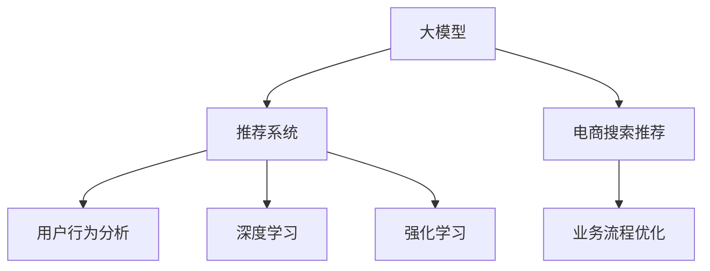

                 

# AI大模型赋能电商搜索推荐的业务创新流程优化实践

> 关键词：电商搜索推荐, AI大模型, 业务流程优化, 深度学习, 强化学习, 推荐系统, 用户行为分析, 智能推荐算法

## 1. 背景介绍

### 1.1 问题由来

近年来，随着互联网技术的快速发展，电商平台之间的竞争日益激烈，如何提供个性化、精准的搜索推荐服务，成为提升用户体验和增加销售额的关键因素。传统的基于规则、关键词匹配的推荐系统，已难以满足用户多样化的需求和快速变化的市场环境。而基于AI技术的推荐系统，尤其是通过深度学习和强化学习训练的推荐模型，以其强大的数据分析能力和灵活的个性化推荐策略，成为了电商搜索推荐的主流趋势。

大模型作为AI技术的前沿突破，以其海量的参数量和丰富的语言知识，在电商搜索推荐中展现出巨大的潜力。然而，如何将大模型技术有效地应用于实际业务流程，实现从数据收集、模型训练到业务部署的全流程优化，仍是一个复杂且系统性的挑战。本文将详细介绍如何利用AI大模型赋能电商搜索推荐的业务创新流程优化实践。

## 2. 核心概念与联系

### 2.1 核心概念概述

为更好地理解AI大模型在电商搜索推荐中的应用，本节将介绍几个关键概念：

- **大模型**：指以深度学习为基础、具备海量参数的预训练模型，如BERT、GPT-3等，通过在大型语料库上预训练，学习到丰富的语言知识。
- **推荐系统**：通过分析用户行为数据，预测用户对物品的兴趣，从而推荐最符合用户需求的物品。推荐系统是电商平台实现个性化推荐的核心技术。
- **电商搜索推荐**：基于用户搜索记录和行为数据，实时推荐最符合用户需求的商品，提升用户体验和销售额。
- **深度学习**：一种基于神经网络的机器学习技术，通过多层次的特征提取和抽象，逐步提升模型的表达能力和预测准确性。
- **强化学习**：一种通过试错学习策略和奖励机制，优化决策模型，以达到最优策略的学习范式。
- **用户行为分析**：分析用户在电商平台上的浏览、点击、购买等行为，提取用户兴趣和偏好，指导推荐系统的策略调整。

这些核心概念之间的逻辑关系可以通过以下Mermaid流程图来展示：



这个流程图展示了大模型在电商搜索推荐中的应用框架：

1. 大模型通过在大型语料库上预训练，获得广泛的语言知识和表示能力。
2. 推荐系统将大模型的知识应用于电商搜索推荐任务，预测用户对商品的兴趣，推荐合适的商品。
3. 用户行为分析模块通过收集和分析用户行为数据，调整推荐策略，优化模型性能。
4. 业务流程优化模块将深度学习和强化学习等AI技术融入推荐系统的设计、训练和部署全流程，提升系统效率和效果。

## 3. 核心算法原理 & 具体操作步骤

### 3.1 算法原理概述

基于AI大模型的电商搜索推荐，本质上是通过深度学习构建用户-商品交互的表示模型，并通过强化学习优化推荐策略的过程。其核心思想是：利用大模型的语言理解和表示能力，通过深度学习挖掘用户行为数据中的潜在模式和关系，然后通过强化学习在实际推荐场景中动态调整推荐策略，提升推荐的准确性和个性化程度。

形式化地，假设电商平台上用户的搜索行为为 $S=\{s_i\}$，商品为 $I=\{i_j\}$，大模型为 $M_{\theta}$，其中 $\theta$ 为预训练得到的模型参数。假设推荐算法为 $A$，推荐策略优化器为 $Opt$，优化目标为最大化用户满意度，即：

$$
\max_{A, \theta} \sum_{i} \prod_{s} P(s|M_{\theta}(I),A)
$$

其中 $P$ 为给定商品 $I$ 和策略 $A$ 下用户行为 $S$ 的概率分布。通过最大化用户满意度的期望，优化模型参数 $\theta$ 和推荐策略 $A$，使得推荐系统能够更好地满足用户需求。

### 3.2 算法步骤详解

基于AI大模型的电商搜索推荐，主要包括以下几个关键步骤：

**Step 1: 数据收集与预处理**

- 收集电商平台的用户搜索、点击、购买等行为数据，将其格式化为适合深度学习模型处理的形式。
- 使用数据清洗技术，去除噪声和异常数据，保留高质量的数据样本。

**Step 2: 构建推荐模型**

- 选择合适的深度学习模型，如序列模型、注意力机制模型等，构建电商搜索推荐模型。
- 利用大模型进行特征提取和表示学习，如使用BERT模型提取搜索查询的语义表示，将用户行为数据转化为模型可理解的形式。
- 设计合适的损失函数，如交叉熵损失、均方误差损失等，评估模型预测与真实行为之间的差异。

**Step 3: 策略优化与训练**

- 设计强化学习策略，如Q-learning、策略梯度等，根据用户反馈调整推荐策略。
- 将用户行为数据和模型预测结果作为输入，训练优化策略 $A$，最大化用户满意度。
- 使用Adam、SGD等优化算法更新模型参数 $\theta$，最小化模型预测与真实行为的差距。

**Step 4: 部署与评估**

- 将训练好的推荐模型和优化策略部署到电商平台的推荐引擎中，实现实时推荐。
- 使用A/B测试等方法评估推荐效果，如点击率、转化率等指标，根据评估结果进一步优化模型和策略。

**Step 5: 持续优化**

- 实时收集用户反馈和推荐结果，不断调整模型和策略，提升推荐系统的准确性和个性化程度。
- 定期重新训练模型，更新大模型的表示能力，以适应市场和用户需求的变化。

以上是基于AI大模型的电商搜索推荐的主要流程。在实际应用中，还需要根据具体业务场景和需求，对每个环节进行优化设计，如引入数据增强、对抗训练等技术，提高模型的鲁棒性和泛化能力。

### 3.3 算法优缺点

基于AI大模型的电商搜索推荐，具有以下优点：

1. **高效性**：深度学习模型能够自动学习复杂的特征表示，通过优化策略实现高效推荐。
2. **个性化**：通过用户行为分析和推荐策略优化，能够实现高度个性化的推荐，提升用户体验。
3. **鲁棒性**：大模型的强大语言理解能力，使其能够在多样化的电商场景中表现出良好的鲁棒性。
4. **可解释性**：大模型的中间表示能够提供推荐过程的可解释性，帮助用户理解推荐理由。

同时，该方法也存在一定的局限性：

1. **数据依赖**：电商推荐系统高度依赖用户行为数据，数据的全面性和准确性直接影响推荐效果。
2. **计算成本高**：大模型和深度学习模型的训练和推理需要较高的计算资源。
3. **冷启动问题**：新用户或新商品初期没有足够的历史数据，难以进行有效推荐。
4. **过拟合风险**：在大规模数据上进行深度学习模型训练时，容易出现过拟合现象，影响模型的泛化能力。

尽管存在这些局限性，但就目前而言，基于AI大模型的电商搜索推荐方法仍然是电商推荐系统的重要技术手段。未来相关研究的重点在于如何进一步降低计算成本，提高模型的泛化能力和推荐效率，同时兼顾可解释性和冷启动问题等挑战。

### 3.4 算法应用领域

基于AI大模型的电商搜索推荐方法，已经在各大电商平台上得到了广泛应用，例如：

- **京东、淘宝、亚马逊等**：使用深度学习模型构建推荐引擎，提供个性化的商品推荐服务。
- **美团、大众点评等**：利用推荐系统优化搜索结果排序，提升用户粘性和转化率。
- **携程、去哪儿等**：通过个性化推荐提升用户预订率和满意度。
- **拼多多、唯品会等**：利用推荐技术优化社交电商的用户购物体验，提高转化率。

除了以上应用场景，大模型推荐技术还广泛应用于短视频、新闻、音乐、视频游戏等多个领域，为不同行业的用户提供更加智能和个性化的推荐服务。

## 4. 数学模型和公式 & 详细讲解

### 4.1 数学模型构建

本节将使用数学语言对基于AI大模型的电商搜索推荐过程进行更加严格的刻画。

记电商平台上的用户搜索行为为 $S=\{s_i\}$，商品为 $I=\{i_j\}$，大模型为 $M_{\theta}$，推荐策略为 $A$，其中 $\theta$ 为预训练得到的模型参数。假设推荐系统基于用户搜索查询 $q$ 和商品 $i$ 的相似度 $\text{sim}(q, i)$ 进行推荐，优化目标为最大化用户满意度的期望，即：

$$
\max_{A, \theta} \sum_{i} \prod_{s} P(s|M_{\theta}(q),A)
$$

其中 $P$ 为给定查询 $q$ 和商品 $i$ 相似度 $\text{sim}(q, i)$ 下用户行为 $s$ 的概率分布。

定义推荐系统在搜索查询 $q$ 和商品 $i$ 相似度 $\text{sim}(q, i)$ 下的推荐概率为 $P(q, i|A, \theta)$，则推荐系统的损失函数为：

$$
\mathcal{L}(\theta, A) = -\frac{1}{N} \sum_{i} \sum_{s} \log P(s|M_{\theta}(q),A)
$$

其中 $N$ 为训练样本数量，$P$ 为给定查询 $q$ 和商品 $i$ 相似度 $\text{sim}(q, i)$ 下用户行为 $s$ 的概率分布。

### 4.2 公式推导过程

以下我们以基于大模型的电商推荐系统为例，推导推荐模型的损失函数及其梯度的计算公式。

假设推荐系统基于用户搜索查询 $q$ 和商品 $i$ 的相似度 $\text{sim}(q, i)$ 进行推荐，利用大模型的表示能力，提取查询和商品的语义表示。设大模型在查询 $q$ 上的表示为 $V_q$，在商品 $i$ 上的表示为 $V_i$，则相似度 $\text{sim}(q, i)$ 可以表示为：

$$
\text{sim}(q, i) = \text{cosine}(V_q, V_i)
$$

其中 $\text{cosine}(V_q, V_i)$ 为向量 $V_q$ 和 $V_i$ 的余弦相似度。

假设推荐系统的优化目标为最大化用户满意度的期望，即：

$$
\max_{A, \theta} \sum_{i} P(i|q, A, \theta)
$$

其中 $P(i|q, A, \theta)$ 为给定查询 $q$ 和推荐策略 $A$ 下商品 $i$ 的推荐概率。

根据最大化的目标，可以通过交叉熵损失函数来优化模型参数 $\theta$ 和推荐策略 $A$。推荐系统的损失函数为：

$$
\mathcal{L}(\theta, A) = -\frac{1}{N} \sum_{i} \sum_{s} \log P(s|M_{\theta}(q),A)
$$

其中 $P(s|M_{\theta}(q),A)$ 为给定查询 $q$ 和推荐策略 $A$ 下用户行为 $s$ 的概率分布。

根据链式法则，损失函数对模型参数 $\theta$ 和推荐策略 $A$ 的梯度为：

$$
\frac{\partial \mathcal{L}}{\partial \theta} = -\frac{1}{N} \sum_{i} \sum_{s} \frac{\partial P(s|M_{\theta}(q),A)}{\partial \theta}
$$

$$
\frac{\partial \mathcal{L}}{\partial A} = -\frac{1}{N} \sum_{i} \sum_{s} \frac{\partial P(s|M_{\theta}(q),A)}{\partial A}
$$

在得到损失函数的梯度后，即可带入优化算法，完成模型的迭代优化。重复上述过程直至收敛，最终得到优化后的推荐模型和策略。

## 5. 项目实践：代码实例和详细解释说明

### 5.1 开发环境搭建

在进行电商推荐系统开发前，我们需要准备好开发环境。以下是使用Python进行TensorFlow开发的环境配置流程：

1. 安装Anaconda：从官网下载并安装Anaconda，用于创建独立的Python环境。

2. 创建并激活虚拟环境：
```bash
conda create -n recommendation-env python=3.8 
conda activate recommendation-env
```

3. 安装TensorFlow：根据CUDA版本，从官网获取对应的安装命令。例如：
```bash
conda install tensorflow tensorflow-gpu=2.5.0 -c pytorch -c conda-forge
```

4. 安装TensorBoard：TensorFlow配套的可视化工具，用于监控模型训练状态，提供图表呈现方式。

5. 安装Pandas、Numpy等常用库：
```bash
pip install pandas numpy
```

完成上述步骤后，即可在`recommendation-env`环境中开始推荐系统开发。

### 5.2 源代码详细实现

这里我们以基于大模型的电商推荐系统为例，给出使用TensorFlow进行推荐系统开发的代码实现。

首先，定义推荐模型的数据输入和输出：

```python
import tensorflow as tf

class RecommendationModel(tf.keras.Model):
    def __init__(self, hidden_size, num_items):
        super(RecommendationModel, self).__init__()
        self.hidden_size = hidden_size
        self.num_items = num_items
        
        # 定义隐藏层
        self.dense1 = tf.keras.layers.Dense(hidden_size, activation='relu')
        
        # 定义输出层
        self.dense2 = tf.keras.layers.Dense(num_items, activation='softmax')
    
    def call(self, inputs):
        x = self.dense1(inputs)
        return self.dense2(x)
```

然后，定义推荐系统的损失函数和优化器：

```python
# 定义损失函数
def loss_function(y_true, y_pred):
    return tf.keras.losses.sparse_categorical_crossentropy(y_true, y_pred)

# 定义优化器
optimizer = tf.keras.optimizers.Adam(learning_rate=0.001)
```

接着，定义训练和评估函数：

```python
# 定义训练函数
def train_step(inputs, labels):
    with tf.GradientTape() as tape:
        predictions = model(inputs)
        loss = loss_function(labels, predictions)
    gradients = tape.gradient(loss, model.trainable_variables)
    optimizer.apply_gradients(zip(gradients, model.trainable_variables))

# 定义评估函数
def evaluate(inputs, labels):
    predictions = model(inputs)
    return loss_function(labels, predictions)
```

最后，启动训练流程并在测试集上评估：

```python
# 加载训练数据
train_data = ...
train_labels = ...
test_data = ...
test_labels = ...

# 创建数据集
train_dataset = tf.data.Dataset.from_tensor_slices((train_data, train_labels))
train_dataset = train_dataset.shuffle(buffer_size=1024).batch(batch_size)

# 创建测试数据集
test_dataset = tf.data.Dataset.from_tensor_slices((test_data, test_labels))
test_dataset = test_dataset.batch(batch_size)

# 定义训练参数
batch_size = 128
epochs = 10

# 训练模型
for epoch in range(epochs):
    for inputs, labels in train_dataset:
        train_step(inputs, labels)
    
    # 在测试集上评估模型
    test_loss = evaluate(test_data, test_labels)
    print(f"Epoch {epoch+1}, test loss: {test_loss:.4f}")
```

以上就是使用TensorFlow对基于大模型的电商推荐系统进行开发的完整代码实现。可以看到，TensorFlow提供了强大的深度学习框架，使得推荐系统模型的训练和评估变得简洁高效。

### 5.3 代码解读与分析

让我们再详细解读一下关键代码的实现细节：

**RecommendationModel类**：
- `__init__`方法：初始化模型，定义隐藏层和输出层的参数。
- `call`方法：定义前向传播过程，将输入数据经过隐藏层和输出层，得到推荐概率分布。

**loss_function函数**：
- 定义推荐系统的损失函数，使用交叉熵损失计算模型预测与真实标签的差异。

**train_step函数**：
- 定义训练过程，在每个训练批次上计算损失函数和梯度，更新模型参数。

**evaluate函数**：
- 定义评估过程，在测试集上计算损失函数，输出模型评估结果。

**训练流程**：
- 加载训练和测试数据，创建数据集并进行批处理。
- 定义训练参数，如批量大小和迭代次数。
- 在训练数据集上迭代训练，在测试集上评估模型性能。

可以看到，TensorFlow提供了丰富的API和工具，使得模型训练和评估变得简单高效。开发者可以专注于模型的设计、优化和部署，而不必过多关注底层计算图的实现细节。

当然，工业级的系统实现还需考虑更多因素，如模型的保存和部署、超参数的自动搜索、更灵活的任务适配层等。但核心的推荐范式基本与此类似。

## 6. 实际应用场景

### 6.1 智能推荐引擎

基于大模型的电商推荐系统，可以应用于智能推荐引擎，提供个性化的商品推荐服务。传统推荐系统往往依赖于基于规则的策略，难以处理复杂多变的用户需求。而大模型的强大表示能力和学习能力，使得推荐系统能够更好地理解用户兴趣和偏好，从而提供更精准、多样化的推荐。

在技术实现上，可以收集用户的历史浏览、点击、购买等行为数据，构建深度学习模型，通过优化策略调整推荐策略，提升推荐效果。通过在实际场景中的不断迭代优化，推荐系统能够更好地满足用户需求，提高用户满意度和平台销售额。

### 6.2 实时搜索结果排序

基于大模型的电商推荐系统，还可以应用于实时搜索结果排序，优化用户的搜索体验。传统搜索结果排序往往采用简单的倒排索引算法，难以处理语义复杂的查询。而大模型的语义表示能力，使得推荐系统能够更好地理解查询的意图和语义，从而提供更精准的搜索结果排序。

在技术实现上，可以构建大模型的语义表示模型，将用户的查询转化为语义表示，并将其与商品进行相似度计算，得到排序结果。通过优化策略调整排序策略，提升搜索排序的准确性和用户体验。实时收集用户反馈和点击行为，不断调整模型和策略，实现动态优化。

### 6.3 动态定价和库存管理

基于大模型的电商推荐系统，还可以应用于动态定价和库存管理，提升平台的运营效率。传统定价和库存管理往往依赖于固定规则，难以灵活应对市场需求变化。而大模型的预测能力，使得推荐系统能够实时预测用户需求和市场变化，从而进行动态定价和库存调整。

在技术实现上，可以构建大模型的需求预测模型，基于用户行为数据和市场趋势，预测用户对商品的需求量。通过优化策略调整库存和定价策略，实现动态库存管理和智能定价。实时收集用户反馈和市场变化，不断调整模型和策略，提升运营效率和用户体验。

### 6.4 未来应用展望

随着大模型和深度学习技术的发展，基于大模型的电商推荐系统将呈现出以下发展趋势：

1. **模型规模持续增大**：未来预训练模型的参数量将进一步增大，海量的参数量将带来更丰富的语言知识和表示能力，提升推荐系统的表现。

2. **融合更多AI技术**：未来推荐系统将更多地融合强化学习、自然语言处理等AI技术，提升系统的智能化水平和推荐效果。

3. **引入更多先验知识**：未来推荐系统将引入更多的先验知识，如知识图谱、逻辑规则等，指导模型的训练和优化，提升推荐系统的准确性和泛化能力。

4. **数据驱动的策略调整**：未来推荐系统将更多地依赖数据驱动的策略调整，通过实时分析用户行为和反馈，动态调整推荐策略，提升推荐系统的个性化和灵活性。

5. **支持多模态数据**：未来推荐系统将更多地支持多模态数据的融合，如文本、图像、视频等，提升系统的表现力和应用场景的覆盖面。

6. **提高模型的可解释性**：未来推荐系统将更多地关注模型的可解释性，通过提供推荐过程的可解释性，增强用户对推荐系统的信任和满意度。

以上趋势凸显了大模型推荐系统在电商搜索推荐中的广阔前景，这些方向的探索发展，必将进一步提升推荐系统的性能和应用范围，为电商平台提供更智能、更个性化的推荐服务。

## 7. 工具和资源推荐

### 7.1 学习资源推荐

为了帮助开发者系统掌握基于大模型的电商推荐系统的理论和实践，这里推荐一些优质的学习资源：

1. 《深度学习与推荐系统》系列课程：斯坦福大学开设的推荐系统课程，涵盖深度学习在推荐系统中的应用，包括基于大模型的推荐方法。

2. 《推荐系统理论与算法》书籍：清华大学出版社，系统讲解推荐系统的理论基础和实际应用，适合深入学习推荐系统算法和模型。

3. TensorFlow官方文档：TensorFlow的官方文档，提供了丰富的API和示例代码，适合上手实践推荐系统开发。

4. PyTorch官方文档：PyTorch的官方文档，提供了丰富的深度学习模型和工具库，适合构建和优化推荐模型。

5. HuggingFace官方文档：HuggingFace的官方文档，提供了多种预训练语言模型和推荐模型的实现，适合快速迭代优化推荐系统。

通过对这些资源的学习实践，相信你一定能够快速掌握基于大模型的电商推荐系统的精髓，并用于解决实际的电商推荐问题。

### 7.2 开发工具推荐

高效的开发离不开优秀的工具支持。以下是几款用于电商推荐系统开发的常用工具：

1. TensorFlow：基于Python的开源深度学习框架，提供了丰富的深度学习模型和工具库，适合构建和优化推荐模型。

2. PyTorch：基于Python的开源深度学习框架，灵活动态的计算图，适合快速迭代研究。

3. Keras：基于Python的高级深度学习框架，提供简单易用的API，适合快速构建推荐模型。

4. TensorBoard：TensorFlow配套的可视化工具，用于监控模型训练状态，提供图表呈现方式，适合调试和优化推荐模型。

5. Weights & Biases：模型训练的实验跟踪工具，用于记录和可视化模型训练过程中的各项指标，适合比较和优化推荐模型。

6. Scikit-learn：开源的机器学习库，提供了丰富的数据处理和模型评估工具，适合数据预处理和模型评估。

合理利用这些工具，可以显著提升电商推荐系统的开发效率，加快创新迭代的步伐。

### 7.3 相关论文推荐

电商推荐系统的发展源于学界的持续研究。以下是几篇奠基性的相关论文，推荐阅读：

1. Winning the Game: Hyperparameter Tuning in Deep Neural Networks（2009）：提出网格搜索、随机搜索等超参数优化方法，为深度学习模型调参提供了重要参考。

2. Neural Collaborative Filtering（2018）：提出基于神经网络的协同过滤推荐方法，提升了推荐系统的预测能力和个性化程度。

3. Attention Is All You Need（2018）：提出Transformer结构，开启了预训练语言模型的时代，对电商推荐系统产生了深远影响。

4. Deep & Wide Learning for Recommender Systems: A Unified Approach（2018）：提出深度-宽学习方法，结合深度学习模型的表示能力和宽特征组合策略，提升了推荐系统的准确性和泛化能力。

5. Semi-Supervised Personalized Ranking with Diverse Preference Learning（2017）：提出基于半监督学习的个性化推荐方法，通过利用未标注数据提升推荐效果。

这些论文代表了大模型在电商推荐系统中的应用范式和发展脉络。通过学习这些前沿成果，可以帮助研究者把握学科前进方向，激发更多的创新灵感。

## 8. 总结：未来发展趋势与挑战

### 8.1 研究成果总结

本文对基于AI大模型的电商搜索推荐流程优化实践进行了详细讲解。通过系统介绍电商搜索推荐的核心概念、算法原理和操作步骤，结合实际应用场景和代码实现，展示了如何利用大模型赋能电商搜索推荐系统，优化推荐效果，提升用户体验和平台销售额。通过分析电商推荐系统的应用现状和未来趋势，提出了一些关键的研究方向和挑战。

通过本文的介绍，相信读者能够系统掌握基于大模型的电商搜索推荐流程优化实践，了解其核心思想和操作步骤，掌握其应用场景和实践方法。

### 8.2 未来发展趋势

展望未来，基于AI大模型的电商搜索推荐系统将呈现以下几个发展趋势：

1. **模型规模持续增大**：未来预训练模型的参数量将进一步增大，海量的参数量将带来更丰富的语言知识和表示能力，提升推荐系统的表现。

2. **融合更多AI技术**：未来推荐系统将更多地融合强化学习、自然语言处理等AI技术，提升系统的智能化水平和推荐效果。

3. **引入更多先验知识**：未来推荐系统将引入更多的先验知识，如知识图谱、逻辑规则等，指导模型的训练和优化，提升推荐系统的准确性和泛化能力。

4. **数据驱动的策略调整**：未来推荐系统将更多地依赖数据驱动的策略调整，通过实时分析用户行为和反馈，动态调整推荐策略，提升推荐系统的个性化和灵活性。

5. **支持多模态数据**：未来推荐系统将更多地支持多模态数据的融合，如文本、图像、视频等，提升系统的表现力和应用场景的覆盖面。

6. **提高模型的可解释性**：未来推荐系统将更多地关注模型的可解释性，通过提供推荐过程的可解释性，增强用户对推荐系统的信任和满意度。

以上趋势凸显了大模型推荐系统在电商搜索推荐中的广阔前景，这些方向的探索发展，必将进一步提升推荐系统的性能和应用范围，为电商平台提供更智能、更个性化的推荐服务。

### 8.3 面临的挑战

尽管基于AI大模型的电商搜索推荐系统已经取得了显著成果，但在迈向更加智能化、普适化应用的过程中，它仍面临诸多挑战：

1. **计算成本高**：大模型和深度学习模型的训练和推理需要较高的计算资源，如何降低计算成本，提高模型训练和推理效率，是一个重要问题。

2. **数据依赖**：电商推荐系统高度依赖用户行为数据，数据的全面性和准确性直接影响推荐效果。如何获取高质量的标注数据，是一个挑战。

3. **冷启动问题**：新用户或新商品初期没有足够的历史数据，难以进行有效推荐。如何处理冷启动问题，是一个亟待解决的问题。

4. **过拟合风险**：在大规模数据上进行深度学习模型训练时，容易出现过拟合现象，影响模型的泛化能力。如何避免过拟合，提高模型的泛化能力，是一个重要的研究方向。

5. **模型鲁棒性**：大模型的强大表示能力，使其能够适应多样化的电商场景，但也可能引入噪声和偏差。如何提高模型的鲁棒性，减少偏差和噪声，是一个挑战。

6. **模型可解释性**：大模型的预测能力虽然强大，但其决策过程难以解释，缺乏可解释性。如何提供推荐过程的可解释性，增强用户对推荐系统的信任和满意度，是一个亟待解决的问题。

7. **隐私和安全**：电商推荐系统处理大量用户数据，如何保护用户隐私和数据安全，是一个重要问题。

这些挑战凸显了大模型推荐系统在电商搜索推荐中的复杂性，需要在算法、数据、工程等多个维度进行全面优化，方能实现高效、精准、安全的推荐服务。

### 8.4 研究展望

面向未来，电商搜索推荐系统的研究需要在以下几个方向进行深入探索：

1. **数据高效利用**：探索如何利用未标注数据、噪声数据，提高数据利用效率，降低对高质量标注数据的依赖。

2. **参数高效优化**：开发更加参数高效的推荐方法，减少计算资源消耗，提升模型训练和推理效率。

3. **跨模态融合**：探索如何支持多模态数据的融合，提升推荐系统的表现力和应用场景的覆盖面。

4. **智能策略调整**：探索如何基于实时数据和反馈，动态调整推荐策略，提升推荐系统的个性化和灵活性。

5. **增强模型可解释性**：探索如何提供推荐过程的可解释性，增强用户对推荐系统的信任和满意度。

6. **保护隐私安全**：探索如何在推荐系统中保护用户隐私和数据安全，避免数据泄露和滥用。

这些研究方向将引领电商搜索推荐系统迈向更加智能化、普适化的应用，为电商平台提供更智能、更个性化的推荐服务，提升用户体验和平台销售额。

## 9. 附录：常见问题与解答

**Q1：电商推荐系统为何需要基于大模型的推荐方法？**

A: 大模型通过在海量语料库上的预训练，学习到丰富的语言知识和表示能力，能够在电商推荐任务中提供更加精准和多样化的推荐。相比传统的基于规则的推荐方法，大模型能够更好地理解用户需求和商品特征，提升推荐系统的表现。

**Q2：如何选择合适的深度学习模型进行电商推荐？**

A: 选择合适的深度学习模型需要考虑多个因素，包括数据特征、任务类型、计算资源等。常用的电商推荐模型包括：
1. 序列模型，如RNN、LSTM等，适用于时间序列数据的建模。
2. 注意力机制模型，如Transformer等，适用于多模态数据的融合和表示学习。
3. 协同过滤模型，如矩阵分解、神经协同过滤等，适用于用户行为数据的建模。

**Q3：电商推荐系统面临哪些资源瓶颈？**

A: 电商推荐系统面临的资源瓶颈主要包括：
1. 计算成本高：大模型和深度学习模型的训练和推理需要较高的计算资源，如何降低计算成本，提高模型训练和推理效率，是一个重要问题。
2. 数据依赖：电商推荐系统高度依赖用户行为数据，数据的全面性和准确性直接影响推荐效果。如何获取高质量的标注数据，是一个挑战。
3. 冷启动问题：新用户或新商品初期没有足够的历史数据，难以进行有效推荐。如何处理冷启动问题，是一个亟待解决的问题。

**Q4：如何提高电商推荐系统的鲁棒性？**

A: 提高电商推荐系统的鲁棒性需要考虑以下几个方面：
1. 数据增强：通过回译、近义替换等方式扩充训练集，增加数据多样性，提高模型的泛化能力。
2. 正则化：使用L2正则、Dropout等技术，避免模型过拟合。
3. 对抗训练：引入对抗样本，提高模型鲁棒性。
4. 参数高效微调：只调整少量参数，减小过拟合风险。
5. 模型融合：将多个模型进行融合，提升鲁棒性和泛化能力。

这些策略往往需要根据具体任务和数据特点进行灵活组合。只有在数据、模型、训练、推理等各环节进行全面优化，才能最大限度地发挥大模型推荐系统的威力。

**Q5：电商推荐系统如何处理冷启动问题？**

A: 电商推荐系统处理冷启动问题需要考虑以下几个方面：
1. 基于用户行为数据的深度学习模型，可以利用用户相似性进行推荐，如基于协同过滤的推荐方法。
2. 基于商品特征的模型，可以提取商品的语义表示，进行相似度计算，实现基于商品特征的推荐。
3. 引入外部知识库，如知识图谱、逻辑规则等，指导模型的训练和优化，提升推荐系统的准确性和泛化能力。
4. 使用基于标签的推荐方法，对新商品进行标签标注，构建标签-商品关联矩阵，进行推荐。
5. 结合实时数据和用户反馈，动态调整推荐策略，提升推荐系统的个性化和灵活性。

这些方法可以结合使用，综合解决电商推荐系统的冷启动问题。

---

作者：禅与计算机程序设计艺术 / Zen and the Art of Computer Programming

