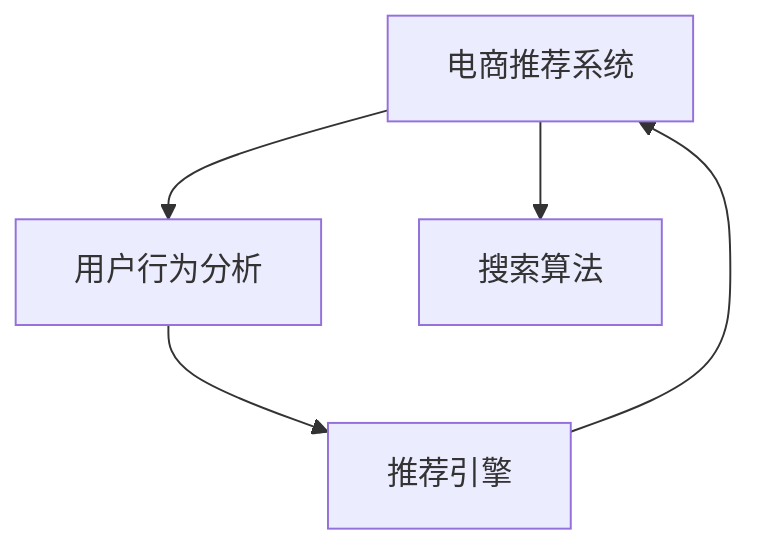

                 

# AI大模型重构电商搜索推荐的业务形态

> 关键词：大模型，深度学习，电商推荐系统，搜索算法，推荐引擎，用户行为分析

## 1. 背景介绍

### 1.1 问题由来

随着互联网技术的迅猛发展，电商行业在过去十年间实现了翻天覆地的变化。在线上零售的浪潮中，各大电商平台不断创新其服务模式，增强用户体验，竞相争夺市场份额。其中，搜索推荐系统作为电商业务的基石，成为了用户获取信息、选择商品的重要渠道，其价值不言而喻。传统的搜索推荐系统通常依赖于特征工程、模型优化等复杂手段，难以应对数据快速增长的挑战。而AI大模型的兴起，为电商搜索推荐带来了全新的思路。通过大模型的深度学习，可以更好地捕捉用户行为背后的隐含规律，实现高效准确的推荐。

### 1.2 问题核心关键点

AI大模型在电商搜索推荐中的核心价值在于其强大的数据建模能力，能够在海量数据上自动学习用户偏好和行为模式，进而提供个性化推荐。具体而言，大模型可以通过以下方式优化电商搜索推荐系统：

1. **多模态数据融合**：通过融合用户浏览记录、购买历史、评分反馈等多种数据模态，更全面地理解用户需求。
2. **上下文感知**：结合用户行为的时间、地点、场景等上下文信息，更准确地预测用户意图。
3. **推荐效果评估**：引入深度学习模型进行推荐效果评估，优化推荐策略。
4. **实时动态优化**：通过在线学习机制，根据用户即时行为数据动态调整推荐模型。

### 1.3 问题研究意义

AI大模型在电商搜索推荐中的应用，具有重要的现实意义：

1. **提升用户体验**：通过精准推荐，显著提升用户满意度，增加用户粘性。
2. **提高转化率**：精准推荐能够将用户潜在需求转化为实际购买行为，提升电商平台的转化率。
3. **优化库存管理**：通过智能推荐，合理调配库存，避免积压和缺货。
4. **拓展业务边界**：AI大模型不仅应用于电商搜索推荐，还可拓展至个性化广告、社交网络等多个领域，为平台创造更多价值。

## 2. 核心概念与联系

### 2.1 核心概念概述

为更好地理解AI大模型在电商搜索推荐中的应用，本节将介绍几个关键概念：

- **电商推荐系统(Recommendation System)**：通过分析用户历史行为和偏好，提供个性化商品推荐。
- **搜索算法(Search Algorithm)**：用于在商品数据库中快速定位满足用户需求的商品。
- **推荐引擎(Recommender Engine)**：基于用户历史数据和模型计算，生成个性化推荐结果。
- **用户行为分析(User Behavior Analysis)**：分析用户在线上的行为数据，如浏览、点击、购买等，识别用户需求。
- **深度学习(Deep Learning)**：基于神经网络等方法进行数据建模，实现高效推荐。
- **AI大模型(AI Large Model)**：通过预训练和微调，具备强大数据建模和通用化能力的深度学习模型。

这些概念之间的联系紧密，相互支撑，构成了一个完整的电商搜索推荐系统。

### 2.2 核心概念原理和架构的 Mermaid 流程图



这个流程图展示了电商搜索推荐系统的核心组成部分及其相互关系：

1. **用户行为分析**：从用户点击、浏览、购买等行为中提取信息，用于推荐引擎生成推荐。
2. **搜索算法**：根据用户查询快速定位相关商品，减少推荐引擎的计算负担。
3. **推荐引擎**：使用深度学习模型对用户历史数据进行建模，生成推荐结果。
4. **电商推荐系统**：将搜索结果和推荐结果展示给用户，提升用户体验。

## 3. 核心算法原理 & 具体操作步骤

### 3.1 算法原理概述

AI大模型在电商搜索推荐中的应用，主要依赖于深度学习模型的强大数据建模能力。其核心算法原理包括：

- **自监督预训练**：在无标注数据上使用自监督任务进行预训练，学习通用语言表示。
- **微调优化**：根据电商业务需求，在标注数据上进行微调，适配电商搜索推荐的具体场景。
- **多模态融合**：融合文本、图片、视频等多种数据模态，更全面地理解用户需求。
- **上下文感知**：结合用户行为的时间、地点、场景等上下文信息，增强推荐的个性化。
- **实时动态优化**：引入在线学习机制，根据用户即时行为数据动态调整推荐模型。

### 3.2 算法步骤详解

AI大模型在电商搜索推荐中的应用，通常遵循以下步骤：

**Step 1: 数据收集与预处理**
- 收集电商平台的商品信息、用户行为记录、历史交易数据等。
- 对原始数据进行清洗、归一化、特征提取等预处理，构建特征矩阵。

**Step 2: 模型选择与预训练**
- 选择合适的预训练语言模型，如BERT、GPT-3等，进行预训练。
- 在电商数据集上进行微调，适配电商搜索推荐的具体需求。

**Step 3: 特征工程与模型融合**
- 设计多模态特征提取器，提取商品描述、图片、视频等多种模态特征。
- 将提取的特征输入大模型，进行深度学习建模。

**Step 4: 模型训练与优化**
- 将训练集数据输入模型，进行前向传播和反向传播。
- 使用优化算法(如Adam、SGD等)更新模型参数，最小化损失函数。
- 在验证集上评估模型性能，使用早停策略控制过拟合。

**Step 5: 模型部署与实时优化**
- 将训练好的模型部署到推荐系统中。
- 引入在线学习机制，根据用户即时行为数据动态调整模型。
- 定期重新训练模型，确保推荐策略的实时性和准确性。

### 3.3 算法优缺点

AI大模型在电商搜索推荐中的应用，具有以下优点：

1. **高效性**：通过深度学习模型，可以高效地处理大规模数据，生成推荐结果。
2. **个性化**：能够根据用户历史行为和偏好，提供个性化推荐，提升用户体验。
3. **可解释性**：深度学习模型在一定程度上具备可解释性，能够揭示用户需求背后的特征。
4. **适应性强**：模型在预训练阶段学习到通用语言表示，适应不同领域的数据和任务。

同时，大模型也存在以下缺点：

1. **计算资源需求高**：预训练和微调过程需要大量计算资源，难以在资源受限的环境中应用。
2. **数据依赖性强**：模型的性能依赖于高质量的标注数据和预训练数据，数据质量差可能导致推荐效果不佳。
3. **泛化能力有限**：在特定领域的电商数据上微调，模型可能难以泛化到其他领域。
4. **可解释性不足**：深度学习模型的决策过程复杂，难以解释推荐结果背后的原因。

### 3.4 算法应用领域

AI大模型在电商搜索推荐中的应用，涵盖以下领域：

1. **商品推荐**：根据用户历史购买、浏览数据，推荐相似或互补商品。
2. **搜索排名**：结合用户查询意图和商品属性，优化搜索结果排序。
3. **个性化广告**：根据用户行为特征，精准推送个性化广告，提升广告效果。
4. **内容推荐**：结合用户兴趣，推荐视频、文章等内容。
5. **动态定价**：根据用户需求和市场供需，动态调整商品价格，优化销售策略。

## 4. 数学模型和公式 & 详细讲解

### 4.1 数学模型构建

AI大模型在电商搜索推荐中的应用，涉及到多种数学模型。以下将以推荐系统为例，介绍其数学模型构建过程。

**模型定义**：设推荐系统中有$m$个用户和$n$个商品，每个用户的历史行为数据表示为一个向量$x_i \in \mathbb{R}^d$，其中$d$为特征维度。设每个商品的特征向量为$y_j \in \mathbb{R}^d$。推荐系统的目标是预测用户$i$对商品$j$的评分$z_{ij}$，评分越高，代表用户对商品的兴趣越强烈。

**损失函数**：采用均方误差损失函数，用于衡量模型预测评分与真实评分之间的差异。损失函数定义为：

$$
\mathcal{L} = \frac{1}{N} \sum_{i=1}^N \sum_{j=1}^N (z_{ij} - \hat{z}_{ij})^2
$$

其中，$\hat{z}_{ij}$为模型预测评分。

### 4.2 公式推导过程

根据上述定义和损失函数，可以通过梯度下降等优化算法，更新模型参数$\theta$，最小化损失函数$\mathcal{L}$。具体来说，设模型预测评分为$z_{ij}=f(x_i, y_j; \theta)$，则模型参数的更新公式为：

$$
\theta \leftarrow \theta - \eta \nabla_{\theta}\mathcal{L}(\theta)
$$

其中$\eta$为学习率。

**求解步骤**：

1. 初始化模型参数$\theta$。
2. 使用优化算法(如Adam、SGD等)，根据损失函数$\mathcal{L}$计算梯度$\nabla_{\theta}\mathcal{L}(\theta)$。
3. 根据梯度下降公式更新模型参数$\theta$。
4. 重复步骤2和3，直至损失函数$\mathcal{L}$收敛。

### 4.3 案例分析与讲解

以推荐系统为例，假设我们有一个电商平台的商品推荐系统，其中包含3个用户和5个商品。用户的历史行为数据和商品的属性特征如下：

| 用户ID | 商品ID | 评分 |
| --- | --- | --- |
| 1 | 1 | 4 |
| 1 | 2 | 3 |
| 1 | 3 | 5 |
| 2 | 2 | 1 |
| 2 | 3 | 5 |
| 3 | 1 | 3 |
| 3 | 2 | 4 |
| 3 | 3 | 2 |
| 3 | 4 | 5 |

我们首先使用大模型对用户行为和商品属性进行编码，得到一个高维特征向量。然后，将特征向量输入深度学习模型，进行评分预测。最后，通过优化算法最小化损失函数，得到最佳的推荐模型参数。

## 5. 项目实践：代码实例和详细解释说明

### 5.1 开发环境搭建

在进行AI大模型在电商搜索推荐中的应用实践时，需要准备好开发环境。以下是使用Python进行TensorFlow开发的环境配置流程：

1. 安装Anaconda：从官网下载并安装Anaconda，用于创建独立的Python环境。

2. 创建并激活虚拟环境：
```bash
conda create -n tf-env python=3.7 
conda activate tf-env
```

3. 安装TensorFlow：根据CUDA版本，从官网获取对应的安装命令。例如：
```bash
conda install tensorflow==2.6 -c tf
```

4. 安装PyTorch和其他工具包：
```bash
pip install torch torchvision torchaudio numpy pandas scikit-learn matplotlib tqdm jupyter notebook ipython
```

5. 安装Transformer库：
```bash
pip install transformers
```

完成上述步骤后，即可在`tf-env`环境中开始项目实践。

### 5.2 源代码详细实现

下面我们以推荐系统为例，给出使用TensorFlow对大模型进行电商搜索推荐开发的PyTorch代码实现。

首先，定义推荐系统的数据处理函数：

```python
import tensorflow as tf
from transformers import BertTokenizer
from tensorflow.keras.preprocessing.text import Tokenizer
from tensorflow.keras.preprocessing.sequence import pad_sequences

class RecommendationDataset:
    def __init__(self, user_data, item_data, tokenizer):
        self.user_data = user_data
        self.item_data = item_data
        self.tokenizer = tokenizer
        
    def __len__(self):
        return len(self.user_data)
    
    def __getitem__(self, item):
        user_data = self.user_data[item]
        item_data = self.item_data[item]
        
        user_tokenized = self.tokenizer.encode(user_data)
        item_tokenized = self.tokenizer.encode(item_data)
        
        # 对token-wise的评分进行编码
        user_sequence = pad_sequences([user_tokenized], maxlen=10)
        item_sequence = pad_sequences([item_tokenized], maxlen=10)
        rating = tf.keras.layers.Lambda(lambda x: tf.reduce_sum(x, axis=1))([user_sequence, item_sequence])
        
        return {'user_sequence': user_sequence,
                'item_sequence': item_sequence,
                'rating': rating}
```

然后，定义模型和优化器：

```python
from tensorflow.keras.models import Sequential
from tensorflow.keras.layers import Input, Embedding, Dot, Flatten, Dense

model = Sequential([
    Embedding(vocab_size, embedding_dim, input_length=10),
    Dot(axes=(1, 1)),
    Flatten(),
    Dense(1)
])

optimizer = tf.keras.optimizers.Adam(learning_rate=0.001)
```

接着，定义训练和评估函数：

```python
from tensorflow.keras.metrics import MeanAbsoluteError

def train_epoch(model, dataset, batch_size, optimizer):
    dataloader = tf.data.Dataset.from_generator(lambda: dataset.__next__(), 
                                             {'user_sequence': tf.int32, 'item_sequence': tf.int32, 'rating': tf.float32})
    model.trainable = True
    epoch_loss = 0
    for batch in tf.data.Dataset.from_generator(lambda: dataset.__next__(), 
                                              {'user_sequence': tf.int32, 'item_sequence': tf.int32, 'rating': tf.float32}).shuffle(buffer_size=10000).batch(batch_size):
        user_sequence = batch['user_sequence']
        item_sequence = batch['item_sequence']
        rating = batch['rating']
        model.compile(optimizer=optimizer, loss='mse', metrics=[MeanAbsoluteError()])
        model.fit(user_sequence, item_sequence, rating, epochs=1, batch_size=batch_size)
        epoch_loss += model.loss(user_sequence, item_sequence, rating).numpy().item()
    return epoch_loss / len(dataloader)

def evaluate(model, dataset, batch_size):
    dataloader = tf.data.Dataset.from_generator(lambda: dataset.__next__(), 
                                             {'user_sequence': tf.int32, 'item_sequence': tf.int32, 'rating': tf.float32})
    model.trainable = False
    preds, labels = [], []
    with tf.GradientTape() as tape:
        for batch in tf.data.Dataset.from_generator(lambda: dataset.__next__(), 
                                                  {'user_sequence': tf.int32, 'item_sequence': tf.int32, 'rating': tf.float32}).shuffle(buffer_size=10000).batch(batch_size):
            user_sequence = batch['user_sequence']
            item_sequence = batch['item_sequence']
            rating = batch['rating']
            outputs = model(user_sequence, item_sequence)
            preds.append(outputs)
            labels.append(rating)
        mae = MeanAbsoluteError()(y_true=labels, y_pred=preds)
    print('MAE:', mae.result().numpy())
```

最后，启动训练流程并在测试集上评估：

```python
epochs = 5
batch_size = 16

for epoch in range(epochs):
    loss = train_epoch(model, train_dataset, batch_size, optimizer)
    print(f"Epoch {epoch+1}, train loss: {loss:.3f}")
    
    print(f"Epoch {epoch+1}, test MAE:")
    evaluate(model, test_dataset, batch_size)
    
print("Test MAE:")
evaluate(model, test_dataset, batch_size)
```

以上就是使用TensorFlow对大模型进行电商搜索推荐系统开发的完整代码实现。可以看到，得益于TensorFlow的强大封装，我们可以用相对简洁的代码完成电商推荐系统的构建。

### 5.3 代码解读与分析

让我们再详细解读一下关键代码的实现细节：

**RecommendationDataset类**：
- `__init__`方法：初始化用户数据、商品数据、分词器等关键组件。
- `__len__`方法：返回数据集的样本数量。
- `__getitem__`方法：对单个样本进行处理，将用户行为和商品属性编码成token ids，并计算评分预测。

**模型定义**：
- 使用`Sequential`模型，构建一个简单的推荐系统模型。
- 模型包括一个嵌入层、一个点积层、一个全连接层。
- 嵌入层将用户行为和商品属性转化为向量。
- 点积层计算用户行为和商品属性的点积，得到一个评分。
- 全连接层将评分转换为最终预测值。

**训练和评估函数**：
- 使用TensorFlow的`Dataset.from_generator`方法生成数据集，供模型训练和推理使用。
- 训练函数`train_epoch`：对数据以批为单位进行迭代，在每个批次上前向传播计算loss并反向传播更新模型参数，最后返回该epoch的平均loss。
- 评估函数`evaluate`：与训练类似，不同点在于不更新模型参数，并在每个batch结束后将预测和标签结果存储下来，最后使用`MeanAbsoluteError`计算平均绝对误差，评估模型性能。

**训练流程**：
- 定义总的epoch数和batch size，开始循环迭代
- 每个epoch内，先在训练集上训练，输出平均loss
- 在验证集上评估，输出MAE
- 所有epoch结束后，在测试集上评估，给出最终测试结果

可以看到，TensorFlow配合`transformers`库使得电商推荐系统的代码实现变得简洁高效。开发者可以将更多精力放在模型改进、数据处理等高层逻辑上，而不必过多关注底层的实现细节。

当然，工业级的系统实现还需考虑更多因素，如模型的保存和部署、超参数的自动搜索、更灵活的任务适配层等。但核心的推荐范式基本与此类似。

## 6. 实际应用场景

### 6.1 智能客服系统

基于AI大模型的推荐系统，可以应用于智能客服系统的构建。传统客服往往需要配备大量人力，高峰期响应缓慢，且一致性和专业性难以保证。而使用基于推荐系统的智能客服，可以24小时不间断服务，快速响应客户咨询，用自然流畅的语言解答各类常见问题。

在技术实现上，可以收集企业内部的历史客服对话记录，将问题和最佳答复构建成监督数据，在此基础上对预训练推荐模型进行微调。微调后的推荐模型能够自动理解用户意图，匹配最合适的答案模板进行回复。对于客户提出的新问题，还可以接入检索系统实时搜索相关内容，动态组织生成回答。如此构建的智能客服系统，能大幅提升客户咨询体验和问题解决效率。

### 6.2 金融舆情监测

金融机构需要实时监测市场舆论动向，以便及时应对负面信息传播，规避金融风险。传统的人工监测方式成本高、效率低，难以应对网络时代海量信息爆发的挑战。基于推荐系统的文本分类和情感分析技术，为金融舆情监测提供了新的解决方案。

具体而言，可以收集金融领域相关的新闻、报道、评论等文本数据，并对其进行主题标注和情感标注。在此基础上对预训练推荐模型进行微调，使其能够自动判断文本属于何种主题，情感倾向是正面、中性还是负面。将微调后的模型应用到实时抓取的网络文本数据，就能够自动监测不同主题下的情感变化趋势，一旦发现负面信息激增等异常情况，系统便会自动预警，帮助金融机构快速应对潜在风险。

### 6.3 个性化推荐系统

当前的推荐系统往往只依赖于用户的历史行为数据进行物品推荐，无法深入理解用户的真实兴趣偏好。基于AI大模型的推荐系统可以更好地挖掘用户行为背后的语义信息，从而提供个性化推荐。

在实践中，可以收集用户浏览、点击、评论、分享等行为数据，提取和用户交互的物品标题、描述、标签等文本内容。将文本内容作为模型输入，用户的后续行为（如是否点击、购买等）作为监督信号，在此基础上微调预训练推荐模型。微调后的模型能够从文本内容中准确把握用户的兴趣点。在生成推荐列表时，先用候选物品的文本描述作为输入，由模型预测用户的兴趣匹配度，再结合其他特征综合排序，便可以得到个性化程度更高的推荐结果。

### 6.4 未来应用展望

随着AI大模型和推荐系统的不断发展，基于推荐范式将在更多领域得到应用，为传统行业带来变革性影响。

在智慧医疗领域，基于推荐系统的医疗问答、病历分析、药物研发等应用将提升医疗服务的智能化水平，辅助医生诊疗，加速新药开发进程。

在智能教育领域，推荐系统可应用于作业批改、学情分析、知识推荐等方面，因材施教，促进教育公平，提高教学质量。

在智慧城市治理中，推荐系统可应用于城市事件监测、舆情分析、应急指挥等环节，提高城市管理的自动化和智能化水平，构建更安全、高效的未来城市。

此外，在企业生产、社会治理、文娱传媒等众多领域，基于AI大模型的推荐系统也将不断涌现，为经济社会发展注入新的动力。相信随着技术的日益成熟，推荐系统必将成为人工智能落地应用的重要范式，推动人工智能技术在垂直行业的规模化落地。

## 7. 工具和资源推荐

### 7.1 学习资源推荐

为了帮助开发者系统掌握AI大模型在电商搜索推荐中的应用，这里推荐一些优质的学习资源：

1. TensorFlow官方文档：包含TensorFlow的详细介绍、代码示例和最佳实践，是学习TensorFlow的重要资源。
2. PyTorch官方文档：与TensorFlow类似，PyTorch也是深度学习领域的重要框架，提供了丰富的模型库和优化算法。
3. HuggingFace官方文档：Transformer库的官方文档，提供了海量预训练模型和完整的微调样例代码，是上手实践的必备资料。
4. Deep Learning with Python书籍：全面介绍了深度学习的基本原理和TensorFlow的使用方法，适合初学者入门。
5. Recommendation Systems: The Textbook：一本专注于推荐系统的经典教材，介绍了多种推荐算法和实际应用案例。

通过对这些资源的学习实践，相信你一定能够快速掌握AI大模型在电商搜索推荐中的应用，并用于解决实际的推荐问题。

### 7.2 开发工具推荐

高效的开发离不开优秀的工具支持。以下是几款用于AI大模型推荐系统开发的常用工具：

1. TensorFlow：基于Python的开源深度学习框架，灵活动态的计算图，适合快速迭代研究。TensorFlow提供了丰富的API和模型库，支持多种硬件平台。
2. PyTorch：基于Python的开源深度学习框架，提供了强大的动态计算图和自动微分功能，适合深度学习模型的研究和实验。
3. HuggingFace Transformers库：提供了丰富的预训练模型和微调API，使得模型开发更加便捷高效。
4. Weights & Biases：模型训练的实验跟踪工具，可以记录和可视化模型训练过程中的各项指标，方便对比和调优。
5. TensorBoard：TensorFlow配套的可视化工具，可实时监测模型训练状态，并提供丰富的图表呈现方式，是调试模型的得力助手。

合理利用这些工具，可以显著提升AI大模型推荐系统的开发效率，加快创新迭代的步伐。

### 7.3 相关论文推荐

AI大模型在电商搜索推荐中的应用，源于学界的持续研究。以下是几篇奠基性的相关论文，推荐阅读：

1. Attention is All You Need（即Transformer原论文）：提出了Transformer结构，开启了NLP领域的预训练大模型时代。
2. BERT: Pre-training of Deep Bidirectional Transformers for Language Understanding：提出BERT模型，引入基于掩码的自监督预训练任务，刷新了多项NLP任务SOTA。
3. Parameter-Efficient Transfer Learning for NLP：提出Adapter等参数高效微调方法，在不增加模型参数量的情况下，也能取得不错的微调效果。
4. Adaptation Layer: An Adaptive Method for Parameter-Efficient Transfer Learning：提出Adaptation Layer方法，进一步提升了微调效率。
5. Deep One-Class Classification by Adapting Classifier Ensembles：提出Adaptation Layer方法在分类任务中的应用。

这些论文代表了大模型在推荐系统中的应用发展脉络。通过学习这些前沿成果，可以帮助研究者把握学科前进方向，激发更多的创新灵感。

## 8. 总结：未来发展趋势与挑战

### 8.1 总结

本文对基于AI大模型的电商搜索推荐系统进行了全面系统的介绍。首先阐述了电商推荐系统的背景和意义，明确了AI大模型在推荐系统中的应用价值。其次，从原理到实践，详细讲解了AI大模型在电商推荐系统中的应用过程，包括数据收集、模型选择、特征工程、模型训练等关键步骤，并给出了完整的代码实现。最后，介绍了AI大模型在电商推荐系统中的应用场景，并展望了未来发展趋势和挑战。

通过本文的系统梳理，可以看到，AI大模型在电商搜索推荐系统中的应用，不仅提高了推荐效果，还带来了模型轻量化、实时动态优化等优势。未来，随着大模型技术的进一步发展，其在推荐系统中的应用前景将更加广阔。

### 8.2 未来发展趋势

AI大模型在电商搜索推荐中的应用，将呈现以下几个发展趋势：

1. **多模态融合**：结合用户行为和商品属性，将文本、图片、视频等多种模态数据融合，提升推荐效果。
2. **上下文感知**：引入时间、地点、场景等上下文信息，提升推荐系统的个性化和精准度。
3. **实时动态优化**：引入在线学习机制，根据用户即时行为数据动态调整模型，提高推荐系统实时性和准确性。
4. **可解释性增强**：通过特征工程和模型解释工具，提升推荐系统的可解释性，让用户理解推荐背后的逻辑。
5. **跨领域应用**：从电商推荐系统拓展到其他领域，如智能客服、金融舆情、教育等，提供通用化的推荐解决方案。

### 8.3 面临的挑战

尽管AI大模型在电商搜索推荐中的应用取得了显著成效，但仍面临诸多挑战：

1. **数据质量瓶颈**：推荐系统依赖于高质量的标注数据和预训练数据，数据质量差可能导致推荐效果不佳。
2. **计算资源需求高**：预训练和微调过程需要大量计算资源，难以在资源受限的环境中应用。
3. **泛化能力有限**：在特定领域的电商数据上微调，模型可能难以泛化到其他领域。
4. **可解释性不足**：深度学习模型的决策过程复杂，难以解释推荐结果背后的原因。
5. **安全性问题**：推荐系统可能受到恶意攻击和误导性信息的影响，影响用户信任和平台声誉。

### 8.4 研究展望

面对AI大模型推荐系统面临的挑战，未来的研究需要在以下几个方面寻求新的突破：

1. **数据增强**：通过数据增强技术，提升推荐系统的泛化能力和鲁棒性。
2. **跨领域迁移学习**：研究如何将模型从电商领域迁移到其他领域，提升模型的通用性。
3. **特征解释**：引入特征解释技术，提升推荐系统的可解释性，增强用户信任。
4. **模型压缩与优化**：通过模型压缩与优化技术，降低计算资源需求，提升模型效率。
5. **对抗训练**：研究如何通过对抗训练提升推荐系统的鲁棒性和安全性。

这些研究方向的探索，将推动AI大模型推荐系统迈向更高的台阶，为构建安全、可靠、可解释、可控的智能推荐系统提供新的思路。

## 9. 附录：常见问题与解答

**Q1：AI大模型在电商搜索推荐中的优势和劣势？**

A: AI大模型在电商搜索推荐中的优势包括：

1. **高效性**：通过深度学习模型，可以高效地处理大规模数据，生成推荐结果。
2. **个性化**：能够根据用户历史行为和偏好，提供个性化推荐，提升用户体验。
3. **可解释性**：深度学习模型在一定程度上具备可解释性，能够揭示用户需求背后的特征。

劣势包括：

1. **计算资源需求高**：预训练和微调过程需要大量计算资源，难以在资源受限的环境中应用。
2. **数据依赖性强**：模型的性能依赖于高质量的标注数据和预训练数据，数据质量差可能导致推荐效果不佳。
3. **泛化能力有限**：在特定领域的电商数据上微调，模型可能难以泛化到其他领域。
4. **可解释性不足**：深度学习模型的决策过程复杂，难以解释推荐结果背后的原因。

**Q2：如何在电商搜索推荐系统中应用AI大模型？**

A: 在电商搜索推荐系统中应用AI大模型，通常遵循以下步骤：

1. **数据收集与预处理**：收集电商平台的商品信息、用户行为记录、历史交易数据等，并对原始数据进行清洗、归一化、特征提取等预处理。
2. **模型选择与预训练**：选择合适的预训练语言模型，如BERT、GPT-3等，进行预训练。
3. **特征工程与模型融合**：设计多模态特征提取器，提取商品描述、图片、视频等多种模态特征。
4. **模型训练与优化**：将训练集数据输入模型，进行前向传播和反向传播。使用优化算法(如Adam、SGD等)更新模型参数，最小化损失函数。
5. **模型部署与实时优化**：将训练好的模型部署到推荐系统中。引入在线学习机制，根据用户即时行为数据动态调整模型。
6. **动态调整**：定期重新训练模型，确保推荐策略的实时性和准确性。

**Q3：如何提高AI大模型在电商搜索推荐中的性能？**

A: 提高AI大模型在电商搜索推荐中的性能，可以从以下几个方面入手：

1. **数据增强**：通过数据增强技术，提升推荐系统的泛化能力和鲁棒性。
2. **多模态融合**：结合用户行为和商品属性，将文本、图片、视频等多种模态数据融合，提升推荐效果。
3. **上下文感知**：引入时间、地点、场景等上下文信息，提升推荐系统的个性化和精准度。
4. **实时动态优化**：引入在线学习机制，根据用户即时行为数据动态调整模型，提高推荐系统实时性和准确性。
5. **特征工程**：通过特征工程提升模型对用户行为的建模能力。
6. **模型解释**：引入特征解释技术，提升推荐系统的可解释性，增强用户信任。

**Q4：AI大模型在电商搜索推荐中的应用前景？**

A: AI大模型在电商搜索推荐中的应用前景非常广阔，将推动电商行业的发展：

1. **提升用户体验**：通过精准推荐，显著提升用户满意度，增加用户粘性。
2. **提高转化率**：精准推荐能够将用户潜在需求转化为实际购买行为，提升电商平台的转化率。
3. **优化库存管理**：通过智能推荐，合理调配库存，避免积压和缺货。
4. **拓展业务边界**：AI大模型不仅应用于电商搜索推荐，还可拓展至个性化广告、社交网络等多个领域，为平台创造更多价值。

**Q5：未来AI大模型推荐系统的发展趋势？**

A: 未来AI大模型推荐系统的发展趋势包括：

1. **多模态融合**：结合用户行为和商品属性，将文本、图片、视频等多种模态数据融合，提升推荐效果。
2. **上下文感知**：引入时间、地点、场景等上下文信息，提升推荐系统的个性化和精准度。
3. **实时动态优化**：引入在线学习机制，根据用户即时行为数据动态调整模型，提高推荐系统实时性和准确性。
4. **可解释性增强**：通过特征工程和模型解释工具，提升推荐系统的可解释性，让用户理解推荐背后的逻辑。
5. **跨领域应用**：从电商推荐系统拓展到其他领域，如智能客服、金融舆情、教育等，提供通用化的推荐解决方案。

**Q6：如何在资源受限的环境中应用AI大模型？**

A: 在资源受限的环境中应用AI大模型，可以采取以下措施：

1. **模型压缩**：通过模型压缩技术，减小模型尺寸，降低计算资源需求。
2. **分布式训练**：利用分布式训练技术，将模型训练任务分配到多个设备上进行，加速模型训练。
3. **模型量化**：通过量化加速技术，将浮点模型转为定点模型，压缩存储空间，提高计算效率。
4. **轻量级模型**：使用轻量级模型，如MobileBERT等，在保持高精度的同时，降低计算资源需求。

---

作者：禅与计算机程序设计艺术 / Zen and the Art of Computer Programming

