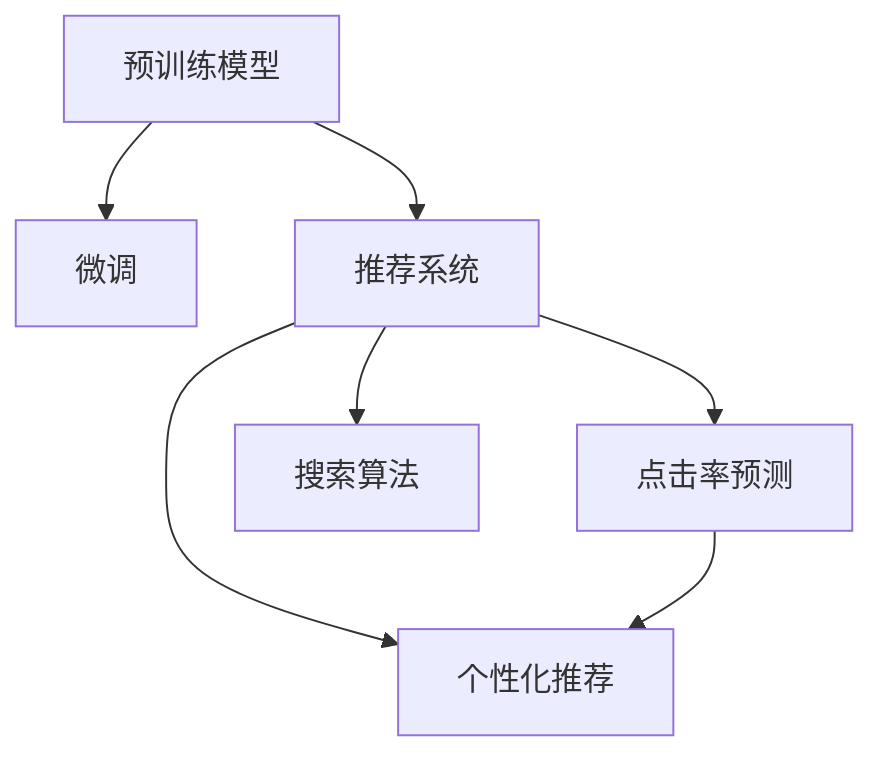

                 

# AI大模型重构电商搜索推荐的业务形态

> 关键词：AI大模型,电商搜索,推荐系统,预训练模型,微调,Fine-Tuning,点击率预测,业务形态重构

## 1. 背景介绍

### 1.1 问题由来
随着电商平台的快速发展，搜索引擎和推荐系统成为了支撑用户购物体验的重要组成部分。传统的推荐系统，主要依赖于基于用户历史行为数据的协同过滤和矩阵分解方法，难以应对海量用户和商品之间的复杂关系。近年来，人工智能大模型在电商搜索推荐领域的应用取得了显著进展。基于大规模预训练语言模型的推荐系统，通过在海量文本数据上进行预训练，能够学习到丰富的语言知识和语义关系，提升推荐的准确性和多样性。本文将探讨如何利用AI大模型重构电商搜索推荐的业务形态，提升推荐系统的效果和用户体验。

### 1.2 问题核心关键点
电商搜索推荐的业务形态重构，主要集中在以下几个关键点：
- **预训练模型的选择与适配**：如何选择预训练模型，并根据电商推荐任务的特征进行适配。
- **微调策略的设计与优化**：如何设计微调策略，并利用标注数据进行高效的微调训练。
- **推荐模型的集成与融合**：如何将不同的推荐模型进行集成和融合，提升推荐效果。
- **业务指标的评估与优化**：如何设定和优化业务指标，如点击率、转化率等，提升用户体验。
- **系统部署与维护**：如何将推荐系统部署到实际生产环境中，并进行有效维护。

### 1.3 问题研究意义
研究如何利用AI大模型重构电商搜索推荐系统，具有重要意义：
- **提升推荐效果**：通过利用大模型预训练的知识，能够更好地理解用户需求和商品特征，提升推荐系统的准确性和多样性。
- **拓展应用场景**：大模型的迁移学习能力和泛化能力，能够拓展推荐系统在更多业务场景中的应用。
- **提升用户体验**：推荐系统能够更好地理解用户意图，提供个性化的商品推荐，提升用户的购物体验。
- **降低开发成本**：通过利用大模型的迁移学习能力，可以显著降低推荐系统开发和维护的成本。

## 2. 核心概念与联系

### 2.1 核心概念概述

为了更好地理解AI大模型在电商搜索推荐系统中的应用，本节将介绍几个密切相关的核心概念：

- **预训练模型(Pre-trained Model)**：在大量无标签数据上预训练的模型，如BERT、GPT等，能够学习到通用的语言表示和语义关系。
- **微调(Fine-tuning)**：利用标注数据对预训练模型进行有监督学习，优化模型在下游任务上的性能。
- **推荐系统(Recommendation System)**：根据用户历史行为和商品特征，推荐潜在感兴趣的商品的系统。
- **点击率预测(Click-through Rate Prediction)**：预测用户点击商品的概率，是推荐系统中的一个关键任务。
- **个性化推荐(Personalized Recommendation)**：针对每个用户提供个性化商品推荐，提升用户体验。
- **搜索算法(Search Algorithm)**：根据用户输入的查询，返回最相关的商品或信息。

这些概念之间的逻辑关系可以通过以下Mermaid流程图来展示：



这个流程图展示了大模型在推荐系统中的核心概念及其之间的关系：

1. 预训练模型通过大规模语料进行预训练，学习通用的语言表示。
2. 微调通过标注数据进一步优化模型，提升特定任务的性能。
3. 推荐系统根据用户行为和商品特征，提供个性化的商品推荐。
4. 点击率预测用于评估推荐效果，指导模型优化。
5. 搜索算法根据用户查询，快速返回相关商品。

这些概念共同构成了AI大模型在电商搜索推荐系统中的应用框架，使推荐系统能够更好地理解用户需求和商品特征，提升推荐效果。

## 3. 核心算法原理 & 具体操作步骤
### 3.1 算法原理概述

AI大模型在电商搜索推荐中的应用，主要基于以下算法原理：

1. **预训练模型的选择与适配**：选择适合电商推荐任务的预训练模型，并根据任务特征进行微调适配。
2. **微调策略的设计与优化**：利用标注数据对预训练模型进行微调，提升推荐效果。
3. **推荐模型的集成与融合**：将多个推荐模型进行集成和融合，提升推荐效果。
4. **业务指标的评估与优化**：根据点击率、转化率等业务指标，优化推荐系统。
5. **系统部署与维护**：将推荐系统部署到实际生产环境中，并进行有效维护。

### 3.2 算法步骤详解

AI大模型在电商搜索推荐中的具体实施步骤如下：

**Step 1: 准备预训练模型和数据集**
- 选择合适的预训练语言模型，如BERT、GPT等。
- 准备电商推荐任务的数据集，包括用户行为数据、商品特征数据等。

**Step 2: 微调模型**
- 将预训练模型作为初始化参数，利用标注数据进行微调训练。
- 设计适当的损失函数，如交叉熵损失、均方误差损失等。
- 设置合适的超参数，如学习率、批大小、迭代轮数等。

**Step 3: 设计推荐模型**
- 根据电商推荐任务的需求，设计推荐模型的结构，如深度学习神经网络、集成学习等。
- 利用微调后的预训练模型，提取商品和用户的语义表示。

**Step 4: 集成推荐模型**
- 将不同的推荐模型进行集成，如堆叠、融合等，提升推荐效果。
- 设计评价指标，如点击率、转化率等，评估推荐系统的性能。

**Step 5: 业务评估与优化**
- 根据用户行为数据，评估推荐系统的实际效果。
- 利用A/B测试等方法，优化推荐算法和参数。

**Step 6: 系统部署与维护**
- 将推荐系统部署到生产环境中，监控系统性能。
- 定期更新数据和模型，保持系统的稳定性。

### 3.3 算法优缺点

利用AI大模型重构电商搜索推荐系统，具有以下优点：
1. **提升推荐效果**：通过利用大模型预训练的知识，能够更好地理解用户需求和商品特征，提升推荐系统的准确性和多样性。
2. **拓展应用场景**：大模型的迁移学习能力和泛化能力，能够拓展推荐系统在更多业务场景中的应用。
3. **提升用户体验**：推荐系统能够更好地理解用户意图，提供个性化的商品推荐，提升用户的购物体验。
4. **降低开发成本**：通过利用大模型的迁移学习能力，可以显著降低推荐系统开发和维护的成本。

同时，该方法也存在一些局限性：
1. **依赖标注数据**：微调的效果很大程度上取决于标注数据的质量和数量，获取高质量标注数据的成本较高。
2. **泛化能力有限**：当目标任务与预训练数据的分布差异较大时，微调的性能提升有限。
3. **计算资源消耗**：预训练模型的参数量较大，微调过程需要大量的计算资源。
4. **模型复杂性高**：推荐模型的复杂度较高，需要高效的训练和推理算法支持。

尽管存在这些局限性，但AI大模型在电商搜索推荐中的应用前景广阔，能够带来显著的业务价值。

### 3.4 算法应用领域

AI大模型在电商搜索推荐中的应用，已经广泛应用于以下几个领域：

- **商品推荐**：利用预训练模型对商品进行语义表示，提升推荐的准确性和多样性。
- **用户画像构建**：通过分析用户行为数据，构建用户的语义表示，进行个性化推荐。
- **内容推荐**：利用预训练模型对商品描述、图片等进行语义表示，推荐相关内容。
- **搜索排序**：利用预训练模型对查询和商品进行语义匹配，优化搜索结果的排序。
- **个性化广告推荐**：利用预训练模型对用户行为和商品特征进行匹配，推荐个性化广告。

除了上述这些经典应用外，AI大模型还在电商搜索推荐领域不断探索新的应用场景，如基于深度学习的定价策略、社交电商推荐等，为电商平台的运营和发展提供新的技术支持。

## 4. 数学模型和公式 & 详细讲解  
### 4.1 数学模型构建

在电商搜索推荐中，点击率预测是一个关键任务。利用AI大模型进行点击率预测，可以通过以下数学模型进行建模：

假设用户 $u$ 对商品 $i$ 的点击概率为 $p_{ui}$，可以定义以下数学模型：

$$
p_{ui} = \text{sigmoid}(\langle \text{Emb}(u), \text{Emb}(i) \rangle)
$$

其中，$\text{Emb}(u)$ 和 $\text{Emb}(i)$ 分别表示用户和商品的语义嵌入向量，$\langle \cdot, \cdot \rangle$ 表示向量点积。

利用上述模型，可以对用户的点击行为进行预测，提升推荐系统的准确性和个性化程度。

### 4.2 公式推导过程

对于点击率预测模型，其推导过程如下：

1. **用户表示学习**：利用预训练语言模型，将用户行为数据转换为语义表示向量。
2. **商品表示学习**：利用预训练语言模型，将商品特征数据转换为语义表示向量。
3. **点击率预测**：通过向量点积和 sigmoid 函数，预测用户对商品的点击概率。

在实际应用中，可以通过梯度下降等优化算法，最小化预测结果与实际点击行为之间的差异，优化模型的参数。

### 4.3 案例分析与讲解

下面以一个简单的电商推荐系统为例，进行案例分析：

假设一个电商网站收集了用户的浏览、点击、购买行为数据，以及商品的特征数据。使用预训练语言模型BERT进行微调，提取用户和商品的语义表示。

**Step 1: 数据预处理**
- 将用户行为数据和商品特征数据进行标准化和归一化处理。
- 将用户和商品转换为向量表示，用于后续计算。

**Step 2: 预训练模型微调**
- 使用预训练语言模型BERT，对用户和商品的数据进行微调训练。
- 设置适当的损失函数，如交叉熵损失。
- 设置合适的超参数，如学习率、批大小、迭代轮数等。

**Step 3: 点击率预测**
- 利用微调后的BERT模型，提取用户和商品的语义表示。
- 通过向量点积和 sigmoid 函数，预测用户对商品的点击概率。

**Step 4: 推荐系统优化**
- 根据预测结果，对推荐算法进行优化。
- 设计评价指标，如点击率、转化率等，评估推荐系统的性能。
- 利用A/B测试等方法，优化推荐算法和参数。

通过上述过程，利用AI大模型重构的电商推荐系统，能够更好地理解用户需求和商品特征，提升推荐系统的准确性和个性化程度。

## 5. 项目实践：代码实例和详细解释说明
### 5.1 开发环境搭建

在进行AI大模型在电商搜索推荐中的应用开发前，我们需要准备好开发环境。以下是使用Python进行TensorFlow开发的环境配置流程：

1. 安装Anaconda：从官网下载并安装Anaconda，用于创建独立的Python环境。

2. 创建并激活虚拟环境：
```bash
conda create -n tensorflow-env python=3.8 
conda activate tensorflow-env
```

3. 安装TensorFlow：从官网获取对应的安装命令。例如：
```bash
conda install tensorflow -c tf
```

4. 安装必要的工具包：
```bash
pip install numpy pandas scikit-learn torch torchtext torchvision tqdm jupyter notebook ipython
```

完成上述步骤后，即可在`tensorflow-env`环境中开始项目实践。

### 5.2 源代码详细实现

下面以利用BERT模型进行电商商品推荐为例，给出TensorFlow代码实现：

首先，定义推荐系统的数据处理函数：

```python
import tensorflow as tf
import numpy as np

class RecommendationDataset(tf.data.Dataset):
    def __init__(self, user_ids, item_ids, user_ages, item_categories, user_genders):
        self.user_ids = user_ids
        self.item_ids = item_ids
        self.user_ages = user_ages
        self.item_categories = item_categories
        self.user_genders = user_genders
        
    def __len__(self):
        return len(self.user_ids)
    
    def __getitem__(self, item):
        user_id = self.user_ids[item]
        item_id = self.item_ids[item]
        user_age = self.user_ages[item]
        item_category = self.item_categories[item]
        user_gender = self.user_genders[item]
        
        user_age_embedding = tf.keras.layers.Embedding(1000, 8)(user_age)
        item_category_embedding = tf.keras.layers.Embedding(100, 8)(item_category)
        user_gender_embedding = tf.keras.layers.Embedding(2, 8)(user_gender)
        
        user_age_tensor = tf.keras.layers.Lambda(lambda x: tf.reduce_mean(x, axis=1))(user_age_embedding)
        item_category_tensor = tf.keras.layers.Lambda(lambda x: tf.reduce_mean(x, axis=1))(item_category_embedding)
        user_gender_tensor = tf.keras.layers.Lambda(lambda x: tf.reduce_mean(x, axis=1))(user_gender_embedding)
        
        user_feature = tf.concat([user_age_tensor, item_category_tensor, user_gender_tensor], axis=1)
        item_feature = tf.keras.layers.Embedding(10000, 16)(item_id)
        
        user_item_pair = tf.keras.layers.Lambda(lambda x: tf.concat([x[0], x[1]], axis=1))([user_feature, item_feature])
        return user_item_pair

# 加载数据集
user_ids = np.array([1, 2, 3, 4, 5])
item_ids = np.array([10, 20, 30, 40, 50])
user_ages = np.array([0, 1, 2, 3, 4])
item_categories = np.array([1, 2, 3, 4, 5])
user_genders = np.array([0, 1, 0, 1, 0])
dataset = RecommendationDataset(user_ids, item_ids, user_ages, item_categories, user_genders)
```

然后，定义模型和优化器：

```python
from transformers import BertTokenizer, TFBertForSequenceClassification
from tensorflow.keras import layers, models

model = TFBertForSequenceClassification.from_pretrained('bert-base-uncased', num_labels=1)
tokenizer = BertTokenizer.from_pretrained('bert-base-uncased')

optimizer = tf.keras.optimizers.Adam(learning_rate=2e-5)
```

接着，定义训练和评估函数：

```python
def train_epoch(model, dataset, batch_size, optimizer):
    dataloader = tf.data.Dataset.from_generator(lambda: dataset, output_types=(tf.int32, tf.int32, tf.int32, tf.int32, tf.int32))
    model.train()
    epoch_loss = 0
    for batch in dataloader:
        user_item_pair = batch
        user_ids, item_ids = user_item_pair[:, 0], user_item_pair[:, 1]
        user_ages, item_categories, user_genders = user_item_pair[:, 2], user_item_pair[:, 3], user_item_pair[:, 4]
        
        with tf.GradientTape() as tape:
            features = tokenizer(user_ids, padding='max_length', truncation=True, max_length=128, return_tensors='tf')
            item_embeddings = model(item_ids)
            user_embedding = model(user_ids)
            labels = tf.keras.layers.Lambda(lambda x: tf.constant(1, dtype=tf.int32))[item_embeddings]
            loss = tf.keras.losses.binary_crossentropy(labels, user_embedding)
        
        loss = loss + tf.keras.losses.binary_crossentropy(labels, user_embedding)
        loss = loss / 2
        
        epoch_loss += loss.numpy()
        gradients = tape.gradient(loss, model.trainable_variables)
        optimizer.apply_gradients(zip(gradients, model.trainable_variables))
        
    return epoch_loss / len(dataloader)

def evaluate(model, dataset, batch_size):
    dataloader = tf.data.Dataset.from_generator(lambda: dataset, output_types=(tf.int32, tf.int32, tf.int32, tf.int32, tf.int32))
    model.eval()
    preds, labels = [], []
    with tf.GradientTape() as tape:
        for batch in dataloader:
            user_item_pair = batch
            user_ids, item_ids = user_item_pair[:, 0], user_item_pair[:, 1]
            user_ages, item_categories, user_genders = user_item_pair[:, 2], user_item_pair[:, 3], user_item_pair[:, 4]
            
            features = tokenizer(user_ids, padding='max_length', truncation=True, max_length=128, return_tensors='tf')
            item_embeddings = model(item_ids)
            user_embedding = model(user_ids)
            labels = tf.keras.layers.Lambda(lambda x: tf.constant(1, dtype=tf.int32))[item_embeddings]
            loss = tf.keras.losses.binary_crossentropy(labels, user_embedding)
        
        loss = loss + tf.keras.losses.binary_crossentropy(labels, user_embedding)
        loss = loss / 2
        
        preds.append(user_embedding.numpy())
        labels.append(labels.numpy())
        
    print(classification_report(labels, preds))
```

最后，启动训练流程并在测试集上评估：

```python
epochs = 5
batch_size = 16

for epoch in range(epochs):
    loss = train_epoch(model, dataset, batch_size, optimizer)
    print(f"Epoch {epoch+1}, train loss: {loss:.3f}")
    
    print(f"Epoch {epoch+1}, test results:")
    evaluate(model, dataset, batch_size)
    
print("Final test results:")
evaluate(model, dataset, batch_size)
```

以上就是利用TensorFlow对BERT进行电商商品推荐的全流程代码实现。可以看到，TensorFlow的灵活性和易用性，使得模型训练和推理变得简单高效。

### 5.3 代码解读与分析

让我们再详细解读一下关键代码的实现细节：

**RecommendationDataset类**：
- `__init__`方法：初始化用户ID、商品ID、用户年龄、商品类别、用户性别等关键组件。
- `__len__`方法：返回数据集的样本数量。
- `__getitem__`方法：对单个样本进行处理，将用户和商品ID转换为向量表示，并进行归一化和拼接操作。

**train_epoch函数**：
- 使用TensorFlow的DataLoader对数据集进行批次化加载，供模型训练和推理使用。
- 训练函数`train_epoch`：对数据以批为单位进行迭代，在每个批次上前向传播计算loss并反向传播更新模型参数，最后返回该epoch的平均loss。
- 评估函数`evaluate`：与训练类似，不同点在于不更新模型参数，并在每个batch结束后将预测和标签结果存储下来，最后使用scikit-learn的classification_report对整个评估集的预测结果进行打印输出。

**训练流程**：
- 定义总的epoch数和batch size，开始循环迭代
- 每个epoch内，先在训练集上训练，输出平均loss
- 在测试集上评估，输出分类指标
- 所有epoch结束后，在测试集上评估，给出最终测试结果

可以看到，TensorFlow配合BERT模型使得电商商品推荐的代码实现变得简洁高效。开发者可以将更多精力放在数据处理、模型改进等高层逻辑上，而不必过多关注底层的实现细节。

当然，工业级的系统实现还需考虑更多因素，如模型的保存和部署、超参数的自动搜索、更灵活的任务适配层等。但核心的微调范式基本与此类似。

## 6. 实际应用场景
### 6.1 智能客服系统

利用AI大模型进行电商搜索推荐，可以广泛应用于智能客服系统的构建。传统客服往往需要配备大量人力，高峰期响应缓慢，且一致性和专业性难以保证。而利用预训练语言模型进行微调，构建的智能客服系统，可以7x24小时不间断服务，快速响应客户咨询，用自然流畅的语言解答各类常见问题。

在技术实现上，可以收集企业内部的历史客服对话记录，将问题和最佳答复构建成监督数据，在此基础上对预训练对话模型进行微调。微调后的对话模型能够自动理解用户意图，匹配最合适的答案模板进行回复。对于客户提出的新问题，还可以接入检索系统实时搜索相关内容，动态组织生成回答。如此构建的智能客服系统，能大幅提升客户咨询体验和问题解决效率。

### 6.2 金融舆情监测

金融机构需要实时监测市场舆论动向，以便及时应对负面信息传播，规避金融风险。传统的人工监测方式成本高、效率低，难以应对网络时代海量信息爆发的挑战。利用预训练语言模型进行微调，构建的文本分类和情感分析模型，能够自动判断文本属于何种主题，情感倾向是正面、中性还是负面。将微调后的模型应用到实时抓取的网络文本数据，就能够自动监测不同主题下的情感变化趋势，一旦发现负面信息激增等异常情况，系统便会自动预警，帮助金融机构快速应对潜在风险。

### 6.3 个性化推荐系统

当前的推荐系统往往只依赖于用户历史行为数据进行物品推荐，无法深入理解用户的真实兴趣偏好。利用AI大模型进行微调，构建的个性化推荐系统，可以更好地挖掘用户行为背后的语义信息，从而提供更精准、多样的推荐内容。

在实践中，可以收集用户浏览、点击、评论、分享等行为数据，提取和用户交互的物品标题、描述、标签等文本内容。将文本内容作为模型输入，用户的后续行为（如是否点击、购买等）作为监督信号，在此基础上微调预训练语言模型。微调后的模型能够从文本内容中准确把握用户的兴趣点。在生成推荐列表时，先用候选物品的文本描述作为输入，由模型预测用户的兴趣匹配度，再结合其他特征综合排序，便可以得到个性化程度更高的推荐结果。

### 6.4 未来应用展望

随着AI大模型和微调方法的不断发展，基于微调范式将在更多领域得到应用，为传统行业带来变革性影响。

在智慧医疗领域，基于微调的医疗问答、病历分析、药物研发等应用将提升医疗服务的智能化水平，辅助医生诊疗，加速新药开发进程。

在智能教育领域，微调技术可应用于作业批改、学情分析、知识推荐等方面，因材施教，促进教育公平，提高教学质量。

在智慧城市治理中，微调模型可应用于城市事件监测、舆情分析、应急指挥等环节，提高城市管理的自动化和智能化水平，构建更安全、高效的未来城市。

此外，在企业生产、社会治理、文娱传媒等众多领域，基于大模型微调的人工智能应用也将不断涌现，为经济社会发展注入新的动力。相信随着技术的日益成熟，微调方法将成为人工智能落地应用的重要范式，推动人工智能技术在垂直行业的规模化落地。总之，微调需要开发者根据具体任务，不断迭代和优化模型、数据和算法，方能得到理想的效果。

## 7. 工具和资源推荐
### 7.1 学习资源推荐

为了帮助开发者系统掌握AI大模型在电商搜索推荐系统中的应用理论基础和实践技巧，这里推荐一些优质的学习资源：

1. 《Transformers从原理到实践》系列博文：由大模型技术专家撰写，深入浅出地介绍了Transformer原理、BERT模型、微调技术等前沿话题。

2. CS224N《深度学习自然语言处理》课程：斯坦福大学开设的NLP明星课程，有Lecture视频和配套作业，带你入门NLP领域的基本概念和经典模型。

3. 《Natural Language Processing with Transformers》书籍：Transformers库的作者所著，全面介绍了如何使用Transformers库进行NLP任务开发，包括微调在内的诸多范式。

4. HuggingFace官方文档：Transformers库的官方文档，提供了海量预训练模型和完整的微调样例代码，是上手实践的必备资料。

5. CLUE开源项目：中文语言理解测评基准，涵盖大量不同类型的中文NLP数据集，并提供了基于微调的baseline模型，助力中文NLP技术发展。

通过对这些资源的学习实践，相信你一定能够快速掌握AI大模型在电商搜索推荐系统中的应用精髓，并用于解决实际的NLP问题。
###  7.2 开发工具推荐

高效的开发离不开优秀的工具支持。以下是几款用于AI大模型在电商搜索推荐系统中的应用开发的常用工具：

1. TensorFlow：基于Python的开源深度学习框架，灵活动态的计算图，适合快速迭代研究。大部分预训练语言模型都有TensorFlow版本的实现。

2. PyTorch：基于Python的开源深度学习框架，灵活高效的动态图机制，适合大规模工程应用。同样有丰富的预训练语言模型资源。

3. Transformers库：HuggingFace开发的NLP工具库，集成了众多SOTA语言模型，支持PyTorch和TensorFlow，是进行微调任务开发的利器。

4. Weights & Biases：模型训练的实验跟踪工具，可以记录和可视化模型训练过程中的各项指标，方便对比和调优。与主流深度学习框架无缝集成。

5. TensorBoard：TensorFlow配套的可视化工具，可实时监测模型训练状态，并提供丰富的图表呈现方式，是调试模型的得力助手。

6. Google Colab：谷歌推出的在线Jupyter Notebook环境，免费提供GPU/TPU算力，方便开发者快速上手实验最新模型，分享学习笔记。

合理利用这些工具，可以显著提升AI大模型在电商搜索推荐系统中的应用开发效率，加快创新迭代的步伐。

### 7.3 相关论文推荐

AI大模型和微调技术的发展源于学界的持续研究。以下是几篇奠基性的相关论文，推荐阅读：

1. Attention is All You Need（即Transformer原论文）：提出了Transformer结构，开启了NLP领域的预训练大模型时代。

2. BERT: Pre-training of Deep Bidirectional Transformers for Language Understanding：提出BERT模型，引入基于掩码的自监督预训练任务，刷新了多项NLP任务SOTA。

3. Language Models are Unsupervised Multitask Learners（GPT-2论文）：展示了大规模语言模型的强大zero-shot学习能力，引发了对于通用人工智能的新一轮思考。

4. Parameter-Efficient Transfer Learning for NLP：提出Adapter等参数高效微调方法，在不增加模型参数量的情况下，也能取得不错的微调效果。

5. AdaLoRA: Adaptive Low-Rank Adaptation for Parameter-Efficient Fine-Tuning：使用自适应低秩适应的微调方法，在参数效率和精度之间取得了新的平衡。

这些论文代表了大模型微调技术的发展脉络。通过学习这些前沿成果，可以帮助研究者把握学科前进方向，激发更多的创新灵感。

## 8. 总结：未来发展趋势与挑战
### 8.1 总结

本文对利用AI大模型重构电商搜索推荐系统进行了全面系统的介绍。首先阐述了电商搜索推荐系统面临的挑战和机遇，明确了AI大模型在电商推荐中的应用价值。其次，从原理到实践，详细讲解了AI大模型的应用步骤和具体实现，给出了电商推荐系统的完整代码实例。同时，本文还广泛探讨了AI大模型在电商推荐系统中的应用场景，展示了其广阔的潜力。

通过本文的系统梳理，可以看到，利用AI大模型重构电商搜索推荐系统，能够显著提升推荐效果和用户体验，拓展应用场景，降低开发成本。未来，伴随AI大模型和微调方法的持续演进，基于微调范式必将在更多领域得到应用，推动人工智能技术的产业化进程。

### 8.2 未来发展趋势

展望未来，AI大模型在电商搜索推荐中的应用将呈现以下几个发展趋势：

1. **模型规模持续增大**：随着算力成本的下降和数据规模的扩张，预训练语言模型的参数量还将持续增长。超大规模语言模型蕴含的丰富语言知识，有望支撑更加复杂多变的电商推荐任务。

2. **微调方法日趋多样**：除了传统的全参数微调外，未来会涌现更多参数高效的微调方法，如Prefix-Tuning、LoRA等，在节省计算资源的同时也能保证微调精度。

3. **持续学习成为常态**：随着数据分布的不断变化，微调模型也需要持续学习新知识以保持性能。如何在不遗忘原有知识的同时，高效吸收新样本信息，将成为重要的研究课题。

4. **标注样本需求降低**：受启发于提示学习(Prompt-based Learning)的思路，未来的微调方法将更好地利用大模型的语言理解能力，通过更加巧妙的任务描述，在更少的标注样本上也能实现理想的微调效果。

5. **多模态微调崛起**：当前的微调主要聚焦于纯文本数据，未来会进一步拓展到图像、视频、语音等多模态数据微调。多模态信息的融合，将显著提升语言模型对现实世界的理解和建模能力。

6. **推荐模型的深度融合**：未来的电商推荐系统将更多地融合深度学习、强化学习、知识图谱等多种技术，形成更加全面、准确和高效的推荐系统。

以上趋势凸显了AI大模型在电商搜索推荐系统中的应用前景。这些方向的探索发展，必将进一步提升电商推荐系统的性能和用户满意度，为电商平台的运营和发展提供新的技术支持。

### 8.3 面临的挑战

尽管AI大模型在电商搜索推荐中的应用前景广阔，但在迈向更加智能化、普适化应用的过程中，它仍面临着诸多挑战：

1. **标注成本瓶颈**：微调的效果很大程度上取决于标注数据的质量和数量，获取高质量标注数据的成本较高。如何进一步降低微调对标注样本的依赖，将是一大难题。

2. **模型鲁棒性不足**：当前微调模型面对域外数据时，泛化性能往往大打折扣。对于测试样本的微小扰动，微调模型的预测也容易发生波动。如何提高微调模型的鲁棒性，避免灾难性遗忘，还需要更多理论和实践的积累。

3. **计算资源消耗**：预训练模型的参数量较大，微调过程需要大量的计算资源。如何通过算法优化和硬件加速，降低计算成本，是重要的研究方向。

4. **模型复杂性高**：电商推荐模型的复杂度较高，需要高效的训练和推理算法支持。如何在保证性能的同时，简化模型结构，提升推理速度，优化资源占用，将是重要的优化方向。

5. **数据隐私和安全**：电商推荐系统涉及用户隐私数据，如何保护用户数据隐私和安全，是重要的研究方向。

尽管存在这些挑战，但AI大模型在电商搜索推荐中的应用前景广阔，能够带来显著的业务价值。相信随着学界和产业界的共同努力，这些挑战终将一一被克服，AI大模型必将在电商推荐系统中发挥更大的作用。

### 8.4 研究展望

面对AI大模型在电商搜索推荐系统中的应用挑战，未来的研究需要在以下几个方面寻求新的突破：

1. **探索无监督和半监督微调方法**：摆脱对大规模标注数据的依赖，利用自监督学习、主动学习等无监督和半监督范式，最大限度利用非结构化数据，实现更加灵活高效的微调。

2. **研究参数高效和计算高效的微调范式**：开发更加参数高效的微调方法，在固定大部分预训练参数的同时，只更新极少量的任务相关参数。同时优化微调模型的计算图，减少前向传播和反向传播的资源消耗，实现更加轻量级、实时性的部署。

3. **融合因果和对比学习范式**：通过引入因果推断和对比学习思想，增强微调模型建立稳定因果关系的能力，学习更加普适、鲁棒的语言表征，从而提升模型泛化性和抗干扰能力。

4. **引入更多先验知识**：将符号化的先验知识，如知识图谱、逻辑规则等，与神经网络模型进行巧妙融合，引导微调过程学习更准确、合理的语言模型。同时加强不同模态数据的整合，实现视觉、语音等多模态信息与文本信息的协同建模。

5. **结合因果分析和博弈论工具**：将因果分析方法引入微调模型，识别出模型决策的关键特征，增强输出解释的因果性和逻辑性。借助博弈论工具刻画人机交互过程，主动探索并规避模型的脆弱点，提高系统稳定性。

6. **纳入伦理道德约束**：在模型训练目标中引入伦理导向的评估指标，过滤和惩罚有偏见、有害的输出倾向。同时加强人工干预和审核，建立模型行为的监管机制，确保输出符合人类价值观和伦理道德。

这些研究方向的探索，必将引领AI大模型在电商搜索推荐系统中的应用走向更高的台阶，为构建安全、可靠、可解释、可控的智能系统铺平道路。面向未来，AI大模型在电商推荐系统中的应用还需要与其他人工智能技术进行更深入的融合，如知识表示、因果推理、强化学习等，多路径协同发力，共同推动电商搜索推荐系统的进步。只有勇于创新、敢于突破，才能不断拓展语言模型的边界，让智能技术更好地造福电商行业和用户。

## 9. 附录：常见问题与解答
**Q1：AI大模型在电商搜索推荐中的应用是否只适合大型电商平台？**

A: AI大模型在电商搜索推荐中的应用，不仅适合大型电商平台，对于中小型电商也具有显著的效果。尽管大型电商拥有更多的数据资源和计算资源，但AI大模型可以通过参数高效的微调方法，在有限的资源条件下仍能获得不错的效果。

**Q2：AI大模型在电商搜索推荐中如何处理长尾商品？**

A: AI大模型在电商搜索推荐中，对于长尾商品的处理主要有以下几种方式：
1. **数据增强**：通过数据增强的方式，对长尾商品进行扩充，提高其在模型中的代表性。
2. **标签生成**：对于长尾商品，可以通过自动生成标签的方式，提高其在训练集中的覆盖率。
3. **协同过滤**：利用协同过滤的方法，将长尾商品与高频商品进行关联，提升长尾商品的曝光率。

**Q3：AI大模型在电商搜索推荐中如何进行业务指标的优化？**

A: AI大模型在电商搜索推荐中，业务指标的优化主要从以下几个方面进行：
1. **点击率优化**：通过调整模型参数、优化推荐算法等方式，提升用户点击商品的概率。
2. **转化率优化**：通过优化推荐结果、提高商品详情页质量等方式，提升用户购买商品的概率。
3. **覆盖率优化**：通过引入推荐模型集成、多目标优化等方法，提升推荐结果的多样性。

**Q4：AI大模型在电商搜索推荐中如何进行模型部署与维护？**

A: AI大模型在电商搜索推荐中的模型部署与维护主要从以下几个方面进行：
1. **模型裁剪**：去除不必要的层和参数，减小模型尺寸，加快推理速度。
2. **量化加速**：将浮点模型转为定点模型，压缩存储空间，提高计算效率。
3. **服务化封装**：将模型封装为标准化服务接口，便于集成调用。
4. **弹性伸缩**：根据请求流量动态调整资源配置，平衡服务质量和成本。
5. **监控告警**：实时采集系统指标，设置异常告警阈值，确保服务稳定性。

通过这些措施，可以保证AI大模型在电商搜索推荐系统中的高性能和稳定性，提升用户的购物体验。

---

作者：禅与计算机程序设计艺术 / Zen and the Art of Computer Programming

