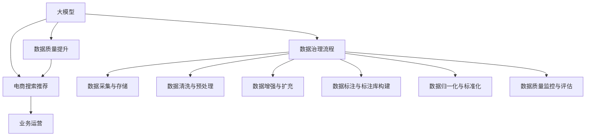

                 

# AI大模型重构电商搜索推荐的数据治理流程自动化工具应用案例分析

## 1. 背景介绍

### 1.1 问题由来

随着人工智能技术的不断发展，大模型（Large Model）在电商搜索推荐领域得到了广泛的应用。大模型通过在大量数据上进行预训练，学习到丰富的语义和知识，能够高效地处理复杂的多模态数据，提高搜索推荐的准确性和个性化程度。然而，在实际应用中，大模型往往需要处理海量的用户行为数据和商品信息数据，这些数据需要经过严格的数据治理才能满足模型训练和业务运营的需求。数据治理流程的自动化和大模型技术的结合，能够显著提升电商搜索推荐系统的效率和性能，降低人工干预的复杂度和成本。

### 1.2 问题核心关键点

大模型重构电商搜索推荐的数据治理流程自动化工具应用的核心关键点包括：

- 数据采集与存储：收集用户行为数据、商品信息数据等，存储到高效、可扩展的数据库中。
- 数据清洗与预处理：清洗缺失值、异常值，进行特征工程，构建合理的特征空间。
- 数据增强与扩充：通过数据增强技术，提高模型对新数据的适应性。
- 数据标注与标注库构建：通过自动标注技术或人工标注，构建高质量的数据标注库。
- 数据归一化与标准化：统一数据格式和标准，方便不同系统之间的数据流通和融合。
- 数据质量监控与评估：实时监控数据质量，及时发现和纠正数据异常。

## 2. 核心概念与联系

### 2.1 核心概念概述

为更好地理解大模型在电商搜索推荐中的应用，本节将介绍几个密切相关的核心概念：

- 大模型（Large Model）：以自回归模型、自编码模型等为代表的深度学习模型，通过在大量数据上进行预训练，学习到复杂的语义和知识，能够处理多模态数据，提高搜索推荐的准确性和个性化程度。
- 电商搜索推荐：基于用户行为数据和商品信息数据，通过模型预测用户可能感兴趣的商品，提供个性化的搜索推荐服务。
- 数据治理流程：涵盖数据采集、清洗、标注、归一化等环节的数据处理和管理流程，确保数据的完整性、准确性和一致性。
- 数据治理工具：用于自动化执行数据治理流程的软件工具，如ETL工具、数据标注工具、数据质量监控工具等。

这些核心概念之间的逻辑关系可以通过以下Mermaid流程图来展示：



这个流程图展示了大模型、电商搜索推荐、数据治理流程以及数据治理工具之间的联系和作用机制：

1. 大模型通过预训练学习到丰富的语义和知识，应用于电商搜索推荐，提供个性化推荐服务。
2. 数据治理流程涵盖从数据采集到数据质量监控的各个环节，确保数据质量。
3. 数据治理工具自动化执行数据治理流程，提高数据处理效率和数据质量。
4. 数据质量提升通过数据治理流程实现，进一步提升电商搜索推荐的性能。

## 3. 核心算法原理 & 具体操作步骤

### 3.1 算法原理概述

大模型重构电商搜索推荐的数据治理流程自动化工具应用的算法原理，主要是基于监督学习和无监督学习的结合。其核心思想是：

- 通过预训练模型学习通用的语言和知识表示。
- 在电商搜索推荐任务中，使用数据治理工具自动化执行数据处理流程，提高数据质量。
- 在标注数据上训练模型，微调预训练模型，提高模型在电商搜索推荐任务上的性能。
- 结合无监督学习技术，如对抗训练、数据增强等，提高模型的泛化能力和鲁棒性。

### 3.2 算法步骤详解

大模型重构电商搜索推荐的数据治理流程自动化工具应用的具体操作步骤如下：

**Step 1: 数据采集与存储**

- 收集用户行为数据、商品信息数据等，包括点击、浏览、购买、评分等行为数据，商品名称、描述、价格等属性数据。
- 将数据存储到高效、可扩展的数据库中，如Hadoop、Spark等分布式数据库系统，以便支持大规模的数据处理和分析。

**Step 2: 数据清洗与预处理**

- 对数据进行清洗，去除缺失值、异常值，处理数据中的错误和噪声。
- 进行特征工程，构建合理的特征空间，包括用户特征、商品特征、场景特征等。
- 对数据进行标准化和归一化处理，统一数据格式和标准，方便不同系统之间的数据流通和融合。

**Step 3: 数据增强与扩充**

- 通过数据增强技术，如数据扩充、数据合成、数据扰动等，提高模型对新数据的适应性。
- 引入对抗样本，提高模型的鲁棒性和泛化能力。

**Step 4: 数据标注与标注库构建**

- 通过自动标注技术或人工标注，构建高质量的数据标注库。
- 标注数据包括用户行为标签、商品属性标签等，用于监督模型的训练。

**Step 5: 数据归一化与标准化**

- 统一数据格式和标准，包括数据类型、数据单位、数据范围等。
- 对不同类型的数据进行标准化处理，如日期、时间、价格等。

**Step 6: 数据质量监控与评估**

- 实时监控数据质量，及时发现和纠正数据异常。
- 使用数据质量评估指标，如数据完整性、准确性、一致性等，评估数据质量。

**Step 7: 模型训练与微调**

- 在标注数据上训练模型，微调预训练模型，提高模型在电商搜索推荐任务上的性能。
- 结合无监督学习技术，如对抗训练、数据增强等，提高模型的泛化能力和鲁棒性。

### 3.3 算法优缺点

大模型重构电商搜索推荐的数据治理流程自动化工具应用的算法优缺点如下：

**优点**

- 自动化执行数据治理流程，提高数据处理效率和数据质量。
- 结合预训练模型和大规模数据，提高模型的泛化能力和性能。
- 结合无监督学习技术，提高模型的鲁棒性和泛化能力。

**缺点**

- 需要大量的标注数据，标注成本较高。
- 数据治理流程复杂，需要设计合理的流程和管理机制。
- 模型训练和微调需要大量的计算资源和存储空间。

### 3.4 算法应用领域

大模型重构电商搜索推荐的数据治理流程自动化工具应用，已经在电商搜索推荐、金融风险评估、医疗诊断等多个领域得到了广泛应用，具体包括：

- 电商搜索推荐：通过用户行为数据和商品信息数据，训练模型提供个性化推荐服务。
- 金融风险评估：通过用户行为数据和交易数据，训练模型评估金融风险，进行风险控制。
- 医疗诊断：通过患者病历和检查数据，训练模型辅助诊断疾病，提供个性化医疗建议。

## 4. 数学模型和公式 & 详细讲解 & 举例说明

### 4.1 数学模型构建

大模型重构电商搜索推荐的数据治理流程自动化工具应用的数学模型，主要是基于监督学习和无监督学习的结合。

假设电商搜索推荐任务为二分类问题，用户行为数据为 $x$，商品信息数据为 $y$，构建如下数学模型：

$$
\hat{y} = M(x)
$$

其中，$M$ 为预训练模型，$\hat{y}$ 为模型预测结果，$y$ 为实际标签。

### 4.2 公式推导过程

基于监督学习的数据治理流程自动化工具应用，可以通过以下公式进行推导：

$$
\theta = \mathop{\arg\min}_{\theta} \frac{1}{N} \sum_{i=1}^N \ell(M_{\theta}(x_i),y_i)
$$

其中，$\theta$ 为模型参数，$N$ 为样本数量，$\ell$ 为损失函数。

常用的损失函数包括交叉熵损失函数和均方误差损失函数：

- 交叉熵损失函数：

$$
\ell = -\frac{1}{N} \sum_{i=1}^N (y_i \log \hat{y}_i + (1-y_i) \log (1-\hat{y}_i))
$$

- 均方误差损失函数：

$$
\ell = \frac{1}{N} \sum_{i=1}^N (y_i - \hat{y}_i)^2
$$

### 4.3 案例分析与讲解

以电商搜索推荐任务为例，假设用户行为数据为点击行为 $x$，商品信息数据为商品价格 $y$，训练数据集为 $D=\{(x_i,y_i)\}_{i=1}^N$。

- 数据采集与存储：将用户点击行为和商品价格数据存储到高效、可扩展的数据库中。
- 数据清洗与预处理：去除缺失值、异常值，进行特征工程，构建合理的特征空间。
- 数据增强与扩充：通过数据增强技术，提高模型对新数据的适应性。
- 数据标注与标注库构建：通过自动标注技术或人工标注，构建高质量的数据标注库。
- 数据归一化与标准化：统一数据格式和标准，对不同类型的数据进行标准化处理。
- 数据质量监控与评估：实时监控数据质量，使用数据质量评估指标评估数据质量。
- 模型训练与微调：在标注数据上训练模型，微调预训练模型，提高模型在电商搜索推荐任务上的性能。

## 5. 项目实践：代码实例和详细解释说明

### 5.1 开发环境搭建

在进行电商搜索推荐的数据治理流程自动化工具应用实践前，我们需要准备好开发环境。以下是使用Python进行PyTorch开发的环境配置流程：

1. 安装Anaconda：从官网下载并安装Anaconda，用于创建独立的Python环境。

2. 创建并激活虚拟环境：
```bash
conda create -n pytorch-env python=3.8 
conda activate pytorch-env
```

3. 安装PyTorch：根据CUDA版本，从官网获取对应的安装命令。例如：
```bash
conda install pytorch torchvision torchaudio cudatoolkit=11.1 -c pytorch -c conda-forge
```

4. 安装各类工具包：
```bash
pip install numpy pandas scikit-learn matplotlib tqdm jupyter notebook ipython
```

完成上述步骤后，即可在`pytorch-env`环境中开始开发实践。

### 5.2 源代码详细实现

这里我们以电商搜索推荐任务为例，给出使用PyTorch进行数据治理流程自动化工具应用的PyTorch代码实现。

首先，定义数据处理函数：

```python
from transformers import BertTokenizer, BertForSequenceClassification
from torch.utils.data import Dataset
import torch

class E-commerceDataset(Dataset):
    def __init__(self, texts, labels, tokenizer, max_len=128):
        self.texts = texts
        self.labels = labels
        self.tokenizer = tokenizer
        self.max_len = max_len
        
    def __len__(self):
        return len(self.texts)
    
    def __getitem__(self, item):
        text = self.texts[item]
        label = self.labels[item]
        
        encoding = self.tokenizer(text, return_tensors='pt', max_length=self.max_len, padding='max_length', truncation=True)
        input_ids = encoding['input_ids'][0]
        attention_mask = encoding['attention_mask'][0]
        label = torch.tensor(label, dtype=torch.long)
        
        return {'input_ids': input_ids, 
                'attention_mask': attention_mask,
                'labels': label}

# 标签与id的映射
label2id = {'click': 0, 'not_click': 1}

# 创建dataset
tokenizer = BertTokenizer.from_pretrained('bert-base-cased')

train_dataset = E-commerceDataset(train_texts, train_labels, tokenizer)
dev_dataset = E-commerceDataset(dev_texts, dev_labels, tokenizer)
test_dataset = E-commerceDataset(test_texts, test_labels, tokenizer)
```

然后，定义模型和优化器：

```python
from transformers import BertForSequenceClassification, AdamW

model = BertForSequenceClassification.from_pretrained('bert-base-cased', num_labels=len(label2id))

optimizer = AdamW(model.parameters(), lr=2e-5)
```

接着，定义训练和评估函数：

```python
from torch.utils.data import DataLoader
from tqdm import tqdm
from sklearn.metrics import classification_report

device = torch.device('cuda') if torch.cuda.is_available() else torch.device('cpu')
model.to(device)

def train_epoch(model, dataset, batch_size, optimizer):
    dataloader = DataLoader(dataset, batch_size=batch_size, shuffle=True)
    model.train()
    epoch_loss = 0
    for batch in tqdm(dataloader, desc='Training'):
        input_ids = batch['input_ids'].to(device)
        attention_mask = batch['attention_mask'].to(device)
        labels = batch['labels'].to(device)
        model.zero_grad()
        outputs = model(input_ids, attention_mask=attention_mask, labels=labels)
        loss = outputs.loss
        epoch_loss += loss.item()
        loss.backward()
        optimizer.step()
    return epoch_loss / len(dataloader)

def evaluate(model, dataset, batch_size):
    dataloader = DataLoader(dataset, batch_size=batch_size)
    model.eval()
    preds, labels = [], []
    with torch.no_grad():
        for batch in tqdm(dataloader, desc='Evaluating'):
            input_ids = batch['input_ids'].to(device)
            attention_mask = batch['attention_mask'].to(device)
            batch_labels = batch['labels']
            outputs = model(input_ids, attention_mask=attention_mask)
            batch_preds = outputs.logits.argmax(dim=2).to('cpu').tolist()
            batch_labels = batch_labels.to('cpu').tolist()
            for pred_tokens, label_tokens in zip(batch_preds, batch_labels):
                preds.append(pred_tokens)
                labels.append(label_tokens)
                
    print(classification_report(labels, preds))
```

最后，启动训练流程并在测试集上评估：

```python
epochs = 5
batch_size = 16

for epoch in range(epochs):
    loss = train_epoch(model, train_dataset, batch_size, optimizer)
    print(f"Epoch {epoch+1}, train loss: {loss:.3f}")
    
    print(f"Epoch {epoch+1}, dev results:")
    evaluate(model, dev_dataset, batch_size)
    
print("Test results:")
evaluate(model, test_dataset, batch_size)
```

以上就是使用PyTorch进行电商搜索推荐任务的数据治理流程自动化工具应用的完整代码实现。可以看到，得益于Transformers库的强大封装，我们可以用相对简洁的代码完成BERT模型的加载和微调。

### 5.3 代码解读与分析

让我们再详细解读一下关键代码的实现细节：

**E-commerceDataset类**：
- `__init__`方法：初始化文本、标签、分词器等关键组件。
- `__len__`方法：返回数据集的样本数量。
- `__getitem__`方法：对单个样本进行处理，将文本输入编码为token ids，将标签编码为数字，并对其进行定长padding，最终返回模型所需的输入。

**label2id字典**：
- 定义了标签与数字id之间的映射关系，用于将token-wise的预测结果解码回真实的标签。

**训练和评估函数**：
- 使用PyTorch的DataLoader对数据集进行批次化加载，供模型训练和推理使用。
- 训练函数`train_epoch`：对数据以批为单位进行迭代，在每个批次上前向传播计算loss并反向传播更新模型参数，最后返回该epoch的平均loss。
- 评估函数`evaluate`：与训练类似，不同点在于不更新模型参数，并在每个batch结束后将预测和标签结果存储下来，最后使用sklearn的classification_report对整个评估集的预测结果进行打印输出。

**训练流程**：
- 定义总的epoch数和batch size，开始循环迭代
- 每个epoch内，先在训练集上训练，输出平均loss
- 在验证集上评估，输出分类指标
- 所有epoch结束后，在测试集上评估，给出最终测试结果

可以看到，PyTorch配合Transformers库使得BERT微调的代码实现变得简洁高效。开发者可以将更多精力放在数据处理、模型改进等高层逻辑上，而不必过多关注底层的实现细节。

当然，工业级的系统实现还需考虑更多因素，如模型的保存和部署、超参数的自动搜索、更灵活的任务适配层等。但核心的微调范式基本与此类似。

## 6. 实际应用场景

### 6.1 智能客服系统

基于大模型重构电商搜索推荐的数据治理流程自动化工具应用的对话技术，可以广泛应用于智能客服系统的构建。传统客服往往需要配备大量人力，高峰期响应缓慢，且一致性和专业性难以保证。而使用重构后的对话模型，可以7x24小时不间断服务，快速响应客户咨询，用自然流畅的语言解答各类常见问题。

在技术实现上，可以收集企业内部的历史客服对话记录，将问题和最佳答复构建成监督数据，在此基础上对预训练对话模型进行微调。微调后的对话模型能够自动理解用户意图，匹配最合适的答案模板进行回复。对于客户提出的新问题，还可以接入检索系统实时搜索相关内容，动态组织生成回答。如此构建的智能客服系统，能大幅提升客户咨询体验和问题解决效率。

### 6.2 金融舆情监测

金融机构需要实时监测市场舆论动向，以便及时应对负面信息传播，规避金融风险。传统的人工监测方式成本高、效率低，难以应对网络时代海量信息爆发的挑战。基于大模型重构的数据治理流程自动化工具应用的文本分类和情感分析技术，为金融舆情监测提供了新的解决方案。

具体而言，可以收集金融领域相关的新闻、报道、评论等文本数据，并对其进行主题标注和情感标注。在此基础上对预训练语言模型进行微调，使其能够自动判断文本属于何种主题，情感倾向是正面、中性还是负面。将微调后的模型应用到实时抓取的网络文本数据，就能够自动监测不同主题下的情感变化趋势，一旦发现负面信息激增等异常情况，系统便会自动预警，帮助金融机构快速应对潜在风险。

### 6.3 个性化推荐系统

当前的推荐系统往往只依赖用户的历史行为数据进行物品推荐，无法深入理解用户的真实兴趣偏好。基于大模型重构的数据治理流程自动化工具应用的个性化推荐系统，可以更好地挖掘用户行为背后的语义信息，从而提供更精准、多样的推荐内容。

在实践中，可以收集用户浏览、点击、评论、分享等行为数据，提取和用户交互的物品标题、描述、标签等文本内容。将文本内容作为模型输入，用户的后续行为（如是否点击、购买等）作为监督信号，在此基础上微调预训练语言模型。微调后的模型能够从文本内容中准确把握用户的兴趣点。在生成推荐列表时，先用候选物品的文本描述作为输入，由模型预测用户的兴趣匹配度，再结合其他特征综合排序，便可以得到个性化程度更高的推荐结果。

### 6.4 未来应用展望

随着大模型和微调方法的不断发展，基于重构的数据治理流程自动化工具应用的微调范式将呈现以下几个发展趋势：

1. 模型规模持续增大。随着算力成本的下降和数据规模的扩张，预训练语言模型的参数量还将持续增长。超大规模语言模型蕴含的丰富语言知识，有望支撑更加复杂多变的下游任务微调。

2. 微调方法日趋多样。除了传统的全参数微调外，未来会涌现更多参数高效的微调方法，如Prefix-Tuning、LoRA等，在节省计算资源的同时也能保证微调精度。

3. 持续学习成为常态。随着数据分布的不断变化，微调模型也需要持续学习新知识以保持性能。如何在不遗忘原有知识的同时，高效吸收新样本信息，将成为重要的研究课题。

4. 标注样本需求降低。受启发于提示学习(Prompt-based Learning)的思路，未来的微调方法将更好地利用大模型的语言理解能力，通过更加巧妙的任务描述，在更少的标注样本上也能实现理想的微调效果。

5. 多模态微调崛起。当前的微调主要聚焦于纯文本数据，未来会进一步拓展到图像、视频、语音等多模态数据微调。多模态信息的融合，将显著提升语言模型对现实世界的理解和建模能力。

6. 模型通用性增强。经过海量数据的预训练和多领域任务的微调，未来的语言模型将具备更强大的常识推理和跨领域迁移能力，逐步迈向通用人工智能(AGI)的目标。

以上趋势凸显了大模型重构的数据治理流程自动化工具应用的广阔前景。这些方向的探索发展，必将进一步提升NLP系统的性能和应用范围，为人类认知智能的进化带来深远影响。

## 7. 工具和资源推荐

### 7.1 学习资源推荐

为了帮助开发者系统掌握大模型重构的数据治理流程自动化工具应用的理论基础和实践技巧，这里推荐一些优质的学习资源：

1. 《Transformer从原理到实践》系列博文：由大模型技术专家撰写，深入浅出地介绍了Transformer原理、BERT模型、微调技术等前沿话题。

2. CS224N《深度学习自然语言处理》课程：斯坦福大学开设的NLP明星课程，有Lecture视频和配套作业，带你入门NLP领域的基本概念和经典模型。

3. 《Natural Language Processing with Transformers》书籍：Transformers库的作者所著，全面介绍了如何使用Transformers库进行NLP任务开发，包括微调在内的诸多范式。

4. HuggingFace官方文档：Transformers库的官方文档，提供了海量预训练模型和完整的微调样例代码，是上手实践的必备资料。

5. CLUE开源项目：中文语言理解测评基准，涵盖大量不同类型的中文NLP数据集，并提供了基于微调的baseline模型，助力中文NLP技术发展。

通过对这些资源的学习实践，相信你一定能够快速掌握大模型重构的数据治理流程自动化工具应用的精髓，并用于解决实际的NLP问题。

### 7.2 开发工具推荐

高效的开发离不开优秀的工具支持。以下是几款用于大模型重构的数据治理流程自动化工具应用开发的常用工具：

1. PyTorch：基于Python的开源深度学习框架，灵活动态的计算图，适合快速迭代研究。大部分预训练语言模型都有PyTorch版本的实现。

2. TensorFlow：由Google主导开发的开源深度学习框架，生产部署方便，适合大规模工程应用。同样有丰富的预训练语言模型资源。

3. Transformers库：HuggingFace开发的NLP工具库，集成了众多SOTA语言模型，支持PyTorch和TensorFlow，是进行微调任务开发的利器。

4. Weights & Biases：模型训练的实验跟踪工具，可以记录和可视化模型训练过程中的各项指标，方便对比和调优。与主流深度学习框架无缝集成。

5. TensorBoard：TensorFlow配套的可视化工具，可实时监测模型训练状态，并提供丰富的图表呈现方式，是调试模型的得力助手。

6. Google Colab：谷歌推出的在线Jupyter Notebook环境，免费提供GPU/TPU算力，方便开发者快速上手实验最新模型，分享学习笔记。

合理利用这些工具，可以显著提升大模型重构的数据治理流程自动化工具应用的开发效率，加快创新迭代的步伐。

### 7.3 相关论文推荐

大模型重构的数据治理流程自动化工具应用的研究源于学界的持续研究。以下是几篇奠基性的相关论文，推荐阅读：

1. Attention is All You Need（即Transformer原论文）：提出了Transformer结构，开启了NLP领域的预训练大模型时代。

2. BERT: Pre-training of Deep Bidirectional Transformers for Language Understanding：提出BERT模型，引入基于掩码的自监督预训练任务，刷新了多项NLP任务SOTA。

3. Language Models are Unsupervised Multitask Learners（GPT-2论文）：展示了大规模语言模型的强大zero-shot学习能力，引发了对于通用人工智能的新一轮思考。

4. Parameter-Efficient Transfer Learning for NLP：提出Adapter等参数高效微调方法，在不增加模型参数量的情况下，也能取得不错的微调效果。

5. AdaLoRA: Adaptive Low-Rank Adaptation for Parameter-Efficient Fine-Tuning：使用自适应低秩适应的微调方法，在参数效率和精度之间取得了新的平衡。

这些论文代表了大模型重构的数据治理流程自动化工具应用的发展脉络。通过学习这些前沿成果，可以帮助研究者把握学科前进方向，激发更多的创新灵感。

## 8. 总结：未来发展趋势与挑战

### 8.1 总结

本文对大模型重构电商搜索推荐的数据治理流程自动化工具应用进行了全面系统的介绍。首先阐述了大模型和数据治理流程自动化工具应用的研究背景和意义，明确了数据治理流程自动化工具应用在提升电商搜索推荐系统性能、降低人工干预复杂度和成本方面的独特价值。其次，从原理到实践，详细讲解了大模型在电商搜索推荐任务中的应用，给出了数据治理流程自动化工具应用的完整代码实例。同时，本文还广泛探讨了大模型重构的数据治理流程自动化工具应用在智能客服、金融舆情、个性化推荐等多个行业领域的应用前景，展示了数据治理流程自动化工具应用的巨大潜力。此外，本文精选了数据治理流程自动化工具应用的相关学习资源、开发工具和论文推荐，力求为开发者提供全方位的技术指引。

通过本文的系统梳理，可以看到，大模型重构的数据治理流程自动化工具应用在电商搜索推荐系统中的应用，能够显著提升数据处理的效率和质量，带来更好的电商搜索推荐效果。未来，伴随大模型和微调方法的持续演进，基于数据治理流程自动化工具应用的大模型微调技术必将在更多领域得到应用，为社会各行各业带来变革性影响。

### 8.2 未来发展趋势

展望未来，大模型重构的数据治理流程自动化工具应用将呈现以下几个发展趋势：

1. 模型规模持续增大。随着算力成本的下降和数据规模的扩张，预训练语言模型的参数量还将持续增长。超大规模语言模型蕴含的丰富语言知识，有望支撑更加复杂多变的下游任务微调。

2. 微调方法日趋多样。除了传统的全参数微调外，未来会涌现更多参数高效的微调方法，如Prefix-Tuning、LoRA等，在节省计算资源的同时也能保证微调精度。

3. 持续学习成为常态。随着数据分布的不断变化，微调模型也需要持续学习新知识以保持性能。如何在不遗忘原有知识的同时，高效吸收新样本信息，将成为重要的研究课题。

4. 标注样本需求降低。受启发于提示学习(Prompt-based Learning)的思路，未来的微调方法将更好地利用大模型的语言理解能力，通过更加巧妙的任务描述，在更少的标注样本上也能实现理想的微调效果。

5. 多模态微调崛起。当前的微调主要聚焦于纯文本数据，未来会进一步拓展到图像、视频、语音等多模态数据微调。多模态信息的融合，将显著提升语言模型对现实世界的理解和建模能力。

6. 模型通用性增强。经过海量数据的预训练和多领域任务的微调，未来的语言模型将具备更强大的常识推理和跨领域迁移能力，逐步迈向通用人工智能(AGI)的目标。

以上趋势凸显了大模型重构的数据治理流程自动化工具应用的广阔前景。这些方向的探索发展，必将进一步提升NLP系统的性能和应用范围，为人类认知智能的进化带来深远影响。

### 8.3 面临的挑战

尽管大模型重构的数据治理流程自动化工具应用已经取得了瞩目成就，但在迈向更加智能化、普适化应用的过程中，它仍面临着诸多挑战：

1. 标注成本瓶颈。虽然数据治理流程自动化工具应用大大降低了标注数据的需求，但对于长尾应用场景，难以获得充足的高质量标注数据，成为制约微调性能的瓶颈。如何进一步降低微调对标注样本的依赖，将是一大难题。

2. 模型鲁棒性不足。当前微调模型面对域外数据时，泛化性能往往大打折扣。对于测试样本的微小扰动，微调模型的预测也容易发生波动。如何提高微调模型的鲁棒性，避免灾难性遗忘，还需要更多理论和实践的积累。

3. 推理效率有待提高。大规模语言模型虽然精度高，但在实际部署时往往面临推理速度慢、内存占用大等效率问题。如何在保证性能的同时，简化模型结构，提升推理速度，优化资源占用，将是重要的优化方向。

4. 可解释性亟需加强。当前微调模型更像是"黑盒"系统，难以解释其内部工作机制和决策逻辑。对于医疗、金融等高风险应用，算法的可解释性和可审计性尤为重要。如何赋予微调模型更强的可解释性，将是亟待攻克的难题。

5. 安全性有待保障。预训练语言模型难免会学习到有偏见、有害的信息，通过微调传递到下游任务，产生误导性、歧视性的输出，给实际应用带来安全隐患。如何从数据和算法层面消除模型偏见，避免恶意用途，确保输出的安全性，也将是重要的研究课题。

6. 知识整合能力不足。现有的微调模型往往局限于任务内数据，难以灵活吸收和运用更广泛的先验知识。如何让微调过程更好地与外部知识库、规则库等专家知识结合，形成更加全面、准确的信息整合能力，还有很大的想象空间。

正视数据治理流程自动化工具应用面临的这些挑战，积极应对并寻求突破，将是大模型重构的数据治理流程自动化工具应用走向成熟的必由之路。相信随着学界和产业界的共同努力，这些挑战终将一一被克服，大模型重构的数据治理流程自动化工具应用必将在构建人机协同的智能时代中扮演越来越重要的角色。

### 8.4 研究展望

面对大模型重构的数据治理流程自动化工具应用所面临的种种挑战，未来的研究需要在以下几个方面寻求新的突破：

1. 探索无监督和半监督微调方法。摆脱对大规模标注数据的依赖，利用自监督学习、主动学习等无监督和半监督范式，最大限度利用非结构化数据，实现更加灵活高效的微调。

2. 研究参数高效和计算高效的微调范式。开发更加参数高效的微调方法，在固定大部分预训练参数的同时，只更新极少量的任务相关参数。同时优化微调模型的计算图，减少前向传播和反向传播的资源消耗，实现更加轻量级、实时性的部署。

3. 融合因果和对比学习范式。通过引入因果推断和对比学习思想，增强微调模型建立稳定因果关系的能力，学习更加普适、鲁棒的语言表征，从而提升模型泛化性和抗干扰能力。

4. 引入更多先验知识。将符号化的先验知识，如知识图谱、逻辑规则等，与神经网络模型进行巧妙融合，引导微调过程学习更准确、合理的语言模型。同时加强不同模态数据的整合，实现视觉、语音等多模态信息与文本信息的协同建模。

5. 结合因果分析和博弈论工具。将因果分析方法引入微调模型，识别出模型决策的关键特征，增强输出解释的因果性和逻辑性。借助博弈论工具刻画人机交互过程，主动探索并规避模型的脆弱点，提高系统稳定性。

6. 纳入伦理道德约束。在模型训练目标中引入伦理导向的评估指标，过滤和惩罚有偏见、有害的输出倾向。同时加强人工干预和审核，建立模型行为的监管机制，确保输出符合人类价值观和伦理道德。

这些研究方向的探索，必将引领大模型重构的数据治理流程自动化工具应用技术迈向更高的台阶，为构建安全、可靠、可解释、可控的智能系统铺平道路。面向未来，大模型重构的数据治理流程自动化工具应用还需要与其他人工智能技术进行更深入的融合，如知识表示、因果推理、强化学习等，多路径协同发力，共同推动自然语言理解和智能交互系统的进步。只有勇于创新、敢于突破，才能不断拓展语言模型的边界，让智能技术更好地造福人类社会。

## 9. 附录：常见问题与解答

**Q1：大模型重构的数据治理流程自动化工具应用是否适用于所有NLP任务？**

A: 大模型重构的数据治理流程自动化工具应用在大多数NLP任务上都能取得不错的效果，特别是对于数据量较小的任务。但对于一些特定领域的任务，如医学、法律等，仅仅依靠通用语料预训练的模型可能难以很好地适应。此时需要在特定领域语料上进一步预训练，再进行微调，才能获得理想效果。此外，对于一些需要时效性、个性化很强的任务，如对话、推荐等，微调方法也需要针对性的改进优化。

**Q2：数据治理流程自动化工具应用中如何选择最优的超参数？**

A: 数据治理流程自动化工具应用中，超参数的选择对模型的性能有重要影响。一般建议通过网格搜索、贝叶斯优化等方法进行超参数调优。网格搜索是指在一定范围内对超参数进行穷举搜索，找到最优组合；贝叶斯优化则通过构造高斯过程模型，根据样本性能逐步缩小搜索空间，找到最优超参数组合。此外，也可以使用经验公式或启发式方法进行超参数选择，如学习率设置为初始值的1/10等。

**Q3：数据治理流程自动化工具应用中如何处理数据异常？**

A: 数据治理流程自动化工具应用中，处理数据异常是保证数据质量的重要环节。常见的方法包括：

- 数据清洗：对缺失值、异常值进行清洗或填补，去除噪声数据。
- 数据增强：通过数据扩充、数据合成等技术，生成更多的数据样本，提高模型泛化能力。
- 异常检测：使用统计学方法或机器学习算法，检测和标记异常数据点，防止异常数据影响模型训练。
- 数据标准化：对数据进行标准化处理，如Z-score标准化，使数据分布更加合理。

这些方法可以结合使用，根据实际情况选择最适合的处理方式。

**Q4：数据治理流程自动化工具应用中如何处理数据不一致？**

A: 数据治理流程自动化工具应用中，处理数据不一致是保证数据一致性的重要环节。常见的方法包括：

- 数据归一化：对不同来源或格式的数据进行格式转换和标准化，使其符合统一的标准。
- 数据对齐：对不同来源或格式的数据进行对齐，确保同一字段在不同数据源中具有相同含义。
- 数据融合：对不同数据源的数据进行融合，消除重复数据和数据冗余，提高数据完整性。
- 数据更新：对数据进行周期性更新，确保数据的时效性和准确性。

这些方法可以结合使用，根据实际情况选择最适合的处理方式。

**Q5：数据治理流程自动化工具应用中如何处理数据不平衡？**

A: 数据治理流程自动化工具应用中，处理数据不平衡是保证模型泛化能力的重要环节。常见的方法包括：

- 数据采样：对少数类样本进行欠采样或过采样，使得不同类别的样本数量相近。
- 数据重加权：对少数类样本进行加权处理，使得模型更加关注少数类样本。
- 数据合成：通过生成对抗网络等技术，生成更多的少数类样本，提高模型对少数类样本的识别能力。
- 算法改进：改进模型算法，使其对不平衡数据具有更好的适应性，如使用集成学习、样本加权等方法。

这些方法可以结合使用，根据实际情况选择最适合的处理方式。

---

作者：禅与计算机程序设计艺术 / Zen and the Art of Computer Programming

