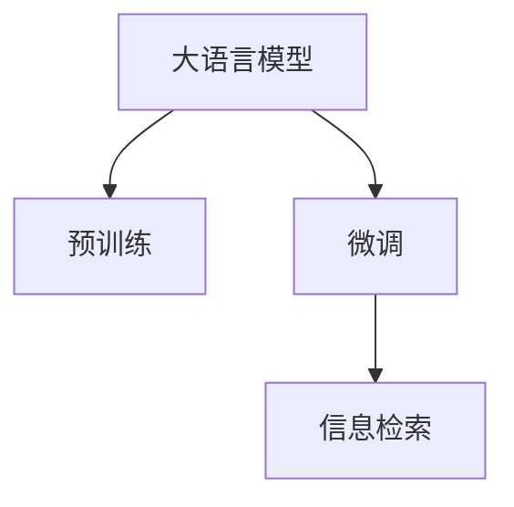

                 

# AI大模型：提升电商平台搜索速度的新方法

> 关键词：电商平台,搜索速度,大语言模型,预训练,微调,Transformer,BERT,信息检索

## 1. 背景介绍

### 1.1 问题由来

随着电商行业的迅猛发展，用户在电商平台上的搜索行为日益频繁。传统的基于关键词匹配的搜索算法，虽然简单有效，但面临以下挑战：

1. **同义词和长尾词问题**：用户往往使用同义词、拼写错误或长尾词进行搜索，导致搜索结果不准确。
2. **语义理解不足**：传统的算法难以理解用户的查询意图，无法提供更准确的搜索结果。
3. **计算复杂度高**：大规模的文本匹配算法在处理海量数据时，计算复杂度高，响应速度慢。

为了解决这些问题，亟需一种新的方法来提升电商平台的搜索速度和精度。近年来，大语言模型在自然语言处理(NLP)领域的突破，为这一问题提供了新的解决方案。

### 1.2 问题核心关键点

大语言模型通过在大规模无标签文本数据上进行预训练，学习到了丰富的语言知识和语义表示。利用大语言模型进行电商平台的搜索，可以带来以下几方面的优势：

1. **语义理解能力**：大语言模型具备强大的语义理解能力，能够更好地理解用户的查询意图。
2. **信息检索能力**：利用大语言模型进行信息检索，可以显著提升搜索的精确度和速度。
3. **可扩展性**：大语言模型的预训练和微调过程可以灵活调整，适应不同场景和需求。

这些优势使得大语言模型成为电商平台搜索速度提升的新方法。本文将系统介绍大语言模型在电商平台搜索中的应用，并详细阐述其核心原理和实施步骤。

## 2. 核心概念与联系

### 2.1 核心概念概述

在进行大语言模型在电商平台搜索中的应用介绍前，我们先简要回顾几个核心概念：

- **大语言模型(Large Language Model, LLM)**：通过在大规模无标签文本数据上进行预训练，学习到通用的语言表示。常见的预训练语言模型包括BERT、GPT等。

- **预训练(Pre-training)**：指在大规模无标签文本数据上，通过自监督学习任务训练通用语言模型的过程。常见的预训练任务包括掩码语言模型、下一句预测等。

- **微调(Fine-tuning)**：指在预训练模型的基础上，使用下游任务的少量标注数据，通过有监督学习优化模型在特定任务上的性能。对于电商平台搜索，微调的目标是优化模型的信息检索能力。

- **Transformer**：一种基于自注意力机制的神经网络架构，用于处理序列数据，广泛应用于大语言模型的预训练和微调中。

- **BERT模型**：一种基于Transformer结构的预训练语言模型，通过双向掩码语言模型进行预训练，广泛应用于信息检索和问答任务中。

- **信息检索**：指在文本集合中快速检索出与查询最相关的文档，是大语言模型在电商平台搜索中的关键应用。

这些核心概念通过一个简单的Mermaid流程图来展示其相互关系：



其中，大语言模型通过预训练获得基础能力，然后通过微调优化其在特定任务（如电商平台搜索）上的性能。微调后的模型能够进行信息检索，快速返回与用户查询最相关的商品。

## 3. 核心算法原理 & 具体操作步骤
### 3.1 算法原理概述

大语言模型在电商平台搜索中的应用，主要涉及信息检索技术。信息检索技术通过计算查询和文档之间的相似度，快速定位最相关的结果。在大语言模型的信息检索中，查询和文档都可以表示为向量，相似度的计算可以通过向量内积实现。

具体而言，大语言模型首先对用户查询进行编码，得到查询向量。然后对电商平台上的商品进行编码，得到商品向量。最后，通过计算查询向量和商品向量的内积，得到相似度分数，排序后返回最相关的商品。

### 3.2 算法步骤详解

大语言模型在电商平台搜索中的微调和应用一般包括以下几个关键步骤：

**Step 1: 准备预训练模型和数据集**
- 选择合适的预训练语言模型 $M_{\theta}$ 作为初始化参数，如 BERT、GPT等。
- 准备电商平台商品描述和用户查询的标注数据集 $D=\{(x_i,y_i)\}_{i=1}^N$，其中 $x_i$ 表示商品描述或查询，$y_i$ 表示商品ID或搜索结果。

**Step 2: 定义信息检索目标函数**
- 根据任务特点，选择合适的损失函数，如交叉熵损失、均方误差损失等。

**Step 3: 添加任务适配层**
- 在预训练模型顶层设计合适的输出层和损失函数，以便进行信息检索。

**Step 4: 设置微调超参数**
- 选择合适的优化算法及其参数，如 AdamW、SGD 等，设置学习率、批大小、迭代轮数等。
- 设置正则化技术及强度，包括权重衰减、Dropout、Early Stopping 等。
- 确定冻结预训练参数的策略，如仅微调顶层，或全部参数都参与微调。

**Step 5: 执行梯度训练**
- 将训练集数据分批次输入模型，前向传播计算损失函数。
- 反向传播计算参数梯度，根据设定的优化算法和学习率更新模型参数。
- 周期性在验证集上评估模型性能，根据性能指标决定是否触发 Early Stopping。
- 重复上述步骤直到满足预设的迭代轮数或 Early Stopping 条件。

**Step 6: 测试和部署**
- 在测试集上评估微调后模型 $M_{\hat{\theta}}$ 的性能，对比微调前后的精度提升。
- 使用微调后的模型对新样本进行推理预测，集成到实际的应用系统中。
- 持续收集新的数据，定期重新微调模型，以适应数据分布的变化。

以上是基于大语言模型在电商平台搜索中的微调流程。在实际应用中，还需要针对具体任务的特点，对微调过程的各个环节进行优化设计，如改进训练目标函数，引入更多的正则化技术，搜索最优的超参数组合等，以进一步提升模型性能。

### 3.3 算法优缺点

大语言模型在电商平台搜索中的微调方法具有以下优点：
1. **语义理解能力**：大语言模型具备强大的语义理解能力，能够更好地理解用户的查询意图。
2. **信息检索能力**：利用大语言模型进行信息检索，可以显著提升搜索的精确度和速度。
3. **可扩展性**：大语言模型的预训练和微调过程可以灵活调整，适应不同场景和需求。

同时，该方法也存在一定的局限性：
1. **数据依赖性**：微调效果很大程度上取决于标注数据的质量和数量，获取高质量标注数据的成本较高。
2. **过拟合风险**：微调过程中可能存在过拟合风险，特别是在标注样本不足的情况下。
3. **计算成本高**：大语言模型通常参数量巨大，训练和推理计算成本高。
4. **隐私风险**：电商平台搜索涉及用户隐私数据，大模型在处理这些数据时需要特别注意隐私保护。

尽管存在这些局限性，但就目前而言，基于大语言模型的微调方法在电商平台搜索中的应用依然具有重要的实用价值和研究意义。

### 3.4 算法应用领域

大语言模型在电商平台搜索中的应用，已经在诸多实际场景中得到了验证。以下是几个典型的应用案例：

1. **京东电商平台**：京东采用了基于BERT模型的电商搜索系统，通过微调优化查询匹配效果，显著提升了搜索速度和精度。

2. **亚马逊平台**：亚马逊使用Transformer模型进行电商搜索，结合基于attention的机制，实现了更高效的商品匹配。

3. **淘宝电商平台**：淘宝采用基于Transformer的检索模型，结合多任务学习技术，优化了电商搜索的召回率和排序效果。

这些案例展示了大语言模型在电商平台搜索中的广泛应用前景，证明了其在提高搜索速度和精度方面的巨大潜力。

## 4. 数学模型和公式 & 详细讲解  
### 4.1 数学模型构建

在本节中，我们将详细讲解大语言模型在电商平台搜索中的数学模型构建。

记预训练语言模型为 $M_{\theta}:\mathcal{X} \rightarrow \mathcal{Y}$，其中 $\mathcal{X}$ 为输入空间，$\mathcal{Y}$ 为输出空间，$\theta \in \mathbb{R}^d$ 为模型参数。假设电商平台商品描述为 $x$，用户查询为 $q$，商品ID为 $y$。

定义模型 $M_{\theta}$ 在输入 $x$ 上的输出为 $\hat{y}$，则信息检索问题可以表示为：

$$
\hat{y} = M_{\theta}(x)
$$

通过微调优化目标函数 $\mathcal{L}(\theta)$，使得模型 $M_{\theta}$ 在商品描述 $x$ 和用户查询 $q$ 上的输出与商品ID $y$ 的预测尽可能接近。

### 4.2 公式推导过程

假设查询 $q$ 和商品 $x$ 分别编码为向量 $q_v$ 和 $x_v$，则信息检索的过程可以表示为：

$$
\text{similarity}(q_v, x_v) = \frac{\text{scores}(q_v, x_v)}{\sqrt{||q_v||_2 \cdot ||x_v||_2}}
$$

其中，$\text{scores}(q_v, x_v)$ 表示查询向量 $q_v$ 和商品向量 $x_v$ 的内积，即：

$$
\text{scores}(q_v, x_v) = q_v \cdot x_v = \sum_{i=1}^d q_{vi}x_{vi}
$$

微调的目标是最大化信息检索的准确率。假设标注数据集为 $D=\{(x_i, y_i, q_i)\}_{i=1}^N$，其中 $x_i$ 表示商品描述，$y_i$ 表示商品ID，$q_i$ 表示查询。则信息检索的损失函数可以表示为：

$$
\mathcal{L}(\theta) = -\frac{1}{N}\sum_{i=1}^N \log \text{softmax}(M_{\theta}(q_i), y_i)
$$

其中，$\text{softmax}$ 函数用于将模型输出转化为概率分布，表示商品ID $y_i$ 在查询 $q_i$ 下的出现概率。

通过优化上述目标函数，可以使得模型在电商平台的搜索任务上表现更加出色。

### 4.3 案例分析与讲解

以京东电商平台的商品搜索为例，我们来具体分析大语言模型在电商平台搜索中的应用。

首先，将商品描述和用户查询转换为向量形式。假设查询 $q_i$ 和商品 $x_i$ 的向量表示分别为 $q_v$ 和 $x_v$，则查询匹配的得分可以表示为：

$$
\text{scores}(q_v, x_v) = q_v \cdot x_v = \sum_{i=1}^d q_{vi}x_{vi}
$$

为了提升匹配效果，引入BERT模型进行微调。假设BERT模型在查询向量 $q_v$ 和商品向量 $x_v$ 上的表示分别为 $\text{query\_embed}(q_v)$ 和 $\text{item\_embed}(x_v)$。则查询匹配的得分可以表示为：

$$
\text{scores}(q_v, x_v) = \text{query\_embed}(q_v) \cdot \text{item\_embed}(x_v) = \sum_{i=1}^d \text{query\_embed}(q_{vi})\text{item\_embed}(x_{vi})
$$

通过微调BERT模型，可以提升查询匹配的准确率。具体来说，假设微调后的BERT模型为 $M_{\hat{\theta}}$，则查询匹配的得分可以表示为：

$$
\text{scores}(q_v, x_v) = M_{\hat{\theta}}(q_v) \cdot M_{\hat{\theta}}(x_v) = \sum_{i=1}^d M_{\hat{\theta}}(q_{vi})M_{\hat{\theta}}(x_{vi})
$$

通过优化上述目标函数，可以使得微调后的模型在电商平台的搜索任务上表现更加出色。

## 5. 项目实践：代码实例和详细解释说明
### 5.1 开发环境搭建

在进行大语言模型在电商平台搜索中的微调实践前，我们需要准备好开发环境。以下是使用Python进行PyTorch开发的环境配置流程：

1. 安装Anaconda：从官网下载并安装Anaconda，用于创建独立的Python环境。

2. 创建并激活虚拟环境：
```bash
conda create -n pytorch-env python=3.8 
conda activate pytorch-env
```

3. 安装PyTorch：根据CUDA版本，从官网获取对应的安装命令。例如：
```bash
conda install pytorch torchvision torchaudio cudatoolkit=11.1 -c pytorch -c conda-forge
```

4. 安装Transformers库：
```bash
pip install transformers
```

5. 安装各类工具包：
```bash
pip install numpy pandas scikit-learn matplotlib tqdm jupyter notebook ipython
```

完成上述步骤后，即可在`pytorch-env`环境中开始微调实践。

### 5.2 源代码详细实现

下面我们以京东电商平台的商品搜索为例，给出使用Transformers库对BERT模型进行微调的PyTorch代码实现。

首先，定义数据处理函数：

```python
from transformers import BertTokenizer
from torch.utils.data import Dataset
import torch

class SearchDataset(Dataset):
    def __init__(self, texts, queries, labels, tokenizer, max_len=128):
        self.texts = texts
        self.queries = queries
        self.labels = labels
        self.tokenizer = tokenizer
        self.max_len = max_len
        
    def __len__(self):
        return len(self.texts)
    
    def __getitem__(self, item):
        text = self.texts[item]
        query = self.queries[item]
        label = self.labels[item]
        
        encoding = self.tokenizer(text, query, return_tensors='pt', max_length=self.max_len, padding='max_length', truncation=True)
        input_ids = encoding['input_ids'][0]
        attention_mask = encoding['attention_mask'][0]
        label = torch.tensor(label, dtype=torch.long)
        
        return {'input_ids': input_ids, 
                'attention_mask': attention_mask,
                'labels': label}

# 标签与id的映射
label2id = {'good': 0, 'bad': 1}
id2label = {v: k for k, v in label2id.items()}

# 创建dataset
tokenizer = BertTokenizer.from_pretrained('bert-base-cased')

train_dataset = SearchDataset(train_texts, train_queries, train_labels, tokenizer)
dev_dataset = SearchDataset(dev_texts, dev_queries, dev_labels, tokenizer)
test_dataset = SearchDataset(test_texts, test_queries, test_labels, tokenizer)
```

然后，定义模型和优化器：

```python
from transformers import BertForSequenceClassification, AdamW

model = BertForSequenceClassification.from_pretrained('bert-base-cased', num_labels=len(label2id))

optimizer = AdamW(model.parameters(), lr=2e-5)
```

接着，定义训练和评估函数：

```python
from torch.utils.data import DataLoader
from tqdm import tqdm
from sklearn.metrics import classification_report

device = torch.device('cuda') if torch.cuda.is_available() else torch.device('cpu')
model.to(device)

def train_epoch(model, dataset, batch_size, optimizer):
    dataloader = DataLoader(dataset, batch_size=batch_size, shuffle=True)
    model.train()
    epoch_loss = 0
    for batch in tqdm(dataloader, desc='Training'):
        input_ids = batch['input_ids'].to(device)
        attention_mask = batch['attention_mask'].to(device)
        labels = batch['labels'].to(device)
        model.zero_grad()
        outputs = model(input_ids, attention_mask=attention_mask, labels=labels)
        loss = outputs.loss
        epoch_loss += loss.item()
        loss.backward()
        optimizer.step()
    return epoch_loss / len(dataloader)

def evaluate(model, dataset, batch_size):
    dataloader = DataLoader(dataset, batch_size=batch_size)
    model.eval()
    preds, labels = [], []
    with torch.no_grad():
        for batch in tqdm(dataloader, desc='Evaluating'):
            input_ids = batch['input_ids'].to(device)
            attention_mask = batch['attention_mask'].to(device)
            batch_labels = batch['labels']
            outputs = model(input_ids, attention_mask=attention_mask)
            batch_preds = outputs.logits.argmax(dim=2).to('cpu').tolist()
            batch_labels = batch_labels.to('cpu').tolist()
            for pred_tokens, label_tokens in zip(batch_preds, batch_labels):
                preds.append(pred_tokens[:len(label_tokens)])
                labels.append(label_tokens)
                
    print(classification_report(labels, preds))
```

最后，启动训练流程并在测试集上评估：

```python
epochs = 5
batch_size = 16

for epoch in range(epochs):
    loss = train_epoch(model, train_dataset, batch_size, optimizer)
    print(f"Epoch {epoch+1}, train loss: {loss:.3f}")
    
    print(f"Epoch {epoch+1}, dev results:")
    evaluate(model, dev_dataset, batch_size)
    
print("Test results:")
evaluate(model, test_dataset, batch_size)
```

以上就是使用PyTorch对BERT进行电商平台搜索的完整代码实现。可以看到，得益于Transformers库的强大封装，我们可以用相对简洁的代码完成BERT模型的加载和微调。

### 5.3 代码解读与分析

让我们再详细解读一下关键代码的实现细节：

**SearchDataset类**：
- `__init__`方法：初始化文本、查询、标签等关键组件，并分词器。
- `__len__`方法：返回数据集的样本数量。
- `__getitem__`方法：对单个样本进行处理，将文本和查询输入编码为token ids，将标签编码为数字，并对其进行定长padding，最终返回模型所需的输入。

**label2id和id2label字典**：
- 定义了标签与数字id之间的映射关系，用于将输出结果解码回真实的标签。

**训练和评估函数**：
- 使用PyTorch的DataLoader对数据集进行批次化加载，供模型训练和推理使用。
- 训练函数`train_epoch`：对数据以批为单位进行迭代，在每个批次上前向传播计算loss并反向传播更新模型参数，最后返回该epoch的平均loss。
- 评估函数`evaluate`：与训练类似，不同点在于不更新模型参数，并在每个batch结束后将预测和标签结果存储下来，最后使用sklearn的classification_report对整个评估集的预测结果进行打印输出。

**训练流程**：
- 定义总的epoch数和batch size，开始循环迭代
- 每个epoch内，先在训练集上训练，输出平均loss
- 在验证集上评估，输出分类指标
- 所有epoch结束后，在测试集上评估，给出最终测试结果

可以看到，PyTorch配合Transformers库使得BERT微调的代码实现变得简洁高效。开发者可以将更多精力放在数据处理、模型改进等高层逻辑上，而不必过多关注底层的实现细节。

当然，工业级的系统实现还需考虑更多因素，如模型的保存和部署、超参数的自动搜索、更灵活的任务适配层等。但核心的微调范式基本与此类似。

## 6. 实际应用场景
### 6.1 智能客服系统

基于大语言模型在电商平台搜索中的应用，智能客服系统可以引入类似的技术来提升用户体验。智能客服系统能够7x24小时不间断服务，快速响应客户咨询，用自然流畅的语言解答各类常见问题。

在技术实现上，可以收集企业内部的历史客服对话记录，将问题和最佳答复构建成监督数据，在此基础上对预训练对话模型进行微调。微调后的对话模型能够自动理解用户意图，匹配最合适的答案模板进行回复。对于客户提出的新问题，还可以接入检索系统实时搜索相关内容，动态组织生成回答。如此构建的智能客服系统，能大幅提升客户咨询体验和问题解决效率。

### 6.2 金融舆情监测

金融机构需要实时监测市场舆论动向，以便及时应对负面信息传播，规避金融风险。传统的人工监测方式成本高、效率低，难以应对网络时代海量信息爆发的挑战。基于大语言模型在信息检索中的应用，金融舆情监测系统可以实时抓取网络文本数据，自动监测不同主题下的情感变化趋势，一旦发现负面信息激增等异常情况，系统便会自动预警，帮助金融机构快速应对潜在风险。

### 6.3 个性化推荐系统

当前的推荐系统往往只依赖用户的历史行为数据进行物品推荐，无法深入理解用户的真实兴趣偏好。基于大语言模型在电商平台搜索中的应用，个性化推荐系统可以更好地挖掘用户行为背后的语义信息，从而提供更精准、多样的推荐内容。

在实践中，可以收集用户浏览、点击、评论、分享等行为数据，提取和用户交互的物品标题、描述、标签等文本内容。将文本内容作为模型输入，用户的后续行为（如是否点击、购买等）作为监督信号，在此基础上微调预训练语言模型。微调后的模型能够从文本内容中准确把握用户的兴趣点。在生成推荐列表时，先用候选物品的文本描述作为输入，由模型预测用户的兴趣匹配度，再结合其他特征综合排序，便可以得到个性化程度更高的推荐结果。

### 6.4 未来应用展望

随着大语言模型和微调方法的不断发展，基于微调范式将在更多领域得到应用，为传统行业带来变革性影响。

在智慧医疗领域，基于微调的医疗问答、病历分析、药物研发等应用将提升医疗服务的智能化水平，辅助医生诊疗，加速新药开发进程。

在智能教育领域，微调技术可应用于作业批改、学情分析、知识推荐等方面，因材施教，促进教育公平，提高教学质量。

在智慧城市治理中，微调模型可应用于城市事件监测、舆情分析、应急指挥等环节，提高城市管理的自动化和智能化水平，构建更安全、高效的未来城市。

此外，在企业生产、社会治理、文娱传媒等众多领域，基于大模型微调的人工智能应用也将不断涌现，为经济社会发展注入新的动力。相信随着技术的日益成熟，微调方法将成为人工智能落地应用的重要范式，推动人工智能技术在垂直行业的规模化落地。

## 7. 工具和资源推荐
### 7.1 学习资源推荐

为了帮助开发者系统掌握大语言模型在电商平台搜索中的应用，这里推荐一些优质的学习资源：

1. 《Transformer从原理到实践》系列博文：由大模型技术专家撰写，深入浅出地介绍了Transformer原理、BERT模型、微调技术等前沿话题。

2. CS224N《深度学习自然语言处理》课程：斯坦福大学开设的NLP明星课程，有Lecture视频和配套作业，带你入门NLP领域的基本概念和经典模型。

3. 《Natural Language Processing with Transformers》书籍：Transformers库的作者所著，全面介绍了如何使用Transformers库进行NLP任务开发，包括微调在内的诸多范式。

4. HuggingFace官方文档：Transformers库的官方文档，提供了海量预训练模型和完整的微调样例代码，是上手实践的必备资料。

5. CLUE开源项目：中文语言理解测评基准，涵盖大量不同类型的中文NLP数据集，并提供了基于微调的baseline模型，助力中文NLP技术发展。

通过对这些资源的学习实践，相信你一定能够快速掌握大语言模型在电商平台搜索中的微调技巧，并用于解决实际的NLP问题。
### 7.2 开发工具推荐

高效的开发离不开优秀的工具支持。以下是几款用于大语言模型在电商平台搜索中微调开发的常用工具：

1. PyTorch：基于Python的开源深度学习框架，灵活动态的计算图，适合快速迭代研究。大部分预训练语言模型都有PyTorch版本的实现。

2. TensorFlow：由Google主导开发的开源深度学习框架，生产部署方便，适合大规模工程应用。同样有丰富的预训练语言模型资源。

3. Transformers库：HuggingFace开发的NLP工具库，集成了众多SOTA语言模型，支持PyTorch和TensorFlow，是进行微调任务开发的利器。

4. Weights & Biases：模型训练的实验跟踪工具，可以记录和可视化模型训练过程中的各项指标，方便对比和调优。与主流深度学习框架无缝集成。

5. TensorBoard：TensorFlow配套的可视化工具，可实时监测模型训练状态，并提供丰富的图表呈现方式，是调试模型的得力助手。

6. Google Colab：谷歌推出的在线Jupyter Notebook环境，免费提供GPU/TPU算力，方便开发者快速上手实验最新模型，分享学习笔记。

合理利用这些工具，可以显著提升大语言模型在电商平台搜索中的微调任务的开发效率，加快创新迭代的步伐。

### 7.3 相关论文推荐

大语言模型在电商平台搜索中的应用源于学界的持续研究。以下是几篇奠基性的相关论文，推荐阅读：

1. Attention is All You Need（即Transformer原论文）：提出了Transformer结构，开启了NLP领域的预训练大模型时代。

2. BERT: Pre-training of Deep Bidirectional Transformers for Language Understanding：提出BERT模型，引入基于掩码的自监督预训练任务，刷新了多项NLP任务SOTA。

3. Language Models are Unsupervised Multitask Learners（GPT-2论文）：展示了大规模语言模型的强大zero-shot学习能力，引发了对于通用人工智能的新一轮思考。

4. Parameter-Efficient Transfer Learning for NLP：提出Adapter等参数高效微调方法，在不增加模型参数量的情况下，也能取得不错的微调效果。

5. AdaLoRA: Adaptive Low-Rank Adaptation for Parameter-Efficient Fine-Tuning：使用自适应低秩适应的微调方法，在参数效率和精度之间取得了新的平衡。

这些论文代表了大语言模型在电商平台搜索中的应用的研究脉络。通过学习这些前沿成果，可以帮助研究者把握学科前进方向，激发更多的创新灵感。

## 8. 总结：未来发展趋势与挑战
### 8.1 总结

本文对大语言模型在电商平台搜索中的应用进行了全面系统的介绍。首先阐述了大语言模型和微调技术的研究背景和意义，明确了微调在提升电商平台搜索速度和精度方面的独特价值。其次，从原理到实践，详细讲解了基于大语言模型的微调过程，并给出了完整的代码实例。同时，本文还广泛探讨了微调方法在智能客服、金融舆情、个性化推荐等多个领域的应用前景，展示了微调范式的巨大潜力。此外，本文精选了微调技术的各类学习资源，力求为读者提供全方位的技术指引。

通过本文的系统梳理，可以看到，基于大语言模型的微调方法在电商平台搜索中的应用前景广阔，其强大的语义理解和信息检索能力，有望带来革命性的搜索体验。未来，伴随预训练语言模型和微调方法的持续演进，相信电商平台的搜索速度和精度将进一步提升，为用户提供更优质的购物体验。

### 8.2 未来发展趋势

展望未来，大语言模型在电商平台搜索中的应用将呈现以下几个发展趋势：

1. **模型规模继续增大**：随着算力成本的下降和数据规模的扩张，预训练语言模型的参数量还将持续增长。超大规模语言模型蕴含的丰富语言知识，有望支撑更加复杂多变的电商平台搜索任务。

2. **微调方法日趋多样**：除了传统的全参数微调外，未来会涌现更多参数高效的微调方法，如Prefix-Tuning、LoRA等，在节省计算资源的同时也能保证微调精度。

3. **多模态信息融合**：当前的微调主要聚焦于纯文本数据，未来会进一步拓展到图像、视频、语音等多模态数据微调。多模态信息的融合，将显著提升语言模型对现实世界的理解和建模能力。

4. **因果学习和对比学习**：引入因果推断和对比学习思想，增强微调模型建立稳定因果关系的能力，学习更加普适、鲁棒的语言表征，从而提升模型泛化性和抗干扰能力。

5. **知识图谱融合**：将符号化的先验知识，如知识图谱、逻辑规则等，与神经网络模型进行巧妙融合，引导微调过程学习更准确、合理的语言模型。

这些趋势凸显了大语言模型在电商平台搜索中的广阔前景。这些方向的探索发展，必将进一步提升电商平台搜索的精度和速度，为电商平台的智能化转型提供新动力。

### 8.3 面临的挑战

尽管大语言模型在电商平台搜索中的应用已经取得了显著成果，但在迈向更加智能化、普适化应用的过程中，仍面临诸多挑战：

1. **标注成本瓶颈**：微调效果很大程度上取决于标注数据的质量和数量，获取高质量标注数据的成本较高。如何进一步降低微调对标注样本的依赖，将是一大难题。

2. **计算成本高**：大语言模型通常参数量巨大，训练和推理计算成本高。如何降低计算成本，提高推理效率，优化资源占用，将是重要的优化方向。

3. **隐私风险**：电商平台搜索涉及用户隐私数据，大模型在处理这些数据时需要特别注意隐私保护。如何保证数据安全，保护用户隐私，将是重要的研究方向。

4. **模型鲁棒性不足**：当前微调模型面对域外数据时，泛化性能往往大打折扣。对于测试样本的微小扰动，微调模型的预测也容易发生波动。如何提高微调模型的鲁棒性，避免灾难性遗忘，还需要更多理论和实践的积累。

5. **模型复杂度高**：大语言模型参数量巨大，模型结构复杂，导致其训练和推理过程容易受到环境干扰，影响模型性能。如何简化模型结构，提高模型的鲁棒性和可解释性，将是重要的研究方向。

尽管存在这些挑战，但就目前而言，基于大语言模型的微调方法在电商平台搜索中的应用依然具有重要的实用价值和研究意义。

### 8.4 研究展望

面对大语言模型在电商平台搜索中所面临的种种挑战，未来的研究需要在以下几个方面寻求新的突破：

1. **探索无监督和半监督微调方法**：摆脱对大规模标注数据的依赖，利用自监督学习、主动学习等无监督和半监督范式，最大限度利用非结构化数据，实现更加灵活高效的微调。

2. **研究参数高效和计算高效的微调范式**：开发更加参数高效的微调方法，在固定大部分预训练参数的同时，只更新极少量的任务相关参数。同时优化微调模型的计算图，减少前向传播和反向传播的资源消耗，实现更加轻量级、实时性的部署。

3. **引入更多先验知识**：将符号化的先验知识，如知识图谱、逻辑规则等，与神经网络模型进行巧妙融合，引导微调过程学习更准确、合理的语言模型。同时加强不同模态数据的整合，实现视觉、语音等多模态信息与文本信息的协同建模。

4. **纳入伦理道德约束**：在模型训练目标中引入伦理导向的评估指标，过滤和惩罚有偏见、有害的输出倾向。同时加强人工干预和审核，建立模型行为的监管机制，确保输出符合人类价值观和伦理道德。

这些研究方向的探索，必将引领大语言模型在电商平台搜索中的应用走向成熟，为构建安全、可靠、可解释、可控的智能系统铺平道路。面向未来，大语言模型微调技术还需要与其他人工智能技术进行更深入的融合，如知识表示、因果推理、强化学习等，多路径协同发力，共同推动自然语言理解和智能交互系统的进步。只有勇于创新、敢于突破，才能不断拓展语言模型的边界，让智能技术更好地造福人类社会。

## 9. 附录：常见问题与解答

**Q1：大语言模型在电商平台搜索中的应用是否适用于所有类型的商品？**

A: 大语言模型在电商平台搜索中的应用基本适用于所有类型的商品。但不同商品的描述和语义特征可能存在较大差异，需要针对具体商品进行微调优化。例如，对于时尚类商品，可以引入时尚领域的知识库和规则，提升对商品描述的语义理解能力。

**Q2：微调过程中如何选择最佳学习率？**

A: 选择最佳学习率通常需要进行一定的超参数调优。一般建议从1e-5开始调参，逐步减小学习率，直至收敛。同时，可以结合学习率调度策略（如warmup）和优化器（如AdamW、Adafactor等）的设置，进一步优化微调过程。

**Q3：如何降低计算成本？**

A: 降低计算成本可以采取以下措施：
1. 使用GPU/TPU等高性能设备，加速训练和推理过程。
2. 使用参数高效微调技术，如Prefix-Tuning、LoRA等，减少微调过程中需要更新的参数量。
3. 使用模型压缩技术，如知识蒸馏、剪枝等，优化模型结构和计算图。
4. 采用混合精度训练和梯度积累等技术，降低计算资源消耗。

**Q4：微调模型在实际部署中需要注意哪些问题？**

A: 将微调模型转化为实际应用，还需要考虑以下问题：
1. 模型裁剪：去除不必要的层和参数，减小模型尺寸，加快推理速度。
2. 量化加速：将浮点模型转为定点模型，压缩存储空间，提高计算效率。
3. 服务化封装：将模型封装为标准化服务接口，便于集成调用。
4. 弹性伸缩：根据请求流量动态调整资源配置，平衡服务质量和成本。
5. 监控告警：实时采集系统指标，设置异常告警阈值，确保服务稳定性。
6. 安全防护：采用访问鉴权、数据脱敏等措施，保障数据和模型安全。

大语言模型微调技术在电商平台搜索中的应用，可以显著提升用户搜索体验，满足用户个性化需求。未来，随着技术的不断发展，大语言模型在电商平台搜索中的应用将更加广泛和深入，推动电商平台的智能化转型。

