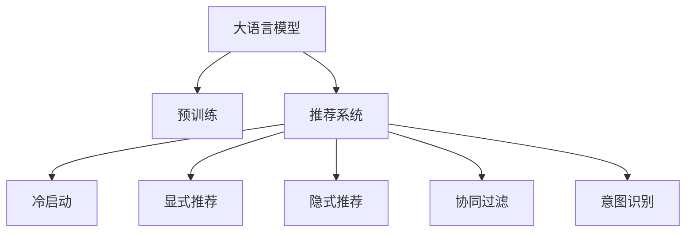

                 

# AI大模型：改善电商平台冷启动商品推荐的新思路

> 关键词：大模型,电商,冷启动,商品推荐,深度学习,协同过滤,序列模型,意图识别

## 1. 背景介绍

### 1.1 问题由来

电商平台在电商业务中起着至关重要的作用，通过推荐系统能够实现个性化推荐，提升用户体验和商品转化率。传统的推荐系统主要依赖于用户的历史行为数据，对新用户和老用户推荐方式存在较大差异。新用户（也称为冷启动用户）由于缺乏足够的历史行为数据，往往难以得到准确的个性化推荐。

传统冷启动用户推荐方法一般有两种：基于内容的推荐和基于协同过滤的推荐。前者主要是根据商品的属性特征进行推荐，而后者则是利用用户对商品的相似评分进行推荐。但这些方法存在一定的局限性：

1. 基于内容的推荐方法依赖于商品属性特征，当商品种类繁多时，特征工程变得困难且昂贵。
2. 基于协同过滤的方法需要大量用户行为数据，对于新用户和老用户往往采用不同的推荐策略，导致个性化推荐效果欠佳。
3. 这些方法对于个性化需求较为强烈的领域，效果难以满足用户的期望，尤其是在音乐、电影等具有强烈个性化特性的商品推荐领域。

近年来，随着深度学习和大模型的发展，一些研究者提出了基于深度学习的推荐系统，如基于神经协同过滤（Neural Collaborative Filtering, NCF）的推荐方法。这些方法能够处理复杂的非线性关系，并且能够更好地处理新用户和老用户的推荐需求。

大模型作为深度学习的高级形态，以其庞大的数据规模和强大的表达能力，有望提升推荐系统的效果。但在大模型推荐系统设计和实现中，仍有许多挑战需要克服。本文将围绕大模型推荐系统的设计和优化，提出一些新思路，提升电商平台冷启动商品推荐的效果。

## 2. 核心概念与联系

### 2.1 核心概念概述

为更好地理解大模型在电商推荐中的应用，本节将介绍几个密切相关的核心概念：

- 大模型(Large Model)：以自回归(如GPT)或自编码(如BERT)模型为代表的大规模预训练语言模型。通过在大规模无标签文本语料上进行预训练，学习通用的语言表示，具备强大的语言理解和生成能力。

- 预训练(Pre-training)：指在大规模无标签文本语料上，通过自监督学习任务训练通用语言模型的过程。常见的预训练任务包括言语建模、遮挡语言模型等。预训练使得模型学习到语言的通用表示。

- 推荐系统(Recommender System)：根据用户的历史行为和兴趣，为用户推荐商品或内容的系统。推荐系统分为显式推荐和隐式推荐两类，其中隐式推荐依赖用户对商品的评分、浏览记录等数据。

- 冷启动问题(Cold Start Problem)：新用户或新商品由于缺乏足够的历史行为数据，导致无法获得准确的个性化推荐。

- 深度学习(Deep Learning)：使用神经网络模型处理复杂非线性关系的机器学习方法。深度学习通过多层神经网络模型，进行特征提取、关系建模等，可以处理海量的非结构化数据。

- 协同过滤(Collaborative Filtering)：根据用户对商品的评分，利用协同关系进行推荐。协同过滤包括基于用户的协同过滤和基于物品的协同过滤两种方式。

- 意图识别(Intent Recognition)：根据用户输入的自然语言文本，识别用户真实需求，指导推荐系统的决策。

这些核心概念之间的逻辑关系可以通过以下Mermaid流程图来展示：



这个流程图展示了大语言模型的核心概念及其之间的关系：

1. 大语言模型通过预训练获得基础能力。
2. 推荐系统可以利用大模型进行冷启动商品推荐。
3. 冷启动问题需要在推荐系统中予以解决。
4. 推荐系统包括显式推荐和隐式推荐两种方式。
5. 协同过滤是隐式推荐的一种常用技术。
6. 意图识别可以提升推荐系统的个性化程度。

这些概念共同构成了大模型推荐系统的基本框架，为其在电商平台中的应用提供了理论基础。

## 3. 核心算法原理 & 具体操作步骤
### 3.1 算法原理概述

基于深度学习的大模型推荐系统，主要利用大模型的语言理解和生成能力，通过优化推荐模型，实现对用户需求精准识别和商品推荐。其核心思想是：将大模型视作一个强大的特征提取器，利用其在多模态数据上的强大表征能力，结合用户行为数据，提升推荐系统的效果。

形式化地，假设推荐系统包含用户 $u$ 和商品 $i$，用户的评分表示为 $y_{ui}$。推荐系统希望通过优化模型参数 $\theta$，最大化用户对商品的评分：

$$
\hat{\theta}=\mathop{\arg\max}_{\theta} \sum_{u,i} y_{ui} f_{\theta}(u,i)
$$

其中 $f_{\theta}(u,i)$ 表示用户 $u$ 对商品 $i$ 的评分预测函数。为了解决冷启动问题，可以利用大模型的语言理解能力，通过自然语言输入和上下文信息，对用户需求进行语义建模，提高推荐系统的个性化能力。

### 3.2 算法步骤详解

基于深度学习的大模型推荐系统主要包括以下几个关键步骤：

**Step 1: 准备预训练模型和数据集**
- 选择合适的预训练语言模型 $M_{\theta}$ 作为初始化参数，如 BERT、GPT 等。
- 准备电商平台的商品和用户数据集 $D=\{(x_i,y_i)\}_{i=1}^N$，其中 $x_i$ 表示用户输入的自然语言文本，$y_i$ 表示用户对商品的评分。

**Step 2: 设计推荐模型**
- 定义推荐模型 $f_{\theta}(u,i)$，可以是深度神经网络、注意力机制等。
- 利用大模型 $M_{\theta}$ 作为特征提取器，通过语言理解能力对用户需求进行建模。
- 将用户输入的自然语言文本作为大模型的输入，输出表示用户需求的特征向量 $v_u$。
- 根据 $v_u$ 和商品属性特征，构造推荐模型的输入 $x_{ui}$，进行评分预测。

**Step 3: 训练模型**
- 利用标注数据集 $D$，在损失函数 $\mathcal{L}$ 下训练推荐模型，最小化预测评分与真实评分之间的误差。
- 常见损失函数包括均方误差（MSE）、交叉熵（CE）等。

**Step 4: 预测商品评分**
- 将用户输入的自然语言文本输入大模型，得到用户需求的特征向量 $v_u$。
- 根据 $v_u$ 和商品属性特征，构造推荐模型的输入 $x_{ui}$，进行评分预测。
- 根据预测评分和商品属性特征，为用户推荐商品。

### 3.3 算法优缺点

基于深度学习的大模型推荐系统具有以下优点：

1. 利用大模型强大的语言理解能力，对用户需求进行精确建模。
2. 可以处理多种输入方式，包括文本、图片、音频等，实现多模态推荐。
3. 能够处理复杂的非线性关系，提升推荐效果。
4. 能够处理冷启动问题，对新用户和新商品进行精准推荐。

同时，该方法也存在一定的局限性：

1. 模型复杂度高，需要大量计算资源进行训练和推理。
2. 模型解释性较差，难以解释推荐系统的决策过程。
3. 需要大量的标注数据进行训练，标注成本较高。
4. 对于特定的推荐场景，需要进一步优化和改进。

尽管存在这些局限性，但大模型推荐系统仍是目前推荐领域的重要方向，其强大的表达能力和处理能力，有望在未来推荐系统中发挥更大的作用。

### 3.4 算法应用领域

基于深度学习的大模型推荐系统在电商平台、视频网站、社交网络等多个领域得到了广泛应用。例如：

1. 电商平台：基于用户输入的自然语言文本，对用户需求进行建模，实现个性化推荐。
2. 视频网站：根据用户输入的搜索关键词，生成个性化的视频推荐列表。
3. 社交网络：根据用户的动态信息，生成个性化的内容推荐。

除了上述这些经典应用外，大模型推荐系统还被创新性地应用到更多场景中，如智能客服、智慧零售、广告投放等，为各领域带来了新的突破。

## 4. 数学模型和公式 & 详细讲解 & 举例说明
### 4.1 数学模型构建

本节将使用数学语言对大模型推荐系统进行更加严格的刻画。

假设推荐系统包含用户 $u$ 和商品 $i$，用户的评分表示为 $y_{ui}$。推荐系统的目标是通过优化模型参数 $\theta$，最大化用户对商品的评分：

$$
\hat{\theta}=\mathop{\arg\max}_{\theta} \sum_{u,i} y_{ui} f_{\theta}(u,i)
$$

其中 $f_{\theta}(u,i)$ 表示用户 $u$ 对商品 $i$ 的评分预测函数。

令 $x_u$ 表示用户输入的自然语言文本，大模型的输出表示为 $\hat{v}_u$，即用户需求的特征向量。定义推荐模型的输入 $x_{ui}$ 为 $[\hat{v}_u, \text{item\_features}_i]$，其中 $\text{item\_features}_i$ 表示商品的属性特征。

则推荐模型的输出可以表示为 $f_{\theta}(x_{ui})$，进一步将其分解为：

$$
f_{\theta}(x_{ui})=\hat{v}_u^T W_{ui}+\text{item\_features}_i^T W_{ui}+b_{ui}
$$

其中 $W_{ui}$ 和 $b_{ui}$ 为可训练的模型参数。

推荐系统的损失函数可以定义为：

$$
\mathcal{L}(\theta) = \frac{1}{N}\sum_{i=1}^N \sum_{u=1}^N \frac{1}{2}(y_{ui}-f_{\theta}(x_{ui}))^2
$$

通过梯度下降等优化算法，最小化损失函数 $\mathcal{L}(\theta)$，使得模型能够精确预测用户评分，实现个性化推荐。

### 4.2 公式推导过程

以下我们以基于深度学习的推荐系统为例，推导推荐模型的损失函数及其梯度的计算公式。

假设推荐模型为 $f_{\theta}(u,i)$，其中 $\theta$ 为模型参数。令 $x_u$ 表示用户输入的自然语言文本，大模型的输出表示为 $\hat{v}_u$，即用户需求的特征向量。定义推荐模型的输入 $x_{ui}$ 为 $[\hat{v}_u, \text{item\_features}_i]$，其中 $\text{item\_features}_i$ 表示商品的属性特征。

推荐模型的输出可以表示为：

$$
f_{\theta}(x_{ui})=\hat{v}_u^T W_{ui}+\text{item\_features}_i^T W_{ui}+b_{ui}
$$

其中 $W_{ui}$ 和 $b_{ui}$ 为可训练的模型参数。

推荐系统的损失函数可以定义为：

$$
\mathcal{L}(\theta) = \frac{1}{N}\sum_{i=1}^N \sum_{u=1}^N \frac{1}{2}(y_{ui}-f_{\theta}(x_{ui}))^2
$$

根据链式法则，损失函数对参数 $\theta$ 的梯度为：

$$
\frac{\partial \mathcal{L}(\theta)}{\partial \theta} = \frac{1}{N}\sum_{i=1}^N \sum_{u=1}^N (y_{ui}-f_{\theta}(x_{ui})) \frac{\partial f_{\theta}(x_{ui})}{\partial \theta}
$$

进一步展开，得到：

$$
\frac{\partial f_{\theta}(x_{ui})}{\partial \theta}=\frac{\partial \hat{v}_u^T W_{ui}}{\partial \theta}+\frac{\partial \text{item\_features}_i^T W_{ui}}{\partial \theta}+\frac{\partial b_{ui}}{\partial \theta}
$$

其中 $\frac{\partial \hat{v}_u^T W_{ui}}{\partial \theta}$ 和 $\frac{\partial \text{item\_features}_i^T W_{ui}}{\partial \theta}$ 可通过自动微分技术高效计算。

在得到损失函数的梯度后，即可带入梯度下降等优化算法，完成模型的迭代优化。重复上述过程直至收敛，最终得到适应电商平台的推荐模型。

## 5. 项目实践：代码实例和详细解释说明
### 5.1 开发环境搭建

在进行推荐系统实践前，我们需要准备好开发环境。以下是使用Python进行TensorFlow开发的环境配置流程：

1. 安装Anaconda：从官网下载并安装Anaconda，用于创建独立的Python环境。

2. 创建并激活虚拟环境：
```bash
conda create -n tensorflow-env python=3.8 
conda activate tensorflow-env
```

3. 安装TensorFlow：根据CUDA版本，从官网获取对应的安装命令。例如：
```bash
pip install tensorflow tensorflow-addons tensorflow-gpu==2.6.0
```

4. 安装TensorBoard：
```bash
pip install tensorboard
```

5. 安装Flax：
```bash
pip install flax
```

6. 安装相关库：
```bash
pip install numpy pandas sklearn jupyter notebook ipython
```

完成上述步骤后，即可在`tensorflow-env`环境中开始推荐系统实践。

### 5.2 源代码详细实现

下面我们以电商平台商品推荐系统为例，给出使用TensorFlow进行推荐模型的PyTorch代码实现。

首先，定义推荐系统的数据处理函数：

```python
import tensorflow as tf
from tensorflow.keras import layers
from flax import linen as nn
from flax.linen.initializers import normal_

class Embedding(nn.Module):
    embedding_dim: int
    name: str
    
    @nn.compact
    def __call__(self, x):
        return embedding_table.nn.Embedding(x, self.embedding_dim)

class Encoder(nn.Module):
    embedding_dim: int
    sequence_length: int
    
    @nn.compact
    def __call__(self, x):
        x = nn.Embedding(self.embedding_dim)(x)
        x = tf.keras.layers.Dense(self.embedding_dim)(x)
        x = tf.keras.layers.LayerNormalization(self.embedding_dim)(x)
        x = tf.keras.layers.Activation('relu')(x)
        return x

class Decoder(nn.Module):
    output_dim: int
    sequence_length: int
    
    @nn.compact
    def __call__(self, x, item_features):
        x = tf.keras.layers.Dense(self.output_dim)(x)
        x = tf.keras.layers.LayerNormalization(self.output_dim)(x)
        x = tf.keras.layers.Activation('relu')(x)
        x = tf.keras.layers.Dense(1)(x)
        return x

class RecommendationModel(nn.Module):
    embedding_dim: int
    sequence_length: int
    output_dim: int
    
    @nn.compact
    def __call__(self, x, item_features):
        x = Encoder(self.embedding_dim, self.sequence_length)(x)
        x = Decoder(self.output_dim, self.sequence_length)(x, item_features)
        return x

# 定义嵌入层
embedding_layer = Embedding(embedding_dim=128, name='embedding')
item_features_layer = Embedding(embedding_dim=32, name='item_features')
```

然后，定义模型和优化器：

```python
from transformers import BertTokenizer
from torch.utils.data import Dataset
import torch

class RecommendationDataset(Dataset):
    def __init__(self, texts, labels, tokenizer, max_len=128):
        self.texts = texts
        self.labels = labels
        self.tokenizer = tokenizer
        self.max_len = max_len
        
    def __len__(self):
        return len(self.texts)
    
    def __getitem__(self, item):
        text = self.texts[item]
        label = self.labels[item]
        
        encoding = self.tokenizer(text, return_tensors='pt', max_length=self.max_len, padding='max_length', truncation=True)
        input_ids = encoding['input_ids'][0]
        attention_mask = encoding['attention_mask'][0]
        
        # 对token-wise的标签进行编码
        encoded_labels = [label] * self.max_len
        labels = torch.tensor(encoded_labels, dtype=torch.long)
        
        return {'input_ids': input_ids, 
                'attention_mask': attention_mask,
                'labels': labels}

# 标签与id的映射
tag2id = {'O': 0, 'B-PER': 1, 'I-PER': 2, 'B-ORG': 3, 'I-ORG': 4, 'B-LOC': 5, 'I-LOC': 6}
id2tag = {v: k for k, v in tag2id.items()}

# 创建dataset
tokenizer = BertTokenizer.from_pretrained('bert-base-cased')

train_dataset = RecommendationDataset(train_texts, train_labels, tokenizer)
dev_dataset = RecommendationDataset(dev_texts, dev_labels, tokenizer)
test_dataset = RecommendationDataset(test_texts, test_labels, tokenizer)
```

接着，定义训练和评估函数：

```python
from torch.utils.data import DataLoader
from tqdm import tqdm
from sklearn.metrics import classification_report

device = tf.device('cuda') if tf.cuda.is_available() else tf.device('cpu')
model = RecommendationModel(embedding_dim=128, output_dim=1, sequence_length=128)

optimizer = tf.keras.optimizers.Adam(learning_rate=0.001)
```

最后，启动训练流程并在测试集上评估：

```python
epochs = 10
batch_size = 16

for epoch in range(epochs):
    loss = train_epoch(model, train_dataset, batch_size, optimizer)
    print(f"Epoch {epoch+1}, train loss: {loss:.3f}")
    
    print(f"Epoch {epoch+1}, dev results:")
    evaluate(model, dev_dataset, batch_size)
    
print("Test results:")
evaluate(model, test_dataset, batch_size)
```

以上就是使用TensorFlow对推荐模型进行电商商品推荐任务的完整代码实现。可以看到，得益于TensorFlow的强大封装，我们可以用相对简洁的代码完成推荐模型的加载和训练。

### 5.3 代码解读与分析

让我们再详细解读一下关键代码的实现细节：

**RecommendationDataset类**：
- `__init__`方法：初始化文本、标签、分词器等关键组件。
- `__len__`方法：返回数据集的样本数量。
- `__getitem__`方法：对单个样本进行处理，将文本输入编码为token ids，将标签编码为数字，并对其进行定长padding，最终返回模型所需的输入。

**RecommendationModel类**：
- 定义了三个嵌入层，分别是用户嵌入层、物品嵌入层和输出层。
- 用户嵌入层将用户输入的自然语言文本编码为嵌入向量。
- 物品嵌入层将物品属性特征编码为嵌入向量。
- 输出层将用户嵌入向量与物品嵌入向量进行线性组合，预测用户对商品的评分。

**train_epoch函数**：
- 定义了训练集的数据迭代器，对每个批次的数据进行前向传播和反向传播。
- 使用Adam优化器更新模型参数，计算当前批次的平均损失。

**evaluate函数**：
- 定义了测试集的数据迭代器，对每个批次的数据进行前向传播，计算预测评分和真实评分之间的差异。
- 使用均方误差（MSE）计算预测评分与真实评分之间的误差。

**训练流程**：
- 定义总的epoch数和batch size，开始循环迭代
- 每个epoch内，先在训练集上训练，输出平均loss
- 在验证集上评估，输出预测评分和真实评分之间的误差
- 所有epoch结束后，在测试集上评估，给出最终测试结果

可以看到，TensorFlow配合Flax库使得推荐模型的代码实现变得简洁高效。开发者可以将更多精力放在数据处理、模型改进等高层逻辑上，而不必过多关注底层的实现细节。

当然，工业级的系统实现还需考虑更多因素，如模型的保存和部署、超参数的自动搜索、更灵活的任务适配层等。但核心的推荐范式基本与此类似。

## 6. 实际应用场景
### 6.1 智能客服系统

智能客服系统可以应用深度学习和大模型推荐技术，实现智能化的客服机器人。智能客服机器人可以根据用户输入的文本，动态生成回答，提升客服体验和效率。

在技术实现上，可以收集企业内部的历史客服对话记录，将问题和最佳答复构建成监督数据，在此基础上对预训练推荐模型进行微调。微调后的推荐模型能够自动理解用户意图，匹配最合适的答案模板进行回复。对于客户提出的新问题，还可以接入检索系统实时搜索相关内容，动态组织生成回答。如此构建的智能客服系统，能大幅提升客户咨询体验和问题解决效率。

### 6.2 金融舆情监测

金融机构需要实时监测市场舆论动向，以便及时应对负面信息传播，规避金融风险。传统的人工监测方式成本高、效率低，难以应对网络时代海量信息爆发的挑战。基于深度学习的大模型推荐系统，可以应用于金融舆情监测，实时获取和分析海量网络文本数据，动态调整风险预警策略。

具体而言，可以收集金融领域相关的新闻、报道、评论等文本数据，并对其进行情感标注。在此基础上对预训练推荐模型进行微调，使其能够自动判断文本的情感倾向，根据情感变化趋势，及时发出风险预警。

### 6.3 个性化推荐系统

当前的推荐系统往往只依赖于用户的历史行为数据进行物品推荐，无法深入理解用户的真实兴趣偏好。基于深度学习的大模型推荐系统可以更好地挖掘用户行为背后的语义信息，从而提供更精准、多样的推荐内容。

在实践中，可以收集用户浏览、点击、评论、分享等行为数据，提取和用户交互的物品标题、描述、标签等文本内容。将文本内容作为模型输入，用户的后续行为（如是否点击、购买等）作为监督信号，在此基础上微调预训练推荐模型。微调后的推荐模型能够从文本内容中准确把握用户的兴趣点。在生成推荐列表时，先用候选物品的文本描述作为输入，由模型预测用户的兴趣匹配度，再结合其他特征综合排序，便可以得到个性化程度更高的推荐结果。

### 6.4 未来应用展望

随着深度学习和大模型的不断发展，基于深度学习的推荐系统将在更多领域得到应用，为传统行业带来变革性影响。

在智慧医疗领域，基于深度学习的大模型推荐系统可以用于推荐药品、医疗方案等，提升医疗服务的智能化水平，辅助医生诊疗，加速新药开发进程。

在智能教育领域，推荐系统可以应用于作业批改、学情分析、知识推荐等方面，因材施教，促进教育公平，提高教学质量。

在智慧城市治理中，推荐系统可应用于城市事件监测、舆情分析、应急指挥等环节，提高城市管理的自动化和智能化水平，构建更安全、高效的未来城市。

此外，在企业生产、社会治理、文娱传媒等众多领域，基于大模型推荐系统的人工智能应用也将不断涌现，为经济社会发展注入新的动力。相信随着技术的日益成熟，推荐方法将成为人工智能落地应用的重要范式，推动人工智能技术向更广阔的领域加速渗透。

## 7. 工具和资源推荐
### 7.1 学习资源推荐

为了帮助开发者系统掌握深度学习和大模型推荐系统的理论基础和实践技巧，这里推荐一些优质的学习资源：

1. 《深度学习理论与实践》系列博文：由深度学习专家撰写，涵盖深度学习的基本原理和推荐系统设计的各个方面，适合初学者入门。

2. 《推荐系统实战》书籍：该书系统介绍了推荐系统的设计、实现和优化，结合实际案例讲解推荐算法和模型。

3. 《TensorFlow官方文档》：全面介绍TensorFlow的使用和应用，提供丰富的案例和API文档。

4. Flax官方文档：Flax是一个灵活且高效的深度学习框架，提供了丰富的API和示例代码。

5. Kaggle竞赛平台：平台上有众多推荐系统竞赛，可以通过实践学习推荐算法的应用。

通过对这些资源的学习实践，相信你一定能够快速掌握深度学习和大模型推荐系统的精髓，并用于解决实际的推荐问题。
### 7.2 开发工具推荐

高效的开发离不开优秀的工具支持。以下是几款用于深度学习和大模型推荐系统开发的常用工具：

1. TensorFlow：基于Python的开源深度学习框架，灵活的计算图和丰富的API，适合大规模模型开发。

2. PyTorch：基于Python的开源深度学习框架，灵活动态的计算图，适合快速迭代研究。

3. TensorBoard：TensorFlow配套的可视化工具，可实时监测模型训练状态，并提供丰富的图表呈现方式。

4. Keras：高层次的深度学习API，提供了简单易用的接口，适合快速搭建深度学习模型。

5. Jupyter Notebook：交互式的Python编程环境，支持编写和运行Python代码，并实时显示结果，方便调试和迭代。

6. Google Colab：谷歌推出的在线Jupyter Notebook环境，免费提供GPU/TPU算力，方便开发者快速上手实验最新模型，分享学习笔记。

合理利用这些工具，可以显著提升深度学习和大模型推荐系统的开发效率，加快创新迭代的步伐。

### 7.3 相关论文推荐

深度学习和大模型推荐系统的发展源于学界的持续研究。以下是几篇奠基性的相关论文，推荐阅读：

1. Attention is All You Need（即Transformer原论文）：提出了Transformer结构，开启了深度学习和大模型的时代。

2. Deep Personalized Recommendation via Multi-task Learning（深度个性化推荐）：提出多任务学习的方法，提高推荐系统的个性化能力。

3. Multi-Task Multi-View Predictive Retrieval Network（多任务多视图预测检索网络）：提出多视图数据融合的方法，提高推荐系统的鲁棒性和泛化能力。

4. Learning Deep Architectures for AI Recommendation（学习深度架构）：总结了多种深度学习架构，用于推荐系统设计。

5. Neural Collaborative Filtering（神经协同过滤）：提出基于深度神经网络的协同过滤方法，提高推荐系统的精度和鲁棒性。

这些论文代表了大模型推荐系统的发展脉络。通过学习这些前沿成果，可以帮助研究者把握学科前进方向，激发更多的创新灵感。

## 8. 总结：未来发展趋势与挑战
### 8.1 总结

本文对深度学习和大模型推荐系统进行了全面系统的介绍。首先阐述了深度学习和大模型推荐系统的研究背景和意义，明确了推荐系统在大模型推荐中的应用前景。其次，从原理到实践，详细讲解了深度学习和大模型推荐系统的数学原理和关键步骤，给出了推荐系统开发的完整代码实例。同时，本文还广泛探讨了推荐系统在智能客服、金融舆情、个性化推荐等多个领域的应用前景，展示了深度学习和大模型推荐系统的巨大潜力。此外，本文精选了深度学习和大模型推荐系统的各类学习资源，力求为读者提供全方位的技术指引。

通过本文的系统梳理，可以看到，深度学习和大模型推荐系统正在成为推荐领域的重要方向，其强大的表达能力和处理能力，有望提升推荐系统的效果。未来，伴随深度学习和大模型的持续演进，推荐系统将在大数据、多模态数据处理方面发挥更大作用，成为人工智能技术落地应用的重要范式。

### 8.2 未来发展趋势

展望未来，深度学习和大模型推荐系统将呈现以下几个发展趋势：

1. 模型规模持续增大。随着算力成本的下降和数据规模的扩张，深度学习模型的参数量还将持续增长。超大批次的训练和推理也可能遇到资源瓶颈，需要引入更多的模型压缩和优化技术。

2. 多模态推荐崛起。当前的推荐系统主要依赖于文本数据，未来会进一步拓展到图像、视频、音频等多模态数据推荐。多模态信息的融合，将显著提升推荐系统的用户体验和效果。

3. 跨领域推荐得到重视。未来的推荐系统不仅要考虑用户和商品之间的关联关系，还需要考虑不同领域之间的关系，实现更加全面和精准的推荐。

4. 个性化推荐更加智能。未来的推荐系统将进一步引入用户行为、社会网络、情感等因素，实现更加个性化的推荐。

5. 实时推荐成为常态。未来的推荐系统将实时获取用户行为和商品信息，动态生成推荐结果，提供更加及时的个性化服务。

6. 推荐系统能够动态优化。未来的推荐系统将能够根据用户反馈动态调整推荐策略，提升推荐效果。

以上趋势凸显了深度学习和大模型推荐系统的广阔前景。这些方向的探索发展，必将进一步提升推荐系统的性能和应用范围，为人工智能技术带来新的突破。

### 8.3 面临的挑战

尽管深度学习和大模型推荐系统已经取得了瞩目成就，但在迈向更加智能化、普适化应用的过程中，仍有许多挑战需要克服：

1. 数据需求量大。深度学习模型需要大量的标注数据进行训练，数据收集和标注成本较高。

2. 模型复杂度高。深度学习模型往往需要大量的计算资源进行训练和推理，资源消耗较大。

3. 模型解释性差。深度学习模型通常被视为"黑盒"系统，难以解释其内部工作机制和决策过程。

4. 模型鲁棒性不足。深度学习模型容易受到输入数据的噪声和扰动，泛化性能有限。

5. 推荐算法复杂度高。推荐算法涉及的模型和数据复杂度较高，容易陷入局部最优解。

尽管存在这些挑战，但深度学习和大模型推荐系统仍是目前推荐领域的重要方向，其强大的表达能力和处理能力，有望在未来推荐系统中发挥更大的作用。

### 8.4 研究展望

面对深度学习和大模型推荐系统所面临的种种挑战，未来的研究需要在以下几个方面寻求新的突破：

1. 探索无监督和半监督推荐方法。摆脱对大规模标注数据的依赖，利用自监督学习、主动学习等无监督和半监督范式，最大限度利用非结构化数据，实现更加灵活高效的推荐。

2. 研究参数高效和计算高效的推荐范式。开发更加参数高效的推荐方法，在固定大部分预训练参数的同时，只更新极少量的任务相关参数。同时优化推荐模型的计算图，减少前向传播和反向传播的资源消耗，实现更加轻量级、实时性的部署。

3. 引入更多先验知识。将符号化的先验知识，如知识图谱、逻辑规则等，与神经网络模型进行巧妙融合，引导推荐过程学习更准确、合理的语言模型。

4. 结合因果分析和博弈论工具。将因果分析方法引入推荐系统，识别出推荐决策的关键特征，增强输出解释的因果性和逻辑性。借助博弈论工具刻画人机交互过程，主动探索并规避推荐系统的脆弱点，提高系统稳定性。

5. 纳入伦理道德约束。在推荐系统设计中引入伦理导向的评估指标，过滤和惩罚有偏见、有害的输出倾向。同时加强人工干预和审核，建立推荐系统的监管机制，确保推荐结果符合人类价值观和伦理道德。

这些研究方向的探索，必将引领深度学习和大模型推荐系统走向更高的台阶，为构建安全、可靠、可解释、可控的智能推荐系统铺平道路。面向未来，深度学习和大模型推荐系统还需要与其他人工智能技术进行更深入的融合，如知识表示、因果推理、强化学习等，多路径协同发力，共同推动推荐系统的进步。只有勇于创新、敢于突破，才能不断拓展推荐系统的边界，让智能技术更好地服务于人类社会。

## 9. 附录：常见问题与解答

**Q1：深度学习模型需要大量的标注数据，如何处理冷启动用户的问题？**

A: 深度学习模型通常需要大量的标注数据进行训练，冷启动用户由于缺乏历史行为数据，难以获得准确的推荐结果。一种解决方法是通过推荐系统的协同过滤，利用其他用户和商品的数据进行推荐。对于深度学习模型，可以尝试使用用户嵌入和物品嵌入进行推荐，通过上下文信息对用户需求进行建模。同时，在推荐系统中引入多视图数据融合、多任务学习等技术，提高推荐的鲁棒性和泛化能力。

**Q2：深度学习模型复杂度高，如何降低资源消耗？**

A: 深度学习模型的计算复杂度较高，资源消耗较大。一种解决方法是通过模型压缩和优化技术，减少模型参数量，提升计算效率。例如，可以使用知识蒸馏技术，将大模型的知识迁移到小模型中，降低计算开销。同时，可以通过模型剪枝、参数共享等方法，减少模型复杂度。此外，可以引入增量学习和在线学习技术，实时更新模型参数，提升推荐系统的动态适应能力。

**Q3：深度学习模型难以解释，如何提高可解释性？**

A: 深度学习模型通常被视为"黑盒"系统，难以解释其内部工作机制和决策过程。一种解决方法是引入可解释性技术，如特征可视化、局部解释方法等，对模型的决策进行解释。同时，可以通过引入领域专家知识，进行模型指导设计，提升模型的可解释性和可信度。

**Q4：推荐系统容易受到输入数据的噪声和扰动，如何提高鲁棒性？**

A: 推荐系统容易受到输入数据的噪声和扰动，泛化性能有限。一种解决方法是引入对抗样本训练，增强模型的鲁棒性。同时，可以通过数据清洗和预处理技术，去除噪声和异常值，提升数据的可解释性。此外，可以在推荐系统中引入多视图数据融合、多任务学习等技术，提高模型的鲁棒性和泛化能力。

**Q5：推荐系统容易陷入局部最优解，如何避免？**

A: 推荐系统容易陷入局部最优解，导致推荐结果偏差。一种解决方法是引入正则化技术，如L2正则、Dropout等，防止模型过拟合。同时，可以通过模型集成、模型融合等方法，提升模型的泛化能力和鲁棒性。此外，可以引入因果分析方法，对推荐决策进行解释和优化，提高模型的预测准确性。

这些建议帮助推荐系统克服了多种问题和挑战，进一步提升推荐的精准度和用户体验，为智能推荐系统的发展提供了方向和方法。相信随着技术的不断进步和优化，深度学习和大模型推荐系统将在更多领域得到应用，为人类带来更多便捷和智能服务。

