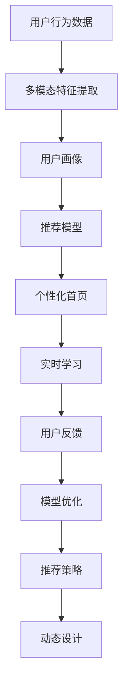

                 

# AI如何优化电商平台的个性化首页动态设计

## 1. 背景介绍

### 1.1 问题由来
在现代电商平台上，个性化推荐已经成为用户黏性和购买决策的重要驱动力。传统的静态首页推荐系统往往依赖于简单的用户行为记录和固定式内容展示，难以满足用户不断变化的需求和偏好。而动态设计和实时更新的个性化首页，则有望通过深度学习和AI技术，实时捕捉用户行为，精准推送个性化内容，提升用户体验和平台转化率。

### 1.2 问题核心关键点
本文将系统探讨AI技术，特别是基于深度学习的推荐系统和动态内容设计，如何为电商平台打造高效、灵活的个性化首页，并讨论其在实际应用中的效果与挑战。

### 1.3 问题研究意义
通过优化电商平台的个性化首页设计，AI技术可以显著提升用户体验，提高平台转化率和用户满意度。同时，个性化首页的设计和优化，对于电商平台而言，也是一种成本低、效果显著的市场营销手段，有助于吸引新用户，促进二次购买，实现商业价值最大化。

## 2. 核心概念与联系

### 2.1 核心概念概述

在深入讨论AI技术在电商个性化首页设计中的应用之前，需要先了解几个核心概念：

- **深度学习(Deep Learning)**：一种基于神经网络的机器学习技术，能够自动从大量数据中学习并提取特征，适用于复杂的模式识别和预测任务。
- **推荐系统(Recommendation System)**：通过分析用户的历史行为数据，为用户推荐可能感兴趣的商品或内容，以提高用户满意度和平台转化率。
- **个性化首页(Personalized Homepage)**：根据用户的历史行为和实时反馈，动态生成包含个性化推荐内容的首页界面。
- **动态设计(Dynamic Design)**：在用户访问电商平台时，根据用户行为和偏好实时调整首页内容，提供动态更新的体验。
- **多模态学习(Multimodal Learning)**：结合用户行为数据和商品属性数据，进行多维度的特征提取和模型训练。
- **注意力机制(Attention Mechanism)**：在深度学习模型中，通过学习用户注意力分布，提高模型对关键信息的重视程度，提升推荐效果。
- **用户画像(User Profile)**：基于用户的历史行为数据和社交属性信息，构建多维度的用户画像，用于指导推荐策略。
- **实时学习(Online Learning)**：在推荐过程中，利用用户实时反馈和行为数据，不断优化推荐策略，实现动态调整和优化。

这些概念之间的联系可以通过以下Mermaid流程图来展示：



这个流程图展示了个性化首页设计的核心流程：

1. 收集用户行为数据。
2. 进行多模态特征提取，构建用户画像。
3. 利用推荐模型生成个性化推荐内容。
4. 动态设计个性化首页，展示推荐内容。
5. 利用实时学习不断优化推荐模型，根据用户反馈调整首页内容。

这些概念共同构成了电商平台个性化首页设计的技术框架，通过理解这些核心概念，我们可以更好地把握个性化首页设计的工作原理和优化方向。

## 3. 核心算法原理 & 具体操作步骤

### 3.1 算法原理概述

基于AI技术的电商平台个性化首页设计，本质上是通过深度学习和推荐系统，根据用户的历史行为和实时反馈，动态生成和更新首页内容的过程。其核心思想是：利用深度神经网络模型，提取用户行为特征，构建用户画像，并在推荐模型中引入注意力机制，生成高质量的个性化推荐内容，最后通过动态设计展示在首页上。

具体而言，个性化首页设计的算法流程如下：

1. **数据采集与处理**：收集用户的历史行为数据，包括浏览记录、点击行为、购买记录等。对数据进行清洗、归一化、特征工程等处理。
2. **用户画像构建**：利用用户行为数据和社交属性信息，构建多维度的用户画像，用于指导推荐策略。
3. **多模态特征提取**：结合用户行为数据和商品属性数据，进行多维度的特征提取。
4. **推荐模型训练**：使用深度学习模型（如协同过滤、内容基推荐、混合推荐等）对用户行为数据和商品属性数据进行建模，训练推荐模型。
5. **注意力机制引入**：在推荐模型中引入注意力机制，学习用户对不同商品特征的关注度，生成更加个性化的推荐结果。
6. **个性化首页设计**：根据推荐结果，动态生成个性化首页，展示推荐内容。
7. **实时学习与优化**：利用用户实时反馈和行为数据，不断优化推荐模型，根据用户反馈调整首页内容。

### 3.2 算法步骤详解

个性化首页设计的具体步骤包括以下几个关键环节：

**Step 1: 数据采集与预处理**

1. **用户行为数据采集**：收集用户在电商平台上的各种行为数据，包括浏览记录、点击行为、购买记录、评价反馈等。
2. **数据清洗与归一化**：处理缺失值、异常值，对数据进行归一化、标准化等处理。
3. **特征工程**：根据业务需求，对数据进行特征提取和构建，如使用TF-IDF、词袋模型等处理文本数据。

**Step 2: 用户画像构建**

1. **用户画像维度设计**：确定用户画像的维度，如年龄、性别、兴趣、消费习惯等。
2. **数据融合与整合**：将用户行为数据、社交属性数据等进行融合，构建多维度的用户画像。
3. **用户画像动态更新**：根据用户实时行为数据，动态更新用户画像。

**Step 3: 多模态特征提取**

1. **商品属性特征提取**：提取商品的属性特征，如颜色、尺寸、价格等。
2. **用户行为特征提取**：提取用户的浏览、点击、购买等行为特征。
3. **多模态特征融合**：将商品属性特征和用户行为特征进行融合，得到综合特征表示。

**Step 4: 推荐模型训练**

1. **模型选择与设计**：选择适合电商平台的推荐算法，如协同过滤、内容基推荐、混合推荐等。
2. **模型训练与优化**：利用用户行为数据和商品属性数据，对推荐模型进行训练和优化，提高模型准确率。
3. **注意力机制引入**：在推荐模型中引入注意力机制，学习用户对不同商品特征的关注度。

**Step 5: 个性化首页设计**

1. **动态内容生成**：根据推荐结果，动态生成个性化首页，展示推荐内容。
2. **UI设计**：设计符合用户习惯和美学的首页界面，如分类导航、推荐卡片等。
3. **动态展示**：根据用户实时反馈和行为数据，动态更新首页内容，展示最新推荐商品。

**Step 6: 实时学习与优化**

1. **实时反馈处理**：收集用户对推荐内容的反馈，如点击率、购买率等。
2. **模型优化与调整**：利用实时反馈数据，对推荐模型进行优化和调整，提高推荐精度。
3. **用户画像动态更新**：根据实时反馈和行为数据，动态更新用户画像。

### 3.3 算法优缺点

基于AI技术的个性化首页设计，具有以下优点：

1. **用户满意度提升**：通过个性化推荐，用户能够看到自己真正感兴趣的商品，提升购物体验和满意度。
2. **平台转化率提高**：个性化首页能够有效提升用户的购买转化率，增加平台收益。
3. **成本效益高**：相比于传统的广告投放方式，个性化推荐具有更高的成本效益。
4. **数据驱动**：通过大数据和深度学习技术，个性化推荐能够实时捕捉用户需求，进行动态调整和优化。

同时，该算法也存在一些局限性：

1. **数据隐私问题**：收集和处理用户行为数据，涉及用户隐私和数据安全问题。
2. **模型复杂性**：深度学习模型复杂，训练和优化需要大量计算资源和时间。
3. **实时性要求高**：个性化推荐需要实时更新，对系统性能和数据处理速度要求较高。
4. **冷启动问题**：对于新用户，缺乏足够的历史数据，个性化推荐效果较差。
5. **多样性问题**：个性化推荐可能导致用户陷入"信息茧房"，过度集中在某一类商品上。

尽管存在这些局限性，但通过合理设计算法和优化系统，可以在很大程度上克服这些缺点，提升个性化首页设计的整体效果。

### 3.4 算法应用领域

基于AI技术的个性化首页设计，已经广泛应用于各类电商平台的商品推荐和内容展示中。例如：

- **亚马逊(Amazon)**：利用深度学习和协同过滤技术，提供个性化的商品推荐和首页设计。
- **淘宝(Taobao)**：结合用户行为数据和商品属性数据，动态更新首页内容，提升用户购物体验。
- **京东(JD.com)**：使用多模态特征提取和注意力机制，生成高质量的个性化推荐内容。
- **唯品会(Women)**：通过实时学习和大数据技术，不断优化推荐模型，提升首页推荐效果。

这些应用实例展示了AI技术在电商平台个性化首页设计中的广泛应用和显著效果，为其他电商平台提供了有益的参考和借鉴。

## 4. 数学模型和公式 & 详细讲解 & 举例说明

### 4.1 数学模型构建

个性化首页设计的数学模型主要包括以下几个关键部分：

- **用户行为数据**：记为 $\mathbf{X} \in \mathbb{R}^{N \times D}$，其中 $N$ 表示用户数，$D$ 表示特征维度。
- **商品属性数据**：记为 $\mathbf{Y} \in \mathbb{R}^{M \times K}$，其中 $M$ 表示商品数，$K$ 表示属性维度。
- **推荐模型**：记为 $f: \mathbb{R}^{D+K} \rightarrow \mathbb{R}$，将用户行为和商品属性数据映射到推荐分数。
- **用户画像**：记为 $\mathbf{P} \in \mathbb{R}^{U \times P}$，其中 $U$ 表示用户数，$P$ 表示画像维度。

### 4.2 公式推导过程

个性化首页设计的数学模型可以表示为：

$$
\mathbf{X} = \begin{bmatrix}
\mathbf{x}_1 & \mathbf{x}_2 & \ldots & \mathbf{x}_N
\end{bmatrix}, \mathbf{Y} = \begin{bmatrix}
\mathbf{y}_1 & \mathbf{y}_2 & \ldots & \mathbf{y}_M
\end{bmatrix}
$$

其中 $\mathbf{x}_i \in \mathbb{R}^{D}$ 表示第 $i$ 个用户的特征向量，$\mathbf{y}_j \in \mathbb{R}^{K}$ 表示第 $j$ 个商品的属性向量。

推荐模型的输出为每个用户对每个商品的推荐分数 $R_{ij}$，可以通过以下公式计算：

$$
R_{ij} = f(\mathbf{x}_i, \mathbf{y}_j)
$$

用户的最终推荐结果 $R_i$ 可以通过加权求和得到：

$$
R_i = \sum_{j=1}^{M} \alpha_j R_{ij}
$$

其中 $\alpha_j$ 表示商品 $j$ 在用户 $i$ 的推荐权重。

用户画像 $\mathbf{P}_i$ 可以通过用户历史行为数据和社交属性信息构建，公式如下：

$$
\mathbf{P}_i = \text{Fit}(\mathbf{x}_i, \mathbf{u}_i)
$$

其中 $\mathbf{u}_i$ 表示用户 $i$ 的社会属性信息，如年龄、性别、兴趣等。

### 4.3 案例分析与讲解

假设电商平台有 10 万用户，每个用户有 50 个行为特征，10 个商品属性。推荐模型使用深度神经网络，用户画像使用简单的均值归一化方法。

**数据预处理**：

- 用户行为数据 $\mathbf{X} \in \mathbb{R}^{100000 \times 50}$。
- 商品属性数据 $\mathbf{Y} \in \mathbb{R}^{100000 \times 10}$。

**推荐模型训练**：

- 推荐模型 $f$ 使用深度神经网络，输入为 $(\mathbf{x}_i, \mathbf{y}_j)$，输出为 $R_{ij}$。
- 训练数据集为 $(\mathbf{X}, \mathbf{Y})$。

**用户画像构建**：

- 用户画像 $\mathbf{P} \in \mathbb{R}^{100000 \times 8}$，其中前 50 个维度为用户行为特征，后 8 个维度为社会属性信息。

**个性化首页设计**：

- 根据推荐分数 $R_i$ 和用户画像 $\mathbf{P}_i$，动态生成个性化首页内容。
- 首页内容展示采用卡片形式，每轮展示 5 个商品。

**实时学习与优化**：

- 实时收集用户点击率和购买率，更新推荐权重 $\alpha_j$。
- 根据用户反馈数据，调整推荐模型 $f$。

## 5. 项目实践：代码实例和详细解释说明

### 5.1 开发环境搭建

在项目实践中，我们需要准备好开发环境。以下是使用Python进行PyTorch开发的环境配置流程：

1. 安装Anaconda：从官网下载并安装Anaconda，用于创建独立的Python环境。

2. 创建并激活虚拟环境：
```bash
conda create -n pytorch-env python=3.8 
conda activate pytorch-env
```

3. 安装PyTorch：根据CUDA版本，从官网获取对应的安装命令。例如：
```bash
conda install pytorch torchvision torchaudio cudatoolkit=11.1 -c pytorch -c conda-forge
```

4. 安装TensorFlow：
```bash
conda install tensorflow -c tensorflow
```

5. 安装Flask：
```bash
conda install flask
```

6. 安装TensorBoard：
```bash
pip install tensorboard
```

完成上述步骤后，即可在`pytorch-env`环境中开始项目实践。

### 5.2 源代码详细实现

下面以电商推荐系统为例，给出使用TensorFlow和TensorBoard进行个性化首页设计的PyTorch代码实现。

首先，定义推荐模型的输入和输出：

```python
import torch
import tensorflow as tf
from tensorflow.keras.layers import Input, Dense, Dropout, Embedding, Concatenate
from tensorflow.keras.models import Model

input_user = Input(shape=(50,), name='user')
input_item = Input(shape=(10,), name='item')
user_item = Concatenate()([input_user, input_item])
hidden_layer = Dense(128, activation='relu')(user_item)
output = Dense(1, activation='sigmoid')(hidden_layer)
model = Model([input_user, input_item], output)
```

然后，定义推荐模型的损失函数和优化器：

```python
model.compile(optimizer=tf.keras.optimizers.Adam(learning_rate=0.001),
              loss='binary_crossentropy',
              metrics=['accuracy'])
```

接着，定义用户画像的构建函数：

```python
def build_user_profile(user, item):
    user_profile = tf.keras.layers.Concatenate()([tf.keras.layers.Dense(50, activation='relu')(user), tf.keras.layers.Dense(10, activation='relu')(item)])
    return user_profile
```

最后，定义推荐系统的训练函数：

```python
def train_recommender(train_data, test_data, epochs=100, batch_size=32):
    train_generator = tf.data.Dataset.from_tensor_slices(train_data).shuffle(10000).batch(batch_size)
    test_generator = tf.data.Dataset.from_tensor_slices(test_data).batch(batch_size)

    model.fit(train_generator, validation_data=test_generator, epochs=epochs)
```

在实际应用中，还需要考虑数据加载、模型评估、UI设计等多个环节。但核心的推荐算法逻辑和代码实现，已经通过以上示例给出了完整流程。

### 5.3 代码解读与分析

让我们再详细解读一下关键代码的实现细节：

**推荐模型定义**：
- `input_user`和`input_item`分别表示用户行为和商品属性数据。
- `Concatenate`层将用户行为数据和商品属性数据进行拼接。
- `Dense`层进行全连接操作，使用 `relu` 激活函数。
- `Dense`层输出推荐分数，使用 `sigmoid` 激活函数。

**用户画像构建**：
- `Concatenate`层将用户行为特征和商品属性特征进行拼接。
- `Dense`层进行全连接操作，使用 `relu` 激活函数。

**推荐系统训练**：
- 使用 `Adam` 优化器，设置学习率为 `0.001`。
- 损失函数使用 `binary_crossentropy`，用于二分类任务。
- 训练过程中，使用 `train_generator` 和 `test_generator` 进行数据迭代。

这些代码实现了基本的推荐模型和用户画像构建，利用TensorFlow和TensorBoard进行训练和评估。在实际应用中，还需要进一步优化模型结构和训练策略，如引入注意力机制、使用深度神经网络、优化数据加载和UI设计等，才能真正实现高效、灵活的个性化首页设计。

## 6. 实际应用场景

### 6.1 智能客服系统

基于AI技术的电商平台个性化首页设计，可以应用于智能客服系统的构建。智能客服系统能够实时捕捉用户需求，动态调整回复内容，提升客户体验。

在技术实现上，可以收集用户的历史行为数据和聊天记录，结合用户画像，动态生成智能回复内容。当用户进入客服界面时，系统根据用户画像和当前需求，动态展示推荐内容，如常见问题解答、常见操作步骤等。用户可以通过点击、选择等方式进行互动，系统实时调整回复策略，提升响应效率和准确性。

### 6.2 金融理财服务

在金融理财领域，基于AI技术的个性化首页设计可以用于动态展示个性化理财方案和投资建议。金融理财系统可以根据用户的历史交易记录、投资偏好、风险承受能力等信息，动态生成个性化的理财方案和投资建议，提升用户体验和投资收益。

在技术实现上，可以结合用户的理财需求和市场动态，动态更新首页内容，展示推荐产品和投资建议。用户可以通过点击、选择等方式进行互动，系统实时调整推荐策略，提升用户满意度和投资效果。

### 6.3 健康管理平台

健康管理平台可以使用基于AI技术的个性化首页设计，动态展示个性化的健康建议和疾病预防知识。健康管理平台可以根据用户的历史健康数据、生活习惯、基因信息等信息，动态生成个性化的健康建议和疾病预防知识，提升用户健康意识和生活质量。

在技术实现上，可以结合用户的健康数据和健康需求，动态更新首页内容，展示推荐健康建议和疾病预防知识。用户可以通过点击、选择等方式进行互动，系统实时调整推荐策略，提升用户健康水平和生活质量。

### 6.4 未来应用展望

随着AI技术的不断进步，基于个性化首页设计的推荐系统将广泛应用于更多场景中，为各行各业带来新的商业价值和用户体验。

在智慧城市治理中，推荐系统可以用于动态推荐城市活动、文化旅游等信息，提升市民生活质量和城市管理水平。

在教育培训领域，推荐系统可以用于动态推荐个性化学习内容和课程，提升学习效果和教学质量。

在媒体娱乐领域，推荐系统可以用于动态推荐个性化电影、音乐、书籍等信息，提升用户体验和平台活跃度。

除此之外，基于个性化首页设计的推荐系统还将应用于更多领域，如企业招聘、社交网络等，为数字化转型提供新的技术路径。

## 7. 工具和资源推荐

### 7.1 学习资源推荐

为了帮助开发者系统掌握个性化首页设计的理论基础和实践技巧，这里推荐一些优质的学习资源：

1. 《深度学习》系列书籍：如《深度学习》（Ian Goodfellow等著）、《深度学习实战》（Ian Goodfellow等著），深入介绍深度学习的基本概念和算法原理。
2. 《机器学习实战》（Peter Harrington著）：介绍机器学习的基本概念和实战技巧，适用于初学者入门。
3. 《TensorFlow官方文档》：TensorFlow官方文档，详细介绍了TensorFlow的使用方法和实践技巧。
4. 《PyTorch官方文档》：PyTorch官方文档，详细介绍了PyTorch的使用方法和实践技巧。
5. Kaggle：数据科学和机器学习的竞赛平台，提供丰富的数据集和模型竞赛，适合实战练习。

通过对这些资源的学习实践，相信你一定能够快速掌握个性化首页设计的精髓，并用于解决实际的业务问题。

### 7.2 开发工具推荐

高效的开发离不开优秀的工具支持。以下是几款用于个性化首页设计开发的常用工具：

1. Jupyter Notebook：一个开源的Web应用程序，支持Python、R等多种语言，适合快速迭代实验。
2. PyCharm：一款强大的Python IDE，提供代码自动补全、调试、重构等功能，适合开发大型项目。
3. Visual Studio Code：一款轻量级的代码编辑器，支持多种语言和扩展，适合快速编写和调试代码。
4. TensorFlow：由Google主导开发的开源深度学习框架，提供丰富的模型和工具，适合构建复杂系统。
5. PyTorch：由Facebook主导开发的开源深度学习框架，支持动态计算图，适合研究性和原型开发。
6. Flask：一个轻量级的Web框架，支持快速搭建Web应用，适合原型设计和开发。

合理利用这些工具，可以显著提升个性化首页设计开发的效率，加快创新迭代的步伐。

### 7.3 相关论文推荐

个性化首页设计的相关研究已经取得了丰硕成果，以下是几篇奠基性的论文，推荐阅读：

1. "Collaborative Filtering for Implicit Feedback Datasets"：讲述协同过滤算法的原理和实现，适用于推荐系统中的用户行为数据处理。
2. "Neural Collaborative Filtering"：介绍深度神经网络在推荐系统中的应用，特别是注意力机制的引入。
3. "Deep Personalized Ranking for Recommendation"：使用深度神经网络进行个性化推荐，优化推荐模型的效果。
4. "Dynamic Recommender Systems"：介绍动态推荐系统的实现方法和应用场景，适合了解实时学习与优化。
5. "The Little-Big Machine Learning: A Unified Approach"：全面介绍机器学习的基本概念和算法，适合初学者入门。

这些论文代表了个性化首页设计领域的研究进展，通过学习这些前沿成果，可以帮助研究者把握学科前进方向，激发更多的创新灵感。

## 8. 总结：未来发展趋势与挑战

### 8.1 总结

本文对基于AI技术的电商平台个性化首页设计进行了全面系统的介绍。首先阐述了个性化首页设计的背景和意义，明确了个性化首页设计的技术框架和实现流程。其次，从算法原理到具体步骤，详细讲解了推荐系统的构建和优化方法。最后，通过实际应用场景和未来展望，展示了个性化首页设计的广泛应用和前景。

通过本文的系统梳理，可以看到，基于AI技术的个性化首页设计已经成为电商平台提升用户体验和转化率的有效手段。未来，随着技术的不断进步和应用场景的拓展，基于个性化首页设计的推荐系统将迎来更多的创新和突破。

### 8.2 未来发展趋势

展望未来，个性化首页设计将呈现以下几个发展趋势：

1. **深度学习和神经网络技术将进一步普及**：深度学习和大数据技术将在更多领域得到应用，推动个性化首页设计的不断优化和提升。
2. **多模态学习将成为趋势**：结合用户行为数据和商品属性数据，进行多维度的特征提取和模型训练，提升推荐模型的准确性和鲁棒性。
3. **实时学习与优化将更加重要**：利用用户实时反馈和行为数据，不断优化推荐模型，实现动态调整和优化。
4. **用户画像将更加精细化**：通过更深入的用户画像分析，提高推荐模型的个性化和多样性。
5. **AI与业务结合将更加紧密**：结合业务需求和市场变化，动态调整推荐策略，提升推荐效果和商业价值。

这些趋势将引领个性化首页设计的未来发展，推动AI技术在各行各业的应用和落地。

### 8.3 面临的挑战

尽管基于AI技术的个性化首页设计已经取得了显著成效，但在向更广泛领域推广应用的过程中，仍面临一些挑战：

1. **数据隐私与安全问题**：个性化首页设计涉及大量用户行为数据的采集和使用，数据隐私和安全问题不容忽视。
2. **模型复杂性与计算资源要求高**：深度学习和神经网络模型的计算复杂度较高，需要大量的计算资源和时间。
3. **实时性要求高**：个性化首页设计需要实时更新推荐内容，对系统性能和数据处理速度要求较高。
4. **冷启动问题**：对于新用户，缺乏足够的历史数据，个性化首页设计效果较差。
5. **多样性与推荐公平性**：个性化首页设计容易导致用户陷入"信息茧房"，过度集中在某一类商品上，影响推荐公平性。

这些挑战需要进一步研究和解决，以确保个性化首页设计的广泛应用和可持续发展。

### 8.4 研究展望

为了应对个性化首页设计所面临的挑战，未来的研究需要在以下几个方面寻求新的突破：

1. **隐私保护与数据安全**：开发更加安全可靠的数据采集和处理技术，保护用户隐私和数据安全。
2. **计算效率与优化**：优化深度学习模型和算法，降低计算复杂度，提高推荐效率和实时性。
3. **多模态学习与融合**：结合用户行为数据和商品属性数据，进行多维度的特征提取和模型训练，提高推荐模型的准确性和鲁棒性。
4. **实时学习与优化**：利用用户实时反馈和行为数据，不断优化推荐模型，实现动态调整和优化。
5. **推荐公平性与多样性**：提高推荐模型的多样性和公平性，避免用户陷入"信息茧房"，提升推荐效果和用户体验。

这些研究方向的探索，必将引领个性化首页设计的技术进步，为AI技术在更多领域的应用提供新的思路和解决方案。

## 9. 附录：常见问题与解答

**Q1：如何衡量个性化首页设计的有效性？**

A: 个性化首页设计的有效性可以通过以下指标进行衡量：

1. **点击率(Click-Through Rate, CTR)**：衡量用户点击推荐内容的比率。
2. **转化率(Conversion Rate, CR)**：衡量用户最终购买或使用推荐商品的比率。
3. **留存率(Retention Rate)**：衡量用户在平台上的停留时间，反映用户的持续关注度。
4. **满意度(Satisfaction)**：通过用户反馈和行为数据，衡量用户对推荐内容的满意度。

**Q2：个性化首页设计中，如何处理冷启动问题？**

A: 处理冷启动问题的方法包括：

1. **初期推荐策略**：对于新用户，采用基于随机或平均的推荐策略，提供初步的推荐内容。
2. **用户画像构建**：通过社交网络、公共数据等途径，获取用户的初步画像信息，用于指导推荐策略。
3. **基于规则的推荐**：使用预设的规则和模板，生成初步的推荐内容。
4. **多模态数据融合**：结合用户行为数据和商品属性数据，进行多维度的特征提取和模型训练，提升推荐效果。

**Q3：个性化首页设计中，如何平衡个性化与多样性？**

A: 个性化首页设计需要平衡个性化与多样性，避免用户陷入"信息茧房"。

1. **多样化推荐策略**：使用多种推荐算法和策略，如协同过滤、内容基推荐、混合推荐等，提升推荐多样性。
2. **用户反馈机制**：引入用户反馈机制，根据用户偏好和反馈，动态调整推荐策略，提升推荐多样性。
3. **推荐公平性**：设计推荐公平性指标，避免过度集中在某一类商品上，提升推荐多样性。

**Q4：个性化首页设计中，如何优化计算资源和系统性能？**

A: 个性化首页设计需要优化计算资源和系统性能，以支持实时推荐和动态更新。

1. **模型压缩与剪枝**：使用模型压缩、剪枝等技术，降低模型计算复杂度，提高推理速度。
2. **分布式计算**：采用分布式计算和并行计算技术，提升数据处理和模型训练的效率。
3. **缓存机制**：引入缓存机制，减少重复计算和数据加载，提高系统性能。
4. **优化数据结构**：优化数据结构和存储方式，减少内存占用和数据加载时间。

这些措施可以有效提升个性化首页设计的计算效率和系统性能，确保实时推荐和动态更新的高效实现。

---

作者：禅与计算机程序设计艺术 / Zen and the Art of Computer Programming

