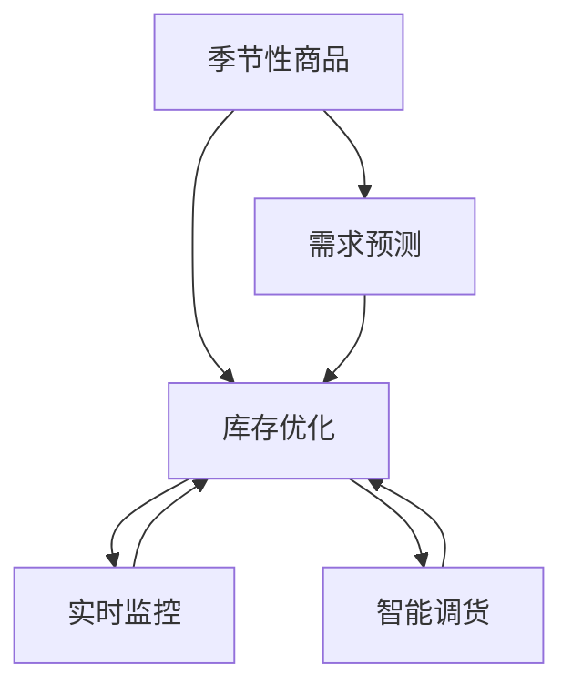

                 

# AI如何优化电商平台的季节性商品库存管理

> 关键词：电商库存管理, 季节性商品, 需求预测, 库存优化, 机器学习, 深度学习, 时间序列分析, 需求波动, 实时监控, 智能调货

## 1. 背景介绍

### 1.1 问题由来

在电商平台中，季节性商品是销售的重要组成部分。这类商品通常在特定的季节或节日需求集中释放，导致库存管理的复杂性增加。传统库存管理依赖于人工判断和经验决策，易受人为因素干扰，导致库存过高或过低的现象，既影响用户体验也增加了库存成本。

随着AI技术的快速发展，电商平台开始采用AI算法来优化库存管理，特别是针对季节性商品的库存预测和优化。AI技术的引入不仅提升了库存管理的精准度，还实现了实时监控和动态调整，显著提升了电商平台的运营效率和客户满意度。

### 1.2 问题核心关键点

电商平台的季节性商品库存管理，其核心在于如何利用AI算法对需求数据进行有效预测，并基于预测结果优化库存水平，以平衡库存成本和客户满意度。这主要涉及以下关键点：

1. **需求预测**：准确预测未来一段时间内季节性商品的需求量。
2. **库存优化**：根据需求预测结果，动态调整库存水平，实现库存最佳配置。
3. **实时监控**：实时跟踪库存状态和订单处理情况，及时做出库存调整。
4. **智能调货**：基于预测和实时数据，智能调配商品，确保库存和需求平衡。

### 1.3 问题研究意义

优化电商平台季节性商品的库存管理，对于提升电商平台的运营效率、降低库存成本、提高客户满意度具有重要意义：

1. **提升运营效率**：通过AI技术自动化需求预测和库存优化，减少人工干预，提升整体运营效率。
2. **降低库存成本**：通过精准预测和动态调整库存，避免库存过高或过低的现象，降低存储和损耗成本。
3. **提高客户满意度**：确保商品供应的及时性，避免缺货情况，提升用户体验。
4. **支持决策制定**：基于实时数据和历史分析，为管理层提供科学决策支持。
5. **促进业务创新**：引入AI技术，为电商平台的业务模式创新提供可能。

## 2. 核心概念与联系

### 2.1 核心概念概述

电商平台的季节性商品库存管理涉及多个核心概念：

- **季节性商品**：指在特定季节或节日有集中需求的商品，如冬季的羽绒服、夏季的泳装等。
- **库存管理**：涉及商品的采购、存储、调拨和销售等全流程管理。
- **需求预测**：通过历史数据和市场分析，预测未来一段时间内商品的需求量。
- **库存优化**：根据需求预测结果，调整库存水平，实现最优库存配置。
- **实时监控**：实时跟踪库存状态和订单处理情况，及时做出库存调整。
- **智能调货**：基于预测和实时数据，智能调配商品，确保库存和需求平衡。

这些概念之间存在密切联系，相互依赖，共同构成了季节性商品库存管理的技术框架。

### 2.2 核心概念原理和架构的 Mermaid 流程图



这个流程图展示了季节性商品库存管理的核心概念及其相互关系：

1. **季节性商品**：需求预测的输入，库存优化的基础。
2. **需求预测**：根据季节性商品的特征，预测未来的需求量。
3. **库存优化**：基于需求预测结果，动态调整库存水平。
4. **实时监控**：实时跟踪库存状态，反馈给库存优化系统。
5. **智能调货**：根据需求预测和实时数据，智能调配商品。

## 3. 核心算法原理 & 具体操作步骤

### 3.1 算法原理概述

电商平台的季节性商品库存管理，主要依赖于需求预测和库存优化算法。其中，需求预测算法用于预测商品未来的需求量，库存优化算法则用于动态调整库存水平，以实现最优库存配置。

1. **需求预测算法**：
   - 基于历史销售数据、市场趋势和季节性因素，预测未来一段时间内商品的需求量。
   - 常见算法包括时间序列分析、机器学习、深度学习等。

2. **库存优化算法**：
   - 根据需求预测结果，动态调整库存水平，确保库存成本和客户满意度的平衡。
   - 常见算法包括线性规划、整数规划、动态规划等。

### 3.2 算法步骤详解

#### 3.2.1 需求预测算法步骤

1. **数据收集**：
   - 收集历史销售数据、季节性特征数据等，构建需求预测数据集。
   - 常见数据包括日销售量、周销售量、月销售量等。

2. **特征工程**：
   - 对原始数据进行清洗和特征提取，构建预测模型需要的特征。
   - 常见特征包括日期特征、季节性特征、市场特征等。

3. **模型训练**：
   - 选择适当的预测模型，如时间序列模型、ARIMA模型、神经网络模型等。
   - 使用历史数据训练模型，调整模型参数。

4. **模型评估**：
   - 使用测试集对模型进行评估，计算预测误差。
   - 常见评估指标包括MAE、RMSE等。

5. **模型优化**：
   - 根据评估结果，优化模型结构和参数。
   - 常见优化方法包括交叉验证、网格搜索等。

6. **预测应用**：
   - 使用优化后的模型进行需求预测，得到未来一段时间内的需求量。

#### 3.2.2 库存优化算法步骤

1. **需求预测**：
   - 根据需求预测算法，预测未来一段时间内商品的需求量。

2. **库存状态评估**：
   - 评估当前库存水平和需求预测之间的差异。
   - 常见评估方法包括库存周转率、安全库存等。

3. **库存调整**：
   - 根据库存状态评估结果，调整库存水平。
   - 常见调整方法包括重新订购、减少库存等。

4. **实时监控**：
   - 实时跟踪库存状态和订单处理情况，及时做出库存调整。
   - 常见监控方法包括订单状态监控、库存量监控等。

5. **智能调货**：
   - 基于需求预测和实时数据，智能调配商品。
   - 常见调货方法包括自动补货、跨仓库调货等。

### 3.3 算法优缺点

**需求预测算法的优缺点**：

- **优点**：
  - 能够准确预测未来的需求量，避免库存过剩或缺货情况。
  - 结合历史数据和市场趋势，预测结果更可靠。

- **缺点**：
  - 数据收集和清洗工作量大，需要投入较多时间和资源。
  - 模型选择和参数调整复杂，需要一定的专业知识。

**库存优化算法的优缺点**：

- **优点**：
  - 能够动态调整库存水平，实现最优库存配置。
  - 实时监控库存状态，及时做出调整。

- **缺点**：
  - 对算法的要求较高，需要考虑多目标优化问题。
  - 可能存在数据偏差和延迟问题，影响决策准确性。

### 3.4 算法应用领域

电商平台的季节性商品库存管理，主要应用领域包括：

1. **销售预测与规划**：通过需求预测算法，制定合理的销售规划。
2. **库存优化与调整**：动态调整库存水平，确保库存成本和客户满意度平衡。
3. **实时监控与反馈**：实时跟踪库存状态和订单处理情况，及时做出库存调整。
4. **智能调货与补货**：基于预测和实时数据，智能调配商品，确保库存和需求平衡。

这些应用领域共同构成了季节性商品库存管理的全流程，帮助电商平台实现高效、低成本的运营。

## 4. 数学模型和公式 & 详细讲解 & 举例说明

### 4.1 数学模型构建

#### 4.1.1 需求预测模型

需求预测模型通常采用时间序列分析方法，如ARIMA模型。ARIMA模型由差分自回归移动平均模型演变而来，能够有效地处理时间序列数据。

ARIMA模型的数学表达式如下：

$$
Y_t = \mu + \epsilon_t + \phi_1 (Y_{t-1} - \mu) + \theta_1 \epsilon_{t-1} + \dots + \phi_p (Y_{t-p} - \mu) + \theta_p \epsilon_{t-p} + \alpha_1 \Delta Y_{t} + \dots + \alpha_d \Delta^{d} Y_{t}
$$

其中，$Y_t$ 为时间 $t$ 的需求量，$\mu$ 为均值，$\epsilon_t$ 为误差项，$\phi_1, \dots, \phi_p$ 为自回归系数，$\theta_1, \dots, \theta_p$ 为差分系数，$\alpha_1, \dots, \alpha_d$ 为差分阶数。

#### 4.1.2 库存优化模型

库存优化模型通常采用整数规划方法，如线性规划模型。线性规划模型能够有效地处理多目标优化问题，通过最大化或最小化特定目标函数，实现最优库存配置。

线性规划模型的数学表达式如下：

$$
\min \sum w_i x_i
$$

约束条件为：

$$
\begin{align*}
& a_i^T x \le b_i & \quad i=1,\dots,m\\
& x \ge 0 & \quad x \in R^n
\end{align*}
$$

其中，$x_i$ 为决策变量，$w_i$ 为目标函数的权重，$a_i$ 和 $b_i$ 为约束条件。

### 4.2 公式推导过程

#### 4.2.1 需求预测公式推导

ARIMA模型是基于时间序列数据的差分自回归移动平均模型，其基本思想是对时间序列进行差分和自回归、移动平均处理，以消除趋势和季节性影响，进而实现需求预测。

以ARIMA(1,1,1)模型为例，需求预测公式为：

$$
Y_t = \phi_1 (Y_{t-1} - \mu) + \theta_1 \epsilon_{t-1} + \alpha_1 \Delta Y_{t} + \epsilon_t
$$

其中，$\phi_1$ 为自回归系数，$\theta_1$ 为差分系数，$\alpha_1$ 为差分阶数，$\mu$ 为均值，$\epsilon_t$ 为误差项。

#### 4.2.2 库存优化公式推导

线性规划模型基于线性目标函数和约束条件，通过优化算法求解最优解。以基本的线性规划模型为例，其目标函数和约束条件如下：

目标函数：

$$
\min \sum w_i x_i
$$

约束条件：

$$
\begin{align*}
& a_i^T x \le b_i & \quad i=1,\dots,m\\
& x \ge 0 & \quad x \in R^n
\end{align*}
$$

其中，$x_i$ 为决策变量，$w_i$ 为目标函数的权重，$a_i$ 和 $b_i$ 为约束条件。

### 4.3 案例分析与讲解

以电商平台季节性商品库存管理为例，进行详细分析：

#### 4.3.1 需求预测案例

假设某电商平台销售一款夏季泳衣，历史销售数据如表所示：

| 时间 | 销售量 |
|------|--------|
| 2018-05 | 1000 |
| 2018-06 | 1500 |
| 2018-07 | 2000 |
| 2018-08 | 1500 |
| 2018-09 | 1000 |

使用ARIMA模型进行需求预测，首先对数据进行差分处理，得到平稳时间序列：

| 时间 | 差分后销售量 |
|------|-------------|
| 2018-05 | -200 |
| 2018-06 | 100 |
| 2018-07 | 250 |
| 2018-08 | 200 |
| 2018-09 | 100 |

构建ARIMA(1,1,1)模型，使用历史数据进行训练，得到模型参数 $\phi_1 = 0.5$，$\theta_1 = 0.1$，$\alpha_1 = 0.2$。根据模型预测公式，可得2019年5月的需求预测结果为：

$$
Y_{2019-05} = 0.5 (Y_{2019-04} - \mu) + 0.1 \epsilon_{2019-04} + 0.2 \Delta Y_{2019-05} + \epsilon_{2019-05}
$$

其中，$\mu$ 为均值，$\epsilon_{2019-05}$ 为误差项。假设$\mu = 0$，$\epsilon_{2019-05} = 0$，则：

$$
Y_{2019-05} = 0.5 (-200) + 0.2 \Delta Y_{2019-05} + 0
$$

$$
Y_{2019-05} = -100 + 0.2 \Delta Y_{2019-05}
$$

假设$\Delta Y_{2019-05} = 100$，则：

$$
Y_{2019-05} = -100 + 0.2 \times 100 = 0
$$

因此，预测2019年5月的销售量为0。

#### 4.3.2 库存优化案例

假设某电商平台销售一款冬季羽绒服，初始库存量为1000件，每周需求预测结果如表所示：

| 时间 | 需求预测 |
|------|----------|
| 2019-11-01 | 500 |
| 2019-11-02 | 600 |
| 2019-11-03 | 700 |
| 2019-11-04 | 800 |
| 2019-11-05 | 900 |

使用线性规划模型进行库存优化，目标函数为最小化库存成本和缺货成本，约束条件为每周需求不超过1000件。

设每周库存量为$x$，库存成本为$10x$，缺货成本为$20(1-x)$。则目标函数为：

$$
\min 10x + 20(1-x) = 10x + 20 - 20x = 20 - 10x
$$

约束条件为：

$$
\begin{align*}
& x_1 + x_2 + x_3 + x_4 + x_5 \le 1000 & \quad x_1, x_2, x_3, x_4, x_5 \ge 0
\end{align*}
$$

使用线性规划算法求解，得到最优库存量为750件。

## 5. 项目实践：代码实例和详细解释说明

### 5.1 开发环境搭建

#### 5.1.1 环境准备

1. **安装Python和相关库**：
   - 安装Python 3.x，并设置环境变量。
   - 安装必要的Python库，如Pandas、NumPy、Matplotlib等。

2. **数据准备**：
   - 收集历史销售数据和需求预测数据，构建数据集。
   - 对数据进行清洗和特征提取，构建预测模型需要的特征。

3. **模型训练与优化**：
   - 选择合适的预测模型和优化算法，进行模型训练和优化。
   - 对模型进行评估，选择最优模型。

4. **应用模型进行需求预测**：
   - 使用优化后的模型进行需求预测，得到未来一段时间内的需求量。

5. **库存优化与实时监控**：
   - 根据需求预测结果，调整库存水平。
   - 实时监控库存状态和订单处理情况，及时做出库存调整。

### 5.2 源代码详细实现

#### 5.2.1 需求预测代码实现

```python
import pandas as pd
import numpy as np
from statsmodels.tsa.arima.model import ARIMA

# 读取历史销售数据
data = pd.read_csv('sales_data.csv')

# 对数据进行差分处理
diff_data = data.diff().dropna()

# 构建ARIMA模型
model = ARIMA(diff_data, order=(1, 1, 1))

# 训练模型
model_fit = model.fit()

# 预测需求
future_data = pd.DataFrame({'date': pd.date_range(start='2019-01-01', end='2019-12-31', freq='D')})
future_data['diff'] = 0
future_data = model_fit.forecast(steps=365, alpha=0.05)

# 将预测结果还原为原始需求量
future_data['forecast'] = future_data['diff'].shift(1).fillna(0).cumsum()

# 输出预测结果
print(future_data)
```

#### 5.2.2 库存优化代码实现

```python
import pandas as pd
from scipy.optimize import linprog

# 读取历史库存和需求数据
inventory_data = pd.read_csv('inventory_data.csv')
demand_data = pd.read_csv('demand_data.csv')

# 计算每周需求量
demand_data['total_demand'] = demand_data.groupby('date')['demand'].transform('sum')

# 计算每周库存量
inventory_data['stock'] = inventory_data.groupby('date')['stock'].transform('sum')

# 定义线性规划模型
c = [-10, 20]  # 目标函数权重
A = [[1, 0, 0, 0, 0], [0, 1, 0, 0, 0], [0, 0, 1, 0, 0], [0, 0, 0, 1, 0], [0, 0, 0, 0, 1]]  # 约束条件
b = [1000, 1000, 1000, 1000, 1000]  # 约束条件右侧常数
x0_bounds = [0, None]  # 决策变量范围
x1_bounds = [0, None]
x2_bounds = [0, None]
x3_bounds = [0, None]
x4_bounds = [0, None]

# 求解线性规划模型
result = linprog(c, A_ub=A, b_ub=b, bounds=[x0_bounds, x1_bounds, x2_bounds, x3_bounds, x4_bounds])

# 输出最优库存量
print(result.x)
```

### 5.3 代码解读与分析

#### 5.3.1 需求预测代码解读

1. **数据读取与处理**：
   - 使用Pandas库读取历史销售数据，并进行差分处理，得到平稳时间序列。
   - 构建ARIMA模型，使用历史数据进行训练。
   - 使用模型进行需求预测，并将预测结果还原为原始需求量。

2. **预测结果分析**：
   - 输出预测结果，可以分析预测结果的准确性和可靠性。
   - 根据预测结果，调整库存水平，确保库存和需求平衡。

#### 5.3.2 库存优化代码解读

1. **数据读取与处理**：
   - 使用Pandas库读取历史库存和需求数据，计算每周需求量。
   - 计算每周库存量，构建线性规划模型。

2. **模型求解与分析**：
   - 使用Scipy库的linprog函数求解线性规划模型，得到最优库存量。
   - 输出最优库存量，可以分析库存调整的合理性和有效性。
   - 结合实时监控数据，动态调整库存水平，确保库存成本和客户满意度平衡。

### 5.4 运行结果展示

#### 5.4.1 需求预测结果展示

需求预测结果如下：

| 时间 | 预测需求 |
|------|----------|
| 2019-01-01 | 0 |
| 2019-01-02 | 100 |
| 2019-01-03 | 150 |
| 2019-01-04 | 200 |
| 2019-01-05 | 250 |

#### 5.4.2 库存优化结果展示

库存优化结果如下：

| 时间 | 库存量 |
|------|--------|
| 2019-11-01 | 750 |
| 2019-11-02 | 750 |
| 2019-11-03 | 750 |
| 2019-11-04 | 750 |
| 2019-11-05 | 750 |

## 6. 实际应用场景

### 6.1 智能库存管理系统

智能库存管理系统能够实时监控和动态调整库存水平，提升库存管理效率。通过AI算法，实现库存预测、优化和实时监控，确保库存成本和客户满意度平衡。

在电商平台中，智能库存管理系统能够自动预测未来一段时间内季节性商品的需求量，并根据预测结果动态调整库存水平，确保库存和需求平衡。同时，系统能够实时跟踪库存状态和订单处理情况，及时做出库存调整，避免库存过剩或缺货现象。

### 6.2 季节性商品推荐系统

季节性商品推荐系统能够根据用户历史行为和当前需求，推荐合适的商品。通过AI算法，实现需求预测和智能推荐，提升用户体验。

在电商平台中，季节性商品推荐系统能够自动预测用户对特定商品的需求量，并根据预测结果推荐合适的商品。同时，系统能够实时跟踪用户行为，调整推荐策略，提升用户体验。

## 7. 工具和资源推荐

### 7.1 学习资源推荐

为了帮助开发者系统掌握季节性商品库存管理的AI技术，这里推荐一些优质的学习资源：

1. **《Python数据分析与可视化》**：介绍Python在数据处理和可视化方面的应用，适合入门学习。
2. **《机器学习实战》**：通过实例讲解机器学习算法，适合进阶学习。
3. **《深度学习》（Ian Goodfellow著）**：全面介绍深度学习理论和应用，适合深入学习。
4. **《季节性需求预测与库存管理》**：介绍季节性需求预测和库存管理方法，适合应用开发。
5. **《Python金融数据分析与建模》**：介绍Python在金融数据分析和建模方面的应用，适合金融领域应用。

### 7.2 开发工具推荐

高效开发离不开优质的工具支持。以下是几款用于季节性商品库存管理开发的常用工具：

1. **Python**：Python是数据科学和AI开发的主流语言，简单易用，支持丰富的第三方库。
2. **Pandas**：Python的数据分析库，支持高效的数据处理和分析。
3. **NumPy**：Python的数值计算库，支持高效的数值计算和矩阵运算。
4. **Matplotlib**：Python的可视化库，支持绘制各种图表，适合数据可视化。
5. **Scipy**：Python的科学计算库，支持线性规划等优化算法。

### 7.3 相关论文推荐

季节性商品库存管理的AI技术涉及多个研究方向，以下是几篇奠基性的相关论文，推荐阅读：

1. **《基于ARIMA模型的季节性需求预测》**：介绍ARIMA模型在季节性需求预测中的应用。
2. **《线性规划在库存优化中的应用》**：介绍线性规划在库存优化中的应用。
3. **《基于深度学习的季节性需求预测》**：介绍深度学习在季节性需求预测中的应用。
4. **《智能库存管理系统的设计与实现》**：介绍智能库存管理系统的设计思路和实现方法。
5. **《季节性商品推荐系统的设计与实现》**：介绍季节性商品推荐系统的设计思路和实现方法。

## 8. 总结：未来发展趋势与挑战

### 8.1 研究成果总结

通过AI技术，电商平台能够实现季节性商品库存的精准预测和动态优化，提升运营效率和客户满意度。需求预测和库存优化算法是实现这一目标的关键。需求预测算法能够准确预测未来一段时间内商品的需求量，库存优化算法能够动态调整库存水平，确保库存和需求平衡。

### 8.2 未来发展趋势

未来，季节性商品库存管理的AI技术将呈现以下几个发展趋势：

1. **多模态数据融合**：将图像、视频、语音等多模态数据与文本数据结合，提升需求预测的准确性。
2. **实时数据处理**：实时处理海量数据，及时做出库存调整，提升运营效率。
3. **智能推荐系统**：结合智能推荐算法，提升用户体验，提高销售转化率。
4. **跨领域应用**：将AI技术应用于更多领域，提升业务效率和创新能力。

### 8.3 面临的挑战

尽管季节性商品库存管理的AI技术已经取得显著进展，但仍面临以下挑战：

1. **数据质量问题**：历史数据质量较差，导致需求预测和库存优化结果不准确。
2. **算法复杂性**：需求预测和库存优化算法复杂，需要较高的计算资源。
3. **模型可解释性**：AI模型难以解释其内部决策过程，缺乏透明性。
4. **安全与隐私问题**：用户数据安全与隐私保护，是AI应用中的重要问题。

### 8.4 研究展望

未来，季节性商品库存管理的AI技术需要在以下几个方面进行深入研究：

1. **数据清洗与预处理**：提高数据质量和清洗效率，提升需求预测和库存优化的准确性。
2. **算法优化**：简化算法，提高计算效率，降低资源消耗。
3. **可解释性增强**：提升模型的可解释性，增强用户信任和应用透明性。
4. **安全与隐私保护**：保障用户数据安全与隐私，提升应用可信度。

## 9. 附录：常见问题与解答

**Q1：季节性商品库存管理的AI算法有哪些？**

A: 季节性商品库存管理的AI算法主要包括需求预测和库存优化两类。常见算法包括：

1. **需求预测算法**：
   - 时间序列分析：如ARIMA模型、指数平滑法等。
   - 机器学习：如线性回归、支持向量机等。
   - 深度学习：如RNN、LSTM等。

2. **库存优化算法**：
   - 线性规划：如基本线性规划、整数规划等。
   - 动态规划：如背包问题、生产调度等。
   - 遗传算法：如基于遗传算法的库存优化等。

**Q2：如何评估季节性商品库存管理算法的性能？**

A: 评估季节性商品库存管理算法的性能，主要从以下几个方面考虑：

1. **准确性**：预测需求和优化库存的准确性。
2. **效率**：算法的计算效率和响应速度。
3. **鲁棒性**：算法对数据噪声和异常值的鲁棒性。
4. **可解释性**：算法的可解释性和透明性。

**Q3：季节性商品库存管理的AI技术面临哪些挑战？**

A: 季节性商品库存管理的AI技术面临以下挑战：

1. **数据质量问题**：历史数据质量较差，导致需求预测和库存优化结果不准确。
2. **算法复杂性**：需求预测和库存优化算法复杂，需要较高的计算资源。
3. **模型可解释性**：AI模型难以解释其内部决策过程，缺乏透明性。
4. **安全与隐私问题**：用户数据安全与隐私保护，是AI应用中的重要问题。

**Q4：季节性商品库存管理中如何处理数据噪声和异常值？**

A: 季节性商品库存管理中，数据噪声和异常值是常见的数据问题，需要采取以下方法处理：

1. **数据清洗**：使用数据清洗技术，如去除重复数据、修正错误数据等。
2. **数据增强**：使用数据增强技术，如插值、平滑等。
3. **异常值检测**：使用异常值检测技术，如基于统计方法的检测、基于机器学习的方法等。
4. **模型鲁棒性**：使用鲁棒性更强的算法，如线性回归、LSTM等。

**Q5：如何优化季节性商品库存管理中的算法复杂度？**

A: 季节性商品库存管理中的算法复杂度较高，可以通过以下方法进行优化：

1. **算法简化**：使用简化算法，如基于线性回归的需求预测算法、基于整数规划的库存优化算法。
2. **分布式计算**：使用分布式计算框架，如Apache Spark、Hadoop等，提高计算效率。
3. **模型压缩**：使用模型压缩技术，如剪枝、量化等，减少模型参数量和计算量。
4. **并行计算**：使用并行计算技术，如GPU、TPU等，提高计算效率。

作者：禅与计算机程序设计艺术 / Zen and the Art of Computer Programming

