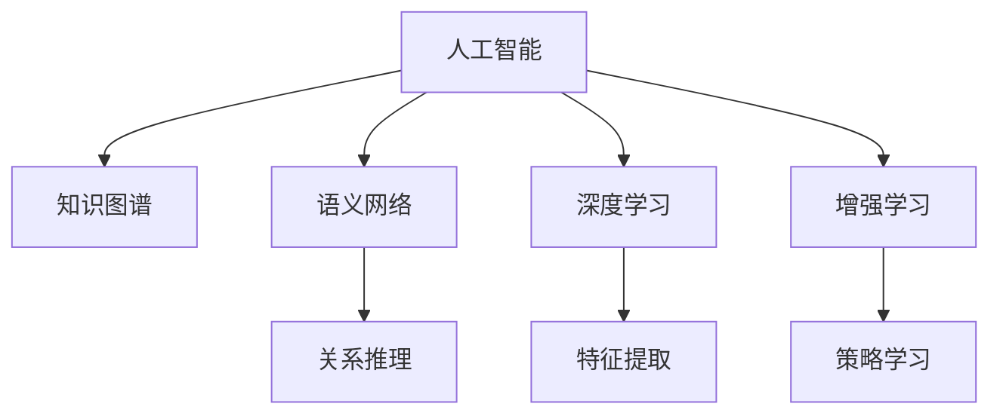

                 

# AI如何助力人类知识增长

## 1. 背景介绍

### 1.1 问题由来
在信息爆炸的时代，知识的获取和传播变得前所未有的便捷。然而，知识的增长往往依赖于人类的智慧和努力，速度和广度均受制于人的认知能力和时间。人工智能(AI)技术的迅速发展，为人类知识增长提供了新的助力。通过AI，我们能够更高效地获取、存储、处理和利用知识，加速知识的创新和传播。

### 1.2 问题核心关键点
AI在知识增长中的作用主要体现在以下几个方面：
1. **知识获取**：通过自动化的信息采集、语义理解、图像识别等技术，AI可以大规模地获取和整理各种类型的知识。
2. **知识组织**：AI能够对海量数据进行自动化的分类、标注和索引，便于知识的检索和利用。
3. **知识推理**：通过深度学习、逻辑推理等技术，AI能够自动进行复杂的知识推导和生成，提供更准确的预测和建议。
4. **知识互动**：AI可以与人类进行智能交互，通过自然语言处理(NLP)等技术，辅助人类获取、理解和生成知识。

### 1.3 问题研究意义
AI助力人类知识增长，不仅能够显著提高知识获取和处理的效率，还能突破人类认知的局限，探索新的知识领域。这对于加速科学进步、促进社会发展和提升人类福祉具有重要意义：

1. **加速科学发现**：AI能够快速分析和处理实验数据，发现潜在的科学规律，推动科学研究的深入。
2. **促进教育公平**：AI可以提供个性化的教育服务，帮助学生更有效地学习，缩小教育资源分配的不均衡。
3. **推动产业升级**：AI能够优化生产流程，提升产品质量，加速新产品的开发，促进各行业数字化转型。
4. **增强社会治理**：AI在公共安全、环境保护、疾病防控等领域的应用，能够提高政府治理能力和服务效率。
5. **提升人类福祉**：AI在医疗、养老、交通等领域的应用，能够显著改善人类的生活质量，提高幸福指数。

## 2. 核心概念与联系

### 2.1 核心概念概述

为了更好地理解AI在知识增长中的作用，本节将介绍几个密切相关的核心概念：

- **人工智能(AI)**：指模拟人类智能的计算机系统，包括机器学习、自然语言处理、计算机视觉等技术。
- **知识图谱(Knowledge Graph)**：指以图结构组织知识的一种形式，通过实体和关系来描述世界，便于知识的查询和推理。
- **语义网络(Semantic Network)**：指用节点和边表示概念和概念间关系的网络结构，用于表示知识。
- **深度学习(Deep Learning)**：指使用多层神经网络进行学习的技术，能够自动提取特征，处理复杂数据。
- **增强学习(Reinforcement Learning)**：指通过与环境的交互，让机器学习最优策略的技术，广泛应用于推荐系统、游戏等领域。

这些概念之间的逻辑关系可以通过以下Mermaid流程图来展示：



这个流程图展示了几大核心概念及其之间的关系：

1. 人工智能通过深度学习、增强学习等技术，能够处理复杂的知识。
2. 知识图谱和语义网络提供了知识表示和推理的方法。
3. 深度学习用于提取知识特征，增强学习用于学习最优策略，两者共同推动知识的应用。

## 3. 核心算法原理 & 具体操作步骤

### 3.1 算法原理概述

AI助力人类知识增长，主要依赖于深度学习等技术，通过数据驱动的方式，自动地发现和生成知识。其核心思想是：

1. **知识获取**：通过数据采集和预处理，获取各种形式的知识，如文本、图像、声音等。
2. **知识表示**：使用语义网络或知识图谱等形式，将知识进行结构化表示，便于后续处理。
3. **知识推理**：使用深度学习、逻辑推理等方法，自动进行知识推导和生成。
4. **知识应用**：将知识应用于实际问题，如自动问答、推荐系统、智能交互等。

AI在知识增长中的算法原理主要包括以下几个步骤：

1. **数据收集和预处理**：从各种数据源（如互联网、文献库、传感器等）收集数据，并进行清洗、标注等预处理。
2. **特征提取和表示**：使用深度学习等技术，自动提取数据特征，构建语义网络或知识图谱等知识表示形式。
3. **模型训练和优化**：使用深度学习等技术，训练模型进行知识推理和生成，通过优化算法提升模型效果。
4. **知识应用和反馈**：将训练好的模型应用于实际问题，收集用户反馈和评价，进一步优化模型。

### 3.2 算法步骤详解

以下是对AI助力知识增长的详细步骤详解：

**Step 1: 数据收集和预处理**

1. **数据来源**：
   - **互联网数据**：来自网页、论坛、博客等互联网资源。
   - **文献库数据**：来自学术期刊、书籍、专利等文献资源。
   - **传感器数据**：来自物联网设备、生物传感器等物理世界数据。
   - **社交媒体数据**：来自微博、微信、QQ等社交平台的用户互动数据。

2. **数据清洗**：
   - **去除噪声**：使用文本清洗、去重、补全等技术，去除数据中的噪音。
   - **格式统一**：将不同格式的数据转换为统一格式，便于后续处理。
   - **数据标注**：对数据进行标注，如实体识别、关系标注等，构建结构化知识。

3. **数据存储**：
   - **分布式存储**：使用Hadoop、Spark等技术，将大规模数据存储在分布式系统中。
   - **数据索引**：使用倒排索引、向量索引等技术，构建快速检索系统。

**Step 2: 特征提取和表示**

1. **文本特征提取**：
   - **词袋模型**：将文本转换为词汇列表，计算词汇频率和权重。
   - **TF-IDF**：计算词汇的词频和逆文档频率，衡量词汇的重要性。
   - **Word2Vec**：使用神经网络模型，将词汇转换为向量表示。

2. **图像特征提取**：
   - **卷积神经网络(CNN)**：使用深度学习模型，自动提取图像的局部特征。
   - **图像分割**：将图像分割成不同的区域，提取区域特征。
   - **特征融合**：将不同特征进行融合，提高特征表示的完整性。

3. **知识表示**：
   - **语义网络**：使用节点和边表示概念和关系，构建知识图谱。
   - **关系推理**：使用逻辑推理、规则推理等技术，自动进行知识推导。
   - **实体嵌入**：使用Word2Vec、GloVe等技术，将实体转换为向量表示。

**Step 3: 模型训练和优化**

1. **深度学习模型**：
   - **卷积神经网络(CNN)**：用于图像处理和特征提取。
   - **循环神经网络(RNN)**：用于序列数据和自然语言处理。
   - **长短期记忆网络(LSTM)**：用于处理长序列数据和语音识别。
   - **自编码器(Autoencoder)**：用于数据压缩和特征学习。
   - **生成对抗网络(GAN)**：用于生成新数据和图像处理。

2. **模型训练**：
   - **反向传播**：使用梯度下降等优化算法，更新模型参数。
   - **数据增强**：通过数据扩充、增强等技术，提高模型泛化能力。
   - **正则化**：使用L1、L2正则、Dropout等技术，防止过拟合。
   - **交叉验证**：使用交叉验证等技术，评估模型效果。

3. **模型优化**：
   - **超参数调优**：使用网格搜索、贝叶斯优化等技术，调整模型超参数。
   - **模型融合**：使用集成学习等技术，提高模型的泛化能力和鲁棒性。
   - **迁移学习**：使用预训练模型，提高模型训练效率和效果。

**Step 4: 知识应用和反馈**

1. **知识推理和生成**：
   - **自动问答系统**：使用知识图谱和语义网络，自动回答用户问题。
   - **推荐系统**：使用协同过滤、基于内容的推荐等技术，推荐相关知识和信息。
   - **智能交互**：使用NLP等技术，实现人机智能交互，辅助用户获取和生成知识。

2. **用户反馈和评价**：
   - **用户反馈收集**：通过在线调查、用户评论等方式，收集用户反馈和评价。
   - **用户画像构建**：使用用户行为数据，构建用户画像，提供个性化服务。
   - **系统优化**：根据用户反馈和评价，优化模型和算法。

3. **知识更新和迭代**：
   - **知识更新**：根据最新的数据和信息，更新知识库和知识图谱。
   - **迭代优化**：使用迭代优化技术，不断改进模型和算法，提高知识应用效果。

### 3.3 算法优缺点

AI助力人类知识增长的算法具有以下优点：

1. **高效性**：通过自动化处理大规模数据，大幅提高知识获取和处理的效率。
2. **准确性**：使用深度学习和逻辑推理等技术，自动进行知识推导和生成，减少人为错误。
3. **可扩展性**：通过分布式存储和计算，能够处理海量数据和复杂问题。
4. **灵活性**：可以根据不同的应用场景，调整算法和模型，实现灵活应用。

然而，这些算法也存在一些缺点：

1. **数据依赖**：依赖于高质量的数据，数据质量和标注水平直接影响算法效果。
2. **模型复杂性**：深度学习模型复杂度高，需要大量的计算资源和时间进行训练和优化。
3. **可解释性不足**：黑箱算法难以解释其内部工作机制和决策逻辑，存在一定的不透明性。
4. **数据隐私问题**：大规模数据采集和处理，可能涉及隐私和伦理问题，需要谨慎处理。
5. **依赖于先验知识**：算法的性能很大程度上依赖于先验知识的丰富程度，需要大量的领域知识支持。

## 4. 数学模型和公式 & 详细讲解 & 举例说明

### 4.1 数学模型构建

在AI助力知识增长中，常用的数学模型包括：

- **线性回归模型**：用于简单的知识预测和分类问题。
- **逻辑回归模型**：用于分类问题，通过sigmoid函数将输出映射到[0,1]区间。
- **支持向量机(SVM)**：用于分类和回归问题，通过构建超平面进行分类。
- **随机森林**：用于特征选择和分类问题，通过集成多个决策树进行预测。
- **卷积神经网络(CNN)**：用于图像处理和特征提取，使用卷积和池化操作进行特征提取。
- **循环神经网络(RNN)**：用于序列数据和自然语言处理，通过时间序列数据进行建模。
- **长短期记忆网络(LSTM)**：用于处理长序列数据和语音识别，具有记忆能力。
- **生成对抗网络(GAN)**：用于生成新数据和图像处理，通过对抗训练生成高质量数据。

### 4.2 公式推导过程

以线性回归模型为例，进行公式推导和讲解：

设训练样本集为$D=\{(x_i, y_i)\}_{i=1}^N$，其中$x_i \in \mathbb{R}^d$为特征向量，$y_i \in \mathbb{R}$为标签，目标为最小化均方误差损失函数：

$$
\mathcal{L}(\theta) = \frac{1}{2N} \sum_{i=1}^N (y_i - \theta^T x_i)^2
$$

其中$\theta$为模型参数，$x_i$为输入特征，$y_i$为标签。线性回归模型的目标是最小化损失函数：

$$
\theta^* = \mathop{\arg\min}_{\theta} \mathcal{L}(\theta)
$$

求解该最优化问题，可以通过梯度下降算法，计算梯度并更新参数：

$$
\theta \leftarrow \theta - \eta \nabla_{\theta}\mathcal{L}(\theta)
$$

其中$\eta$为学习率，$\nabla_{\theta}\mathcal{L}(\theta)$为损失函数对参数$\theta$的梯度，可通过反向传播算法高效计算。

### 4.3 案例分析与讲解

**案例分析**：使用线性回归模型进行房价预测

假设有一组房价数据，包含房屋面积$x_1$、房间数$x_2$、卫生间数$x_3$等特征，目标为预测房价$y$。我们可以使用线性回归模型，构建如下数学模型：

$$
y = \theta_0 + \theta_1 x_1 + \theta_2 x_2 + \theta_3 x_3
$$

其中$\theta_0$为截距，$\theta_1$、$\theta_2$、$\theta_3$为特征权重。使用梯度下降算法，最小化均方误差损失函数：

$$
\mathcal{L}(\theta) = \frac{1}{2N} \sum_{i=1}^N (y_i - (\theta_0 + \theta_1 x_{i1} + \theta_2 x_{i2} + \theta_3 x_{i3}))^2
$$

使用随机梯度下降算法，迭代更新参数$\theta$：

$$
\theta_0 \leftarrow \theta_0 - \eta (\frac{1}{N}\sum_{i=1}^N (y_i - (\theta_0 + \theta_1 x_{i1} + \theta_2 x_{i2} + \theta_3 x_{i3}))^2
$$

$$
\theta_1 \leftarrow \theta_1 - \eta (\frac{1}{N}\sum_{i=1}^N (y_i - (\theta_0 + \theta_1 x_{i1} + \theta_2 x_{i2} + \theta_3 x_{i3}))x_{i1}
$$

$$
\theta_2 \leftarrow \theta_2 - \eta (\frac{1}{N}\sum_{i=1}^N (y_i - (\theta_0 + \theta_1 x_{i1} + \theta_2 x_{i2} + \theta_3 x_{i3}))x_{i2}
$$

$$
\theta_3 \leftarrow \theta_3 - \eta (\frac{1}{N}\sum_{i=1}^N (y_i - (\theta_0 + \theta_1 x_{i1} + \theta_2 x_{i2} + \theta_3 x_{i3}))x_{i3}
$$

重复上述步骤，直至收敛，即可得到房价预测模型。

## 5. 项目实践：代码实例和详细解释说明

### 5.1 开发环境搭建

在进行AI知识增长项目开发前，我们需要准备好开发环境。以下是使用Python进行TensorFlow开发的环境配置流程：

1. 安装Anaconda：从官网下载并安装Anaconda，用于创建独立的Python环境。

2. 创建并激活虚拟环境：
```bash
conda create -n tf-env python=3.8 
conda activate tf-env
```

3. 安装TensorFlow：根据CUDA版本，从官网获取对应的安装命令。例如：
```bash
pip install tensorflow
```

4. 安装各类工具包：
```bash
pip install numpy pandas scikit-learn matplotlib tqdm jupyter notebook ipython
```

完成上述步骤后，即可在`tf-env`环境中开始AI知识增长项目的开发。

### 5.2 源代码详细实现

下面我们以房价预测任务为例，给出使用TensorFlow进行线性回归模型的PyTorch代码实现。

首先，定义数据处理函数：

```python
import tensorflow as tf
import numpy as np
import pandas as pd

def load_data(path):
    data = pd.read_csv(path)
    features = data[['area', 'rooms', 'bathrooms']]
    labels = data['price']
    return features, labels
```

然后，定义模型和优化器：

```python
def build_model(features, labels):
    inputs = tf.keras.layers.Input(shape=(3,))
    hidden = tf.keras.layers.Dense(64, activation='relu')(inputs)
    outputs = tf.keras.layers.Dense(1, activation='sigmoid')(hidden)
    model = tf.keras.Model(inputs=inputs, outputs=outputs)
    optimizer = tf.keras.optimizers.Adam()
    model.compile(optimizer=optimizer, loss='mse', metrics=['mae'])
    return model

model = build_model(features, labels)
```

接着，定义训练和评估函数：

```python
def train(model, features, labels, batch_size, epochs):
    model.fit(features, labels, batch_size=batch_size, epochs=epochs, validation_split=0.2)

def evaluate(model, features, labels, batch_size):
    predictions = model.predict(features)
    mae = tf.keras.metrics.mean_absolute_error(labels, predictions)
    print(f'MAE: {mae.numpy()}')

train(model, features, labels, batch_size=32, epochs=50)
evaluate(model, features, labels, batch_size=32)
```

以上就是使用TensorFlow进行房价预测任务的完整代码实现。可以看到，得益于TensorFlow的强大封装，我们可以用相对简洁的代码完成模型的构建和训练。

### 5.3 代码解读与分析

让我们再详细解读一下关键代码的实现细节：

**数据处理函数**：
- `load_data`方法：读取CSV格式的数据集，返回特征和标签。

**模型定义函数**：
- `build_model`方法：定义模型结构，包括输入层、隐藏层和输出层。
- 使用`tf.keras.layers.Dense`定义全连接层，使用`relu`激活函数。
- 输出层使用`sigmoid`函数，将输出映射到[0,1]区间，用于房价预测。
- 使用`tf.keras.Model`定义模型，连接输入和输出层。
- 定义优化器为`Adam`，使用均方误差`mse`作为损失函数。

**训练函数**：
- `train`方法：使用`model.fit`函数进行模型训练，指定批量大小`batch_size`和训练轮数`epochs`。
- 使用`validation_split`参数，将数据分为训练集和验证集，验证集占比为20%。

**评估函数**：
- `evaluate`方法：使用`model.predict`函数进行模型预测，计算MAE（平均绝对误差）。
- MAE计算公式为：$MAE=\frac{1}{N} \sum_{i=1}^N |y_i - \hat{y}_i|$，其中$y_i$为真实标签，$\hat{y}_i$为模型预测结果。

**训练流程**：
- 定义训练集和测试集，使用`train`函数进行模型训练。
- 在测试集上使用`evaluate`函数评估模型效果。

可以看到，TensorFlow配合Keras等库使得模型构建和训练的代码实现变得简洁高效。开发者可以将更多精力放在数据处理、模型改进等高层逻辑上，而不必过多关注底层的实现细节。

当然，工业级的系统实现还需考虑更多因素，如模型的保存和部署、超参数的自动搜索、更灵活的任务适配层等。但核心的模型构建和训练流程基本与此类似。

## 6. 实际应用场景

### 6.1 智能推荐系统

AI助力知识增长的一个重要应用场景是智能推荐系统。传统的推荐系统往往依赖用户的历史行为数据进行物品推荐，难以发现用户的潜在兴趣。而AI可以通过分析用户的行为和偏好，自动发现新的兴趣点，推荐相关知识和信息。

在技术实现上，可以收集用户浏览、点击、评论、分享等行为数据，提取和用户交互的物品标题、描述、标签等文本内容。将文本内容作为模型输入，用户的后续行为（如是否点击、购买等）作为监督信号，在此基础上训练模型进行推荐。推荐系统可以实时更新用户画像，动态调整推荐策略，提升推荐效果。

### 6.2 智能问答系统

AI在智能问答系统中也有广泛应用。传统问答系统依赖知识库和规则库，难以应对复杂和新颖的查询。而AI可以通过自然语言处理和知识推理，自动理解用户问题，匹配最合适的答案。

在技术实现上，可以收集用户的问题和答案，构建知识图谱，使用语义网络和逻辑推理技术进行知识推理。智能问答系统可以自动回答用户问题，并提供个性化的推荐服务。

### 6.3 智慧医疗

AI在智慧医疗中也发挥了重要作用。传统的医疗诊断和治疗依赖医生的经验和知识，存在一定的局限性。而AI可以通过大数据分析和深度学习，自动分析患者的病历和病情，提供诊断和治疗建议。

在技术实现上，可以收集患者的病历、检查结果、治疗记录等数据，提取和标注各种医学知识。使用深度学习模型，自动分析病情，进行疾病预测和诊断。智能医疗系统可以辅助医生进行诊疗，提高诊疗的准确性和效率。

### 6.4 智能教育

AI在智能教育中也具有广阔的应用前景。传统的教育模式依赖教师的个性化辅导，难以大规模推广。而AI可以通过智能推荐和个性化学习，提供更高效和个性化的教育服务。

在技术实现上，可以收集学生的学习记录、测试成绩、互动行为等数据，提取和标注各种学习知识。使用深度学习模型，自动分析学习情况，进行个性化推荐和学习路径规划。智能教育系统可以提供个性化的学习内容和指导，帮助学生更好地学习。

### 6.5 智能交通

AI在智能交通中也发挥了重要作用。传统的交通管理依赖人工监控和调度，难以应对复杂和动态的交通情况。而AI可以通过数据分析和智能推理，自动进行交通流量预测和调度优化。

在技术实现上，可以收集交通流量、道路条件、天气情况等数据，提取和标注各种交通知识。使用深度学习模型，自动分析交通情况，进行交通流量预测和调度优化。智能交通系统可以提高交通的效率和安全，减少交通拥堵和事故。

## 7. 工具和资源推荐

### 7.1 学习资源推荐

为了帮助开发者系统掌握AI助力知识增长的理论基础和实践技巧，这里推荐一些优质的学习资源：

1. 《深度学习》系列博文：由大模型技术专家撰写，深入浅出地介绍了深度学习原理、模型构建和应用。

2. 《机器学习实战》书籍：详细介绍了机器学习的理论基础和实践技巧，适合初学者学习。

3. 《TensorFlow官方文档》：提供了TensorFlow的详细使用方法和教程，适合深度学习开发。

4. Kaggle竞赛平台：提供了大量的数据集和竞赛任务，可以帮助开发者练习和提升数据处理和模型训练技能。

5. Coursera在线课程：斯坦福大学、MIT等名校提供的深度学习和机器学习课程，涵盖理论和实践多个方面。

通过对这些资源的学习实践，相信你一定能够快速掌握AI助力知识增长的精髓，并用于解决实际的AI应用问题。

### 7.2 开发工具推荐

高效的开发离不开优秀的工具支持。以下是几款用于AI助力知识增长开发的常用工具：

1. Python编程语言：Python具有简洁明了的语法和丰富的库支持，是AI开发的首选语言。

2. TensorFlow框架：由Google主导开发的深度学习框架，生产部署方便，适合大规模工程应用。

3. PyTorch框架：由Facebook主导开发的深度学习框架，灵活性高，适合研究型开发。

4. Keras框架：基于TensorFlow和PyTorch的高级API，方便开发者快速搭建和训练模型。

5. Jupyter Notebook：轻量级的数据分析和模型训练工具，支持代码单元格和可视化输出。

6. Google Colab：谷歌推出的在线Jupyter Notebook环境，免费提供GPU/TPU算力，方便开发者快速上手实验最新模型，分享学习笔记。

合理利用这些工具，可以显著提升AI助力知识增长的开发效率，加快创新迭代的步伐。

### 7.3 相关论文推荐

AI助力知识增长源于学界的持续研究。以下是几篇奠基性的相关论文，推荐阅读：

1. Deep Learning：由Ian Goodfellow、Yoshua Bengio和Aaron Courville合著，介绍了深度学习的基本概念和应用。

2. Neural Networks and Deep Learning：由Michael Nielsen撰写，深入浅出地介绍了神经网络和深度学习的原理和实践。

3. TensorFlow: A System for Large-Scale Machine Learning：由Google团队撰写，介绍了TensorFlow的架构和使用方法。

4. Learning Deep Architectures for AI：由Geoffrey Hinton撰写，介绍了深度学习模型和训练技巧。

5. A Survey on Knowledge Graphs for Information Retrieval：由Michael Zubek和Xavier Torrents撰写，介绍了知识图谱在信息检索中的应用。

这些论文代表了大模型技术的发展脉络。通过学习这些前沿成果，可以帮助研究者把握学科前进方向，激发更多的创新灵感。

## 8. 总结：未来发展趋势与挑战

### 8.1 总结

本文对AI助力人类知识增长的原理和实践进行了全面系统的介绍。首先阐述了AI在知识获取、存储、处理和应用中的重要作用，明确了其在推动知识增长中的独特价值。其次，从原理到实践，详细讲解了AI在知识增长中的算法原理和关键步骤，给出了AI知识增长的完整代码实例。同时，本文还广泛探讨了AI在智能推荐、智能问答、智慧医疗等多个领域的应用前景，展示了AI知识增长的广阔应用空间。此外，本文精选了AI知识增长的各类学习资源，力求为读者提供全方位的技术指引。

通过本文的系统梳理，可以看到，AI在知识增长中的应用前景广阔，通过自动化处理大规模数据，大幅提高知识获取和处理的效率，突破人类认知的局限，探索新的知识领域。受益于深度学习等技术的迅速发展，AI在各个领域的实际应用取得了显著效果，成为推动知识增长的重要工具。未来，伴随AI技术的不断进步，知识增长和应用将迎来新的飞跃，为科学进步、社会发展和人类福祉带来更多创新和突破。

### 8.2 未来发展趋势

展望未来，AI助力人类知识增长的技术将呈现以下几个发展趋势：

1. **多模态知识融合**：未来的AI系统将不仅仅处理文本数据，还将融合图像、语音、视频等多模态数据，提高知识获取和推理的全面性。

2. **自适应知识系统**：未来的AI系统将具备自适应能力，能够根据环境和用户需求动态调整知识库和推理策略，提供更个性化和高效的服务。

3. **人机协同知识获取**：未来的AI系统将更加注重人机协同，通过自然语言交互和知识反馈，与人类共同获取和生成知识。

4. **开放知识体系**：未来的AI系统将更加开放，构建全球共享的知识体系，促进知识和智慧的共享和传播。

5. **伦理和隐私保护**：未来的AI系统将更加注重伦理和隐私保护，确保数据安全和用户隐私，避免模型偏见和歧视。

6. **智能辅助决策**：未来的AI系统将更加智能，能够辅助人类进行复杂决策，提高决策的科学性和准确性。

以上趋势凸显了AI在知识增长中的广阔前景。这些方向的探索发展，必将进一步提升AI系统的性能和应用范围，为知识增长和应用带来新的突破。

### 8.3 面临的挑战

尽管AI在知识增长中的应用取得了显著效果，但在迈向更加智能化、普适化应用的过程中，它仍面临诸多挑战：

1. **数据依赖**：依赖于高质量的数据，数据质量和标注水平直接影响AI系统的性能。数据获取和标注成本较高，难以应对大规模、高复杂性的任务。

2. **模型复杂性**：深度学习模型复杂度高，需要大量的计算资源和时间进行训练和优化。如何优化模型结构和参数，提高训练效率，是亟待解决的问题。

3. **可解释性不足**：黑箱算法难以解释其内部工作机制和决策逻辑，存在一定的不透明性。如何提升AI系统的可解释性，增强用户信任，是重要的研究方向。

4. **隐私和伦理问题**：大规模数据采集和处理，可能涉及隐私和伦理问题，需要谨慎处理。如何保护用户隐私，确保数据安全和公平性，是重要的课题。

5. **跨领域应用难度**：AI系统在不同领域的适应性仍有限，难以直接应用于特定领域任务。如何提高AI系统的跨领域迁移能力，是重要的研究方向。

6. **技术壁垒高**：AI系统的开发和应用需要跨学科的知识和技能，技术门槛较高。如何降低技术壁垒，提升AI系统的易用性，是重要的课题。

这些挑战凸显了AI在知识增长中的复杂性和多面性，需要在技术、伦理、社会等多个维度协同发力，才能进一步推动AI技术的发展和应用。

### 8.4 研究展望

面对AI在知识增长中面临的挑战，未来的研究需要在以下几个方面寻求新的突破：

1. **多模态数据融合**：研究多模态数据融合技术，将文本、图像、语音等多种数据形式结合，提升知识获取和推理的全面性。

2. **自适应学习算法**：研究自适应学习算法，使AI系统能够根据环境和用户需求动态调整知识库和推理策略，提高系统的灵活性和适应性。

3. **人机协同技术**：研究人机协同技术，通过自然语言交互和知识反馈，增强AI系统的可解释性和用户信任。

4. **开放知识体系**：研究开放知识体系构建技术，构建全球共享的知识体系，促进知识和智慧的共享和传播。

5. **伦理和隐私保护**：研究伦理和隐私保护技术，确保数据安全和用户隐私，避免模型偏见和歧视。

6. **跨领域迁移能力**：研究跨领域迁移能力提升技术，使AI系统能够在不同领域进行迁移应用，提高系统的通用性和实用性。

这些研究方向将引领AI助力知识增长技术迈向更高的台阶，为知识增长和应用带来新的突破。相信随着学界和产业界的共同努力，AI在知识增长中的应用将更加广泛和深入，为科学进步、社会发展和人类福祉带来更多创新和突破。

## 9. 附录：常见问题与解答

**Q1：AI助力知识增长需要哪些关键技术？**

A: AI助力知识增长需要以下关键技术：
1. **深度学习**：用于提取和处理数据特征，构建知识模型。
2. **自然语言处理**：用于理解文本数据，进行知识推理和生成。
3. **知识图谱**：用于表示和推理知识，构建知识库。
4. **增强学习**：用于优化知识获取和推理策略，提高系统性能。
5. **数据采集和预处理**：用于大规模数据获取和预处理，提高数据质量和一致性。

这些技术相互配合，能够高效地获取、存储、处理和利用知识，加速知识增长和应用。

**Q2：AI在知识增长中如何处理数据？**

A: AI在知识增长中处理数据的主要步骤如下：
1. **数据收集**：从各种数据源（如互联网、文献库、传感器等）收集数据，并进行清洗、标注等预处理。
2. **特征提取**：使用深度学习等技术，自动提取数据特征，构建语义网络或知识图谱等知识表示形式。
3. **模型训练**：使用深度学习等技术，训练模型进行知识推理和生成。
4. **数据增强**：通过数据扩充、增强等技术，提高模型泛化能力。
5. **数据存储和检索**：使用分布式存储和快速检索技术，构建高效的知识管理系统。

这些步骤能够高效地处理大规模数据，提取和表示知识，并进行自动化的推理和生成，为知识增长提供强有力的支持。

**Q3：AI助力知识增长的应用场景有哪些？**

A: AI助力知识增长的应用场景非常广泛，涵盖各个领域，包括但不限于：
1. **智能推荐系统**：根据用户历史行为和偏好，推荐相关知识和信息。
2. **智能问答系统**：自动理解用户问题，匹配最合适的答案。
3. **智慧医疗**：辅助医生进行诊疗，提高诊疗的准确性和效率。
4. **智能教育**：提供个性化的学习内容和指导，帮助学生更好地学习。
5. **智能交通**：自动进行交通流量预测和调度优化，提高交通效率和安全。
6. **智能客服**：提供7x24小时不间断服务，快速响应客户咨询。

这些应用场景展示了AI在知识增长中的广泛应用，能够显著提高知识获取和处理的效率，推动知识创新和应用。

**Q4：AI助力知识增长的未来发展方向是什么？**

A: AI助力知识增长的未来发展方向包括：
1. **多模态知识融合**：将文本、图像、语音等多种数据形式结合，提高知识获取和推理的全面性。
2. **自适应知识系统**：根据环境和用户需求动态调整知识库和推理策略，提供更个性化和高效的服务。
3. **人机协同知识获取**：通过自然语言交互和知识反馈，与人类共同获取和生成知识。
4. **开放知识体系**：构建全球共享的知识体系，促进知识和智慧的共享和传播。
5. **伦理和隐私保护**：确保数据安全和用户隐私，避免模型偏见和歧视。
6. **智能辅助决策**：辅助人类进行复杂决策，提高决策的科学性和准确性。

这些方向将引领AI技术在知识增长中的应用进一步深入和拓展，为知识增长和应用带来新的突破。

**Q5：AI助力知识增长的主要挑战是什么？**

A: AI助力知识增长面临的主要挑战包括：
1. **数据依赖**：依赖于高质量的数据，数据质量和标注水平直接影响AI系统的性能。
2. **模型复杂性**：深度学习模型复杂度高，需要大量的计算资源和时间进行训练和优化。
3. **可解释性不足**：黑箱算法难以解释其内部工作机制和决策逻辑，存在一定的不透明性。
4. **隐私和伦理问题**：大规模数据采集和处理，可能涉及隐私和伦理问题，需要谨慎处理。
5. **跨领域应用难度**：AI系统在不同领域的适应性仍有限，难以直接应用于特定领域任务。
6. **技术壁垒高**：AI系统的开发和应用需要跨学科的知识和技能，技术门槛较高。

这些挑战凸显了AI在知识增长中的复杂性和多面性，需要在技术、伦理、社会等多个维度协同发力，才能进一步推动AI技术的发展和应用。

---

作者：禅与计算机程序设计艺术 / Zen and the Art of Computer Programming

