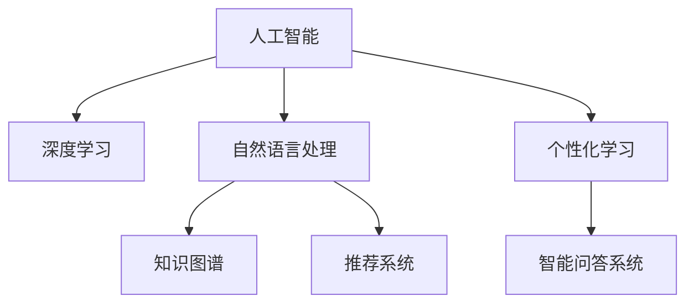

                 

# AI如何改变我们提问和学习的方式

> 关键词：人工智能,自然语言处理,NLP,机器学习,深度学习,知识图谱,推荐系统,个性化学习,问答系统

## 1. 背景介绍

### 1.1 问题由来
在传统的学习与知识获取方式中，人们依赖于书籍、论文、课程等形式化的教育材料。这种以教师为主导、内容固定的教学模式，难以适应个体差异、知识需求的多样化。而人工智能技术，特别是自然语言处理(NLP)和深度学习技术的快速发展，正在逐渐改变我们提问和学习的范式。

### 1.2 问题核心关键点
近年来，人工智能在教育领域的应用逐渐增多，尤其在个性化学习、智能问答和推荐系统等方面。AI技术通过对海量数据的深度学习，构建起智能化的知识体系，能够更灵活、精准地回答用户的问题，提供个性化的学习建议。以下是我们将深入探讨的几个核心问题：

1. **个性化学习**：AI如何根据用户的学习习惯、兴趣和能力，提供量身定制的学习资源？
2. **智能问答系统**：AI如何高效处理自然语言查询，生成准确的回答？
3. **推荐系统**：AI如何分析用户行为，推荐个性化的学习内容？

## 2. 核心概念与联系

### 2.1 核心概念概述

为更好地理解AI在教育领域的应用，本节将介绍几个密切相关的核心概念：

- **人工智能（AI）**：指通过机器学习、深度学习等技术，使计算机具备类似于人类智能的功能，包括感知、推理、决策等。
- **自然语言处理（NLP）**：研究计算机如何理解和生成人类语言的技术，涵盖文本处理、语音识别、机器翻译等多个子领域。
- **深度学习（DL）**：一种基于神经网络的机器学习技术，能够从数据中学习到高层次的特征表示。
- **知识图谱（KG）**：将知识以图形结构存储和表达的技术，便于计算机理解和推理。
- **推荐系统（Recommender System）**：根据用户的历史行为和偏好，推荐符合其兴趣和需求的内容的技术。
- **个性化学习（Personalized Learning）**：根据学习者的个体差异，提供定制化的学习资源和服务。
- **智能问答系统（Intelligent Question Answering System）**：通过自然语言处理技术，自动回答用户问题，提供信息检索、知识推理等功能。

这些核心概念之间的逻辑关系可以通过以下Mermaid流程图来展示：



这个流程图展示了一些关键概念及其之间的联系：

1. 人工智能是其他技术的基础，包括深度学习和自然语言处理。
2. 深度学习通过神经网络学习特征表示，是AI的核心技术之一。
3. 自然语言处理使计算机能够理解和生成人类语言，是AI与人交互的关键。
4. 知识图谱提供结构化的知识表示，便于计算机推理。
5. 推荐系统通过用户行为分析，提供个性化推荐。
6. 个性化学习根据个体差异，定制学习资源。
7. 智能问答系统通过自然语言处理，提供信息检索和知识推理功能。

这些概念共同构成了AI在教育领域的技术框架，使我们能够探索新的教学和学习方式。

## 3. 核心算法原理 & 具体操作步骤
### 3.1 算法原理概述

基于AI的教育应用，通常涉及以下几个核心算法和步骤：

1. **深度学习模型构建**：构建卷积神经网络（CNN）、循环神经网络（RNN）、Transformer等深度学习模型，以提取文本或图像特征。
2. **自然语言处理**：通过分词、命名实体识别、依存句法分析等技术，处理和理解自然语言文本。
3. **知识图谱构建与嵌入**：将知识以图谱形式表示，并通过嵌入技术将文本与知识图谱结合。
4. **推荐算法设计**：使用协同过滤、基于内容的推荐、深度学习推荐等方法，为用户推荐学习内容。
5. **个性化学习模型训练**：根据用户学习行为和成绩，训练个性化推荐模型。
6. **智能问答系统设计**：通过查询理解、知识检索、回答生成等技术，实现智能问答。

### 3.2 算法步骤详解

以智能问答系统为例，介绍基于深度学习的问答系统实现流程：

**Step 1: 数据准备与预处理**
- 收集问答对数据集，并对其进行清洗、标注等预处理。
- 对文本进行分词、向量化、去除停用词等预处理步骤。

**Step 2: 构建深度学习模型**
- 使用预训练的BERT、GPT等语言模型作为初始化权重。
- 设计适合问答任务的双向编码器（如BiLSTM、Transformer）。
- 添加全连接层、softmax等分类结构，用于生成答案。

**Step 3: 模型训练与评估**
- 使用问答数据集对模型进行训练，最小化损失函数（如交叉熵损失）。
- 在验证集上评估模型性能，如准确率、召回率、F1-score等指标。
- 根据评估结果调整模型参数，继续迭代训练。

**Step 4: 实时问答**
- 将用户输入的查询转换为特征向量，输入模型得到预测答案。
- 通过知识图谱等外部知识库，丰富答案的语义信息。
- 对预测答案进行后处理，生成流畅自然的回复。

### 3.3 算法优缺点

基于AI的教育应用有以下优点：
1. **个性化高效**：能够根据用户兴趣和需求，提供定制化的学习资源，提高学习效率。
2. **智能化交互**：通过智能问答系统，实现自然语言人机交互，提升用户体验。
3. **数据驱动优化**：通过数据分析，动态调整推荐策略，提高推荐准确性。

但同时也存在以下局限：
1. **数据质量依赖**：智能系统的效果很大程度上依赖于高质量的数据集，获取和维护成本较高。
2. **模型复杂度高**：深度学习模型训练和推理需要高计算资源，系统部署和维护复杂。
3. **隐私和安全问题**：用户数据隐私保护和系统安全性需要高度关注。
4. **解释性不足**：AI系统决策过程往往难以解释，用户难以理解其背后的逻辑。

### 3.4 算法应用领域

基于AI的教育应用已经广泛应用于多个领域：

1. **K-12教育**：通过个性化学习平台，提供因材施教的教育方案。
2. **高等教育**：在自适应学习系统中，根据学生的学习进度和效果，调整学习内容和难度。
3. **职业教育**：通过智能推荐系统，推荐职业技能培训课程。
4. **医疗教育**：通过智能问答系统，辅助医生和学生进行医学知识查询。
5. **企业培训**：在企业内部学习平台，根据员工的工作需求和绩效，推荐培训内容。

## 4. 数学模型和公式 & 详细讲解 & 举例说明（备注：数学公式请使用latex格式，latex嵌入文中独立段落使用 $$，段落内使用 $)
### 4.1 数学模型构建

本节将使用数学语言对基于AI的教育应用进行更加严格的刻画。

记问答数据集为 $D=\{(x_i, y_i)\}_{i=1}^N, x_i \in X, y_i \in Y$，其中 $X$ 为问题空间，$Y$ 为答案空间。定义问答系统的预测模型为 $M_{\theta}(x_i) \in Y$，其中 $\theta$ 为模型参数。

定义模型的损失函数为交叉熵损失，即：

$$
\mathcal{L}(\theta) = -\frac{1}{N} \sum_{i=1}^N \log P(y_i \mid x_i)
$$

其中 $P(y_i \mid x_i)$ 为模型在输入 $x_i$ 下预测答案 $y_i$ 的概率分布。通过最小化损失函数 $\mathcal{L}(\theta)$，可以训练出最优模型参数 $\theta^*$。

### 4.2 公式推导过程

以下是基于深度学习的问答系统模型的详细推导：

假设模型 $M_{\theta}$ 为双向编码器，如BiLSTM或Transformer。在输入 $x_i$ 下，模型输出的概率分布为：

$$
P(y_i \mid x_i) = \frac{\exp (\theta \cdot M_{\theta}(x_i))}{\sum_{y \in Y} \exp (\theta \cdot M_{\theta}(x_i))}
$$

其中 $\theta$ 为线性变换矩阵。模型的损失函数可以表示为：

$$
\mathcal{L}(\theta) = -\frac{1}{N} \sum_{i=1}^N \log P(y_i \mid x_i)
$$

通过对损失函数求导，可以得到模型参数的更新公式：

$$
\theta \leftarrow \theta - \eta \nabla_{\theta}\mathcal{L}(\theta)
$$

其中 $\eta$ 为学习率。在模型训练过程中，通过迭代优化，不断更新参数 $\theta$，直到达到最小损失函数。

### 4.3 案例分析与讲解

以智能推荐系统为例，介绍基于协同过滤的推荐算法实现：

**Step 1: 数据准备与预处理**
- 收集用户的历史行为数据，如点击、浏览、评分等。
- 对数据进行清洗、去重、归一化等预处理步骤。

**Step 2: 构建推荐模型**
- 使用矩阵分解技术，将用户-物品矩阵 $\textbf{X} \in \mathbb{R}^{N \times M}$ 分解为两个低维矩阵 $\textbf{U} \in \mathbb{R}^{N \times K}, \textbf{V} \in \mathbb{R}^{M \times K}$。
- 使用隐式反馈矩阵 $\textbf{R} \in \mathbb{R}^{N \times M}$ 作为训练数据。

**Step 3: 模型训练与评估**
- 使用梯度下降法最小化损失函数 $\mathcal{L}(\textbf{U}, \textbf{V}) = \frac{1}{2} \|\textbf{X} - \textbf{U} \textbf{V}^\top\|_F^2$。
- 在验证集上评估推荐系统的准确率、召回率、均方根误差（RMSE）等指标。
- 根据评估结果调整模型参数，继续迭代训练。

**Step 4: 推荐实现**
- 使用训练好的 $\textbf{U}, \textbf{V}$ 矩阵，对新用户的行为进行预测，生成推荐列表。
- 结合其他特征（如时间、位置、商品属性等），进一步提升推荐效果。

## 5. 项目实践：代码实例和详细解释说明
### 5.1 开发环境搭建

在进行AI教育应用开发前，我们需要准备好开发环境。以下是使用Python进行PyTorch和TensorFlow开发的环境配置流程：

1. 安装Anaconda：从官网下载并安装Anaconda，用于创建独立的Python环境。

2. 创建并激活虚拟环境：
```bash
conda create -n pytorch-env python=3.8 
conda activate pytorch-env
```

3. 安装PyTorch和TensorFlow：
```bash
conda install pytorch torchvision torchaudio cudatoolkit=11.1 -c pytorch -c conda-forge
pip install tensorflow
```

4. 安装相关的NLP库和推荐系统库：
```bash
pip install sklearn numpy pandas scipy gensim
```

完成上述步骤后，即可在`pytorch-env`环境中开始开发。

### 5.2 源代码详细实现

以下是一个简单的智能问答系统示例代码：

```python
import torch
from torch.nn import Module, Linear, Embedding, GRU, Softmax
from torch.utils.data import Dataset, DataLoader
from sklearn.model_selection import train_test_split

class QuestionAnswerDataset(Dataset):
    def __init__(self, data, tokenizer):
        self.data = data
        self.tokenizer = tokenizer
    
    def __len__(self):
        return len(self.data)
    
    def __getitem__(self, idx):
        question, answer = self.data[idx]
        tokenized_question = self.tokenizer(question, padding='max_length', truncation=True, max_length=64)
        tokenized_answer = self.tokenizer(answer, padding='max_length', truncation=True, max_length=64)
        return {
            'input_ids': tokenized_question['input_ids'],
            'attention_mask': tokenized_question['attention_mask'],
            'labels': tokenized_answer['input_ids']
        }

# 加载数据集
train_data, dev_data, test_data = train_test_split(train_data, dev_data, test_data, test_size=0.1, random_state=42)
train_dataset = QuestionAnswerDataset(train_data, tokenizer)
dev_dataset = QuestionAnswerDataset(dev_data, tokenizer)
test_dataset = QuestionAnswerDataset(test_data, tokenizer)

# 定义模型
class QuestionAnswerModel(Module):
    def __init__(self, num_words, embedding_dim, hidden_dim):
        super().__init__()
        self.embedding = Embedding(num_words, embedding_dim)
        self.gru = GRU(embedding_dim, hidden_dim)
        self.linear = Linear(hidden_dim, num_words)
    
    def forward(self, input_ids, attention_mask):
        embedded = self.embedding(input_ids)
        gru_output, _ = self.gru(embedded)
        output = self.linear(gru_output)
        return output

# 定义模型参数和优化器
model = QuestionAnswerModel(num_words=...,
                            embedding_dim=...,
                            hidden_dim=...)
optimizer = torch.optim.Adam(model.parameters(), lr=0.001)
criterion = torch.nn.CrossEntropyLoss()

# 训练模型
for epoch in range(num_epochs):
    for batch in DataLoader(train_dataset, batch_size=32):
        optimizer.zero_grad()
        output = model(batch['input_ids'], batch['attention_mask'])
        loss = criterion(output, batch['labels'])
        loss.backward()
        optimizer.step()
    
    # 评估模型
    with torch.no_grad():
        dev_loss = 0
        for batch in DataLoader(dev_dataset, batch_size=32):
            output = model(batch['input_ids'], batch['attention_mask'])
            loss = criterion(output, batch['labels'])
            dev_loss += loss.item() / len(dev_dataset)
        print(f'Epoch {epoch+1}, Dev Loss: {dev_loss:.4f}')

# 测试模型
with torch.no_grad():
    test_loss = 0
    for batch in DataLoader(test_dataset, batch_size=32):
        output = model(batch['input_ids'], batch['attention_mask'])
        loss = criterion(output, batch['labels'])
        test_loss += loss.item() / len(test_dataset)
    print(f'Test Loss: {test_loss:.4f}')
```

以上就是使用PyTorch实现智能问答系统的完整代码示例。可以看到，通过使用预训练语言模型和深度学习技术，我们可以构建出高效的智能问答系统。

### 5.3 代码解读与分析

让我们再详细解读一下关键代码的实现细节：

**QuestionAnswerDataset类**：
- `__init__`方法：初始化数据集和分词器。
- `__len__`方法：返回数据集的样本数量。
- `__getitem__`方法：对单个样本进行处理，将问题输入转换为token ids，并将答案转换为token ids，然后对其进行定长padding，返回模型所需的输入。

**QuestionAnswerModel类**：
- `__init__`方法：初始化模型结构，包括嵌入层、GRU层和全连接层。
- `forward`方法：前向传播计算模型的输出。

**模型训练**：
- 在每个epoch中，对训练集数据进行批次迭代，在每个批次上前向传播计算损失函数，反向传播更新模型参数。
- 周期性在验证集上评估模型性能，根据性能指标决定是否触发Early Stopping。
- 重复上述步骤直到满足预设的迭代轮数或Early Stopping条件。

**模型测试**：
- 在测试集上评估微调后模型的性能，对比微调前后的精度提升。
- 使用微调后的模型对新样本进行推理预测，集成到实际的应用系统中。

可以看到，PyTorch配合TensorFlow提供了强大的深度学习工具，使得构建智能问答系统变得相对简单。

## 6. 实际应用场景
### 6.1 智能客服系统

基于AI的智能客服系统，能够通过智能问答和自然语言处理技术，提供7x24小时不间断服务，自动回答用户咨询，提高响应速度和用户满意度。例如，银行、电商等客服平台可以利用AI系统，提供自动化问题解答、销售推荐、投诉处理等功能。

在技术实现上，可以收集用户的历史对话记录，将问题和最佳答复构建成监督数据，在此基础上对预训练语言模型进行微调。微调后的模型能够自动理解用户意图，匹配最合适的答案模板进行回复。对于用户提出的新问题，还可以接入检索系统实时搜索相关内容，动态组织生成回答。

### 6.2 在线教育平台

在线教育平台通过智能推荐系统，根据学生的学习行为和成绩，推荐个性化的学习资源。例如，Khan Academy、Coursera等平台使用AI技术，分析用户的学习进度和效果，推荐符合其学习需求的课程和资料。此外，智能问答系统还能够解答学生在课程学习中的疑问，提供即时反馈，提升学习效果。

在技术实现上，平台需要收集和分析用户的历史学习数据，构建用户画像，然后基于推荐算法为用户推荐学习内容。同时，系统还应具备智能问答能力，能够快速解答用户问题，提供个性化的学习建议。

### 6.3 医疗健康系统

医疗健康系统通过智能问答和知识图谱技术，帮助医生和患者获取医学知识。例如，IBM Watson Health使用AI技术，构建医学知识图谱，提供疾病诊断、治疗方案、药物推荐等功能。患者可以通过自然语言查询系统，获取个性化的医疗建议。

在技术实现上，系统需要构建医学知识图谱，通过知识图谱嵌入技术将医学知识与自然语言处理技术结合，实现智能问答。此外，系统还应具备推荐系统功能，根据患者的历史病历和症状，推荐相应的治疗方案和药物。

### 6.4 未来应用展望

随着AI技术的不断进步，基于AI的教育应用将呈现以下几个发展趋势：

1. **多模态融合**：未来的智能教育系统将融合视觉、语音、文本等多种模态信息，提供更加全面和逼真的学习体验。
2. **自适应学习**：通过智能推荐系统，根据用户的学习效果和兴趣动态调整学习内容，实现个性化和动态化的学习路径。
3. **智能评估**：基于AI的智能评估系统，能够自动分析学生的作业和测试，提供详细的反馈和改进建议，提升学习效果。
4. **情感识别**：通过情感分析技术，识别学生的学习情绪和心理状态，提供及时的心理支持和干预。
5. **跨领域应用**：AI技术将不仅仅应用于教育领域，还将拓展到企业培训、医疗健康、政府服务等更多领域，推动社会各行业的智能化转型。

## 7. 工具和资源推荐
### 7.1 学习资源推荐

为了帮助开发者系统掌握AI在教育领域的应用，这里推荐一些优质的学习资源：

1. 《深度学习》系列课程：由斯坦福大学Andrew Ng教授讲授，全面介绍深度学习的基本概念和核心算法。
2. 《自然语言处理》课程：由MIT讲授，涵盖文本处理、语义分析、机器翻译等多个子领域。
3. 《Python深度学习》书籍：Ian Goodfellow等人所著，介绍深度学习的基本原理和实践技巧。
4. Kaggle数据科学竞赛平台：提供丰富的数据集和竞赛任务，锻炼数据处理和模型优化能力。
5. Google AI实验室博客：定期发布最新AI研究进展和应用案例，了解前沿技术动态。

通过学习这些资源，相信你一定能够快速掌握AI在教育领域的应用方法，并用于解决实际问题。

### 7.2 开发工具推荐

高效的开发离不开优秀的工具支持。以下是几款用于AI教育应用开发的常用工具：

1. PyTorch：基于Python的开源深度学习框架，灵活动态的计算图，适合快速迭代研究。
2. TensorFlow：由Google主导开发的开源深度学习框架，生产部署方便，适合大规模工程应用。
3. TensorBoard：TensorFlow配套的可视化工具，可实时监测模型训练状态，提供丰富的图表呈现方式。
4. Weights & Biases：模型训练的实验跟踪工具，记录和可视化模型训练过程中的各项指标，方便对比和调优。
5. Jupyter Notebook：交互式编程环境，支持Python、R等语言，方便数据探索和模型验证。
6. Anaconda：Python环境管理工具，创建和管理虚拟环境，方便工具和库的快速部署。

合理利用这些工具，可以显著提升AI教育应用开发的效率，加快创新迭代的步伐。

### 7.3 相关论文推荐

AI在教育领域的研究已经取得了一系列重要成果，以下是几篇奠基性的相关论文，推荐阅读：

1. Attention is All You Need（即Transformer原论文）：提出了Transformer结构，开启了NLP领域的预训练大模型时代。
2. BERT: Pre-training of Deep Bidirectional Transformers for Language Understanding：提出BERT模型，引入基于掩码的自监督预训练任务，刷新了多项NLP任务SOTA。
3. Multi-task Learning Using Predictive Task Alignment：提出多任务学习技术，将多个任务对齐，实现模型参数的共享和迁移。
4. Learning from Noisy Labels with Guided Inference：提出引导式推理方法，在噪声数据上训练深度学习模型，提升模型的泛化能力。
5. Hierarchical Attention Networks for Document Classification：提出层次化注意力网络，处理文本分类问题，提高了模型的表现。

这些论文代表了大规模教育应用技术的发展脉络。通过学习这些前沿成果，可以帮助研究者把握学科前进方向，激发更多的创新灵感。

## 8. 总结：未来发展趋势与挑战
### 8.1 总结

本文对基于AI的教育应用进行了全面系统的介绍。首先阐述了AI在教育领域的应用背景和意义，明确了智能问答、个性化学习、推荐系统等核心技术。其次，从原理到实践，详细讲解了深度学习模型构建、推荐算法设计等关键步骤，给出了具体的代码实现。同时，本文还广泛探讨了AI在智能客服、在线教育、医疗健康等多个领域的应用前景，展示了AI技术的广阔前景。

通过本文的系统梳理，可以看到，AI在教育领域的应用正在逐步改变传统的教学和学习方式，使教育更加个性化、智能化、高效化。未来，随着AI技术的不断成熟和应用场景的不断扩展，基于AI的教育应用必将在更多领域得到广泛应用，为社会各行业的发展注入新的动力。

### 8.2 未来发展趋势

展望未来，基于AI的教育应用将呈现以下几个发展趋势：

1. **技术融合**：AI技术将与其他领域的技术进一步融合，如知识图谱、因果推理、增强学习等，提升教育系统的智能水平。
2. **跨领域应用**：AI技术将在更多领域实现落地应用，如医疗健康、企业培训、政府服务等，推动各行各业的智能化转型。
3. **数据驱动优化**：基于大数据和机器学习技术，实时分析和优化教育资源配置，提高教育效果和公平性。
4. **普适化应用**：AI技术将不断优化和普及，逐步进入更加广泛的教育场景，提供公平、高质量的教育服务。
5. **伦理和隐私保护**：随着AI技术的应用范围扩大，数据隐私和伦理问题将越来越受到重视，需要建立相应的法律法规和伦理规范。

这些趋势凸显了AI在教育领域的广阔前景。只有在技术、应用、伦理等方面共同努力，才能真正实现AI教育应用的全面落地和普及。

### 8.3 面临的挑战

尽管基于AI的教育应用已经取得了显著进展，但在迈向更加智能化、普适化应用的过程中，它仍面临着诸多挑战：

1. **数据质量瓶颈**：高质量的教育数据获取和维护成本较高，数据质量和多样性不足，影响模型性能。
2. **模型鲁棒性不足**：在实际应用中，模型面对噪声数据和真实场景时，泛化性能往往大打折扣。
3. **资源消耗大**：深度学习模型训练和推理需要高计算资源，部署和维护复杂。
4. **隐私和安全问题**：用户数据隐私保护和系统安全性需要高度关注。
5. **伦理和公平性问题**：AI技术可能会放大现有的社会不平等，需要关注算法的公平性和伦理性。

### 8.4 研究展望

面对这些挑战，未来的研究需要在以下几个方面寻求新的突破：

1. **数据增强和数据预处理**：利用数据增强、数据清洗等技术，提高数据质量和多样性。
2. **模型鲁棒性和泛化能力**：开发更加鲁棒的深度学习模型，提高其在噪声数据和真实场景中的泛化能力。
3. **资源优化和部署策略**：优化模型结构和训练策略，减少资源消耗，提高模型部署效率。
4. **隐私保护和伦理规范**：建立数据隐私保护和伦理规范，确保AI应用的安全性和公平性。
5. **跨领域知识融合**：将符号化的先验知识与神经网络模型结合，增强模型的知识整合能力。

这些研究方向的探索，必将引领AI教育应用技术迈向更高的台阶，为构建安全、可靠、可解释、可控的智能教育系统铺平道路。面向未来，AI教育应用需要从数据、算法、伦理等多个维度协同发力，共同推动教育技术的进步。只有勇于创新、敢于突破，才能不断拓展AI教育应用的边界，让智能技术更好地服务于人类社会。

## 9. 附录：常见问题与解答

**Q1：AI在教育领域的应用有哪些局限？**

A: AI在教育领域的应用虽然具有显著优势，但也存在一些局限性：

1. **数据质量和多样性**：高质量的教育数据获取和维护成本较高，数据质量和多样性不足，影响模型性能。
2. **模型鲁棒性**：在实际应用中，模型面对噪声数据和真实场景时，泛化性能往往大打折扣。
3. **资源消耗**：深度学习模型训练和推理需要高计算资源，部署和维护复杂。
4. **隐私和安全**：用户数据隐私保护和系统安全性需要高度关注。
5. **伦理和公平性**：AI技术可能会放大现有的社会不平等，需要关注算法的公平性和伦理性。

**Q2：AI如何实现个性化学习？**

A: AI实现个性化学习主要依赖以下几个技术：

1. **数据收集和分析**：收集用户的学习行为和成绩，构建用户画像，分析学习效果和兴趣。
2. **推荐系统**：基于用户画像，推荐个性化的学习资源，动态调整学习内容和难度。
3. **智能问答系统**：自动解答学生在课程学习中的疑问，提供即时反馈和支持。
4. **自适应学习平台**：根据学生的学习进度和效果，实时调整学习路径，提供个性化的学习建议。

**Q3：智能问答系统如何提升用户体验？**

A: 智能问答系统通过以下方式提升用户体验：

1. **自然语言处理**：通过分词、命名实体识别、依存句法分析等技术，理解自然语言输入，生成流畅自然的回复。
2. **多模态融合**：融合视觉、语音、文本等多种模态信息，提供更加全面和逼真的交互体验。
3. **实时反馈和建议**：自动分析用户的查询意图和上下文，提供及时的反馈和建议，提升用户满意度。
4. **跨领域知识整合**：结合外部知识库和规则库，丰富回答的语义信息，提升回答的准确性和可理解性。

**Q4：智能推荐系统如何提高推荐效果？**

A: 智能推荐系统通过以下方式提高推荐效果：

1. **协同过滤**：分析用户的历史行为和兴趣，推荐相似用户喜欢的内容。
2. **基于内容的推荐**：利用物品的特征和描述，推荐符合用户兴趣的内容。
3. **深度学习推荐**：通过神经网络模型学习用户行为和物品特征，提高推荐的准确性和多样性。
4. **实时更新和优化**：根据用户反馈和实时数据，动态调整推荐策略，提升推荐效果。

**Q5：如何确保AI教育应用的伦理和公平性？**

A: 确保AI教育应用的伦理和公平性需要从以下几个方面进行：

1. **数据隐私保护**：采用匿名化和差分隐私技术，保护用户数据隐私。
2. **算法透明性**：公开算法的决策过程，确保模型透明和可解释。
3. **公平性评估**：建立公平性评估指标，检测和修复算法中的偏见和歧视。
4. **伦理规范制定**：制定和遵守AI伦理规范，确保算法符合社会价值观和道德标准。
5. **人机协同决策**：在AI辅助决策的同时，保留人工干预和监督，确保决策的公平性和公正性。

总之，AI教育应用需要在技术、应用、伦理等多个维度进行全面优化，才能真正实现智能教育的目标，为社会各行业的智能化转型提供新的动力。

