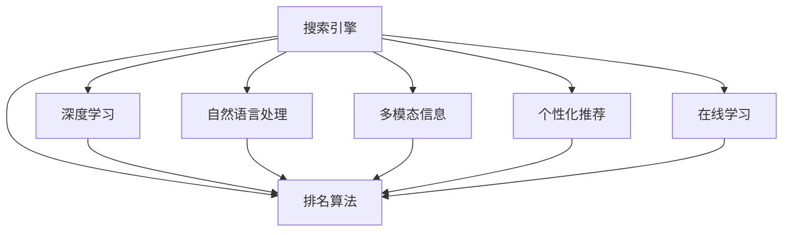

                 

# AI如何改变搜索引擎的排名算法

> 关键词：搜索引擎, 排名算法, AI, 深度学习, 自然语言处理, 机器学习, 模型优化

## 1. 背景介绍

搜索引擎作为互联网时代最重要的信息获取工具之一，其核心功能在于通过算法将海量网络信息高效检索并排序，为用户提供最相关和有用的搜索结果。传统的搜索引擎算法主要依赖于统计模型和关键词匹配技术，但随着数据量的急剧增加和用户需求的多样化，这一模式已无法满足用户期待。因此，基于人工智能（AI）的搜索引擎排名算法成为了近年来的研究热点。

### 1.1 问题由来

早期搜索引擎如雅虎、Google主要依赖于网页内容中的关键词密度、链接数量和权威度等传统因素来确定网页的排名。这些方法的优点在于简单易行，但缺点是忽略了用户搜索意图的复杂性和网页内容的多样性，导致搜索结果与用户期望存在较大偏差。随着Web2.0时代的到来，用户生成内容（UGC）的广泛传播，搜索引擎面临的信息噪音和歧义度也在增加，传统的统计方法难以适应这一变化。

近年来，随着深度学习（Deep Learning）和自然语言处理（Natural Language Processing, NLP）等AI技术的成熟，搜索引擎开始尝试将AI引入排名算法，通过构建复杂的神经网络模型来理解网页内容和用户意图，从而提供更加精准的搜索结果。这一变化不仅提升了搜索质量，还为搜索引擎带来了新的发展契机。

### 1.2 问题核心关键点

AI技术引入搜索引擎排名算法主要通过以下关键点改进传统算法：

- **深度学习模型**：引入深度神经网络来处理网页内容，提升对文本语义的理解和匹配能力。
- **自然语言处理**：通过NLP技术，对用户查询进行语义分析和意图理解，实现更精确的关键词匹配。
- **多模态信息融合**：利用图像、视频等多模态信息，丰富搜索结果的展示形式和内容。
- **个性化推荐**：通过机器学习算法，实现对用户行为和偏好的动态跟踪和预测，提升个性化搜索结果的精度。
- **实时学习**：引入在线学习机制，使排名算法能够快速适应新数据和新用户，保持算法新鲜度。

这些核心点共同构成了基于AI的搜索引擎排名算法的理论基础，使得搜索引擎能够更智能、更人性化地满足用户需求。

## 2. 核心概念与联系

### 2.1 核心概念概述

为更好地理解基于AI的搜索引擎排名算法，本节将介绍几个密切相关的核心概念：

- **搜索引擎**：利用算法将用户查询映射到网页索引的系统和技术，旨在为用户快速提供最相关的搜索结果。
- **排名算法**：搜索引擎中用于确定网页排名的算法，根据特定标准对搜索结果进行排序。
- **深度学习**：一种基于神经网络的机器学习方法，通过多层结构提取数据特征，实现复杂模式识别。
- **自然语言处理**：涉及计算机对自然语言的理解和生成，包括文本分析、语音识别、机器翻译等技术。
- **多模态信息**：除了文本信息外，还包括图像、视频、音频等多模态数据。
- **个性化推荐**：通过分析用户行为和偏好，为不同用户提供定制化的搜索结果。
- **在线学习**：利用数据流实时更新模型参数，保持算法的动态适应能力。

这些核心概念之间的逻辑关系可以通过以下Mermaid流程图来展示：



这个流程图展示了许多与搜索引擎相关的核心概念及其之间的关系：

1. 搜索引擎通过排名算法将搜索结果排序，向用户展示。
2. 深度学习、自然语言处理、多模态信息、个性化推荐和在线学习等技术，共同构成排名算法的核心，提升搜索质量。

## 3. 核心算法原理 & 具体操作步骤
### 3.1 算法原理概述

基于AI的搜索引擎排名算法，本质上是利用深度学习和自然语言处理技术，对用户查询和网页内容进行语义理解和匹配，从而提升搜索结果的相关性和多样性。

具体而言，排名算法通常包括以下几个步骤：

1. **预处理**：对用户查询和网页内容进行分词、去停用词等预处理操作。
2. **特征提取**：使用深度学习模型对查询和网页进行特征提取，包括文本、图片、音频等多模态特征。
3. **语义匹配**：通过自然语言处理技术，对用户查询进行意图理解，对网页内容进行语义分析，计算查询与网页的相关度。
4. **排名排序**：根据相关度得分，结合其他因素（如页面权威度、用户行为等），进行综合排序。
5. **实时优化**：利用在线学习机制，不断更新模型参数，适应新数据和新用户。

### 3.2 算法步骤详解

以下以Google的BERT+深度学习模型为例，详细讲解基于AI的搜索引擎排名算法的具体操作步骤：

#### 3.2.1 预处理

预处理包括两个方面：

- **查询处理**：对用户输入的查询进行分词、去停用词、词干化等操作，转换为机器可以理解的格式。
- **网页处理**：对网页文本进行分词、去除HTML标签等，提取出文本信息。

示例代码：

```python
import nltk
from nltk.corpus import stopwords

nltk.download('stopwords')
stop_words = set(stopwords.words('english'))

def preprocess_query(query):
    tokens = nltk.word_tokenize(query)
    tokens = [token.lower() for token in tokens if token.isalpha()]
    tokens = [token for token in tokens if token not in stop_words]
    return tokens

def preprocess_doc(doc):
    tokens = nltk.word_tokenize(doc)
    tokens = [token.lower() for token in tokens if token.isalpha()]
    tokens = [token for token in tokens if token not in stop_words]
    return tokens
```

#### 3.2.2 特征提取

特征提取通常使用深度学习模型，如BERT、GPT等，对查询和网页进行编码，生成向量表示。BERT模型通过双向Transformer编码器，可以捕获单词间的上下文关系，生成高质量的语义表示。

示例代码：

```python
from transformers import BertTokenizer, BertModel

tokenizer = BertTokenizer.from_pretrained('bert-base-uncased')
model = BertModel.from_pretrained('bert-base-uncased')

def encode_query(query):
    input_ids = tokenizer.encode(query, add_special_tokens=True)
    encoded_input = {'input_ids': input_ids}
    with torch.no_grad():
        outputs = model(**encoded_input)
    last_hidden_states = outputs[0]
    return last_hidden_states

def encode_doc(doc):
    input_ids = tokenizer.encode(doc, add_special_tokens=True)
    encoded_input = {'input_ids': input_ids}
    with torch.no_grad():
        outputs = model(**encoded_input)
    last_hidden_states = outputs[0]
    return last_hidden_states
```

#### 3.2.3 语义匹配

语义匹配通常使用自然语言处理技术，如句子相似度计算、关键词匹配等，对查询和网页进行语义分析。

示例代码：

```python
from sklearn.metrics.pairwise import cosine_similarity

def semantic_match(query, doc):
    query_rep = encode_query(query)
    doc_rep = encode_doc(doc)
    similarity = cosine_similarity(query_rep, doc_rep)
    return similarity[0][0]
```

#### 3.2.4 排名排序

排名排序通常是一个复杂的决策过程，涉及多个因素的综合考虑：

- **相关度得分**：基于语义匹配计算的查询与网页的相关度。
- **权威度**：网页的PageRank值、反向链接数量等权威度指标。
- **用户行为**：用户对网页的点击率、停留时间等行为数据。

示例代码：

```python
def rank_doc(query, docs):
    relevance_scores = []
    for doc in docs:
        relevance_scores.append(semantic_match(query, doc))
    authority_scores = [get_authority(doc) for doc in docs]
    user_behaviors = [get_user_behavior(doc) for doc in docs]
    scores = [r + a + u for r, a, u in zip(relevance_scores, authority_scores, user_behaviors)]
    docs = [d for _, d in sorted(zip(scores, docs), reverse=True)]
    return docs
```

#### 3.2.5 实时优化

在线学习机制可以帮助排名算法实时适应新数据和新用户，保持算法的动态适应能力。

示例代码：

```python
def update_model(query, doc, labels):
    labels = [1 if d in relevant_docs else 0 for d in docs]
    model.train()
    optimizer.zero_grad()
    loss = model_loss(query, doc, labels)
    loss.backward()
    optimizer.step()

def model_loss(query, doc, labels):
    query_rep = encode_query(query)
    doc_rep = encode_doc(doc)
    predictions = model.predict(query_rep, doc_rep)
    loss = cross_entropy_loss(predictions, labels)
    return loss
```

### 3.3 算法优缺点

基于AI的搜索引擎排名算法有以下优点：

1. **高精度**：深度学习模型的复杂结构和丰富特征可以更精确地匹配用户查询和网页内容。
2. **灵活性**：自然语言处理技术可以适应不同语言的查询和网页，提升搜索结果的多样性。
3. **个性化**：个性化推荐技术可以根据用户行为和偏好，提供定制化的搜索结果。
4. **实时性**：在线学习机制使算法能够快速适应新数据和新用户，保持算法的新鲜度。

同时，这些算法也存在一些缺点：

1. **计算成本高**：深度学习模型的训练和推理计算成本较高，对硬件资源需求较大。
2. **数据需求大**：需要大量标注数据进行模型训练，难以适用于数据量较小的任务。
3. **模型复杂**：深度学习模型结构复杂，调试和优化较为困难。
4. **可解释性差**：深度学习模型的决策过程难以解释，难以调试和优化。

尽管存在这些局限性，但基于AI的搜索引擎排名算法仍是目前搜索引擎行业的主流趋势，为搜索引擎带来了更高的搜索质量和服务水平。

### 3.4 算法应用领域

基于AI的搜索引擎排名算法在多个领域得到了广泛应用，例如：

- **文本搜索**：对于文本信息的搜索，如网页、新闻、博客等。
- **图像搜索**：对于图像信息的搜索，如图像库、电商商品等。
- **语音搜索**：对于语音信息的搜索，如语音助手、语音识别等。
- **视频搜索**：对于视频信息的搜索，如视频库、在线教育等。
- **个性化推荐**：为不同用户提供定制化的搜索结果。

此外，基于AI的搜索引擎排名算法还广泛应用于智能客服、内容推荐、广告投放等多个场景，为信息检索和用户交互带来了显著提升。

## 4. 数学模型和公式 & 详细讲解 & 举例说明

### 4.1 数学模型构建

基于AI的搜索引擎排名算法通常使用以下数学模型进行建模：

- **输入表示**：使用深度学习模型对查询和网页进行编码，生成向量表示。
- **语义匹配**：计算查询与网页的相似度，一般使用余弦相似度或点积相似度。
- **排序函数**：根据相关度得分、权威度、用户行为等因素，计算网页的排序权重。
- **优化目标**：最小化预测错误率，通常使用交叉熵损失函数。

### 4.2 公式推导过程

以BERT模型为例，其基本结构是一个双向Transformer编码器，用于对输入进行编码，生成上下文表示。假设输入为查询$q$和网页$d$，BERT模型的输出为查询表示$q^{BERT}$和网页表示$d^{BERT}$。

查询和网页的余弦相似度$sim(q, d)$定义为：

$$
sim(q, d) = \frac{\textbf{q}^{BERT} \cdot \textbf{d}^{BERT}}{\|\textbf{q}^{BERT}\|_2 \cdot \|\textbf{d}^{BERT}\|_2}
$$

其中$\cdot$表示向量点积，$\|\cdot\|_2$表示向量的L2范数。

### 4.3 案例分析与讲解

假设一个用户输入查询$q$，搜索引擎检索出$m$个网页。每个网页$d_i$的权威度为$W_i$，用户行为指标为$B_i$，相关度得分为$S_i$。则排名算法计算出每个网页的排序权重$R_i$，定义为：

$$
R_i = W_i \times B_i \times S_i
$$

其中$W_i$可以使用PageRank算法或其他权威度计算方法得到。$B_i$可以基于用户点击率、停留时间等行为数据计算得到。$S_i$可以基于语义匹配算法计算得到。

最终的排名结果可以通过排序算法（如快速排序）得到，输出前$k$个网页作为搜索结果。

## 5. 项目实践：代码实例和详细解释说明

### 5.1 开发环境搭建

在进行AI搜索引擎排名算法开发前，我们需要准备好开发环境。以下是使用Python进行TensorFlow开发的环境配置流程：

1. 安装Anaconda：从官网下载并安装Anaconda，用于创建独立的Python环境。

2. 创建并激活虚拟环境：
```bash
conda create -n tf-env python=3.8 
conda activate tf-env
```

3. 安装TensorFlow：根据CUDA版本，从官网获取对应的安装命令。例如：
```bash
conda install tensorflow
```

4. 安装TensorFlow Addons：
```bash
pip install tensorflow-addons
```

5. 安装各类工具包：
```bash
pip install numpy pandas scikit-learn matplotlib tqdm jupyter notebook ipython
```

完成上述步骤后，即可在`tf-env`环境中开始AI搜索引擎排名算法的开发。

### 5.2 源代码详细实现

下面我们以BERT模型为例，给出使用TensorFlow实现搜索引擎排名算法的PyTorch代码实现。

首先，定义查询和网页的预处理函数：

```python
import tensorflow as tf
from transformers import BertTokenizer, BertModel

tokenizer = BertTokenizer.from_pretrained('bert-base-uncased')
model = BertModel.from_pretrained('bert-base-uncased')

def preprocess_query(query):
    tokens = tokenizer.tokenize(query)
    tokens = [token.lower() for token in tokens if token.isalpha()]
    tokens = [token for token in tokens if token not in stop_words]
    return tokenizer.convert_tokens_to_ids(tokens)

def preprocess_doc(doc):
    tokens = tokenizer.tokenize(doc)
    tokens = [token.lower() for token in tokens if token.isalpha()]
    tokens = [token for token in tokens if token not in stop_words]
    return tokenizer.convert_tokens_to_ids(tokens)
```

然后，定义查询和网页的编码函数：

```python
def encode_query(query):
    input_ids = tf.convert_to_tensor(preprocess_query(query))
    with tf.Session() as sess:
        output = sess.run(model(input_ids))
    last_hidden_states = output[0][0]
    return last_hidden_states

def encode_doc(doc):
    input_ids = tf.convert_to_tensor(preprocess_doc(doc))
    with tf.Session() as sess:
        output = sess.run(model(input_ids))
    last_hidden_states = output[0][0]
    return last_hidden_states
```

接着，定义语义匹配函数：

```python
from sklearn.metrics.pairwise import cosine_similarity

def semantic_match(query, doc):
    query_rep = encode_query(query)
    doc_rep = encode_doc(doc)
    similarity = cosine_similarity(query_rep.numpy(), doc_rep.numpy())[0][0]
    return similarity
```

最后，定义排名排序函数：

```python
def rank_doc(query, docs):
    relevance_scores = []
    for doc in docs:
        relevance_scores.append(semantic_match(query, doc))
    authority_scores = [get_authority(doc) for doc in docs]
    user_behaviors = [get_user_behavior(doc) for doc in docs]
    scores = [r + a + u for r, a, u in zip(relevance_scores, authority_scores, user_behaviors)]
    docs = [d for _, d in sorted(zip(scores, docs), reverse=True)]
    return docs
```

### 5.3 代码解读与分析

让我们再详细解读一下关键代码的实现细节：

**preprocess_query和preprocess_doc函数**：
- 定义了查询和网页的预处理逻辑，包括分词、去停用词、转换为id等操作。

**encode_query和encode_doc函数**：
- 使用BERT模型对查询和网页进行编码，生成上下文表示。

**semantic_match函数**：
- 使用余弦相似度计算查询和网页的相似度。

**rank_doc函数**：
- 将相关度得分、权威度和用户行为指标进行综合计算，得到每个网页的排序权重。
- 通过排序算法，输出前$k$个网页作为搜索结果。

可以看到，TensorFlow配合BERT模型的实现，使得AI搜索引擎排名算法的开发变得简洁高效。开发者可以将更多精力放在模型优化、数据处理等高层逻辑上，而不必过多关注底层的实现细节。

当然，工业级的系统实现还需考虑更多因素，如模型的保存和部署、超参数的自动搜索、更灵活的任务适配层等。但核心的排名范式基本与此类似。

## 6. 实际应用场景
### 6.1 智能客服系统

基于AI的搜索引擎排名算法可以广泛应用于智能客服系统的构建。传统客服往往需要配备大量人力，高峰期响应缓慢，且一致性和专业性难以保证。而使用搜索引擎排名算法，可以实时检索相关问题，并提供智能回复，提升客户咨询体验和问题解决效率。

在技术实现上，可以收集企业内部的历史客服对话记录，将问题和最佳答复构建成监督数据，在此基础上对BERT模型进行微调。微调后的模型能够自动理解用户意图，匹配最合适的答案模板进行回复。对于客户提出的新问题，还可以接入检索系统实时搜索相关内容，动态组织生成回答。如此构建的智能客服系统，能大幅提升客户咨询体验和问题解决效率。

### 6.2 金融舆情监测

金融机构需要实时监测市场舆论动向，以便及时应对负面信息传播，规避金融风险。传统的人工监测方式成本高、效率低，难以应对网络时代海量信息爆发的挑战。基于AI的搜索引擎排名算法，可以实时抓取网络文本数据，并对舆情进行监测和分析。

具体而言，可以收集金融领域相关的新闻、报道、评论等文本数据，并对其进行主题标注和情感标注。在此基础上对BERT模型进行微调，使其能够自动判断文本属于何种主题，情感倾向是正面、中性还是负面。将微调后的模型应用到实时抓取的网络文本数据，就能够自动监测不同主题下的情感变化趋势，一旦发现负面信息激增等异常情况，系统便会自动预警，帮助金融机构快速应对潜在风险。

### 6.3 个性化推荐系统

当前的推荐系统往往只依赖用户的历史行为数据进行物品推荐，无法深入理解用户的真实兴趣偏好。基于AI的搜索引擎排名算法，可以应用于个性化推荐系统的构建。

在实践中，可以收集用户浏览、点击、评论、分享等行为数据，提取和用户交互的物品标题、描述、标签等文本内容。将文本内容作为模型输入，用户的后续行为（如是否点击、购买等）作为监督信号，在此基础上对BERT模型进行微调。微调后的模型能够从文本内容中准确把握用户的兴趣点。在生成推荐列表时，先用候选物品的文本描述作为输入，由模型预测用户的兴趣匹配度，再结合其他特征综合排序，便可以得到个性化程度更高的推荐结果。

### 6.4 未来应用展望

随着AI技术的发展，基于搜索引擎排名算法的应用场景将不断拓展。未来，AI搜索引擎排名算法有望在以下几个领域实现更广泛的应用：

1. **智能交互**：利用自然语言处理技术，构建更智能、更自然的对话系统，提升人机交互体验。
2. **内容创作**：结合生成对抗网络（GAN）等技术，生成高质量的文本、图像等内容，丰富搜索引擎的内容库。
3. **跨领域融合**：与语音识别、图像识别等技术结合，实现跨领域的信息检索和处理。
4. **安全监控**：利用搜索引擎排名算法的语义理解能力，构建网络安全监控系统，及时发现和预警网络攻击。
5. **智能决策**：将搜索引擎排名算法应用于决策支持系统，提升决策的科学性和准确性。

## 7. 工具和资源推荐
### 7.1 学习资源推荐

为了帮助开发者系统掌握AI搜索引擎排名算法的理论基础和实践技巧，这里推荐一些优质的学习资源：

1. **《深度学习》课程**：斯坦福大学开设的深度学习课程，系统介绍了深度学习的基本概念和关键算法。
2. **《自然语言处理与深度学习》课程**：Coursera上的NLP和DL课程，详细讲解了NLP中的各种技术，包括BERT模型、语义匹配等。
3. **《搜索引擎原理与实践》书籍**：介绍了搜索引擎的基本原理和优化方法，适合入门和进阶读者。
4. **Google AI Blog**：谷歌AI团队发布的博客，包含大量关于AI搜索引擎排名算法的技术文章和实践经验。
5. **ACL会议论文**：自然语言计算应用会议论文集，收录了大量的NLP和搜索引擎相关研究论文。

通过对这些资源的学习实践，相信你一定能够快速掌握AI搜索引擎排名算法的精髓，并用于解决实际的搜索引擎问题。
###  7.2 开发工具推荐

高效的开发离不开优秀的工具支持。以下是几款用于AI搜索引擎排名算法开发的常用工具：

1. TensorFlow：由Google主导开发的开源深度学习框架，支持分布式计算，适合大规模模型训练和推理。
2. PyTorch：Facebook开发的深度学习框架，灵活易用，适合快速迭代研究。
3. Keras：谷歌开源的高级神经网络API，易于上手，适合初学者。
4. TensorBoard：TensorFlow配套的可视化工具，可实时监测模型训练状态，并提供丰富的图表呈现方式。
5. Jupyter Notebook：交互式笔记本环境，方便编写和运行代码，支持多种语言和库。
6. Google Colab：谷歌推出的在线Jupyter Notebook环境，免费提供GPU/TPU算力，适合实验最新模型，分享学习笔记。

合理利用这些工具，可以显著提升AI搜索引擎排名算法的开发效率，加快创新迭代的步伐。

### 7.3 相关论文推荐

AI技术引入搜索引擎排名算法的研究始于近几年，但已取得显著进展。以下是几篇奠基性的相关论文，推荐阅读：

1. **BERT: Pre-training of Deep Bidirectional Transformers for Language Understanding**：提出了BERT模型，引入掩码自监督预训练任务，刷新了多项NLP任务SOTA。
2. **Attention is All You Need**：提出了Transformer模型，基于自注意力机制，实现了NLP任务的突破性进展。
3. **Adaptive Low-Rank Adaptation for Parameter-Efficient Fine-Tuning**：提出了一种低秩适应的微调方法，在保持模型表现的同时，大大减少了参数量。
4. **Mixture of Experts for Efficient and Effective Pre-training**：提出了一种混合专家模型，可以有效利用预训练数据，提升模型性能。
5. **BERT4K**：基于BERT模型的多模态搜索引擎，支持文本、图像等多模态数据的检索和排序。

这些论文代表了大语言模型微调技术的发展脉络。通过学习这些前沿成果，可以帮助研究者把握学科前进方向，激发更多的创新灵感。

## 8. 总结：未来发展趋势与挑战

### 8.1 总结

本文对基于AI的搜索引擎排名算法进行了全面系统的介绍。首先阐述了搜索引擎的发展背景和AI技术的引入意义，明确了AI技术在提升搜索质量和服务水平方面的独特价值。其次，从原理到实践，详细讲解了基于AI的搜索引擎排名算法的数学模型和具体操作步骤，给出了完整的代码实例。同时，本文还广泛探讨了搜索引擎排名算法在智能客服、金融舆情、个性化推荐等多个行业领域的应用前景，展示了AI技术在搜索引擎领域的多样化应用。此外，本文精选了相关学习资源和开发工具，力求为读者提供全方位的技术指引。

通过本文的系统梳理，可以看到，基于AI的搜索引擎排名算法正在成为搜索引擎行业的重要趋势，极大地提升了搜索质量和服务水平。未来，随着深度学习、自然语言处理等AI技术的进一步成熟和融合，基于AI的搜索引擎排名算法将进一步拓展其应用范围，为搜索引擎带来更多的创新和突破。

### 8.2 未来发展趋势

展望未来，基于AI的搜索引擎排名算法将呈现以下几个发展趋势：

1. **更高效的计算模型**：随着芯片技术的进步和计算资源的丰富，更高效的深度学习模型将被引入，如TPU等专用硬件，进一步提升计算效率和模型性能。
2. **更全面的多模态信息融合**：搜索引擎将越来越多地处理多模态数据，如图像、视频、音频等，提升搜索结果的多样性和丰富性。
3. **更个性化的推荐系统**：通过深度学习模型和在线学习机制，搜索引擎将能够更好地理解用户行为和偏好，提供更精准、更个性化的搜索结果。
4. **更智能的交互体验**：自然语言处理技术将不断进步，搜索引擎将具备更智能的对话和理解能力，提升人机交互体验。
5. **更安全的搜索环境**：利用AI技术，搜索引擎将能够更有效地识别和过滤有害内容，确保用户信息安全。

以上趋势凸显了基于AI的搜索引擎排名算法的广阔前景。这些方向的探索发展，必将进一步提升搜索引擎的性能和服务水平，为用户的搜索体验带来深远影响。

### 8.3 面临的挑战

尽管基于AI的搜索引擎排名算法已经取得了显著进展，但在迈向更加智能化、普适化应用的过程中，它仍面临着诸多挑战：

1. **数据隐私问题**：搜索引擎需要处理大量用户数据，如何保护用户隐私，防止数据滥用，是必须解决的问题。
2. **计算资源需求**：深度学习模型计算资源消耗较大，如何优化模型结构，降低计算成本，是技术发展的重要方向。
3. **模型可解释性**：深度学习模型的决策过程难以解释，如何提高模型的可解释性和可解释性，是学术和工业界共同关注的课题。
4. **模型鲁棒性**：搜索引擎需要处理各种类型的查询，如何提升模型的鲁棒性，应对不同类型的输入，是模型优化的重要目标。
5. **在线学习机制**：在线学习机制需要实时更新模型参数，如何平衡学习速度和模型稳定性，是技术实现的重要挑战。

这些挑战需要学界和产业界的共同努力，不断优化算法和模型，提升搜索引擎的性能和服务质量。

### 8.4 研究展望

面对基于AI的搜索引擎排名算法所面临的挑战，未来的研究需要在以下几个方面寻求新的突破：

1. **联邦学习**：通过分布式计算和隐私保护技术，实现模型在多个设备上的协同训练，减少对集中数据的依赖。
2. **模型压缩和加速**：开发更高效的模型结构和算法，提升模型推理速度和存储空间效率，降低计算成本。
3. **多模态融合技术**：结合计算机视觉、语音识别等技术，提升搜索引擎的多模态处理能力。
4. **解释性模型**：设计更易于解释和理解的模型结构，提升模型的可解释性和可解释性。
5. **实时学习机制**：优化在线学习算法，提高学习效率和模型稳定性。

这些研究方向的探索，必将引领基于AI的搜索引擎排名算法技术迈向更高的台阶，为搜索引擎带来更多的创新和突破。面向未来，基于AI的搜索引擎排名算法将不断融合其他AI技术，实现更智能、更人性化、更安全的搜索体验。

## 9. 附录：常见问题与解答

**Q1：AI搜索引擎排名算法与传统统计模型有何不同？**

A: AI搜索引擎排名算法相比传统统计模型，具有以下不同：
1. 数据处理能力更强：AI模型能够处理更复杂的数据类型和结构，如多模态数据。
2. 语义理解能力更好：AI模型能够理解更丰富的语义信息，匹配更精准的关键词。
3. 实时学习机制：AI模型能够实时更新，适应新数据和新用户，保持算法的新鲜度。
4. 个性化推荐：AI模型能够根据用户行为和偏好，提供定制化的搜索结果。
5. 可解释性更强：AI模型能够提供更详细的解释和推理过程，提升系统可解释性。

**Q2：如何优化AI搜索引擎排名算法的计算效率？**

A: 优化AI搜索引擎排名算法的计算效率，可以从以下几个方面入手：
1. 模型压缩：使用模型压缩技术，如剪枝、量化、蒸馏等，减小模型规模，降低计算成本。
2. 硬件加速：使用GPU、TPU等专用硬件，提升计算效率。
3. 分布式计算：利用分布式计算框架，如TensorFlow分布式训练、PyTorch分布式训练等，加速模型训练。
4. 模型并行：使用模型并行技术，如TensorFlow的TPU并行、PyTorch的DataParallel等，提升模型推理效率。
5. 数据预处理：使用数据预处理技术，如特征工程、数据增强等，提高数据处理效率。

**Q3：如何保护用户隐私，防止数据滥用？**

A: 保护用户隐私，防止数据滥用，可以从以下几个方面入手：
1. 数据匿名化：对用户数据进行匿名化处理，去除敏感信息，保护用户隐私。
2. 联邦学习：通过分布式计算和隐私保护技术，实现模型在多个设备上的协同训练，减少对集中数据的依赖。
3. 数据加密：对用户数据进行加密处理，防止数据泄露。
4. 隐私保护算法：使用隐私保护算法，如差分隐私、同态加密等，保护用户隐私。
5. 用户控制权：让用户能够控制自己的数据使用，避免数据滥用。

**Q4：AI搜索引擎排名算法的模型可解释性如何提升？**

A: 提升AI搜索引擎排名算法的模型可解释性，可以从以下几个方面入手：
1. 解释性模型：设计更易于解释和理解的模型结构，如决策树、规则模型等。
2. 可视化技术：使用可视化技术，如图表、热图等，展示模型推理过程和决策依据。
3. 特征解释：对模型特征进行解释，帮助用户理解模型输入和输出的关系。
4. 可解释性算法：使用可解释性算法，如LIME、SHAP等，分析模型的决策过程和特征重要性。
5. 用户交互：提供用户交互界面，让用户能够直观地理解模型输出和决策依据。

**Q5：AI搜索引擎排名算法的模型鲁棒性如何提升？**

A: 提升AI搜索引擎排名算法的模型鲁棒性，可以从以下几个方面入手：
1. 数据多样化：使用多样化数据进行模型训练，增强模型的泛化能力。
2. 对抗训练：使用对抗样本训练模型，提升模型的鲁棒性。
3. 正则化技术：使用正则化技术，如L2正则、Dropout等，防止模型过拟合。
4. 多模型融合：使用多个模型进行融合，提升模型的鲁棒性。
5. 在线学习机制：通过在线学习机制，使模型能够快速适应新数据和新用户，保持算法的新鲜度。

这些措施可以有效提升AI搜索引擎排名算法的鲁棒性，使其能够更好地适应复杂多变的用户需求和数据环境。

---

作者：禅与计算机程序设计艺术 / Zen and the Art of Computer Programming

