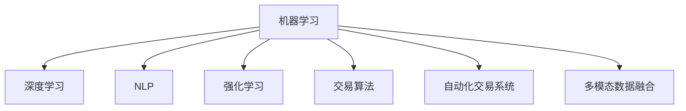

                 

## 1. 背景介绍

### 1.1 问题由来
金融市场分析是投资决策的重要基础，然而传统的基于手工规则和经验判断的市场分析方法存在许多限制：
- 难以覆盖所有潜在的市场变化。
- 难以处理非结构化数据。
- 难以捕捉市场中的长期趋势和短期波动。
- 无法实时动态调整策略。
- 需要大量的历史数据和专家知识。

随着人工智能技术的快速发展，AI在金融市场分析中的应用逐渐受到关注。AI可以通过深度学习、自然语言处理、强化学习等技术，对大规模数据进行高效分析和处理，在金融市场分析中提供更深刻、更全面的洞察，优化投资决策过程。

### 1.2 问题核心关键点
AI在金融市场分析和投资决策中的应用主要体现在以下几个方面：
1. 通过机器学习和深度学习算法，对历史市场数据和新闻文本进行建模，自动生成市场分析报告。
2. 使用强化学习算法，优化交易策略，实时动态调整投资组合。
3. 借助自然语言处理技术，自动化分析市场新闻和社交媒体信息。
4. 利用数据挖掘和统计分析，发现新的投资机会和潜在风险。
5. 使用自动化交易系统，提高交易效率和减少人为错误。
6. 通过多模态数据融合，实现更综合的市场分析。

AI技术在金融市场分析中的应用，打破了传统市场分析的限制，提供了更高的精度和效率，为投资者提供更精准的投资建议和决策支持。

## 2. 核心概念与联系

### 2.1 核心概念概述

为更好地理解AI在金融市场分析和投资决策中的应用，本节将介绍几个密切相关的核心概念：

- 机器学习(Machine Learning)：指通过数据驱动的方式，使机器自动获取知识并进行预测或决策的技术。常见的机器学习算法包括监督学习、无监督学习和强化学习。

- 深度学习(Deep Learning)：指使用多层神经网络进行特征学习和模式识别的技术，适用于处理复杂的非线性关系。常见的深度学习模型包括卷积神经网络、循环神经网络和生成对抗网络。

- 自然语言处理(Natural Language Processing, NLP)：指使用计算机对人类语言进行理解、处理和生成。常见的NLP任务包括文本分类、命名实体识别、情感分析等。

- 强化学习(Reinforcement Learning, RL)：指通过智能体在环境中的交互，最大化累积奖励的优化问题。常见的强化学习模型包括Q-learning、策略梯度等。

- 交易算法(Trading Algorithms)：指根据市场规则和策略进行买卖决策的算法。常见的交易算法包括移动平均线策略、技术指标策略等。

- 自动化交易系统(Automated Trading System)：指通过编程实现自动化买卖决策和交易执行的系统。常见的自动化交易系统包括高频交易系统、量化交易系统等。

- 多模态数据融合(Multimodal Data Fusion)：指将不同类型的异构数据进行集成、融合，以提高分析的全面性和准确性。常见的多模态数据包括股票价格、新闻报道、社交媒体、高频交易数据等。

这些核心概念之间的逻辑关系可以通过以下Mermaid流程图来展示：



这个流程图展示了几类AI技术在金融市场分析中的角色和相互联系：

1. 机器学习提供了基础的预测和决策方法。
2. 深度学习进一步提高了特征学习的能力，适用于复杂的关系建模。
3. 自然语言处理帮助处理文本信息，捕捉市场情感和新闻事件。
4. 强化学习提供了动态调整策略的能力。
5. 交易算法为市场分析提供具体的操作策略。
6. 自动化交易系统将策略落地执行。
7. 多模态数据融合提高了分析的全面性和准确性。

这些概念共同构成了AI在金融市场分析中的技术框架，使其能够从数据、模型、策略等多个维度进行综合分析，提升投资决策的科学性和智能化水平。

## 3. 核心算法原理 & 具体操作步骤
### 3.1 算法原理概述

AI在金融市场分析中的应用，本质上是一个数据驱动的预测和决策过程。其核心思想是：使用AI技术对金融市场的大量数据进行建模，通过预测市场变化和分析投资风险，辅助投资者制定投资决策。

形式化地，假设金融市场数据集为 $D=\{(x_i, y_i)\}_{i=1}^N$，其中 $x_i$ 为历史数据、新闻文本等特征， $y_i$ 为相应的市场变化或投资收益。AI的目标是学习一个映射函数 $f(x)$，使得 $f(x)$ 能够预测未来的市场变化或投资收益。

常见的预测模型包括：
- 基于回归模型的预测，如线性回归、支持向量回归等。
- 基于决策树的预测，如CART、随机森林等。
- 基于深度学习的预测，如神经网络、卷积神经网络等。

AI预测模型的训练和优化，通常需要大量的标注数据和合适的损失函数。常见的损失函数包括均方误差、交叉熵等。

### 3.2 算法步骤详解

AI在金融市场分析中的应用，一般包括以下几个关键步骤：

**Step 1: 数据收集和预处理**
- 收集市场数据，如历史股价、交易量、新闻文本等。
- 清洗和归一化数据，处理缺失值和异常值。
- 将文本数据转化为数值特征，使用TF-IDF、Word2Vec等方法进行向量化。

**Step 2: 特征工程和模型选择**
- 设计合适的特征，如技术指标、新闻情感等。
- 选择合适的模型，如线性回归、LSTM、卷积神经网络等。
- 使用交叉验证等方法评估模型性能。

**Step 3: 模型训练和优化**
- 使用训练数据集训练模型，选择合适的损失函数和优化器。
- 使用正则化技术，如L2正则、Dropout等，避免过拟合。
- 使用模型调参工具，如Grid Search、Bayesian Optimization等，找到最优参数组合。

**Step 4: 模型评估和部署**
- 使用测试集评估模型性能，计算准确率、召回率等指标。
- 部署模型到交易系统，实时进行市场分析和投资决策。
- 持续收集新数据，定期重新训练和优化模型。

**Step 5: 反馈循环和动态调整**
- 实时监测市场变化，对模型进行动态调整。
- 引入强化学习等技术，实时优化投资策略。
- 将模型的输出转化为具体的买卖决策，执行交易操作。

以上是AI在金融市场分析中的一般流程。在实际应用中，还需要针对具体任务的特点，对模型进行优化设计，如改进特征选择方法、引入更多领域知识等，以进一步提升模型性能。

### 3.3 算法优缺点

AI在金融市场分析中的应用，具有以下优点：
1. 高效处理大规模数据。AI可以处理海量市场数据，提取其中的关键特征，快速进行分析和预测。
2. 实时动态调整。AI可以实时监测市场变化，动态调整投资策略，适应市场波动。
3. 自动化交易系统。AI可以自动化执行买卖决策，提高交易效率和减少人为错误。
4. 多模态融合。AI可以将股票价格、新闻、社交媒体等多种数据进行融合，提供更全面的市场分析。

但同时，该方法也存在一定的局限性：
1. 数据依赖性高。AI模型的效果很大程度上取决于数据的数量和质量，获取高质量数据成本较高。
2. 模型解释性不足。AI模型往往作为"黑盒"系统，难以解释其内部工作机制。
3. 风险管理困难。AI模型在处理极端市场情况时，可能会产生不稳定的预测结果。
4. 可能存在偏见。AI模型可能会继承和放大数据中的偏见和噪声。

尽管存在这些局限性，但就目前而言，AI在金融市场分析中的应用仍是技术发展的重要方向。未来相关研究的重点在于如何进一步降低对标注数据的依赖，提高模型的可解释性和鲁棒性，同时兼顾风险管理和伦理安全性等因素。

### 3.4 算法应用领域

AI在金融市场分析中的应用，已经在许多领域得到广泛应用，包括：

- 股票价格预测：使用回归模型、神经网络等方法，预测未来股票价格变化。
- 市场情绪分析：使用NLP技术，分析新闻报道、社交媒体等文本数据，捕捉市场情绪。
- 投资组合优化：使用优化算法，如遗传算法、粒子群优化等，构建最优投资组合。
- 高频交易：使用算法交易系统，执行高频交易策略，获取市场套利机会。
- 风险管理：使用强化学习等方法，实时监测和应对市场风险。
- 自动化报告生成：使用NLP技术，自动化生成市场分析报告，辅助投资决策。

除了上述这些经典应用外，AI在金融市场分析中的应用还在不断拓展，如信用评分、反欺诈检测、资产定价等，为金融行业带来了新的创新和突破。随着AI技术的不断进步，相信金融市场分析将迎来更加智能化的新时代。

## 4. 数学模型和公式 & 详细讲解  
### 4.1 数学模型构建

本节将使用数学语言对AI在金融市场分析中的应用进行更加严格的刻画。

假设市场数据集为 $D=\{(x_i, y_i)\}_{i=1}^N$，其中 $x_i$ 为历史数据、新闻文本等特征， $y_i$ 为相应的市场变化或投资收益。使用线性回归模型 $y = \beta_0 + \beta_1 x_1 + \dots + \beta_k x_k + \epsilon$ 进行建模，其中 $\beta$ 为模型参数，$\epsilon$ 为误差项。

线性回归模型的目标是最小化均方误差损失函数：

$$
\mathcal{L}(\beta) = \frac{1}{N} \sum_{i=1}^N (y_i - \hat{y}_i)^2
$$

其中 $\hat{y}_i$ 为模型预测值。

通过梯度下降等优化算法，求解上述最优化问题，得到最优参数 $\beta$：

$$
\beta^* = \mathop{\arg\min}_{\beta} \mathcal{L}(\beta)
$$

### 4.2 公式推导过程

以下我们以股票价格预测为例，推导线性回归模型的训练过程。

假设历史价格数据为 $p_1, p_2, \dots, p_t$，利用移动平均线和线性回归方法进行价格预测，得到模型公式：

$$
\hat{p}_{t+1} = \beta_0 + \beta_1 p_t + \epsilon_t
$$

其中 $\beta_0$ 为截距，$\beta_1$ 为斜率，$\epsilon_t$ 为误差项。通过最小二乘法求解 $\beta_0$ 和 $\beta_1$：

$$
\beta_0, \beta_1 = \arg\min_{\beta_0, \beta_1} \sum_{t=1}^{N} (p_{t+1} - (\beta_0 + \beta_1 p_t))^2
$$

通过求导并设置导数为0，得到：

$$
\beta_1 = \frac{\sum_{t=1}^{N} (p_{t+1} - \bar{p}) (p_t - \bar{p})}{\sum_{t=1}^{N} (p_t - \bar{p})^2}
$$

$$
\beta_0 = \bar{p} - \beta_1 \bar{p}
$$

其中 $\bar{p}$ 为价格数据的均值。

在得到线性回归模型后，可以将其应用于未来的价格预测。通过定期更新模型参数，实时监测市场变化，优化投资决策。

## 5. 项目实践：代码实例和详细解释说明
### 5.1 开发环境搭建

在进行AI应用实践前，我们需要准备好开发环境。以下是使用Python进行TensorFlow开发的Python环境配置流程：

1. 安装Anaconda：从官网下载并安装Anaconda，用于创建独立的Python环境。

2. 创建并激活虚拟环境：
```bash
conda create -n tf-env python=3.7 
conda activate tf-env
```

3. 安装TensorFlow：根据CUDA版本，从官网获取对应的安装命令。例如：
```bash
conda install tensorflow -c pytorch -c conda-forge
```

4. 安装其他相关工具包：
```bash
pip install pandas numpy scikit-learn tensorflow_addons
```

5. 设置环境变量，以使用GPU资源：
```bash
export CUDA_VISIBLE_DEVICES=0
```

完成上述步骤后，即可在`tf-env`环境中开始AI应用实践。

### 5.2 源代码详细实现

下面我们以股票价格预测为例，给出使用TensorFlow进行线性回归预测的PyTorch代码实现。

首先，导入必要的库：

```python
import tensorflow as tf
from tensorflow.keras.models import Sequential
from tensorflow.keras.layers import Dense
from sklearn.preprocessing import MinMaxScaler
from sklearn.model_selection import train_test_split
import pandas as pd
import numpy as np
```

然后，加载数据并进行预处理：

```python
# 加载历史价格数据
df = pd.read_csv('stock_prices.csv')
df = df.dropna()

# 特征工程：构建移动平均线和技术指标
df['MA_5'] = df['price'].rolling(window=5).mean()
df['MA_10'] = df['price'].rolling(window=10).mean()
df['RSI'] = np.where(df['price'].pct_change() > 0, df['price'].pct_change(), -df['price'].pct_change()).rolling(window=10).mean() * 100

# 构建训练集和测试集
train_data, test_data = train_test_split(df, test_size=0.2, random_state=42)

# 标准化数据
scaler = MinMaxScaler(feature_range=(0, 1))
train_data = scaler.fit_transform(train_data[['price', 'MA_5', 'MA_10', 'RSI']])
test_data = scaler.transform(test_data[['price', 'MA_5', 'MA_10', 'RSI']])
```

接着，定义模型并进行训练：

```python
# 定义模型
model = Sequential([
    Dense(32, input_shape=(4,), activation='relu'),
    Dense(1, activation='linear')
])

# 编译模型
model.compile(optimizer=tf.keras.optimizers.Adam(0.01), loss='mse')

# 训练模型
model.fit(train_data[:-1], train_data[1:], epochs=100, batch_size=32, validation_data=(test_data[:-1], test_data[1:]))
```

最后，评估模型并进行预测：

```python
# 评估模型
test_loss = model.evaluate(test_data[:-1], test_data[1:])

# 预测价格
predictions = model.predict(test_data[:-1])

# 反标准化数据
predictions = scaler.inverse_transform(predictions)
test_data = scaler.inverse_transform(test_data)
```

以上就是使用TensorFlow进行股票价格预测的完整代码实现。可以看到，TensorFlow提供了强大的计算图和自动微分功能，使得模型构建和训练过程变得简洁高效。

### 5.3 代码解读与分析

让我们再详细解读一下关键代码的实现细节：

**数据预处理**：
- 使用pandas库加载历史价格数据，并进行去重和数据清洗。
- 构建移动平均线和技术指标，以便作为模型输入。
- 使用MinMaxScaler标准化数据，以便模型训练。

**模型定义**：
- 使用Sequential模型定义多层神经网络，包括一个隐藏层和一个输出层。
- 隐藏层包含32个神经元，激活函数为ReLU。
- 输出层只有一个神经元，激活函数为线性函数，输出预测价格。

**模型训练**：
- 使用Adam优化器，损失函数为均方误差。
- 使用fit方法进行模型训练，设置epochs和batch size，计算验证集上的损失。

**模型评估和预测**：
- 使用evaluate方法计算模型在测试集上的均方误差。
- 使用predict方法进行价格预测。
- 使用inverse_transform反标准化预测结果。

可以看到，TensorFlow提供了丰富的API和工具，使得AI模型开发过程变得流畅和高效。同时，TensorFlow还支持GPU加速，可以大大提升模型的训练速度。

当然，工业级的系统实现还需考虑更多因素，如模型的保存和部署、超参数的自动搜索、更灵活的模型架构等。但核心的AI应用流程基本与此类似。

## 6. 实际应用场景
### 6.1 智能投资顾问

基于AI的智能投资顾问系统，可以通过深度学习技术对市场数据和用户行为进行建模，自动化生成投资建议和资产配置方案。智能投资顾问系统可以实时动态调整投资组合，优化投资收益，提升用户体验。

在技术实现上，可以收集用户历史交易数据、市场价格、新闻事件等信息，构建多模态数据融合的AI模型，进行投资分析和建议生成。同时，可以引入强化学习技术，通过不断学习和优化，提高系统的决策能力和稳定性。

### 6.2 风险管理

AI在金融风险管理中的应用，主要体现在风险识别、风险评估和风险控制等方面。通过深度学习和大数据分析，AI可以识别潜在的市场风险和欺诈行为，评估风险等级，制定风险控制策略。

在实际应用中，可以构建基于深度学习的风险预测模型，对市场数据进行建模，实时监测风险变化。同时，可以引入强化学习技术，对风险控制策略进行动态优化，及时调整风险应对措施。

### 6.3 金融市场情绪分析

金融市场情绪分析，即通过文本分析技术，对新闻报道、社交媒体等非结构化数据进行情感分析，捕捉市场的情绪波动。AI可以自动识别新闻中的正面、负面和中性情绪，生成市场情绪指标，辅助投资决策。

在技术实现上，可以构建基于LSTM的情感分析模型，对新闻文本进行情感分类。同时，可以引入自然语言处理技术，对多轮对话进行情感分析，获取用户的情绪变化。

### 6.4 高频交易

高频交易是指在微秒级别上进行金融资产买卖的操作，以获取市场微小波动带来的收益。AI可以通过算法交易系统，实现高频交易策略的自动化执行，提高交易效率和收益。

在实际应用中，可以构建基于神经网络的高频交易模型，对市场数据进行建模，生成高频交易信号。同时，可以引入强化学习技术，对交易策略进行动态优化，实时调整交易策略。

### 6.5 多模态数据融合

金融市场分析涉及多种类型的异构数据，如股票价格、新闻报道、社交媒体、高频交易数据等。AI可以通过多模态数据融合技术，将这些数据进行集成和融合，提高市场分析的全面性和准确性。

在技术实现上，可以构建基于深度学习的多模态融合模型，对不同类型的异构数据进行建模。同时，可以引入多模态数据融合技术，将不同类型的异构数据进行集成，生成综合的市场分析结果。

## 7. 工具和资源推荐
### 7.1 学习资源推荐

为了帮助开发者系统掌握AI在金融市场分析中的应用，这里推荐一些优质的学习资源：

1. TensorFlow官方文档：TensorFlow是当前主流的深度学习框架之一，官方文档提供了详尽的API和教程，帮助开发者快速上手。

2. Keras官方文档：Keras是一个高层深度学习API，提供了简洁易用的接口，适合初学者入门。

3. PyTorch官方文档：PyTorch是另一主流深度学习框架，提供了强大的动态计算图和自动微分功能。

4. Deep Learning for Trading：这是一本由金融和计算机科学家共同撰写的书籍，介绍了深度学习在金融市场分析中的应用。

5. Machine Learning Mastery：这是一份机器学习资源网站，提供了大量实战项目和代码示例，适合开发者学习实践。

6. Coursera金融AI课程：Coursera上开设的金融AI课程，由斯坦福大学和亚利桑那州立大学等知名学府提供，适合深入学习金融AI知识。

通过对这些资源的学习实践，相信你一定能够快速掌握AI在金融市场分析中的应用，并用于解决实际的金融问题。

### 7.2 开发工具推荐

高效的开发离不开优秀的工具支持。以下是几款用于AI应用的常用工具：

1. TensorFlow：由Google主导开发的深度学习框架，生产部署方便，适合大规模工程应用。

2. PyTorch：由Facebook主导开发的深度学习框架，动态计算图和自动微分功能强大，适合研究应用。

3. Keras：高层深度学习API，简洁易用，适合初学者入门。

4. Jupyter Notebook：交互式笔记本工具，支持Python、R等多种编程语言，适合数据探索和模型验证。

5. Weights & Biases：模型训练的实验跟踪工具，可以记录和可视化模型训练过程中的各项指标，方便对比和调优。

6. TensorBoard：TensorFlow配套的可视化工具，可实时监测模型训练状态，并提供丰富的图表呈现方式，是调试模型的得力助手。

7. Amazon SageMaker：亚马逊提供的云端机器学习平台，提供了深度学习框架、自动调参、模型部署等功能，适合快速构建AI应用。

合理利用这些工具，可以显著提升AI应用的开发效率，加快创新迭代的步伐。

### 7.3 相关论文推荐

AI在金融市场分析中的应用，源于学界的持续研究。以下是几篇奠基性的相关论文，推荐阅读：

1. "Financial Machine Learning" by Marcos López de Prado：这是一本介绍机器学习在金融市场分析中的应用书籍，涵盖了许多经典和前沿方法。

2. "Deep Learning for Algorithmic Trading" by Marco Cuturi：这是一篇综述性文章，介绍了深度学习在算法交易中的应用，包括神经网络、卷积神经网络等。

3. "Network Traffic Forecasting" by Yan Li et al.：这篇论文介绍了深度学习在网络流量预测中的应用，可以借鉴其方法和思想。

4. "Scalable Deep Learning for Multimodal Sensor Data Classification" by Uttam Mishra et al.：这篇论文介绍了多模态数据融合的方法，可以借鉴其技术和思想。

5. "Sentiment Analysis Using Deep Learning" by Ahmed A. El-Kishky：这篇论文介绍了自然语言处理在情感分析中的应用，可以借鉴其方法和思想。

这些论文代表了大数据和深度学习在金融市场分析中的前沿成果，通过学习这些前沿成果，可以帮助研究者把握学科前进方向，激发更多的创新灵感。

## 8. 总结：未来发展趋势与挑战

### 8.1 总结

本文对AI在金融市场分析和投资决策中的应用进行了全面系统的介绍。首先阐述了AI技术在金融市场分析中的研究背景和意义，明确了AI在金融市场分析中的应用范式。其次，从原理到实践，详细讲解了AI在金融市场分析中的数学模型和关键步骤，给出了AI应用任务开发的完整代码实例。同时，本文还广泛探讨了AI在金融市场分析中的实际应用场景，展示了AI应用范式的广泛性和多样性。此外，本文精选了AI应用的各类学习资源，力求为读者提供全方位的技术指引。

通过本文的系统梳理，可以看到，AI在金融市场分析中的应用已经在多个领域得到了应用，提升了市场分析和投资决策的智能化水平。未来，伴随AI技术的不断进步，金融市场分析将迎来更加智能化的新时代。

### 8.2 未来发展趋势

展望未来，AI在金融市场分析中的应用将呈现以下几个发展趋势：

1. 数据驱动的深度学习。随着深度学习技术的发展，AI模型将更加依赖于数据驱动，能够自动从历史数据中学习规律，进行市场分析和预测。

2. 多模态数据融合。AI将能够处理更多类型的异构数据，实现多模态数据的融合和集成，提供更全面的市场分析。

3. 实时动态调整。AI将具备实时动态调整的能力，能够根据市场变化，动态优化投资策略和风险控制。

4. 自动化投资顾问。基于AI的智能投资顾问系统将不断优化，提升用户体验和投资收益。

5. 强化学习。AI将更多地引入强化学习技术，优化交易策略和风险控制，提高系统的决策能力和稳定性。

6. 因果分析。AI将引入因果分析方法，提高模型决策的因果性和逻辑性，减少人为干预。

以上趋势凸显了AI在金融市场分析中的广阔前景。这些方向的探索发展，必将进一步提升金融市场分析的智能化水平，为投资者提供更精准、更可靠的投资建议和决策支持。

### 8.3 面临的挑战

尽管AI在金融市场分析中的应用取得了一定的成效，但在迈向更加智能化、普适化应用的过程中，它仍面临着诸多挑战：

1. 数据获取难度大。高质量金融数据的获取成本高、难度大，难以满足AI模型的需求。如何获取和利用大量高质量数据，将是未来的一大挑战。

2. 模型复杂度高。AI模型往往参数量庞大，计算资源消耗高，难以实现实时高效的推理。如何优化模型结构，提高计算效率，将是重要的优化方向。

3. 风险控制困难。AI模型在处理极端市场情况时，可能会产生不稳定的预测结果，难以进行有效的风险控制。如何构建鲁棒性强的模型，保证风险管理的安全性，将是重要的研究方向。

4. 系统透明性不足。AI模型往往作为"黑盒"系统，难以解释其内部工作机制，难以进行有效的监督和治理。如何提高模型的透明性，增强系统的可解释性和可审计性，将是重要的研究方向。

5. 数据隐私和安全问题。金融数据往往涉及用户隐私和敏感信息，AI模型的数据处理和存储需要符合法律法规，保证数据隐私和安全。如何保护数据隐私，防范数据滥用，将是重要的研究方向。

6. 伦理和道德问题。AI模型可能会继承和放大数据中的偏见和噪声，产生误导性、歧视性的输出。如何构建公平、透明的模型，避免模型偏见，将是重要的研究方向。

这些挑战需要多方协同努力，共同推动AI技术在金融市场分析中的应用。只有从数据、模型、算法、伦理等多个维度进行全面优化，才能真正实现AI在金融市场分析中的应用价值。

### 8.4 研究展望

面对AI在金融市场分析中面临的挑战，未来的研究需要在以下几个方面寻求新的突破：

1. 探索无监督学习和半监督学习方法。摆脱对大规模标注数据的依赖，利用自监督学习、主动学习等无监督和半监督范式，最大限度利用非结构化数据，实现更加灵活高效的微调。

2. 研究高效计算和模型压缩技术。开发更加参数高效和计算高效的微调方法，在固定大部分预训练参数的同时，只更新极少量的任务相关参数。同时优化模型计算图，减少前向传播和反向传播的资源消耗，实现更加轻量级、实时性的部署。

3. 引入因果分析和强化学习技术。通过引入因果推断和强化学习思想，增强AI模型建立稳定因果关系的能力，学习更加普适、鲁棒的语言表征，从而提升模型泛化性和抗干扰能力。

4. 融合更多领域知识。将符号化的先验知识，如知识图谱、逻辑规则等，与神经网络模型进行巧妙融合，引导AI模型学习更准确、合理的语言模型。同时加强不同模态数据的整合，实现视觉、语音等多模态信息与文本信息的协同建模。

5. 结合伦理道德约束。在模型训练目标中引入伦理导向的评估指标，过滤和惩罚有偏见、有害的输出倾向。同时加强人工干预和审核，建立模型行为的监管机制，确保输出符合人类价值观和伦理道德。

这些研究方向的探索，必将引领AI在金融市场分析中的应用走向更高的台阶，为构建安全、可靠、可解释、可控的智能系统铺平道路。面向未来，AI在金融市场分析中的应用还需要与其他人工智能技术进行更深入的融合，如知识表示、因果推理、强化学习等，多路径协同发力，共同推动金融市场分析的进步。

## 9. 附录：常见问题与解答

**Q1：AI在金融市场分析中是否存在过拟合问题？**

A: AI模型在金融市场分析中，同样可能面临过拟合问题。由于金融市场数据存在高噪声和复杂非线性关系，AI模型可能会在训练过程中学习到数据中的噪声和异常情况，导致过拟合。为了缓解过拟合问题，可以采取以下措施：

1. 数据增强：通过回译、近义替换等方式扩充训练集。
2. 正则化：使用L2正则、Dropout等技术，避免过拟合。
3. 模型简化：减少模型参数量，降低模型复杂度。
4. 交叉验证：使用交叉验证方法，评估模型在多个数据集上的泛化能力。

通过以上措施，可以显著缓解AI模型在金融市场分析中的过拟合问题，提高模型的泛化能力。

**Q2：AI在金融市场分析中如何处理噪声数据？**

A: 金融市场数据中常常包含噪声和异常情况，如数据缺失、异常值等。为了处理这些噪声数据，可以采取以下措施：

1. 数据清洗：通过数据清洗技术，去除数据中的噪声和异常值。
2. 数据插值：使用插值方法，填补数据缺失部分。
3. 数据标准化：使用标准化方法，将数据进行归一化处理。
4. 异常值检测：使用统计方法，检测并处理异常值。

通过以上措施，可以显著提高AI模型在金融市场分析中的数据质量，提高模型的准确性和稳定性。

**Q3：AI在金融市场分析中如何提高模型透明度？**

A: AI模型在金融市场分析中的应用，往往作为"黑盒"系统，难以解释其内部工作机制和决策逻辑。为了提高模型的透明度，可以采取以下措施：

1. 可解释性方法：使用可解释性技术，如SHAP、LIME等，解释模型的决策过程。
2. 可视化工具：使用可视化工具，如TensorBoard、Weights & Biases等，展示模型的训练过程和输出结果。
3. 透明度评估：引入透明度评估指标，评估模型的可解释性和公平性。

通过以上措施，可以显著提高AI模型在金融市场分析中的透明度，增强系统的可解释性和可审计性。

**Q4：AI在金融市场分析中如何保证数据隐私和安全？**

A: 金融数据往往涉及用户隐私和敏感信息，AI模型的数据处理和存储需要符合法律法规，保证数据隐私和安全。为了保证数据隐私和安全，可以采取以下措施：

1. 数据脱敏：使用数据脱敏技术，保护数据隐私。
2. 加密存储：使用加密技术，保护数据在存储过程中的安全性。
3. 访问控制：使用访问控制技术，限制数据访问权限。
4. 合规审核：定期进行合规审核，确保数据处理和存储符合法律法规。

通过以上措施，可以显著提高AI模型在金融市场分析中的数据隐私和安全保护水平，确保数据使用的合规性和安全性。

**Q5：AI在金融市场分析中如何实现实时动态调整？**

A: 实时动态调整是AI在金融市场分析中的重要应用场景，主要体现在交易策略和风险控制等方面。为了实现实时动态调整，可以采取以下措施：

1. 实时数据采集：使用实时数据采集技术，获取最新的市场数据。
2. 实时模型训练：使用在线学习技术，实时更新模型参数。
3. 实时预测和决策：使用实时预测和决策技术，动态调整投资策略和风险控制措施。

通过以上措施，可以显著提高AI模型在金融市场分析中的实时性和动态性，适应市场变化，优化投资决策。

---

作者：禅与计算机程序设计艺术 / Zen and the Art of Computer Programming

