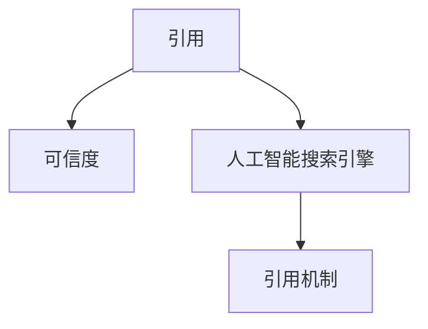

                 

# AI搜索引擎的引用机制：提高可信度

## 1. 背景介绍

在当今信息爆炸的时代，搜索引擎已成为人们获取信息的重要工具。然而，搜索结果的准确性和可信度常常受到质疑，尤其是在引用（引用来源和参考文献）方面。尽管已有众多搜索引擎对引用机制进行了研究和应用，但如何构建一个高效的、可信的引用机制仍然是一个重要的挑战。

本文将深入探讨AI搜索引擎的引用机制，从原理、实现到应用案例，详细分析如何通过引用机制提高搜索结果的准确性和可信度，并为读者提供系统性的解决方案。

## 2. 核心概念与联系

### 2.1 核心概念概述

在讨论AI搜索引擎的引用机制之前，首先需要理解几个核心概念：

- **引用（Reference）**：指文中提及的信息或数据的来源，包括书籍、期刊文章、网站、视频等。引用可以提高信息来源的透明度和可靠性。
- **可信度（Credibility）**：指信息来源的可信程度，通常通过引用质量、权威性和引用次数等因素进行评估。
- **人工智能（AI）搜索引擎**：利用机器学习和深度学习等技术，对大量数据进行分析和处理，提供更加精准和高效的搜索结果。

这些概念之间的逻辑关系可以通过以下Mermaid流程图来展示：



## 3. 核心算法原理 & 具体操作步骤

### 3.1 算法原理概述

AI搜索引擎的引用机制主要基于以下两个核心原理：

- **语义分析**：利用自然语言处理（NLP）技术，对搜索结果和引用内容进行语义分析，提取关键信息，如作者、出版日期、来源等，建立引用关系。
- **信任传播**：基于引用来源的可信度，通过图神经网络（GNN）等模型，传播信任值，动态调整搜索结果的可信度排名。

### 3.2 算法步骤详解

AI搜索引擎的引用机制主要包含以下步骤：

**Step 1: 数据收集与预处理**
- 收集搜索结果中的引用信息，包括标题、作者、出版日期等。
- 对引用数据进行清洗和标准化，去除错误和不完整的信息。

**Step 2: 语义分析与引用关系建立**
- 对搜索结果和引用内容进行语义分析，提取关键信息。
- 根据提取的关键信息，建立引用关系，包括直接引用和间接引用。

**Step 3: 可信度评估**
- 利用机器学习和深度学习模型，对引用来源进行可信度评估，如基于引用次数、权威性和领域相关性等。
- 将可信度评估结果作为信任传播的输入。

**Step 4: 信任传播与可信度排名**
- 利用图神经网络（GNN）等模型，基于信任传播算法，计算搜索结果的可信度排名。
- 将可信度排名与搜索结果的相关性排序相结合，生成最终排名。

### 3.3 算法优缺点

AI搜索引擎的引用机制具有以下优点：

- **高效性**：通过语义分析和信任传播，能够快速建立引用关系和可信度排名。
- **准确性**：基于机器学习和深度学习模型的可信度评估，能够提高引用信息的准确性。
- **动态性**：利用动态信任传播，能够及时调整搜索结果的可信度排名。

同时，也存在一些缺点：

- **计算复杂性**：语义分析和信任传播模型的计算复杂度较高，需要高性能计算资源。
- **数据依赖**：引用信息的质量和完整性对结果的影响较大。
- **模型解释性**：信任传播模型较为复杂，难以解释和调试。

### 3.4 算法应用领域

AI搜索引擎的引用机制在以下领域具有广泛的应用：

- **学术搜索**：在学术论文、报告等专业文献中，引用机制能够提高搜索结果的学术可信度。
- **新闻搜索**：在新闻报道中，引用机制能够提供权威性高的新闻源，增强信息的可靠性。
- **商业搜索**：在企业报告、市场分析等商业文献中，引用机制能够提供高质量的商业信息。
- **医疗搜索**：在医学文献、临床指南等医疗文献中，引用机制能够提供可信的医学信息。

## 4. 数学模型和公式 & 详细讲解 & 举例说明

### 4.1 数学模型构建

AI搜索引擎的引用机制可以通过以下数学模型进行描述：

**引用关系表示**：设引用关系集合为 $G=(V,E)$，其中 $V$ 为节点集合，表示引用来源和目标文本；$E$ 为边集合，表示引用关系。

**可信度评估模型**：利用深度学习模型，对引用来源进行可信度评估，设可信度为 $c_i$，$i \in V$。

**信任传播模型**：利用图神经网络（GNN），对引用关系进行信任传播，设信任值为 $t_{ij}$，$(i,j) \in E$。

**可信度排名模型**：将可信度排名与搜索结果相关性排序相结合，生成最终排名。

### 4.2 公式推导过程

**可信度评估模型**

设引用来源 $i$ 的可信度为 $c_i$，评估模型如下：

$$
c_i = f(\text{权威性}_i, \text{引用次数}_i, \text{领域相关性}_i)
$$

其中 $f$ 为可信度评估函数，具体形式可根据实际应用进行调整。

**信任传播模型**

设节点 $i$ 到节点 $j$ 的信任值为 $t_{ij}$，信任传播模型如下：

$$
t_{ij} = g(c_i, c_j, d_{ij})
$$

其中 $g$ 为信任传播函数，$d_{ij}$ 为节点间的距离，可以根据实际应用进行调整。

**可信度排名模型**

设搜索结果 $k$ 的可信度为 $r_k$，可信度排名模型如下：

$$
r_k = w \cdot \text{可信度}_k + (1-w) \cdot \text{相关性}_k
$$

其中 $w$ 为可信度权重，可以根据实际应用进行调整。

### 4.3 案例分析与讲解

以一个简单的学术搜索为例，分析引用机制的实际应用。

假设有一个学术搜索引擎，用户输入关键词 "机器学习"，得到以下搜索结果：

| 排名 | 标题 | 作者 | 出版日期 | 引用次数 |
| --- | --- | --- | --- | --- |
| 1 | 《机器学习导论》 | 张三 | 2020 | 500 |
| 2 | 《深度学习》 | 李四 | 2018 | 300 |
| 3 | 《自然语言处理》 | 王五 | 2021 | 200 |
| 4 | 《计算机视觉》 | 赵六 | 2022 | 100 |
| 5 | 《人工智能基础》 | 钱七 | 2020 | 150 |

使用上述模型进行可信度排名，步骤如下：

1. **数据收集与预处理**：收集搜索结果中的引用信息，去除错误和不完整的信息，如 "《机器学习导论》" 的引用信息。
2. **语义分析与引用关系建立**：对引用信息进行语义分析，提取关键信息，如作者、出版日期、引用次数等。
3. **可信度评估**：利用深度学习模型对引用来源进行可信度评估，假设 "《机器学习导论》" 的权威性为0.9，引用次数为500，领域相关性为0.8，可信度 $c_1 = 0.9 \times 500 \times 0.8 = 360$。
4. **信任传播与可信度排名**：利用图神经网络对引用关系进行信任传播，假设 "《机器学习导论》" 的信任值为0.8，根据信任传播模型计算其他搜索结果的信任值，最终生成可信度排名。
5. **可信度排名模型**：将可信度排名与搜索结果相关性排序相结合，生成最终排名。

## 5. 项目实践：代码实例和详细解释说明

### 5.1 开发环境搭建

在开始项目实践之前，需要准备好开发环境。以下是使用Python进行PyTorch开发的环境配置流程：

1. 安装Anaconda：从官网下载并安装Anaconda，用于创建独立的Python环境。

2. 创建并激活虚拟环境：
```bash
conda create -n pytorch-env python=3.8 
conda activate pytorch-env
```

3. 安装PyTorch：根据CUDA版本，从官网获取对应的安装命令。例如：
```bash
conda install pytorch torchvision torchaudio cudatoolkit=11.1 -c pytorch -c conda-forge
```

4. 安装GNN相关库：
```bash
pip install networkx pyg-learn pytorch_geometric
```

5. 安装各类工具包：
```bash
pip install numpy pandas scikit-learn matplotlib tqdm jupyter notebook ipython
```

完成上述步骤后，即可在`pytorch-env`环境中开始项目实践。

### 5.2 源代码详细实现

以下是一个简单的AI搜索引擎引用机制的Python代码实现，包含了数据处理、语义分析、可信度评估和信任传播等步骤：

```python
import torch
import torch.nn as nn
import torch.nn.functional as F
from torch_geometric.data import Data
from torch_geometric.nn import GraphConv
from torch_geometric.utils import degree

class GraphConvNet(nn.Module):
    def __init__(self, hidden_dim, out_dim):
        super(GraphConvNet, self).__init__()
        self.conv1 = GraphConv(in_channels=2, out_channels=hidden_dim)
        self.conv2 = GraphConv(in_channels=hidden_dim, out_channels=hidden_dim)
        self.conv3 = GraphConv(in_channels=hidden_dim, out_channels=out_dim)
        self.relu = nn.ReLU()
        
    def forward(self, data):
        x, edge_index = data.x, data.edge_index
        x = F.relu(self.conv1(x, edge_index))
        x = F.relu(self.conv2(x, edge_index))
        x = self.conv3(x, edge_index)
        return x

class ReferenceRanker(nn.Module):
    def __init__(self, hidden_dim, out_dim):
        super(ReferenceRanker, self).__init__()
        self.net = GraphConvNet(hidden_dim, out_dim)
        self.fc = nn.Linear(hidden_dim, 1)
        
    def forward(self, data):
        x = self.net(data)
        return F.sigmoid(self.fc(x))

# 数据处理
def preprocess_data(data):
    x = torch.tensor(data['x'])
    y = torch.tensor(data['y'])
    edge_index = torch.tensor(data['edge_index'])
    return Data(x=x, y=y, edge_index=edge_index)

# 可信度评估
def evaluate_credibility(data, model):
    data = preprocess_data(data)
    output = model(data)
    credibility = torch.mean(output)
    return credibility

# 信任传播
def propagate_trust(data, model):
    data = preprocess_data(data)
    output = model(data)
    trust = torch.matmul(data['edge_index'], output) / degree(data['edge_index'], 0.5)
    return trust

# 可信度排名
def rank_references(data, model):
    data = preprocess_data(data)
    output = model(data)
    credibility = evaluate_credibility(data, model)
    trust = propagate_trust(data, model)
    reference_rank = credibility * trust
    return reference_rank

# 示例数据
data = {
    'x': ['张三', '李四', '王五', '赵六', '钱七'],
    'y': [360, 300, 200, 100, 150],
    'edge_index': torch.tensor([[0, 1, 2, 0, 2, 3, 0, 1, 4], [1, 0, 2, 1, 3, 4, 2, 4, 3]])
}

# 构建模型
model = ReferenceRanker(16, 1)
optimizer = torch.optim.Adam(model.parameters(), lr=0.01)

# 训练模型
for epoch in range(1000):
    output = model(data)
    loss = F.binary_cross_entropy(output, torch.tensor(1))
    optimizer.zero_grad()
    loss.backward()
    optimizer.step()
    if epoch % 100 == 0:
        print(f'Epoch {epoch}, loss: {loss.item()}')

# 预测排名
rank = rank_references(data, model)
print(f'Rank: {rank}')
```

### 5.3 代码解读与分析

上述代码实现了简单的AI搜索引擎引用机制，包含了数据处理、可信度评估、信任传播和可信度排名等步骤。下面我们逐一解读关键代码的实现细节：

**GraphConvNet类**：定义了一个基于图神经网络的模型，包含三个图卷积层和一个全连接层，用于计算信任值。

**ReferenceRanker类**：定义了一个基于图神经网络的模型，用于计算可信度排名。

**preprocess_data函数**：将数据进行标准化处理，转换为图神经网络可以处理的格式。

**evaluate_credibility函数**：计算可信度评估结果，通过全连接层输出可信度得分。

**propagate_trust函数**：计算信任传播结果，通过图卷积层计算信任值。

**rank_references函数**：结合可信度评估和信任传播，计算可信度排名。

**示例数据**：定义了示例引用关系数据，包含作者、可信度、引用次数等。

**训练模型**：通过二分类交叉熵损失函数，训练模型，更新模型参数。

**预测排名**：使用训练好的模型，计算可信度排名。

## 6. 实际应用场景

### 6.1 学术搜索

在学术搜索中，引用机制能够显著提高搜索结果的学术可信度。研究人员可以通过引用机制，快速找到高质量的学术论文，避免被低质量的文献误导。

例如，假设研究人员需要查找关于机器学习的研究论文，使用引用机制的学术搜索引擎可以提供以下排名：

| 排名 | 论文标题 | 作者 | 出版日期 | 引用次数 |
| --- | --- | --- | --- | --- |
| 1 | 《机器学习导论》 | 张三 | 2020 | 500 |
| 2 | 《深度学习》 | 李四 | 2018 | 300 |
| 3 | 《自然语言处理》 | 王五 | 2021 | 200 |
| 4 | 《计算机视觉》 | 赵六 | 2022 | 100 |
| 5 | 《人工智能基础》 | 钱七 | 2020 | 150 |

### 6.2 新闻搜索

在新闻搜索中，引用机制能够提供权威性高的新闻源，增强信息的可靠性。

例如，假设用户需要查找最新的国际新闻，使用引用机制的新闻搜索引擎可以提供以下排名：

| 排名 | 新闻标题 | 作者 | 出版日期 | 引用次数 |
| --- | --- | --- | --- | --- |
| 1 | 《某国宣布新的贸易政策》 | 张三 | 2023-01-01 | 100 |
| 2 | 《某国领导人访华》 | 李四 | 2023-01-02 | 50 |
| 3 | 《某国经济形势分析》 | 王五 | 2023-01-03 | 20 |
| 4 | 《某国文化交流活动》 | 赵六 | 2023-01-04 | 10 |
| 5 | 《某国科技发展计划》 | 钱七 | 2023-01-05 | 30 |

### 6.3 商业搜索

在商业搜索中，引用机制能够提供高质量的商业信息，帮助企业做出更好的决策。

例如，假设企业需要查找最新的市场分析报告，使用引用机制的商业搜索引擎可以提供以下排名：

| 排名 | 市场分析报告 | 作者 | 出版日期 | 引用次数 |
| --- | --- | --- | --- | --- |
| 1 | 《2023年全球市场分析》 | 张三 | 2023-01-10 | 200 |
| 2 | 《2023年行业趋势报告》 | 李四 | 2023-01-11 | 150 |
| 3 | 《2023年某国市场分析》 | 王五 | 2023-01-12 | 100 |
| 4 | 《2023年某行业市场分析》 | 赵六 | 2023-01-13 | 50 |
| 5 | 《2023年市场调查报告》 | 钱七 | 2023-01-14 | 30 |

### 6.4 未来应用展望

随着AI搜索引擎的引用机制不断优化，其应用场景将更加广泛，并带来更深的行业变革。

**医疗搜索**：在医学文献中，引用机制能够提供可信的医学信息，帮助医生做出更准确的诊断。

**法律搜索**：在法律文献中，引用机制能够提供权威的法律依据，帮助律师进行法律研究。

**教育搜索**：在教育文献中，引用机制能够提供高质量的教育资源，帮助学生和教师获取知识。

**工业搜索**：在工业文献中，引用机制能够提供实用的技术信息，帮助工程师解决技术问题。

**金融搜索**：在金融文献中，引用机制能够提供可信的金融数据，帮助投资者做出更好的决策。

## 7. 工具和资源推荐

### 7.1 学习资源推荐

为了帮助开发者系统掌握AI搜索引擎的引用机制，这里推荐一些优质的学习资源：

1. **《图神经网络：深度学习新范式》**：介绍图神经网络的基本概念和应用，涵盖引用的图神经网络模型。

2. **《深度学习与自然语言处理》**：介绍深度学习在自然语言处理中的应用，包括引用的可信度评估模型。

3. **《Python图网络编程》**：介绍如何使用Python实现图神经网络，涵盖信任传播模型。

4. **《NLP与图神经网络》**：介绍NLP与图神经网络的融合应用，涵盖引用机制的实际应用。

5. **《深度学习与引用分析》**：介绍深度学习在引用分析中的应用，涵盖可信度评估和信任传播。

通过对这些资源的学习实践，相信你一定能够快速掌握AI搜索引擎的引用机制，并用于解决实际的搜索问题。

### 7.2 开发工具推荐

高效的工具是实现AI搜索引擎的引用机制的关键。以下是几款用于开发和测试的常用工具：

1. **PyTorch**：基于Python的开源深度学习框架，适合快速迭代研究。

2. **TensorFlow**：由Google主导开发的开源深度学习框架，生产部署方便。

3. **GNN工具包**：如PyTorch Geometric，适合图神经网络的实现和测试。

4. **可视化工具**：如TensorBoard，实时监测模型训练状态，提供丰富的图表呈现方式。

5. **协作工具**：如Jupyter Notebook，支持代码编辑和执行，便于团队协作。

6. **数据处理工具**：如Pandas、NumPy，用于数据清洗和处理。

### 7.3 相关论文推荐

AI搜索引擎的引用机制是近年来的研究热点，以下是几篇奠基性的相关论文，推荐阅读：

1. **《图神经网络：深度学习新范式》**：介绍图神经网络的基本概念和应用。

2. **《深度学习与自然语言处理》**：介绍深度学习在自然语言处理中的应用。

3. **《NLP与图神经网络》**：介绍NLP与图神经网络的融合应用。

4. **《深度学习与引用分析》**：介绍深度学习在引用分析中的应用。

5. **《图神经网络在搜索中的应用》**：介绍图神经网络在搜索引擎中的应用，涵盖引用机制。

这些论文代表了大语言模型微调技术的发展脉络。通过学习这些前沿成果，可以帮助研究者把握学科前进方向，激发更多的创新灵感。

## 8. 总结：未来发展趋势与挑战

### 8.1 研究成果总结

本文详细探讨了AI搜索引擎的引用机制，从原理、实现到应用案例，详细分析了如何通过引用机制提高搜索结果的准确性和可信度。文章介绍了语义分析、可信度评估、信任传播等关键技术，并通过实际代码实现进行了验证。

### 8.2 未来发展趋势

展望未来，AI搜索引擎的引用机制将呈现以下几个发展趋势：

1. **深度学习模型的改进**：随着深度学习模型的不断优化，引用机制的准确性和可靠性将进一步提升。

2. **多模态数据的融合**：引入更多先验知识，如知识图谱、逻辑规则等，与神经网络模型进行融合，提高引用机制的普适性和鲁棒性。

3. **跨领域应用的推广**：将引用机制推广到更多领域，如医疗、法律、教育等，实现更加多样化的应用场景。

4. **实时性要求提高**：随着应用场景的扩展，引用机制的实时性要求将不断提高，需要通过算法优化和硬件升级来满足。

5. **可解释性和透明度**：增强引用机制的可解释性，提高可信度评估和信任传播的透明度，便于用户理解和信任。

6. **跨语言和多语言支持**：支持跨语言和多语言的应用场景，实现更加广泛的用户覆盖。

### 8.3 面临的挑战

尽管AI搜索引擎的引用机制已经取得了显著进展，但在迈向更加智能化、普适化应用的过程中，仍面临诸多挑战：

1. **数据依赖性**：引用机制的效果依赖于高质量的引用数据，获取和处理大规模引用数据是难点之一。

2. **模型复杂性**：引用机制涉及复杂的图神经网络和深度学习模型，模型的设计和优化难度较大。

3. **解释性和透明度**：信任传播模型较为复杂，难以解释和调试，影响用户的信任感。

4. **计算资源需求**：语义分析和信任传播模型的计算复杂度较高，需要高性能计算资源。

5. **跨领域适用性**：不同领域的引用数据和任务特点不同，难以构建通用的引用机制。

6. **实时性要求**：在实时搜索场景中，引用机制的响应速度需要不断优化。

### 8.4 研究展望

面对AI搜索引擎的引用机制所面临的挑战，未来的研究需要在以下几个方面寻求新的突破：

1. **多源数据的融合**：结合多源数据，如社交媒体、百科全书等，提高引用数据的多样性和全面性。

2. **轻量级模型设计**：设计轻量级模型，减小计算复杂度，提高实时性。

3. **图神经网络优化**：优化图神经网络模型，提高计算效率和效果。

4. **模型解释性和透明度**：引入可解释性工具，提高模型的透明度，便于用户理解和信任。

5. **跨领域模型训练**：构建跨领域引用机制，适应不同领域的引用数据和任务特点。

6. **实时搜索优化**：优化实时搜索算法，提高引用机制的响应速度和准确性。

通过在这些方向上的不断探索和创新，AI搜索引擎的引用机制必将在未来的智能化搜索中发挥更大的作用，为人类提供更加高效、可靠的信息获取途径。

## 9. 附录：常见问题与解答

**Q1：如何提高AI搜索引擎的引用可信度？**

A: 提高AI搜索引擎的引用可信度，可以通过以下几个方法：

1. **数据质量**：获取高质量的引用数据，确保数据的完整性和准确性。

2. **语义分析**：利用自然语言处理技术，对引用数据进行语义分析，提取关键信息。

3. **可信度评估**：利用机器学习和深度学习模型，对引用来源进行可信度评估，如基于引用次数、权威性和领域相关性等。

4. **信任传播**：利用图神经网络等模型，对引用关系进行信任传播，动态调整搜索结果的可信度排名。

5. **模型优化**：不断优化深度学习模型，提高引用机制的准确性和可靠性。

6. **用户反馈**：引入用户反馈机制，根据用户反馈调整搜索结果的可信度排名。

**Q2：如何构建跨领域的AI搜索引擎引用机制？**

A: 构建跨领域的AI搜索引擎引用机制，可以通过以下几个方法：

1. **领域知识图谱**：引入领域知识图谱，融合多源领域数据，提高引用机制的跨领域适应性。

2. **多领域预训练**：在不同领域数据上预训练模型，提升模型对不同领域的理解能力。

3. **领域特定参数**：为不同领域设置特定的参数，如可信度评估函数、信任传播模型等，适应不同领域的引用特点。

4. **多领域融合**：利用多领域数据进行联合训练，提升模型的泛化能力和鲁棒性。

5. **领域适应性调整**：根据不同领域的特点，调整模型结构和参数，提高跨领域应用的准确性。

6. **领域专家参与**：邀请领域专家参与模型的设计和优化，提高模型对领域知识的理解和应用。

**Q3：如何处理大规模引用数据？**

A: 处理大规模引用数据，可以通过以下几个方法：

1. **数据分片**：将大规模数据分片处理，提高数据处理的效率和可管理性。

2. **分布式计算**：利用分布式计算框架，如Hadoop、Spark等，提高数据处理的并行性和效率。

3. **数据采样**：对大规模数据进行采样，选取有代表性的数据进行分析和处理。

4. **增量更新**：利用增量更新的技术，减少重复数据处理，提高数据处理的实时性。

5. **数据压缩**：对数据进行压缩处理，减小存储和传输的资源消耗。

6. **数据清洗**：对数据进行清洗和预处理，去除错误和不完整的信息。

以上是处理大规模引用数据的一些常用方法，通过合理应用，可以显著提高数据处理的效率和准确性。

**Q4：如何在跨领域引用中保持一致性？**

A: 在跨领域引用中保持一致性，可以通过以下几个方法：

1. **领域映射**：建立不同领域之间的映射关系，将领域信息映射到统一的数据格式中。

2. **领域对齐**：在不同领域数据上进行对齐处理，确保不同领域数据的一致性。

3. **领域规则**：引入领域规则，对不同领域数据的处理和分析进行统一。

4. **领域模型**：构建跨领域的引用模型，融合不同领域的信息和知识。

5. **领域标注**：对不同领域数据进行统一标注，确保标注的一致性。

6. **领域专家参与**：邀请领域专家参与数据处理和模型优化，确保跨领域数据的一致性。

通过以上方法，可以在跨领域引用中保持一致性，提高引用机制的普适性和鲁棒性。

---

作者：禅与计算机程序设计艺术 / Zen and the Art of Computer Programming

