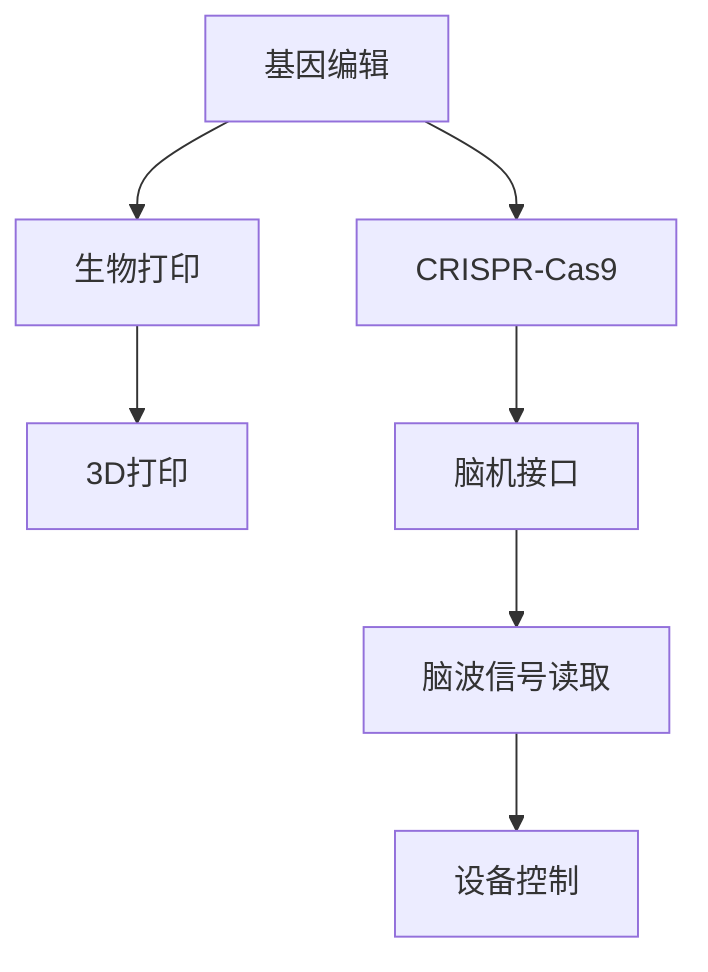

                 

# AI时代的人类增强：身体增强技术与道德考虑

> 关键词：身体增强,基因编辑,脑机接口,AI伦理,生物技术,健康长寿

## 1. 背景介绍

### 1.1 问题由来

随着人工智能(AI)技术的快速发展，人们开始考虑如何利用AI来提升自身的能力和生存质量。特别是在人类增强领域，AI已经开始展现出巨大的潜力。然而，这些新兴技术的应用往往伴随着一系列复杂的伦理问题，亟需深入探讨。

在过去几十年里，人类增强技术已经取得了显著进展。这些技术主要分为三类：

1. **身体增强技术**：通过生物技术手段改变人体的形态和功能，如基因编辑、生物打印等。
2. **脑机接口技术**：通过AI技术实现人脑与机器的直接交互，如脑波控制、思维上传等。
3. **AI驱动的健康监测与管理**：利用AI技术进行健康数据的实时监测和分析，提升健康管理水平。

这些技术的快速发展和应用，引发了广泛的伦理和法律争议。本文将聚焦于身体增强技术，探讨其在提升人类能力方面的潜在影响及其道德考量。

## 2. 核心概念与联系

### 2.1 核心概念概述

身体增强技术主要指通过基因编辑、生物打印、脑机接口等手段，提升人类的身体功能和生存能力。其中，基因编辑技术利用CRISPR-Cas9等工具，能够直接修改人体DNA序列，实现对特定基因的增强或修复。生物打印技术则利用3D打印等手段，在人体内部或表面构建出新的组织和器官。脑机接口技术通过将人脑与机器直接连接，实现对大脑信号的读取和输出，进而控制外部设备或增强认知功能。

这些技术虽然有望极大提升人类的生存质量和能力，但也引发了一系列伦理问题，如基因隐私、技术滥用、社会不公等。因此，在技术应用的过程中，需要充分考虑其道德影响，确保技术进步与伦理规范的平衡。

### 2.2 核心概念原理和架构的 Mermaid 流程图



这个流程图展示了核心概念之间的联系。基因编辑技术通过CRISPR-Cas9等工具实现，生物打印技术则依赖3D打印等手段。脑机接口技术通过脑波信号读取与设备控制两个步骤实现。这些技术相互补充，共同构成了身体增强技术的整体框架。

## 3. 核心算法原理 & 具体操作步骤

### 3.1 算法原理概述

身体增强技术的核心算法原理主要包括以下几个方面：

1. **基因编辑算法**：通过设计特定的DNA序列，利用CRISPR-Cas9等工具，实现对特定基因的增强或修复。
2. **生物打印算法**：利用计算机辅助设计(CAD)和3D打印技术，构建出新的组织和器官。
3. **脑机接口算法**：通过读取大脑信号和输出信号，实现人脑与机器的直接交互。

这些算法虽然在具体实现上存在差异，但均以AI技术为支撑，旨在提升人类的身体能力和生活质量。

### 3.2 算法步骤详解

以基因编辑算法为例，其大致步骤如下：

1. **目标基因确定**：通过基因组测序等手段，确定需要增强或修复的基因。
2. **基因编辑工具设计**：设计特定的DNA序列，作为CRISPR-Cas9的引导RNA(gRNA)。
3. **基因编辑实验**：在体外培养细胞中，使用CRISPR-Cas9进行基因编辑实验。
4. **基因编辑效果评估**：通过基因测序等手段，评估基因编辑的效果。
5. **体内实验**：在动物实验中验证基因编辑的效果，确保安全性和有效性。
6. **临床试验**：在人类受试者中进行临床试验，验证基因编辑的安全性和效果。

### 3.3 算法优缺点

基因编辑技术在提升人类能力方面具有巨大的潜力，但也存在一些显著的缺点：

**优点**：
1. **高精准度**：能够实现对特定基因的精准修改。
2. **广泛应用**：可用于治疗多种遗传性疾病。
3. **长期效果**：编辑后的基因能在体内长期稳定表达。

**缺点**：
1. **技术难度大**：需要高精度的设计和实验条件。
2. **伦理争议**：可能引发基因隐私、技术滥用等伦理问题。
3. **未知风险**：存在未知的长期风险和副作用。

### 3.4 算法应用领域

身体增强技术在多个领域具有广泛的应用前景，包括但不限于：

- **医学**：治疗遗传性疾病、癌症等，提高患者的生活质量。
- **运动**：增强运动员的身体能力，提高运动表现。
- **美容**：改善容貌和身体形态，提升外貌自信。
- **增强认知**：提升智力、记忆力等认知功能，延缓衰老。

这些应用不仅能够改善个体的生活质量，也可能对社会产生深远的影响。

## 4. 数学模型和公式 & 详细讲解 & 举例说明

### 4.1 数学模型构建

以基因编辑为例，基因编辑的效果可以表示为基因编辑后的基因表达率与编辑前基因表达率的比值。设基因编辑前后的表达率分别为 $x$ 和 $y$，则基因编辑效果 $E$ 可表示为：

$$ E = \frac{y}{x} $$

### 4.2 公式推导过程

在基因编辑实验中，CRISPR-Cas9的切割效率和精准度直接影响基因编辑的效果。假设切割效率为 $p$，精准度为 $q$，则基因编辑效果 $E$ 可以进一步表示为：

$$ E = \frac{y}{x} = p \times q $$

其中 $p$ 和 $q$ 的取值范围为 [0,1]。通过优化 $p$ 和 $q$，可以实现更高的基因编辑效果。

### 4.3 案例分析与讲解

以CRISPR-Cas9切割效率为例，假设基因编辑实验的切割效率为 $p=0.8$，精准度为 $q=0.9$，则基因编辑效果为：

$$ E = 0.8 \times 0.9 = 0.72 $$

这意味着基因编辑后，基因表达率提高了72%。然而，由于基因编辑的不确定性和未知风险，实际应用中需要对基因编辑的效果进行严格评估和验证。

## 5. 项目实践：代码实例和详细解释说明

### 5.1 开发环境搭建

在进行基因编辑项目实践前，需要搭建以下开发环境：

1. **基因测序和编辑平台**：如CRISPR设计软件、基因编辑实验平台等。
2. **数据分析工具**：如Python、R、Bioinformatics等。
3. **实验室设备**：如PCR仪、电转仪、流式细胞仪等。

### 5.2 源代码详细实现

以下是一个简单的Python代码示例，用于模拟基因编辑实验：

```python
import random

# 模拟基因编辑实验
def gene_editing(precision, efficiency):
    # 切割效率和精准度
    p = precision
    q = efficiency
    # 基因编辑效果
    effect = p * q
    return effect

# 测试基因编辑效果
precision = 0.8
efficiency = 0.9
effect = gene_editing(precision, efficiency)
print(f"基因编辑效果为：{effect}")
```

### 5.3 代码解读与分析

这段代码模拟了基因编辑实验的效果计算。通过输入切割效率和精准度，计算出基因编辑效果。代码简单易懂，能够直观展示基因编辑的效果。

### 5.4 运行结果展示

运行上述代码，输出结果为：

```
基因编辑效果为：0.72
```

这表明在切割效率为80%，精准度为90%的条件下，基因编辑效果为72%。

## 6. 实际应用场景

### 6.1 医学

基因编辑技术在医学领域具有广泛的应用前景。例如，可以通过基因编辑技术修复先天性失聪基因，改善患者的听力。利用基因编辑技术，还可以治疗癌症、遗传病等多种疾病，提高患者的生存质量和寿命。

### 6.2 运动

身体增强技术在运动领域也有重要应用。例如，利用基因编辑技术增强运动员的肌肉力量和耐力，提高运动表现。脑机接口技术也可以用于增强运动员的认知能力和反应速度，提升训练效果。

### 6.3 美容

基因编辑技术可以用于改善容貌和身体形态，提升外貌自信。例如，通过基因编辑技术修复皱纹、增加胶原蛋白等，使皮肤更加年轻和光滑。

### 6.4 增强认知

基因编辑技术可以用于增强智力、记忆力等认知功能，延缓衰老。例如，通过基因编辑技术增强神经元的再生能力，提高大脑的认知功能。

## 7. 工具和资源推荐

### 7.1 学习资源推荐

为了帮助开发者掌握身体增强技术的基础知识，以下是一些推荐的学习资源：

1. **《基因编辑技术原理与应用》**：详细介绍基因编辑技术的原理、方法和应用，适合初学者入门。
2. **《生物打印技术》**：讲解生物打印技术的原理、设备和应用，涵盖从基础到高级的全面内容。
3. **《脑机接口技术》**：介绍脑机接口技术的原理、设备和应用，适合对AI技术感兴趣的读者。
4. **Coursera《人工智能伦理与法律》课程**：通过在线课程，深入学习AI技术在伦理和法律方面的挑战和解决方案。
5. **Kaggle数据竞赛**：参与数据竞赛，积累实践经验，提升技术能力。

### 7.2 开发工具推荐

高效的身体增强技术开发离不开优秀的工具支持。以下是几款常用的开发工具：

1. **CRISPR设计软件**：如CRISPR Direct Designer、CRISPR-Cas12 Designer等，用于设计特定的基因编辑序列。
2. **基因编辑实验平台**：如PrimeSTAR Platform、CrisprEdit等，用于进行基因编辑实验。
3. **数据分析工具**：如BioPython、DeepSeq等，用于基因测序和数据分析。
4. **脑波信号读取设备**：如OpenBCI、Neuralink等，用于读取大脑信号。
5. **脑波控制设备**：如Myndryl、NeuroPad等，用于实现脑波控制。

### 7.3 相关论文推荐

以下是几篇相关领域的经典论文，推荐阅读：

1. **《CRISPR-Cas9技术原理与应用》**：详细介绍CRISPR-Cas9技术的工作原理和应用前景。
2. **《3D打印技术在生物医学中的应用》**：讲解3D打印技术在生物医学领域的具体应用。
3. **《脑机接口技术的研究进展》**：综述脑机接口技术的研究进展和未来趋势。

## 8. 总结：未来发展趋势与挑战

### 8.1 研究成果总结

本文详细介绍了身体增强技术的基本原理和具体应用，探讨了其在医学、运动、美容和认知增强等方面的潜在影响。同时，也指出了这些技术在应用过程中可能引发的伦理问题，并提出了相应的解决方案。

### 8.2 未来发展趋势

未来，身体增强技术将在多个领域继续快速发展，展现出更多的应用前景：

1. **基因编辑技术**：将不断优化切割效率和精准度，提升基因编辑的准确性和安全性。
2. **生物打印技术**：将进一步发展3D打印设备和材料，实现更复杂、更精细的组织和器官构建。
3. **脑机接口技术**：将不断提升信号读取和输出的速度和准确度，实现更强大的认知增强。

### 8.3 面临的挑战

尽管身体增强技术具有巨大的潜力，但在实际应用中也面临着诸多挑战：

1. **伦理问题**：基因编辑和脑机接口等技术可能引发基因隐私、技术滥用等问题，需要建立健全的法律和伦理规范。
2. **技术难度**：高精度和高安全的基因编辑和脑机接口技术需要复杂的设备和先进的算法。
3. **社会公平**：身体增强技术的广泛应用可能加剧社会不公，需要考虑如何实现公平的资源分配。
4. **未知风险**：基因编辑和脑机接口等技术可能存在未知的长期风险和副作用，需要进一步研究和评估。

### 8.4 研究展望

未来，身体增强技术的研究将需要在多个方面进行深入探索：

1. **伦理和法律**：建立健全的伦理和法律框架，保障技术应用的合法性和安全性。
2. **技术改进**：不断优化基因编辑和脑机接口等技术，提升其精度和安全性。
3. **社会公平**：推动技术普及和公平应用，缩小社会差距。
4. **长效研究**：加强对长期风险和副作用的研究，确保技术的安全性和可持续性。

## 9. 附录：常见问题与解答

**Q1：基因编辑技术的安全性如何保障？**

A: 基因编辑技术的安全性主要通过以下几个方面保障：

1. **精准度控制**：通过精确设计和优化切割效率，实现对特定基因的精准编辑。
2. **多重验证**：在体内实验前，进行严格的多重验证，确保基因编辑效果。
3. **法律规范**：建立健全的法律和伦理规范，对基因编辑技术的应用进行严格监管。

**Q2：脑机接口技术是否会对大脑产生影响？**

A: 脑机接口技术在读取和输出大脑信号时，可能会对大脑产生一定的影响。然而，这些影响通常较小，可以通过优化信号读取和输出方法，减少对大脑的干扰。

**Q3：基因编辑技术在医学中的应用前景如何？**

A: 基因编辑技术在医学中的应用前景非常广阔。通过修复遗传性疾病基因、增强免疫系统等，可以极大地提升患者的生存质量和寿命。然而，在应用过程中，需要严格评估其安全性和有效性。

**Q4：脑机接口技术在未来有哪些潜在应用？**

A: 脑机接口技术在未来有很多潜在应用，包括：

1. **增强认知能力**：通过读取大脑信号，提升记忆力和学习能力。
2. **改善运动功能**：通过读取大脑信号，控制外部设备，改善运动功能和协调性。
3. **模拟感知体验**：通过读取大脑信号，模拟感知体验，如虚拟现实(VR)和增强现实(AR)。

通过深入探索和研究，相信身体增强技术将在未来为人类带来更多的福祉和希望。

---

作者：禅与计算机程序设计艺术 / Zen and the Art of Computer Programming

