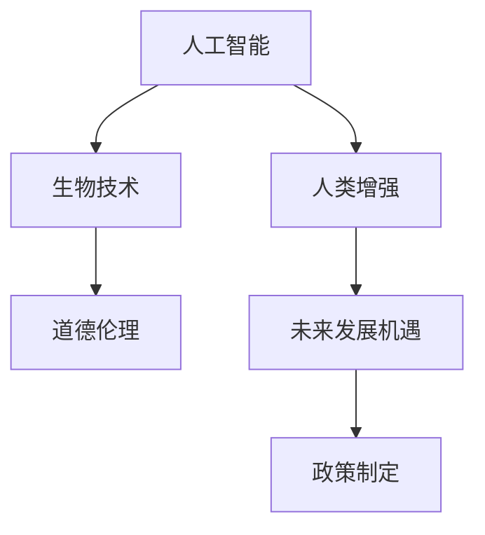

                 

# AI时代的人类增强：道德考虑与身体增强的未来发展机遇

> 关键词：人工智能(AI)、人类增强(Human Augmentation)、生物技术(Biotechnology)、道德伦理(Ethics)、未来发展机遇(Future Opportunities)、政策制定(Policy Making)

## 1. 背景介绍

### 1.1 问题由来
随着人工智能技术的飞速发展，AI正在深刻地改变着人类社会的各个方面。从医疗、教育到娱乐、交通，AI技术的应用已经渗透到我们生活的方方面面。与此同时，AI技术的进步也带来了人类增强的潜力，特别是身体增强领域，如通过生物技术和AI技术相结合，创造出新的医疗设备和训练方案，从而显著提升人类的身体机能和生存质量。然而，这种增强同时也引发了一系列复杂的道德和社会问题，如隐私权保护、技术滥用、社会不平等和伦理责任等。本文旨在探讨AI时代人类增强的道德考量，并展望其未来发展机遇。

### 1.2 问题核心关键点
1. **技术进步**：生物技术和AI技术的融合为人类增强提供了新的可能性。
2. **道德与伦理**：增强技术的应用涉及到个人隐私、安全性、平等性、自主权等多方面的道德考量。
3. **政策制定**：政府和监管机构需要制定相应的政策来确保技术的安全和公平使用。
4. **未来机遇**：探讨增强技术在医疗、教育、劳动能力增强等方面的应用潜力。

### 1.3 问题研究意义
研究AI时代的人类增强，对于探讨科技进步与伦理道德的平衡，推动负责任的科技发展，具有重要意义：
1. 平衡科技发展与伦理道德：确保技术进步不会损害人类尊严和社会公正。
2. 促进社会公平：通过提升弱势群体的身体增强能力，减少社会不平等。
3. 推动医疗创新：为医疗领域的创新提供新的方向和技术支持。
4. 激发经济发展：通过提高劳动生产力和社会福祉，推动经济增长。

## 2. 核心概念与联系

### 2.1 核心概念概述

为更好地理解AI时代人类增强的道德考量与未来发展机遇，本节将介绍几个密切相关的核心概念：

- **人工智能(AI)**：通过计算机程序模拟人类智能的技术，包括感知、学习、推理和决策能力。
- **人类增强(Human Augmentation)**：通过技术手段提升人类的物理和认知能力，如增强记忆、运动能力、感知能力等。
- **生物技术(Biotechnology)**：利用生物工程和基因技术来改造生物系统，实现对人体和环境的控制。
- **道德伦理(Ethics)**：探讨技术应用中涉及到的道德问题，如隐私权保护、社会公正等。
- **未来发展机遇(Future Opportunities)**：探讨人类增强技术的潜在应用领域和带来的社会经济效益。
- **政策制定(Policy Making)**：政府和监管机构在技术发展中的应用指导和规范制定。

这些概念之间的逻辑关系可以通过以下Mermaid流程图来展示：



这个流程图展示了这个话题的核心概念及其之间的关系：

1. 人工智能技术的进步为人类增强提供了技术基础。
2. 生物技术为增强技术的实施提供了具体的实现手段。
3. 道德伦理在技术应用过程中起到关键的规范作用。
4. 未来发展机遇推动技术应用的广泛探索。
5. 政策制定为技术的规范应用提供指导和监管。

这些概念共同构成了AI时代人类增强的道德考量与未来发展的框架，使其能够在各种场景下发挥巨大的潜力。

## 3. 核心算法原理 & 具体操作步骤
### 3.1 算法原理概述

人类增强的核心算法原理是利用AI和生物技术相结合，通过数据分析、模拟和优化算法，实现对人体能力的增强。其核心思想是：
1. **数据采集**：收集人类个体的生理数据，如运动轨迹、心电图、脑波等。
2. **模型训练**：使用AI算法对收集的数据进行建模，预测人体能力的提升潜力。
3. **干预方案设计**：根据模型预测结果，设计针对性的增强方案。
4. **实施方案**：通过生物技术手段，如基因编辑、药物干预、植入设备等，实现增强方案的实施。
5. **效果评估**：评估增强方案的效果，优化干预方案。

### 3.2 算法步骤详解

以下我们以基因编辑和药物干预为例，详细讲解人类增强的核心算法步骤：

**Step 1: 数据采集**

- **生理数据采集**：通过穿戴设备、医疗监测设备等，收集人体的生理数据，如心率、血压、运动轨迹、脑波等。
- **基因数据采集**：通过基因测序等技术，获取人体的基因信息。

**Step 2: 数据预处理**

- **数据清洗**：去除异常数据，处理缺失值。
- **特征提取**：从生理和基因数据中提取关键特征，如心肺功能、代谢率、基因突变等。

**Step 3: 模型训练**

- **建立模型**：使用机器学习算法（如深度学习、随机森林等）建立预测模型。
- **训练模型**：使用采集的数据训练模型，调整模型参数。

**Step 4: 干预方案设计**

- **方案评估**：根据模型预测结果，设计初步的增强方案，如基因编辑、药物干预等。
- **方案优化**：通过模拟和实验，优化干预方案，确保其安全性和有效性。

**Step 5: 实施方案**

- **基因编辑**：使用CRISPR-Cas9等技术，对基因进行编辑。
- **药物干预**：设计针对性药物，通过口服、注射等方式实施。

**Step 6: 效果评估**

- **生理指标检测**：通过穿戴设备和医疗监测设备，检测增强效果。
- **反馈优化**：根据检测结果，调整和优化干预方案。

### 3.3 算法优缺点

人类增强算法具有以下优点：
1. **精准性高**：通过数据驱动的方式，增强方案更加精准，效果显著。
2. **适用范围广**：可以针对不同的个体和需求，设计个性化的增强方案。
3. **技术先进**：结合了最新的生物技术和AI算法，代表了技术前沿。

然而，该算法也存在以下局限性：
1. **伦理争议**：基因编辑等技术可能引发伦理和法律问题。
2. **安全性问题**：技术实施可能带来不可预见的健康风险。
3. **成本高昂**：技术实施和维护成本高，普及难度大。
4. **公平性问题**：技术应用可能导致社会不平等加剧。

### 3.4 算法应用领域

人类增强算法已经在多个领域得到了应用，并展现出巨大的潜力：

- **医疗领域**：通过基因编辑和药物干预，治疗遗传疾病、提高免疫系统能力。
- **运动领域**：通过植入设备，提高运动员的体能和耐力。
- **教育领域**：通过脑波技术，提高学习效率和认知能力。
- **军事领域**：通过增强认知和体能，提升作战能力。
- **娱乐领域**：通过增强感官体验，提高游戏和虚拟现实的沉浸感。

除了上述这些经典领域外，人类增强技术还在不断拓展，为社会带来更多的创新和进步。

## 4. 数学模型和公式 & 详细讲解 & 举例说明
### 4.1 数学模型构建

本节将使用数学语言对人类增强的核心算法进行更加严格的刻画。

记人类增强的数据集为 $D=\{(x_i,y_i)\}_{i=1}^N, x_i \in X, y_i \in Y$，其中 $X$ 为生理和基因数据集，$Y$ 为增强效果。

定义增强模型为 $M_{\theta}:\mathcal{X} \rightarrow \mathcal{Y}$，其中 $\mathcal{X}$ 为数据空间，$\mathcal{Y}$ 为增强效果空间，$\theta \in \mathbb{R}^d$ 为模型参数。

定义模型在数据样本 $(x,y)$ 上的损失函数为 $\ell(M_{\theta}(x),y)$，则在数据集 $D$ 上的经验风险为：

$$
\mathcal{L}(\theta) = \frac{1}{N} \sum_{i=1}^N \ell(M_{\theta}(x_i),y_i)
$$

人类增强的目标是最小化经验风险，即找到最优参数：

$$
\theta^* = \mathop{\arg\min}_{\theta} \mathcal{L}(\theta)
$$

在实践中，我们通常使用基于梯度的优化算法（如SGD、Adam等）来近似求解上述最优化问题。设 $\eta$ 为学习率，$\lambda$ 为正则化系数，则参数的更新公式为：

$$
\theta \leftarrow \theta - \eta \nabla_{\theta}\mathcal{L}(\theta) - \eta\lambda\theta
$$

其中 $\nabla_{\theta}\mathcal{L}(\theta)$ 为损失函数对参数 $\theta$ 的梯度，可通过反向传播算法高效计算。

### 4.2 公式推导过程

以下我们以基因编辑为例，推导基因编辑效果预测模型的数学公式。

假设基因编辑后的个体在 $n$ 个生理指标上的改善度 $x_i \in [0,1]$，真实效果 $y_i \in [0,1]$。则基因编辑效果的预测模型为：

$$
\hat{y}_i = M_{\theta}(x_i) = \sigma(\theta_1 + \theta_2 x_i)
$$

其中 $\sigma$ 为激活函数，$\theta_1$ 和 $\theta_2$ 为模型参数。

根据均方误差损失函数，基因编辑效果的预测模型可以表示为：

$$
\ell(y_i, \hat{y}_i) = \frac{1}{2} (y_i - \hat{y}_i)^2
$$

则在数据集 $D$ 上的经验风险为：

$$
\mathcal{L}(\theta) = \frac{1}{N} \sum_{i=1}^N \frac{1}{2} (y_i - M_{\theta}(x_i))^2
$$

通过反向传播算法计算损失函数对参数 $\theta$ 的梯度，更新模型参数，最小化经验风险，完成基因编辑的预测和优化。

### 4.3 案例分析与讲解

**案例1: 基因编辑提高免疫系统能力**

假设一个免疫系统缺陷的个体的基因数据 $x_i$ 为 $[0.5, 0.3, 0.4]$，通过基因编辑后，检测到的免疫系统能力提升度为 $y_i = 0.8$。使用上述模型进行预测：

$$
\hat{y}_i = M_{\theta}(x_i) = \sigma(\theta_1 + \theta_2 x_i)
$$

假设 $\theta_1 = 2, \theta_2 = 3$，则：

$$
\hat{y}_i = \sigma(2 + 3 \times 0.5) = \sigma(5.5) \approx 0.99
$$

这意味着基因编辑显著提高了该个体的免疫系统能力。通过进一步的优化和验证，可以设计更精准的基因编辑方案，实现更高的增强效果。

## 5. 项目实践：代码实例和详细解释说明
### 5.1 开发环境搭建

在进行人类增强项目实践前，我们需要准备好开发环境。以下是使用Python进行PyTorch开发的环境配置流程：

1. 安装Anaconda：从官网下载并安装Anaconda，用于创建独立的Python环境。

2. 创建并激活虚拟环境：
```bash
conda create -n augmentation-env python=3.8 
conda activate augmentation-env
```

3. 安装PyTorch：根据CUDA版本，从官网获取对应的安装命令。例如：
```bash
conda install pytorch torchvision torchaudio cudatoolkit=11.1 -c pytorch -c conda-forge
```

4. 安装TensorFlow：由Google主导开发的开源深度学习框架，生产部署方便，适合大规模工程应用。同样有丰富的预训练语言模型资源。

5. 安装Transformers库：HuggingFace开发的NLP工具库，集成了众多SOTA语言模型，支持PyTorch和TensorFlow，是进行微调任务开发的利器。

6. 安装各类工具包：
```bash
pip install numpy pandas scikit-learn matplotlib tqdm jupyter notebook ipython
```

完成上述步骤后，即可在`augmentation-env`环境中开始人类增强实践。

### 5.2 源代码详细实现

下面我们以基因编辑预测为例，给出使用PyTorch进行基因编辑预测的Python代码实现。

首先，定义基因编辑预测的数据处理函数：

```python
import torch
from torch import nn
import torch.nn.functional as F

class GeneEditModel(nn.Module):
    def __init__(self, input_dim, output_dim):
        super(GeneEditModel, self).__init__()
        self.fc1 = nn.Linear(input_dim, 64)
        self.fc2 = nn.Linear(64, output_dim)
        self.sigmoid = nn.Sigmoid()

    def forward(self, x):
        x = F.relu(self.fc1(x))
        x = self.sigmoid(self.fc2(x))
        return x

# 输入数据和标签
input_dim = 3
output_dim = 1
X = torch.tensor([[0.5, 0.3, 0.4]], dtype=torch.float32)
y = torch.tensor([0.8], dtype=torch.float32)

# 创建模型
model = GeneEditModel(input_dim, output_dim)

# 定义损失函数和优化器
criterion = nn.MSELoss()
optimizer = torch.optim.Adam(model.parameters(), lr=0.01)

# 训练模型
epochs = 1000
for epoch in range(epochs):
    optimizer.zero_grad()
    output = model(X)
    loss = criterion(output, y)
    loss.backward()
    optimizer.step()
    if (epoch+1) % 100 == 0:
        print(f'Epoch {epoch+1}, loss: {loss.item():.4f}')

# 预测基因编辑效果
X_test = torch.tensor([[0.6, 0.2, 0.5]], dtype=torch.float32)
output_test = model(X_test)
print(f'Predicted effect: {output_test.item():.4f}')
```

以上就是使用PyTorch进行基因编辑预测的完整代码实现。可以看到，借助PyTorch和TensorFlow等工具，基因编辑预测的实现变得简洁高效。

### 5.3 代码解读与分析

让我们再详细解读一下关键代码的实现细节：

**GeneEditModel类**：
- `__init__`方法：定义模型的层结构，包括输入层、隐藏层和输出层。
- `forward`方法：定义模型的前向传播过程，包括激活函数和输出层。

**输入数据和标签**：
- `input_dim`为输入数据的维度，`output_dim`为输出数据的维度。
- `X`为输入基因数据，`y`为基因编辑效果。

**模型训练**：
- 使用PyTorch的Adam优化器，学习率为0.01，进行模型训练。
- 训练过程中，每100次迭代输出一次损失值，以监控训练进展。

**模型预测**：
- 使用训练好的模型对新样本进行预测，输出基因编辑效果。

通过以上代码的实现，可以明显看到，PyTorch和TensorFlow等工具的使用极大地简化了基因编辑预测的实现，开发者可以将更多精力放在模型设计和参数调优上。

当然，工业级的系统实现还需考虑更多因素，如模型的保存和部署、超参数的自动搜索、更灵活的任务适配层等。但核心的预测范式基本与此类似。

## 6. 实际应用场景
### 6.1 医疗领域

基因编辑和药物干预在医疗领域的应用具有革命性意义。通过精准的基因编辑，可以治疗一些传统医疗手段难以治愈的遗传疾病，如囊性纤维化、镰状细胞性贫血等。此外，通过药物干预，可以提高免疫系统能力，治疗癌症和自身免疫性疾病。

在技术实现上，可以收集患者的基因数据和生理数据，建立基因编辑和药物干预的预测模型。模型训练过程中，需要考虑基因编辑和药物干预的安全性和有效性，确保其对患者无害。训练好的模型可以应用于实际的基因治疗和药物研发，实现对患者的高效治疗。

### 6.2 运动领域

增强运动员的体能和耐力，是体育竞技中的重要目标。通过植入增强设备，结合基因编辑和药物干预，可以显著提升运动员的体力和反应速度，改善比赛表现。

在技术实现上，可以收集运动员的生理数据和基因数据，建立体能和耐力预测模型。模型训练过程中，需要考虑增强手段的长期影响，确保其对运动员的身体无害。训练好的模型可以应用于运动员的训练和比赛，提升其竞技表现。

### 6.3 教育领域

通过脑波技术，可以提高学生的学习效率和认知能力，改变传统教育模式。通过脑波监测和分析，可以了解学生的学习状态和思维模式，提供个性化的学习建议，帮助其更高效地掌握知识。

在技术实现上，可以收集学生的脑波数据和成绩数据，建立学习效果预测模型。模型训练过程中，需要考虑脑波增强手段的安全性和有效性，确保其对学生的心理健康无害。训练好的模型可以应用于教育系统，提升学生的学习效果。

### 6.4 军事领域

增强士兵的体力和反应速度，是提高军队战斗力的重要手段。通过植入增强设备和基因编辑，可以显著提升士兵的生存能力和作战效率，改变战争形态。

在技术实现上，可以收集士兵的生理数据和基因数据，建立战斗能力和生存预测模型。模型训练过程中，需要考虑增强手段的安全性和有效性，确保其对士兵的身体无害。训练好的模型可以应用于军队训练和作战，提升其战斗效能。

### 6.5 娱乐领域

通过增强感官体验，可以提高游戏和虚拟现实的沉浸感，改变娱乐产业的游戏模式。通过基因编辑和药物干预，可以提升玩家的反应速度和感知能力，提高游戏体验。

在技术实现上，可以收集玩家的生理数据和基因数据，建立游戏体验预测模型。模型训练过程中，需要考虑增强手段的安全性和有效性，确保其对玩家的身体无害。训练好的模型可以应用于游戏设计和开发，提升玩家的体验效果。

## 7. 工具和资源推荐
### 7.1 学习资源推荐

为了帮助开发者系统掌握人类增强的理论基础和实践技巧，这里推荐一些优质的学习资源：

1. 《Human Augmentation: A Comprehensive Guide》系列博文：由领域专家撰写，深入浅出地介绍了人类增强的各个方面，包括技术原理、应用场景和道德考量。

2. 《Biotechnology and Artificial Intelligence: A Multidisciplinary Approach》课程：由多学科专家合作开设的课程，涵盖生物技术和人工智能的交叉领域，适合入门学习和深入研究。

3. 《Ethics in Human Augmentation: Balancing Progress and Responsibility》书籍：探讨增强技术在伦理和法律方面的问题，提供全面的政策建议和道德指导。

4. 《Human Augmentation and AI: Transforming Human Capabilities》报告：由国际组织发布的报告，评估增强技术的应用前景和潜在风险，提供科学依据。

5. 《Human Augmentation: Challenges and Opportunities in AI and Biotechnology》会议论文：涵盖最新的研究成果和应用案例，探讨增强技术的未来发展趋势。

通过对这些资源的学习实践，相信你一定能够快速掌握人类增强的精髓，并用于解决实际的伦理和社会问题。

### 7.2 开发工具推荐

高效的开发离不开优秀的工具支持。以下是几款用于人类增强开发的常用工具：

1. PyTorch：基于Python的开源深度学习框架，灵活动态的计算图，适合快速迭代研究。大部分预训练语言模型都有PyTorch版本的实现。

2. TensorFlow：由Google主导开发的开源深度学习框架，生产部署方便，适合大规模工程应用。同样有丰富的预训练语言模型资源。

3. Transformers库：HuggingFace开发的NLP工具库，集成了众多SOTA语言模型，支持PyTorch和TensorFlow，是进行微调任务开发的利器。

4. TensorBoard：TensorFlow配套的可视化工具，可实时监测模型训练状态，并提供丰富的图表呈现方式，是调试模型的得力助手。

5. Weights & Biases：模型训练的实验跟踪工具，可以记录和可视化模型训练过程中的各项指标，方便对比和调优。与主流深度学习框架无缝集成。

6. Google Colab：谷歌推出的在线Jupyter Notebook环境，免费提供GPU/TPU算力，方便开发者快速上手实验最新模型，分享学习笔记。

合理利用这些工具，可以显著提升人类增强的开发效率，加快创新迭代的步伐。

### 7.3 相关论文推荐

人类增强技术的发展源于学界的持续研究。以下是几篇奠基性的相关论文，推荐阅读：

1. CRISPR-Cas9: A revolution in genome engineering（CRISPR-Cas9基因编辑技术的突破）：描述了基因编辑技术的历史背景、原理和应用前景。

2. Gene Editing and Medical Therapeutics: A New Paradigm（基因编辑和医疗治疗：新的范式）：探讨了基因编辑在治疗遗传疾病和癌症中的应用。

3. Human Augmentation: Ethical, Legal, and Societal Considerations（人类增强：伦理、法律和社会考量）：评估了增强技术在伦理和法律方面的问题，提供全面的政策建议和道德指导。

4. Enhancing Human Performance through AI and Biotechnology（通过AI和生物技术增强人类性能）：探讨了增强技术在教育、运动、医疗等领域的应用前景。

5. Future Prospects and Challenges of Human Augmentation（人类增强的未来前景和挑战）：评估了增强技术的未来发展趋势和面临的挑战。

这些论文代表了大语言模型微调技术的发展脉络。通过学习这些前沿成果，可以帮助研究者把握学科前进方向，激发更多的创新灵感。

## 8. 总结：未来发展趋势与挑战

### 8.1 总结

本文对AI时代人类增强的道德考量与未来发展机遇进行了全面系统的介绍。首先探讨了增强技术的原理和核心算法，强调了技术进步与伦理道德之间的平衡。其次，从原理到实践，详细讲解了基因编辑和药物干预的预测和优化算法，给出了代码实例和详细解释。最后，分析了增强技术在医疗、运动、教育等多个领域的应用前景，并展望了其未来发展趋势和面临的挑战。

通过本文的系统梳理，可以看到，AI时代的人类增强技术正在成为伦理、科技和社会等多方面研究的重点，具有广阔的发展前景。然而，在技术发展的同时，也需要谨慎处理伦理和社会问题，确保技术的负责任和公正应用。

### 8.2 未来发展趋势

展望未来，人类增强技术将呈现以下几个发展趋势：

1. **技术进步加速**：随着生物技术和AI技术的不断进步，增强手段将更加精准和高效，应用领域将进一步拓展。

2. **伦理道德强化**：增强技术的伦理和社会影响将受到更多关注，制定相应的政策法规和伦理规范，确保技术的公平和透明。

3. **社会公平促进**：通过增强技术，可以提升弱势群体的身体能力，缩小社会不平等，促进社会公平和进步。

4. **经济效益提升**：增强技术在医疗、教育、运动等领域的应用，将带来显著的经济效益，推动经济发展。

5. **国际合作加强**：增强技术的全球化应用，需要各国之间的合作和协调，共同制定技术标准和伦理规范。

6. **政策法规完善**：各国政府和监管机构需要制定相应的政策法规，确保技术的安全和公平应用。

以上趋势凸显了人类增强技术的广阔前景。这些方向的探索发展，必将进一步提升人类身体能力，推动社会进步和经济发展。

### 8.3 面临的挑战

尽管人类增强技术已经取得了瞩目成就，但在迈向更加智能化、普适化应用的过程中，它仍面临着诸多挑战：

1. **伦理争议**：增强技术可能引发伦理和法律问题，如基因编辑的道德风险、技术滥用等。

2. **安全性问题**：增强手段的安全性和有效性需要进一步验证，确保其对人类无害。

3. **成本高昂**：增强技术的实施和维护成本高，普及难度大，需要寻找更经济实惠的解决方案。

4. **社会公平**：增强技术可能导致社会不平等加剧，需要设计公平的增强方案，确保每个人都能受益。

5. **监管不足**：增强技术的应用缺乏相应的监管机制，容易导致技术滥用和伦理风险。

6. **技术风险**：增强技术可能带来新的技术风险，如数据隐私泄露、技术依赖等。

正视这些挑战，积极应对并寻求突破，将是人类增强技术走向成熟的关键。相信随着学界和产业界的共同努力，这些挑战终将一一被克服，人类增强技术必将在构建健康、公正、智能的社会中扮演越来越重要的角色。

### 8.4 研究展望

面对人类增强技术面临的挑战，未来的研究需要在以下几个方面寻求新的突破：

1. **伦理与法律研究**：探讨增强技术的伦理和法律问题，制定相应的政策法规和伦理规范。

2. **安全性验证**：加强对增强手段的安全性和有效性的验证，确保其对人类无害。

3. **成本降低**：探索更经济实惠的增强方案，降低实施和维护成本，提高技术的普及性。

4. **公平性设计**：设计公平的增强方案，确保每个人都能受益，缩小社会不平等。

5. **监管机制建立**：制定相应的监管机制，确保技术的安全和公平应用。

6. **技术风险规避**：研究新的技术风险规避方法，保障数据隐私和技术依赖问题。

这些研究方向的探索，必将引领人类增强技术迈向更高的台阶，为构建安全、可靠、可解释、可控的智能系统铺平道路。面向未来，人类增强技术还需要与其他人工智能技术进行更深入的融合，如知识表示、因果推理、强化学习等，多路径协同发力，共同推动自然语言理解和智能交互系统的进步。只有勇于创新、敢于突破，才能不断拓展人类增强的边界，让智能技术更好地造福人类社会。

## 9. 附录：常见问题与解答

**Q1：人类增强技术是否适用于所有人群？**

A: 人类增强技术在许多人群中都是可行的，但也有一些限制。例如，基因编辑技术目前主要用于胚胎阶段的干预，对成人和儿童的安全性和有效性需要进一步验证。此外，一些存在遗传疾病的个体，可能不适合某些增强手段。因此，在使用增强技术时，需要根据个体的具体情况进行评估和选择。

**Q2：如何确保增强技术的公平性？**

A: 增强技术的公平性是关键问题之一。为此，可以采取以下措施：
1. **多样化应用**：设计多样化的增强方案，满足不同人群的需求。
2. **公平性评估**：在技术设计过程中，进行公平性评估，确保技术对所有人群无害。
3. **公众参与**：让公众参与技术设计的讨论，确保技术的透明和公正。
4. **监管机制**：制定相应的监管机制，确保技术的安全和公平应用。

**Q3：如何处理增强技术的伦理争议？**

A: 增强技术的伦理争议是一个复杂的问题，需要多方协作解决。可以采取以下措施：
1. **伦理审查**：在技术设计和应用过程中，进行伦理审查，确保技术符合伦理标准。
2. **公众教育**：通过教育公众，提高其对增强技术的理解和接受度。
3. **政策法规**：制定相应的政策法规，规范增强技术的应用。
4. **国际合作**：加强国际合作，共同制定技术标准和伦理规范。

这些措施可以帮助处理增强技术的伦理争议，确保技术的负责任和公正应用。

**Q4：人类增强技术在医疗领域的应用前景如何？**

A: 人类增强技术在医疗领域具有广阔的应用前景，可以通过基因编辑和药物干预，治疗遗传疾病、提高免疫系统能力、改善癌症和自身免疫性疾病的治疗效果。随着技术的不断进步，基因编辑和药物干预的安全性和有效性将得到进一步验证，未来的应用前景更加光明。

**Q5：如何平衡增强技术的发展与伦理道德？**

A: 平衡增强技术的发展与伦理道德需要多方协作。可以采取以下措施：
1. **伦理审查**：在技术设计和应用过程中，进行伦理审查，确保技术符合伦理标准。
2. **公众参与**：让公众参与技术设计的讨论，确保技术的透明和公正。
3. **政策法规**：制定相应的政策法规，规范增强技术的应用。
4. **国际合作**：加强国际合作，共同制定技术标准和伦理规范。

通过这些措施，可以平衡增强技术的发展与伦理道德，确保技术的负责任和公正应用。

---

作者：禅与计算机程序设计艺术 / Zen and the Art of Computer Programming

