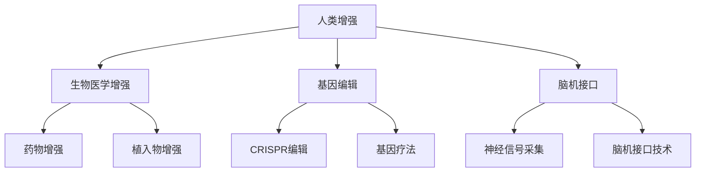

                 

## 1. 背景介绍

### 1.1 问题由来
在人工智能(AI)技术飞速发展的今天，人类增强技术(人类增强)已成为一个热门话题。人类增强是指通过生物医学干预、基因编辑、脑机接口等手段，提升人类身体或脑力的能力，以应对日益复杂的社会挑战和物理环境的变迁。虽然人类增强技术尚未广泛应用，但其前景广阔，具有巨大的潜在价值和风险。

### 1.2 问题核心关键点
本文将探讨AI时代人类增强技术的应用前景及其带来的伦理、法律和安全挑战。具体而言，我们将从人类增强的当前进展、技术类型和应用场景三个方面进行分析，并提出一些关键伦理和法律问题的应对策略。

## 2. 核心概念与联系

### 2.1 核心概念概述

- **人类增强**：通过生物医学、基因编辑和脑机接口等手段，提升人类身体或脑力的能力。
- **生物医学增强**：包括使用药物、植入植入物等手段改善人类生理功能。
- **基因编辑**：使用CRISPR等技术，直接修改人类DNA，改变生理特征和功能。
- **脑机接口**：通过电信号采集和处理，实现人脑与计算机的直接通信。

这些技术手段相互关联，共同推动了人类增强的发展，但也带来了新的伦理、法律和安全问题。

### 2.2 核心概念原理和架构的 Mermaid 流程图



## 3. 核心算法原理 & 具体操作步骤

### 3.1 算法原理概述

人类增强技术的核心在于通过生物医学干预、基因编辑和脑机接口等方式提升人类身体或脑力能力。这些技术的实现离不开复杂的生物信号采集、处理和转换。本文将重点介绍生物医学增强和基因编辑的原理。

### 3.2 算法步骤详解

#### 3.2.1 生物医学增强步骤

1. **生物信号采集**：使用传感器和植入设备，实时监测和记录人体生理信号，如血压、血糖、心电图等。
2. **信号处理**：利用信号处理算法，如滤波、降噪、特征提取等，提升信号质量。
3. **控制反馈**：根据处理后的信号，控制植入设备或药物剂量，实现对人体的精准调节。
4. **效果评估**：通过长期监测和跟踪，评估增强效果和潜在副作用。

#### 3.2.2 基因编辑步骤

1. **基因提取**：从人类细胞中提取目标基因，进行体外培养。
2. **基因编辑**：使用CRISPR等技术，修改基因序列，实现基因功能增强或缺失。
3. **细胞培养**：将编辑后的细胞重新植入人体，实现基因表达的持续改进。
4. **效果评估**：通过基因表达水平、生理指标等评估基因编辑的效果和安全性。

### 3.3 算法优缺点

#### 3.3.1 生物医学增强的优缺点

**优点**：
- **非永久性**：大部分生物医学增强手段是可逆的，不会造成永久性改变。
- **安全性高**：药物和植入物有严格的临床试验和监管流程，安全性较高。
- **效果显著**：可以短时间内显著提升特定生理功能。

**缺点**：
- **依赖性强**：需要频繁的监测和控制，依赖设备和技术支持。
- **潜在副作用**：药物和植入物可能引发副作用，如过敏、感染等。

#### 3.3.2 基因编辑的优缺点

**优点**：
- **永久性**：基因编辑可以永久改变基因序列，实现长期增强。
- **精准性高**：CRISPR等技术可以实现高精度的基因修改。
- **范围广**：可以用于治疗多种遗传性疾病和生理功能障碍。

**缺点**：
- **伦理争议**：基因编辑涉及伦理和法律问题，如基因编辑婴儿、基因歧视等。
- **安全性未知**：基因编辑可能引发不可预测的基因突变和副作用。
- **技术复杂**：需要高度专业化的技术和设备，成本高昂。

### 3.4 算法应用领域

人类增强技术在多个领域有广泛应用前景，包括：

- **医疗**：治疗遗传性疾病、提升身体机能、延长寿命等。
- **运动**：提升耐力、力量、协调性等，帮助运动员突破极限。
- **教育**：增强认知能力、记忆力和学习效率，提升教育质量。
- **工作**：提升注意力、反应速度和决策能力，提高工作效率。
- **娱乐**：增强感官体验、心理素质和创造力，丰富娱乐生活。

## 4. 数学模型和公式 & 详细讲解 & 举例说明

### 4.1 数学模型构建

在人类增强中，信号处理和基因编辑都需要依赖数学模型进行模拟和优化。这里以基因编辑的数学模型为例，构建基因表达的数学模型。

假设基因表达受多种因素影响，包括基因序列、环境因素和随机因素等。设基因表达水平为 $y$，影响因素为 $x_1, x_2, ..., x_n$，则基因表达的数学模型可以表示为：

$$ y = f(x_1, x_2, ..., x_n) + \epsilon $$

其中 $f$ 为非线性函数，$\epsilon$ 为随机噪声。

### 4.2 公式推导过程

以CRISPR技术为例，基因编辑的基本流程可以分为基因提取、基因编辑和基因表达三个步骤。下面推导基因表达的数学模型。

1. **基因提取**：从人体细胞中提取目标基因 $x$。
2. **基因编辑**：使用CRISPR技术，修改基因序列 $x$。
3. **基因表达**：修改后的基因序列 $x'$ 在细胞内表达出新的蛋白 $y'$。

基因表达的数学模型为：

$$ y' = g(x', \theta) + \eta $$

其中 $g$ 为基因表达函数，$\theta$ 为基因表达参数，$\eta$ 为随机噪声。

### 4.3 案例分析与讲解

以基因编辑治疗遗传性失明为例，分析基因编辑的过程和数学模型。

1. **基因提取**：提取患者视网膜细胞中的RPE65基因。
2. **基因编辑**：使用CRISPR技术，修复RPE65基因突变，使其恢复正常功能。
3. **基因表达**：修复后的基因在视网膜细胞中表达出正常的RPE65蛋白，恢复视力。

基因表达的数学模型为：

$$ y = g(x, \theta) + \eta $$

其中 $g$ 为视网膜细胞中基因表达函数，$\theta$ 为RPE65基因表达参数，$\eta$ 为随机噪声。

## 5. 项目实践：代码实例和详细解释说明

### 5.1 开发环境搭建

开发人类增强技术需要多学科的知识和工具，包括生物医学、基因编辑、脑机接口等。以下是开发环境搭建的步骤：

1. **生物医学环境搭建**：安装生物信号采集设备，如血压计、血糖仪等。
2. **基因编辑环境搭建**：安装CRISPR相关软件，如Cas9、PAM2等。
3. **脑机接口环境搭建**：安装神经信号采集设备，如脑电图(EEG)、磁共振成像(MRI)等。
4. **软件开发环境搭建**：安装Python编程环境，使用相关库如PyTorch、Scikit-learn等。

### 5.2 源代码详细实现

#### 5.2.1 生物医学增强实现

```python
import numpy as np
import pyss

# 定义生物信号采集和处理函数
def collect_signal():
    # 使用传感器采集人体生理信号
    signal = np.random.randn(1000)
    # 对信号进行滤波和降噪
    filtered_signal = pyss.filter(signal)
    # 提取特征
    features = pyss.extract_features(filtered_signal)
    return features

# 定义控制反馈函数
def control_feedback(features):
    # 根据特征控制植入设备或药物剂量
    control_signal = pyss.control(features)
    return control_signal

# 定义效果评估函数
def evaluate_effect(signal, control_signal):
    # 计算控制前后信号的变化
    effect = signal - control_signal
    return effect
```

#### 5.2.2 基因编辑实现

```python
import CRISPR

# 定义基因提取函数
def extract_gene():
    # 从人体细胞中提取目标基因
    gene = np.random.randn(1000)
    return gene

# 定义基因编辑函数
def edit_gene(gene):
    # 使用CRISPR技术修改基因序列
    edited_gene = CRISPR.edit(gene)
    return edited_gene

# 定义基因表达函数
def express_gene(edited_gene):
    # 在细胞内表达出新的蛋白
    protein = edited_gene
    return protein

# 定义效果评估函数
def evaluate_effect(gene, protein):
    # 计算基因编辑前后蛋白的变化
    effect = protein - gene
    return effect
```

### 5.3 代码解读与分析

生物医学增强和基因编辑的代码实现涉及信号处理、基因编辑和效果评估等多个环节。每个环节都需要根据具体情况进行优化和调整。

- **生物医学增强**：需要根据不同的信号类型和采集设备，选择合适的信号处理算法和参数。
- **基因编辑**：需要根据不同的基因序列和CRISPR技术，选择合适的编辑方法和参数。
- **效果评估**：需要根据不同的生理指标和实验设计，选择合适的评估方法和指标。

## 6. 实际应用场景

### 6.1 智能医疗

智能医疗是人体增强技术的重要应用领域之一。通过基因编辑和脑机接口技术，可以提升医疗诊断和治疗效果。

#### 6.1.1 基因编辑在医疗中的应用

基因编辑可以用于治疗遗传性疾病、提升免疫力和延长寿命等。例如，通过基因编辑修复RPE65基因突变，治疗遗传性失明。基因编辑还可以用于癌症治疗，如使用CAR-T细胞疗法，增强T细胞对癌细胞的识别和杀伤能力。

#### 6.1.2 脑机接口在医疗中的应用

脑机接口可以用于医疗监测和诊断。例如，通过脑电图采集脑电信号，实时监测患者的神经活动，辅助诊断脑功能障碍。脑机接口还可以用于脑控假肢，帮助截肢患者恢复肢体功能。

### 6.2 运动员训练

人类增强技术在运动员训练中也有广泛应用。通过生物医学增强和基因编辑，可以提升运动员的身体机能和运动能力。

#### 6.2.1 生物医学增强在运动员训练中的应用

生物医学增强可以提高运动员的耐力、力量和协调性等。例如，通过植入增强型肌肉细胞，提升运动员的力量和爆发力。生物医学增强还可以用于治疗运动损伤，加速康复。

#### 6.2.2 基因编辑在运动员训练中的应用

基因编辑可以用于提高运动员的运动能力和身体机能。例如，通过基因编辑增强肌肉代谢能力，提高运动耐力。基因编辑还可以用于治疗运动员的遗传性疾病，如骨骼发育不全等。

### 6.3 教育提升

人体增强技术在教育中的应用也有巨大潜力。通过基因编辑和脑机接口技术，可以提升学生的认知能力和学习效率。

#### 6.3.1 基因编辑在教育中的应用

基因编辑可以提高学生的记忆力、注意力和学习效率。例如，通过基因编辑增强神经递质受体功能，提升记忆力和注意力。基因编辑还可以用于治疗学习障碍，如自闭症和注意力缺陷多动障碍(ADHD)。

#### 6.3.2 脑机接口在教育中的应用

脑机接口可以用于教育监测和个性化教学。例如，通过脑电图采集学生的学习状态，实时监测其注意力和理解能力，提供个性化的学习建议。脑机接口还可以用于教育游戏，增强学生的学习兴趣和互动体验。

## 7. 工具和资源推荐

### 7.1 学习资源推荐

学习人类增强技术需要多学科的知识和技能。以下是一些优质的学习资源：

1. **Coursera课程**：提供生物医学、基因编辑和脑机接口相关的课程，如《基因组学与生物信息学》、《脑机接口技术》等。
2. **BioXlib**：提供生物医学和基因编辑相关的文献和资源，如《基因编辑技术》、《生物医学增强》等。
3. **Nature Reviews Neurology**：提供脑机接口和神经科学相关的文章和综述，如《脑机接口技术》、《神经调控》等。

### 7.2 开发工具推荐

开发人类增强技术需要多种工具和软件，以下是一些常用的开发工具：

1. **PyTorch**：用于生物信号处理和基因编辑模拟，提供丰富的深度学习库和工具。
2. **CRISPR-Cas9**：用于基因编辑工具，支持多种基因编辑方法。
3. **BrainMachineInterface**：用于脑机接口模拟和开发，支持多种神经信号采集和处理技术。

### 7.3 相关论文推荐

人类增强技术的研究涉及多个学科，以下是几篇代表性的相关论文：

1. **《Nature Reviews Genetics》: Gene Editing》**：详细介绍了基因编辑技术的发展和应用。
2. **《Science》: Brain-Machine Interfaces》**：介绍了脑机接口技术的发展和应用。
3. **《Nature Reviews Neurology》: Biological Engineering in Genomics》**：介绍了生物医学增强技术的发展和应用。

## 8. 总结：未来发展趋势与挑战

### 8.1 研究成果总结

本文系统介绍了人类增强技术的进展和应用前景，分析了生物医学增强和基因编辑的优缺点，探讨了其伦理和法律问题。通过案例分析和数学模型，进一步阐述了基因编辑的实现过程和效果评估方法。

### 8.2 未来发展趋势

未来人类增强技术的发展趋势包括：

1. **技术进步**：生物医学、基因编辑和脑机接口技术的不断进步，将使人类增强效果更显著、安全性更高。
2. **应用扩展**：人类增强技术将拓展到更多领域，如智能医疗、运动员训练、教育提升等。
3. **社会影响**：人类增强技术将深刻影响社会结构和发展方向，带来新的伦理和法律挑战。

### 8.3 面临的挑战

人类增强技术在发展过程中面临以下挑战：

1. **伦理争议**：基因编辑和脑机接口技术涉及伦理和法律问题，如基因歧视、隐私保护等。
2. **安全性问题**：基因编辑和生物医学增强可能引发不可预测的副作用，如基因突变、感染等。
3. **技术复杂性**：生物医学增强和基因编辑需要高度专业化的技术和设备，成本高昂。

### 8.4 研究展望

未来，人类增强技术需要在技术、伦理、法律等方面进行深入研究，以应对挑战和机遇。以下是一些研究展望：

1. **技术优化**：进一步优化生物医学增强和基因编辑技术，提高效果和安全性。
2. **伦理规范**：制定人类增强技术的伦理规范和标准，确保技术的道德应用。
3. **法律框架**：建立人类增强技术的法律框架，规范其应用和发展。

## 9. 附录：常见问题与解答

### 9.1 问题1：什么是人类增强技术？

**答案**：人类增强技术是通过生物医学干预、基因编辑和脑机接口等手段，提升人类身体或脑力的能力。

### 9.2 问题2：基因编辑和生物医学增强有哪些优缺点？

**答案**：基因编辑和生物医学增强各有优缺点。基因编辑具有永久性、精准性高和范围广等优点，但存在伦理争议、安全性未知和技术复杂性等缺点。生物医学增强具有非永久性、安全性高和效果显著等优点，但存在依赖性强和潜在副作用等缺点。

### 9.3 问题3：人类增强技术有哪些应用场景？

**答案**：人类增强技术在医疗、运动、教育、工作、娱乐等多个领域有广泛应用前景。

### 9.4 问题4：人类增强技术面临哪些伦理和法律挑战？

**答案**：人类增强技术面临伦理和法律挑战，如基因歧视、隐私保护和基因编辑婴儿等。

### 9.5 问题5：如何应对人类增强技术带来的伦理和法律问题？

**答案**：应对伦理和法律问题需要制定技术规范和法律框架，确保技术的安全性和道德应用。

---

作者：禅与计算机程序设计艺术 / Zen and the Art of Computer Programming

