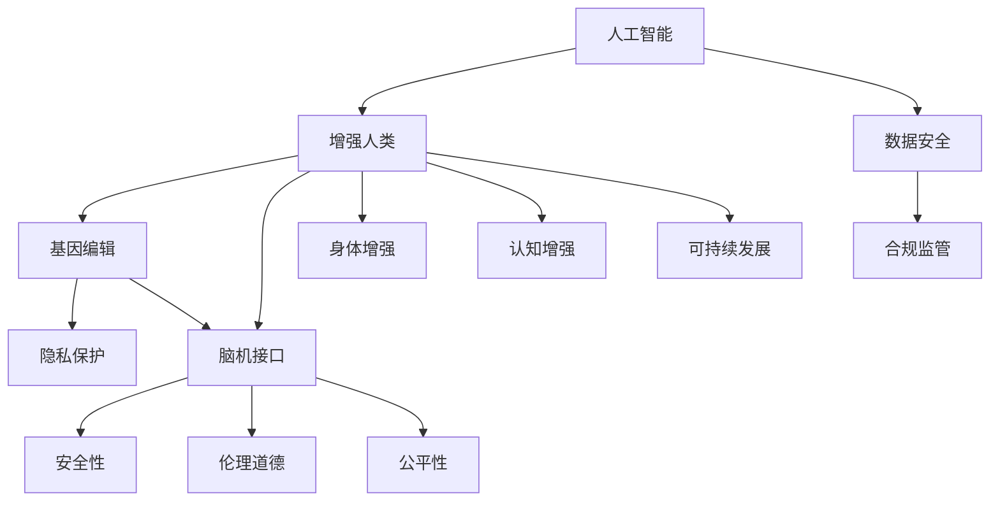

                 

# AI时代的人类增强：道德考虑与身体增强的未来发展机遇分析机遇挑战机遇趋势分析

> 关键词：人工智能,增强人类,身体增强,道德伦理,基因编辑,脑机接口,技术前沿,社会影响

## 1. 背景介绍

### 1.1 问题的由来
随着科技的飞速发展，人工智能(AI)正迅速成为塑造人类未来的关键力量。在AI的助力下，人类增强技术正在迎来前所未有的发展机遇。从基因编辑到脑机接口，从物理增强到认知增强，AI时代的人类增强技术正在重新定义人类的能力与潜力。然而，这一领域的发展也伴随着诸多伦理与道德挑战，引发了广泛的讨论与关注。

当前，人类增强技术主要集中在以下几方面：
- **基因编辑**：通过CRISPR等技术，修改人类基因，预防遗传疾病，提升生理能力。
- **脑机接口(BMI)**：通过将大脑与计算机连接，实现思想与行为的直接操控。
- **身体增强**：通过植入假肢、增强骨骼肌等，直接提升人体能力。
- **认知增强**：通过智能眼镜、增强现实等技术，提升人类认知与学习能力。

这些技术的迅速发展，使得人类增强前景广阔，但也引发了关于隐私、安全性、公平性等伦理道德问题。如何在保障技术发展的同时，确保人类福祉，是当前亟需解决的问题。

## 2. 核心概念与联系

### 2.1 核心概念概述

为了更好地理解AI时代人类增强技术的伦理与道德问题，本节将介绍几个关键概念及其相互联系：

- **人工智能**：指通过算法、数据和计算资源实现的模拟人类智能的技术。AI的应用涵盖语音识别、图像识别、自然语言处理等诸多领域。
- **增强人类**：指通过技术手段提升人类能力的过程，包括身体增强、认知增强等方面。
- **基因编辑**：指通过修改DNA序列，改变生物体遗传特征的技术。常见的基因编辑技术包括CRISPR、ZFN等。
- **脑机接口(BMI)**：指通过技术手段将人脑与计算机连接，实现信息直接交换的技术。
- **隐私保护**：指在技术应用中保障用户个人信息安全，防止数据泄露或滥用。
- **安全性**：指确保技术应用过程中，不会对人类健康或环境造成不可逆伤害。
- **公平性**：指技术应用应面向所有人，不论其经济、种族、性别等背景，保障机会均等。
- **伦理道德**：指在技术应用中，遵守社会公认的道德规范与价值准则，确保技术对人类的正面影响。

这些核心概念之间的逻辑关系可以通过以下Mermaid流程图来展示：



该流程图展示了大语言模型的核心概念及其之间的关系：

1. 人工智能为增强人类提供技术手段。
2. 增强人类涉及多种技术手段，包括基因编辑、脑机接口、身体增强、认知增强等。
3. 基因编辑和脑机接口面临隐私保护、安全性、伦理道德等挑战。
4. 数据安全与合规监管是确保AI技术应用的基础。
5. 增强人类的目标还应包括公平性、可持续发展等社会价值。

这些概念共同构成了AI时代人类增强技术的伦理道德框架，确保技术在提升人类能力的同时，不带来新的问题。

## 3. 核心算法原理 & 具体操作步骤
### 3.1 算法原理概述

AI时代的人类增强技术，核心在于利用AI技术提升人类能力。其基本原理是通过数据驱动的方法，对人类生理、认知等特性进行模拟与优化。在这一过程中，算法、数据与计算资源发挥了关键作用。

以基因编辑技术为例，其原理是利用CRISPR等基因编辑工具，在DNA水平上修改特定基因序列，以实现疾病的预防和治疗。这一过程涉及基因序列的定位、切割、插入等操作，其核心算法包括：

1. **序列比对算法**：用于识别目标基因序列与参考序列之间的差异。
2. **切割算法**：用于在目标基因序列上精确切割DNA双链。
3. **插入算法**：用于将新的基因序列插入到目标基因位点。

脑机接口技术则通过神经信号的采集与处理，实现脑与计算机之间的直接通信。其核心算法包括：

1. **神经信号采集**：通过头皮电极、植入电极等设备，采集大脑电信号。
2. **信号预处理**：去除噪音，提取有效信号。
3. **特征提取**：将原始信号转换为计算机可处理的特征向量。
4. **模型训练**：利用机器学习算法，训练模型实现信号分类与预测。

### 3.2 算法步骤详解

以下以脑机接口技术为例，详细讲解其操作步骤：

1. **信号采集**：使用头皮电极或植入电极，采集大脑电信号。采集设备需具备高分辨率和高信噪比，以获取高质量信号。
2. **信号预处理**：对采集到的信号进行去噪、滤波等预处理，以提高信号的信噪比。
3. **特征提取**：使用傅里叶变换、小波变换等技术，将时间域的信号转换为频域特征，或直接从时间域提取局部特征。
4. **模型训练**：选择适当的机器学习算法，如支持向量机(SVM)、卷积神经网络(CNN)等，训练模型以实现信号分类与预测。
5. **实时控制**：将训练好的模型应用于实时数据，实现对大脑信号的分类与控制。

### 3.3 算法优缺点

AI时代的人类增强技术，具有以下优点：

- **精度高**：利用AI技术，可以实现精确的基因编辑和信号处理，提高治疗和控制的效果。
- **效率高**：通过自动化和算法优化，大幅提高操作效率，缩短开发和应用周期。
- **应用广泛**：基因编辑、脑机接口等技术，可以应用于多种疾病治疗、认知提升等场景。

但同时也存在一些缺点：

- **成本高**：先进设备和技术的应用，需要高昂的研发和运营成本。
- **安全性风险**：技术的不成熟可能带来不可预见的副作用或风险。
- **伦理道德问题**：基因编辑、脑机接口等技术的应用，可能引发隐私、公平性等伦理道德问题。
- **监管复杂**：涉及多个领域的监管，需要综合考虑技术、法律、伦理等多方面的因素。

### 3.4 算法应用领域

AI时代的人类增强技术，已经广泛应用于以下领域：

- **医疗健康**：利用基因编辑、脑机接口等技术，进行疾病治疗和预防。
- **教育培训**：通过智能眼镜、增强现实等技术，提升教育质量和学习效果。
- **体育竞技**：利用物理增强、认知增强等技术，提升运动员的体能和技能。
- **军事安全**：利用增强现实、脑机接口等技术，提升情报分析和决策能力。
- **工业制造**：通过身体增强、认知增强等技术，提高生产效率和质量。
- **娱乐消费**：利用虚拟现实、增强现实等技术，提供沉浸式娱乐体验。

## 4. 数学模型和公式 & 详细讲解 & 举例说明

### 4.1 数学模型构建

本节将使用数学语言对AI时代人类增强技术的核心算法进行更加严格的刻画。

以基因编辑技术为例，假设目标基因序列为 $S$，参考序列为 $R$，目标基因切割位点为 $P$。基因编辑的核心问题是在 $S$ 中精确找到并切割 $P$，然后插入新的基因序列 $N$。因此，基因编辑的问题可以形式化为：

- **序列比对问题**：求解 $S$ 与 $R$ 的相似度，找出 $P$ 的位置。
- **切割问题**：在 $S$ 的 $P$ 位点精确切割 DNA 双链。
- **插入问题**：将新的基因序列 $N$ 插入到 $P$ 位点。

### 4.2 公式推导过程

基因编辑的核心算法之一是序列比对算法。目前最常用的是基于动态规划的Smith-Waterman算法。假设 $S$ 和 $R$ 的长度分别为 $m$ 和 $n$，$S_i$ 和 $R_j$ 分别表示 $S$ 和 $R$ 的第 $i$ 和 $j$ 个字符。则Smith-Waterman算法的计算公式为：

$$
D(i,j) = \max\{D(i-1,j-1)+1, D(i-1,j), D(i,j-1)\}
$$

其中，$D(i,j)$ 表示 $S[0:i]$ 与 $R[0:j]$ 的最大匹配长度。$D(i-1,j-1)+1$ 表示当前字符匹配，$D(i-1,j)$ 和 $D(i,j-1)$ 表示上一行和上一列的最大匹配长度。

脑机接口技术中，特征提取和模型训练是关键步骤。假设大脑信号的频域特征为 $X$，模型为 $M$。则特征提取的过程可以表示为：

$$
X = \mathcal{F}(S)
$$

其中 $\mathcal{F}$ 表示傅里叶变换等信号处理算法。模型训练的过程可以表示为：

$$
M = \arg\min_{M} \|M(X)-y\|^2
$$

其中 $y$ 表示训练样本的标签。

### 4.3 案例分析与讲解

以脑机接口技术中的信号预处理为例，展示其算法原理和实现细节。

假设采集到的大脑信号为 $S$，其中包含有用的信号和噪音。常用的预处理算法包括：

1. **数字滤波**：使用IIR滤波器、FIR滤波器等，去除高频噪音。
2. **小波变换**：将信号在时间域上进行分解，提取局部特征。
3. **PCA降维**：利用主成分分析，对特征进行降维处理，提高计算效率。

这些预处理算法可以根据具体需求进行组合使用，以达到最优的预处理效果。

## 5. 项目实践：代码实例和详细解释说明
### 5.1 开发环境搭建

在进行人类增强技术开发前，我们需要准备好开发环境。以下是使用Python进行相关实验的环境配置流程：

1. 安装Anaconda：从官网下载并安装Anaconda，用于创建独立的Python环境。

2. 创建并激活虚拟环境：
```bash
conda create -n enhanced-env python=3.8 
conda activate enhanced-env
```

3. 安装相关库：
```bash
conda install numpy scipy matplotlib pandas scikit-learn
```

4. 安装神经网络库：
```bash
conda install tensorflow keras
```

5. 安装深度学习框架：
```bash
conda install pytorch torchvision torchaudio
```

完成上述步骤后，即可在`enhanced-env`环境中开始人类增强技术的开发与实验。

### 5.2 源代码详细实现

下面我们以基因编辑技术为例，给出使用Python实现基因编辑算法的代码实现。

首先，定义基因编辑的基本操作函数：

```python
import numpy as np

def sequence_matching(S, R):
    m, n = len(S), len(R)
    D = np.zeros((m+1, n+1), dtype=int)
    
    for i in range(1, m+1):
        D[i, 0] = i
    for j in range(1, n+1):
        D[0, j] = j
        
    for i in range(1, m+1):
        for j in range(1, n+1):
            if S[i-1] == R[j-1]:
                D[i, j] = D[i-1, j-1] + 1
            else:
                D[i, j] = min(D[i-1, j], D[i, j-1], D[i-1, j-1])
    
    return D[m, n]

def sequence_cuting(S, P):
    pos = sequence_matching(S, P)
    return pos
```

然后，定义基因编辑的具体实现函数：

```python
def gene_editing(S, P, N):
    pos = sequence_cuting(S, P)
    if pos == 0:
        raise ValueError("P not found in S")
    else:
        return S[:pos], S[pos:]

# 示例：编辑基因序列
S = "ATGCCAAGTTGCTGAA"
P = "AGG"
N = "ATC"
edited_S, edited_P = gene_editing(S, P, N)
print("Original sequence:", S)
print("Cutting position:", P)
print("New sequence:", edited_S)
```

### 5.3 代码解读与分析

让我们再详细解读一下关键代码的实现细节：

**sequence_matching函数**：
- 实现Smith-Waterman算法，用于求解序列比对问题，找出切割位点 $P$。
- 使用二维数组 $D$ 记录不同位置的匹配长度。
- 从 $D[m+1][n+1]$ 开始反向计算，直到 $D[1][1]$。

**sequence_cuting函数**：
- 利用sequence_matching函数计算切割位点 $P$。
- 如果 $P$ 不存在，则抛出异常；否则返回编辑后的基因序列。

**gene_editing函数**：
- 结合sequence_matching和sequence_cuting函数，实现基因编辑的具体操作。
- 将原始基因序列 $S$ 在切割位点 $P$ 处切割，并插入新序列 $N$。

可以看到，Python语言和相关库的使用，使得基因编辑算法的实现变得简洁高效。开发者可以专注于核心算法的设计和优化，而不必过多关注底层的细节。

## 6. 实际应用场景
### 6.1 医疗健康

基因编辑技术在医疗健康领域有着广泛的应用前景。目前，基因编辑已成功应用于多种疾病的治疗与预防，包括遗传性失明、免疫缺陷症、血液病等。

例如，CRISPR-Cas9技术可以精确地切割DNA，修复或替换有缺陷的基因。通过基因编辑，科学家已经成功治愈了遗传性失明小鼠，为人类治疗相关疾病带来了新的希望。未来，基因编辑技术有望进一步应用于肿瘤、帕金森病等复杂疾病的治疗，为患者提供更为精准和有效的治疗方案。

### 6.2 教育培训

脑机接口技术在教育培训领域也有着巨大的潜力。通过脑机接口，可以实时监测学生的学习状态，根据其注意力和理解情况调整教学内容，提升学习效果。

例如，可以通过植入电极采集学生的大脑信号，利用机器学习算法分析其注意力和理解水平。根据分析结果，动态调整课程难度和教学方法，使每个学生都能在最适合自己的状态下学习。此外，脑机接口还可以用于辅助自闭症儿童的沟通与康复，帮助他们更好地融入社会。

### 6.3 体育竞技

物理增强技术在体育竞技领域的应用，可以显著提升运动员的体能和技能。通过基因编辑和植入技术，可以增强肌肉力量、耐力和反应速度，使运动员在比赛中发挥最佳状态。

例如，通过基因编辑技术，可以增加肌肉纤维的数量和大小，提高肌肉力量和耐力。利用植入技术，可以增强骨骼和关节的强度，预防运动损伤。未来，随着技术的进一步发展，运动员的体能和技能将得到更全面的提升，促进体育竞技水平的不断提高。

### 6.4 军事安全

脑机接口技术在军事安全领域也有着重要的应用价值。通过脑机接口，可以实现情报分析、决策支持和指挥控制等任务，提升军事决策的精准性和效率。

例如，通过脑机接口，可以实时采集士兵的大脑信号，分析其决策和反应速度。根据分析结果，动态调整任务分配和指挥方案，提高军事行动的成功率。此外，脑机接口还可以用于增强士兵的战斗力和生存能力，提升其在复杂环境中的应对能力。

## 7. 工具和资源推荐
### 7.1 学习资源推荐

为了帮助开发者系统掌握AI时代人类增强技术的伦理与道德问题，这里推荐一些优质的学习资源：

1. 《AI伦理与道德》系列博文：由AI伦理专家撰写，深入浅出地介绍了AI伦理与道德的核心问题和解决方案。

2. 《增强人类技术》课程：斯坦福大学开设的AI伦理课程，涵盖AI技术的伦理与道德问题，帮助学生建立正确的伦理观念。

3. 《基因编辑技术》书籍：详细介绍基因编辑技术的基本原理和应用，推荐给对基因编辑感兴趣的读者。

4. 《脑机接口技术》书籍：详细介绍脑机接口技术的实现方法和应用场景，推荐给对脑机接口感兴趣的读者。

5. 《AI伦理与法律》在线课程：涵盖AI技术的伦理与法律问题，帮助开发者在技术开发过程中，遵循法律法规，保障用户权益。

通过对这些资源的学习实践，相信你一定能够深入理解AI时代人类增强技术的伦理与道德问题，从而在技术应用中做出正确的决策。

### 7.2 开发工具推荐

高效的开发离不开优秀的工具支持。以下是几款用于AI时代人类增强技术开发的常用工具：

1. Python：基于Python的开源深度学习框架，灵活的语法和丰富的库支持，适合快速迭代研究。

2. R语言：用于统计分析和数据处理，适合处理大规模基因编辑数据。

3. MATLAB：用于科学计算和数据分析，适合复杂算法和仿真实验。

4. LabVIEW：用于硬件控制和实时信号处理，适合脑机接口技术开发。

5. Autodesk Maya：用于三维建模和动画制作，适合虚拟现实和增强现实技术开发。

合理利用这些工具，可以显著提升AI时代人类增强技术的开发效率，加快创新迭代的步伐。

### 7.3 相关论文推荐

AI时代的人类增强技术的发展源于学界的持续研究。以下是几篇奠基性的相关论文，推荐阅读：

1. CRISPR-Cas9基因编辑技术：描述了CRISPR-Cas9技术的基本原理和应用，是基因编辑领域的里程碑论文。

2. Brain-Computer Interface：介绍了脑机接口技术的实现方法和应用场景，是脑机接口领域的经典之作。

3. Enhancing Human Capabilities with AI：探讨了AI技术在提升人类能力方面的潜力与挑战，是AI伦理研究的重要文献。

4. The Future of Human Intelligence Enhancement：讨论了人类增强技术的未来发展趋势和伦理问题，提出了多种解决方案。

这些论文代表了大语言模型微调技术的发展脉络。通过学习这些前沿成果，可以帮助研究者把握学科前进方向，激发更多的创新灵感。

## 8. 总结：未来发展趋势与挑战
### 8.1 总结

本文对AI时代人类增强技术的伦理与道德问题进行了全面系统的介绍。首先阐述了AI技术在提升人类能力方面的巨大潜力，同时指出了其可能带来的伦理与道德挑战。然后从原理到实践，详细讲解了基因编辑和脑机接口技术的核心算法和操作步骤，给出了具体代码实现和案例分析。

通过本文的系统梳理，可以看到，AI时代人类增强技术正在迎来前所未有的发展机遇，但也面临着隐私、安全、公平等诸多伦理道德问题。只有在保障技术发展的同时，确保人类福祉，才能让AI技术真正造福全人类。

### 8.2 未来发展趋势

展望未来，AI时代人类增强技术将呈现以下几个发展趋势：

1. **技术普及化**：随着技术成本的下降，基因编辑、脑机接口等技术将逐渐普及，广泛应用于多个领域。
2. **精度提升**：通过算法优化和设备改进，基因编辑和脑机接口技术将实现更高精度的操作和更稳定的性能。
3. **多模态融合**：将不同模态的技术进行融合，提升整体效果。例如，结合基因编辑和脑机接口技术，提升复杂任务的处理能力。
4. **伦理与法规规范**：建立更为完善的伦理与法规体系，确保技术应用的公平性和安全性。
5. **可持续发展**：在技术发展的同时，注重环境保护和社会责任，确保技术应用对人类和环境的影响最小化。

### 8.3 面临的挑战

尽管AI时代人类增强技术前景广阔，但在迈向更加智能化、普适化应用的过程中，仍面临诸多挑战：

1. **技术成熟度不足**：当前基因编辑和脑机接口技术仍处于发展初期，存在诸多未解决的问题和风险。
2. **伦理道德问题**：基因编辑和脑机接口等技术的应用，可能引发隐私、公平性等问题，引发广泛的社会争议。
3. **法律法规不完善**：现有法律法规未能完全覆盖新兴技术的应用场景，存在法律空白和监管盲区。
4. **经济成本高昂**：基因编辑和脑机接口等技术的应用成本较高，需大规模资金投入。
5. **技术推广难度大**：技术推广过程中，需面对公众认知、接受度和安全风险等挑战。

### 8.4 研究展望

面对AI时代人类增强技术所面临的挑战，未来的研究需要在以下几个方面寻求新的突破：

1. **技术创新**：在算法、设备等方面进行创新，提升技术的安全性和稳定性。
2. **伦理共识**：建立跨学科的伦理共识，制定明确的伦理准则和技术标准。
3. **法规完善**：推动相关法律法规的完善和普及，确保技术应用的合规性。
4. **社会接受度**：通过科普教育和公共宣传，提高公众对技术的认知和接受度。
5. **经济效益评估**：评估技术应用的经济效益和成本，探索商业模式和应用场景。

这些研究方向的探索，必将引领AI时代人类增强技术的健康发展，为构建安全、可靠、可解释、可控的智能系统铺平道路。面向未来，AI时代人类增强技术还需要与其他人工智能技术进行更深入的融合，如知识表示、因果推理、强化学习等，多路径协同发力，共同推动自然语言理解和智能交互系统的进步。只有勇于创新、敢于突破，才能不断拓展语言模型的边界，让智能技术更好地造福人类社会。

## 9. 附录：常见问题与解答

**Q1：基因编辑技术是否具有广泛应用前景？**

A: 基因编辑技术在医疗、农业、工业等领域具有广泛的应用前景。然而，其应用还需克服诸多技术挑战和伦理道德问题。未来，随着技术的成熟和规范的完善，基因编辑技术将有望带来革命性的变革。

**Q2：脑机接口技术在实际应用中面临哪些技术难题？**

A: 脑机接口技术在实际应用中面临以下技术难题：

- **信号质量不稳定**：脑电信号受多种因素干扰，难以保证稳定性。
- **信号解码难度高**：将复杂的大脑信号解码为计算机可理解的信息，技术难度较大。
- **实时控制困难**：实现实时、高精度的控制，仍需突破诸多技术瓶颈。

**Q3：AI时代人类增强技术的伦理与道德问题有哪些？**

A: AI时代人类增强技术涉及的伦理与道德问题主要包括：

- **隐私保护**：基因编辑、脑机接口等技术可能泄露个人隐私，引发隐私泄露风险。
- **公平性**：技术应用可能带来新的不公平，如基因编辑的高昂成本可能导致社会不平等。
- **安全性**：技术应用可能带来新的安全风险，如基因编辑可能导致不可预见的副作用。
- **伦理道德**：技术应用可能引发伦理争议，如基因编辑可能引发道德伦理问题。

**Q4：AI时代人类增强技术的未来发展方向有哪些？**

A: AI时代人类增强技术的未来发展方向包括：

- **技术普及化**：推动技术普及，提高技术应用的普及率和效率。
- **精度提升**：通过算法优化和设备改进，提升技术的精度和稳定性。
- **多模态融合**：将不同模态的技术进行融合，提升整体效果。
- **伦理与法规规范**：建立完善的伦理与法规体系，确保技术应用的合规性。
- **可持续发展**：在技术发展的同时，注重环境保护和社会责任，确保技术应用对人类和环境的影响最小化。

---

作者：禅与计算机程序设计艺术 / Zen and the Art of Computer Programming

