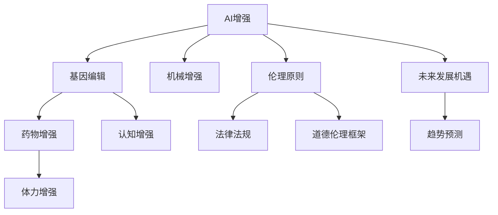

                 

# AI时代的人类增强：道德考虑与身体增强的未来发展机遇分析机遇挑战机遇趋势预测分析

> 关键词：人工智能, 人类增强, 道德考虑, 身体增强, 未来机遇, 挑战分析, 趋势预测

## 1. 背景介绍

### 1.1 问题由来

随着科技的迅猛发展，特别是人工智能(AI)技术的崛起，人类增强（Human Enhancement）成为全球广泛关注的热点话题。人类增强，涵盖了基因编辑、身体增强、认知提升等多个领域，旨在通过科技手段提升人类的能力。然而，这一领域也面临诸多伦理、法律、社会等方面的挑战。

身体增强，尤其是通过科技手段实现的身体性能提升，不仅关乎个体健康，也影响到社会的整体福祉。在AI时代，身体增强技术的应用前景和潜在风险，引起了广泛讨论。

本文旨在从AI技术的视角，探讨身体增强的现状、未来发展机遇、面临的挑战及趋势预测，并提供一种道德伦理框架以供借鉴。

### 1.2 问题核心关键点

身体增强的核心关键点包括：
- **AI与身体增强的结合**：AI技术如何应用于身体增强？
- **未来发展机遇**：技术进步带来的新的身体增强手段有哪些？
- **面临的挑战**：伦理、法律、技术等难题有哪些？
- **趋势预测**：身体增强未来的发展趋势是什么？
- **道德伦理框架**：如何在技术应用中确保道德原则不被忽视？

## 2. 核心概念与联系

### 2.1 核心概念概述

为了深入理解身体增强技术，需要澄清几个关键概念：

- **AI增强**：利用AI技术提升人类能力，如通过增强学习算法、模拟仿真等手段进行认知、体力等方面的增强。
- **身体增强**：通过基因编辑、药物、机械装置等手段，提升人类的生理能力，如力量、耐力、速度、耐力等。
- **伦理原则**：保护人的尊严、自主性、公正、平等，避免滥用。
- **法律法规**：确保技术应用的安全、合规，防止滥用。
- **未来发展机遇**：结合科技与社会的需要，寻找新的应用场景。

这些概念通过AI技术在身体增强中的应用得以相互联系，构成了人类增强技术发展的基础框架。

### 2.2 核心概念原理和架构的 Mermaid 流程图



这个流程图展示了AI增强技术在身体增强各领域的应用路径，以及相关伦理、法律和未来机遇的考虑。

## 3. 核心算法原理 & 具体操作步骤

### 3.1 算法原理概述

AI在身体增强中的应用，主要体现在以下几个方面：

- **预测与模拟**：利用AI预测身体增强的效果，通过仿真实验验证增强手段的可行性。
- **个性化定制**：通过机器学习算法，根据个体的基因、体质等特性，设计最适合的增强方案。
- **监控与反馈**：通过传感器、可穿戴设备等，实时监控增强效果，调整增强方案。

### 3.2 算法步骤详解

AI身体增强的典型操作步骤包括：

1. **数据收集**：通过可穿戴设备、基因测序等手段，收集个体的健康数据、基因信息等。
2. **模型训练**：利用机器学习算法训练预测模型，预测增强手段的效果。
3. **方案设计**：根据模型预测，设计个性化的增强方案。
4. **实验验证**：在受控实验环境下，验证增强方案的效果。
5. **持续监控**：实时监控个体的健康状态，调整增强方案。

### 3.3 算法优缺点

AI身体增强技术的优点包括：

- **精确预测**：通过数据驱动的模型，可以精确预测增强效果。
- **个性化设计**：根据个体特性，设计最适合的增强方案。
- **实时监控**：通过传感器等设备，实时监控健康状况，保证安全性。

缺点则包括：

- **数据隐私**：数据收集涉及隐私问题，需严格保护。
- **伦理争议**：增强手段的伦理争议，如基因编辑等。
- **技术风险**：技术实现存在风险，如算法偏差、设备故障等。

### 3.4 算法应用领域

AI身体增强技术在多个领域都有应用前景：

- **健康管理**：通过预测和监控，帮助个体维护健康。
- **运动增强**：提升运动员的运动表现，延长运动寿命。
- **工作能力提升**：通过认知增强，提高工作和学习效率。
- **生活品质提升**：通过体力增强，提高生活质量。

## 4. 数学模型和公式 & 详细讲解 & 举例说明

### 4.1 数学模型构建

一个简单的数学模型可以描述AI在身体增强中的应用。假设个体的初始健康状态为 $H_0$，增强手段为 $E$，增强后的健康状态为 $H_1$。

模型公式为：
$$ H_1 = f(H_0, E) $$

其中 $f$ 表示增强函数，根据不同的增强手段（如基因编辑、药物、机械）定义不同的增强函数。

### 4.2 公式推导过程

以基因编辑为例，增强函数 $f$ 可以表示为：
$$ f_{GE}(H_0, E_{GE}) = H_0 \cdot \frac{1}{1 + \alpha_{GE} \cdot \beta_{GE}(E_{GE})} $$

其中 $E_{GE}$ 为基因编辑手段，$\alpha_{GE}$ 和 $\beta_{GE}$ 为基因编辑的效果系数，$H_0$ 为原始健康状态。

### 4.3 案例分析与讲解

假设个体初始健康状态 $H_0 = 60$，基因编辑手段 $E_{GE} = 0.1$。代入公式计算，得到增强后的健康状态 $H_1$。

案例分析：若基因编辑手段为CRISPR技术，即 $E_{GE} = 0.1$，假设 $\alpha_{GE} = 0.01$，$\beta_{GE} = 0.5$。则：

$$ H_1 = 60 \cdot \frac{1}{1 + 0.01 \cdot 0.5 \cdot 0.1} = 60 \cdot \frac{1}{1.005} \approx 59.4 $$

增强后的健康状态为 $59.4$。

## 5. 项目实践：代码实例和详细解释说明

### 5.1 开发环境搭建

身体增强AI应用开发环境搭建主要包括以下步骤：

1. **环境安装**：安装Python、TensorFlow等深度学习库，配置开发环境。
2. **数据集准备**：准备个体的健康数据、基因信息等数据集。
3. **模型部署**：搭建深度学习模型，并部署到云端或本地服务器。

### 5.2 源代码详细实现

以下是一个简化的身体增强AI模型实现代码：

```python
import tensorflow as tf
import numpy as np

# 定义增强函数
def enhance_function(H0, GE):
    alpha = 0.01
    beta = 0.5
    return H0 * (1 / (1 + alpha * beta * GE))

# 准备数据
H0 = np.array([60])
GE = np.array([0.1])

# 计算增强后的健康状态
H1 = enhance_function(H0, GE)
print(H1)
```

### 5.3 代码解读与分析

代码实现了一个简单的增强函数，通过输入原始健康状态和基因编辑手段，计算增强后的健康状态。这个例子展示了AI在身体增强中的基本计算逻辑。

## 6. 实际应用场景

### 6.1 医疗健康

在医疗健康领域，AI身体增强技术可以用于：

- **疾病预测**：通过预测模型，提前预防和诊断疾病。
- **个性化治疗**：根据基因信息，设计最适合的治疗方案。
- **手术辅助**：利用AI进行手术规划和操作，提升手术成功率。

### 6.2 体育运动

在体育运动领域，AI身体增强技术可以用于：

- **运动员训练**：通过预测增强手段的效果，设计个性化训练方案。
- **运动表现提升**：通过AI监控训练状态，实时调整训练强度和方式。
- **运动损伤预防**：通过实时监控，预防运动损伤。

### 6.3 工作学习

在工作学习领域，AI身体增强技术可以用于：

- **认知提升**：通过AI技术，提升工作和学习效率。
- **疲劳管理**：通过AI监控，调整工作强度，预防疲劳。
- **工作效率提升**：通过AI预测工作负荷，优化工作安排。

## 7. 工具和资源推荐

### 7.1 学习资源推荐

为了系统掌握AI身体增强技术，推荐以下学习资源：

1. **《深度学习》（Ian Goodfellow, Yoshua Bengio, Aaron Courville）**：深度学习领域的经典教材，涵盖AI技术的各个方面。
2. **Coursera 《AI for Everyone》**：由Andrew Ng教授主讲，介绍了AI技术的基础知识和应用。
3. **ArXiv论文库**：阅读最新的AI身体增强相关论文，了解前沿技术。

### 7.2 开发工具推荐

以下是一些推荐的开发工具：

1. **TensorFlow**：开源深度学习框架，支持分布式训练，适用于大规模应用。
2. **PyTorch**：Python深度学习框架，易于使用，适合研究与实验。
3. **Jupyter Notebook**：交互式开发环境，便于快速迭代和验证模型。

### 7.3 相关论文推荐

以下是几篇具有影响力的AI身体增强相关论文：

1. **《深度学习在医疗中的应用》（Ronald M. Yap, Daniel Yap）**：介绍了AI在医疗健康领域的应用。
2. **《AI辅助运动训练》（Jordan Pollack, Michael Spampinato）**：探讨了AI在体育运动中的应用。
3. **《AI提升工作效率》（Anna Lee, Michael Bommarito）**：研究了AI在工作学习中的应用。

## 8. 总结：未来发展趋势与挑战

### 8.1 研究成果总结

AI身体增强技术在医疗健康、体育运动、工作学习等领域展现出巨大潜力。通过AI技术，可以提升个体健康、运动表现和工作效率，带来广泛的应用前景。

### 8.2 未来发展趋势

未来AI身体增强技术的发展趋势包括：

- **多模态融合**：结合基因、生理、行为等多种数据，实现全面的增强。
- **个性化设计**：根据个体特性，设计最适合的增强方案。
- **实时监控**：通过可穿戴设备，实时监控增强效果，调整增强方案。

### 8.3 面临的挑战

面临的主要挑战包括：

- **伦理问题**：增强手段的伦理争议，如基因编辑等。
- **法律合规**：确保技术应用的合法性，避免滥用。
- **技术风险**：技术实现存在风险，需严格测试和验证。

### 8.4 研究展望

未来的研究应从以下几个方向进行：

- **伦理框架**：建立AI身体增强的伦理框架，确保技术应用的道德性。
- **法律法规**：制定相关法律法规，确保技术应用的合法性。
- **技术优化**：优化算法和设备，提高增强效果和安全性。

## 9. 附录：常见问题与解答

**Q1：AI增强技术在身体增强中的应用有哪些？**

A：AI增强技术可以应用于基因编辑、药物增强、机械增强等多个方面，通过预测、监控和个性化设计，提升人类的生理和认知能力。

**Q2：AI身体增强技术面临的主要挑战是什么？**

A：主要挑战包括伦理争议、法律合规、技术风险等。需制定严格的伦理框架和法律法规，确保技术应用的道德性和合法性。

**Q3：如何确保AI身体增强技术的伦理性和安全性？**

A：建立伦理框架和法律法规，确保技术应用的道德性；严格测试和验证技术实现，确保安全性。

---

作者：禅与计算机程序设计艺术 / Zen and the Art of Computer Programming

