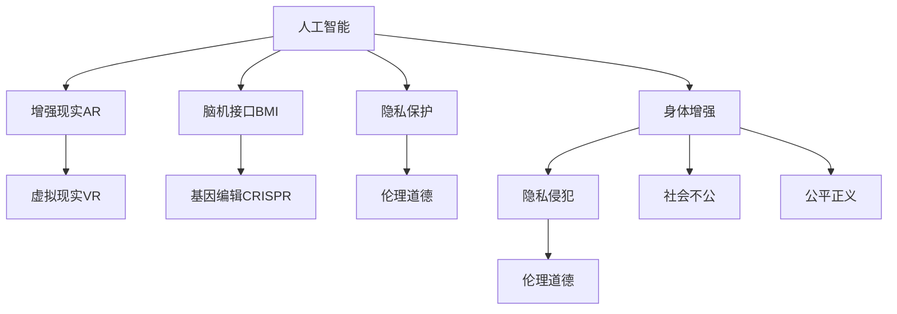

                 

# AI时代的人类增强：道德考虑与身体增强的未来发展机遇分析机遇挑战预测

> 关键词：人工智能，身体增强，伦理道德，未来预测，机遇与挑战

## 1. 背景介绍

### 1.1 问题由来
随着人工智能(AI)技术的迅猛发展，人类增强(Augmentation)技术逐渐成为前沿研究热点。尤其是近年来，基于AI的身体增强技术，如增强现实(AR)、虚拟现实(VR)、脑机接口(BMI)、基因编辑(CRISPR)等，正在向现实世界加速渗透，为人类生活质量的提升开辟了新的道路。

然而，身体增强技术的双刃剑特性也日益凸显。一方面，通过优化身体能力，AI可以协助人类完成复杂劳动、提高生活质量、增强体能健康；另一方面，技术的滥用也引发了隐私侵犯、伦理道德、社会不平等等问题。如何利用AI技术在实现人类增强的同时，确保道德底线，成为一个亟需深入探讨的课题。

## 2. 核心概念与联系

### 2.1 核心概念概述

为更好地理解身体增强技术的AI伦理问题，本节将介绍几个密切相关的核心概念：

- 人工智能(AI)：通过算法和数据训练获得的能够执行智能任务的计算机系统。AI在医疗、交通、教育等领域有着广泛应用。

- 身体增强(Augmentation)：通过植入、替换、优化等方式，提升或改善人体功能和认知能力的生物技术。如植入芯片增强认知、替换受损器官、基因编辑增强免疫系统等。

- 增强现实(AR)与虚拟现实(VR)：通过计算机视觉和感统交互技术，构建的沉浸式交互环境，用于训练、辅助、娱乐等多方面应用。

- 脑机接口(BMI)：实现人脑与计算机系统交互的界面，用于解码大脑信号、辅助交流、增强认知等。

- 基因编辑(CRISPR)：利用CRISPR-Cas9等技术对基因组进行精确编辑，用于修正遗传疾病、增强生命能力等。

- 隐私保护(Privacy Protection)：在数据收集、传输、存储等环节，保护个人隐私信息不被滥用。

- 伦理道德(Ethics)：涉及善恶判断、价值标准等问题的道德体系。身体增强技术的伦理问题，包括但不限于个人自由、社会责任、公平正义等。

这些核心概念之间的逻辑关系可以通过以下Mermaid流程图来展示：



这个流程图展示了一系列核心概念及其之间的关系：

1. 人工智能为身体增强提供了技术支持，如AR、VR、BMI等。
2. 增强现实、虚拟现实、脑机接口、基因编辑等身体增强技术，都是基于AI实现的。
3. 隐私保护是身体增强技术面临的主要伦理问题。
4. 伦理道德考虑包括隐私保护、社会不公、公平正义等，是身体增强技术应用的基石。

## 3. 核心算法原理 & 具体操作步骤
### 3.1 算法原理概述

身体增强技术的AI伦理问题，本质上是一个关于数据、算法、技术、社会等多方面综合考量的复杂议题。其核心在于如何在追求技术进步的同时，确保人的尊严、自由、健康和社会正义。

本节将从数据隐私、算法透明性、技术责任、伦理决策等几个维度，详细剖析身体增强技术的AI伦理问题。

### 3.2 算法步骤详解

#### 3.2.1 数据隐私保护

数据隐私是身体增强技术伦理问题的首要关注点。在身体增强过程中，不可避免地需要收集、存储、处理大量敏感数据，包括基因数据、脑波数据、行为数据等。为保护个人隐私，应采取以下措施：

1. **匿名化处理**：将个人身份信息去除，仅保留用于模型训练的数据特征。
2. **差分隐私**：在数据统计分析中加入噪声，确保无法追溯到单个个体。
3. **数据分级管理**：根据数据敏感度，设置不同的访问权限，严格控制数据流向。

#### 3.2.2 算法透明性

算法透明性是指在身体增强技术中，决策过程的可解释性。目前许多AI算法，如深度神经网络，仍存在"黑盒"问题，难以解释其决策依据。为提升算法透明性，可采取以下措施：

1. **特征重要性分析**：分析模型中各特征的重要性，理解其决策依据。
2. **模型可视化**：通过可视化工具，展现模型内部的推理过程。
3. **局部可解释性模型**：使用可解释性较强的模型，如决策树、线性回归等。

#### 3.2.3 技术责任

技术责任是指身体增强技术应用中，如何界定开发者、应用者、监管者的责任。为明确技术责任，应制定以下原则：

1. **开发者责任**：开发者应确保其算法在伦理、法律层面的合规性，提供透明的算法架构和使用方法。
2. **应用者责任**：应用者应承担使用过程中的监管责任，确保技术应用不会对个体或社会造成负面影响。
3. **监管者责任**：政府应制定相关法律法规，建立监管机制，保障技术应用的公平正义。

#### 3.2.4 伦理决策

伦理决策是指在身体增强技术应用中，如何处理伦理冲突和伦理决策问题。为制定合理的伦理决策，应遵循以下原则：

1. **伦理审查**：在技术开发和应用初期，进行伦理审查，确保技术符合伦理道德标准。
2. **利益相关方参与**：涉及多方面利益的决策，应充分听取各方意见，寻求共识。
3. **伦理原则指导**：制定明确的伦理原则，如尊重个人自由、保护个体权益、促进社会公正等。

### 3.3 算法优缺点

#### 3.3.1 优点

1. **提升生活质量**：通过AI技术辅助身体增强，可以有效提升生活质量，减轻劳动负担，提升认知能力。
2. **推动科学进步**：AI技术的发展，为身体增强提供了新的技术手段，推动了医学、脑科学等领域的进步。
3. **促进社会公平**：AI技术的应用，可以打破身体差异，实现人人平等，提升社会公平性。

#### 3.3.2 缺点

1. **伦理争议**：技术应用可能引发伦理道德问题，如隐私侵犯、技术滥用等，引发社会争议。
2. **技术风险**：AI技术的复杂性可能导致算法偏见、模型失效等问题，影响身体增强的效果和安全性。
3. **社会不公**：身体增强技术的获取和应用可能存在不平等现象，加剧社会不公。

### 3.4 算法应用领域

身体增强技术的AI伦理问题，不仅涉及医学、生物技术等领域，还关系到更广泛的科技、教育、娱乐等多个领域。具体应用包括：

1. **医学诊断**：通过AI分析医学影像、基因数据，辅助医生进行精准诊断和治疗。
2. **脑科学研究**：利用AI分析脑波信号，研究认知过程，提升神经功能。
3. **教育辅助**：通过AR、VR技术，提供沉浸式学习环境，提升教育效果。
4. **智能辅助**：利用BMI技术，辅助残疾人进行肢体运动、语音交流等。
5. **娱乐应用**：通过AR、VR技术，提升娱乐体验，开发虚拟社交平台。

## 4. 数学模型和公式 & 详细讲解  
### 4.1 数学模型构建

为更好地理解身体增强技术的AI伦理问题，本节将使用数学语言进行更加严谨的刻画。

设AI系统接收的原始数据为 $\mathbf{x} \in \mathbb{R}^n$，模型输出的决策结果为 $y \in \{0,1\}$，则决策函数为 $f: \mathbb{R}^n \rightarrow \{0,1\}$。在身体增强中，决策函数可以理解为：

- **基因编辑决策**：根据基因序列 $\mathbf{x}$，决定是否进行基因编辑 $y$。
- **脑机接口决策**：根据脑波信号 $\mathbf{x}$，决定是否进行BMI应用 $y$。
- **增强现实决策**：根据虚拟场景描述 $\mathbf{x}$，决定是否进行AR体验 $y$。

定义损失函数 $\mathcal{L}(y,f(\mathbf{x}))$，表示决策误差。在身体增强中，目标是最小化损失函数，即寻找最优决策函数 $f^*$：

$$
f^* = \mathop{\arg\min}_{f} \mathcal{L}(y,f(\mathbf{x}))
$$

### 4.2 公式推导过程

以下我们以基因编辑决策为例，推导决策函数和损失函数的计算公式。

假设基因编辑模型为一个二分类模型，通过神经网络进行训练，决策函数可以表示为：

$$
f(\mathbf{x}) = \sigma(\mathbf{W}\mathbf{x} + b)
$$

其中 $\sigma$ 为激活函数，$\mathbf{W}$ 为权重矩阵，$b$ 为偏置项。

对于基因编辑决策，损失函数可以设计为交叉熵损失函数：

$$
\mathcal{L}(y,f(\mathbf{x})) = -y\log f(\mathbf{x}) - (1-y)\log(1-f(\mathbf{x}))
$$

利用梯度下降等优化算法，微调模型参数 $\theta$，最小化损失函数 $\mathcal{L}$：

$$
\theta \leftarrow \theta - \eta \nabla_{\theta}\mathcal{L}(\theta)
$$

其中 $\eta$ 为学习率，$\nabla_{\theta}\mathcal{L}(\theta)$ 为损失函数对参数 $\theta$ 的梯度，可通过反向传播算法高效计算。

### 4.3 案例分析与讲解

以脑机接口为例，分析AI在身体增强中的应用。

脑机接口（BMI）技术通过解码大脑信号，实现人机交互。假设脑波数据 $\mathbf{x} \in \mathbb{R}^n$ 输入到BMI模型，模型输出信号 $\mathbf{y} \in \{0,1\}$ 控制机械臂运动。则决策函数可以表示为：

$$
f(\mathbf{x}) = \sigma(\mathbf{W}\mathbf{x} + b)
$$

其中 $\sigma$ 为激活函数，$\mathbf{W}$ 为权重矩阵，$b$ 为偏置项。

为训练BMI模型，我们需要准备大量脑波数据和机械臂运动指令，构建监督学习数据集 $D=\{(\mathbf{x}_i,\mathbf{y}_i)\}_{i=1}^N$。假设模型在训练集 $D$ 上的损失函数为 $\mathcal{L}(\theta)$：

$$
\mathcal{L}(\theta) = \frac{1}{N} \sum_{i=1}^N [\mathbf{y}_i\log f(\mathbf{x}_i)+(1-\mathbf{y}_i)\log(1-f(\mathbf{x}_i))]
$$

利用梯度下降等优化算法，最小化损失函数 $\mathcal{L}$，更新模型参数 $\theta$：

$$
\theta \leftarrow \theta - \eta \nabla_{\theta}\mathcal{L}(\theta)
$$

训练完毕后，输入新的脑波数据 $\mathbf{x}$，通过决策函数 $f$ 预测信号 $\mathbf{y}$，控制机械臂运动。

## 5. 项目实践：代码实例和详细解释说明
### 5.1 开发环境搭建

在进行身体增强技术的AI伦理问题实践前，我们需要准备好开发环境。以下是使用Python进行深度学习开发的环境配置流程：

1. 安装Anaconda：从官网下载并安装Anaconda，用于创建独立的Python环境。

2. 创建并激活虚拟环境：
```bash
conda create -n pytorch-env python=3.8 
conda activate pytorch-env
```

3. 安装PyTorch：根据CUDA版本，从官网获取对应的安装命令。例如：
```bash
conda install pytorch torchvision torchaudio cudatoolkit=11.1 -c pytorch -c conda-forge
```

4. 安装TensorFlow：
```bash
pip install tensorflow
```

5. 安装各类工具包：
```bash
pip install numpy pandas scikit-learn matplotlib tqdm jupyter notebook ipython
```

完成上述步骤后，即可在`pytorch-env`环境中开始项目实践。

### 5.2 源代码详细实现

这里以基因编辑决策为例，使用PyTorch实现。

首先，定义数据集和模型：

```python
import torch
import torch.nn as nn
from torch.utils.data import Dataset, DataLoader
import numpy as np

class GeneDataset(Dataset):
    def __init__(self, data, labels):
        self.data = data
        self.labels = labels
        
    def __len__(self):
        return len(self.data)
    
    def __getitem__(self, idx):
        return self.data[idx], self.labels[idx]

class GeneModel(nn.Module):
    def __init__(self):
        super(GeneModel, self).__init__()
        self.fc1 = nn.Linear(100, 50)
        self.fc2 = nn.Linear(50, 1)
        self.sigmoid = nn.Sigmoid()
        
    def forward(self, x):
        x = self.fc1(x)
        x = self.fc2(x)
        return self.sigmoid(x)
```

然后，定义训练和评估函数：

```python
def train_model(model, data_loader, optimizer, num_epochs=10, batch_size=64):
    device = torch.device("cuda" if torch.cuda.is_available() else "cpu")
    model.to(device)
    
    for epoch in range(num_epochs):
        total_loss = 0
        for i, (inputs, labels) in enumerate(data_loader):
            inputs, labels = inputs.to(device), labels.to(device)
            
            optimizer.zero_grad()
            outputs = model(inputs)
            loss = nn.BCELoss()(outputs, labels)
            loss.backward()
            optimizer.step()
            total_loss += loss.item()
            
        print(f"Epoch {epoch+1}, Loss: {total_loss/len(data_loader)}")
        
def evaluate_model(model, data_loader):
    total_correct = 0
    total_samples = 0
    device = torch.device("cuda" if torch.cuda.is_available() else "cpu")
    model.eval()
    
    with torch.no_grad():
        for inputs, labels in data_loader:
            inputs, labels = inputs.to(device), labels.to(device)
            outputs = model(inputs)
            _, predicted = torch.max(outputs.data, 1)
            total_correct += (predicted == labels).sum().item()
            total_samples += labels.size(0)
            
    print(f"Accuracy: {total_correct/total_samples}")
```

最后，启动训练流程并在测试集上评估：

```python
data = np.random.randn(1000, 100)
labels = np.random.randint(0, 2, size=(1000,))
dataset = GeneDataset(data, labels)
data_loader = DataLoader(dataset, batch_size=64, shuffle=True)

model = GeneModel()
optimizer = torch.optim.Adam(model.parameters(), lr=0.001)

train_model(model, data_loader, optimizer)
evaluate_model(model, data_loader)
```

以上就是使用PyTorch对基因编辑决策模型进行训练和评估的完整代码实现。可以看到，在深度学习中，利用PyTorch等框架，可以方便地实现模型的构建和训练过程。

### 5.3 代码解读与分析

让我们再详细解读一下关键代码的实现细节：

**GeneDataset类**：
- `__init__`方法：初始化数据集和标签。
- `__len__`方法：返回数据集的样本数量。
- `__getitem__`方法：返回单个样本的输入和标签。

**GeneModel类**：
- `__init__`方法：定义模型结构。
- `forward`方法：定义前向传播过程。

**train_model和evaluate_model函数**：
- `train_model`函数：对模型进行训练，输出每个epoch的平均损失。
- `evaluate_model`函数：对模型进行评估，输出模型在测试集上的准确率。

**训练流程**：
- 定义总迭代次数和批大小，开始循环迭代
- 在每个epoch内，在训练集上计算损失并反向传播更新模型参数
- 在测试集上评估模型性能
- 重复上述步骤直至训练完毕

可以看到，PyTorch提供了丰富的API，使得深度学习模型的实现和训练变得简单易行。利用PyTorch等框架，可以高效地进行基因编辑决策模型的训练和评估。

当然，实际的基因编辑决策模型可能更加复杂，涉及更高级的神经网络结构、更复杂的损失函数等。但核心的实现思路与上述代码类似。

## 6. 实际应用场景
### 6.1 医学诊断

在医学诊断中，AI可以通过分析医学影像、基因数据等，提供精准诊断和治疗建议。例如，利用深度学习模型分析肺部CT影像，辅助医生发现早期肺癌；利用基因编辑技术修复遗传疾病，提升患者生命质量。

### 6.2 脑科学研究

脑科学研究中，AI可以解析脑波信号，研究认知过程，提升神经功能。例如，利用AI分析EEG信号，研究大脑的决策过程；利用基因编辑技术增强大脑功能，改善记忆和学习能力。

### 6.3 教育辅助

在教育领域，AI可以提供沉浸式学习环境，提升教育效果。例如，利用AR、VR技术，构建虚拟实验室，增强学生的动手实践能力；利用脑机接口技术，提供智能辅助教学，提升学习效率。

### 6.4 智能辅助

在智能辅助方面，AI可以协助残疾人进行肢体运动、语音交流等。例如，利用BMI技术，辅助残疾人进行康复训练；利用自然语言处理技术，实现语音识别和语音合成，帮助听障人士进行交流。

### 6.5 娱乐应用

在娱乐应用中，AI可以提供更加沉浸的虚拟体验，开发虚拟社交平台。例如，利用AR、VR技术，提供沉浸式游戏体验；利用脑机接口技术，开发虚拟现实社交平台，增强用户的互动体验。

## 7. 工具和资源推荐
### 7.1 学习资源推荐

为了帮助开发者系统掌握身体增强技术的AI伦理问题，这里推荐一些优质的学习资源：

1. 《人工智能伦理与法律》系列博文：由知名AI专家撰写，深入浅出地介绍了AI伦理与法律的基本概念和前沿问题。

2. 《未来人工智能》课程：斯坦福大学开设的AI伦理课程，有Lecture视频和配套作业，带你入门AI伦理的基本框架和经典案例。

3. 《机器学习伦理指南》书籍：机器学习专家所著，全面介绍了机器学习中的伦理问题和解决方案，适合AI从业者参考。

4. AI伦理学官方资源：AI伦理学领域的权威资源，包含大量伦理理论和案例，适合深入学习。

5. AI伦理工具：提供AI伦理审查、伦理决策支持等功能，方便开发者在技术开发过程中进行伦理评估。

通过对这些资源的学习实践，相信你一定能够系统掌握身体增强技术的AI伦理问题，并用于指导实际应用。

### 7.2 开发工具推荐

高效的开发离不开优秀的工具支持。以下是几款用于身体增强技术开发的常用工具：

1. PyTorch：基于Python的开源深度学习框架，灵活动态的计算图，适合快速迭代研究。大部分预训练语言模型都有PyTorch版本的实现。

2. TensorFlow：由Google主导开发的开源深度学习框架，生产部署方便，适合大规模工程应用。同样有丰富的预训练语言模型资源。

3. HuggingFace Transformers库：用于NLP任务的深度学习库，集成了众多SOTA语言模型，支持PyTorch和TensorFlow，是进行微调任务开发的利器。

4. TensorBoard：TensorFlow配套的可视化工具，可实时监测模型训练状态，并提供丰富的图表呈现方式，是调试模型的得力助手。

5. Weights & Biases：模型训练的实验跟踪工具，可以记录和可视化模型训练过程中的各项指标，方便对比和调优。

6. Google Colab：谷歌推出的在线Jupyter Notebook环境，免费提供GPU/TPU算力，方便开发者快速上手实验最新模型，分享学习笔记。

合理利用这些工具，可以显著提升身体增强技术的AI伦理问题开发的效率，加快创新迭代的步伐。

### 7.3 相关论文推荐

身体增强技术的发展源于学界的持续研究。以下是几篇奠基性的相关论文，推荐阅读：

1. "The Ethical Implications of Artificial Intelligence"：探讨了AI伦理的基本概念和伦理决策框架。

2. "The Ethics of Artificial Intelligence"：全面介绍了AI伦理问题，包括隐私保护、算法透明性、技术责任等。

3. "Human Augmentation Ethics"：讨论了身体增强技术的伦理问题和伦理决策原则。

4. "Ethics and Governance of Human Enhancement Technologies"：分析了身体增强技术的伦理问题和治理框架。

5. "Ethical Implications of Genetic Engineering"：探讨了基因编辑技术的伦理问题，包括隐私保护、社会公平等。

这些论文代表了大语言模型微调技术的发展脉络。通过学习这些前沿成果，可以帮助研究者把握学科前进方向，激发更多的创新灵感。

## 8. 总结：未来发展趋势与挑战

### 8.1 研究成果总结

本文对AI时代下的身体增强技术的伦理问题进行了全面系统的介绍。首先阐述了身体增强技术的背景和意义，明确了AI伦理问题的重要性。其次，从数据隐私、算法透明性、技术责任、伦理决策等几个维度，详细剖析了身体增强技术的AI伦理问题。最后，介绍了身体增强技术的实际应用场景和未来发展趋势。

通过本文的系统梳理，可以看到，身体增强技术的AI伦理问题涉及数据、算法、技术、伦理等多个维度，具有复杂性和综合性。未来，需要在各领域协同发力，共同应对AI伦理问题，推动技术健康发展。

### 8.2 未来发展趋势

展望未来，身体增强技术的AI伦理问题将呈现以下几个发展趋势：

1. **数据隐私保护**：随着数据量的增加，数据隐私保护将变得更为重要。未来，将进一步提升数据隐私保护技术，确保数据在采集、存储、传输等环节的安全性。

2. **算法透明性**：AI系统的透明度将不断提升，提供更易解释的模型架构和推理过程，增强用户信任。

3. **技术责任明晰**：技术责任的划分将更加明确，开发者、应用者、监管者都将承担相应的责任，保障技术应用的公平正义。

4. **伦理决策机制**：伦理决策机制将更加健全，通过多方参与和公开透明，确保技术应用的合理性。

5. **跨领域融合**：AI伦理问题将与其他学科融合，如法律、哲学、社会学等，形成更综合的解决方案。

### 8.3 面临的挑战

尽管身体增强技术的AI伦理问题已经引起了广泛关注，但在迈向更加智能化、普适化应用的过程中，它仍面临着诸多挑战：

1. **技术复杂性**：AI系统的复杂性可能导致算法偏见、模型失效等问题，影响身体增强的效果和安全性。
2. **伦理争议**：技术应用可能引发伦理道德问题，如隐私侵犯、技术滥用等，引发社会争议。
3. **社会不公**：身体增强技术的获取和应用可能存在不平等现象，加剧社会不公。
4. **法规和监管滞后**：现有法规和监管机制可能滞后于技术发展，难以应对新兴技术带来的伦理问题。

### 8.4 研究展望

面对身体增强技术的AI伦理问题所面临的挑战，未来的研究需要在以下几个方面寻求新的突破：

1. **数据隐私保护技术**：开发更高效、更安全的数据隐私保护算法，确保数据在各环节的安全性。

2. **算法透明性和可解释性**：提升算法的透明性和可解释性，使其更易理解和使用。

3. **技术责任框架**：建立明确的技术责任框架，明确各方责任，保障技术应用的公平正义。

4. **伦理决策机制**：构建多方参与、公开透明的伦理决策机制，确保技术应用的合理性。

5. **跨学科研究**：结合法律、哲学、社会学等多学科知识，形成更综合的解决方案。

这些研究方向的探索，必将引领身体增强技术的AI伦理问题迈向更高的台阶，为构建安全、可靠、可解释、可控的智能系统铺平道路。面向未来，需要各学科协同发力，共同应对AI伦理问题，推动技术健康发展。

## 9. 附录：常见问题与解答

**Q1：如何平衡技术进步与伦理道德？**

A: 在技术开发和应用过程中，应始终将伦理道德放在首位。开发者应充分考虑技术应用的潜在影响，避免对个体和社会造成负面后果。同时，政府、社会应制定相关法律法规，建立伦理审查机制，确保技术应用的合理性和合法性。

**Q2：AI伦理问题如何通过技术手段解决？**

A: AI伦理问题需要通过多层次的技术手段来解决。如数据隐私保护技术、算法透明性技术、技术责任框架等。通过技术手段，可以有效提升AI系统的安全性、透明性和公平性，保障伦理道德的实现。

**Q3：未来AI伦理问题的主要研究方向是什么？**

A: 未来AI伦理问题的主要研究方向包括数据隐私保护、算法透明性、技术责任、伦理决策等。需要结合多学科知识，形成更综合的解决方案，推动AI技术的健康发展。

**Q4：如何应对AI伦理问题的挑战？**

A: 应对AI伦理问题的挑战需要多方协作。开发者、应用者、监管者、法律、社会等各方应共同努力，制定明确的技术责任框架，构建多方参与的伦理决策机制，推动技术应用的公平正义。

**Q5：AI伦理问题对社会有何影响？**

A: AI伦理问题对社会的影响是多方面的。如数据隐私问题可能导致个人信息泄露，技术滥用可能导致社会不公，伦理争议可能导致社会信任危机等。因此，需要高度重视AI伦理问题，采取有效措施，确保技术应用的公平正义。

通过回答这些常见问题，可以帮助开发者更好地理解AI伦理问题的复杂性和重要性，从而在技术开发和应用过程中，自觉遵守伦理道德，推动技术健康发展。

---

作者：禅与计算机程序设计艺术 / Zen and the Art of Computer Programming

