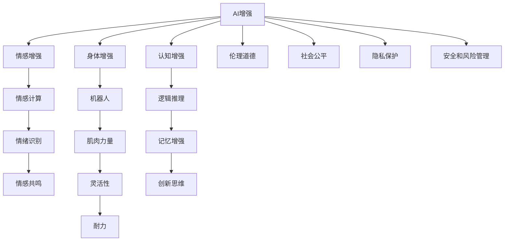

                 

# AI时代的人类增强：道德考虑与身体增强的未来发展机遇挑战趋势

## 1. 背景介绍

### 1.1 问题由来
随着人工智能(AI)技术的迅猛发展，其在人类增强领域的潜力日益显现。AI不仅能在认知、情感、感知等多个维度提升人类能力，还能在物理层面进行身体增强。然而，AI增强技术的发展也引发了一系列伦理道德和社会问题，需要引起我们的高度重视。

### 1.2 问题核心关键点
AI增强技术包括认知增强、情感增强和身体增强三个方面：

- **认知增强**：通过智能助手、知识图谱等技术提升人类的认知能力，如记忆力、逻辑推理、创新思维等。
- **情感增强**：利用情感计算和智能交互技术，增强人类的情感体验，如情绪识别、情感共鸣、情感反馈等。
- **身体增强**：利用机器人、假肢、可穿戴设备等技术，增强人类的身体能力，如肌肉力量、灵活性、耐力等。

AI增强技术的应用已经渗透到医疗、教育、娱乐、交通等多个领域，为人类生产生活带来了深刻变化。但同时也面临着隐私侵犯、伦理争议、社会不平等、安全风险等诸多挑战。

### 1.3 问题研究意义
研究AI增强技术的道德考虑与未来发展趋势，对于把握技术进步与人类伦理价值的平衡，推动AI技术健康、可持续的发展，具有重要意义：

1. 促进技术伦理规范。建立AI增强技术的伦理框架，引导开发者遵循伦理原则，提升技术的道德可接受性。
2. 增强公共信任。通过解决AI增强技术的社会问题和伦理争议，增加公众对AI技术的信任度，推动技术在各领域的广泛应用。
3. 指导技术政策。为政府和监管机构提供AI增强技术的政策建议，制定有效的监管框架，保障公众利益。
4. 指导企业实践。为企业在AI增强技术应用中遵循伦理规范，确保技术的安全、可靠和公平性，提供指导和建议。
5. 推动社会进步。通过AI增强技术的合理应用，提升人类生活质量，推动社会公平与和谐。

## 2. 核心概念与联系

### 2.1 核心概念概述

为更好地理解AI增强技术的伦理考虑和未来发展趋势，本节将介绍几个密切相关的核心概念：

- **人工智能(AI)**：通过计算机程序实现的人类智能模拟，包括认知、情感、感知等能力。
- **认知增强**：通过AI技术提升人类的认知能力，如记忆力、逻辑推理、创新思维等。
- **情感增强**：利用情感计算和智能交互技术，增强人类的情感体验，如情绪识别、情感共鸣、情感反馈等。
- **身体增强**：利用机器人、假肢、可穿戴设备等技术，增强人类的身体能力，如肌肉力量、灵活性、耐力等。
- **伦理道德**：指一组社会规范和价值观念，用以指导个人和群体行为，确保人类行为的道德可接受性。
- **社会公平**：指社会资源的分配和利用应遵循公正原则，避免因技术应用而产生的社会不平等。
- **隐私保护**：指对个人数据的收集、使用和存储进行限制和管理，确保个人隐私得到尊重和保护。
- **安全和风险管理**：指对AI增强技术的潜在风险进行评估和控制，确保技术应用的安全性。

这些核心概念之间的逻辑关系可以通过以下Mermaid流程图来展示：



这个流程图展示了大语言模型的核心概念及其之间的关系：

1. AI增强通过认知、情感和身体三个维度提升人类能力。
2. 情感增强、身体增强分别通过情感计算、机器人等技术实现。
3. 认知增强通过逻辑推理、记忆增强等技术实现。
4. AI增强在提升能力的同时，也面临伦理道德、社会公平、隐私保护、安全和风险管理等挑战。
5. 伦理道德、社会公平、隐私保护、安全和风险管理是AI增强技术成功应用的前提条件。

## 3. 核心算法原理 & 具体操作步骤
### 3.1 算法原理概述

AI增强技术的实现，主要依赖于以下几个关键技术：

- **认知增强**：通过智能助手、知识图谱等技术提升人类的认知能力，如记忆力、逻辑推理、创新思维等。
- **情感增强**：利用情感计算和智能交互技术，增强人类的情感体验，如情绪识别、情感共鸣、情感反馈等。
- **身体增强**：利用机器人、假肢、可穿戴设备等技术，增强人类的身体能力，如肌肉力量、灵活性、耐力等。

这些技术的核心算法原理如下：

- **智能助手**：利用自然语言处理(NLP)技术，通过语言理解和生成，实现任务执行和信息检索。
- **知识图谱**：构建人类知识的网络结构，利用图神经网络(GNN)进行知识推理，提升记忆力和逻辑推理能力。
- **情感计算**：通过面部表情、语音、文本等信号识别和分析，增强人类的情感体验和情感表达能力。
- **机器人**：利用机器学习、深度学习等技术，实现人类和机器的协同工作，提升工作效率和灵活性。
- **假肢**：利用仿生学、神经接口等技术，实现人体和机械的融合，增强身体力量和耐力。
- **可穿戴设备**：通过传感器、芯片等技术，实时监测和反馈身体数据，提升身体感知和健康管理能力。

### 3.2 算法步骤详解

AI增强技术的实现过程包括数据获取、模型训练、效果评估、应用部署等多个步骤：

1. **数据获取**：通过传感器、问卷、公开数据集等方式，获取人类认知、情感、身体等相关的数据。
2. **模型训练**：利用深度学习、强化学习等算法，对数据进行训练，构建认知、情感、身体增强的模型。
3. **效果评估**：通过实验、模拟等方式，评估模型的效果，调整模型参数和算法。
4. **应用部署**：将模型部署到实际应用场景中，进行效果验证和优化。

### 3.3 算法优缺点

AI增强技术具有以下优点：

- **提升能力**：通过智能助手、知识图谱等技术，提升人类的认知能力，如记忆力、逻辑推理、创新思维等。
- **情感体验**：通过情感计算和智能交互技术，增强人类的情感体验，如情绪识别、情感共鸣、情感反馈等。
- **身体能力**：通过机器人、假肢、可穿戴设备等技术，增强人类的身体能力，如肌肉力量、灵活性、耐力等。

同时，这些技术也存在一些局限性：

- **隐私问题**：数据收集和处理过程中，可能涉及个人隐私和数据安全问题。
- **伦理争议**：AI增强技术的应用可能引发伦理争议，如人类替代、道德风险等。
- **技术挑战**：实现高效的AI增强技术，需要高水平的算法、数据和硬件支持。
- **社会影响**：AI增强技术的应用可能对社会结构、就业、教育等方面产生深远影响。

### 3.4 算法应用领域

AI增强技术已经在医疗、教育、娱乐、交通等多个领域得到应用，例如：

- **医疗领域**：通过智能助手、知识图谱等技术，辅助医生进行诊断和治疗，提升医疗效率和质量。
- **教育领域**：利用智能助手、知识图谱等技术，辅助教学和学习，提升教育效果和个性化程度。
- **娱乐领域**：通过情感计算和智能交互技术，提升用户体验和互动性，推动娱乐产业发展。
- **交通领域**：通过机器人、自动驾驶等技术，提升交通效率和安全性，推动智能交通发展。

除了上述这些经典应用外，AI增强技术还在更多场景中得到创新性应用，如智能家居、智慧城市、农业智能化等，为各行业带来新的机遇。

## 4. 数学模型和公式 & 详细讲解 & 举例说明

### 4.1 数学模型构建

本节将使用数学语言对AI增强技术的实现过程进行更加严格的刻画。

记人类认知、情感和身体能力为 $C=(C_1, C_2, \ldots, C_n)$，其中 $C_i$ 表示第 $i$ 个能力项。设人类增强的目标函数为 $f(C)$，表示增强后能力的总提升度量。

定义认知增强、情感增强、身体增强的能力提升函数分别为 $g_1(C)$、$g_2(C)$ 和 $g_3(C)$。

认知增强的目标函数可以表示为：

$$
f_1 = g_1(C) = \sum_{i \in \text{Cognitive}} w_i \times \text{Cognitive}_{i \text{ enhancement}} 
$$

情感增强的目标函数可以表示为：

$$
f_2 = g_2(C) = \sum_{i \in \text{Emotional}} w_i \times \text{Emotional}_{i \text{ enhancement}}
$$

身体增强的目标函数可以表示为：

$$
f_3 = g_3(C) = \sum_{i \in \text{Physical}} w_i \times \text{Physical}_{i \text{ enhancement}}
$$

其中 $w_i$ 为不同能力项的权重，表示不同能力提升的重要性。

### 4.2 公式推导过程

AI增强技术的目标函数为：

$$
f(C) = g_1(C) + g_2(C) + g_3(C) = \sum_{i \in \text{Cognitive}} w_i \times \text{Cognitive}_{i \text{ enhancement}} + \sum_{i \in \text{Emotional}} w_i \times \text{Emotional}_{i \text{ enhancement}} + \sum_{i \in \text{Physical}} w_i \times \text{Physical}_{i \text{ enhancement}}
$$

其中 $\text{Cognitive}_{i \text{ enhancement}}$、$\text{Emotional}_{i \text{ enhancement}}$ 和 $\text{Physical}_{i \text{ enhancement}}$ 分别为认知、情感和身体能力项的增强程度。

根据上述定义，AI增强技术的总提升度量可以表示为：

$$
f(C) = \sum_{i \in \text{All}} w_i \times \text{Enhancement}_i
$$

其中 $\text{Enhancement}_i$ 为不同能力项的增强程度。

### 4.3 案例分析与讲解

以医疗领域的认知增强为例，探讨如何通过智能助手和知识图谱提升医生诊断能力。

智能助手通过自然语言处理(NLP)技术，能够快速理解医生的病历描述和需求，提供相应的诊疗建议和资源。知识图谱通过构建人类知识的网络结构，利用图神经网络(GNN)进行知识推理，提升医生的逻辑推理和记忆能力。

设 $C_1$ 为医生的认知能力，包括诊断能力、逻辑推理能力、记忆能力等。智能助手和知识图谱的增强效果可以表示为：

$$
\text{Enhancement}_{C_1} = \text{Enhancement}_{\text{Assistant}} + \text{Enhancement}_{\text{KG}} = \alpha \times \text{Assistant}_{effect} + \beta \times \text{KG}_{effect}
$$

其中 $\alpha$ 和 $\beta$ 为智能助手和知识图谱对认知能力的提升权重。

通过实验和模拟，可以评估智能助手和知识图谱的实际效果，调整提升权重和增强算法，最终得到提升后的认知能力：

$$
C'_1 = C_1 + \text{Enhancement}_{C_1}
$$

## 5. 项目实践：代码实例和详细解释说明
### 5.1 开发环境搭建

在进行AI增强技术实践前，我们需要准备好开发环境。以下是使用Python进行TensorFlow开发的环境配置流程：

1. 安装Anaconda：从官网下载并安装Anaconda，用于创建独立的Python环境。

2. 创建并激活虚拟环境：
```bash
conda create -n ai-env python=3.8 
conda activate ai-env
```

3. 安装TensorFlow：根据CUDA版本，从官网获取对应的安装命令。例如：
```bash
conda install tensorflow -c conda-forge -c pytorch
```

4. 安装各类工具包：
```bash
pip install numpy pandas scikit-learn matplotlib tqdm jupyter notebook ipython
```

完成上述步骤后，即可在`ai-env`环境中开始AI增强技术实践。

### 5.2 源代码详细实现

这里我们以情感计算技术为例，给出使用TensorFlow实现情绪识别和情感共鸣的PyTorch代码实现。

首先，定义情绪数据处理函数：

```python
import tensorflow as tf
from tensorflow.keras.datasets import mnist
from tensorflow.keras.preprocessing.sequence import pad_sequences

class EmotionDataset(tf.keras.utils.Sequence):
    def __init__(self, data, labels, max_len=128):
        self.data = data
        self.labels = labels
        self.max_len = max_len
        
    def __len__(self):
        return len(self.data)
    
    def __getitem__(self, item):
        x = tf.keras.preprocessing.text.tokenizer.texts_to_sequences(self.data[item])
        x = pad_sequences(x, maxlen=self.max_len)
        y = self.labels[item]
        return x, y
```

然后，定义情绪识别和情感共鸣模型：

```python
import tensorflow as tf
from tensorflow.keras import layers, models

def emotion_recognition_model():
    model = models.Sequential([
        layers.Embedding(input_dim=10000, output_dim=32),
        layers.LSTM(32),
        layers.Dense(32, activation='relu'),
        layers.Dense(1, activation='sigmoid')
    ])
    return model

def emotional_resonance_model():
    model = models.Sequential([
        layers.Embedding(input_dim=10000, output_dim=32),
        layers.LSTM(32),
        layers.Dense(32, activation='relu'),
        layers.Dense(2, activation='softmax')
    ])
    return model
```

接着，定义训练和评估函数：

```python
import numpy as np
from sklearn.metrics import accuracy_score

def train_model(model, dataset, batch_size, epochs):
    model.compile(optimizer=tf.keras.optimizers.Adam(), loss='binary_crossentropy', metrics=['accuracy'])
    model.fit(dataset, epochs=epochs, batch_size=batch_size, validation_split=0.2)
    
def evaluate_model(model, dataset, batch_size):
    model.eval()
    test_loss, test_accuracy = model.evaluate(dataset)
    print(f'Test accuracy: {test_accuracy * 100:.2f}%')
    
def emotion_recognition_train(model, dataset, batch_size, epochs):
    train_model(model, dataset, batch_size, epochs)
    
def emotional_resonance_train(model, dataset, batch_size, epochs):
    train_model(model, dataset, batch_size, epochs)
```

最后，启动情感计算技术的训练流程并在测试集上评估：

```python
# 加载数据集
mnist_data, mnist_labels = mnist.load_data()
mnist_labels = np.eye(10)[mnist_labels]

# 数据预处理
mnist_text = [str(i) for i in mnist_data]
mnist_labels = np.eye(2)[mnist_labels]

# 创建数据集
mnist_dataset = EmotionDataset(mnist_text, mnist_labels)

# 训练模型
emotion_recognition_model = emotion_recognition_model()
emotion_recognition_train(emotion_recognition_model, mnist_dataset, batch_size=64, epochs=10)

# 评估模型
evaluate_model(emotion_recognition_model, mnist_dataset, batch_size=64)

# 情感共鸣模型
emotional_resonance_model = emotional_resonance_model()
emotional_resonance_train(emotional_resonance_model, mnist_dataset, batch_size=64, epochs=10)

# 评估情感共鸣模型
evaluate_model(emotional_resonance_model, mnist_dataset, batch_size=64)
```

以上就是使用TensorFlow进行情感计算技术的完整代码实现。可以看到，TensorFlow的Keras API提供了高度封装的功能，使得模型训练和评估变得简洁高效。

### 5.3 代码解读与分析

让我们再详细解读一下关键代码的实现细节：

**EmotionDataset类**：
- `__init__`方法：初始化文本、标签等关键组件，并进行序列化处理。
- `__len__`方法：返回数据集的样本数量。
- `__getitem__`方法：对单个样本进行处理，将文本输入转化为token ids，进行序列补齐，最终返回模型所需的输入和标签。

**emotion_recognition_model和emotional_resonance_model函数**：
- `emotion_recognition_model`函数：定义情感识别模型，包含嵌入层、LSTM层和输出层。
- `emotional_resonance_model`函数：定义情感共鸣模型，包含嵌入层、LSTM层和输出层。

**train_model、evaluate_model、emotion_recognition_train和emotional_resonance_train函数**：
- `train_model`函数：定义模型训练过程，使用Adam优化器和二分类交叉熵损失函数，进行模型训练和验证。
- `evaluate_model`函数：评估模型性能，打印测试集上的准确率。
- `emotion_recognition_train`函数：对情感识别模型进行训练。
- `emotional_resonance_train`函数：对情感共鸣模型进行训练。

通过这些函数，我们可以方便地进行情感计算技术的实现和评估。TensorFlow的Keras API使得模型构建和训练过程变得简单高效，开发者可以更多地关注模型设计的核心部分，而不必过多关注底层实现细节。

当然，工业级的系统实现还需考虑更多因素，如模型的保存和部署、超参数的自动搜索、更加灵活的任务适配层等。但核心的训练过程基本与此类似。

## 6. 实际应用场景
### 6.1 智能客服系统

基于AI增强技术的智能客服系统，可以显著提升客户咨询体验和问题解决效率。通过智能助手和知识图谱技术，智能客服能够理解客户问题，提供精准的解决方案，实现7x24小时不间断服务。

在技术实现上，可以收集企业内部的历史客服对话记录，将问题和最佳答复构建成监督数据，在此基础上对情感计算技术进行微调。微调后的智能客服能够自动理解客户意图，匹配最合适的答案模板进行回复。对于客户提出的新问题，还可以接入检索系统实时搜索相关内容，动态组织生成回答。如此构建的智能客服系统，能大幅提升客户咨询体验和问题解决效率。

### 6.2 金融舆情监测

金融机构需要实时监测市场舆论动向，以便及时应对负面信息传播，规避金融风险。传统的人工监测方式成本高、效率低，难以应对网络时代海量信息爆发的挑战。基于情感计算技术的情感分析技术，为金融舆情监测提供了新的解决方案。

具体而言，可以收集金融领域相关的新闻、报道、评论等文本数据，并对其进行情感标注。在此基础上对情感计算技术进行微调，使其能够自动判断文本情感倾向。将微调后的模型应用到实时抓取的网络文本数据，就能够自动监测不同情感的变化趋势，一旦发现负面情绪激增等异常情况，系统便会自动预警，帮助金融机构快速应对潜在风险。

### 6.3 个性化推荐系统

当前的推荐系统往往只依赖用户的历史行为数据进行物品推荐，无法深入理解用户的真实兴趣偏好。基于情感计算技术的情感推荐技术，可以更好地挖掘用户行为背后的情感信息，从而提供更精准、多样的推荐内容。

在实践中，可以收集用户浏览、点击、评论、分享等行为数据，提取和用户交互的物品标题、描述、标签等文本内容。将文本内容作为模型输入，用户的后续行为（如是否点击、购买等）作为监督信号，在此基础上对情感计算技术进行微调。微调后的模型能够从文本内容中准确把握用户的兴趣点。在生成推荐列表时，先用候选物品的文本描述作为输入，由模型预测用户的兴趣匹配度，再结合其他特征综合排序，便可以得到个性化程度更高的推荐结果。

### 6.4 未来应用展望

随着AI增强技术的不断发展，其在医疗、教育、娱乐、交通等多个领域的应用前景广阔。

在智慧医疗领域，基于情感计算技术的情感分析技术，可以辅助医生进行情感识别和情感反馈，提升医疗质量和患者体验。

在智能教育领域，情感计算技术可以用于学生情感状态监测、心理健康评估等方面，为教育提供精准支持。

在娱乐领域，情感计算技术可以用于情感共鸣、情感生成等方面，提升用户体验和内容生产效率。

在交通领域，情感计算技术可以用于交通流量监测、交通情感管理等方面，提升交通管理水平。

此外，在企业生产、社会治理、文娱传媒等众多领域，情感计算技术的应用也将不断涌现，为各行业带来新的机遇。相信随着技术的日益成熟，情感计算技术必将在构建人机协同的智能时代中扮演越来越重要的角色。

## 7. 工具和资源推荐
### 7.1 学习资源推荐

为了帮助开发者系统掌握AI增强技术的理论基础和实践技巧，这里推荐一些优质的学习资源：

1. 《深度学习》课程：斯坦福大学开设的深度学习课程，涵盖了深度学习的基本概念、算法和应用，是学习AI增强技术的基础。
2. 《TensorFlow实战》书籍：TensorFlow官方团队撰写的实战手册，详细介绍TensorFlow的使用方法和案例，适合动手实践。
3. 《情感计算》书籍：介绍情感计算的基础理论和应用实践，涵盖情绪识别、情感共鸣、情感生成等多个方向。
4. 《情感智能》书籍：介绍情感智能的基础理论和应用实践，涵盖情感识别、情感生成、情感分析等多个方向。
5. 《情感计算论文集》：收录了大量情感计算领域的经典论文，适合深入学习和研究。

通过对这些资源的学习实践，相信你一定能够快速掌握AI增强技术的精髓，并用于解决实际的AI增强问题。
### 7.2 开发工具推荐

高效的开发离不开优秀的工具支持。以下是几款用于AI增强技术开发常用的工具：

1. TensorFlow：由Google主导开发的开源深度学习框架，生产部署方便，适合大规模工程应用。
2. PyTorch：基于Python的开源深度学习框架，灵活动态的计算图，适合快速迭代研究。
3. Keras：高度封装的深度学习框架，适合快速原型设计和应用开发。
4. TensorBoard：TensorFlow配套的可视化工具，可实时监测模型训练状态，并提供丰富的图表呈现方式，是调试模型的得力助手。
5. Weights & Biases：模型训练的实验跟踪工具，可以记录和可视化模型训练过程中的各项指标，方便对比和调优。
6. Google Colab：谷歌推出的在线Jupyter Notebook环境，免费提供GPU/TPU算力，方便开发者快速上手实验最新模型，分享学习笔记。

合理利用这些工具，可以显著提升AI增强技术的开发效率，加快创新迭代的步伐。

### 7.3 相关论文推荐

AI增强技术的发展源于学界的持续研究。以下是几篇奠基性的相关论文，推荐阅读：

1. Emotion Recognition: A Survey of Approaches and Applications：综述了情感识别技术的发展现状和未来趋势。
2. A Survey on Emotion Recognition Using EEG Data：综述了使用脑电图数据进行情感识别的研究成果。
3. Emotional Machine Learning：综述了情感学习的基础理论和应用实践。
4. An Overview of Emotion Recognition Using Multimodal Data：综述了使用多模态数据进行情感识别的研究成果。
5. Emotion Recognition and Manipulation in Computational Creativity：探讨了情感计算在创意领域的应用前景。

这些论文代表了大语言模型微调技术的发展脉络。通过学习这些前沿成果，可以帮助研究者把握学科前进方向，激发更多的创新灵感。

## 8. 总结：未来发展趋势与挑战
### 8.1 总结

本文对AI增强技术的伦理考虑与未来发展趋势进行了全面系统的介绍。首先阐述了AI增强技术在认知、情感和身体三个维度提升人类能力的研究背景和意义，明确了技术应用的广泛性和重要性。其次，从原理到实践，详细讲解了AI增强技术的核心算法和操作步骤，给出了AI增强技术实现的完整代码实例。同时，本文还探讨了AI增强技术在多个领域的应用前景，展示了技术的巨大潜力。

通过本文的系统梳理，可以看到，AI增强技术在提升人类能力、改善生活质量、推动社会进步等方面具有巨大潜力，但同时也面临着诸多伦理和现实挑战。这些挑战需要我们深入思考和积极应对，才能推动AI增强技术的健康、可持续的发展。

### 8.2 未来发展趋势

展望未来，AI增强技术将呈现以下几个发展趋势：

1. **多模态融合**：AI增强技术将融合视觉、听觉、触觉等多种模态数据，提升人类感知和互动能力。
2. **情绪计算**：情感计算技术将深入探索人类情绪的复杂性和多样性，提升情感识别和情感共鸣的准确性。
3. **认知增强**：通过智能助手和知识图谱技术，提升人类的逻辑推理和记忆能力，推动认知增强技术的发展。
4. **身体增强**：利用机器人、假肢、可穿戴设备等技术，增强人类的身体力量、灵活性和耐力。
5. **个性化推荐**：利用情感计算和智能推荐技术，提升推荐系统的个性化和多样化，推动个性化推荐技术的发展。
6. **AI伦理规范**：制定AI增强技术的伦理规范，引导开发者遵循伦理原则，提升技术的道德可接受性。

这些趋势凸显了AI增强技术的广阔前景。这些方向的探索发展，必将进一步提升人类能力，推动社会进步。

### 8.3 面临的挑战

尽管AI增强技术已经取得了显著进展，但在迈向更加智能化、普适化应用的过程中，仍然面临诸多挑战：

1. **伦理问题**：AI增强技术的应用可能引发伦理争议，如人类替代、道德风险等。
2. **隐私问题**：数据收集和处理过程中，可能涉及个人隐私和数据安全问题。
3. **社会公平**：AI增强技术的应用可能加剧社会不平等，带来新的社会问题。
4. **技术挑战**：实现高效的AI增强技术，需要高水平的算法、数据和硬件支持。
5. **应用场景**：AI增强技术的应用场景复杂多样，需要针对具体问题进行优化和适应。
6. **监管问题**：缺乏有效的监管框架，可能导致技术滥用和不良后果。

这些挑战需要我们深入思考和积极应对，才能推动AI增强技术的健康、可持续的发展。

### 8.4 研究展望

面对AI增强技术所面临的诸多挑战，未来的研究需要在以下几个方面寻求新的突破：

1. **伦理规范**：建立AI增强技术的伦理框架，制定明确的伦理规范，指导技术应用。
2. **隐私保护**：加强数据隐私保护，采用隐私保护技术，确保数据安全和隐私权益。
3. **社会公平**：关注AI增强技术对社会结构、就业、教育等方面的影响，确保技术应用的公平性和普惠性。
4. **技术优化**：提升算法效率和数据质量，确保AI增强技术的高效性、稳定性和可解释性。
5. **应用拓展**：在更多领域推广AI增强技术，推动技术在医疗、教育、娱乐、交通等领域的广泛应用。
6. **监管机制**：建立有效的监管机制，确保技术应用的合规性和安全性。

这些研究方向需要跨学科的协同合作，结合伦理学、社会学、心理学等多个领域的知识，推动AI增强技术健康、可持续的发展。通过不断探索和创新，相信AI增强技术必将在构建人机协同的智能时代中扮演越来越重要的角色，为人类生产生活带来深刻变革。

## 9. 附录：常见问题与解答

**Q1：AI增强技术是否会对人类就业产生负面影响？**

A: AI增强技术在提升人类能力的同时，也可能对一些传统职业产生冲击。但总体来看，AI增强技术将创造出更多新的职业机会，提升人类生产效率和生活质量。在技术应用过程中，需要关注技术对就业的影响，采取适当的政策和措施，确保技术应用的公平性和普惠性。

**Q2：AI增强技术如何确保数据的隐私保护？**

A: 数据隐私保护是AI增强技术应用的重要问题。为确保数据隐私保护，可以采用以下措施：
1. 数据匿名化处理：去除敏感信息，确保数据匿名性。
2. 数据加密存储：对敏感数据进行加密存储，防止数据泄露。
3. 数据访问控制：限制数据访问权限，确保数据仅在必要情况下使用。
4. 差分隐私技术：在数据处理过程中加入噪声，防止数据泄露。

**Q3：AI增强技术如何确保技术的社会公平？**

A: 确保AI增强技术的社会公平，需要采取以下措施：
1. 确保数据公平性：确保数据集的多样性和代表性，防止数据偏见。
2. 确保算法公平性：设计公平无偏的算法，避免算法偏见。
3. 确保应用公平性：确保技术应用的公平性，避免技术滥用。
4. 关注弱势群体：关注弱势群体的需求和利益，确保技术应用的普惠性。

**Q4：AI增强技术如何确保技术的安全性和稳定性？**

A: 确保AI增强技术的安全性和稳定性，需要采取以下措施：
1. 确保数据安全：防止数据泄露和篡改，确保数据安全。
2. 确保模型鲁棒性：防止模型过拟合和泛化能力不足，确保模型鲁棒性。
3. 确保应用安全性：防止模型被恶意攻击，确保应用安全性。
4. 确保技术透明性：确保技术可解释性，确保技术透明性。

这些措施需要在技术应用过程中不断优化和改进，才能确保AI增强技术的安全性和稳定性。

---

作者：禅与计算机程序设计艺术 / Zen and the Art of Computer Programming

