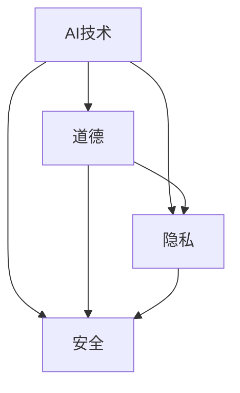

                 

# AI时代的人类增强：道德、隐私和安全

## 1. 背景介绍

随着人工智能(AI)技术的迅猛发展，AI已渗透到生活的各个方面，从语音识别、图像处理到自然语言处理，AI技术在提高生产效率、优化用户体验等方面发挥了重要作用。然而，AI技术的广泛应用也带来了新的挑战，尤其是在道德、隐私和安全方面。

**1.1 AI技术发展的现状**

目前，AI技术已广泛应用于自动驾驶、医疗诊断、智能客服、智能推荐等领域。例如，在自动驾驶中，AI算法通过摄像头、雷达等传感器收集实时数据，进行路径规划和决策，提升了驾驶安全性。在医疗领域，AI技术通过图像识别和自然语言处理，帮助医生更准确地诊断疾病，制定个性化治疗方案。智能客服则通过自然语言处理技术，解答客户咨询，提高服务效率。智能推荐系统根据用户的历史行为数据，推荐个性化的内容和服务，提升用户体验。

**1.2 道德、隐私和安全的挑战**

然而，随着AI技术的普及，其带来的道德、隐私和安全问题也日益凸显。AI系统在决策过程中可能会产生偏见和歧视，导致不公正的结果。例如，面部识别技术在肤色、性别等方面存在偏见，可能会侵犯少数群体的权益。AI系统的隐私问题也引起了广泛关注，用户数据被收集和分析，可能会被滥用或泄露。AI系统的安全问题也备受瞩目，黑客攻击和数据篡改可能导致严重的后果。

## 2. 核心概念与联系

### 2.1 核心概念概述

要深入理解AI时代的人类增强，我们需要掌握以下几个核心概念：

**AI技术**：包括机器学习、深度学习、自然语言处理等技术，通过算法和模型对数据进行处理和分析，从而实现自动化决策和智能推荐。

**道德**：指在开发和使用AI技术时，应遵循的伦理规范和社会价值观，避免对社会和个人造成伤害。

**隐私**：指个人数据不被未经授权的第三方访问和使用，保护个人隐私权。

**安全**：指AI系统在运行过程中，应具备抵抗攻击和数据篡改的能力，保障系统稳定和数据安全。

### 2.2 核心概念的联系

AI技术的发展离不开道德、隐私和安全的保障。只有在遵循道德规范、保护隐私权益、确保数据安全的前提下，AI技术才能真正造福人类。例如，面部识别技术在应用时，需要避免种族、性别等方面的偏见，确保公正性和非歧视性。在用户数据收集和分析时，应遵循隐私保护的原则，确保数据不被滥用和泄露。在AI系统设计中，应考虑安全防护，防止黑客攻击和数据篡改。

这些核心概念之间的联系可以通过以下Mermaid流程图来展示：



这个流程图展示了大语言模型和微调技术中的各个核心概念及其相互关系：

1. AI技术是基础，提供了自动化决策和智能推荐的能力。
2. 道德规范是AI技术的指南，确保AI技术在应用过程中遵循社会价值观，避免伤害。
3. 隐私保护是AI技术的保障，确保用户数据不被滥用和泄露。
4. 安全防护是AI技术的防护措施，确保系统稳定和数据安全。
5. 道德和隐私保护相互关联，确保数据使用的合规性。
6. 安全防护与隐私保护共同保障数据安全。

## 3. 核心算法原理 & 具体操作步骤

### 3.1 算法原理概述

AI技术的核心算法包括机器学习、深度学习、自然语言处理等。这些算法通过算法和模型对数据进行处理和分析，从而实现自动化决策和智能推荐。

以深度学习为例，深度学习通过多层神经网络，对输入数据进行特征提取和处理，从而实现分类、回归、生成等任务。其中，卷积神经网络(CNN)适用于图像处理任务，循环神经网络(RNN)适用于序列数据处理任务，Transformer模型适用于自然语言处理任务。

### 3.2 算法步骤详解

**3.2.1 数据预处理**

数据预处理是AI算法的基础。通常包括以下步骤：

1. 数据收集：通过传感器、API、数据库等方式，收集相关数据。例如，在自动驾驶中，通过摄像头、雷达等传感器收集实时数据。

2. 数据清洗：对收集到的数据进行清洗和预处理，去除噪音和异常值。例如，在医疗领域，去除数据中的异常值和错误信息。

3. 数据增强：通过数据增强技术，扩充训练集，提升模型鲁棒性。例如，在图像处理任务中，通过旋转、翻转等方式，扩充训练集。

**3.2.2 模型训练**

模型训练是AI算法的核心。通常包括以下步骤：

1. 选择模型：根据任务需求，选择适合的模型。例如，在图像处理任务中，选择卷积神经网络模型。

2. 训练模型：使用训练集对模型进行训练，优化模型参数。例如，在深度学习中，使用梯度下降等优化算法，最小化损失函数。

3. 模型评估：使用测试集对模型进行评估，衡量模型性能。例如，在图像分类任务中，使用准确率、召回率等指标，评估模型性能。

**3.2.3 模型部署**

模型部署是AI算法的最后一步。通常包括以下步骤：

1. 模型保存：将训练好的模型保存为文件或模型库，方便后续调用。

2. 模型部署：将模型部署到生产环境，实现实时处理和决策。例如，在自动驾驶中，将模型部署到车辆嵌入式系统。

### 3.3 算法优缺点

AI技术在提升生产效率、优化用户体验等方面具有诸多优点：

1. 自动化决策：AI技术能够快速、准确地处理大量数据，实现自动化决策和智能推荐。例如，在智能推荐系统中，通过分析用户历史行为数据，推荐个性化内容。

2. 提高效率：AI技术能够提升生产效率，减少人力成本。例如，在智能客服中，通过自然语言处理技术，解答客户咨询，提高服务效率。

3. 准确性高：AI技术能够处理复杂的非结构化数据，提高决策准确性。例如，在医疗诊断中，通过图像识别技术，提高诊断准确率。

然而，AI技术也存在一些缺点：

1. 数据依赖：AI技术依赖大量的数据进行训练和优化，数据质量和数据量决定了模型性能。例如，在自然语言处理任务中，依赖大规模语料库进行预训练。

2. 黑盒性质：AI模型往往具有黑盒性质，难以解释其决策过程和结果。例如，在图像分类任务中，难以解释模型为何将某张图片分类为特定类别。

3. 偏差和歧视：AI模型可能会产生偏差和歧视，导致不公正的结果。例如，面部识别技术在肤色、性别等方面存在偏见，可能会侵犯少数群体的权益。

### 3.4 算法应用领域

AI技术在各个领域都有广泛的应用，例如：

1. 自动驾驶：通过AI技术，实现自动驾驶功能，提升驾驶安全性和舒适性。例如，通过图像识别技术，实现车道保持和障碍物识别。

2. 医疗诊断：通过AI技术，提高医疗诊断的准确性和效率。例如，通过图像识别技术，实现肿瘤检测和病理分析。

3. 智能客服：通过AI技术，实现智能客服功能，提升客户服务体验。例如，通过自然语言处理技术，解答客户咨询，提高服务效率。

4. 智能推荐：通过AI技术，实现智能推荐功能，提升用户体验。例如，通过用户历史行为数据，推荐个性化内容和服务。

5. 语音识别：通过AI技术，实现语音识别功能，提升语音交互体验。例如，通过语音识别技术，实现语音搜索和语音控制。

## 4. 数学模型和公式 & 详细讲解 & 举例说明

### 4.1 数学模型构建

本节将使用数学语言对AI算法的构建进行更加严格的刻画。

以深度学习为例，深度学习模型通常由多个神经网络层组成，每个神经元接收输入数据，进行加权和激活函数计算，输出结果。例如，卷积神经网络模型由多个卷积层、池化层和全连接层组成，通过卷积和池化操作提取特征，通过全连接层进行分类或回归。

### 4.2 公式推导过程

以卷积神经网络为例，卷积神经网络通常由多个卷积层、池化层和全连接层组成，公式推导过程如下：

**卷积层**：

$$
h(x) = \sigma(W*x + b)
$$

其中，$h(x)$ 为卷积层输出，$W$ 为卷积核权重，$x$ 为输入数据，$b$ 为偏置项，$\sigma$ 为激活函数。

**池化层**：

$$
h(x) = \max_{i,j} \sigma(W*x + b)
$$

其中，$h(x)$ 为池化层输出，$W$ 为池化核权重，$x$ 为输入数据，$b$ 为偏置项，$\sigma$ 为激活函数。

**全连接层**：

$$
h(x) = \sigma(W*x + b)
$$

其中，$h(x)$ 为全连接层输出，$W$ 为权重矩阵，$x$ 为输入数据，$b$ 为偏置项，$\sigma$ 为激活函数。

**损失函数**：

$$
\mathcal{L}(\theta) = \frac{1}{N}\sum_{i=1}^N \ell(y_i, h(x_i))
$$

其中，$\mathcal{L}(\theta)$ 为损失函数，$y_i$ 为真实标签，$h(x_i)$ 为模型预测结果，$\ell$ 为损失函数，$N$ 为样本数量。

### 4.3 案例分析与讲解

以图像分类任务为例，图像分类任务通常使用卷积神经网络模型进行处理。假设使用LeNet-5模型进行图像分类，其公式推导过程如下：

**卷积层**：

$$
h(x) = \sigma(W*x + b)
$$

其中，$W$ 为卷积核权重，$x$ 为输入数据，$b$ 为偏置项，$\sigma$ 为激活函数。

**池化层**：

$$
h(x) = \max_{i,j} \sigma(W*x + b)
$$

其中，$W$ 为池化核权重，$x$ 为输入数据，$b$ 为偏置项，$\sigma$ 为激活函数。

**全连接层**：

$$
h(x) = \sigma(W*x + b)
$$

其中，$W$ 为权重矩阵，$x$ 为输入数据，$b$ 为偏置项，$\sigma$ 为激活函数。

**损失函数**：

$$
\mathcal{L}(\theta) = \frac{1}{N}\sum_{i=1}^N \ell(y_i, h(x_i))
$$

其中，$\mathcal{L}(\theta)$ 为损失函数，$y_i$ 为真实标签，$h(x_i)$ 为模型预测结果，$\ell$ 为损失函数，$N$ 为样本数量。

## 5. 项目实践：代码实例和详细解释说明

### 5.1 开发环境搭建

在进行AI算法开发前，我们需要准备好开发环境。以下是使用Python进行TensorFlow开发的环境配置流程：

1. 安装Anaconda：从官网下载并安装Anaconda，用于创建独立的Python环境。

2. 创建并激活虚拟环境：
```bash
conda create -n tf-env python=3.8 
conda activate tf-env
```

3. 安装TensorFlow：根据CUDA版本，从官网获取对应的安装命令。例如：
```bash
conda install tensorflow==2.6
```

4. 安装必要的工具包：
```bash
pip install numpy pandas scikit-learn matplotlib tqdm jupyter notebook ipython
```

完成上述步骤后，即可在`tf-env`环境中开始AI算法开发。

### 5.2 源代码详细实现

下面我们以图像分类任务为例，给出使用TensorFlow对卷积神经网络进行训练和推理的PyTorch代码实现。

首先，定义卷积神经网络模型：

```python
import tensorflow as tf
from tensorflow.keras import layers

class ConvNet(tf.keras.Model):
    def __init__(self):
        super(ConvNet, self).__init__()
        self.conv1 = layers.Conv2D(32, 3, activation='relu')
        self.pool1 = layers.MaxPooling2D()
        self.conv2 = layers.Conv2D(64, 3, activation='relu')
        self.pool2 = layers.MaxPooling2D()
        self.flatten = layers.Flatten()
        self.fc1 = layers.Dense(64, activation='relu')
        self.fc2 = layers.Dense(10)

    def call(self, x):
        x = self.conv1(x)
        x = self.pool1(x)
        x = self.conv2(x)
        x = self.pool2(x)
        x = self.flatten(x)
        x = self.fc1(x)
        return self.fc2(x)
```

然后，定义训练和评估函数：

```python
def train(model, train_dataset, epochs, batch_size, optimizer):
    model.compile(optimizer=optimizer, loss=tf.keras.losses.SparseCategoricalCrossentropy(from_logits=True), metrics=['accuracy'])
    model.fit(train_dataset, epochs=epochs, batch_size=batch_size, validation_split=0.2)

def evaluate(model, test_dataset):
    model.evaluate(test_dataset)
```

接着，启动训练流程并在测试集上评估：

```python
epochs = 10
batch_size = 64

model = ConvNet()
optimizer = tf.keras.optimizers.Adam(learning_rate=0.001)

train_dataset = # 加载训练数据集
test_dataset = # 加载测试数据集

train(model, train_dataset, epochs, batch_size, optimizer)
evaluate(model, test_dataset)
```

以上就是使用TensorFlow对卷积神经网络进行图像分类任务微调的完整代码实现。可以看到，TensorFlow提供的Keras API使得模型定义、训练和评估过程变得非常简洁高效。

### 5.3 代码解读与分析

让我们再详细解读一下关键代码的实现细节：

**ConvNet类**：
- `__init__`方法：定义卷积神经网络的结构，包括卷积层、池化层、全连接层等。
- `call`方法：定义模型前向传播的过程，输入数据通过卷积层、池化层、全连接层，最终输出分类结果。

**训练函数train**：
- 使用`compile`方法，定义优化器、损失函数和评估指标。
- 使用`fit`方法，加载训练数据集，进行模型训练。
- 使用`validation_split`参数，将训练集分为训练集和验证集，评估模型性能。

**评估函数evaluate**：
- 使用`evaluate`方法，加载测试数据集，评估模型性能。

**训练流程**：
- 定义总训练轮数和批次大小。
- 加载模型、优化器、训练数据集和测试数据集。
- 调用训练函数train，进行模型训练。
- 调用评估函数evaluate，评估模型性能。

可以看到，TensorFlow的Keras API使得AI算法的实现变得非常简洁高效。开发者可以将更多精力放在数据处理、模型改进等高层逻辑上，而不必过多关注底层的实现细节。

当然，工业级的系统实现还需考虑更多因素，如模型的保存和部署、超参数的自动搜索、更灵活的任务适配层等。但核心的AI算法基本与此类似。

## 6. 实际应用场景

### 6.1 医疗诊断

AI技术在医疗领域的应用越来越广泛，尤其在图像处理、病理诊断等方面。例如，通过深度学习模型，医生可以通过医疗影像，进行肿瘤检测和病理分析。AI技术可以自动提取图像特征，识别异常区域，提高诊断准确率。

在实际应用中，AI技术可以通过大规模医疗影像数据进行预训练，然后进行微调，适应特定的病理诊断任务。例如，在肺癌检测任务中，通过微调模型，可以更准确地识别肺癌区域，帮助医生制定治疗方案。

### 6.2 智能推荐

AI技术在电商、视频、音乐等领域也有广泛应用。例如，通过深度学习模型，推荐系统可以根据用户历史行为数据，推荐个性化的商品、视频和音乐。AI技术可以分析用户偏好，预测用户需求，提高推荐准确率。

在实际应用中，AI技术可以通过用户行为数据进行预训练，然后进行微调，适应特定的推荐任务。例如，在推荐系统中，通过微调模型，可以更准确地预测用户兴趣，推荐个性化内容。

### 6.3 自动驾驶

AI技术在自动驾驶领域的应用前景广阔。通过深度学习模型，车辆可以通过摄像头、雷达等传感器，进行路径规划和决策，实现自动驾驶功能。AI技术可以实时分析道路环境，识别障碍物，提高驾驶安全性和舒适性。

在实际应用中，AI技术可以通过大量驾驶数据进行预训练，然后进行微调，适应特定的自动驾驶任务。例如，在车道保持任务中，通过微调模型，可以更准确地识别车道线和障碍物，提高驾驶稳定性。

## 7. 工具和资源推荐

### 7.1 学习资源推荐

为了帮助开发者系统掌握AI技术的基础和应用，这里推荐一些优质的学习资源：

1. 《深度学习》书籍：Ian Goodfellow等人所著，全面介绍了深度学习的基本概念和算法。

2. TensorFlow官方文档：TensorFlow官方文档，提供了丰富的教程和样例，帮助开发者快速上手TensorFlow。

3. PyTorch官方文档：PyTorch官方文档，提供了丰富的教程和样例，帮助开发者快速上手PyTorch。

4. Coursera深度学习课程：Coursera开设的深度学习课程，由Andrew Ng等人主讲，涵盖深度学习的基本概念和算法。

5. 自然语言处理综述论文：自然语言处理综述论文，涵盖了自然语言处理的基本概念和算法。

通过对这些资源的学习实践，相信你一定能够快速掌握AI技术的基础和应用，并用于解决实际的AI问题。

### 7.2 开发工具推荐

高效的开发离不开优秀的工具支持。以下是几款用于AI算法开发的常用工具：

1. PyTorch：基于Python的开源深度学习框架，灵活动态的计算图，适合快速迭代研究。大部分预训练语言模型都有PyTorch版本的实现。

2. TensorFlow：由Google主导开发的开源深度学习框架，生产部署方便，适合大规模工程应用。同样有丰富的预训练语言模型资源。

3. Keras：基于TensorFlow和Theano的高级神经网络API，使得模型定义、训练和评估过程变得非常简洁高效。

4. Jupyter Notebook：交互式数据科学和机器学习环境，支持多种编程语言，适合进行代码开发和数据处理。

5. Visual Studio Code：轻量级代码编辑器，支持多种编程语言，提供丰富的扩展和插件，适合进行代码开发和调试。

合理利用这些工具，可以显著提升AI算法的开发效率，加快创新迭代的步伐。

### 7.3 相关论文推荐

AI技术的发展源于学界的持续研究。以下是几篇奠基性的相关论文，推荐阅读：

1. LeNet-5：Yann LeCun等人于1998年提出的卷积神经网络模型，奠定了卷积神经网络在图像处理中的基础。

2. AlexNet：Alex Krizhevsky等人于2012年提出的卷积神经网络模型，在ImageNet数据集上取得了当时的最佳成绩，展示了卷积神经网络的强大能力。

3. VGGNet：Karen Simonyan和Andrew Zisserman于2014年提出的卷积神经网络模型，展示了多层次卷积网络的强大能力。

4. ResNet：Kaiming He等人于2015年提出的残差网络，通过残差连接，解决了深度神经网络的退化问题，提高了模型深度。

5. GANs：Ian Goodfellow等人于2014年提出的生成对抗网络，通过对抗生成网络和判别网络的博弈，实现了高质量的图像生成和图像增强。

这些论文代表了大语言模型微调技术的发展脉络。通过学习这些前沿成果，可以帮助研究者把握学科前进方向，激发更多的创新灵感。

## 8. 总结：未来发展趋势与挑战

### 8.1 总结

本文对AI技术在道德、隐私和安全方面的研究进行了全面系统的介绍。首先阐述了AI技术在各个领域的应用，以及面临的道德、隐私和安全问题。其次，从原理到实践，详细讲解了AI算法的核心算法和具体操作步骤，给出了AI算法开发的完整代码实例。同时，本文还广泛探讨了AI技术在医疗、智能推荐、自动驾驶等多个行业领域的应用前景，展示了AI技术的广阔前景。

通过本文的系统梳理，可以看到，AI技术在提升生产效率、优化用户体验等方面具有诸多优点，但也面临着数据依赖、黑盒性质、偏差和歧视等问题。如何在保证AI技术带来的好处的同时，保障其道德、隐私和安全，将是未来研究的重要课题。

### 8.2 未来发展趋势

展望未来，AI技术的发展将呈现以下几个趋势：

1. 自动化决策：AI技术在各个领域的应用将更加广泛，自动化决策和智能推荐将成为主流。例如，在医疗领域，AI技术将广泛应用于病理诊断和治疗方案制定。在电商领域，AI技术将广泛应用于商品推荐和广告投放。

2. 跨领域融合：AI技术将与其他技术进行更深入的融合，如知识表示、因果推理、强化学习等，共同推动智能系统的进步。例如，在自然语言处理任务中，AI技术将与知识图谱、逻辑规则等专家知识结合，提升模型的理解和推理能力。

3. 数据依赖减少：未来AI技术将更加注重模型的普适性和鲁棒性，减少对大规模数据和标签的依赖。例如，通过自监督学习、主动学习等无监督和半监督方法，利用非结构化数据进行模型训练。

4. 透明性增强：AI模型的透明性和可解释性将逐步提升，便于用户理解和接受。例如，通过可解释AI（XAI）技术，用户可以理解模型的决策过程和结果，增强信任感。

5. 隐私保护加强：AI技术将更加注重用户隐私保护，防止用户数据被滥用和泄露。例如，通过差分隐私技术，保护用户隐私权益。

### 8.3 面临的挑战

尽管AI技术在各个领域的应用前景广阔，但在道德、隐私和安全方面仍面临诸多挑战：

1. 数据隐私：AI技术在处理用户数据时，可能会侵犯用户隐私，导致数据泄露和滥用。如何保护用户数据隐私，防止数据滥用和泄露，将是未来研究的重要课题。

2. 算法偏见：AI模型可能会产生偏见和歧视，导致不公正的结果。如何减少模型的偏见和歧视，确保公平性，将是未来研究的重要课题。

3. 模型透明性：AI模型往往具有黑盒性质，难以解释其决策过程和结果。如何增强模型的透明性和可解释性，便于用户理解和接受，将是未来研究的重要课题。

4. 安全防护：AI模型在运行过程中，可能会遭受黑客攻击和数据篡改，导致严重的后果。如何加强模型的安全防护，防止攻击和篡改，将是未来研究的重要课题。

5. 伦理道德：AI技术在应用过程中，可能会带来伦理道德问题，如自动化裁员、数据滥用等。如何规范AI技术的伦理道德，确保其应用符合社会价值观，将是未来研究的重要课题。

### 8.4 研究展望

面对AI技术面临的诸多挑战，未来的研究需要在以下几个方面寻求新的突破：

1. 数据隐私保护：研究差分隐私、联邦学习等技术，保护用户数据隐私，防止数据滥用和泄露。例如，通过联邦学习技术，保护用户数据隐私，防止数据泄露。

2. 模型透明性和可解释性：研究可解释AI（XAI）技术，增强模型的透明性和可解释性，便于用户理解和接受。例如，通过可解释AI技术，用户可以理解模型的决策过程和结果，增强信任感。

3. 算法偏见减少：研究模型公平性算法，减少模型的偏见和歧视，确保公平性。例如，通过公平性算法，减少模型的偏见和歧视，确保公平性。

4. 安全防护增强：研究安全防护技术，加强模型的安全防护，防止攻击和篡改。例如，通过安全防护技术，加强模型的安全防护，防止攻击和篡改。

5. 伦理道德规范：研究伦理道德规范，确保AI技术的应用符合社会价值观，防止伦理道德问题。例如，通过伦理道德规范，确保AI技术的应用符合社会价值观，防止伦理道德问题。

这些研究方向的探索，必将引领AI技术迈向更加智能化、普适化应用，为构建安全、可靠、可解释、可控的智能系统铺平道路。面向未来，AI技术还需要与其他人工智能技术进行更深入的融合，如知识表示、因果推理、强化学习等，多路径协同发力，共同推动智能系统的进步。只有勇于创新、敢于突破，才能不断拓展AI技术的边界，让AI技术更好地造福人类社会。

## 9. 附录：常见问题与解答

**Q1：如何保护用户数据隐私？**

A: 数据隐私保护是AI技术的重要课题，以下是几种常用的隐私保护技术：

1. 差分隐私：通过对数据进行扰动，保护用户数据隐私，防止数据泄露和滥用。例如，在数据发布时，通过加入噪声，保护用户隐私。

2. 联邦学习：通过分布式训练，保护用户数据隐私，防止数据泄露和滥用。例如，在分布式系统中，通过联邦学习技术，保护用户数据隐私。

3. 加密技术：通过加密算法，保护用户数据隐私，防止数据泄露和滥用。例如，在数据传输时，通过加密算法，保护数据隐私。

**Q2：AI模型为什么会存在偏见和歧视？**

A: AI模型可能会存在偏见和歧视，主要原因如下：

1. 数据偏见：训练数据可能存在偏见和歧视，导致模型学习到错误的知识。例如，在面部识别任务中，训练数据可能存在肤色、性别等方面的偏见，导致模型在识别时产生歧视。

2. 模型设计：AI模型的设计和优化过程可能存在偏见和歧视。例如，在自然语言处理任务中，模型设计时可能存在性别、种族等方面的偏见，导致模型在处理时产生歧视。

3. 人类偏见：人类在使用AI技术时，可能存在偏见和歧视，导致模型学习到错误的知识。例如，在智能客服中，人类工程师可能存在性别、种族等方面的偏见，导致模型在处理时产生歧视。

**Q3：AI模型如何增强透明性和可解释性？**

A: AI模型透明性和可解释性的增强是AI技术的重要研究方向，以下是几种常用的增强技术：

1. 可解释AI（XAI）：通过可视化、可解释算法等技术，增强模型的透明性和可解释性，便于用户理解和接受。例如，通过可视化技术，用户可以理解模型的决策过程和结果，增强信任感。

2. 可解释模型：设计可解释的AI模型，增强模型的透明性和可解释性。例如，通过决策树模型、逻辑回归模型等可解释模型，增强模型的透明性和可解释性。

3. 可解释解释器：设计可解释解释器，增强模型的透明性和可解释性。例如，通过可解释解释器，用户可以理解模型的决策过程和结果，增强信任感。

**Q4：如何增强AI模型的安全防护？**

A: AI模型在运行过程中，可能会遭受黑客攻击和数据篡改，以下是几种常用的安全防护技术：

1. 对抗攻击防御：通过对抗训练、对抗样本等技术，增强模型的鲁棒性，防止对抗攻击。例如，通过对抗训练技术，增强模型的鲁棒性，防止对抗攻击。

2. 数据篡改防护：通过数据签名、数字证书等技术，防止数据篡改。例如，通过数据签名技术，防止数据篡改。

3. 访问控制：通过访问控制技术，防止未授权的访问。例如，通过访问控制技术，防止未授权的访问。

4. 异常检测：通过异常检测技术，发现和处理异常行为。例如，通过异常检测技术，发现和处理异常行为。

这些技术可以结合使用，确保AI模型在运行过程中，具备抵抗攻击和数据篡改的能力，保障系统稳定和数据安全。

---

作者：禅与计算机程序设计艺术 / Zen and the Art of Computer Programming

