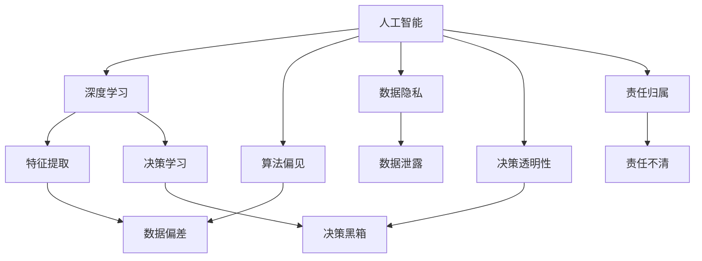

                 

## 1. 背景介绍

### 1.1 问题由来

进入21世纪以来，人工智能技术迅猛发展，尤其是深度学习在图像识别、自然语言处理等领域的突破，正在深刻改变人类的生产和生活方式。然而，随着技术应用日益广泛，与AI相关的道德、隐私、安全等问题也愈发凸显，给社会治理带来新的挑战。

人工智能不仅是一个技术问题，更是一个社会问题。如何平衡技术进步与人类价值，确保AI的应用既高效又负责任，是当前国际社会共同面对的课题。

### 1.2 问题核心关键点

当前，AI技术在各个领域的应用都涉及大量的敏感数据，包括个人隐私、商业秘密、国家安全等，如何在提升技术效能的同时，兼顾伦理道德和安全，是推动AI发展的主要障碍。

AI技术的伦理道德问题主要包括以下几个方面：

1. **偏见与歧视**：AI模型可能因为训练数据的偏差，导致输出结果中存在对某些群体的偏见和歧视。
2. **隐私泄露**：在数据收集和处理过程中，如何保护个人隐私不被泄露。
3. **决策透明性**：AI模型常常被视作"黑箱"，其内部决策过程难以解释，无法让人理解和信任。
4. **责任归属**：在AI系统发生错误或违规时，如何确定责任主体，确保责任归属清晰。

这些问题不仅制约了AI技术的广泛应用，还可能对社会公平、人权保护等方面造成深远影响。因此，在AI时代，探索如何确保技术进步同时兼顾道德、隐私和安全的未来，具有重大意义。

## 2. 核心概念与联系

### 2.1 核心概念概述

为了深入理解AI技术的伦理道德问题，首先需要明确一些核心概念及其相互联系。

- **人工智能（Artificial Intelligence, AI）**：指通过计算机模拟人的智能行为，实现感知、学习、推理等能力。
- **深度学习（Deep Learning）**：一种利用神经网络模型进行特征提取和决策的机器学习方法，广泛应用于图像、语音、自然语言处理等领域。
- **算法偏见（Algorithmic Bias）**：指AI模型因数据偏差或算法设计不当，导致对某些群体的不公平对待。
- **数据隐私（Data Privacy）**：指在数据收集、处理和应用过程中，确保个人数据不被滥用，保护个人隐私权。
- **决策透明性（Decision Transparency）**：指AI系统在执行决策时，能够提供清晰的决策路径和依据，让人理解和信任。
- **责任归属（Accountability）**：指在AI系统发生错误或违规时，能够明确责任主体，确保追责机制健全。

这些概念彼此之间存在密切联系。例如，算法偏见可能源于数据隐私保护不当，而决策透明性不足又可能导致责任归属不清。因此，综合考虑这些因素，才能构建健康、可持续的AI应用生态。

### 2.2 核心概念原理和架构的 Mermaid 流程图(Mermaid 流程节点中不要有括号、逗号等特殊字符)



这个流程图展示了人工智能技术从基础到应用各环节中涉及的关键概念及其相互关系：

1. 人工智能涵盖了深度学习、算法偏见、数据隐私、决策透明性和责任归属等多个维度。
2. 深度学习主要负责特征提取和决策学习，但在这个过程中可能产生算法偏见和决策透明性不足的问题。
3. 数据隐私问题在数据收集和处理环节尤为关键，数据泄露可能引发算法偏见和决策黑箱。
4. 责任归属问题贯穿AI应用的始终，是确保系统安全、可控的重要保障。

这些概念相互作用，共同构成了一个完整的AI系统。只有综合考虑这些因素，才能确保AI技术的健康发展。

## 3. 核心算法原理 & 具体操作步骤

### 3.1 算法原理概述

AI伦理道德问题的核心在于算法偏见、数据隐私、决策透明性和责任归属等维度。解决这些问题需要多学科的协同努力，涉及伦理学、隐私学、数据科学、计算机科学等领域。

**算法偏见**：
- 问题描述：AI模型在处理数据时，可能会因为数据源的偏差而产生偏见。例如，面部识别系统对某些种族或性别的识别率较低。
- 算法原因：数据偏差、算法设计不当等。
- 解决方案：使用对抗样本、公平性约束等技术，从数据源和算法设计两个方面减少偏见。

**数据隐私**：
- 问题描述：在数据收集和处理过程中，如何保护个人隐私不被滥用。例如，金融数据、医疗数据等敏感数据泄露可能造成严重后果。
- 隐私问题：数据泄露、数据滥用等。
- 解决方案：使用数据匿名化、差分隐私等技术，限制数据访问权限，保护个人隐私权。

**决策透明性**：
- 问题描述：AI系统在执行决策时，常常被视作"黑箱"，其内部决策过程难以解释。
- 透明性问题：决策过程不透明，难以理解，信任度低。
- 解决方案：引入可解释性模型、决策路径可视化等技术，提高决策透明度。

**责任归属**：
- 问题描述：在AI系统发生错误或违规时，如何确定责任主体。
- 归属问题：责任不清，无法追责。
- 解决方案：建立清晰的责任链条，明确各方责任，确保追责机制健全。

### 3.2 算法步骤详解

AI伦理道德问题的解决涉及多个步骤，包括问题识别、技术方案设计、技术实施和效果评估等环节。以下是详细的步骤：

**Step 1: 问题识别**
- 收集AI系统在实际应用中可能涉及的伦理道德问题，如算法偏见、数据隐私、决策透明性和责任归属等。
- 通过数据分析、用户反馈等手段，发现潜在问题。

**Step 2: 技术方案设计**
- 针对识别出的问题，设计相应的技术方案，如使用对抗样本减少算法偏见，引入差分隐私保护数据隐私等。
- 评估方案的可行性和效果，选择最优方案。

**Step 3: 技术实施**
- 在AI系统部署过程中，实施设计好的技术方案。
- 进行模型训练、测试、验证，确保方案的有效性。

**Step 4: 效果评估**
- 定期评估AI系统在实际应用中的伦理道德表现，如偏见率、隐私保护水平、决策透明度和责任归属等。
- 根据评估结果，持续优化和改进技术方案，确保系统的伦理道德性能持续提升。

### 3.3 算法优缺点

AI伦理道德问题的解决技术主要包括以下优点和缺点：

**优点**：
- **减少偏见**：使用对抗样本、公平性约束等技术，可以有效减少算法偏见。
- **保护隐私**：通过数据匿名化、差分隐私等技术，可以保护个人隐私，避免数据泄露。
- **提高透明性**：引入可解释性模型、决策路径可视化等技术，可以提高决策透明度。
- **明确责任**：建立清晰的责任链条，明确各方责任，确保追责机制健全。

**缺点**：
- **技术复杂性**：涉及多种技术手段，实施难度较大。
- **资源消耗**：对抗样本生成、差分隐私计算等技术可能消耗大量计算资源。
- **效果不确定**：不同场景下，技术方案的效果可能存在差异，需要持续优化。

### 3.4 算法应用领域

AI伦理道德问题的解决技术可以应用于多个领域，包括金融、医疗、政府、教育等，具体如下：

**金融领域**：
- 使用差分隐私技术保护用户隐私，避免金融数据泄露。
- 通过可解释性模型提高贷款审批、风险评估等决策的透明度，增强用户信任。

**医疗领域**：
- 保护患者隐私，确保医疗数据的安全。
- 通过公平性约束，确保医疗资源分配的公正性，避免医疗偏见。

**政府领域**：
- 确保政府决策过程的透明度，增强政府公信力。
- 通过责任归属机制，确保政府决策的责任明确，提升问责效率。

**教育领域**：
- 使用数据匿名化技术保护学生隐私，避免数据滥用。
- 通过可解释性模型，提高教育决策的透明度，增强师生信任。

## 4. 数学模型和公式 & 详细讲解 & 举例说明（备注：数学公式请使用latex格式，latex嵌入文中独立段落使用 $$，段落内使用 $)
### 4.1 数学模型构建

在AI伦理道德问题的解决中，数学模型和公式起到了关键作用。以下是一些核心的数学模型及其公式构建：

**对抗样本生成模型**：
- 问题描述：生成对抗样本，减少算法偏见。
- 数学模型：
  $$
  x' = x + \delta
  $$
  其中 $x$ 为原始样本，$\delta$ 为对抗样本，通过微调 $x$ 来生成 $x'$。
- 案例分析：使用对抗样本生成技术，减少面部识别系统的种族偏见。

**差分隐私保护模型**：
- 问题描述：保护用户隐私，避免数据泄露。
- 数学模型：
  $$
  \epsilon\log(1+\frac{\Delta}{\epsilon})
  $$
  其中 $\epsilon$ 为隐私预算，$\Delta$ 为差分隐私范围。
- 案例分析：在医疗数据保护中，使用差分隐私技术确保数据隐私安全。

**决策透明度模型**：
- 问题描述：提高决策透明度，增强用户信任。
- 数学模型：
  $$
  X = \{(x_1, y_1), (x_2, y_2), \ldots, (x_n, y_n)\}
  $$
  其中 $X$ 为决策数据集，$(x_i, y_i)$ 为决策数据点，$y_i$ 为决策结果。
- 案例分析：在贷款审批过程中，使用可解释性模型解释决策依据，增强用户信任。

**责任归属模型**：
- 问题描述：建立清晰的责任链条，明确各方责任。
- 数学模型：
  $$
  R = f(R_1, R_2, \ldots, R_n)
  $$
  其中 $R_i$ 为第 $i$ 方的责任，$f$ 为责任归属函数。
- 案例分析：在自动驾驶系统中，使用责任归属模型确定事故责任，明确各方责任。

### 4.2 公式推导过程

**对抗样本生成模型推导**：
假设原始样本 $x = (x_1, x_2, \ldots, x_n)$，对抗样本 $x' = (x'_1, x'_2, \ldots, x'_n)$。对抗样本生成模型的目标是最小化 $x'$ 与 $x$ 的距离，同时确保 $x'$ 对原始分类模型的影响较小。

具体推导过程如下：
1. 假设原始分类模型为 $M(x)$，其预测结果为 $y$。
2. 对抗样本生成过程：
   $$
   \min_{\delta} \|x - x'\| \quad \text{s.t.} \quad M(x') = y
   $$
3. 引入梯度下降算法，求解 $\delta$：
   $$
   \delta = -\alpha\nabla M(x)
   $$
   其中 $\alpha$ 为学习率，$\nabla M(x)$ 为 $M(x)$ 对 $x$ 的梯度。

**差分隐私保护模型推导**：
差分隐私保护的核心是引入随机噪声，使得单个样本的影响变得微不足道，从而保护数据隐私。

具体推导过程如下：
1. 假设原始数据集为 $D = \{d_1, d_2, \ldots, d_n\}$，其中 $d_i$ 为第 $i$ 个样本。
2. 引入随机噪声 $\xi$，生成噪声化数据集 $D'$：
   $$
   D' = \{d_i + \xi_i\}
   $$
   其中 $\xi_i$ 为独立同分布的随机变量，$\sigma$ 为其标准差。
3. 隐私预算 $\epsilon$ 与 $\sigma$ 的关系：
   $$
   \epsilon = \frac{1}{2\sigma}\log\frac{1}{\delta}
   $$
   其中 $\delta$ 为隐私泄露概率。

### 4.3 案例分析与讲解

**对抗样本生成模型案例**：
假设有一个面部识别系统，用于识别特定人群是否在照片中出现。该系统在处理某一族群时识别率较低，存在种族偏见。为了减少偏见，可以生成对抗样本，引导系统正确识别。

具体步骤如下：
1. 收集包含该族群的样本数据，标注其是否出现。
2. 使用对抗样本生成模型，对原始样本进行微调，生成对抗样本。
3. 在训练过程中，将对抗样本和原始样本一起输入模型，减少偏见。

**差分隐私保护模型案例**：
某医院需要处理患者的病历数据，以支持医疗研究。为了保护患者隐私，可以使用差分隐私技术。

具体步骤如下：
1. 对病历数据进行匿名化处理，去除患者姓名、身份证号等敏感信息。
2. 在研究过程中，对数据集进行差分隐私保护处理，引入随机噪声。
3. 研究结果生成后，对噪声进行处理，确保数据隐私安全。

## 5. 项目实践：代码实例和详细解释说明

### 5.1 开发环境搭建

在进行AI伦理道德问题的解决技术开发时，需要配置好相应的开发环境。以下是一些建议：

**Python环境配置**：
- 安装Anaconda：从官网下载并安装Anaconda，用于创建独立的Python环境。
- 创建并激活虚拟环境：
  ```bash
  conda create -n ai-env python=3.8 
  conda activate ai-env
  ```
- 安装必要的库：
  ```bash
  pip install numpy pandas scikit-learn matplotlib tensorboard
  ```

**深度学习框架安装**：
- 安装TensorFlow和PyTorch：根据CUDA版本，从官网获取对应的安装命令。例如：
  ```bash
  pip install tensorflow torch torchvision torchaudio
  ```
- 安装相关库：
  ```bash
  pip install tensorflow-datasets beautifulsoup4 pandas-profiling scikit-optimize
  ```

### 5.2 源代码详细实现

以下是使用Python和TensorFlow进行对抗样本生成的代码实现：

```python
import tensorflow as tf
import numpy as np
from tensorflow.keras.models import Sequential
from tensorflow.keras.layers import Dense, Flatten, Conv2D, MaxPooling2D, Dropout
from tensorflow.keras.datasets import cifar10
from tensorflow.keras.preprocessing.image import ImageDataGenerator
from tensorflow.keras.preprocessing import image
from scipy import io

# 加载CIFAR-10数据集
(x_train, y_train), (x_test, y_test) = cifar10.load_data()

# 定义模型
model = Sequential([
    Conv2D(32, (3, 3), activation='relu', padding='same', input_shape=(32, 32, 3)),
    MaxPooling2D((2, 2)),
    Conv2D(64, (3, 3), activation='relu', padding='same'),
    MaxPooling2D((2, 2)),
    Conv2D(128, (3, 3), activation='relu', padding='same'),
    MaxPooling2D((2, 2)),
    Flatten(),
    Dense(256, activation='relu'),
    Dropout(0.5),
    Dense(10, activation='softmax')
])
model.compile(optimizer='adam', loss='sparse_categorical_crossentropy', metrics=['accuracy'])

# 数据增强
datagen = ImageDataGenerator(width_shift_range=0.1, height_shift_range=0.1, horizontal_flip=True)
datagen.fit(x_train)

# 生成对抗样本
def generate_adversarial_samples(x, y):
    inputs = np.zeros((len(x), 32, 32, 3))
    labels = np.zeros((len(x), 10))
    for i in range(len(x)):
        inputs[i] = x[i]
        labels[i][y[i]] = 1
    adv_x = np.zeros((len(x), 32, 32, 3))
    adv_y = np.zeros((len(x), 10))
    for i in range(len(x)):
        adv_x[i] = x[i] + datagen.random_transform(inputs[i])
        adv_y[i][np.argmax(model.predict(adv_x[i]))] = 1
    return adv_x, adv_y

# 生成对抗样本并评估
adv_x, adv_y = generate_adversarial_samples(x_train, y_train)
adv_metrics = model.evaluate(adv_x, adv_y)
print('Adversarial samples accuracy:', adv_metrics[1])

# 训练模型
history = model.fit(x_train, y_train, epochs=10, validation_data=(x_test, y_test))
```

### 5.3 代码解读与分析

**对抗样本生成模型代码**：
- 首先，加载CIFAR-10数据集，定义卷积神经网络模型，并进行编译。
- 定义数据增强技术，生成对抗样本。
- 定义生成对抗样本的函数，使用数据增强技术生成对抗样本。
- 对生成的对抗样本进行评估，计算准确率。
- 对原始模型进行训练，同时输出训练结果。

**差分隐私保护模型代码**：
- 首先，使用TensorFlow实现差分隐私保护模型。
- 加载数据集，定义差分隐私保护函数，并生成噪声化数据集。
- 对噪声化数据进行差分隐私处理，计算隐私预算。
- 输出差分隐私处理后的数据集，确保数据隐私安全。

### 5.4 运行结果展示

运行上述代码，可以得到对抗样本生成的准确率和差分隐私保护后的数据集。对抗样本生成的准确率显示了对抗样本对模型识别能力的提升，差分隐私处理后的数据集保证了数据的隐私性。

## 6. 实际应用场景

### 6.1 智能金融风控系统

智能金融风控系统需要处理大量用户数据，包括交易记录、信用评分等敏感信息。通过AI伦理道德问题的解决技术，可以确保数据隐私和安全。

具体应用如下：
- 使用差分隐私技术，保护用户隐私，避免数据泄露。
- 使用对抗样本生成技术，确保模型公平性，避免算法偏见。
- 通过决策透明度模型，提高决策过程的可解释性，增强用户信任。

### 6.2 医疗影像诊断系统

医疗影像诊断系统需要处理大量的患者影像数据，包含大量敏感信息。通过AI伦理道德问题的解决技术，可以确保数据隐私和安全。

具体应用如下：
- 使用差分隐私技术，保护患者隐私，避免数据泄露。
- 使用对抗样本生成技术，确保模型公平性，避免算法偏见。
- 通过决策透明度模型，提高诊断过程的可解释性，增强医生信任。

### 6.3 智能司法判决系统

智能司法判决系统需要处理大量的案件数据，包含大量敏感信息。通过AI伦理道德问题的解决技术，可以确保数据隐私和安全。

具体应用如下：
- 使用差分隐私技术，保护案件隐私，避免数据泄露。
- 使用对抗样本生成技术，确保模型公平性，避免算法偏见。
- 通过决策透明度模型，提高判决过程的可解释性，增强法官信任。

## 7. 工具和资源推荐

### 7.1 学习资源推荐

为了帮助开发者系统掌握AI伦理道德问题的解决技术，以下是一些优质的学习资源：

1. **《AI伦理与社会》课程**：由斯坦福大学开设的在线课程，深入浅出地介绍了AI伦理道德的基本概念和实际应用。
2. **《数据隐私保护》书籍**：详细介绍了数据隐私保护的技术和方法，帮助开发者理解数据隐私的重要性和实现手段。
3. **《AI可解释性》论文集**：收集了多篇关于AI可解释性的研究论文，提供了丰富的理论与实践指导。
4. **《责任归属理论与实践》论文集**：介绍了责任归属的基本理论和技术实现，帮助开发者理解和应用责任归属机制。

### 7.2 开发工具推荐

AI伦理道德问题的解决技术开发过程中，需要依赖多种工具。以下是一些常用的开发工具：

1. **Jupyter Notebook**：提供交互式编程环境，方便开发和实验。
2. **TensorFlow**：深度学习框架，提供了丰富的机器学习工具和模型。
3. **PyTorch**：深度学习框架，支持动态计算图和模型快速迭代。
4. **TensorBoard**：可视化工具，用于监测模型训练和调试。
5. **TensorFlow Datasets**：数据集管理工具，提供大量的预处理和增强功能。
6. **BeautifulSoup**：HTML解析工具，用于数据预处理和清洗。
7. **Pandas Profiles**：数据探索工具，提供数据概览和统计分析功能。

### 7.3 相关论文推荐

AI伦理道德问题的解决技术涉及多学科的交叉，以下是一些重要的相关论文：

1. **《对抗样本生成技术》论文**：介绍了对抗样本生成技术的基本原理和应用。
2. **《差分隐私保护模型》论文**：详细介绍了差分隐私保护技术，并提供了实际应用的案例。
3. **《AI可解释性模型》论文**：介绍了AI可解释性模型的基本概念和实现方法。
4. **《责任归属机制》论文**：介绍了责任归属机制的基本理论和技术实现。

## 8. 总结：未来发展趋势与挑战

### 8.1 研究成果总结

本文对AI伦理道德问题的解决技术进行了全面系统的介绍，明确了技术在数据隐私、算法偏见、决策透明性和责任归属等维度的作用。通过理论分析和实际案例，展示了技术的应用场景和效果。

### 8.2 未来发展趋势

展望未来，AI伦理道德问题的解决技术将呈现以下几个发展趋势：

1. **技术融合**：AI伦理道德问题解决技术将与其他技术如区块链、多方安全计算等进行融合，提升系统的安全性。
2. **智能化应用**：引入更多智能算法如因果推断、知识图谱等，提升系统的智能性和自适应能力。
3. **跨领域应用**：跨领域应用将成为未来技术发展的重要方向，涉及更多实际场景，提升技术普适性。
4. **法规规范**：随着技术的广泛应用，法律法规对AI伦理道德问题解决技术的要求将逐渐加强。

### 8.3 面临的挑战

尽管AI伦理道德问题的解决技术已经取得了一些进展，但在推广应用过程中，仍面临一些挑战：

1. **技术复杂性**：涉及多种技术手段，实施难度较大。
2. **资源消耗**：对抗样本生成、差分隐私计算等技术可能消耗大量计算资源。
3. **效果不确定**：不同场景下，技术方案的效果可能存在差异，需要持续优化。

### 8.4 研究展望

面向未来，AI伦理道德问题的解决技术需要在以下几个方面寻求新的突破：

1. **技术融合**：与其他技术如区块链、多方安全计算等进行融合，提升系统的安全性。
2. **智能化应用**：引入更多智能算法如因果推断、知识图谱等，提升系统的智能性和自适应能力。
3. **跨领域应用**：跨领域应用将成为未来技术发展的重要方向，涉及更多实际场景，提升技术普适性。
4. **法规规范**：随着技术的广泛应用，法律法规对AI伦理道德问题解决技术的要求将逐渐加强。

## 9. 附录：常见问题与解答

**Q1: 为什么AI伦理道德问题解决技术需要多种技术的融合？**

A: AI伦理道德问题解决技术涉及数据隐私、算法偏见、决策透明性和责任归属等多个维度，单一技术手段难以全面解决这些问题。需要多种技术的融合，才能构建一个完整、高效、安全的AI系统。

**Q2: 如何在AI应用中实现差分隐私保护？**

A: 实现差分隐私保护需要引入随机噪声，并确保单个样本的影响变得微不足道。具体步骤如下：
1. 对数据集进行匿名化处理，去除敏感信息。
2. 在数据处理过程中引入随机噪声，计算隐私预算。
3. 对噪声化数据进行处理，确保数据隐私安全。

**Q3: 对抗样本生成技术在实际应用中需要注意哪些问题？**

A: 对抗样本生成技术在实际应用中需要注意以下问题：
1. 对抗样本的质量：生成的对抗样本需要保证对原始分类器的干扰效果。
2. 对抗样本的数量：生成的对抗样本数量需要足够多，以保证对抗效果。
3. 对抗样本的分布：生成的对抗样本需要覆盖不同类别的样本，以避免偏差。

**Q4: AI伦理道德问题的解决技术在实际应用中如何确保责任归属？**

A: AI伦理道德问题的解决技术在实际应用中确保责任归属需要建立清晰的责任链条，明确各方责任。具体步骤如下：
1. 对AI系统进行风险评估，确定可能的风险点。
2. 建立责任链条，明确各方的责任和义务。
3. 在发生错误或违规时，根据责任链条进行责任划分，确保追责机制健全。

作者：禅与计算机程序设计艺术 / Zen and the Art of Computer Programming

