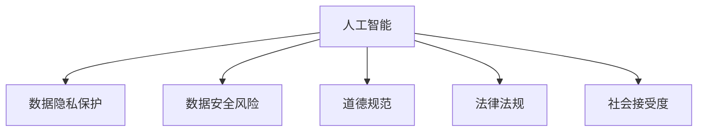

                 

# AI时代的人类计算：隐私、安全和道德

> 关键词：人工智能,人类计算,隐私保护,数据安全,道德规范

## 1. 背景介绍

### 1.1 问题由来
随着人工智能(AI)技术的迅猛发展，其在医疗、金融、教育、安防等众多领域的应用已经深刻改变了人们的生活方式。然而，在享受AI带来便利的同时，我们也面临着诸多挑战，尤其是数据隐私保护、安全风险以及道德规范等问题的凸显。

AI时代，大数据和机器学习成为基础，人类计算逐渐被机器所替代，这不仅带来了生产力的大幅提升，也对社会伦理和法律法规提出了新的要求。如何在保障数据隐私和安全的同时，构建公正、透明的AI系统，成为当今社会亟待解决的重要课题。

### 1.2 问题核心关键点
在AI时代，人类计算面临的主要挑战包括：

- **数据隐私保护**：如何确保用户数据在传输、存储和处理过程中不被非法访问、泄露或滥用。
- **数据安全风险**：如何防止恶意攻击和数据篡改，确保AI系统的可靠性和稳定性。
- **道德规范**：如何在AI决策过程中引入伦理考量，避免算法偏见和歧视，确保其公正性和透明性。
- **法律法规**：如何制定和执行AI领域的隐私保护和安全标准，建立健全的法律体系。
- **社会接受度**：如何在推广AI应用时，消除公众的疑虑和顾虑，提高社会接受度。

这些问题不仅关乎技术层面，更涉及社会治理、法律伦理等多个维度，需要从多个角度进行综合考量和解决。

## 2. 核心概念与联系

### 2.1 核心概念概述

为更好地理解AI时代人类计算的隐私、安全和道德问题，本节将介绍几个密切相关的核心概念：

- **人工智能(AI)**：通过计算机模拟人类智能过程的技术，包括机器学习、深度学习、自然语言处理等。
- **数据隐私保护**：确保个人数据的机密性、完整性和可用性，防止未经授权的访问和滥用。
- **数据安全风险**：包括数据泄露、篡改、伪造等安全威胁，影响AI系统的可靠性。
- **道德规范**：涉及AI决策的公正性、透明性和伦理考量，避免偏见和歧视。
- **法律法规**：包括隐私保护法、数据安全法、算法公平法等，保障AI应用的安全合法。
- **社会接受度**：公众对AI技术的认知、信任和接受程度，影响其普及和应用。

这些核心概念之间的逻辑关系可以通过以下Mermaid流程图来展示：



这个流程图展示了大语言模型的核心概念及其之间的关系：

1. AI技术通过数据驱动，实现模型训练和决策。
2. 数据隐私保护确保数据在全流程中的安全。
3. 数据安全风险防范是AI应用的基本要求。
4. 道德规范指导AI系统的设计和应用。
5. 法律法规为AI应用提供了法律保障。
6. 社会接受度影响AI技术的普及和应用。

这些概念共同构成了AI时代人类计算的框架，为隐私保护、安全风险和道德规范提供了理论基础和实施指导。

## 3. 核心算法原理 & 具体操作步骤
### 3.1 算法原理概述

在AI时代，人类计算的隐私、安全和道德问题主要通过以下几个方面进行解决：

1. **数据加密**：使用加密算法对数据进行加密处理，确保数据在传输和存储过程中的机密性。
2. **访问控制**：通过身份验证和权限管理，限制数据的访问权限，防止未经授权的访问。
3. **数据匿名化**：对数据进行去标识化处理，减少个人信息的暴露风险。
4. **差分隐私**：在数据分析过程中加入随机噪声，保护数据隐私的同时保留数据的有用信息。
5. **模型解释性**：提高AI模型的可解释性，确保其决策过程透明公正。
6. **安全审计**：定期对AI系统进行安全审计，检测和修复潜在漏洞。

这些技术手段虽然能够解决部分隐私、安全问题，但仍然存在局限性，需要在实际应用中进行综合考量和优化。

### 3.2 算法步骤详解

以下将详细介绍AI时代人类计算中隐私、安全和道德问题的解决步骤：

**Step 1: 数据加密与保护**
- 使用AES、RSA等对称和非对称加密算法对数据进行加密。
- 采用零知识证明等技术，确保数据加密和解密过程中不泄露明文信息。
- 在数据传输过程中使用SSL/TLS协议，确保数据在网络传输过程中的安全。

**Step 2: 访问控制与权限管理**
- 通过OAuth、SAML等认证机制进行身份验证。
- 基于RBAC或ABAC模型进行权限管理，确保不同角色对数据的不同访问权限。
- 引入多因素认证和生物识别技术，增强账户安全性。

**Step 3: 数据匿名化与差分隐私**
- 使用泛化、脱敏等技术，对数据进行去标识化处理。
- 在数据分析过程中加入Laplacian噪声或高斯噪声，确保差分隐私。
- 采用Federated Learning等分布式训练技术，减少中心化数据存储风险。

**Step 4: 模型解释性与透明性**
- 引入可解释性算法，如LIME、SHAP等，提高模型决策的可解释性。
- 定期发布模型性能报告，确保模型透明性。
- 在模型设计过程中引入伦理考量，如公平性、透明性等指标。

**Step 5: 安全审计与风险评估**
- 定期对AI系统进行安全审计，检测潜在漏洞。
- 引入自动化工具，如Kali Linux、Metasploit等，进行渗透测试和漏洞扫描。
- 建立安全风险评估机制，及时发现和修复安全问题。

### 3.3 算法优缺点

AI时代人类计算的隐私、安全和道德问题解决方案具有以下优点：

1. **数据安全保障**：通过加密、访问控制和差分隐私等技术，确保数据在全流程中的安全性，有效防止数据泄露和滥用。
2. **模型透明公正**：通过可解释性算法和伦理考量，确保AI决策的透明性和公正性，避免算法偏见和歧视。
3. **社会接受度高**：通过安全审计和透明度报告，提高公众对AI技术的信任和接受度。

但这些解决方案也存在一定的局限性：

1. **技术成本高**：实现数据隐私保护和安全防御需要高昂的技术成本，增加了AI应用的门槛。
2. **隐私保护有限**：即使采用最先进的技术，仍难以完全消除数据隐私泄露的风险。
3. **道德规范难以量化**：道德规范的执行和评估难以量化，缺乏统一的标准和评估机制。
4. **法律法规执行困难**：隐私保护和安全标准难以全面覆盖，法律法规的执行和监管存在挑战。
5. **社会接受度难以保证**：部分公众对AI技术的认知不足，存在疑虑和顾虑，影响其推广和应用。

尽管存在这些局限性，但这些解决方案仍是大规模应用AI技术的基础和必要条件。

### 3.4 算法应用领域

AI时代人类计算的隐私、安全和道德问题解决方案，在多个领域得到了广泛应用，例如：

- **医疗健康**：在电子病历、影像诊断等医疗数据处理中，保护患者隐私，确保数据安全。
- **金融科技**：在信贷评估、反欺诈等金融应用中，保护用户隐私，确保交易安全。
- **智能安防**：在人脸识别、行为分析等安防应用中，保护个人隐私，确保系统公正。
- **教育培训**：在在线教育、智能评估等应用中，保护学生隐私，确保评估公正。
- **公共服务**：在智慧城市、电子政务等公共服务中，保护公民隐私，确保服务透明。

此外，这些技术手段在工业制造、环境保护、灾害预测等众多领域也有广泛应用，为AI技术的普及和落地提供了坚实保障。

## 4. 数学模型和公式 & 详细讲解  
### 4.1 数学模型构建

本节将使用数学语言对AI时代人类计算中隐私、安全和道德问题进行更加严格的刻画。

设数据集 $D=\{(x_i, y_i)\}_{i=1}^N$，其中 $x_i \in \mathcal{X}$ 为输入数据， $y_i \in \mathcal{Y}$ 为输出标签。假设训练模型为 $M_{\theta}$，其中 $\theta$ 为模型参数。

定义数据加密函数 $E(\cdot)$，访问控制函数 $A(\cdot)$，数据匿名化函数 $D(\cdot)$，差分隐私函数 $P(\cdot)$，模型解释性函数 $I(\cdot)$，安全审计函数 $S(\cdot)$。

AI时代人类计算的数学模型构建如下：

1. **数据加密**：
   $$
   c = E(x_i)
   $$
   $$
   x' = E^{-1}(c)
   $$

2. **访问控制**：
   $$
   a = A(\text{user}, x')
   $$
   $$
   x_a = A^{-1}(a, x')
   $$

3. **数据匿名化**：
   $$
   d = D(x_a)
   $$
   $$
   x_d = D^{-1}(d)
   $$

4. **差分隐私**：
   $$
   y' = P(d)
   $$
   $$
   y = P^{-1}(y')
   $$

5. **模型解释性**：
   $$
   \hat{y} = M_{\theta}(x_d)
   $$
   $$
   i = I(\hat{y})
   $$

6. **安全审计**：
   $$
   s = S(M_{\theta})
   $$

### 4.2 公式推导过程

以下我们以差分隐私为例，推导差分隐私函数 $P(\cdot)$ 及其推导过程。

设原始数据集 $D=\{x_1, x_2, ..., x_N\}$，差分隐私函数 $P(\cdot)$ 通过在数据集中加入Laplacian噪声实现：

$$
P(D) = D + \epsilon \cdot \mathcal{N}(0, I)
$$

其中，$\epsilon$ 为隐私保护参数，$I$ 为单位矩阵，$\mathcal{N}(0, I)$ 为均值为0、方差为单位矩阵的高斯分布。

差分隐私的数学推导过程如下：

1. **数据加入噪声**：对原始数据 $D$ 加入噪声 $\epsilon \cdot \mathcal{N}(0, I)$，得到新数据集 $D'$。
2. **计算输出**：根据新数据集 $D'$ 训练模型 $M_{\theta}$，得到输出 $\hat{y}$。
3. **加入噪声输出**：对 $\hat{y}$ 加入噪声 $\epsilon \cdot \mathcal{N}(0, I)$，得到最终输出 $y'$。

### 4.3 案例分析与讲解

在实际应用中，差分隐私常常用于用户数据的隐私保护。以下以社交媒体数据分析为例，给出差分隐私的实际应用场景：

假设社交媒体平台收集了用户的点赞、评论、分享等行为数据，并希望分析这些数据以了解用户的兴趣和行为特征。但在分析过程中，为了保护用户隐私，需要对原始数据进行差分隐私处理。

具体步骤如下：

1. **数据收集**：社交媒体平台收集用户的点赞、评论、分享等行为数据，形成原始数据集 $D$。
2. **数据加密**：对原始数据 $D$ 进行加密处理，确保数据在传输和存储过程中的安全性。
3. **访问控制**：根据用户身份验证结果，对数据进行访问控制，确保不同用户对数据的访问权限。
4. **数据匿名化**：对加密后的数据进行去标识化处理，减少个人信息的暴露风险。
5. **差分隐私**：在匿名化后的数据上加入Laplacian噪声，确保差分隐私。
6. **数据分析**：使用差分隐私处理后的数据进行机器学习模型训练，得到用户兴趣和行为特征的模型 $M_{\theta}$。
7. **模型解释性**：对模型 $M_{\theta}$ 进行可解释性分析，确保模型决策的透明性和公正性。
8. **安全审计**：定期对模型 $M_{\theta}$ 进行安全审计，检测潜在漏洞。

通过差分隐私处理，社交媒体平台能够在保护用户隐私的同时，进行有效的数据分析和用户行为预测。

## 5. 项目实践：代码实例和详细解释说明
### 5.1 开发环境搭建

在进行AI时代人类计算的隐私、安全和道德问题实践前，我们需要准备好开发环境。以下是使用Python进行PyTorch开发的环境配置流程：

1. 安装Anaconda：从官网下载并安装Anaconda，用于创建独立的Python环境。

2. 创建并激活虚拟环境：
```bash
conda create -n ai-env python=3.8 
conda activate ai-env
```

3. 安装PyTorch：根据CUDA版本，从官网获取对应的安装命令。例如：
```bash
conda install pytorch torchvision torchaudio cudatoolkit=11.1 -c pytorch -c conda-forge
```

4. 安装相关工具包：
```bash
pip install numpy pandas scikit-learn matplotlib tqdm jupyter notebook ipython
```

完成上述步骤后，即可在`ai-env`环境中开始隐私、安全和道德问题的实践。

### 5.2 源代码详细实现

下面我们以差分隐私为例，给出使用PyTorch对原始数据集进行差分隐私处理的PyTorch代码实现。

```python
import torch
import torch.nn as nn
import torch.optim as optim
import numpy as np

# 定义原始数据集
data = np.array([[1, 2, 3], [4, 5, 6], [7, 8, 9], [10, 11, 12]])

# 定义差分隐私函数
def laplace_privacy(data, epsilon):
    noise = np.random.laplace(0, epsilon, size=data.shape)
    return data + noise

# 定义模型训练函数
def train_model(data, epsilon, batch_size, num_epochs):
    model = nn.Linear(data.shape[1], 1)
    criterion = nn.MSELoss()
    optimizer = optim.SGD(model.parameters(), lr=0.01)
    
    for epoch in range(num_epochs):
        for i in range(0, len(data), batch_size):
            batch = data[i:i+batch_size]
            x = torch.from_numpy(batch).float()
            y = torch.from_numpy(batch).float()
            
            # 加入噪声
            x_noisy = laplace_privacy(x.numpy(), epsilon)
            x = torch.from_numpy(x_noisy)
            
            # 训练模型
            optimizer.zero_grad()
            output = model(x)
            loss = criterion(output, y)
            loss.backward()
            optimizer.step()
        
        print(f"Epoch {epoch+1}, loss: {loss.item()}")

# 训练模型
train_model(data, epsilon=0.1, batch_size=2, num_epochs=10)
```

在实际应用中，差分隐私的实现可能更加复杂，需要考虑多个维度的隐私保护和数据处理。但核心的差分隐私计算过程如上所示。

### 5.3 代码解读与分析

让我们再详细解读一下关键代码的实现细节：

**数据生成与定义**：
- 生成一个简单的4维数据集 `data`，表示用户的行为数据。

**差分隐私函数**：
- 定义差分隐私函数 `laplace_privacy`，接收原始数据和隐私保护参数 `epsilon`，通过Laplace分布添加噪声实现差分隐私。

**模型训练函数**：
- 定义一个简单的线性回归模型，并使用均方误差损失函数进行训练。
- 在每个epoch中，对数据集进行差分隐私处理，确保训练数据的安全性。
- 使用SGD优化器进行模型训练，并在每个epoch输出损失。

**训练流程**：
- 定义训练参数 `epsilon`、`batch_size` 和 `num_epochs`，控制隐私保护强度、批次大小和训练轮数。
- 通过函数调用 `train_model` 进行模型训练，输出训练结果。

可以看到，差分隐私的实现虽然需要考虑多个维度，但核心的噪声添加过程和模型训练步骤与普通机器学习模型的实现类似，主要区别在于如何保护数据隐私。

## 6. 实际应用场景
### 6.1 智能安防

智能安防系统通过视频监控、人脸识别等技术，实时监测公共场所的安全情况。在数据处理过程中，必须充分考虑隐私保护和安全风险。

具体措施包括：

1. **数据加密**：对视频监控数据进行加密处理，确保数据在传输和存储过程中的安全性。
2. **访问控制**：根据不同角色的权限，对视频数据进行访问控制，确保数据的安全。
3. **差分隐私**：对经过预处理的视频数据进行差分隐私处理，确保数据匿名性和隐私保护。
4. **模型解释性**：引入可解释性算法，确保人脸识别结果的透明性和公正性。
5. **安全审计**：定期对系统进行安全审计，检测和修复潜在漏洞。

通过这些措施，智能安防系统能够在确保隐私和安全的前提下，提供高效、可靠的视频监控和分析服务。

### 6.2 智慧医疗

智慧医疗系统通过电子病历、影像诊断等技术，提高医疗服务的效率和质量。在数据处理过程中，必须充分考虑隐私保护和数据安全。

具体措施包括：

1. **数据加密**：对电子病历和影像数据进行加密处理，确保数据在传输和存储过程中的安全性。
2. **访问控制**：根据不同角色的权限，对电子病历和影像数据进行访问控制，确保数据的安全。
3. **数据匿名化**：对经过预处理的电子病历和影像数据进行去标识化处理，减少个人信息的暴露风险。
4. **差分隐私**：对经过预处理的电子病历和影像数据进行差分隐私处理，确保数据匿名性和隐私保护。
5. **模型解释性**：引入可解释性算法，确保诊断结果的透明性和公正性。
6. **安全审计**：定期对系统进行安全审计，检测和修复潜在漏洞。

通过这些措施，智慧医疗系统能够在确保隐私和安全的前提下，提供高效、可靠的医疗服务。

### 6.3 金融科技

金融科技平台通过大数据分析和机器学习模型，为用户提供信贷评估、反欺诈等金融服务。在数据处理过程中，必须充分考虑隐私保护和数据安全。

具体措施包括：

1. **数据加密**：对用户的信贷记录和交易数据进行加密处理，确保数据在传输和存储过程中的安全性。
2. **访问控制**：根据不同角色的权限，对用户的信贷记录和交易数据进行访问控制，确保数据的安全。
3. **数据匿名化**：对经过预处理的信贷记录和交易数据进行去标识化处理，减少个人信息的暴露风险。
4. **差分隐私**：对经过预处理的信贷记录和交易数据进行差分隐私处理，确保数据匿名性和隐私保护。
5. **模型解释性**：引入可解释性算法，确保信贷评估和反欺诈模型的透明性和公正性。
6. **安全审计**：定期对系统进行安全审计，检测和修复潜在漏洞。

通过这些措施，金融科技平台能够在确保隐私和安全的前提下，提供高效、可靠的金融服务。

## 7. 工具和资源推荐
### 7.1 学习资源推荐

为了帮助开发者系统掌握AI时代人类计算的隐私、安全和道德问题，这里推荐一些优质的学习资源：

1. **《深度学习》系列书籍**：推荐使用《深度学习》（Ian Goodfellow等著），全面介绍了深度学习的基本概念和应用，涵盖隐私保护和安全风险等诸多方面。

2. **《机器学习实战》系列博客**：博客作者Andrew Ng通过系列博客，深入浅出地讲解了机器学习和深度学习的基本原理，并结合实际案例，讲解了隐私保护和数据安全的实现。

3. **Kaggle竞赛平台**：Kaggle是一个知名的数据科学竞赛平台，包含众多隐私保护和安全风险的竞赛项目，通过实战练习，提升开发者解决实际问题的能力。

4. **Coursera和edX在线课程**：Coursera和edX提供了许多关于隐私保护和安全风险的在线课程，通过系统学习，提升开发者对隐私保护的认知和实践能力。

5. **Hacker News社区**：Hacker News是一个知名的技术交流社区，通过阅读和讨论隐私保护和安全风险的相关话题，分享最新的技术和应用案例，开阔视野。

通过对这些资源的学习实践，相信你一定能够全面掌握AI时代人类计算的隐私、安全和道德问题，并应用于实际开发中。

### 7.2 开发工具推荐

高效的开发离不开优秀的工具支持。以下是几款用于AI时代人类计算开发的常用工具：

1. PyTorch：基于Python的开源深度学习框架，灵活的动态计算图，适合快速迭代研究。

2. TensorFlow：由Google主导开发的开源深度学习框架，生产部署方便，适合大规模工程应用。

3. Keras：基于TensorFlow和Theano的高层API，易于使用，适合快速原型开发。

4. Scikit-learn：Python的机器学习库，提供了众多预处理和模型工具，适合数据预处理和模型训练。

5. Pandas：Python的数据处理库，提供了高效的数据清洗和分析功能，适合数据处理和预处理。

6. Jupyter Notebook：交互式编程环境，支持多种编程语言和工具，适合研究和开发。

合理利用这些工具，可以显著提升AI时代人类计算的开发效率，加快创新迭代的步伐。

### 7.3 相关论文推荐

AI时代人类计算的隐私、安全和道德问题是一个多学科交叉的研究方向，以下几篇论文代表了大规模应用AI技术的研究进展：

1. **《深度学习隐私保护》**：张华凤、李正林等著，介绍了深度学习中的隐私保护技术，包括差分隐私、联邦学习等。

2. **《机器学习中的安全与隐私》**：马世凯、田凯等著，详细介绍了机器学习中的安全威胁和隐私保护方法，涵盖数据加密、匿名化等技术。

3. **《AI伦理与公平》**：吴恩达、库尔特·约翰逊等著，探讨了AI伦理与公平问题，提出了多项伦理考量和实践建议。

4. **《数据安全与隐私保护》**：任翔、李瑞等著，介绍了数据安全与隐私保护的基本原理和应用场景，涵盖加密技术、访问控制等技术。

5. **《机器学习算法的透明性与解释性》**：杰森·布鲁姆、洛里·钱德勒等著，详细介绍了机器学习算法的透明性与解释性问题，探讨了可解释性算法和模型评估方法。

这些论文代表了隐私保护、安全和道德问题的最新研究进展，通过阅读和学习，可以深入理解AI时代人类计算的复杂性和挑战。

## 8. 总结：未来发展趋势与挑战

### 8.1 总结

本文对AI时代人类计算的隐私、安全和道德问题进行了全面系统的介绍。首先阐述了AI时代数据隐私保护、安全风险和道德规范的研究背景和意义，明确了隐私保护和安全防御的重要性。其次，从原理到实践，详细讲解了隐私保护、安全风险和道德规范的解决步骤，给出了隐私保护和安全防御的完整代码实例。同时，本文还广泛探讨了隐私保护、安全风险和道德规范在智能安防、智慧医疗、金融科技等领域的实际应用，展示了其在AI技术落地过程中的重要价值。

通过本文的系统梳理，可以看到，AI时代人类计算的隐私、安全和道德问题是一个涉及技术、法律、伦理等多方面的复杂问题，需要在多个维度进行综合考量和解决。隐私保护和安全防御是AI技术应用的基础和必要条件，只有在确保数据隐私和安全的前提下，AI技术才能真正发挥其价值，为人类社会带来福利。

### 8.2 未来发展趋势

展望未来，AI时代人类计算的隐私、安全和道德问题将呈现以下几个发展趋势：

1. **隐私保护技术的发展**：随着数据量的大幅增加，隐私保护技术将不断进化，新的加密算法和差分隐私方法将涌现，进一步提升数据隐私保护的能力。

2. **安全防御体系的完善**：AI系统面临的安全威胁将更加多样化和复杂化，未来将构建更加完善的安全防御体系，涵盖模型安全、数据安全、算法安全等多个方面。

3. **伦理规范的建立**：AI系统在决策过程中引入伦理考量，建立全面的伦理规范，确保算法透明、公正，避免偏见和歧视。

4. **跨领域应用的拓展**：隐私保护和安全防御技术将在更多领域得到应用，如公共安全、环境保护、公共卫生等，为AI技术的普及和落地提供支持。

5. **法律法规的制定与执行**：AI领域的隐私保护和安全标准将逐步完善，法律法规的制定与执行将更加严格，保障AI技术的健康发展。

以上趋势凸显了AI时代人类计算的隐私、安全和道德问题的广阔前景。这些方向的探索发展，必将进一步提升AI系统的安全性和公正性，为构建更加智能、透明、可控的AI系统铺平道路。

### 8.3 面临的挑战

尽管AI时代人类计算的隐私、安全和道德问题解决方案取得了一定进展，但在实际应用中仍面临诸多挑战：

1. **技术成本高**：实现隐私保护和安全防御需要高昂的技术成本，增加了AI应用的门槛。

2. **隐私保护有限**：即使采用最先进的技术，仍难以完全消除数据隐私泄露的风险。

3. **道德规范难以量化**：伦理规范的执行和评估难以量化，缺乏统一的标准和评估机制。

4. **法律法规执行困难**：隐私保护和安全标准难以全面覆盖，法律法规的执行和监管存在挑战。

5. **社会接受度难以保证**：部分公众对AI技术的认知不足，存在疑虑和顾虑，影响其推广和应用。

尽管存在这些挑战，但这些问题的解决仍然是AI时代人类计算的重要课题，需要学界和业界共同努力，不断创新和突破。

### 8.4 研究展望

未来，隐私保护、安全防御和道德规范的研究将进一步深入，探索更多前沿技术：

1. **隐私保护技术的新突破**：探索无监督学习和半监督学习等隐私保护技术，减少对标注数据的依赖，提升隐私保护能力。

2. **安全防御方法的创新**：引入对抗攻击检测和防御技术，增强AI系统的鲁棒性和安全性。

3. **伦理规范的量化与评估**：建立可量化的伦理规范评估指标，确保AI系统的公正性和透明性。

4. **法律法规的完善与执行**：制定和执行更加完善的隐私保护和安全标准，保障AI技术应用的合法性和合规性。

5. **跨领域应用的拓展**：将隐私保护和安全防御技术应用于更多领域，提升AI技术的普适性和实用性。

6. **社会接受度的提高**：通过公众教育和社会宣传，提高公众对AI技术的认知和接受度，促进AI技术的普及和应用。

这些研究方向将为隐私保护、安全防御和道德规范的研究提供新的思路和突破口，为构建更加智能、透明、可控的AI系统提供技术保障。

## 9. 附录：常见问题与解答

**Q1：如何确保AI系统在数据隐私保护和安全风险防范方面满足合规要求？**

A: 确保AI系统在数据隐私保护和安全风险防范方面满足合规要求，需要从以下几个方面入手：

1. **数据隐私保护**：
   - **数据加密**：使用AES、RSA等对称和非对称加密算法对数据进行加密处理，确保数据在传输和存储过程中的安全性。
   - **数据匿名化**：对数据进行去标识化处理，减少个人信息的暴露风险。
   - **差分隐私**：在数据分析过程中加入Laplacian噪声或高斯噪声，确保差分隐私。

2. **数据安全风险防范**：
   - **访问控制**：通过身份验证和权限管理，限制数据的访问权限，确保不同用户对数据的访问权限。
   - **安全审计**：定期对AI系统进行安全审计，检测潜在漏洞。

3. **法律法规遵守**：
   - **数据存储与处理合规**：遵守相关的数据存储与处理法律法规，如GDPR、CCPA等。
   - **隐私保护标准应用**：采用隐私保护标准，如ISO/IEC 27701等，确保隐私保护的合规性。

**Q2：如何评估AI系统的隐私保护和安全风险防范效果？**

A: 评估AI系统的隐私保护和安全风险防范效果，需要从以下几个方面进行：

1. **隐私保护效果评估**：
   - **数据泄露风险评估**：评估数据泄露的风险，通过隐私保护测试工具，检测数据泄露的可能性。
   - **数据匿名化效果评估**：评估数据匿名化的效果，通过隐私保护测试工具，检测去标识化的效果。
   - **差分隐私效果评估**：评估差分隐私的效果，通过隐私保护测试工具，检测加入噪声后的数据分布。

2. **安全风险防范效果评估**：
   - **攻击检测与防御效果评估**：评估攻击检测和防御的效果，通过安全测试工具，检测系统的漏洞和风险。
   - **安全审计效果评估**：评估安全审计的效果，通过安全审计工具，检测系统的安全漏洞。

3. **法律法规遵守效果评估**：
   - **合规性评估**：评估系统是否遵守相关的法律法规，如GDPR、CCPA等。
   - **隐私保护标准遵守效果评估**：评估系统是否采用隐私保护标准，如ISO/IEC 27701等。

**Q3：AI系统在数据隐私保护和安全风险防范中存在哪些局限性？**

A: AI系统在数据隐私保护和安全风险防范中存在以下局限性：

1. **技术成本高**：实现数据隐私保护和安全防御需要高昂的技术成本，增加了AI应用的门槛。

2. **隐私保护有限**：即使采用最先进的技术，仍难以完全消除数据隐私泄露的风险。

3. **道德规范难以量化**：伦理规范的执行和评估难以量化，缺乏统一的标准和评估机制。

4. **法律法规执行困难**：隐私保护和安全标准难以全面覆盖，法律法规的执行和监管存在挑战。

5. **社会接受度难以保证**：部分公众对AI技术的认知不足，存在疑虑和顾虑，影响其推广和应用。

尽管存在这些局限性，但这些问题的解决仍然是AI时代人类计算的重要课题，需要学界和业界共同努力，不断创新和突破。

---

作者：禅与计算机程序设计艺术 / Zen and the Art of Computer Programming

