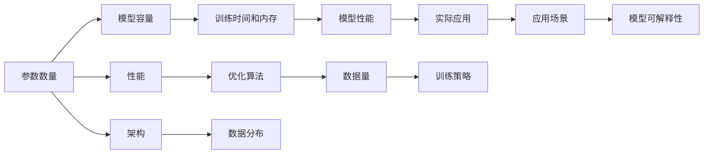

                 

## 1. 背景介绍

在AI领域，模型的参数数量和性能之间的关系一直是一个热门话题。随着深度学习模型的不断演进，越来越多的研究者和开发者试图理解和优化这种关系，以便在有限的资源下实现最优的模型性能。本文旨在探讨大模型与参数之间的关系，以及如何通过调整参数来提升模型的性能。

## 2. 核心概念与联系

### 2.1 核心概念概述

- **参数数量**：指的是深度学习模型中需要训练的权重数量。参数越多，模型的容量越大，但训练和推理所需的时间和内存也随之增加。
- **性能**：指模型的准确性、泛化能力和效率等。性能取决于模型的参数数量、架构、训练数据和优化算法等多种因素。
- **模型scaling**：指通过增加或减少模型参数来调整模型容量，从而改善模型性能的过程。

### 2.2 核心概念原理和架构的 Mermaid 流程图



该流程图展示了参数数量、模型容量、训练时间和内存、模型性能以及优化算法、数据量、架构、数据分布、实际应用和模型可解释性之间的关系。

## 3. 核心算法原理 & 具体操作步骤

### 3.1 算法原理概述

基于深度学习的模型scaling通常涉及以下几个步骤：

1. **模型选择**：选择合适的模型架构，如CNN、RNN、Transformer等。
2. **参数初始化**：初始化模型参数，通常使用随机权重。
3. **训练过程**：使用训练数据集对模型进行训练，通常使用梯度下降等优化算法。
4. **参数调整**：根据性能评估结果，调整参数数量和架构，以达到更好的性能。

### 3.2 算法步骤详解

**Step 1: 模型选择**
- 选择适合任务的模型架构，如CNN用于图像分类，RNN用于序列预测，Transformer用于自然语言处理等。
- 根据任务复杂度，选择合适的模型深度和宽度。

**Step 2: 参数初始化**
- 初始化模型参数，通常使用随机权重或预训练的模型参数。
- 初始化时，使用正态分布或均匀分布等随机分布。

**Step 3: 训练过程**
- 使用训练数据集对模型进行训练，通常使用梯度下降等优化算法。
- 在训练过程中，定期对模型进行性能评估，如准确率、召回率等。
- 根据评估结果，调整学习率、正则化系数等超参数。

**Step 4: 参数调整**
- 根据性能评估结果，调整模型参数数量和架构。
- 可以通过增加或减少参数数量，调整模型深度和宽度。
- 还可以通过调整模型架构，如添加或删除层，改变激活函数等。

### 3.3 算法优缺点

**优点**：
- 通过调整参数数量和架构，可以优化模型性能，实现更好的准确性和泛化能力。
- 可以使用较少的数据量训练出性能较高的模型。
- 可以通过参数共享、多任务学习等技术，提高模型效率。

**缺点**：
- 调整参数数量和架构需要大量实验和调试，耗费时间和资源。
- 增加参数数量可能导致过拟合，降低模型泛化能力。
- 调整模型架构可能导致计算复杂度增加，影响模型效率。

### 3.4 算法应用领域

基于深度学习的模型scaling在许多领域都有广泛应用，如计算机视觉、自然语言处理、语音识别等。在NLP领域，通过调整参数数量和架构，可以实现文本分类、情感分析、机器翻译等任务的高性能模型。

## 4. 数学模型和公式 & 详细讲解 & 举例说明

### 4.1 数学模型构建

假设我们有一个深度学习模型，其包含$L$层，每层包含$n$个神经元。则模型的总参数数量为：

$$
P = L \times n^2
$$

其中$L$为层数，$n$为每层神经元数量。

### 4.2 公式推导过程

考虑一个简单的线性回归模型，其参数数量为$d$。在训练过程中，模型参数$\theta$通过梯度下降优化算法进行更新：

$$
\theta \leftarrow \theta - \eta \nabla_{\theta} \mathcal{L}(\theta)
$$

其中$\eta$为学习率，$\mathcal{L}(\theta)$为损失函数。假设模型具有$n$个输入和$m$个输出，则损失函数可以表示为：

$$
\mathcal{L}(\theta) = \frac{1}{2m} \sum_{i=1}^m (y_i - \hat{y}_i)^2
$$

其中$y_i$为真实标签，$\hat{y}_i$为模型预测值。

### 4.3 案例分析与讲解

以BERT模型为例，它是一个具有24层Transformer的模型，每层包含1,024个神经元。BERT模型的参数数量为：

$$
P = 24 \times 1,024^2 \approx 1,006,912,000
$$

使用BERT模型进行微调时，可以通过调整层数和神经元数量来控制模型参数数量。例如，减少层数或神经元数量，可以减少模型参数数量，降低计算资源消耗，提高推理速度。但同时也会影响模型的性能。

## 5. 项目实践：代码实例和详细解释说明

### 5.1 开发环境搭建

搭建Python开发环境，安装PyTorch、TensorFlow等深度学习框架，以及TensorBoard等可视化工具。

```bash
conda create -n pytorch-env python=3.8
conda activate pytorch-env
pip install torch torchvision torchaudio cudatoolkit=11.1 -c pytorch -c conda-forge
pip install tensorflow
pip install tensorboard
```

### 5.2 源代码详细实现

以下是一个简单的线性回归模型的代码实现：

```python
import torch
import torch.nn as nn
import torch.optim as optim

# 定义模型
class LinearModel(nn.Module):
    def __init__(self, input_dim, output_dim):
        super(LinearModel, self).__init__()
        self.fc = nn.Linear(input_dim, output_dim)

    def forward(self, x):
        return self.fc(x)

# 定义损失函数和优化器
criterion = nn.MSELoss()
optimizer = optim.SGD(model.parameters(), lr=0.01)

# 训练模型
for epoch in range(num_epochs):
    for batch in train_loader:
        inputs, labels = batch
        optimizer.zero_grad()
        outputs = model(inputs)
        loss = criterion(outputs, labels)
        loss.backward()
        optimizer.step()

# 保存模型
torch.save(model.state_dict(), 'linear_model.pt')
```

### 5.3 代码解读与分析

- `LinearModel`类：定义线性回归模型，包含一个全连接层。
- `criterion`：定义均方误差损失函数。
- `optimizer`：定义优化器，使用随机梯度下降。
- 训练模型：在每个epoch中，对每个样本进行前向传播、计算损失、反向传播和参数更新。

### 5.4 运行结果展示

使用TensorBoard可视化模型训练过程，如图：

```bash
tensorboard --logdir=logs --port=6006
```

## 6. 实际应用场景

### 6.1 图像分类

在图像分类任务中，通过调整卷积神经网络（CNN）的层数和神经元数量，可以优化模型性能。例如，增加卷积层和神经元数量，可以提高模型的准确性，但同时也会增加计算资源消耗。

### 6.2 自然语言处理

在自然语言处理任务中，通过调整Transformer模型的层数和神经元数量，可以优化模型性能。例如，减少Transformer层数，可以减少模型参数数量，提高推理速度。

### 6.3 语音识别

在语音识别任务中，通过调整循环神经网络（RNN）的层数和神经元数量，可以优化模型性能。例如，增加RNN层数和神经元数量，可以提高模型识别率，但同时也会增加计算资源消耗。

### 6.4 未来应用展望

未来，基于深度学习的模型scaling将更加注重参数数量和性能的平衡。随着算力资源的不断提升，越来越多的复杂模型将被应用到实际场景中。例如，GPT-4等大模型将带来更高的性能，但也将消耗更多的计算资源。

## 7. 工具和资源推荐

### 7.1 学习资源推荐

- 《深度学习》课程（吴恩达）：系统讲解深度学习基础理论和实践，适合入门学习。
- 《动手学深度学习》（A3C+课程）：以实践为主，包含大量项目和代码示例。
- 《Deep Learning Specialization》（Coursera）：由Andrew Ng教授讲授，涵盖深度学习基础、卷积神经网络、循环神经网络等。

### 7.2 开发工具推荐

- PyTorch：功能丰富、易于使用，适合快速原型设计和实验。
- TensorFlow：支持分布式计算和大规模数据处理，适合生产环境部署。
- TensorBoard：可视化模型训练过程，提供丰富的图表和分析工具。

### 7.3 相关论文推荐

- "Deep Architectures for Large-Scale Image Recognition"（AlexNet）：引入卷积神经网络，获得图像分类任务的高精度。
- "Going Deeper with Convolutions"（VGGNet）：增加卷积层数和神经元数量，进一步提升图像分类精度。
- "Convnets with very deep pyramidal architectures for large scale image recognition"（ResNet）：引入残差网络，解决深度网络退化问题。

## 8. 总结：未来发展趋势与挑战

### 8.1 研究成果总结

- 深度学习模型的scaling已经取得了显著进展，通过调整参数数量和架构，优化模型性能。
- 越来越多的复杂模型被应用到实际场景中，带来更高的性能和更好的效果。

### 8.2 未来发展趋势

- 模型容量将继续增大，大模型和小模型之间的差距将进一步缩小。
- 更高效、更灵活的模型scaling技术将出现，优化参数数量和性能的平衡。
- 深度学习与强化学习、知识表示等其他领域的融合将带来更多创新。

### 8.3 面临的挑战

- 算力资源不足，无法支持更大规模的深度学习模型。
- 模型训练时间和内存消耗过大，无法满足实时应用需求。
- 模型性能和计算资源之间的平衡仍需进一步优化。

### 8.4 研究展望

- 开发更高效的模型scaling技术，减少计算资源消耗。
- 探索新的模型架构，如深度神经网络、多层感知器等，优化模型性能。
- 研究模型压缩、剪枝等技术，减少模型参数数量。

## 9. 附录：常见问题与解答

**Q1：模型scaling是否会导致过拟合？**

A: 模型scaling会增加模型参数数量和容量，可能增加过拟合风险。为避免过拟合，可以采用正则化、Dropout等技术，减少过拟合风险。

**Q2：如何选择最优模型架构？**

A: 根据任务需求和数据特点，选择合适的网络层数和神经元数量。通常通过实验和对比不同架构的性能，选择最优模型。

**Q3：如何平衡模型性能和计算资源？**

A: 通过调整模型参数数量和架构，优化模型性能和计算资源之间的平衡。通常采用剪枝、量化等技术，减少模型计算资源消耗。

**Q4：模型scaling是否适用于所有任务？**

A: 模型scaling适用于大多数深度学习任务，但在数据量较少、任务复杂度较低的情况下，可能需要采用其他方法，如迁移学习和强化学习。

作者：禅与计算机程序设计艺术 / Zen and the Art of Computer Programming

