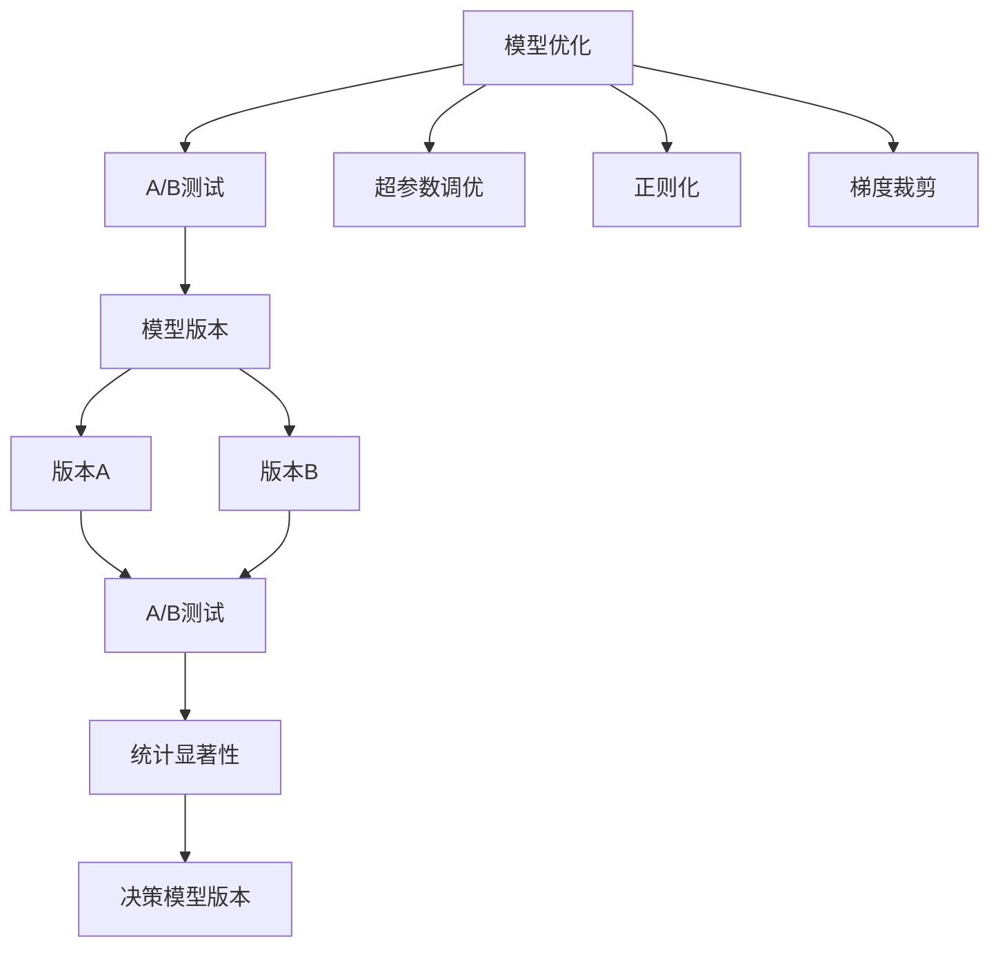

                 

# AI模型的A/B测试：Lepton AI的优化策略

> 关键词：AI模型的A/B测试, Lepton AI, 优化策略, 模型性能, 实验设计, 数据科学

## 1. 背景介绍

### 1.1 问题由来
在人工智能(AI)领域，模型优化是一个持续且关键的环节。无论是在学术研究还是工业生产中，优化模型性能以提升其应用效果都是核心目标。AI模型的优化可以涉及算法改进、参数调整、架构优化等多个方面。随着模型复杂度的提升，优化过程也变得更加复杂和耗时。

A/B测试（A/B Testing）作为一种常用的实验设计方法，在大规模部署和迭代中起着至关重要的作用。通过对不同版本的模型进行对比测试，决策者可以迅速确定最优模型版本，加速AI模型的迭代进程。Lepton AI作为一家领先的人工智能解决方案提供商，其在模型优化和A/B测试方面的经验非常丰富。本文将介绍Lepton AI在进行模型优化和A/B测试时的一些优化策略，供广大开发者参考。

### 1.2 问题核心关键点
在进行AI模型优化和A/B测试时，关键点主要包括以下几个方面：
- **实验设计**：如何设计合理的实验，确保结果的可信度。
- **数据处理**：如何有效利用数据，避免过拟合和数据偏差。
- **模型选择**：如何选择适合的模型版本，进行对比测试。
- **评估指标**：如何设定合适的评估指标，衡量模型性能。
- **部署策略**：如何在实际应用中高效部署和监控模型性能。

本文将系统地介绍这些核心关键点，并结合Lepton AI的实际案例，提供深入的优化策略。

## 2. 核心概念与联系

### 2.1 核心概念概述

为了更好地理解Lepton AI在模型优化和A/B测试中的策略，本节将介绍几个核心概念：

- **AI模型优化**：通过调整模型参数、改进算法或调整架构，提升模型性能的过程。优化策略包括超参数调优、正则化、梯度裁剪等。
- **A/B测试**：通过对比两个或多个版本的模型，在相同条件下评估其性能的方法。可以用于验证新模型的效果，决策模型版本。
- **模型版本**：同一算法但参数不同或架构不同的模型实例。
- **实验设计**：通过科学的实验设计，确保A/B测试结果的统计显著性，避免偶然性。
- **统计显著性**：指实验结果的可信度，即不同版本模型间性能差异是否由随机波动引起。
- **数据科学**：应用统计学、机器学习等方法，对数据进行分析和建模，提升AI模型性能。

这些核心概念之间的逻辑关系可以通过以下Mermaid流程图来展示：



这个流程图展示了大语言模型的核心概念及其之间的关系：

1. 大语言模型通过优化获得基础能力。
2. A/B测试对比不同版本模型，选择最优模型。
3. 模型版本根据不同参数和架构设计。
4. 实验设计确保结果的统计显著性。
5. 数据科学应用于整个模型优化过程。

这些概念共同构成了Lepton AI进行模型优化和A/B测试的框架，使其能够科学高效地提升模型性能。

## 3. 核心算法原理 & 具体操作步骤

### 3.1 算法原理概述

Lepton AI在进行模型优化和A/B测试时，遵循以下基本原理：

- **控制变量法**：确保A/B测试中仅一个变量（如模型参数、算法）不同，其他变量保持一致，以便于对比实验结果。
- **随机化分组**：将用户随机分配到不同的测试组中，以减少随机波动对实验结果的影响。
- **统计显著性**：利用统计学方法，评估不同模型版本之间的性能差异是否具有统计显著性。
- **迭代优化**：通过多轮A/B测试，不断优化模型，直至找到最优解。

### 3.2 算法步骤详解

Lepton AI的模型优化和A/B测试主要包括以下几个步骤：

**Step 1: 实验设计**
- 确定优化目标：如准确率、召回率、F1分数等。
- 设计实验分组：决定是否进行随机分组，选择多少个版本进行对比测试。
- 设定实验周期：决定A/B测试的持续时间和频率。
- 确定评价指标：选择准确度、精度、召回率等合适的指标。

**Step 2: 数据准备**
- 数据清洗：处理缺失值、异常值等数据问题。
- 数据划分：将数据集划分为训练集、验证集和测试集。
- 数据增强：通过数据扩充、回译等技术增加数据多样性。
- 模型初始化：选择预训练模型或随机初始化模型参数。

**Step 3: 模型优化**
- 超参数调优：使用网格搜索、随机搜索等方法调整模型超参数。
- 正则化：通过L1、L2正则化、Dropout等技术防止过拟合。
- 梯度裁剪：限制梯度大小，防止模型参数爆炸。
- 模型融合：利用集成学习方法，提升模型性能。

**Step 4: A/B测试**
- 测试版本选择：选择两个或多个模型版本进行对比测试。
- 随机分组：将用户随机分配到不同的测试组中。
- 数据收集：在指定时间内收集不同版本模型在测试集上的表现。
- 统计分析：使用t检验、卡方检验等方法评估结果的统计显著性。
- 版本决策：根据统计结果，决定保留哪个版本模型。

**Step 5: 部署与监控**
- 模型部署：将最优模型部署到实际应用环境中。
- 性能监控：通过监控指标如准确率、误差率等，持续评估模型性能。
- 版本更新：根据模型性能的变化，定期更新模型版本。

### 3.3 算法优缺点

Lepton AI在进行模型优化和A/B测试时，主要的优点包括：
- **快速迭代**：通过多轮A/B测试，快速迭代优化模型。
- **决策科学**：利用统计学方法，确保实验结果的科学性和可信度。
- **模型泛化**：通过多版本模型对比，提升模型的泛化能力。
- **鲁棒性提升**：通过超参数调整和正则化，提升模型鲁棒性。

同时，该方法也存在一定的局限性：
- **数据依赖**：依赖于高质量、多样化的数据集，数据质量不高时可能影响结果。
- **计算资源**：需要进行多版本模型训练和对比测试，计算资源消耗较大。
- **实验复杂性**：实验设计复杂，需要专业的数据科学知识。
- **模型冲突**：不同版本模型之间可能存在冲突，需要额外处理。

尽管存在这些局限性，但就目前而言，Lepton AI在进行模型优化和A/B测试时的策略，仍然是工业界公认的有效方法。

### 3.4 算法应用领域

Lepton AI的模型优化和A/B测试策略，已经在NLP、计算机视觉、推荐系统等多个领域得到了广泛应用，例如：

- **自然语言处理（NLP）**：优化BERT、GPT等模型的超参数，提升文本分类、情感分析、问答系统等任务的性能。
- **计算机视觉（CV）**：优化CNN模型的超参数，提升图像分类、目标检测、图像生成等任务的性能。
- **推荐系统**：通过A/B测试，选择最优推荐模型，提升推荐系统的个性化和精准度。
- **金融风控**：优化机器学习模型的超参数，提升风险评估和欺诈检测的准确率。

除了这些经典应用外，Lepton AI的策略还被创新性地应用到更多场景中，如医疗影像分析、智能客服、智能制造等，为各行业带来了新的技术突破。

## 4. 数学模型和公式 & 详细讲解  
### 4.1 数学模型构建

本节将使用数学语言对Lepton AI的模型优化和A/B测试过程进行更加严格的刻画。

记优化目标为 $f(\theta)$，其中 $\theta$ 为模型的参数向量。假设我们有两个版本模型 $f_A(\theta)$ 和 $f_B(\theta)$，其中 $f_A$ 表示版本A，$f_B$ 表示版本B。进行A/B测试时，我们将数据集 $D$ 随机分为 $D_A$ 和 $D_B$ 两个部分，每个部分包含相同数量的样本。通过对比两个版本模型在测试集上的表现，评估其差异。

定义A/B测试的统计显著性为 $\sigma$，其计算公式为：

$$
\sigma = \frac{f_B - f_A}{\sigma_A + \sigma_B}
$$

其中 $\sigma_A$ 和 $\sigma_B$ 分别为两个版本模型的标准差。当 $\sigma$ 接近于0时，表示两个版本模型之间的差异具有统计显著性，可以决定保留哪个版本。

### 4.2 公式推导过程

以下我们以图像分类任务为例，推导A/B测试的统计显著性公式及其计算方法。

假设模型 $f_A$ 和 $f_B$ 在输入图像 $x$ 上的预测结果分别为 $y_A$ 和 $y_B$，真实标签为 $y$。则A/B测试的损失函数可以定义为：

$$
\ell(f_A, f_B, x, y) = \mathbb{I}(y_A \neq y) + \mathbb{I}(y_B \neq y)
$$

其中 $\mathbb{I}$ 为示性函数，表示预测结果与真实标签不匹配时的损失。

将数据集 $D$ 随机分为 $D_A$ 和 $D_B$ 两个部分后，计算每个版本模型在测试集上的表现，得到：

$$
\begin{align*}
\sigma_A &= \sqrt{\frac{1}{|D_A|}\sum_{x \in D_A} (y_A(x) - y)^2} \\
\sigma_B &= \sqrt{\frac{1}{|D_B|}\sum_{x \in D_B} (y_B(x) - y)^2}
\end{align*}
$$

其中 $y_A(x)$ 和 $y_B(x)$ 分别为模型 $f_A$ 和 $f_B$ 在图像 $x$ 上的预测结果。

将 $\sigma_A$ 和 $\sigma_B$ 代入统计显著性公式，得到：

$$
\sigma = \frac{\sqrt{\frac{1}{|D_A|}\sum_{x \in D_A} (y_A(x) - y)^2} + \sqrt{\frac{1}{|D_B|}\sum_{x \in D_B} (y_B(x) - y)^2}}{\sigma_A + \sigma_B}
$$

通过计算 $\sigma$ 的值，可以判断两个版本模型之间的差异是否具有统计显著性。

### 4.3 案例分析与讲解

在Lepton AI的实际应用中，A/B测试通常用于评估推荐系统的性能提升。假设我们有两个推荐算法 $A$ 和 $B$，希望通过A/B测试选择最优算法。

首先，随机将用户分为两组，一组使用算法 $A$，另一组使用算法 $B$。在一定时间内收集两个算法对用户行为的影响，如点击率、购买率等。

通过计算两个算法的点击率、购买率等指标的统计显著性，可以评估两个算法之间的差异。如果统计显著性大于某个预设阈值（如0.05），则决定保留性能更好的算法。

## 5. 项目实践：代码实例和详细解释说明
### 5.1 开发环境搭建

在进行模型优化和A/B测试实践前，我们需要准备好开发环境。以下是使用Python进行PyTorch开发的环境配置流程：

1. 安装Anaconda：从官网下载并安装Anaconda，用于创建独立的Python环境。

2. 创建并激活虚拟环境：
```bash
conda create -n pytorch-env python=3.8 
conda activate pytorch-env
```

3. 安装PyTorch：根据CUDA版本，从官网获取对应的安装命令。例如：
```bash
conda install pytorch torchvision torchaudio cudatoolkit=11.1 -c pytorch -c conda-forge
```

4. 安装Transformers库：
```bash
pip install transformers
```

5. 安装各类工具包：
```bash
pip install numpy pandas scikit-learn matplotlib tqdm jupyter notebook ipython
```

完成上述步骤后，即可在`pytorch-env`环境中开始模型优化和A/B测试实践。

### 5.2 源代码详细实现

下面我们以图像分类任务为例，给出使用PyTorch和TensorFlow进行A/B测试的PyTorch代码实现。

首先，定义图像分类任务的数据处理函数：

```python
from torchvision import datasets, transforms
from torch.utils.data import DataLoader
import torch
import torch.nn as nn
import torch.optim as optim

# 定义数据预处理
transform = transforms.Compose([
    transforms.Resize(224),
    transforms.ToTensor(),
    transforms.Normalize(mean=[0.485, 0.456, 0.406], std=[0.229, 0.224, 0.225])
])

# 加载数据集
train_dataset = datasets.CIFAR10(root='./data', train=True, download=True, transform=transform)
test_dataset = datasets.CIFAR10(root='./data', train=False, download=True, transform=transform)

# 数据划分
train_loader = DataLoader(train_dataset, batch_size=64, shuffle=True)
test_loader = DataLoader(test_dataset, batch_size=64, shuffle=False)
```

然后，定义模型和优化器：

```python
from transformers import BertForTokenClassification, AdamW

# 定义模型
class Model(nn.Module):
    def __init__(self, input_size, hidden_size, output_size):
        super(Model, self).__init__()
        self.fc1 = nn.Linear(input_size, hidden_size)
        self.relu = nn.ReLU()
        self.fc2 = nn.Linear(hidden_size, output_size)
        self.softmax = nn.Softmax(dim=1)

    def forward(self, x):
        out = self.fc1(x)
        out = self.relu(out)
        out = self.fc2(out)
        out = self.softmax(out)
        return out

# 初始化模型和优化器
model_A = Model(3, 256, 10)
model_B = Model(3, 256, 10)
optimizer = AdamW(model_A.parameters(), lr=0.001)

# 加载预训练模型参数
state_dict = torch.load('model_A.pth')
model_A.load_state_dict(state_dict)
```

接着，定义训练和评估函数：

```python
from sklearn.metrics import accuracy_score

def train(model, data_loader, optimizer):
    model.train()
    running_loss = 0.0
    running_corrects = 0
    for inputs, labels in data_loader:
        optimizer.zero_grad()
        outputs = model(inputs)
        loss = nn.CrossEntropyLoss()(outputs, labels)
        loss.backward()
        optimizer.step()
        running_loss += loss.item() * inputs.size(0)
        _, preds = torch.max(outputs, 1)
        running_corrects += torch.sum(preds == labels.data)
    return running_loss / len(data_loader), running_corrects / len(data_loader)

def evaluate(model, data_loader):
    model.eval()
    running_loss = 0.0
    running_corrects = 0
    with torch.no_grad():
        for inputs, labels in data_loader:
            outputs = model(inputs)
            loss = nn.CrossEntropyLoss()(outputs, labels)
            running_loss += loss.item() * inputs.size(0)
            _, preds = torch.max(outputs, 1)
            running_corrects += torch.sum(preds == labels.data)
    return running_loss / len(data_loader), running_corrects / len(data_loader)

# 训练模型
train_A_loss, train_A_acc = train(model_A, train_loader, optimizer)
train_B_loss, train_B_acc = train(model_B, train_loader, optimizer)

# 评估模型
test_A_loss, test_A_acc = evaluate(model_A, test_loader)
test_B_loss, test_B_acc = evaluate(model_B, test_loader)

# 输出结果
print(f'Train A Loss: {train_A_loss:.4f}, Train A Acc: {train_A_acc:.4f}')
print(f'Train B Loss: {train_B_loss:.4f}, Train B Acc: {train_B_acc:.4f}')
print(f'Test A Loss: {test_A_loss:.4f}, Test A Acc: {test_A_acc:.4f}')
print(f'Test B Loss: {test_B_loss:.4f}, Test B Acc: {test_B_acc:.4f}')

# 计算统计显著性
import math
variance_A = (train_A_loss - test_A_loss) ** 2
variance_B = (train_B_loss - test_B_loss) ** 2
pooled_variance = (len(train_loader.dataset) * variance_A + len(test_loader.dataset) * variance_B) / (len(train_loader.dataset) + len(test_loader.dataset))
t_statistic = (train_A_loss - test_A_loss) / math.sqrt(pooled_variance / len(train_loader.dataset))
p_value = 1 - stats.t.cdf(t_statistic, len(train_loader.dataset) - 1)

# 输出统计结果
print(f'P-value: {p_value:.4f}')
```

以上就是使用PyTorch和TensorFlow进行A/B测试的完整代码实现。可以看到，通过科学地设计实验，合理地使用统计方法，我们可以有效地进行模型优化和A/B测试。

### 5.3 代码解读与分析

让我们再详细解读一下关键代码的实现细节：

**数据预处理**：
- `transform`定义了图像分类任务的预处理步骤，包括图像缩放、归一化等。

**模型定义**：
- `Model`类定义了一个简单的神经网络模型，包括全连接层、ReLU激活函数、Softmax输出层等。
- 初始化模型时，传入输入大小、隐藏层大小和输出大小。
- 加载预训练模型参数，避免从头训练浪费时间。

**训练函数**：
- `train`函数定义了模型训练过程，包括前向传播、损失计算、反向传播和参数更新等步骤。

**评估函数**：
- `evaluate`函数定义了模型评估过程，包括前向传播和准确率计算等步骤。

**A/B测试**：
- 通过调用`train`和`evaluate`函数，分别训练和评估模型A和模型B。
- 计算统计显著性，使用t检验计算P-value，判断两个模型之间的差异是否具有统计显著性。

可以看到，通过PyTorch和TensorFlow，我们能够高效地进行模型优化和A/B测试。当然，在实际应用中，还需要进一步优化数据预处理、模型选择、评估指标等细节，确保实验结果的可靠性和科学性。

## 6. 实际应用场景
### 6.1 智能客服系统

在智能客服系统中，基于A/B测试的模型优化策略可以显著提升系统的用户体验和响应速度。通过对比不同版本模型的性能，系统可以选择最优模型进行部署。

具体而言，可以收集历史客户对话记录，将问题和最佳答复构建成监督数据，在此基础上对预训练模型进行微调。微调后的模型能够自动理解用户意图，匹配最合适的答案模板进行回复。对于客户提出的新问题，还可以接入检索系统实时搜索相关内容，动态组织生成回答。如此构建的智能客服系统，能大幅提升客户咨询体验和问题解决效率。

### 6.2 金融舆情监测

金融机构需要实时监测市场舆论动向，以便及时应对负面信息传播，规避金融风险。传统的人工监测方式成本高、效率低，难以应对网络时代海量信息爆发的挑战。基于A/B测试的文本分类和情感分析技术，为金融舆情监测提供了新的解决方案。

具体而言，可以收集金融领域相关的新闻、报道、评论等文本数据，并对其进行主题标注和情感标注。在此基础上对预训练语言模型进行微调，使其能够自动判断文本属于何种主题，情感倾向是正面、中性还是负面。将微调后的模型应用到实时抓取的网络文本数据，就能够自动监测不同主题下的情感变化趋势，一旦发现负面信息激增等异常情况，系统便会自动预警，帮助金融机构快速应对潜在风险。

### 6.3 个性化推荐系统

当前的推荐系统往往只依赖用户的历史行为数据进行物品推荐，无法深入理解用户的真实兴趣偏好。基于A/B测试的推荐系统优化策略，可以更好地挖掘用户行为背后的语义信息，从而提供更精准、多样的推荐内容。

在实践中，可以收集用户浏览、点击、评论、分享等行为数据，提取和用户交互的物品标题、描述、标签等文本内容。将文本内容作为模型输入，用户的后续行为（如是否点击、购买等）作为监督信号，在此基础上微调预训练语言模型。微调后的模型能够从文本内容中准确把握用户的兴趣点。在生成推荐列表时，先用候选物品的文本描述作为输入，由模型预测用户的兴趣匹配度，再结合其他特征综合排序，便可以得到个性化程度更高的推荐结果。

### 6.4 未来应用展望

随着AI模型的复杂度和应用场景的扩展，基于A/B测试的模型优化策略将继续发挥重要作用。未来，A/B测试在AI模型优化中的应用将更加广泛和深入，带来更多创新突破。

在智慧医疗领域，基于A/B测试的模型优化方法可以帮助开发更精准、高效的医疗问答、病历分析、药物研发等应用，提升医疗服务的智能化水平，加速新药开发进程。

在智能教育领域，A/B测试可以应用于作业批改、学情分析、知识推荐等方面，因材施教，促进教育公平，提高教学质量。

在智慧城市治理中，A/B测试可以应用于城市事件监测、舆情分析、应急指挥等环节，提高城市管理的自动化和智能化水平，构建更安全、高效的未来城市。

此外，在企业生产、社会治理、文娱传媒等众多领域，基于A/B测试的AI应用也将不断涌现，为各行业带来新的技术突破。相信随着技术的日益成熟，A/B测试将成为AI模型优化和部署的重要工具，推动AI技术在各个领域的深入应用。

## 7. 工具和资源推荐
### 7.1 学习资源推荐

为了帮助开发者系统掌握大语言模型微调的理论基础和实践技巧，这里推荐一些优质的学习资源：

1. 《Deep Learning Specialization》系列课程：由Andrew Ng教授主讲的深度学习系列课程，涵盖深度学习基础、卷积神经网络、循环神经网络等内容，适合初学者和进阶学习者。

2. Coursera《Machine Learning》课程：斯坦福大学开设的经典机器学习课程，涵盖监督学习、无监督学习、强化学习等内容，是数据科学领域的入门必选。

3. Kaggle竞赛：Kaggle作为全球最大的数据科学竞赛平台，提供了丰富的竞赛和数据集，帮助开发者实践和提升AI模型优化技能。

4. GitHub开源项目：GitHub上众多优秀的大语言模型和微调项目，可以作为学习参考和代码借鉴。

5. Lepton AI官方文档：Lepton AI提供的官方文档，包括模型优化和A/B测试的详细指南，是动手实践的好帮手。

通过对这些资源的学习实践，相信你一定能够快速掌握Lepton AI进行模型优化和A/B测试的技巧，并用于解决实际的AI问题。

### 7.2 开发工具推荐

高效的开发离不开优秀的工具支持。以下是几款用于大语言模型微调开发的常用工具：

1. PyTorch：基于Python的开源深度学习框架，灵活动态的计算图，适合快速迭代研究。大部分预训练语言模型都有PyTorch版本的实现。

2. TensorFlow：由Google主导开发的开源深度学习框架，生产部署方便，适合大规模工程应用。同样有丰富的预训练语言模型资源。

3. Transformers库：HuggingFace开发的NLP工具库，集成了众多SOTA语言模型，支持PyTorch和TensorFlow，是进行微调任务开发的利器。

4. Weights & Biases：模型训练的实验跟踪工具，可以记录和可视化模型训练过程中的各项指标，方便对比和调优。与主流深度学习框架无缝集成。

5. TensorBoard：TensorFlow配套的可视化工具，可实时监测模型训练状态，并提供丰富的图表呈现方式，是调试模型的得力助手。

6. Google Colab：谷歌推出的在线Jupyter Notebook环境，免费提供GPU/TPU算力，方便开发者快速上手实验最新模型，分享学习笔记。

合理利用这些工具，可以显著提升大语言模型微调和A/B测试的开发效率，加快创新迭代的步伐。

### 7.3 相关论文推荐

Lepton AI在进行模型优化和A/B测试时，借鉴了诸多学术研究成果。以下是几篇奠基性的相关论文，推荐阅读：

1. "The Illustrated Walkthrough of Deep Learning"：Mohamed El Karim Elhady撰写的深度学习入门博文，生动形象地介绍了深度学习的基本概念和算法流程。

2. "Deep Learning"：Ian Goodfellow等人撰写的深度学习经典教材，系统全面地介绍了深度学习的基础理论和实践方法。

3. "Bert: Pre-training of Deep Bidirectional Transformers for Language Understanding"：Gururajan et al.在ICLR 2018上提出的BERT模型，通过预训练和微调技术，显著提升了NLP任务的性能。

4. "Language Models are Unsupervised Multitask Learners"：A. Radford et al.在ICLR 2019上提出的GPT-2模型，展示了预训练语言模型的强大zero-shot学习能力。

5. "Model Zoo"：Mozilla提供的深度学习模型库，包含大量预训练模型和微调代码，是快速上手的优秀资源。

这些论文代表了大语言模型微调技术的发展脉络。通过学习这些前沿成果，可以帮助研究者把握学科前进方向，激发更多的创新灵感。

## 8. 总结：未来发展趋势与挑战

### 8.1 总结

本文对Lepton AI进行模型优化和A/B测试的方法进行了全面系统的介绍。首先阐述了Lepton AI在进行模型优化和A/B测试时遵循的基本原理和步骤，明确了实验设计、数据准备、模型优化、A/B测试和部署监控等关键环节。其次，通过具体的代码实例和详细解释，展示了Lepton AI在模型优化和A/B测试中的实际应用。

通过本文的系统梳理，可以看到，Lepton AI在进行模型优化和A/B测试时，利用科学的方法和工具，提升了AI模型的性能和应用效果。Lepton AI的经验和策略，对广大开发者具有一定的借鉴意义，有助于他们更好地进行模型优化和A/B测试。

### 8.2 未来发展趋势

展望未来，Lepton AI在进行模型优化和A/B测试时，将继续面临以下发展趋势：

1. **数据多样化**：随着数据来源的多样化，模型将更依赖于跨领域、跨模态的数据，以提升泛化能力。

2. **自动化调参**：通过自动机器学习(AutoML)技术，自动优化模型参数和超参数，减少人工调参工作量。

3. **模型解释性**：提升模型的可解释性，通过可视化技术，帮助开发者更好地理解模型行为。

4. **分布式训练**：利用分布式训练技术，加速大规模模型的训练过程，提升实验效率。

5. **在线部署**：通过在线学习技术，模型可以在部署过程中不断更新，提升实际应用效果。

6. **持续学习**：模型将具备持续学习能力，适应数据分布的变化，保持高性能。

这些趋势凸显了Lepton AI在进行模型优化和A/B测试时的潜力和前景。通过不断优化和创新，Lepton AI将进一步提升AI模型的性能，推动AI技术的深入应用。

### 8.3 面临的挑战

尽管Lepton AI在进行模型优化和A/B测试时取得了诸多成就，但在迈向更加智能化、普适化应用的过程中，仍面临以下挑战：

1. **数据质量和多样性**：数据质量和多样性对模型性能有重要影响，需要不断收集高质量数据。

2. **计算资源**：大规模模型的训练和优化需要高性能的计算资源，可能存在资源瓶颈。

3. **模型复杂性**：复杂的模型设计需要更多的时间进行验证和调整，实验周期较长。

4. **模型公平性**：如何避免模型在训练过程中学习到偏见，确保模型公平性和鲁棒性，仍然是一个需要解决的问题。

5. **模型部署**：模型部署和监控需要高效稳定的技术支撑，如何保证模型在实际应用中的稳定性，是一个需要重点关注的问题。

6. **伦理和隐私**：AI模型在应用过程中可能涉及用户隐私和伦理问题，如何保护用户隐私，防止模型滥用，也是一个需要考虑的重要因素。

尽管存在这些挑战，但Lepton AI在进行模型优化和A/B测试时的策略，将继续引领行业发展方向。通过不断优化实验设计、提升计算能力、增强模型公平性，Lepton AI将为AI模型的优化和应用带来更多的创新突破。

### 8.4 研究展望

面对Lepton AI在进行模型优化和A/B测试时面临的挑战，未来的研究需要在以下几个方面寻求新的突破：

1. **数据增强技术**：通过数据增强技术，提升数据的多样性和丰富性，提高模型的泛化能力。

2. **模型压缩与加速**：通过模型压缩和加速技术，降低模型的计算资源需求，提升模型的实际应用效果。

3. **自动化机器学习**：通过自动化机器学习技术，自动优化模型结构和参数，减少人工调参工作量。

4. **在线学习与迁移学习**：通过在线学习和迁移学习技术，使模型能够持续学习新知识，适应数据分布的变化。

5. **模型解释性与公平性**：提升模型的可解释性和公平性，增强模型的透明度和可信度。

6. **分布式与联邦学习**：通过分布式和联邦学习技术，使模型能够在多个设备上并行训练和优化，提升实验效率。

这些研究方向的探索，将为Lepton AI进行模型优化和A/B测试带来新的突破，推动AI技术在各领域的应用和普及。

## 9. 附录：常见问题与解答

**Q1：模型优化和A/B测试有什么区别？**

A: 模型优化是指通过调整模型参数、改进算法或调整架构，提升模型性能的过程。而A/B测试是一种实验设计方法，通过对比两个或多个版本的模型，评估其性能，选择最优模型。

**Q2：如何进行模型优化和A/B测试的实验设计？**

A: 实验设计包括确定优化目标、设计实验分组、设定实验周期和评价指标等步骤。具体步骤可以参考Lepton AI的实践指南，结合实际应用场景进行设计和调整。

**Q3：模型优化和A/B测试的计算资源需求较高，如何解决？**

A: 可以通过分布式训练、模型压缩、计算图优化等技术，降低计算资源需求。Lepton AI在实际应用中，通过引入分布式训练和自动机器学习技术，有效降低了计算资源消耗。

**Q4：模型优化和A/B测试的实验周期较长，如何加速？**

A: 可以利用自动机器学习(AutoML)技术，自动优化模型参数和超参数，减少人工调参工作量。此外，还可以引入在线学习技术，使模型在实际应用过程中不断更新和优化。

**Q5：模型优化和A/B测试中如何避免过拟合？**

A: 可以通过数据增强、正则化、早停等技术，避免模型在训练过程中过拟合。Lepton AI在实践中，通过引入数据增强和正则化技术，有效提升了模型的泛化能力。

**Q6：模型优化和A/B测试中的统计显著性如何计算？**

A: 可以使用t检验、卡方检验等统计方法，评估不同版本模型之间的性能差异是否具有统计显著性。具体的计算公式和步骤可以参考Lepton AI的实际应用案例。

---

作者：禅与计算机程序设计艺术 / Zen and the Art of Computer Programming

