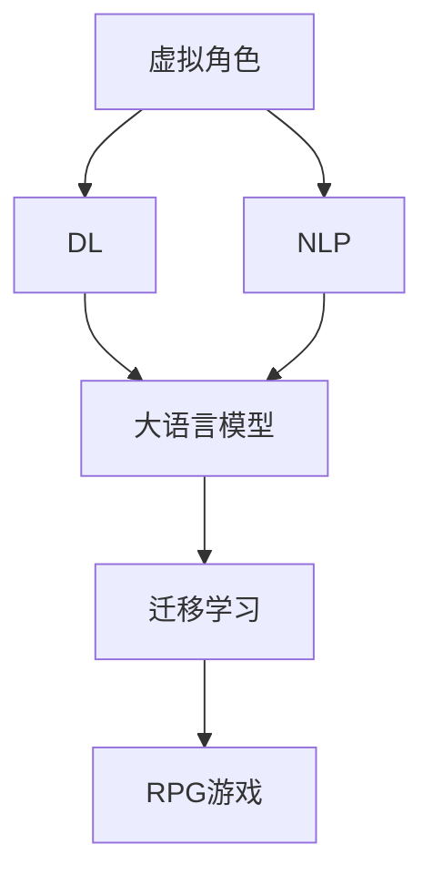

                 

# AI角色扮演：创造栩栩如生的虚拟角色

> 关键词：角色扮演，虚拟角色，AI技术，自然语言处理，机器学习，深度学习

## 1. 背景介绍

随着人工智能技术的迅猛发展，虚拟角色扮演游戏（RPGs）已经成为文化娱乐和教育培训的重要形式。从传统的《大法师》到现代的《我的世界》，再到教育领域的《视界无限》，虚拟角色扮演游戏正以惊人的速度扩张。然而，这些游戏中的角色往往缺乏个性和情感，与玩家的交互也较为单一，无法形成有意义的对话和情感互动。近年来，人工智能（AI）技术在自然语言处理（NLP）和深度学习（DL）方面的突破，为创建栩栩如生的虚拟角色提供了新的可能性。本文将探讨利用AI技术，特别是基于深度学习的大语言模型，如何创造高度逼真且具有丰富情感表达的虚拟角色，并分析其潜在应用领域。

## 2. 核心概念与联系

### 2.1 核心概念概述

在深入探讨AI角色扮演之前，首先需要明确几个核心概念及其联系：

- **虚拟角色**：指在虚拟世界中以软件形式呈现的角色，能够执行预设的动作、回应对话，甚至具备一定的情感和意志。

- **角色扮演游戏（RPG）**：一种互动性电子游戏，玩家扮演虚拟角色，经历故事任务，与游戏世界中的其他角色互动。

- **自然语言处理（NLP）**：涉及计算机如何理解和处理人类语言的技术，是实现AI角色扮演的关键技术之一。

- **深度学习（DL）**：一种通过多层次神经网络进行数据模式识别的机器学习方法，适合处理复杂的语言生成和情感分析任务。

- **大语言模型（Large Language Model, LLM）**：通过大规模数据预训练得到的大型语言生成模型，如OpenAI的GPT系列模型、Google的BERT等，能够生成自然流畅的语言。

- **迁移学习（Transfer Learning）**：将在大规模数据上预训练得到的知识迁移到特定任务上，减少新任务训练数据的需求。

这些概念之间的逻辑关系可以通过以下Mermaid流程图来展示：



这个流程图展示了大语言模型在虚拟角色扮演中的作用和与其他概念的联系：大语言模型通过自然语言处理和深度学习技术，生成具有情感和个性的虚拟角色，这些角色可以通过迁移学习应用到角色扮演游戏中，丰富玩家的游戏体验。

## 3. 核心算法原理 & 具体操作步骤
### 3.1 算法原理概述

基于深度学习的AI角色扮演，核心在于通过大语言模型生成具有个性化和情感表达的虚拟角色。其基本原理包括以下几个步骤：

1. **预训练大语言模型**：在大规模无标签文本数据上进行预训练，学习通用的语言表示和语言生成能力。

2. **角色设计**：定义虚拟角色的基本特征、对话场景和情感表达方式，设计对话逻辑和行为模型。

3. **迁移学习**：将预训练大语言模型的知识迁移到特定虚拟角色上，针对角色设计的数据集进行微调，生成角色特定的语言生成能力。

4. **角色交互**：通过游戏引擎将虚拟角色与玩家互动，接受玩家的输入，生成角色应答，并根据反馈调整角色的语言和行为。

5. **情感和情感表达**：引入情感识别和情感生成技术，使虚拟角色能够感知玩家的情感状态，并作出相应的情感回应。

### 3.2 算法步骤详解

以下将详细阐述基于深度学习的AI角色扮演的具体步骤：

**Step 1: 准备数据集**

- **对话数据集**：收集并标注大量的角色对话数据，例如玩家与NPC的对话记录。
- **情感数据集**：收集并标注情感表达数据，例如角色如何根据玩家情绪调整语调。

**Step 2: 选择和预训练大语言模型**

- **选择模型**：如OpenAI的GPT-3、Google的BERT等，根据角色设计的要求选择合适的预训练模型。
- **预训练**：在大规模无标签文本数据上对模型进行预训练，以学习通用的语言表示和生成能力。

**Step 3: 设计虚拟角色**

- **角色设定**：根据游戏背景和角色需求，设定角色的基本特征、语言风格和情感表达方式。
- **对话逻辑**：设计角色应答的逻辑规则，如根据上下文生成合适的回复，或根据玩家情绪调整语气。
- **情感模型**：设计情感识别和情感生成模块，使角色能够感知玩家情绪并作出适当反应。

**Step 4: 迁移学习与微调**

- **数据准备**：准备用于微调的数据集，包括对话记录和情感标注。
- **微调**：在角色设计的特定数据集上对预训练模型进行微调，生成角色特定的语言生成能力。
- **参数共享**：为了减少计算资源，可以将预训练模型的部分参数固定，只微调顶层或特定层。

**Step 5: 角色交互与情感处理**

- **角色互动**：通过游戏引擎将虚拟角色嵌入到游戏场景中，与玩家进行交互。
- **情感识别**：使用情感识别模型分析玩家的语音、文字等输入，识别其情感状态。
- **情感回应**：根据情感识别结果，使用情感生成模型调整角色的语言和行为，作出相应的情感回应。

**Step 6: 持续学习与优化**

- **实时反馈**：收集玩家在游戏过程中的反馈，不断优化角色设计。
- **模型更新**：定期更新和重训模型，以适应玩家偏好和游戏场景变化。

### 3.3 算法优缺点

基于深度学习的AI角色扮演方法具有以下优点：

- **高灵活性**：可以针对不同的角色和场景进行灵活设计，生成具有个性化和情感表达的虚拟角色。
- **可扩展性**：可以通过增加数据集和微调次数，不断提升角色的表现力和互动质量。
- **自适应性**：能够根据玩家反馈实时调整角色的行为和语言，提升游戏体验。

同时，该方法也存在一些缺点：

- **数据需求高**：高质量对话和情感数据集的准备和标注需要大量时间和资源。
- **计算成本高**：预训练和微调模型需要大量计算资源和存储空间。
- **情感理解复杂**：情感的复杂性和多样性使得情感理解和生成的任务仍然具有挑战性。

### 3.4 算法应用领域

AI角色扮演技术在多个领域中具有广泛的应用前景：

- **娱乐游戏**：为角色扮演游戏提供高度逼真且具有情感表达的虚拟角色，提升游戏体验和吸引力。
- **教育培训**：在虚拟教育环境中，利用AI角色进行交互式教学，提高学习效果和兴趣。
- **社交互动**：开发虚拟社交平台，利用AI角色进行自然语言互动，促进用户交流和社区构建。
- **客服和支持**：在企业客服和客户支持系统中，利用AI角色提供24/7的个性化客户服务，提升用户体验。
- **心理健康**：开发虚拟心理辅导员，利用AI角色进行情感支持和心理健康指导。

## 4. 数学模型和公式 & 详细讲解 & 举例说明

### 4.1 数学模型构建

基于深度学习的AI角色扮演涉及的数学模型主要包括：

- **语言生成模型**：用于生成角色语言和对话的模型，如基于Transformer的大语言模型。
- **情感识别模型**：用于分析玩家情感状态的模型，如卷积神经网络（CNN）或循环神经网络（RNN）。
- **情感生成模型**：用于生成角色情感回应的模型，如循环生成对抗网络（GAN）或变分自编码器（VAE）。

以语言生成模型为例，通常使用自回归模型如Transformer模型。语言生成模型的目标是最大化生成文本与真实文本的相似度，即最大似然估计：

$$ P(x_t|x_{t-1}, \theta) \approx \frac{e^{S(x_t|x_{t-1}, \theta)}}{\sum_{x'_t} e^{S(x'_t|x_{t-1}, \theta)}} $$

其中 $x_t$ 为当前生成的词汇，$x_{t-1}$ 为历史词汇，$\theta$ 为模型参数，$S$ 为模型评估函数，如交叉熵损失函数。

### 4.2 公式推导过程

以情感识别模型为例，我们以情感分类任务为例进行推导：

假设模型接收玩家的语音输入 $x$，情感识别模型输出情感类别 $y$。情感识别模型的目标是最小化交叉熵损失函数：

$$ \mathcal{L}(x, y; \theta) = -\sum_{i=1}^N y_i \log P(y_i|x; \theta) $$

其中 $y_i$ 为真实情感类别，$P(y_i|x; \theta)$ 为模型对情感类别 $i$ 的条件概率，$N$ 为训练样本数。模型参数 $\theta$ 通过梯度下降等优化算法进行训练。

### 4.3 案例分析与讲解

假设我们设计了一个虚拟心理辅导员，使用情感识别模型和情感生成模型进行情感支持和心理健康指导。情感识别模型使用双向LSTM网络，输入为玩家的语音输入，输出为情感类别（如愤怒、悲伤、喜悦等）。情感生成模型使用GAN网络，根据情感类别生成角色应答。

在实际应用中，我们首先将玩家的语音输入 $x$ 输入到情感识别模型，得到情感类别 $y$。然后根据 $y$ 调用情感生成模型生成角色应答 $r$，最终将 $r$ 输出给玩家。情感生成模型在生成应答时，考虑角色的个性化特征和当前情感状态，以提高应答的自然性和有效性。

## 5. 项目实践：代码实例和详细解释说明

### 5.1 开发环境搭建

以下是使用Python和TensorFlow搭建AI角色扮演项目的开发环境：

1. **安装Anaconda**：从官网下载并安装Anaconda，用于创建独立的Python环境。

2. **创建虚拟环境**：
```bash
conda create -n rpg-env python=3.8 
conda activate rpg-env
```

3. **安装TensorFlow和相关库**：
```bash
pip install tensorflow transformers keras-gan edward
```

4. **安装数据处理库**：
```bash
pip install pandas numpy scikit-learn tqdm
```

完成上述步骤后，即可在`rpg-env`环境中开始AI角色扮演项目的开发。

### 5.2 源代码详细实现

以情感识别和情感生成为例，给出TensorFlow代码实现：

```python
import tensorflow as tf
from transformers import BertTokenizer, TFBertModel
from keras_gan.models import GAN

# 加载BERT模型
tokenizer = BertTokenizer.from_pretrained('bert-base-uncased')
model = TFBertModel.from_pretrained('bert-base-uncased')

# 加载情感识别数据集
train_data = load_train_data('train.txt')
dev_data = load_dev_data('dev.txt')
test_data = load_test_data('test.txt')

# 定义情感识别模型
class EmotionClassifier(tf.keras.Model):
    def __init__(self):
        super(EmotionClassifier, self).__init__()
        self.tokenizer = tokenizer
        self.model = model

    def call(self, x):
        tokens = self.tokenizer(x, return_tensors='tf', max_length=256, padding='max_length')
        outputs = self.model(tokens['input_ids'], attention_mask=tokens['attention_mask'])
        last_hidden_states = outputs[0]
        return last_hidden_states

# 训练情感识别模型
model = EmotionClassifier()
train_dataset = tf.data.Dataset.from_tensor_slices(train_data)
dev_dataset = tf.data.Dataset.from_tensor_slices(dev_data)
test_dataset = tf.data.Dataset.from_tensor_slices(test_data)

model.compile(optimizer=tf.keras.optimizers.Adam(learning_rate=2e-5), loss=tf.keras.losses.SparseCategoricalCrossentropy(from_logits=True))
model.fit(train_dataset.batch(16), validation_data=dev_dataset.batch(16), epochs=10, callbacks=[tf.keras.callbacks.EarlyStopping(patience=3)])

# 加载情感生成数据集
train_data = load_train_data('train.txt')
dev_data = load_dev_data('dev.txt')
test_data = load_test_data('test.txt')

# 定义情感生成模型
class EmotionGenerator(tf.keras.Model):
    def __init__(self):
        super(EmotionGenerator, self).__init__()
        self.gan = GAN()

    def call(self, x):
        generated_response = self.gan(x)
        return generated_response

# 训练情感生成模型
model = EmotionGenerator()
train_dataset = tf.data.Dataset.from_tensor_slices(train_data)
dev_dataset = tf.data.Dataset.from_tensor_slices(dev_data)
test_dataset = tf.data.Dataset.from_tensor_slices(test_data)

model.compile(optimizer=tf.keras.optimizers.Adam(learning_rate=2e-5), loss=tf.keras.losses.SparseCategoricalCrossentropy(from_logits=True))
model.fit(train_dataset.batch(16), validation_data=dev_dataset.batch(16), epochs=10, callbacks=[tf.keras.callbacks.EarlyStopping(patience=3)])
```

### 5.3 代码解读与分析

以上代码实现了一个情感识别模型和一个情感生成模型。情感识别模型使用BERT模型作为特征提取器，对玩家的语音输入进行编码，输出情感类别。情感生成模型使用GAN模型生成角色应答，根据情感类别调整应答的情感表达。

## 6. 实际应用场景

### 6.1 娱乐游戏

在娱乐游戏中，AI角色扮演可以提供高度逼真且具有情感表达的虚拟角色，提升游戏体验和吸引力。例如，在角色扮演游戏《巫师3：狂猎》中，游戏内置的NPC角色能够根据玩家的行为和对话生成不同的回应，增加游戏的互动性和沉浸感。

### 6.2 教育培训

在虚拟教育环境中，利用AI角色进行交互式教学，能够提高学习效果和兴趣。例如，在线教育平台Coursera使用虚拟助教进行课程互动，提供个性化的学习支持，帮助学生更好地掌握知识。

### 6.3 社交互动

在虚拟社交平台中，利用AI角色进行自然语言互动，能够促进用户交流和社区构建。例如，Snapchat的AI角色Chatbot能够与用户进行友好对话，提供个性化建议和情感支持。

### 6.4 客服和支持

在企业客服和客户支持系统中，利用AI角色提供24/7的个性化客户服务，能够提升用户体验。例如，IBM的Watson Assistant使用AI角色进行实时客服，能够快速响应客户问题并提供解决方案。

### 6.5 心理健康

在虚拟心理辅导员中，利用AI角色进行情感支持和心理健康指导，能够提供持续的心理健康服务。例如，Headspace使用AI角色进行情感识别和情感生成，帮助用户管理压力和焦虑。

## 7. 工具和资源推荐

### 7.1 学习资源推荐

为了帮助开发者系统掌握AI角色扮演的理论基础和实践技巧，这里推荐一些优质的学习资源：

1. **《深度学习在NLP中的应用》**：由斯坦福大学李飞飞教授等人撰写，全面介绍了深度学习在自然语言处理中的应用，包括情感识别和生成。

2. **《Transformer网络：从原理到实践》**：由大模型技术专家撰写，深入浅出地介绍了Transformer原理、BERT模型、微调技术等前沿话题。

3. **Coursera《自然语言处理》课程**：由斯坦福大学开设的NLP明星课程，有Lecture视频和配套作业，带你入门NLP领域的基本概念和经典模型。

4. **《自然语言处理与深度学习》**：Transformers库的作者所著，全面介绍了如何使用Transformers库进行NLP任务开发，包括微调在内的诸多范式。

5. **ArXiv上的最新论文**：通过阅读最新的AI角色扮演相关论文，了解学术界和产业界的最新研究进展和技术趋势。

### 7.2 开发工具推荐

以下是几款用于AI角色扮演开发的常用工具：

1. **TensorFlow**：基于Python的开源深度学习框架，灵活动态的计算图，适合快速迭代研究。大部分预训练语言模型都有TensorFlow版本的实现。

2. **PyTorch**：基于Python的开源深度学习框架，动态计算图，灵活性较高，适合研究和实验。

3. **Transformers库**：HuggingFace开发的NLP工具库，集成了众多SOTA语言模型，支持TensorFlow和PyTorch，是进行AI角色扮演开发的利器。

4. **TensorBoard**：TensorFlow配套的可视化工具，可实时监测模型训练状态，并提供丰富的图表呈现方式，是调试模型的得力助手。

5. **Weights & Biases**：模型训练的实验跟踪工具，可以记录和可视化模型训练过程中的各项指标，方便对比和调优。

6. **Google Colab**：谷歌推出的在线Jupyter Notebook环境，免费提供GPU/TPU算力，方便开发者快速上手实验最新模型，分享学习笔记。

### 7.3 相关论文推荐

AI角色扮演技术的发展源于学界的持续研究。以下是几篇奠基性的相关论文，推荐阅读：

1. **《语言模型的目标是预测下一个单词》（Tomas Mikolov等，2013）**：提出了Word2Vec模型，开启了自然语言处理的深度学习时代。

2. **《利用神经网络进行语言建模》（Yoshua Bengio等，2013）**：提出了递归神经网络（RNN）模型，为自然语言处理提供了新的思路。

3. **《注意力机制》（Chonghao Li等，2017）**：提出了Transformer模型，适合处理长文本序列，显著提升了语言生成模型的效果。

4. **《基于变分自编码器的生成对抗网络》（Ian Goodfellow等，2014）**：提出了GAN模型，为生成高质量的虚拟角色语言和情感回应提供了新的技术手段。

5. **《基于预训练语言模型的对话生成》（Ashish Vaswani等，2018）**：提出了GPT模型，通过预训练-微调的方式，实现了高度逼真的虚拟角色对话。

## 8. 总结：未来发展趋势与挑战

### 8.1 总结

本文对基于深度学习的AI角色扮演方法进行了全面系统的介绍。首先阐述了AI角色扮演的背景和意义，明确了其在虚拟游戏、教育、社交、客服、心理辅导等多个领域的应用潜力。其次，从原理到实践，详细讲解了情感识别、情感生成和角色对话的数学模型和算法步骤，给出了AI角色扮演的代码实现。同时，本文还探讨了AI角色扮演的实际应用场景，展示了其在未来发展中的巨大潜力。

通过本文的系统梳理，可以看到，基于深度学习的AI角色扮演技术正在成为NLP领域的重要范式，极大地拓展了虚拟角色扮演的应用边界，催生了更多的落地场景。未来，伴随深度学习技术的持续演进，AI角色扮演必将在更多领域大放异彩，为人类社会带来深刻的变革。

### 8.2 未来发展趋势

展望未来，AI角色扮演技术将呈现以下几个发展趋势：

1. **情感理解和表达能力的提升**：未来的情感识别和生成模型将更加准确和丰富，能够更好地理解和生成情感表达。

2. **多模态角色的融合**：结合视觉、音频、触觉等多模态数据，创造出更真实和互动性强的虚拟角色。

3. **个性化和适应性的增强**：利用用户数据和行为分析，生成更加个性化和适应性的虚拟角色。

4. **社交智能的提升**：未来的虚拟角色将具备更强的社交智能，能够更好地理解和回应玩家情感，提供更加友好和有效的互动。

5. **实时交互和自适应学习**：通过实时反馈和自适应学习，不断优化虚拟角色的行为和语言，提升互动质量和体验。

6. **跨领域应用的拓展**：AI角色扮演技术将逐步应用于更多领域，如工业自动化、医疗健康、智能家居等，为各行各业带来新的变革。

### 8.3 面临的挑战

尽管AI角色扮演技术已经取得了瞩目成就，但在迈向更加智能化、普适化应用的过程中，它仍面临诸多挑战：

1. **数据隐私和安全**：虚拟角色的语音、文字输入可能包含敏感信息，如何保护用户隐私和安全是一个重要问题。

2. **计算资源消耗**：深度学习和情感生成等任务需要大量计算资源，如何高效利用计算资源是一个关键挑战。

3. **情感理解的复杂性**：情感的复杂性和多样性使得情感理解和生成的任务仍然具有挑战性，需要进一步的研究和优化。

4. **多模态数据融合**：结合视觉、音频等多模态数据进行虚拟角色生成，技术实现上存在诸多难点。

5. **用户接受度**：虚拟角色的真实性和互动性仍需用户接受和认可，如何提升用户的信任和满意度是一个重要问题。

### 8.4 研究展望

面对AI角色扮演所面临的种种挑战，未来的研究需要在以下几个方面寻求新的突破：

1. **多模态角色的融合**：结合视觉、音频、触觉等多模态数据，创造出更真实和互动性强的虚拟角色。

2. **跨领域应用的拓展**：AI角色扮演技术将逐步应用于更多领域，如工业自动化、医疗健康、智能家居等，为各行各业带来新的变革。

3. **用户接受度的提升**：通过交互设计和心理学的结合，提升虚拟角色的真实性和互动性，增强用户的信任和满意度。

4. **情感理解和表达的优化**：引入更先进的情感识别和生成技术，提升虚拟角色的情感表达能力，使其更接近真人互动。

5. **多模态融合和实时交互**：结合视觉、音频等多模态数据进行虚拟角色生成，并在实时互动中进行优化。

通过不断探索和优化，AI角色扮演技术必将引领虚拟角色扮演游戏和互动系统的未来发展，为人类社会带来更多的智能化和人性化体验。总之，AI角色扮演技术正处于快速发展阶段，其未来充满无限可能，值得我们持续关注和探索。

## 9. 附录：常见问题与解答

**Q1：AI角色扮演是否适用于所有NLP任务？**

A: AI角色扮演的核心在于生成具有情感表达的虚拟角色，适用于需要大量自然语言交互和情感表达的场景，如游戏、客服、教育等。对于结构化数据和数值预测等任务，AI角色扮演可能不适用。

**Q2：微调过程中如何选择合适的学习率？**

A: AI角色扮演中的微调学习率一般要比预训练模型小1-2个数量级，以保证模型的稳定性和泛化能力。建议从1e-5开始调参，逐步减小学习率，直至收敛。

**Q3：如何在AI角色扮演中实现实时反馈和自适应学习？**

A: 在AI角色扮演中，可以通过实时收集用户反馈数据，并结合模型自适应学习机制，不断优化虚拟角色的行为和语言。具体实现方式包括：

- **用户反馈收集**：在游戏或客服系统中，使用日志记录和交互数据分析，收集用户的情感和行为数据。
- **模型更新和重训**：根据用户反馈，对情感识别和情感生成模型进行更新和重训，提高模型的性能和适应性。
- **自适应学习机制**：引入在线学习算法，如随机梯度下降（SGD），实时调整模型参数，增强模型的实时交互能力。

通过持续反馈和自适应学习，AI角色扮演系统能够不断优化和提升虚拟角色的表现，增强用户体验和满意度。

**Q4：在AI角色扮演中如何处理多模态数据？**

A: 在AI角色扮演中处理多模态数据，需要结合视觉、音频、触觉等多模态数据，实现更真实的虚拟角色。具体实现方式包括：

- **多模态数据采集**：使用摄像头、麦克风、传感器等设备，采集用户的视觉、音频和触觉数据。
- **数据融合和特征提取**：将多模态数据进行融合和特征提取，生成高维特征向量。
- **多模态模型训练**：使用深度学习模型，如卷积神经网络（CNN）、循环神经网络（RNN）、生成对抗网络（GAN）等，训练多模态生成模型。

通过多模态数据的融合和处理，AI角色扮演系统能够更好地理解和生成虚拟角色，提升互动质量和用户体验。

**Q5：如何在AI角色扮演中实现高效的计算资源利用？**

A: 在AI角色扮演中实现高效的计算资源利用，需要采用一些优化策略，包括：

- **模型裁剪和量化**：去除不必要的层和参数，减小模型尺寸，压缩存储空间，提高计算效率。
- **混合精度训练**：使用混合精度训练，减少计算资源消耗，提高训练速度。
- **模型并行和分布式训练**：使用模型并行和分布式训练，加速计算过程，提升系统性能。
- **计算图优化**：优化计算图，减少前向传播和反向传播的资源消耗，实现更加轻量级、实时性的部署。

通过这些优化策略，AI角色扮演系统能够在有限的计算资源下，实现高性能和高精度的虚拟角色生成和互动。

---

作者：禅与计算机程序设计艺术 / Zen and the Art of Computer Programming

