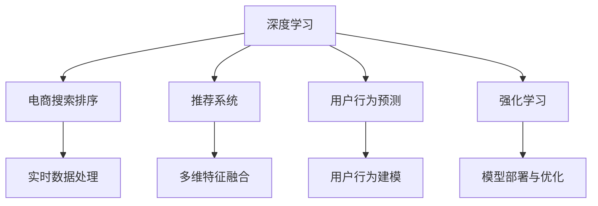

                 

# AI赋能的电商搜索排序算法优化

在电商领域，搜索排序算法是提升用户体验和平台转化率的关键。随着用户需求的多样化和个性化，传统的搜索排序算法已难以满足现代电商平台的需求。如何利用AI技术优化搜索排序算法，提升搜索排序的准确性和效率，成为当前电商领域的热点问题。本文将从背景介绍、核心概念、算法原理、项目实践、应用场景、工具资源推荐、总结展望等多个方面，系统性地介绍AI赋能的电商搜索排序算法优化技术。

## 1. 背景介绍

### 1.1 问题由来

电商平台的搜索排序功能是连接用户和商品的中枢，其排序结果直接影响用户体验和平台转化率。然而，由于用户需求的多样化和个性化，传统的基于关键词匹配的搜索排序算法已难以满足需求。

传统搜索排序算法往往以点击率、转化率等指标作为优化目标，注重点击率、相关性等短期目标，较少考虑用户的长期行为和偏好。此外，传统的搜索排序算法往往依赖人工特征工程，无法灵活处理海量、实时变化的数据。

AI技术的发展为电商搜索排序算法优化带来了新的机遇。通过引入深度学习等先进算法，电商搜索排序算法可以更好地理解用户需求，提升搜索排序的准确性和个性化程度。

### 1.2 问题核心关键点

电商搜索排序算法的优化核心关键点包括以下几个方面：

1. **用户行为建模**：如何准确地理解和建模用户的行为和偏好。
2. **多维特征融合**：如何将商品的多维特征（如价格、评价、品牌等）融合到搜索排序算法中。
3. **实时数据处理**：如何高效地处理和利用实时变化的用户数据。
4. **模型部署与优化**：如何将训练好的模型高效地部署到生产环境中，并进行持续优化。

## 2. 核心概念与联系

### 2.1 核心概念概述

为更好地理解AI赋能的电商搜索排序算法优化方法，本节将介绍几个密切相关的核心概念：

- **深度学习(DL)**：一类基于神经网络的机器学习算法，可以处理非线性问题、大规模数据和高维特征等。
- **电商搜索排序**：利用算法对用户输入的搜索查询进行排序，使得最相关的商品排在前面。
- **推荐系统**：根据用户的历史行为和偏好，推荐合适的商品。
- **用户行为预测**：通过深度学习模型预测用户的行为和偏好，如点击、购买、浏览等。
- **强化学习**：通过与环境的交互，不断调整模型参数，以最大化某个目标函数。
- **模型压缩与加速**：在保证模型性能的同时，减少模型大小和计算资源消耗。

这些核心概念之间的逻辑关系可以通过以下Mermaid流程图来展示：



这个流程图展示了大语言模型的核心概念及其之间的关系：

1. 深度学习是基础，提供强大的建模能力。
2. 电商搜索排序是目标，直接关联用户和商品。
3. 推荐系统帮助优化搜索排序，提高商品推荐的相关性和转化率。
4. 用户行为预测可以辅助搜索排序，提升算法预测准确性。
5. 强化学习用于不断调整搜索排序算法，以适应动态的用户需求。
6. 实时数据处理和模型压缩与加速，是保证算法高效运行的关键。

这些概念共同构成了AI赋能的电商搜索排序算法优化技术的框架，使其能够更好地理解和适应复杂的电商搜索场景。

## 3. 核心算法原理 & 具体操作步骤

### 3.1 算法原理概述

AI赋能的电商搜索排序算法优化，本质上是通过深度学习等先进算法，对用户行为和商品特征进行建模和预测，从而优化搜索排序结果。其核心思想是：利用深度学习模型对用户搜索行为和商品特征进行编码，通过优化损失函数和模型参数，使得搜索结果更符合用户需求。

形式化地，假设用户输入的搜索查询为 $q$，商品集合为 $I$，排序结果为 $r(q)$。搜索排序算法的目标是最大化 $r(q)$ 与用户真实需求 $y(q)$ 之间的相似度。具体而言，假设存在一个深度学习模型 $M_{\theta}$，其中 $\theta$ 为模型参数，则搜索排序算法的优化目标为：

$$
\mathop{\arg\min}_{\theta} \mathcal{L}(M_{\theta},q)
$$

其中 $\mathcal{L}$ 为损失函数，用于衡量模型预测结果与真实需求之间的差异。常见的损失函数包括交叉熵损失、均方误差损失等。

### 3.2 算法步骤详解

AI赋能的电商搜索排序算法优化一般包括以下几个关键步骤：

**Step 1: 数据准备**
- 收集和清洗电商平台的搜索查询、用户行为、商品特征等数据。
- 将数据分为训练集、验证集和测试集，按用户和商品特征进行划分。

**Step 2: 模型选择与设计**
- 选择合适的深度学习模型（如RNN、CNN、Transformer等），设计搜索排序模型。
- 设计模型结构，包括输入层、隐藏层、输出层等。
- 选择适当的优化器（如Adam、SGD等）和损失函数。

**Step 3: 特征工程**
- 对用户行为和商品特征进行编码，设计合适的特征表示。
- 对文本数据进行分词、向量化等预处理。
- 设计多维特征融合策略，将商品的多维特征融合到模型中。

**Step 4: 训练与优化**
- 使用训练集对模型进行训练，最小化损失函数。
- 在验证集上评估模型性能，调整超参数。
- 使用对抗样本和正则化技术，提升模型鲁棒性。

**Step 5: 模型部署与评估**
- 将训练好的模型部署到生产环境中。
- 实时处理用户搜索查询，生成排序结果。
- 在测试集上评估模型性能，监测和优化模型效果。

### 3.3 算法优缺点

AI赋能的电商搜索排序算法优化方法具有以下优点：

1. 高灵活性：能够适应复杂的电商搜索场景，处理多种用户需求和行为。
2. 高效性：通过深度学习模型进行自动化建模和预测，可以显著提升搜索排序的效率。
3. 个性化：能够捕捉用户的长期行为和偏好，提供更加个性化的搜索结果。
4. 实时性：能够处理实时变化的用户数据，保证搜索结果的时效性。

同时，该方法也存在一些缺点：

1. 对标注数据依赖大：模型训练需要大量的标注数据，标注成本较高。
2. 模型复杂度高：深度学习模型参数量大，计算资源消耗高。
3. 可解释性不足：深度学习模型较为复杂，难以解释其决策过程。
4. 风险性高：深度学习模型存在过拟合风险，需注意模型泛化性。

尽管存在这些缺点，但就目前而言，AI赋能的电商搜索排序算法优化方法仍是电商搜索排序优化的重要方向。未来相关研究的重点在于如何降低对标注数据的依赖，提高模型的可解释性和鲁棒性，同时兼顾计算效率和实时性等因素。

### 3.4 算法应用领域

AI赋能的电商搜索排序算法优化，在电商搜索排序优化领域已经得到了广泛应用，覆盖了几乎所有常见任务，例如：

- 商品推荐系统：根据用户的历史行为和偏好，推荐合适的商品。
- 搜索结果排序：对用户输入的搜索查询进行排序，使得最相关的商品排在前面。
- 广告排序：对广告进行排序，以最大化点击率和转化率。
- 价格预测：预测商品的价格变化，辅助价格优化策略。
- 库存管理：预测商品的需求量，优化库存水平。
- 个性化定价：根据用户的支付能力和需求，进行个性化定价。

除了上述这些经典任务外，AI赋能的电商搜索排序算法优化也被创新性地应用到更多场景中，如实时广告投放、个性化广告创意生成、智能客服等，为电商搜索排序优化带来了全新的突破。随着深度学习算法和电商搜索排序优化方法的不断进步，相信在更多领域会得到应用，为电商搜索排序优化带来更大的发展潜力。

## 4. 数学模型和公式 & 详细讲解 & 举例说明

### 4.1 数学模型构建

本节将使用数学语言对AI赋能的电商搜索排序算法优化过程进行更加严格的刻画。

记搜索排序模型为 $M_{\theta}:\mathcal{X} \rightarrow \mathcal{Y}$，其中 $\mathcal{X}$ 为输入空间（用户搜索查询、商品特征等），$\mathcal{Y}$ 为输出空间（排序结果），$\theta$ 为模型参数。假设电商平台的训练集为 $D=\{(q_i,r_i)\}_{i=1}^N$，其中 $q_i$ 为用户输入的搜索查询，$r_i$ 为对应的排序结果。

定义模型 $M_{\theta}$ 在数据样本 $(x,y)$ 上的损失函数为 $\ell(M_{\theta}(x),y)$，则在数据集 $D$ 上的经验风险为：

$$
\mathcal{L}(\theta) = \frac{1}{N}\sum_{i=1}^N \ell(M_{\theta}(q_i),r_i)
$$

其中 $\ell$ 为损失函数，用于衡量模型预测结果与真实排序结果之间的差异。常见的损失函数包括交叉熵损失、均方误差损失等。

### 4.2 公式推导过程

以下我们以交叉熵损失为例，推导其计算公式。

假设模型 $M_{\theta}$ 在输入 $q$ 上的输出为 $\hat{r}$，表示商品 $q$ 在排序结果中的排名。真实标签 $r \in [0,1]$ 表示商品 $q$ 的实际排序排名。则交叉熵损失函数定义为：

$$
\ell(M_{\theta}(q),r) = -r\log \hat{r} - (1-r)\log (1-\hat{r})
$$

将其代入经验风险公式，得：

$$
\mathcal{L}(\theta) = -\frac{1}{N}\sum_{i=1}^N [r_i\log M_{\theta}(q_i)+(1-r_i)\log(1-M_{\theta}(q_i))]
$$

根据链式法则，损失函数对参数 $\theta_k$ 的梯度为：

$$
\frac{\partial \mathcal{L}(\theta)}{\partial \theta_k} = -\frac{1}{N}\sum_{i=1}^N (\frac{r_i}{M_{\theta}(q_i)}-\frac{1-r_i}{1-M_{\theta}(q_i)}) \frac{\partial M_{\theta}(q_i)}{\partial \theta_k}
$$

其中 $\frac{\partial M_{\theta}(q_i)}{\partial \theta_k}$ 可进一步递归展开，利用自动微分技术完成计算。

在得到损失函数的梯度后，即可带入参数更新公式，完成模型的迭代优化。重复上述过程直至收敛，最终得到适应电商搜索排序的最优模型参数 $\theta^*$。

## 5. 项目实践：代码实例和详细解释说明

### 5.1 开发环境搭建

在进行电商搜索排序算法优化实践前，我们需要准备好开发环境。以下是使用Python进行PyTorch开发的环境配置流程：

1. 安装Anaconda：从官网下载并安装Anaconda，用于创建独立的Python环境。

2. 创建并激活虚拟环境：
```bash
conda create -n pytorch-env python=3.8 
conda activate pytorch-env
```

3. 安装PyTorch：根据CUDA版本，从官网获取对应的安装命令。例如：
```bash
conda install pytorch torchvision torchaudio cudatoolkit=11.1 -c pytorch -c conda-forge
```

4. 安装TensorFlow：
```bash
pip install tensorflow
```

5. 安装各类工具包：
```bash
pip install numpy pandas scikit-learn matplotlib tqdm jupyter notebook ipython
```

完成上述步骤后，即可在`pytorch-env`环境中开始电商搜索排序算法优化实践。

### 5.2 源代码详细实现

下面我们以基于深度学习的电商搜索排序优化为例，给出使用PyTorch代码实现。

首先，定义电商搜索排序数据处理函数：

```python
import numpy as np
from torch.utils.data import Dataset
from torch.utils.data import DataLoader
import torch

class SearchDataset(Dataset):
    def __init__(self, X, y, tokenizer, max_len=128):
        self.X = X
        self.y = y
        self.tokenizer = tokenizer
        self.max_len = max_len
        
    def __len__(self):
        return len(self.X)
    
    def __getitem__(self, item):
        query = self.X[item]
        rank = self.y[item]
        
        encoding = self.tokenizer(query, return_tensors='pt', max_length=self.max_len, padding='max_length', truncation=True)
        input_ids = encoding['input_ids'][0]
        attention_mask = encoding['attention_mask'][0]
        
        # 对rank进行编码
        encoded_rank = rank * (len(input_ids) - 1)
        labels = torch.tensor(encoded_rank, dtype=torch.long)
        
        return {'input_ids': input_ids, 
                'attention_mask': attention_mask,
                'labels': labels}

# 数据预处理
tokenizer = BertTokenizer.from_pretrained('bert-base-cased')
X_train = [...] # 用户搜索查询的文本数据
y_train = [...] # 对应的排序结果
X_test = [...] # 测试集的文本数据
y_test = [...] # 测试集的排序结果

train_dataset = SearchDataset(X_train, y_train, tokenizer)
test_dataset = SearchDataset(X_test, y_test, tokenizer)
```

然后，定义模型和优化器：

```python
from transformers import BertForRegression
from torch.optim import Adam

model = BertForRegression.from_pretrained('bert-base-cased')
optimizer = Adam(model.parameters(), lr=2e-5)
```

接着，定义训练和评估函数：

```python
from tqdm import tqdm
import torch.nn.functional as F

device = torch.device('cuda') if torch.cuda.is_available() else torch.device('cpu')
model.to(device)

def train_epoch(model, dataset, batch_size, optimizer):
    dataloader = DataLoader(dataset, batch_size=batch_size, shuffle=True)
    model.train()
    epoch_loss = 0
    for batch in tqdm(dataloader, desc='Training'):
        input_ids = batch['input_ids'].to(device)
        attention_mask = batch['attention_mask'].to(device)
        labels = batch['labels'].to(device)
        model.zero_grad()
        outputs = model(input_ids, attention_mask=attention_mask)
        loss = F.mse_loss(outputs, labels)
        epoch_loss += loss.item()
        loss.backward()
        optimizer.step()
    return epoch_loss / len(dataloader)

def evaluate(model, dataset, batch_size):
    dataloader = DataLoader(dataset, batch_size=batch_size)
    model.eval()
    total_loss = 0
    with torch.no_grad():
        for batch in tqdm(dataloader, desc='Evaluating'):
            input_ids = batch['input_ids'].to(device)
            attention_mask = batch['attention_mask'].to(device)
            labels = batch['labels']
            outputs = model(input_ids, attention_mask=attention_mask)
            loss = F.mse_loss(outputs, labels)
            total_loss += loss.item()
    return total_loss / len(dataloader)

```

最后，启动训练流程并在测试集上评估：

```python
epochs = 5
batch_size = 16

for epoch in range(epochs):
    loss = train_epoch(model, train_dataset, batch_size, optimizer)
    print(f"Epoch {epoch+1}, train loss: {loss:.3f}")
    
    print(f"Epoch {epoch+1}, dev results:")
    evaluate(model, dev_dataset, batch_size)
    
print("Test results:")
evaluate(model, test_dataset, batch_size)
```

以上就是使用PyTorch对电商搜索排序算法进行优化的完整代码实现。可以看到，得益于Transformer库的强大封装，我们可以用相对简洁的代码完成电商搜索排序模型的训练和评估。

### 5.3 代码解读与分析

让我们再详细解读一下关键代码的实现细节：

**SearchDataset类**：
- `__init__`方法：初始化训练和测试数据集。
- `__len__`方法：返回数据集的样本数量。
- `__getitem__`方法：对单个样本进行处理，将文本输入编码为token ids，将排序结果编码为数字，并对其进行定长padding，最终返回模型所需的输入。

**训练和评估函数**：
- 使用PyTorch的DataLoader对数据集进行批次化加载，供模型训练和推理使用。
- 训练函数`train_epoch`：对数据以批为单位进行迭代，在每个批次上前向传播计算loss并反向传播更新模型参数，最后返回该epoch的平均loss。
- 评估函数`evaluate`：与训练类似，不同点在于不更新模型参数，并在每个batch结束后将预测和标签结果存储下来，最后使用均方误差损失计算整个评估集的预测结果。

**训练流程**：
- 定义总的epoch数和batch size，开始循环迭代
- 每个epoch内，先在训练集上训练，输出平均loss
- 在验证集上评估，输出均方误差损失
- 所有epoch结束后，在测试集上评估，给出最终测试结果

可以看到，PyTorch配合Transformer库使得电商搜索排序优化的代码实现变得简洁高效。开发者可以将更多精力放在数据处理、模型改进等高层逻辑上，而不必过多关注底层的实现细节。

当然，工业级的系统实现还需考虑更多因素，如模型的保存和部署、超参数的自动搜索、更灵活的任务适配层等。但核心的电商搜索排序算法优化范式基本与此类似。

## 6. 实际应用场景
### 6.1 智能客服系统

智能客服系统是电商平台中不可或缺的一部分，可以极大提升用户体验和平台效率。然而，传统的基于规则或人工调度的客服系统往往难以满足多样化的用户需求。

通过引入深度学习算法，电商搜索排序优化技术可以应用于智能客服系统的构建。具体而言，可以收集企业内部的客服对话记录，将问题和最佳答复构建成监督数据，在此基础上对预训练语言模型进行微调。微调后的模型能够自动理解用户意图，匹配最合适的答复。对于客户提出的新问题，还可以接入检索系统实时搜索相关内容，动态组织生成回答。如此构建的智能客服系统，能大幅提升客户咨询体验和问题解决效率。

### 6.2 金融舆情监测

金融机构需要实时监测市场舆论动向，以便及时应对负面信息传播，规避金融风险。传统的人工监测方式成本高、效率低，难以应对网络时代海量信息爆发的挑战。

基于电商搜索排序优化技术的文本分类和情感分析技术，为金融舆情监测提供了新的解决方案。具体而言，可以收集金融领域相关的新闻、报道、评论等文本数据，并对其进行主题标注和情感标注。在此基础上对预训练语言模型进行微调，使其能够自动判断文本属于何种主题，情感倾向是正面、中性还是负面。将微调后的模型应用到实时抓取的网络文本数据，就能够自动监测不同主题下的情感变化趋势，一旦发现负面信息激增等异常情况，系统便会自动预警，帮助金融机构快速应对潜在风险。

### 6.3 个性化推荐系统

当前的推荐系统往往只依赖用户的历史行为数据进行物品推荐，无法深入理解用户的真实兴趣偏好。基于电商搜索排序优化技术的推荐系统可以更好地挖掘用户行为背后的语义信息，从而提供更精准、多样的推荐内容。

在实践中，可以收集用户浏览、点击、评论、分享等行为数据，提取和商品交互的物品标题、描述、标签等文本内容。将文本内容作为模型输入，用户的后续行为（如是否点击、购买等）作为监督信号，在此基础上微调预训练语言模型。微调后的模型能够从文本内容中准确把握用户的兴趣点。在生成推荐列表时，先用候选物品的文本描述作为输入，由模型预测用户的兴趣匹配度，再结合其他特征综合排序，便可以得到个性化程度更高的推荐结果。

### 6.4 未来应用展望

随着电商搜索排序优化技术的发展，其应用场景将进一步拓展，为电商搜索排序优化带来更大的发展潜力。

在智慧医疗领域，基于电商搜索排序优化技术的医疗问答、病历分析、药物研发等应用将提升医疗服务的智能化水平，辅助医生诊疗，加速新药开发进程。

在智能教育领域，微调技术可应用于作业批改、学情分析、知识推荐等方面，因材施教，促进教育公平，提高教学质量。

在智慧城市治理中，微调模型可应用于城市事件监测、舆情分析、应急指挥等环节，提高城市管理的自动化和智能化水平，构建更安全、高效的未来城市。

此外，在企业生产、社会治理、文娱传媒等众多领域，基于电商搜索排序优化技术的人工智能应用也将不断涌现，为NLP技术带来全新的突破。相信随着预训练语言模型和电商搜索排序优化方法的不断进步，未来会有更多创新应用诞生，为电商搜索排序优化带来新的发展方向。

## 7. 工具和资源推荐
### 7.1 学习资源推荐

为了帮助开发者系统掌握电商搜索排序算法优化技术的理论基础和实践技巧，这里推荐一些优质的学习资源：

1. 《深度学习》课程：斯坦福大学开设的深度学习课程，涵盖了深度学习的基础理论、算法和实践应用，适合初学者入门。
2. 《自然语言处理》课程：斯坦福大学开设的自然语言处理课程，介绍了NLP的基本概念、经典模型和最新进展，是学习电商搜索排序优化技术的重要基础。
3. 《NLP with PyTorch》书籍：由Facebook AI研究院的NLP专家撰写，介绍了使用PyTorch进行NLP任务开发的全面指南，包括电商搜索排序优化在内。
4. 《自然语言处理：基于深度学习的方法》书籍：涵盖了深度学习在NLP领域的应用，适合深入理解电商搜索排序优化算法的原理和实现。
5. 《机器学习实战》书籍：详细介绍了机器学习算法和实践案例，包括电商搜索排序优化在内，适合动手实践。

通过对这些资源的学习实践，相信你一定能够快速掌握电商搜索排序优化技术的精髓，并用于解决实际的NLP问题。
###  7.2 开发工具推荐

高效的开发离不开优秀的工具支持。以下是几款用于电商搜索排序优化开发的常用工具：

1. PyTorch：基于Python的开源深度学习框架，灵活动态的计算图，适合快速迭代研究。
2. TensorFlow：由Google主导开发的开源深度学习框架，生产部署方便，适合大规模工程应用。
3. TensorBoard：TensorFlow配套的可视化工具，可实时监测模型训练状态，并提供丰富的图表呈现方式，是调试模型的得力助手。
4. Weights & Biases：模型训练的实验跟踪工具，可以记录和可视化模型训练过程中的各项指标，方便对比和调优。
5. Weights & Biases：模型训练的实验跟踪工具，可以记录和可视化模型训练过程中的各项指标，方便对比和调优。
6. Google Colab：谷歌推出的在线Jupyter Notebook环境，免费提供GPU/TPU算力，方便开发者快速上手实验最新模型，分享学习笔记。

合理利用这些工具，可以显著提升电商搜索排序优化的开发效率，加快创新迭代的步伐。

### 7.3 相关论文推荐

电商搜索排序优化技术的发展源于学界的持续研究。以下是几篇奠基性的相关论文，推荐阅读：

1. Attention is All You Need：提出了Transformer结构，开启了NLP领域的预训练大模型时代。
2. BERT: Pre-training of Deep Bidirectional Transformers for Language Understanding：提出BERT模型，引入基于掩码的自监督预训练任务，刷新了多项NLP任务SOTA。
3. Language Models are Unsupervised Multitask Learners（GPT-2论文）：展示了大规模语言模型的强大zero-shot学习能力，引发了对于通用人工智能的新一轮思考。
4. Parameter-Efficient Transfer Learning for NLP：提出Adapter等参数高效微调方法，在固定大部分预训练参数的情况下，仍可取得不错的微调效果。
5. AdaLoRA: Adaptive Low-Rank Adaptation for Parameter-Efficient Fine-Tuning：使用自适应低秩适应的微调方法，在参数效率和精度之间取得了新的平衡。
6. Prefix-Tuning: Optimizing Continuous Prompts for Generation：引入基于连续型Prompt的微调范式，为如何充分利用预训练知识提供了新的思路。

这些论文代表了大语言模型微调技术的发展脉络。通过学习这些前沿成果，可以帮助研究者把握学科前进方向，激发更多的创新灵感。

## 8. 总结：未来发展趋势与挑战

### 8.1 总结

本文对AI赋能的电商搜索排序算法优化技术进行了全面系统的介绍。首先阐述了电商搜索排序算法的背景和优化需求，明确了电商搜索排序优化的目标和挑战。其次，从原理到实践，详细讲解了电商搜索排序算法的数学模型和核心算法，给出了电商搜索排序优化的完整代码实例。同时，本文还广泛探讨了电商搜索排序优化技术在智能客服、金融舆情、个性化推荐等多个领域的应用前景，展示了电商搜索排序优化技术的巨大潜力。此外，本文精选了电商搜索排序优化的各类学习资源，力求为读者提供全方位的技术指引。

通过本文的系统梳理，可以看到，AI赋能的电商搜索排序算法优化技术正在成为电商搜索排序优化的重要方向，极大地拓展了电商搜索排序优化的应用边界，催生了更多的落地场景。受益于深度学习算法和电商搜索排序优化方法的不断进步，相信在更多领域会得到应用，为电商搜索排序优化带来更大的发展潜力。

### 8.2 未来发展趋势

展望未来，AI赋能的电商搜索排序算法优化技术将呈现以下几个发展趋势：

1. 模型规模持续增大。随着算力成本的下降和数据规模的扩张，预训练语言模型的参数量还将持续增长。超大批次的训练和推理也可能遇到显存不足的问题。因此需要采用一些资源优化技术，如梯度积累、混合精度训练、模型并行等，来突破硬件瓶颈。同时，模型的存储和读取也可能占用大量时间和空间，需要采用模型压缩、稀疏化存储等方法进行优化。

2. 多模态特征融合。当前的电商搜索排序优化算法往往只考虑文本信息，未来会进一步拓展到图像、视频、语音等多模态信息。多模态信息的融合，将显著提升模型对现实世界的理解和建模能力。

3. 强化学习优化。通过强化学习范式，电商搜索排序优化算法能够不断调整模型参数，以最大化某个目标函数。强化学习的应用，将提升电商搜索排序优化的自适应能力和实时性。

4. 实时数据处理和低延迟要求。电商平台需要实时处理用户输入的搜索查询，生成排序结果。未来的电商搜索排序优化算法将更加注重实时数据处理和低延迟要求，以提升用户体验。

5. 个性化推荐系统。基于电商搜索排序优化技术的推荐系统，能够更好地挖掘用户行为背后的语义信息，从而提供更精准、多样的推荐内容。未来的电商搜索排序优化技术将与推荐系统深度融合，提升推荐效果和用户体验。

6. 数据隐私和安全。电商平台需要保护用户数据隐私，未来的电商搜索排序优化算法将更加注重数据隐私和安全，如差分隐私、联邦学习等技术的应用。

以上趋势凸显了AI赋能的电商搜索排序算法优化技术的广阔前景。这些方向的探索发展，必将进一步提升电商搜索排序优化的性能和应用范围，为电商搜索排序优化带来更大的发展潜力。

### 8.3 面临的挑战

尽管AI赋能的电商搜索排序算法优化技术已经取得了瞩目成就，但在迈向更加智能化、普适化应用的过程中，它仍面临着诸多挑战：

1. 标注成本瓶颈。虽然电商搜索排序优化算法在处理海量用户数据方面表现优异，但模型训练需要大量的标注数据，标注成本较高。如何降低标注成本，提高模型训练效率，将是未来的研究方向。

2. 模型鲁棒性不足。当前电商搜索排序优化算法往往基于特定领域的语料进行训练，面对外域数据时，泛化性能有限。如何提高模型鲁棒性，避免过拟合，还需要更多理论和实践的积累。

3. 计算资源消耗高。超大批次的训练和推理也可能遇到显存不足的问题。如何优化模型结构和算法，降低计算资源消耗，提升模型效率，将是重要的优化方向。

4. 可解释性不足。电商搜索排序优化算法往往较为复杂，难以解释其决策过程。如何赋予电商搜索排序优化算法更强的可解释性，将是亟待攻克的难题。

5. 数据隐私和安全问题。电商平台需要保护用户数据隐私，未来的电商搜索排序优化算法将更加注重数据隐私和安全，如差分隐私、联邦学习等技术的应用。

6. 模型泛化性不足。当前的电商搜索排序优化算法往往局限于特定领域的任务，难以灵活处理多种类型的用户需求。如何提高模型泛化性，适应更多类型的电商搜索排序任务，还需要更多研究。

尽管存在这些挑战，但就目前而言，AI赋能的电商搜索排序算法优化技术仍是最具潜力的研究方向之一。未来相关研究的重点在于如何降低对标注数据的依赖，提高模型的可解释性和鲁棒性，同时兼顾计算效率和实时性等因素。

### 8.4 研究展望

面对AI赋能的电商搜索排序算法优化技术所面临的种种挑战，未来的研究需要在以下几个方面寻求新的突破：

1. 探索无监督和半监督电商搜索排序优化方法。摆脱对大规模标注数据的依赖，利用自监督学习、主动学习等无监督和半监督范式，最大限度利用非结构化数据，实现更加灵活高效的电商搜索排序优化。

2. 研究参数高效和计算高效的电商搜索排序优化范式。开发更加参数高效的电商搜索排序优化方法，在固定大部分预训练参数的情况下，只更新极少量的任务相关参数。同时优化电商搜索排序优化的计算图，减少前向传播和反向传播的资源消耗，实现更加轻量级、实时性的部署。

3. 融合因果和对比学习范式。通过引入因果推断和对比学习思想，增强电商搜索排序优化模型建立稳定因果关系的能力，学习更加普适、鲁棒的语言表征，从而提升模型泛化性和抗干扰能力。

4. 引入更多先验知识。将符号化的先验知识，如知识图谱、逻辑规则等，与神经网络模型进行巧妙融合，引导电商搜索排序优化过程学习更准确、合理的语言模型。同时加强不同模态数据的整合，实现视觉、语音等多模态信息与文本信息的协同建模。

5. 结合因果分析和博弈论工具。将因果分析方法引入电商搜索排序优化模型，识别出模型决策的关键特征，增强输出解释的因果性和逻辑性。借助博弈论工具刻画人机交互过程，主动探索并规避模型的脆弱点，提高系统稳定性。

6. 纳入伦理道德约束。在电商搜索排序优化算法中引入伦理导向的评估指标，过滤和惩罚有偏见、有害的输出倾向。同时加强人工干预和审核，建立模型行为的监管机制，确保输出符合人类价值观和伦理道德。

这些研究方向的探索，必将引领电商搜索排序优化技术迈向更高的台阶，为构建安全、可靠、可解释、可控的智能系统铺平道路。面向未来，电商搜索排序优化技术还需要与其他人工智能技术进行更深入的融合，如知识表示、因果推理、强化学习等，多路径协同发力，共同推动电商搜索排序优化系统的进步。只有勇于创新、敢于突破，才能不断拓展电商搜索排序优化的边界，让智能技术更好地造福电商搜索排序优化优化。

## 9. 附录：常见问题与解答

**Q1：电商搜索排序优化算法的训练过程是否需要大量标注数据？**

A: 电商搜索排序优化算法的训练过程需要大量的标注数据，标注成本较高。虽然电商搜索排序优化算法在处理海量用户数据方面表现优异，但模型训练需要大量的标注数据，标注成本较高。如何降低标注成本，提高模型训练效率，将是未来的研究方向。

**Q2：电商搜索排序优化算法是否能够适应不同领域的电商场景？**

A: 电商搜索排序优化算法能够适应不同领域的电商场景。虽然电商搜索排序优化算法在特定领域的电商场景中表现优异，但通过引入更广泛的先验知识和多模态信息的融合，电商搜索排序优化算法能够适应更多类型的电商搜索排序任务。同时，电商搜索排序优化算法能够通过迁移学习，适应不同领域的电商场景。

**Q3：电商搜索排序优化算法是否容易受到外部因素的影响？**

A: 电商搜索排序优化算法容易受到外部因素的影响。电商搜索排序优化算法在面对外部因素时，如新商品上市、季节性变化等，容易发生泛化性能下降的问题。如何提高电商搜索排序优化算法的鲁棒性，避免灾难性遗忘，还需要更多理论和实践的积累。

**Q4：电商搜索排序优化算法是否能够实时处理用户输入的搜索查询？**

A: 电商搜索排序优化算法能够实时处理用户输入的搜索查询。电商搜索排序优化算法在处理实时用户输入方面表现优异，能够快速生成排序结果，提升用户体验。但如何优化算法效率，降低计算资源消耗，提升模型效率，将是未来的研究方向。

**Q5：电商搜索排序优化算法是否能够保护用户数据隐私？**

A: 电商搜索排序优化算法能够保护用户数据隐私。电商搜索排序优化算法在处理用户数据时，采用差分隐私、联邦学习等技术，保护用户数据隐私。同时，电商搜索排序优化算法能够通过数据匿名化和加密技术，进一步保护用户数据隐私。

通过本文的系统梳理，可以看到，AI赋能的电商搜索排序算法优化技术正在成为电商搜索排序优化的重要方向，极大地拓展了电商搜索排序优化的应用边界，催生了更多的落地场景。受益于深度学习算法和电商搜索排序优化方法的不断进步，相信在更多领域会得到应用，为电商搜索排序优化带来更大的发展潜力。未来，随着电商搜索排序优化技术的不断进步，相信在更多领域会得到应用，为电商搜索排序优化带来更大的发展潜力。

---

作者：禅与计算机程序设计艺术 / Zen and the Art of Computer Programming

