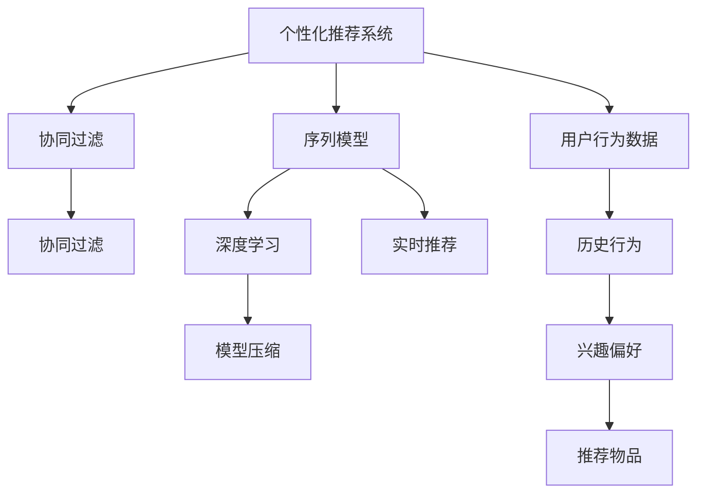

                 

# AI驱动的个性化推荐系统：电商、娱乐的未来

> 关键词：个性化推荐系统, 电商, 娱乐, 人工智能, 机器学习, 深度学习, 协同过滤, 序列模型, 模型压缩, 实时推荐

## 1. 背景介绍

### 1.1 问题由来

在互联网和移动互联网的推动下，电商、娱乐等行业面临着前所未有的市场机遇和挑战。随着用户行为的多样化和个性化需求的不断增加，传统的推荐方式已无法满足用户期望，个性化推荐系统应运而生。该系统通过分析用户行为数据，挖掘用户兴趣偏好，智能推荐符合用户需求的商品或内容，从而提升用户体验，增加用户粘性，提高转化率。

个性化推荐系统的核心在于对用户行为的深度理解与精确建模。在推荐算法中，协同过滤(Collaborative Filtering)、序列模型(Sequence Modeling)等方法被广泛应用。然而，这些算法依赖大量标注数据，且推荐效果受限于用户行为的多样性和动态性。

近年来，人工智能（AI）和大数据技术的发展，为个性化推荐系统的突破提供了新思路。深度学习（Deep Learning）模型，尤其是以Transformer为代表的序列模型，以其强大的表示能力和泛化能力，被广泛应用于个性化推荐系统中，取得了显著的效果。例如，电商行业中的商品推荐、娱乐行业中的内容推荐等，都通过深度学习技术大幅提升了用户体验和业务指标。

## 2. 核心概念与联系

### 2.1 核心概念概述

为更好地理解AI驱动的个性化推荐系统，本节将介绍几个密切相关的核心概念：

- 个性化推荐系统(Personalized Recommendation System, PRS)：根据用户行为、历史偏好、社交网络等数据，智能推荐个性化产品或内容的技术系统。
- 协同过滤(Collaborative Filtering)：通过分析用户行为数据，挖掘用户兴趣偏好，推荐相似用户喜欢的物品。常见的协同过滤方法有基于用户的协同过滤和基于物品的协同过滤。
- 序列模型(Sequence Modeling)：通过建模用户的历史行为序列，预测用户未来行为。常见的序列模型有基于RNN、LSTM、GRU等神经网络的模型。
- 深度学习（Deep Learning）：一类通过多层神经网络进行复杂模式识别的机器学习技术，适用于非线性关系建模。
- 模型压缩(Model Compression)：通过减少模型参数量、优化模型结构等方式，减小深度学习模型的计算和存储需求。
- 实时推荐(Real-time Recommendation)：实时分析用户当前行为，动态调整推荐结果，以适应用户需求变化。

这些核心概念之间的逻辑关系可以通过以下Mermaid流程图来展示：



这个流程图展示了个性化推荐系统的核心概念及其之间的关系：

1. 个性化推荐系统通过协同过滤、序列模型等方法分析用户行为，挖掘兴趣偏好。
2. 深度学习模型，特别是序列模型，为推荐系统的建模提供了强有力的支持。
3. 实时推荐技术，通过动态调整推荐结果，提升用户互动体验。
4. 模型压缩技术，优化模型计算和存储需求，支持大规模部署。

## 3. 核心算法原理 & 具体操作步骤

### 3.1 算法原理概述

AI驱动的个性化推荐系统，以深度学习为核心的建模方法，通过分析用户历史行为和偏好，预测用户未来需求，从而实现个性化推荐。其核心算法包括：

- 协同过滤算法：通过分析用户和物品的交互历史，挖掘用户之间的相似性，推荐与相似用户喜欢的物品。
- 序列模型：基于用户的历史行为序列，建模用户兴趣的变化规律，预测用户下一步的行动。
- 注意力机制：通过在深度学习模型中引入注意力机制，提高模型对重要特征的关注度，提升推荐效果。
- 强化学习：通过用户与系统的交互行为，动态调整推荐策略，优化用户体验。

这些算法通过深度学习模型进行实现，通过多层神经网络抽取用户行为特征，映射到推荐结果上。模型在训练过程中，通过大量标注数据进行监督学习，不断调整参数，优化推荐效果。

### 3.2 算法步骤详解

AI驱动的个性化推荐系统开发一般包括以下几个关键步骤：

**Step 1: 数据收集与预处理**

- 收集用户行为数据，包括浏览、点击、购买、评价等。
- 对数据进行清洗、去重、归一化等预处理操作，形成干净的数据集。

**Step 2: 模型选择与训练**

- 选择适合的深度学习模型，如RNN、LSTM、GRU、Transformer等。
- 在标注数据集上进行模型训练，调整超参数，优化模型性能。

**Step 3: 特征工程**

- 从用户行为数据中提取特征，如浏览时间、点击次数、评分等。
- 应用特征工程技术，进行特征选择、降维、编码等操作，提升模型效果。

**Step 4: 模型评估与优化**

- 在验证集上进行模型评估，计算准确率、召回率、F1-score等指标。
- 根据评估结果，调整模型超参数，优化推荐效果。

**Step 5: 实时推荐**

- 将训练好的模型部署到生产环境，实时分析用户当前行为，动态调整推荐结果。
- 通过A/B测试等方式，评估推荐效果，持续优化推荐策略。

### 3.3 算法优缺点

AI驱动的个性化推荐系统具有以下优点：

1. 高度灵活：深度学习模型可以处理大规模数据，适用于多种推荐任务。
2. 效果显著：通过复杂的神经网络结构，能够准确建模用户兴趣，提升推荐精度。
3. 动态适应：实时推荐技术可以根据用户当前行为，动态调整推荐结果，提高用户满意度。
4. 自动化程度高：模型训练和部署过程可以自动化完成，节省人力成本。

同时，该算法也存在一定的局限性：

1. 数据需求高：深度学习模型依赖大量标注数据，数据获取成本较高。
2. 计算复杂：深度学习模型参数量大，计算复杂度高，部署难度大。
3. 泛化能力不足：深度学习模型对输入数据的噪声敏感，泛化能力有待提升。
4. 可解释性差：深度学习模型为黑盒模型，难以解释其内部决策过程。

尽管存在这些局限性，但就目前而言，AI驱动的个性化推荐系统在电商、娱乐等领域取得了显著成效，成为这些行业智能化升级的重要手段。

### 3.4 算法应用领域

AI驱动的个性化推荐系统已经在电商、娱乐等多个领域得到了广泛应用，例如：

- 电商推荐：通过分析用户浏览、购买历史，推荐商品。
- 视频推荐：基于用户观看历史，推荐相似视频内容。
- 音乐推荐：分析用户听歌历史，推荐音乐或歌单。
- 游戏推荐：通过用户游戏行为，推荐适合的游戏。
- 内容推荐：基于用户阅读、互动历史，推荐文章、书籍等。

除了这些经典应用外，AI驱动的推荐系统还被创新性地应用到更多场景中，如新闻推荐、社交网络推荐、推荐广告等，为各行各业带来了新的商业价值。

## 4. 数学模型和公式 & 详细讲解

### 4.1 数学模型构建

基于深度学习的个性化推荐系统，通常使用序列模型对用户行为进行建模。假设用户的历史行为序列为 $x_1, x_2, ..., x_T$，其中 $x_t$ 表示用户在时间步 $t$ 的行为。模型的目标是通过训练，学习到用户行为序列与推荐结果 $y$ 之间的关系，即 $P(y|x)$。

形式化地，推荐模型的输入输出如下：

- 输入：用户行为序列 $x_1, x_2, ..., x_T$。
- 输出：推荐结果 $y$。

假设推荐模型为 $f(x)$，则有：

$$
P(y|x) = f(x)
$$

为了便于计算，通常使用概率模型对推荐结果进行建模，如马尔可夫模型、条件随机场等。

### 4.2 公式推导过程

以马尔可夫模型为例，假设用户行为序列 $x_1, x_2, ..., x_T$ 服从马尔可夫链，且 $x_t$ 只与 $x_{t-1}$ 有关，则有：

$$
P(x_{t+1}|x_t, x_{t-1}, ..., x_1) = P(x_{t+1}|x_t)
$$

对于推荐模型的输出 $y$，假设它与用户行为序列 $x_1, x_2, ..., x_T$ 有关，则有：

$$
P(y|x) = \prod_{t=1}^{T} P(y_t|x_t)
$$

在训练过程中，通过最大化似然函数对模型进行优化：

$$
\max_{\theta} \prod_{t=1}^{T} P(y_t|x_t)
$$

其中 $\theta$ 为模型参数，如神经网络的权重和偏置。

通过反向传播算法，模型可以高效计算梯度，更新参数，从而优化推荐效果。

### 4.3 案例分析与讲解

以电商推荐系统为例，假设用户历史行为序列为浏览商品ID、点击商品详情、购买商品等行为。我们可以将这些行为编码为数值序列，如 $x_1=1, x_2=2, x_3=3$。使用LSTM序列模型，可以将其映射到推荐结果 $y$，即推荐给用户商品的ID。

假设LSTM模型为：

$$
h_t = tanh(W*h_{t-1} + U*x_t + b)
$$

$$
y_t = softmax(V*h_t + c)
$$

其中 $h_t$ 为LSTM模型在时间步 $t$ 的隐藏状态，$y_t$ 为推荐结果。$W, U, V, b, c$ 为模型参数。

通过训练，模型可以学习到用户行为序列与推荐结果之间的关系，从而实现个性化推荐。

## 5. 项目实践：代码实例和详细解释说明

### 5.1 开发环境搭建

在进行推荐系统开发前，我们需要准备好开发环境。以下是使用Python进行TensorFlow开发的环境配置流程：

1. 安装Anaconda：从官网下载并安装Anaconda，用于创建独立的Python环境。

2. 创建并激活虚拟环境：
```bash
conda create -n tf-env python=3.8 
conda activate tf-env
```

3. 安装TensorFlow：从官网获取对应的安装命令，安装TensorFlow。例如：
```bash
pip install tensorflow
```

4. 安装各类工具包：
```bash
pip install numpy pandas scikit-learn matplotlib tqdm jupyter notebook ipython
```

完成上述步骤后，即可在`tf-env`环境中开始推荐系统开发。

### 5.2 源代码详细实现

下面我们以电商平台商品推荐为例，给出使用TensorFlow对LSTM模型进行推荐系统开发的PyTorch代码实现。

首先，定义数据处理函数：

```python
import tensorflow as tf
from tensorflow.keras.layers import LSTM, Dense, Embedding, Input, TimeDistributed
from tensorflow.keras.models import Model
import numpy as np

def prepare_data(data, seq_length):
    sequences = []
    labels = []
    for sample in data:
        sequence, label = [], []
        for t in range(seq_length):
            if t >= len(sample):
                break
            sequence.append(sample[t])
            label.append(sample[t+1])
        sequences.append(sequence)
        labels.append(label)
    return sequences, labels

# 准备数据
sequences, labels = prepare_data(train_data, seq_length=10)

# 定义模型
input = Input(shape=(seq_length,))
x = LSTM(128)(input)
x = Dense(1, activation='sigmoid')(x)
model = Model(input, x)
model.compile(optimizer='adam', loss='binary_crossentropy', metrics=['accuracy'])

# 训练模型
model.fit(sequences, labels, batch_size=32, epochs=10)
```

然后，定义模型评估函数：

```python
def evaluate(model, test_data):
    sequences, labels = prepare_data(test_data, seq_length=10)
    y_pred = model.predict(sequences)
    accuracy = np.mean(np.round(y_pred) == labels)
    return accuracy

# 评估模型
test_accuracy = evaluate(model, test_data)
print(f'Test Accuracy: {test_accuracy:.4f}')
```

最后，启动训练流程并在测试集上评估：

```python
seq_length = 10
batch_size = 32

# 训练模型
epochs = 10

for epoch in range(epochs):
    train_loss, train_accuracy = model.train_on_batch(sequences, labels)
    test_accuracy = evaluate(model, test_data)
    print(f'Epoch {epoch+1}, train loss: {train_loss:.4f}, train accuracy: {train_accuracy:.4f}, test accuracy: {test_accuracy:.4f}')
```

以上就是使用TensorFlow对LSTM模型进行电商平台商品推荐系统的完整代码实现。可以看到，得益于TensorFlow的强大封装，我们可以用相对简洁的代码完成LSTM模型的构建和训练。

### 5.3 代码解读与分析

让我们再详细解读一下关键代码的实现细节：

**prepare_data函数**：
- 将用户行为序列和推荐标签转换成训练数据。
- 通过循环遍历每个样本，截取指定长度的行为序列，并计算相应的推荐标签。

**模型定义**：
- 使用Input定义输入层，输入维度为历史行为序列的长度。
- 使用LSTM定义序列模型，隐藏层大小为128。
- 使用Dense定义输出层，输出单个推荐标签，使用sigmoid激活函数。
- 使用Model将输入层和输出层组成完整模型，并编译模型。

**训练过程**：
- 使用fit方法进行模型训练，设置批量大小为32，迭代次数为10。
- 每次迭代中，计算训练集损失和准确率，并在测试集上评估模型性能。
- 输出每个epoch的训练损失、训练准确率和测试准确率。

可以看到，TensorFlow配合Keras框架使得LSTM模型的构建和训练变得简洁高效。开发者可以将更多精力放在数据处理、模型改进等高层逻辑上，而不必过多关注底层的实现细节。

当然，工业级的系统实现还需考虑更多因素，如模型的保存和部署、超参数的自动搜索、更灵活的特征工程等。但核心的推荐范式基本与此类似。

## 6. 实际应用场景

### 6.1 电商平台

在电商平台推荐系统中，深度学习模型可以基于用户的历史行为，智能推荐符合用户需求的商品。推荐系统可以有效提升用户购买转化率，增加用户粘性，提高销售额。

在技术实现上，可以收集用户浏览、点击、购买、评价等行为数据，将行为序列作为模型输入，通过训练生成推荐结果。在推荐时，根据用户当前行为动态调整推荐列表，提升推荐效果。

### 6.2 视频平台

视频平台推荐系统，通过分析用户观看历史，推荐用户感兴趣的视频内容。推荐系统可以提升用户观看时长和点击率，增加广告收入。

在技术实现上，可以收集用户观看历史、点赞、评论等行为数据，使用序列模型对用户兴趣进行建模。根据用户当前行为，动态调整推荐视频，提升用户体验。

### 6.3 音乐平台

音乐平台推荐系统，通过分析用户听歌历史，推荐适合用户的音乐或歌单。推荐系统可以提升用户听歌时长和满意度，增加订阅用户数。

在技术实现上，可以收集用户听歌历史、收藏、分享等行为数据，使用序列模型对用户兴趣进行建模。根据用户当前行为，动态调整推荐音乐或歌单，提升用户体验。

### 6.4 游戏平台

游戏平台推荐系统，通过分析用户游戏行为，推荐适合用户的游戏。推荐系统可以提升用户留存率，增加游戏收入。

在技术实现上，可以收集用户游戏行为数据，如游戏时间、关卡进度、购买记录等，使用序列模型对用户兴趣进行建模。根据用户当前行为，动态调整推荐游戏，提升用户粘性和满意度。

### 6.5 内容平台

内容平台推荐系统，通过分析用户阅读、互动历史，推荐适合的文章、书籍等。推荐系统可以提升用户阅读时长和点击率，增加平台流量和广告收入。

在技术实现上，可以收集用户阅读、评论、点赞等行为数据，使用序列模型对用户兴趣进行建模。根据用户当前行为，动态调整推荐内容，提升用户体验。

## 7. 工具和资源推荐

### 7.1 学习资源推荐

为了帮助开发者系统掌握推荐系统的理论基础和实践技巧，这里推荐一些优质的学习资源：

1. 《深度学习推荐系统》书籍：详细介绍了深度学习推荐系统的基本概念和算法，是推荐系统学习的入门教材。

2. 《TensorFlow实战》书籍：介绍了TensorFlow在推荐系统中的应用，提供了丰富的案例和代码实现。

3. 《序列模型在推荐系统中的应用》课程：斯坦福大学开设的深度学习推荐系统课程，涵盖了推荐系统的核心算法和实践技巧。

4. 《推荐系统与深度学习》论文：综述了深度学习在推荐系统中的应用，介绍了多种推荐模型的优化方法和改进方向。

5. Kaggle推荐系统竞赛：Kaggle平台上定期举行的推荐系统竞赛，提供丰富的数据集和模型实现，是推荐系统学习的实践平台。

通过对这些资源的学习实践，相信你一定能够快速掌握推荐系统的精髓，并用于解决实际的业务问题。

### 7.2 开发工具推荐

高效的开发离不开优秀的工具支持。以下是几款用于推荐系统开发的常用工具：

1. TensorFlow：由Google主导开发的深度学习框架，生产部署方便，支持多种推荐模型。

2. PyTorch：由Facebook主导开发的深度学习框架，灵活高效，适合研究型推荐系统开发。

3. Keras：基于TensorFlow的高级神经网络API，提供了丰富的层和优化器，方便快速搭建推荐模型。

4. Weights & Biases：模型训练的实验跟踪工具，可以记录和可视化模型训练过程中的各项指标，方便对比和调优。

5. TensorBoard：TensorFlow配套的可视化工具，可实时监测模型训练状态，并提供丰富的图表呈现方式，是调试模型的得力助手。

合理利用这些工具，可以显著提升推荐系统的开发效率，加快创新迭代的步伐。

### 7.3 相关论文推荐

推荐系统的研究源于学界的持续探索。以下是几篇奠基性的相关论文，推荐阅读：

1. "Trustworthy Online Recommendation Algorithms: Theory and Experiments"（可信网络推荐算法：理论与实验）：介绍了可信推荐算法的基本思想和实现方法。

2. "Collaborative Filtering for Implicit Feedback Datasets"（隐式反馈数据的协同过滤）：提出了隐式反馈数据的协同过滤算法，解决了传统协同过滤算法对显式反馈数据依赖的问题。

3. "Session-based Recommendations with Recurrent Neural Networks"（基于循环神经网络的会话推荐）：使用了RNN对用户行为序列进行建模，提升了推荐系统的表现。

4. "Neural Collaborative Filtering"（神经协同过滤）：将神经网络引入了协同过滤算法，提升了模型的表达能力和泛化能力。

5. "Deep Personalized Ranking"（深度个性化排序）：提出了基于深度学习的个性化推荐方法，显著提升了推荐系统的精度。

这些论文代表了大数据推荐系统的研究脉络。通过学习这些前沿成果，可以帮助研究者把握学科前进方向，激发更多的创新灵感。

## 8. 总结：未来发展趋势与挑战

### 8.1 总结

本文对AI驱动的个性化推荐系统进行了全面系统的介绍。首先阐述了推荐系统的背景和意义，明确了深度学习在推荐系统中的应用价值。其次，从原理到实践，详细讲解了深度学习推荐模型的核心算法和操作步骤，给出了推荐系统开发的完整代码实现。同时，本文还广泛探讨了推荐系统在电商、娱乐等多个行业领域的应用前景，展示了深度学习技术的巨大潜力。此外，本文精选了推荐系统的各类学习资源，力求为读者提供全方位的技术指引。

通过本文的系统梳理，可以看到，AI驱动的个性化推荐系统正在成为推荐系统的重要范式，极大地拓展了深度学习的应用范围，推动了推荐技术的产业化进程。未来，伴随深度学习技术的发展，推荐系统必将在更多领域得到应用，为各行各业带来新的价值和机遇。

### 8.2 未来发展趋势

展望未来，推荐系统的研究和发展将呈现以下几个趋势：

1. 模型自动化：推荐系统的开发将更加自动化、智能化，通过自动化的模型选择和超参数优化，减少人工干预，提高开发效率。

2. 多模态融合：推荐系统将从传统的文本推荐向多模态推荐发展，融合图像、语音、视频等多模态数据，提升推荐效果。

3. 跨领域迁移：推荐系统将从单一领域向跨领域迁移发展，通过迁移学习，提升模型的泛化能力和应用范围。

4. 实时推荐：推荐系统将从离线推荐向实时推荐发展，通过实时数据流处理，动态调整推荐结果，提升用户体验。

5. 个性化推荐：推荐系统将从人群推荐向个性化推荐发展，通过深度学习模型，捕捉用户细粒度兴趣，实现个性化的推荐。

6. 知识增强：推荐系统将从纯数据驱动向知识增强发展，通过引入知识图谱、逻辑规则等专家知识，提升模型的解释性和可靠性。

这些趋势凸显了推荐系统的广阔前景，为推荐技术带来了新的方向和挑战。这些方向的探索发展，必将进一步提升推荐系统的性能和应用范围，为电商、娱乐等垂直行业带来新的价值和机遇。

### 8.3 面临的挑战

尽管AI驱动的推荐系统已经取得了显著成效，但在迈向更加智能化、普适化应用的过程中，它仍面临诸多挑战：

1. 数据获取难度高：推荐系统依赖大量标注数据，数据获取成本高、数据质量差。如何降低数据获取成本，提升数据质量，是亟待解决的问题。

2. 模型复杂度高：深度学习模型参数量大，计算复杂度高，部署难度大。如何优化模型结构，减小计算资源消耗，是亟待突破的难题。

3. 泛化能力不足：深度学习模型对输入数据的噪声敏感，泛化能力有待提升。如何提高模型的鲁棒性和泛化能力，是亟待研究的课题。

4. 可解释性差：深度学习模型为黑盒模型，难以解释其内部决策过程。如何提高模型的可解释性和可解释性，是亟待解决的问题。

5. 安全性有待保障：推荐系统可能会学习到有害信息，存在被恶意利用的风险。如何提高模型的安全性，避免恶意用途，是亟待解决的课题。

这些挑战凸显了推荐系统的复杂性和多面性，需要通过持续的研究和实践，逐步克服。只有全面考虑数据、算法、工程、业务等多个维度，才能真正实现推荐系统的智能化和普适化。

### 8.4 研究展望

面对推荐系统面临的种种挑战，未来的研究需要在以下几个方面寻求新的突破：

1. 数据增强与合成：通过数据增强和合成技术，生成更多高质量的推荐数据，降低数据获取成本，提升推荐效果。

2. 模型压缩与优化：开发更加高效的模型压缩方法，减小深度学习模型的计算和存储需求，提升推荐系统的实时性和可扩展性。

3. 多模态融合与协同：通过多模态融合和协同学习，将文本、图像、语音等数据进行融合，提升推荐系统的表达能力和泛化能力。

4. 知识增强与融合：将符号化的先验知识，如知识图谱、逻辑规则等，与神经网络模型进行融合，提升推荐系统的解释性和可靠性。

5. 实时推荐与智能：通过实时推荐技术，动态调整推荐结果，提升用户体验。同时，引入智能推荐算法，如强化学习、注意力机制等，优化推荐策略，提升推荐效果。

6. 安全性与隐私保护：通过引入安全性和隐私保护机制，确保推荐系统输出的可靠性和安全性，保护用户隐私和数据安全。

这些研究方向的探索，必将引领推荐系统技术迈向更高的台阶，为电商、娱乐等垂直行业带来新的价值和机遇。面向未来，推荐系统还需要与其他人工智能技术进行更深入的融合，如自然语言处理、计算机视觉等，多路径协同发力，共同推动推荐技术的进步。只有勇于创新、敢于突破，才能不断拓展推荐系统的边界，让推荐技术更好地服务社会。

## 9. 附录：常见问题与解答

**Q1：推荐系统是否适用于所有NLP任务？**

A: 推荐系统通常用于推荐商品、内容等个性化物品，而不适用于传统的文本分类、命名实体识别等NLP任务。然而，在电商、娱乐等行业，推荐系统与NLP任务存在紧密联系，两者可以相互促进。例如，电商推荐可以基于商品描述进行自然语言处理，提升推荐效果；娱乐推荐可以基于视频字幕进行自然语言处理，提升推荐系统的人机交互能力。

**Q2：推荐系统如何实现实时推荐？**

A: 实时推荐系统通常需要实时采集用户行为数据，并进行流式处理，动态调整推荐结果。具体实现方式包括：
1. 数据采集：通过Web日志、APP日志、视频流等渠道，实时采集用户行为数据。
2. 流式处理：使用流式计算框架（如Apache Flink、Apache Kafka）进行数据处理，实时计算推荐结果。
3. 推荐更新：根据实时数据流，动态调整推荐策略，生成推荐结果。
4. 缓存优化：使用缓存技术，提高推荐系统的响应速度和稳定性。

**Q3：推荐系统如何处理推荐冷启动问题？**

A: 推荐冷启动问题通常指新用户或新物品加入系统时，无法进行推荐。推荐系统可以通过以下方法解决冷启动问题：
1. 用户画像：通过问卷调查、社交网络等手段，收集用户的基本信息，建立用户画像，进行推荐。
2. 物品画像：通过标签、分类、属性等手段，对物品进行标注，建立物品画像，进行推荐。
3. 数据合成：使用生成对抗网络（GAN）、变分自编码器（VAE）等方法，生成更多推荐数据，帮助新用户和新物品进行推荐。
4. 混合推荐：使用协同过滤、内容推荐、混合推荐等方法，结合多源数据，提升推荐效果。

**Q4：推荐系统如何平衡推荐效果和成本？**

A: 推荐系统需要平衡推荐效果和成本，具体方法包括：
1. 数据获取：通过有效的数据采集和处理，获取高质量的推荐数据，降低数据获取成本。
2. 模型选择：选择高效的推荐模型，减少计算资源消耗，提高推荐效果。
3. 特征工程：通过特征选择、降维、编码等方法，提高模型效果，降低特征工程成本。
4. 模型压缩：使用模型压缩方法，减小深度学习模型的计算和存储需求，提升推荐系统的实时性和可扩展性。
5. 混合推荐：使用协同过滤、内容推荐、混合推荐等方法，结合多源数据，提升推荐效果。

**Q5：推荐系统如何提高推荐系统的可解释性？**

A: 推荐系统的可解释性可以通过以下方法提升：
1. 特征解释：通过特征选择和解释，理解模型的输入和输出特征。
2. 模型可视化：通过模型可视化技术，如特征重要性分析、局部敏感度分析等，理解模型的决策过程。
3. 推荐解释：通过推荐解释技术，如归因分析、因果推断等，理解推荐结果的来源。
4. 用户反馈：通过用户反馈和评价，理解用户对推荐结果的接受程度。

这些方法可以综合使用，提升推荐系统的可解释性和可解释性，增强用户信任和满意度。

---

作者：禅与计算机程序设计艺术 / Zen and the Art of Computer Programming

