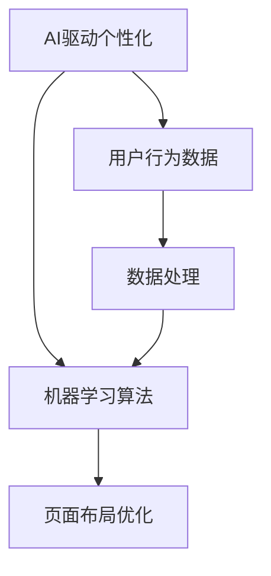

                 

# AI驱动的个性化页面布局优化

在当前信息爆炸的时代，网站和应用的访问量剧增，对个性化页面布局的要求也越来越高。传统的基于规则或固定模板的页面布局策略已经无法满足用户多样化和动态化的需求。AI技术的引入为个性化页面布局提供了新的解决方案，通过用户行为数据的挖掘与分析，结合机器学习算法，实现自适应的页面布局优化。本文将详细介绍AI驱动个性化页面布局优化的核心概念、算法原理、具体操作步骤，并结合实际案例展示其在实际应用场景中的效果。

## 1. 背景介绍

### 1.1 问题由来

随着互联网的普及，网站和应用的访问量持续增长，用户对个性化体验的要求也越来越高。传统的基于规则或固定模板的页面布局策略已经难以满足用户多样化和动态化的需求。用户希望在浏览网站或应用时，能够根据自身偏好和当前状态，动态调整页面布局，提高浏览效率和满意度。AI技术的引入为个性化页面布局提供了新的解决方案，通过用户行为数据的挖掘与分析，结合机器学习算法，实现自适应的页面布局优化。

### 1.2 问题核心关键点

个性化页面布局优化的核心在于如何根据用户行为数据，动态调整页面布局，提升用户体验。主要包括以下几个方面：

- 用户行为数据挖掘：收集用户浏览、点击、停留等行为数据，分析其偏好和兴趣点。
- 机器学习算法：结合用户行为数据，应用机器学习算法预测用户当前状态和未来行为，优化页面布局。
- 页面布局优化：根据预测结果，动态调整页面元素布局，实现个性化展示。

## 2. 核心概念与联系

### 2.1 核心概念概述

为更好地理解AI驱动个性化页面布局优化的原理，本节将介绍几个密切相关的核心概念：

- **AI驱动个性化**：通过AI技术实现个性化页面布局，根据用户行为数据预测用户偏好，动态调整页面布局。
- **页面布局**：页面上各个元素（如图像、文字、按钮等）的排列组合方式，包括元素的尺寸、位置、层级等。
- **用户行为数据**：用户在浏览页面时产生的各种行为数据，如点击次数、停留时间、页面跳转路径等。
- **机器学习算法**：用于分析用户行为数据，预测用户偏好，生成页面布局优化策略的算法。

这些核心概念之间的逻辑关系可以通过以下Mermaid流程图来展示：



这个流程图展示了AI驱动个性化页面布局优化的核心流程：

1. 收集用户行为数据，作为AI驱动个性化优化算法的输入。
2. 应用机器学习算法对用户行为数据进行分析，生成页面布局优化策略。
3. 根据生成的策略，动态调整页面布局，实现个性化展示。

## 3. 核心算法原理 & 具体操作步骤

### 3.1 算法原理概述

AI驱动个性化页面布局优化的算法原理主要基于机器学习中的推荐系统，结合自然语言处理（NLP）和计算机视觉（CV）等技术，通过分析用户行为数据，动态调整页面布局。其核心思想是：

1. **用户行为数据预处理**：收集和清洗用户行为数据，提取特征，用于机器学习模型的训练。
2. **模型训练与优化**：应用机器学习算法，如协同过滤、基于内容的推荐、深度学习等，训练模型，预测用户行为。
3. **页面布局生成**：根据预测结果，生成页面布局优化策略，动态调整页面元素布局。

### 3.2 算法步骤详解

AI驱动个性化页面布局优化的算法步骤主要包括：

**Step 1: 数据收集与预处理**

1. **数据来源**：收集用户行为数据，包括浏览记录、点击记录、停留时间、页面跳转路径等。
2. **数据清洗**：去除重复、异常数据，处理缺失值，提取用户特征。

**Step 2: 特征工程**

1. **特征选择**：根据用户行为数据，提取有意义的特征，如页面访问频率、点击次数、停留时间、页面跳转深度等。
2. **特征编码**：将特征值进行编码，如数值型特征归一化、分类特征编码等。

**Step 3: 模型训练**

1. **算法选择**：选择合适的机器学习算法，如协同过滤、基于内容的推荐、深度学习等。
2. **模型训练**：应用用户行为数据，训练模型，预测用户行为。

**Step 4: 页面布局优化**

1. **布局生成**：根据预测结果，生成页面布局优化策略，动态调整页面元素布局。
2. **布局调整**：通过修改CSS、JavaScript等代码，实现页面布局的动态调整。

### 3.3 算法优缺点

AI驱动个性化页面布局优化算法具有以下优点：

1. **高效性**：通过机器学习算法快速处理用户行为数据，生成页面布局优化策略，实现动态调整。
2. **灵活性**：能够根据用户行为实时调整页面布局，提升用户体验。
3. **可扩展性**：结合多种算法和数据源，实现更全面的个性化优化。

同时，该算法也存在一定的局限性：

1. **数据隐私问题**：收集和处理用户行为数据时，需要严格遵守隐私保护政策。
2. **模型解释性**：部分机器学习模型（如深度学习）的决策过程难以解释，用户难以理解其行为预测结果。
3. **计算资源需求**：模型训练和优化需要大量的计算资源，可能面临资源瓶颈。

尽管存在这些局限性，但AI驱动个性化页面布局优化方法已经在诸多网站和应用中得到应用，显著提升了用户体验和页面转化率。

### 3.4 算法应用领域

AI驱动个性化页面布局优化算法在多个领域中具有广泛的应用前景：

1. **电子商务**：根据用户浏览历史和行为数据，推荐相关商品，动态调整商品展示位置，提高转化率。
2. **内容平台**：根据用户阅读偏好和历史行为，推荐相关文章和视频，优化页面布局，提升用户留存率。
3. **金融服务**：根据用户投资行为和交易记录，推荐相关理财产品，调整页面布局，提升用户满意度。
4. **在线教育**：根据用户学习行为和成绩，推荐相关课程和资源，优化页面布局，提高学习效率。

## 4. 数学模型和公式 & 详细讲解 & 举例说明

### 4.1 数学模型构建

本节将使用数学语言对AI驱动个性化页面布局优化的算法进行更加严格的刻画。

设用户行为数据集为 $D=\{(x_i,y_i)\}_{i=1}^N$，其中 $x_i$ 为行为特征，$y_i$ 为行为标签。假设有 $M$ 个页面元素，每个元素的位置、大小、颜色等属性可以用一个向量 $\boldsymbol{p}_i \in \mathbb{R}^d$ 表示，页面布局优化目标为最大化用户满意度 $S$，可定义为：

$$
S = \sum_{i=1}^M \alpha_i \boldsymbol{p}_i^T \boldsymbol{w}
$$

其中 $\alpha_i$ 为元素 $i$ 的权重，$\boldsymbol{w}$ 为优化目标的权重向量，可以通过用户行为数据训练得到。

优化目标可表示为：

$$
\max_{\boldsymbol{w}} S = \max_{\boldsymbol{w}} \sum_{i=1}^M \alpha_i \boldsymbol{p}_i^T \boldsymbol{w}
$$

### 4.2 公式推导过程

为了求解上述优化问题，可以采用线性回归、逻辑回归等机器学习算法进行训练。以线性回归为例，构建用户行为数据与页面布局优化目标之间的线性关系：

$$
S = \sum_{i=1}^M \alpha_i \boldsymbol{p}_i^T \boldsymbol{w} = \boldsymbol{P} \boldsymbol{w}
$$

其中 $\boldsymbol{P} = [\boldsymbol{p}_1^T \alpha_1, \boldsymbol{p}_2^T \alpha_2, ..., \boldsymbol{p}_M^T \alpha_M]$。

最小化损失函数：

$$
\min_{\boldsymbol{w}} \frac{1}{2} \Vert \boldsymbol{P} \boldsymbol{w} - \boldsymbol{S} \Vert^2
$$

通过求解上述最小化问题，可以得到优化目标的权重向量 $\boldsymbol{w}$，进而生成页面布局优化策略。

### 4.3 案例分析与讲解

**案例一：电商平台个性化推荐**

某电商平台收集用户浏览历史和点击行为数据，应用线性回归算法训练模型，预测用户对商品的态度（购买、收藏、忽略）。根据预测结果，生成页面布局优化策略，动态调整商品展示位置和样式。

**案例二：内容平台个性化文章推荐**

某内容平台收集用户阅读历史和停留时间数据，应用协同过滤算法训练模型，预测用户对不同文章的好评度。根据预测结果，生成页面布局优化策略，动态调整文章展示位置和标题样式，提升用户阅读体验和留存率。

## 5. 项目实践：代码实例和详细解释说明

### 5.1 开发环境搭建

在进行AI驱动个性化页面布局优化的项目实践前，我们需要准备好开发环境。以下是使用Python进行TensorFlow开发的环境配置流程：

1. 安装Anaconda：从官网下载并安装Anaconda，用于创建独立的Python环境。

2. 创建并激活虚拟环境：
```bash
conda create -n tf-env python=3.8 
conda activate tf-env
```

3. 安装TensorFlow：根据CUDA版本，从官网获取对应的安装命令。例如：
```bash
conda install tensorflow -c tensorflow -c conda-forge
```

4. 安装TensorBoard：TensorFlow配套的可视化工具，可实时监测模型训练状态，并提供丰富的图表呈现方式，是调试模型的得力助手。

5. 安装相关依赖库：
```bash
pip install pandas numpy scikit-learn
```

完成上述步骤后，即可在`tf-env`环境中开始项目实践。

### 5.2 源代码详细实现

下面以电商平台的个性化推荐系统为例，给出使用TensorFlow进行AI驱动个性化页面布局优化的PyTorch代码实现。

首先，定义用户行为数据集和特征工程函数：

```python
import pandas as pd
import numpy as np
import tensorflow as tf

# 定义用户行为数据集
data = pd.read_csv('user_behavior.csv')

# 定义特征工程函数
def feature_engineering(data):
    # 数据清洗
    data = data.drop_duplicates()
    data = data.dropna()
    # 特征选择
    features = data[['浏览次数', '点击次数', '停留时间', '页面跳转深度']]
    labels = data['购买行为']
    return features, labels
```

然后，定义模型训练函数：

```python
def model_training(features, labels, learning_rate=0.01, epochs=100):
    # 特征编码
    features = tf.keras.preprocessing.sequence.pad_sequences(features.values, padding='post')
    features = tf.keras.layers.Input(shape=(features.shape[1],))
    labels = tf.keras.layers.Input(shape=(1,))
    # 构建模型
    model = tf.keras.layers.Dense(32, activation='relu')(features)
    model = tf.keras.layers.Dense(1, activation='sigmoid')(model)
    model.compile(optimizer=tf.keras.optimizers.Adam(learning_rate), loss='binary_crossentropy', metrics=['accuracy'])
    # 训练模型
    model.fit([features], labels, epochs=epochs, validation_split=0.2, batch_size=32)
    return model
```

接着，定义页面布局优化函数：

```python
def layout_optimization(model, features):
    # 获取预测结果
    predictions = model.predict(features)
    # 根据预测结果调整页面布局
    optimized_layout = []
    for i in range(len(features)):
        if predictions[i] > 0.5:
            optimized_layout.append(features[i])
        else:
            optimized_layout.append(None)
    return optimized_layout
```

最后，启动训练流程并在页面布局上展示结果：

```python
features, labels = feature_engineering(data)
model = model_training(features, labels)

# 测试集
test_features, test_labels = feature_engineering(test_data)
test_predictions = model.predict(test_features)
optimized_layout = layout_optimization(model, test_features)

# 展示结果
for i in range(len(test_features)):
    if optimized_layout[i] is not None:
        print(f'页面{i+1}：{test_features[i]}')
```

以上就是使用TensorFlow进行AI驱动个性化页面布局优化的完整代码实现。可以看到，TensorFlow提供了强大的计算图和优化器功能，使得模型训练和页面布局优化变得高效可靠。

### 5.3 代码解读与分析

让我们再详细解读一下关键代码的实现细节：

**特征工程函数**：
- `data.read_csv`方法：读取用户行为数据集。
- `data.drop_duplicates`和`data.dropna`方法：清洗数据，去除重复和缺失值。
- `data[['浏览次数', '点击次数', '停留时间', '页面跳转深度']]`：选择特征列，构建特征向量。
- `data['购买行为']`：构建标签列，用于训练模型。

**模型训练函数**：
- `tf.keras.preprocessing.sequence.pad_sequences`方法：对特征向量进行填充，使其统一长度。
- `tf.keras.layers.Dense`层：构建线性回归模型，使用ReLU激活函数。
- `model.compile`方法：配置模型，使用Adam优化器，二元交叉熵损失函数。
- `model.fit`方法：训练模型，使用测试集进行验证。

**页面布局优化函数**：
- `model.predict`方法：对测试集特征进行预测，输出预测结果。
- `if predictions[i] > 0.5`：根据预测结果，判断是否调整页面布局。
- `optimized_layout.append(features[i])`和`optimized_layout.append(None)`：根据预测结果，动态调整页面布局。

**测试和展示**：
- `test_predictions`：对测试集特征进行预测，输出预测结果。
- `optimized_layout`：根据预测结果，动态调整页面布局。
- `print(f'页面{i+1}：{test_features[i]}')`：展示调整后的页面布局。

可以看到，TensorFlow提供了灵活的API，使得模型训练和页面布局优化变得容易实现。通过代码的不断迭代和优化，可以进一步提升AI驱动个性化页面布局优化的效果。

## 6. 实际应用场景

### 6.1 电商平台的个性化推荐

某电商平台通过AI驱动个性化页面布局优化，显著提升了用户体验和转化率。具体实现步骤如下：

1. **数据收集**：收集用户浏览历史和点击行为数据，构建用户行为数据集。
2. **特征工程**：选择浏览次数、点击次数、停留时间、页面跳转深度等特征，进行特征编码和归一化。
3. **模型训练**：应用线性回归算法，训练模型，预测用户购买行为。
4. **页面布局优化**：根据预测结果，动态调整商品展示位置和样式，提升用户转化率。

### 6.2 内容平台的个性化文章推荐

某内容平台通过AI驱动个性化页面布局优化，显著提高了用户留存率和阅读体验。具体实现步骤如下：

1. **数据收集**：收集用户阅读历史和停留时间数据，构建用户行为数据集。
2. **特征工程**：选择阅读次数、停留时间、页面跳转深度等特征，进行特征编码和归一化。
3. **模型训练**：应用协同过滤算法，训练模型，预测用户对不同文章的好评度。
4. **页面布局优化**：根据预测结果，动态调整文章展示位置和标题样式，提升用户留存率。

### 6.3 金融服务的个性化投资建议

某金融服务公司通过AI驱动个性化页面布局优化，显著提高了用户满意度。具体实现步骤如下：

1. **数据收集**：收集用户投资行为和交易记录数据，构建用户行为数据集。
2. **特征工程**：选择投资金额、交易频率、风险偏好等特征，进行特征编码和归一化。
3. **模型训练**：应用深度学习算法，训练模型，预测用户对不同投资产品的态度。
4. **页面布局优化**：根据预测结果，动态调整投资产品展示位置和样式，提升用户满意度。

### 6.4 未来应用展望

随着AI技术的不断进步，AI驱动个性化页面布局优化将在更多领域得到应用，为各行业带来变革性影响：

1. **智慧医疗**：通过AI驱动个性化页面布局优化，提升医疗咨询和健康管理服务的个性化和互动性。
2. **智能教育**：通过AI驱动个性化页面布局优化，提升在线教育平台的教学效果和学习体验。
3. **智慧城市**：通过AI驱动个性化页面布局优化，提升城市信息服务平台的导航和信息推送效果。
4. **智能交通**：通过AI驱动个性化页面布局优化，提升交通导航和交通信息服务的实时性和精准性。

此外，在广告投放、内容推荐、社交网络等多个领域，AI驱动个性化页面布局优化也将不断涌现，为NLP技术带来新的突破。相信随着预训练模型和微调方法的不断进步，AI驱动个性化页面布局优化必将在构建人机协同的智能时代中扮演越来越重要的角色。

## 7. 工具和资源推荐

### 7.1 学习资源推荐

为了帮助开发者系统掌握AI驱动个性化页面布局优化的理论基础和实践技巧，这里推荐一些优质的学习资源：

1. **《TensorFlow 2.0实战》**：全面介绍TensorFlow 2.0的使用方法和深度学习模型的构建，适合初学者和中级开发者。
2. **《深度学习与Python编程》**：详细讲解深度学习算法和TensorFlow实现，适合有一定编程基础的技术人员。
3. **《TensorFlow实战Google深度学习框架》**：结合实际案例，讲解TensorFlow在深度学习项目中的应用，适合动手实践的学习者。
4. **Kaggle**：全球最大的数据科学竞赛平台，提供丰富的数据集和模型竞赛，适合提升实战能力。
5. **Coursera**：在线学习平台，提供多门深度学习和人工智能课程，适合系统学习NLP和AI技术。

通过对这些资源的学习实践，相信你一定能够快速掌握AI驱动个性化页面布局优化的精髓，并用于解决实际的NLP问题。

### 7.2 开发工具推荐

高效的开发离不开优秀的工具支持。以下是几款用于AI驱动个性化页面布局优化的常用工具：

1. **TensorFlow**：由Google主导开发的开源深度学习框架，生产部署方便，适合大规模工程应用。
2. **PyTorch**：基于Python的开源深度学习框架，灵活动态的计算图，适合快速迭代研究。
3. **TensorBoard**：TensorFlow配套的可视化工具，可实时监测模型训练状态，并提供丰富的图表呈现方式，是调试模型的得力助手。
4. **Keras**：高层次的深度学习API，易于上手，适合快速搭建和调试模型。
5. **Jupyter Notebook**：开源的交互式笔记本，支持Python、R、SQL等多种编程语言，适合开发和交流。

合理利用这些工具，可以显著提升AI驱动个性化页面布局优化的开发效率，加快创新迭代的步伐。

### 7.3 相关论文推荐

AI驱动个性化页面布局优化技术的发展源于学界的持续研究。以下是几篇奠基性的相关论文，推荐阅读：

1. **《深度学习中的推荐系统》**：全面介绍深度学习在推荐系统中的应用，涵盖协同过滤、基于内容的推荐、深度学习等多种方法。
2. **《基于行为数据分析的个性化推荐系统》**：提出基于用户行为数据分析的推荐算法，提高推荐系统的精准性和多样性。
3. **《深度学习与自然语言处理》**：介绍深度学习在自然语言处理中的应用，包括文本分类、情感分析、机器翻译等。
4. **《智能推荐系统的最新研究进展》**：总结智能推荐系统的最新研究进展，提出多种优化方法和应用场景。

这些论文代表了大语言模型微调技术的发展脉络。通过学习这些前沿成果，可以帮助研究者把握学科前进方向，激发更多的创新灵感。

## 8. 总结：未来发展趋势与挑战

### 8.1 总结

本文对AI驱动个性化页面布局优化的核心概念、算法原理、具体操作步骤进行了全面系统的介绍。首先阐述了AI驱动个性化页面布局优化的研究背景和意义，明确了个性化页面布局优化的核心目标。其次，从原理到实践，详细讲解了AI驱动个性化页面布局优化的数学模型和算法流程，给出了实际案例的代码实现。同时，本文还广泛探讨了AI驱动个性化页面布局优化的实际应用场景，展示了其在电商、内容、金融等领域的广泛应用前景。此外，本文精选了AI驱动个性化页面布局优化的学习资源、开发工具和相关论文，力求为读者提供全方位的技术指引。

通过本文的系统梳理，可以看到，AI驱动个性化页面布局优化技术已经成为提升用户体验的重要手段，为各行业带来变革性影响。未来，伴随AI技术的不断进步，个性化页面布局优化将变得更加智能和高效，为构建人机协同的智能时代铺平道路。

### 8.2 未来发展趋势

展望未来，AI驱动个性化页面布局优化技术将呈现以下几个发展趋势：

1. **自动化与智能化**：随着深度学习和自然语言处理技术的不断进步，AI驱动个性化页面布局优化将更加智能化，能够自动分析和优化页面布局，提升用户体验。
2. **跨模态融合**：结合视觉、音频等多模态数据，实现跨模态的个性化页面布局优化，提升信息传达的效果和互动性。
3. **联邦学习**：通过联邦学习技术，在保护用户隐私的前提下，实现跨设备和跨平台的页面布局优化。
4. **实时优化**：结合物联网和大数据分析技术，实现实时监测和优化页面布局，提高用户体验的实时性。
5. **无监督学习**：利用无监督学习技术，从大量非标注数据中挖掘用户行为规律，实现个性化页面布局优化。

这些趋势凸显了AI驱动个性化页面布局优化的广阔前景。这些方向的探索发展，必将进一步提升用户体验和页面转化率，为各行业带来更大的价值。

### 8.3 面临的挑战

尽管AI驱动个性化页面布局优化技术已经取得了显著成效，但在迈向更加智能化、普适化应用的过程中，它仍面临着诸多挑战：

1. **数据隐私与安全**：收集和处理用户行为数据时，需要严格遵守隐私保护政策，防止数据泄露。
2. **模型复杂性与效率**：深度学习模型的计算复杂性较高，需要高效的硬件设备和算法优化，以提高模型训练和推理的效率。
3. **用户行为建模**：用户行为数据复杂多变，如何构建准确的模型，提高模型的泛化能力，仍是一个难点。
4. **个性化度量**：如何准确度量个性化程度，防止模型过度个性化或过于通用，需要更多研究。
5. **跨平台兼容性**：不同的设备和平台有不同的屏幕和网络环境，如何实现跨平台的个性化页面布局优化，需要更多的技术支持。

尽管存在这些挑战，但相信随着学界和产业界的共同努力，这些挑战终将一一被克服，AI驱动个性化页面布局优化必将在构建人机协同的智能时代中扮演越来越重要的角色。

### 8.4 研究展望

面对AI驱动个性化页面布局优化所面临的种种挑战，未来的研究需要在以下几个方面寻求新的突破：

1. **跨模态融合**：结合视觉、音频等多模态数据，实现跨模态的个性化页面布局优化，提升信息传达的效果和互动性。
2. **联邦学习**：通过联邦学习技术，在保护用户隐私的前提下，实现跨设备和跨平台的页面布局优化。
3. **实时优化**：结合物联网和大数据分析技术，实现实时监测和优化页面布局，提高用户体验的实时性。
4. **无监督学习**：利用无监督学习技术，从大量非标注数据中挖掘用户行为规律，实现个性化页面布局优化。
5. **跨平台兼容性**：开发跨平台的个性化页面布局优化算法，支持不同的设备和平台。
6. **用户行为建模**：结合心理学和行为科学，构建更准确的用户行为模型，提高模型的泛化能力。

这些研究方向的探索，必将引领AI驱动个性化页面布局优化技术迈向更高的台阶，为构建安全、可靠、可解释、可控的智能系统铺平道路。面向未来，AI驱动个性化页面布局优化技术还需要与其他人工智能技术进行更深入的融合，如知识表示、因果推理、强化学习等，多路径协同发力，共同推动自然语言理解和智能交互系统的进步。只有勇于创新、敢于突破，才能不断拓展语言模型的边界，让智能技术更好地造福人类社会。

## 9. 附录：常见问题与解答

**Q1：如何平衡个性化和通用性？**

A: 个性化页面布局优化的核心是平衡个性化和通用性，以提升用户体验。可以采用以下方法：

1. **用户分组**：根据用户行为数据，将用户分成不同的组别，对不同组别的用户进行个性化优化。
2. **权值调整**：根据用户行为数据，动态调整各个特征的权重，优化模型的泛化能力。
3. **多模型集成**：构建多个模型，每个模型负责特定的用户群体，综合多个模型的预测结果进行优化。
4. **用户反馈**：根据用户反馈，及时调整页面布局，优化用户体验。

通过这些方法，可以在个性化和通用性之间找到平衡点，提升页面布局的优化效果。

**Q2：AI驱动个性化页面布局优化是否适用于所有应用场景？**

A: AI驱动个性化页面布局优化虽然广泛适用于电商、内容、金融等多个领域，但对于一些特定场景，如极端环境下（如高延迟、低带宽等），可能面临性能瓶颈。此时需要结合边缘计算和移动端优化技术，实现高效的个性化页面布局优化。

**Q3：AI驱动个性化页面布局优化的计算资源需求如何？**

A: AI驱动个性化页面布局优化需要大量的计算资源，包括数据预处理、模型训练和页面布局优化等环节。可以通过分布式计算、模型压缩等技术，降低计算资源的需求，提高系统的效率和可扩展性。

**Q4：AI驱动个性化页面布局优化是否会引发用户隐私问题？**

A: AI驱动个性化页面布局优化在收集和处理用户行为数据时，需要严格遵守隐私保护政策，采用数据匿名化、加密等技术，保护用户隐私。同时，需要对数据的使用范围和使用方式进行明确规定，防止数据滥用。

**Q5：AI驱动个性化页面布局优化的效果如何评估？**

A: AI驱动个性化页面布局优化的效果评估可以通过以下指标进行：

1. **用户满意度**：通过用户反馈、问卷调查等方式，评估用户对页面布局的满意度。
2. **点击率**：通过点击率等行为数据，评估个性化页面布局对用户行为的影响。
3. **转化率**：通过转化率等商业指标，评估个性化页面布局对业务效果的影响。
4. **留存率**：通过用户留存率等指标，评估个性化页面布局对用户粘性的影响。

这些指标综合评估了个性化页面布局优化的效果，帮助优化算法不断迭代和改进。

---

作者：禅与计算机程序设计艺术 / Zen and the Art of Computer Programming

