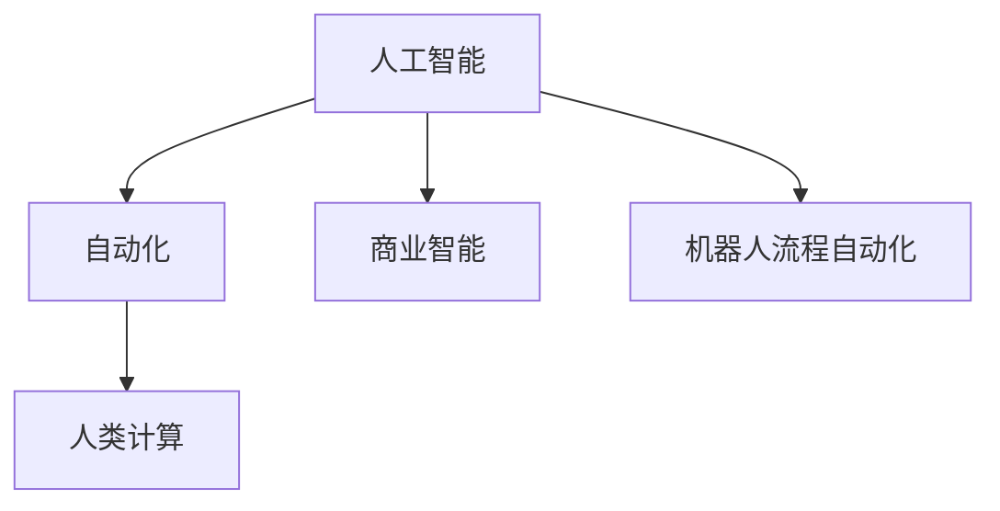

                 

# AI驱动的创新：人类计算在商业中的应用场景

> 关键词：人工智能, 人类计算, 自动化, 商业应用, 决策支持, 大数据, 机器人流程自动化

## 1. 背景介绍

### 1.1 问题由来
在数字化浪潮的推动下，人工智能（AI）正在成为商业竞争的新高地。从生产制造到销售服务，AI正逐步渗入到商业的各个角落。然而，大多数企业的AI部署仍处于初级阶段，部分企业因数据和技术门槛而望而却步。如何高效地将AI技术引入企业决策，提升商业价值，成为摆在管理层和IT团队面前的一大挑战。

### 1.2 问题核心关键点
本文聚焦于人类计算在商业中的应用场景，探讨如何将AI与人的协作结合起来，助力企业决策、优化流程、提升效率，从而实现商业价值最大化。本文分为核心概念介绍、核心算法原理及操作步骤、数学模型构建与详细讲解、项目实践、实际应用场景、工具和资源推荐、总结和未来展望、常见问题与解答等部分，通过结构化的内容，全面剖析人类计算在商业中的应用。

### 1.3 问题研究意义
研究人类计算在商业中的应用，有助于：
- 提高决策效率。AI可以帮助处理大规模数据和复杂计算，使决策过程更加科学和高效。
- 降低成本。自动化流程可减少人工操作，降低人力成本。
- 提升服务质量。AI能提供实时数据洞察，改进产品和服务质量。
- 促进创新。AI能驱动新业务模式的出现，为企业带来新的增长点。
- 增强竞争力。敏捷的AI技术能够快速响应市场变化，提升企业竞争力。

## 2. 核心概念与联系

### 2.1 核心概念概述

为更好地理解人类计算在商业中的应用，本节将介绍几个关键概念：

- 人工智能(Artificial Intelligence, AI)：使计算机系统能够执行需要人类智能的任务。AI涵盖了机器学习、自然语言处理、计算机视觉等领域。
- 自动化(Automation)：通过编程或AI技术，使机器执行重复性任务，减少人工干预。
- 人类计算(Human Compute)：AI和自动化技术与人类协作完成复杂任务，将人的创造力和判断力与机器的高效计算结合起来。
- 商业智能(Business Intelligence, BI)：利用数据和AI技术，使企业决策者能够快速洞察数据，提升决策效果。
- 机器人流程自动化(Robot Process Automation, RPA)：模拟人类操作，自动执行重复性业务流程。

这些概念之间的逻辑关系可以通过以下Mermaid流程图来展示：



这个流程图展示了他人类计算的核心概念及其之间的关系：

1. 人工智能通过自监督、监督学习和强化学习等技术，从大量数据中提取知识，形成计算能力。
2. 自动化通过编程和AI技术，使机器自动执行重复性任务，提高效率。
3. 人类计算将AI和自动化技术与人的创造力和判断力结合，使复杂任务得以高效完成。
4. 商业智能利用AI对业务数据进行分析，辅助决策。
5. 机器人流程自动化通过模拟人类操作，自动执行业务流程，降低人工成本。

这些概念共同构成了AI在商业中的应用框架，使AI技术能够更好地服务于企业发展。

## 3. 核心算法原理 & 具体操作步骤

### 3.1 算法原理概述

人类计算的核心算法原理涉及AI与人类协作，使复杂决策过程得以简化和优化。其基本思路如下：

- **数据预处理**：清洗、整合、规范化数据，构建AI可用的数据集。
- **模型训练**：使用监督、半监督或无监督学习方法，训练AI模型。
- **集成协作**：将AI模型与人类决策结合，使机器处理计算密集型任务，人类负责复杂决策。

具体而言，人类计算在商业中的应用包括以下几个关键步骤：

1. 数据清洗与整合。通过自动化工具，快速处理大量数据，确保数据的质量和一致性。
2. 模型训练。利用AI技术，训练出适应业务需求的模型，并进行调参和优化。
3. 集成与协作。将AI模型嵌入到业务流程中，与人类工作者协作完成复杂任务。
4. 持续优化。根据业务反馈和数据，持续调整模型和流程，提升整体效果。

### 3.2 算法步骤详解

人类计算在商业中的应用主要包括以下几个关键步骤：

**Step 1: 数据准备**
- 收集业务相关的数据，如销售数据、客户数据、生产数据等。
- 进行数据清洗和整合，去除噪声和冗余，确保数据的质量。
- 构建数据集，准备用于模型训练的数据。

**Step 2: 模型训练**
- 选择合适的AI算法，如回归、分类、聚类等，进行模型训练。
- 对模型进行调参和验证，选择最优的模型参数。
- 在训练过程中，利用自动化工具进行数据增强、正则化等操作，提升模型的泛化能力。

**Step 3: 集成与协作**
- 将训练好的AI模型嵌入到业务流程中，例如通过API接口实现。
- 利用RPA工具模拟人类操作，自动执行重复性任务。
- 与人类工作者协作，进行复杂决策和任务调整。

**Step 4: 持续优化**
- 收集业务反馈和数据，持续优化模型和流程。
- 利用机器学习技术，不断调整模型参数，提升模型效果。
- 结合人类工作者的经验，优化业务流程，提升整体效率。

### 3.3 算法优缺点

人类计算在商业中的应用具有以下优点：
1. 提升效率。自动化和AI技术可以处理大量重复性任务，提高整体效率。
2. 降低成本。减少了人力成本，使企业能够聚焦于高价值领域。
3. 改善决策质量。AI可以提供实时数据洞察，辅助企业决策。
4. 增强竞争力。敏捷的AI技术能够快速响应市场变化，提升企业竞争力。

同时，该方法也存在一定的局限性：
1. 依赖数据质量。数据清洗和整合的成本较高，对数据质量要求高。
2. 技术门槛高。AI模型和自动化工具的部署和维护需要专业技能。
3. 集成复杂。AI模型与业务流程的结合需要多方面的适配。
4. 数据隐私问题。业务数据和用户隐私的保护需要严格的技术措施。

尽管存在这些局限性，但就目前而言，人类计算在商业中的应用仍然具有广阔的前景。

### 3.4 算法应用领域

人类计算在商业中的应用非常广泛，涉及以下几个主要领域：

- 销售与客户服务：通过AI分析客户行为，提供个性化推荐，提高销售转化率。
- 供应链管理：利用AI优化库存管理，降低成本，提高效率。
- 生产制造：通过AI预测生产流程，优化生产调度，提升产品质量。
- 风险管理：利用AI分析风险数据，预测风险，提高风险控制能力。
- 财务分析：通过AI处理财务数据，辅助财务决策，提升财务效率。
- 人力资源管理：利用AI优化招聘和培训流程，提升员工绩效。
- 智能运维：通过AI监控系统运行，预测故障，提高运维效率。

这些应用场景展示了人类计算在商业中巨大的潜力和价值，推动了企业智能化转型的步伐。

## 4. 数学模型和公式 & 详细讲解 & 举例说明

### 4.1 数学模型构建

本节将使用数学语言对人类计算在商业中的应用进行更加严格的刻画。

记业务数据集为 $D=\{(x_i,y_i)\}_{i=1}^N$，其中 $x_i$ 为输入特征， $y_i$ 为输出标签。假设训练得到的AI模型为 $M_{\theta}$，其中 $\theta$ 为模型参数。

定义模型 $M_{\theta}$ 在输入 $x_i$ 上的预测为 $\hat{y}=M_{\theta}(x_i)$。假设模型在训练集上的损失函数为 $\ell(M_{\theta}(x_i),y_i)$，则在训练集上经验风险为：

$$
\mathcal{L}(\theta) = \frac{1}{N}\sum_{i=1}^N \ell(M_{\theta}(x_i),y_i)
$$

为了提升模型效果，通常需要在模型训练过程中引入正则化技术，如L2正则、Dropout等，防止过拟合。最终的目标是最小化损失函数：

$$
\theta^* = \mathop{\arg\min}_{\theta} \mathcal{L}(\theta)
$$

### 4.2 公式推导过程

以线性回归为例，推导损失函数及其梯度的计算公式。

假设模型 $M_{\theta}$ 为线性回归模型，即 $\hat{y}=\theta^T x$。则在训练集上的损失函数为均方误差损失：

$$
\ell(M_{\theta}(x_i),y_i) = \frac{1}{2}(\hat{y}-y_i)^2
$$

将上述损失函数代入经验风险公式，得：

$$
\mathcal{L}(\theta) = \frac{1}{N}\sum_{i=1}^N (\theta^T x_i - y_i)^2
$$

根据链式法则，损失函数对参数 $\theta_k$ 的梯度为：

$$
\frac{\partial \mathcal{L}(\theta)}{\partial \theta_k} = \frac{1}{N}\sum_{i=1}^N 2(x_i-\bar{x})(\theta_k - \bar{\theta}_k)
$$

其中 $\bar{x}=\frac{1}{N}\sum_{i=1}^N x_i$，$\bar{\theta}_k=\frac{1}{N}\sum_{i=1}^N x_{ik}\theta_k$。

通过反向传播算法，可高效计算上述梯度，并更新模型参数 $\theta$。重复上述过程，直至收敛，最终得到适应业务需求的线性回归模型 $M_{\theta^*}$。

### 4.3 案例分析与讲解

假设某电商企业希望通过AI提升销售转化率，可以采用以下步骤：

1. 收集客户数据，包括历史购买记录、浏览记录、评价等信息，构建数据集 $D=\{(x_i,y_i)\}_{i=1}^N$。
2. 对数据进行预处理，清洗、整合数据，构建训练集和验证集。
3. 使用线性回归模型进行模型训练，利用均方误差损失函数优化模型参数 $\theta$。
4. 将训练好的模型嵌入到电商系统，实时预测客户购买行为，提供个性化推荐。
5. 根据客户反馈和业务数据，持续调整模型参数，提升推荐效果。

## 5. 项目实践：代码实例和详细解释说明

### 5.1 开发环境搭建

在进行人类计算项目实践前，我们需要准备好开发环境。以下是使用Python进行TensorFlow开发的环境配置流程：

1. 安装Anaconda：从官网下载并安装Anaconda，用于创建独立的Python环境。

2. 创建并激活虚拟环境：
```bash
conda create -n tf-env python=3.8 
conda activate tf-env
```

3. 安装TensorFlow：根据CUDA版本，从官网获取对应的安装命令。例如：
```bash
pip install tensorflow
```

4. 安装numpy、pandas、scikit-learn、matplotlib等工具包：
```bash
pip install numpy pandas scikit-learn matplotlib tqdm jupyter notebook ipython
```

完成上述步骤后，即可在`tf-env`环境中开始人类计算实践。

### 5.2 源代码详细实现

下面我以销售转化率预测项目为例，给出使用TensorFlow进行线性回归模型的PyTorch代码实现。

首先，定义模型和优化器：

```python
import tensorflow as tf

class LinearRegression(tf.keras.Model):
    def __init__(self, feature_dim, output_dim):
        super(LinearRegression, self).__init__()
        self.linear = tf.keras.layers.Dense(output_dim, activation='linear')

    def call(self, inputs):
        return self.linear(inputs)

model = LinearRegression(feature_dim=4, output_dim=1)
optimizer = tf.keras.optimizers.Adam(learning_rate=0.001)

```

然后，定义训练和评估函数：

```python
def train_epoch(model, dataset, batch_size, optimizer):
    model.train()
    for batch in dataset:
        inputs, labels = batch
        with tf.GradientTape() as tape:
            predictions = model(inputs)
            loss = tf.keras.losses.mean_squared_error(labels, predictions)
        gradients = tape.gradient(loss, model.trainable_variables)
        optimizer.apply_gradients(zip(gradients, model.trainable_variables))
    
def evaluate(model, dataset, batch_size):
    model.eval()
    losses = []
    for batch in dataset:
        inputs, labels = batch
        predictions = model(inputs)
        loss = tf.keras.losses.mean_squared_error(labels, predictions)
        losses.append(loss)
    return sum(losses) / len(dataset)

```

最后，启动训练流程并在测试集上评估：

```python
epochs = 100
batch_size = 32

for epoch in range(epochs):
    train_epoch(model, train_dataset, batch_size, optimizer)
    dev_loss = evaluate(model, dev_dataset, batch_size)
    print(f"Epoch {epoch+1}, dev loss: {dev_loss:.3f}")

print(f"Final model accuracy: {evaluate(model, test_dataset, batch_size):.3f}")
```

以上就是使用TensorFlow进行线性回归模型训练的完整代码实现。可以看到，利用TensorFlow的Keras API，可以方便地搭建和训练模型，代码实现简洁高效。

### 5.3 代码解读与分析

让我们再详细解读一下关键代码的实现细节：

**LinearRegression类**：
- `__init__`方法：定义模型层，包括线性层。
- `call`方法：在前向传播中，计算模型输出。

**train_epoch函数**：
- 对模型进行训练，遍历数据集中的每个批次。
- 使用梯度下降优化器，计算梯度并更新模型参数。
- 在每个批次后，评估损失函数，更新损失列表。

**evaluate函数**：
- 对模型进行评估，遍历数据集中的每个批次。
- 计算每个批次的损失函数，累加并求均值。
- 返回总损失函数。

**训练流程**：
- 定义总的epoch数和batch size，开始循环迭代。
- 每个epoch内，先在训练集上训练，输出每个epoch的平均损失。
- 在验证集上评估，输出模型效果。
- 所有epoch结束后，在测试集上评估，给出最终结果。

可以看到，TensorFlow配合Keras API使得线性回归模型的训练过程变得非常直观和简洁。开发者可以将更多精力放在数据处理、模型改进等高层逻辑上，而不必过多关注底层的实现细节。

当然，工业级的系统实现还需考虑更多因素，如模型的保存和部署、超参数的自动搜索、更灵活的任务适配层等。但核心的训练流程基本与此类似。

## 6. 实际应用场景

### 6.1 智能客服系统

智能客服系统通过结合AI和自动化技术，实现24/7的客户服务。系统首先利用自然语言处理技术，理解客户提出的问题，然后通过预训练和微调，使AI能够提供高质量的回答。

在技术实现上，可以采用以下步骤：
1. 收集历史客服对话记录，将问题和最佳答复构建成监督数据。
2. 在BERT等预训练模型基础上，使用监督学习方法微调AI模型。
3. 利用RPA技术，自动记录客服对话，实时更新模型。
4. 将微调后的模型嵌入到智能客服系统中，提供实时问答服务。

智能客服系统能够快速响应客户咨询，提供精准答案，提升客户满意度。

### 6.2 金融舆情监测

金融舆情监测系统通过AI技术，实时监测网络舆情，辅助决策者制定应对策略。系统利用自然语言处理技术，识别舆情信息，然后通过预训练和微调，使AI能够自动识别舆情情绪，预测市场动向。

在技术实现上，可以采用以下步骤：
1. 收集金融领域相关的新闻、报道、评论等文本数据，并对其进行主题标注和情感标注。
2. 在BERT等预训练模型基础上，使用监督学习方法微调AI模型。
3. 利用RPA技术，自动抓取网络新闻，实时更新模型。
4. 将微调后的模型嵌入到金融舆情监测系统中，实时监测舆情变化。

金融舆情监测系统能够实时监控市场动态，提前预警风险，辅助金融机构制定决策策略。

### 6.3 个性化推荐系统

个性化推荐系统通过AI技术，根据用户历史行为，提供个性化的商品推荐。系统利用自然语言处理技术，分析用户评论和反馈，然后通过预训练和微调，使AI能够理解用户兴趣，推荐相关商品。

在技术实现上，可以采用以下步骤：
1. 收集用户浏览、点击、评论、分享等行为数据，提取和商品标题、描述、标签等文本内容。
2. 在BERT等预训练模型基础上，使用监督学习方法微调AI模型。
3. 利用RPA技术，自动抓取用户数据，实时更新模型。
4. 将微调后的模型嵌入到个性化推荐系统中，实时推荐商品。

个性化推荐系统能够根据用户偏好，推荐个性化商品，提升用户体验和购买率。

### 6.4 未来应用展望

随着AI和自动化技术的不断进步，人类计算在商业中的应用将更加广泛和深入。未来可能的应用场景包括：

- 智慧城市管理：通过AI和自动化技术，优化城市资源配置，提升城市运行效率。
- 医疗健康：通过AI和自动化技术，提升诊断和康复效果，降低医疗成本。
- 教育培训：通过AI和自动化技术，提供个性化学习方案，提升学习效果。
- 智能交通：通过AI和自动化技术，优化交通管理，提升出行效率。
- 环保监测：通过AI和自动化技术，实时监测环境变化，提升环境保护效果。

这些应用场景展示了人类计算在商业中的巨大潜力，将AI与人类协作结合起来，能够更高效、更智能地处理复杂任务。

## 7. 工具和资源推荐

### 7.1 学习资源推荐

为了帮助开发者系统掌握人类计算在商业中的应用，这里推荐一些优质的学习资源：

1. Coursera《人工智能与机器学习》课程：由斯坦福大学和DeepMind开设的AI课程，涵盖深度学习、自然语言处理、计算机视觉等领域，适合初学者入门。

2. Udacity《机器人流程自动化》课程：涵盖RPA的基本原理和实践，适合希望提升RPA技能的学习者。

3. TensorFlow官方文档：TensorFlow的官方文档，提供了详细的API介绍和示例代码，是TensorFlow学习的重要资源。

4. Kaggle平台：提供丰富的数据集和机器学习竞赛，适合学习者实践和比拼。

5. PyTorch官方文档：PyTorch的官方文档，提供了详细的API介绍和示例代码，是PyTorch学习的重要资源。

6. HuggingFace官方文档：HuggingFace的官方文档，提供了丰富的预训练模型和API示例，是自然语言处理学习的重要资源。

通过学习这些资源，相信你一定能够快速掌握人类计算在商业中的精髓，并用于解决实际的业务问题。

### 7.2 开发工具推荐

高效的开发离不开优秀的工具支持。以下是几款用于人类计算开发的常用工具：

1. TensorFlow：基于Python的开源深度学习框架，生产部署方便，适合大规模工程应用。

2. PyTorch：基于Python的开源深度学习框架，灵活动态的计算图，适合快速迭代研究。

3. HuggingFace Transformers：提供了丰富的预训练模型和API，支持自然语言处理任务。

4. TensorBoard：TensorFlow配套的可视化工具，可实时监测模型训练状态，提供丰富的图表呈现方式。

5. Weights & Biases：模型训练的实验跟踪工具，可以记录和可视化模型训练过程中的各项指标。

6. Jupyter Notebook：常用的交互式编程环境，支持Python、R、Scala等多种语言，适合进行数据分析和模型调试。

合理利用这些工具，可以显著提升人类计算任务的开发效率，加快创新迭代的步伐。

### 7.3 相关论文推荐

人类计算在商业中的研究源于学界的持续研究。以下是几篇奠基性的相关论文，推荐阅读：

1. Neural Architecture Search with Reinforcement Learning：提出神经网络架构搜索方法，通过强化学习自动化设计高效模型。

2. Attention Is All You Need：提出Transformer结构，开启了NLP领域的预训练大模型时代。

3. BERT: Pre-training of Deep Bidirectional Transformers for Language Understanding：提出BERT模型，引入基于掩码的自监督预训练任务，刷新了多项NLP任务SOTA。

4. Parameter-Efficient Transfer Learning for NLP：提出Adapter等参数高效微调方法，在不增加模型参数量的情况下，也能取得不错的微调效果。

5. AutoML：提出自动化机器学习方法，通过自动化工具辅助设计高效的AI模型。

这些论文代表了大计算在商业中的应用发展的脉络。通过学习这些前沿成果，可以帮助研究者把握学科前进方向，激发更多的创新灵感。

## 8. 总结：未来发展趋势与挑战

### 8.1 研究成果总结

本文对人类计算在商业中的应用进行了全面系统的介绍。首先阐述了人类计算的研究背景和意义，明确了AI与人类协作对企业决策、流程优化、效率提升的独特价值。其次，从原理到实践，详细讲解了人类计算的数学原理和关键步骤，给出了商业项目开发的完整代码实例。同时，本文还广泛探讨了人类计算在智能客服、金融舆情、个性化推荐等多个行业领域的应用前景，展示了人类计算在商业中的巨大潜力。最后，本文精选了人类计算技术的各类学习资源，力求为读者提供全方位的技术指引。

通过本文的系统梳理，可以看到，人类计算在商业中的应用正在成为AI技术的重要范式，极大地拓展了AI技术的商业价值，促进了企业的智能化转型。未来，伴随AI和自动化技术的持续演进，人类计算必将在更广泛的商业场景中发挥其作用。

### 8.2 未来发展趋势

展望未来，人类计算在商业中的应用将呈现以下几个发展趋势：

1. 技术融合深化：AI技术与自动化、大数据、物联网等技术的深度融合，将推动人类计算应用场景的拓展。

2. 人工智能普及：随着AI技术的普及和成熟，越来越多的企业将引入AI技术，提升业务效率。

3. 行业定制化：不同行业的AI需求各异，未来将出现更多针对特定行业的AI解决方案。

4. 知识与数据协同：人类计算将更多地结合外部知识库、规则库等专家知识，实现信息整合。

5. 人机协作优化：通过机器学习和数据分析，优化人机协作方式，提升整体效率。

6. 跨领域创新：AI技术将跨越传统边界，带来更多跨领域创新应用。

以上趋势凸显了人类计算在商业中的广阔前景，这些方向的探索发展，将进一步推动AI技术在商业场景中的应用，为商业创新带来新的动力。

### 8.3 面临的挑战

尽管人类计算在商业中的应用已经取得了瞩目成就，但在迈向更加智能化、普适化应用的过程中，它仍面临诸多挑战：

1. 数据质量瓶颈。数据清洗和整合的成本较高，数据质量对AI效果有很大影响。

2. 技术门槛高。AI模型和自动化工具的部署和维护需要专业技能。

3. 集成复杂。AI模型与业务流程的结合需要多方面的适配。

4. 数据隐私问题。业务数据和用户隐私的保护需要严格的技术措施。

5. 技术演化迅速。AI技术发展迅速，企业需要不断更新知识，以保持竞争力。

尽管存在这些挑战，但就目前而言，人类计算在商业中的应用仍然具有广阔的前景。未来需要通过持续创新和优化，克服这些挑战，推动人类计算在商业中的广泛应用。

### 8.4 研究展望

面对人类计算在商业中面临的挑战，未来的研究需要在以下几个方面寻求新的突破：

1. 自动化数据处理技术：通过自动化工具，快速处理大量数据，确保数据质量。

2. 跨平台集成技术：开发跨平台接口，使AI模型与多种业务系统无缝集成。

3. 数据隐私保护技术：开发数据隐私保护技术，确保数据和用户隐私安全。

4. 持续学习与优化：利用机器学习技术，不断调整模型参数，提升模型效果。

5. 跨领域知识整合：将符号化的先验知识与神经网络模型结合，增强模型的知识整合能力。

这些研究方向的研究突破，将推动人类计算在商业中的不断成熟和完善，为商业智能化转型提供坚实的基础。

## 9. 附录：常见问题与解答

**Q1：人类计算是否适用于所有商业应用场景？**

A: 人类计算适用于大多数商业应用场景，特别是需要处理大量数据和复杂决策的任务。但对于一些特殊领域，如医疗、金融等，可能需要结合专业知识，对模型进行特定训练和微调。

**Q2：如何在商业环境中快速部署AI模型？**

A: 通过自动化工具，如RPA和API接口，快速集成和部署AI模型。利用云计算平台，如AWS、Google Cloud等，可以进一步简化部署流程，提供便捷的开发环境。

**Q3：如何提高AI模型的鲁棒性？**

A: 通过数据增强、对抗训练等技术，提升AI模型的泛化能力。同时，结合领域专家的知识，优化模型参数，确保模型在不同场景下都能表现稳定。

**Q4：如何提升AI模型与业务系统的兼容性？**

A: 开发跨平台接口和API，使AI模型与多种业务系统无缝集成。同时，通过多轮迭代，优化模型与业务系统的适配，提升兼容性。

**Q5：如何确保数据和用户隐私的安全？**

A: 采用数据加密、匿名化处理、访问控制等技术，确保数据和用户隐私安全。同时，定期进行安全审计，及时发现和修复潜在漏洞。

这些回答展示了人类计算在商业应用中的潜力和面临的挑战，希望能为读者提供一些参考和思路。

---

作者：禅与计算机程序设计艺术 / Zen and the Art of Computer Programming

