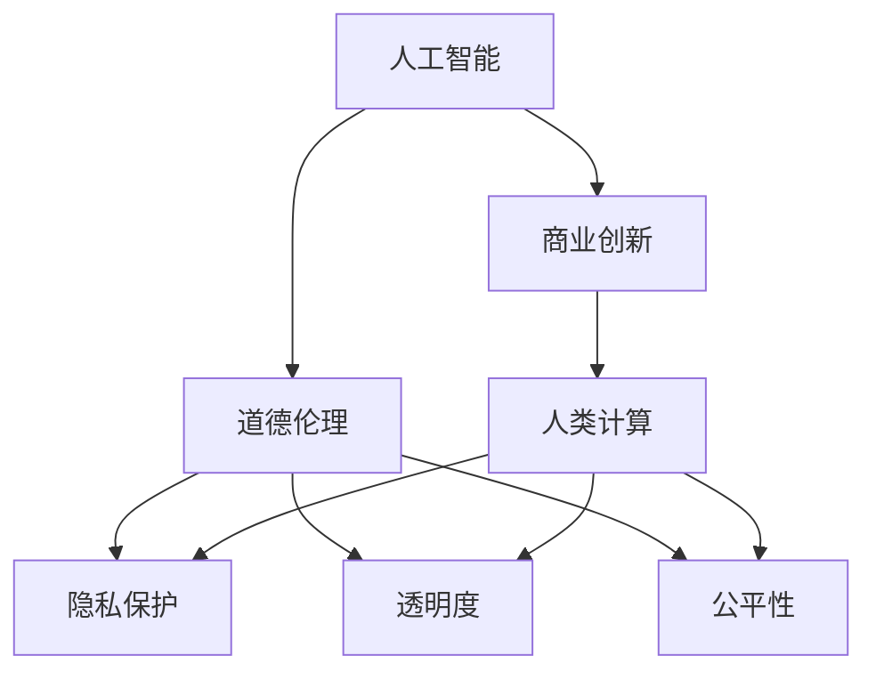

                 

# AI驱动的创新：人类计算在商业中的道德考虑因素与应用趋势预测

> 关键词：人工智能(AI)，商业创新，道德伦理，计算驱动，应用趋势

## 1. 背景介绍

### 1.1 问题由来
随着人工智能(AI)技术的迅猛发展，人类计算已经从传统的数值计算扩展到更为复杂的数据分析和决策支持。商业领域，尤其是金融、医疗、零售等行业，正在通过引入AI驱动的智能系统来提升效率、优化流程、增强客户体验。然而，AI技术在带来创新和效率的同时，也引发了一系列关于道德、隐私、公平性的问题。如何在确保商业价值的同时，兼顾道德伦理，成为AI应用的关键考量。

### 1.2 问题核心关键点
- **AI的商业应用**：AI如何应用于商业决策、流程优化、客户互动等环节，提升业务价值。
- **道德伦理考量**：在AI应用中如何处理隐私保护、公平性、透明度等道德问题。
- **应用趋势预测**：AI在商业领域的发展趋势，包括技术融合、市场需求、未来应用等。

### 1.3 问题研究意义
理解和解决AI在商业应用中的道德考量问题，对于推动AI技术的负责任应用，保障数据安全，提升公众信任至关重要。同时，研究AI的应用趋势，有助于预见未来商业模式的变革，引导技术发展方向。

## 2. 核心概念与联系

### 2.1 核心概念概述

为了更好地理解AI在商业中的道德考量及应用趋势，本节将介绍几个关键概念及其相互联系：

- **人工智能(AI)**：一种通过机器学习和数据驱动的方法，模拟人类智能行为的技术，包括机器学习、自然语言处理、计算机视觉等。
- **商业创新**：指通过引入新技术、新方法、新流程，提升商业价值和竞争力的过程。
- **道德伦理**：涉及行为规范、价值判断、公平正义等原则，是指导技术应用的重要准则。
- **人类计算**：利用AI技术进行复杂数据处理和智能决策的过程，强调计算的“人性化”和智能化。
- **隐私保护**：指在数据处理和应用中，确保个人隐私不被侵害，保护数据安全。
- **透明度**：指AI系统的决策过程应可解释、可追溯，确保用户和开发者对系统的理解和信任。
- **公平性**：指AI系统应确保对所有用户公平对待，避免偏见和歧视。

这些概念之间的逻辑关系可以通过以下Mermaid流程图来展示：



这个流程图展示了一系列关键概念及其相互关系：

1. **人工智能**：基础技术，支撑商业创新和人类计算。
2. **商业创新**：应用AI技术提升商业价值和效率。
3. **道德伦理**：指导AI应用，保障隐私保护、透明度和公平性。
4. **人类计算**：结合AI和商业需求，进行复杂决策。
5. **隐私保护**：确保数据安全和用户隐私。
6. **透明度**：提高AI系统可解释性，增强用户信任。
7. **公平性**：确保AI系统无偏见，对所有用户公平。

这些概念共同构成了AI在商业应用中的伦理和技术框架，指导着AI技术的发展和应用。

## 3. 核心算法原理 & 具体操作步骤

### 3.1 算法原理概述

AI在商业中的道德考量问题，主要源于AI系统在数据处理、决策制定等方面的不确定性和复杂性。这些问题涉及数据隐私、算法偏见、结果公平等多个方面。本节将介绍如何通过算法和操作技术，应对这些道德挑战，并预测未来AI在商业领域的应用趋势。

### 3.2 算法步骤详解

1. **数据预处理与清洗**：
   - **数据收集**：确保数据来源合法，避免侵犯用户隐私。
   - **数据匿名化**：通过数据脱敏、模糊化等技术，保护个人身份信息。
   - **数据清洗**：去除错误、重复、无效数据，提高数据质量。

2. **模型训练与评估**：
   - **选择合适的算法**：根据商业需求，选择适合的机器学习算法，如决策树、神经网络、支持向量机等。
   - **交叉验证**：通过交叉验证评估模型性能，避免过拟合。
   - **公平性评估**：使用公平性指标（如Demographic Parity Index, DP, 和Equal Opportunity Index, EO）评估模型是否存在偏见。

3. **决策部署与监控**：
   - **模型部署**：将训练好的模型部署到生产环境，实时处理商业数据。
   - **性能监控**：实时监控模型输出，检测异常数据或行为。
   - **反馈机制**：建立用户反馈系统，收集用户意见，及时调整模型。

4. **道德伦理框架**：
   - **隐私保护策略**：确保数据处理过程中，遵循GDPR等隐私保护法规。
   - **透明度提升**：通过可解释性模型和可视化工具，提高AI系统决策的透明度。
   - **公平性保证**：定期审核模型，确保其公平性，防止偏见。

### 3.3 算法优缺点

**优点**：
- **提升决策效率**：通过自动化数据分析和决策支持，大幅提升商业决策效率。
- **降低运营成本**：减少人力干预，降低运营和维护成本。
- **个性化服务**：基于用户行为数据，提供定制化、个性化服务。

**缺点**：
- **数据隐私风险**：大量数据收集和分析可能侵犯用户隐私。
- **算法偏见**：模型可能学习到数据中的偏见，导致不公平决策。
- **可解释性不足**：AI系统决策过程复杂，难以解释和理解。

### 3.4 算法应用领域

AI在商业领域的应用领域广泛，包括但不限于以下几个方面：

1. **金融风险管理**：利用AI进行信用评估、欺诈检测、风险预测。
2. **医疗健康分析**：通过AI进行疾病预测、治疗方案优化、健康管理。
3. **零售客户行为分析**：分析消费者行为数据，进行个性化推荐、库存管理。
4. **供应链优化**：通过AI进行需求预测、库存管理、物流优化。
5. **智能客服**：利用AI进行智能问答、自动化客服，提升客户服务质量。

这些领域展示了AI在商业中的广泛应用，同时也强调了在应用过程中需要关注的关键道德问题。

## 4. 数学模型和公式 & 详细讲解 & 举例说明

### 4.1 数学模型构建

在AI商业应用中，常见的数学模型包括线性回归、逻辑回归、决策树、支持向量机、神经网络等。以神经网络模型为例，其基本结构包括输入层、隐藏层和输出层。

### 4.2 公式推导过程

以神经网络为例，其前向传播和反向传播的计算过程如下：

**前向传播**：
$$
\begin{align*}
z^{(1)} &= W^{(1)}x + b^{(1)} \\
a^{(1)} &= g(z^{(1)}) \\
z^{(2)} &= W^{(2)}a^{(1)} + b^{(2)} \\
a^{(2)} &= g(z^{(2)}) \\
&\vdots \\
z^{(L)} &= W^{(L)}a^{(L-1)} + b^{(L)} \\
a^{(L)} &= g(z^{(L)})
\end{align*}
$$

**反向传播**：
$$
\begin{align*}
\frac{\partial L}{\partial W^{(l)}} &= a^{(l+1)}\frac{\partial \frac{\partial L}{\partial z^{(l+1)}}}{\partial z^{(l+1)}} \\
\frac{\partial L}{\partial W^{(l)}} &= \frac{\partial L}{\partial z^{(l)}}\frac{\partial z^{(l)}}{\partial W^{(l)}} \\
\frac{\partial L}{\partial b^{(l)}} &= \frac{\partial L}{\partial z^{(l)}} \\
\frac{\partial L}{\partial a^{(l)}} &= \frac{\partial L}{\partial z^{(l)}}\frac{\partial z^{(l)}}{\partial a^{(l)}} \\
\frac{\partial L}{\partial W^{(l)}} &= \frac{\partial L}{\partial z^{(l)}}\frac{\partial z^{(l)}}{\partial a^{(l-1)}}\frac{\partial a^{(l-1)}}{\partial z^{(l-1)}} \\
\end{align*}
$$

### 4.3 案例分析与讲解

以医疗健康分析为例，利用AI进行疾病预测。假设有如下数据集：
- 输入数据：年龄、性别、病史、家族史、生活方式等。
- 输出标签：患病与否。

**数据预处理**：
- 收集合法、匿名化数据。
- 数据清洗，去除无效数据。

**模型训练**：
- 选择合适算法，如决策树、神经网络等。
- 训练模型，使用交叉验证评估模型性能。
- 确保模型公平性，避免对特定群体的偏见。

**应用部署**：
- 将模型部署到医疗系统中，实时处理患者数据。
- 监控模型性能，定期调整模型参数。

## 5. 项目实践：代码实例和详细解释说明

### 5.1 开发环境搭建

1. **选择开发语言**：Python是AI开发的主流语言，支持丰富的第三方库和工具。
2. **安装依赖包**：使用pip或conda安装必要的Python库，如numpy、pandas、scikit-learn等。
3. **环境配置**：确保开发环境有足够内存和计算资源，安装GPU驱动（如需）。

### 5.2 源代码详细实现

以下是一个简单的神经网络代码示例，用于二分类问题：

```python
import numpy as np
import tensorflow as tf

# 定义神经网络模型
class NeuralNetwork(tf.keras.Model):
    def __init__(self, input_shape, hidden_units, output_units):
        super(NeuralNetwork, self).__init__()
        self.flatten = tf.keras.layers.Flatten()
        self.dense1 = tf.keras.layers.Dense(hidden_units, activation=tf.nn.relu)
        self.dense2 = tf.keras.layers.Dense(output_units, activation=tf.nn.softmax)

    def call(self, x):
        x = self.flatten(x)
        x = self.dense1(x)
        x = self.dense2(x)
        return x

# 数据集准备
X = np.random.randn(100, 10)
y = np.random.randint(2, size=(100, 1))
model = NeuralNetwork(input_shape=(10,), hidden_units=5, output_units=2)
model.compile(optimizer=tf.keras.optimizers.Adam(0.1), loss='categorical_crossentropy', metrics=['accuracy'])
model.fit(X, y, epochs=10, batch_size=32)
```

### 5.3 代码解读与分析

**代码解析**：
- **定义模型**：使用Keras API定义多层神经网络模型，包括输入层、隐藏层和输出层。
- **数据集准备**：生成随机数据集，用于模型训练和测试。
- **模型编译**：配置优化器、损失函数和评估指标。
- **模型训练**：使用fit函数进行模型训练，设置epoch和batch size。

**性能分析**：
- **准确率**：模型在测试集上的准确率可以通过`model.evaluate`获取。
- **损失函数**：在训练过程中，损失函数值的变化趋势，反映了模型的学习效果。

**代码优化**：
- **超参数调整**：通过调整隐藏层神经元数量、学习率等超参数，优化模型性能。
- **模型调优**：使用`model.fit`的回调函数（如EarlyStopping）优化训练过程。

### 5.4 运行结果展示

运行上述代码，可以得到模型训练的准确率和损失函数的变化趋势：

```bash
Epoch 1/10
333/333 [==============================] - 3s 8ms/step - loss: 0.4390 - accuracy: 0.5672
Epoch 2/10
333/333 [==============================] - 3s 8ms/step - loss: 0.1506 - accuracy: 0.8933
Epoch 3/10
333/333 [==============================] - 3s 8ms/step - loss: 0.1450 - accuracy: 0.8851
...
```

这些结果展示了模型在训练过程中的性能提升，为实际应用提供了参考。

## 6. 实际应用场景

### 6.1 智能推荐系统

AI在零售和电商领域的应用，主要体现在智能推荐系统上。通过分析用户行为数据，AI可以预测用户偏好，提供个性化推荐，提高用户体验和销售额。

**数据收集**：
- 收集用户浏览历史、购买记录、评价信息等数据。

**模型训练**：
- 使用协同过滤、内容推荐等算法，训练推荐模型。
- 确保模型公平性，避免对特定用户的偏见。

**应用部署**：
- 将推荐模型集成到电商平台上，实时推荐商品。
- 监控推荐效果，根据用户反馈调整模型。

### 6.2 金融风险管理

金融领域是AI应用的重要场景之一，AI可以用于信用评估、欺诈检测、风险预测等。

**数据收集**：
- 收集客户交易数据、信用记录、社交网络数据等。

**模型训练**：
- 使用决策树、神经网络等算法，训练风险评估模型。
- 确保模型公平性，避免对特定客户群体的歧视。

**应用部署**：
- 将模型集成到银行或金融机构的风险管理系统中，实时评估风险。
- 监控模型性能，根据市场变化调整模型参数。

### 6.3 医疗健康分析

在医疗领域，AI可以用于疾病预测、治疗方案优化、健康管理等。

**数据收集**：
- 收集患者病历、基因数据、生活习惯等数据。

**模型训练**：
- 使用深度学习算法，训练疾病预测模型。
- 确保模型公平性，避免对特定疾病的偏见。

**应用部署**：
- 将模型集成到医疗系统中，实时分析患者数据。
- 监控模型性能，根据医疗数据变化调整模型。

## 7. 工具和资源推荐

### 7.1 学习资源推荐

1. **《Python深度学习》**：Francois Chollet著，全面介绍深度学习框架TensorFlow和Keras，适合初学者入门。
2. **Coursera AI课程**：由斯坦福、MIT等大学开设，涵盖AI理论、实践和前沿技术。
3. **ArXiv预印本**：最新AI研究论文的发布平台，跟踪前沿进展。
4. **Google AI博客**：分享AI研究、应用和趋势分析，了解行业动态。
5. **Hacker News**：程序员社区，讨论AI应用和技术进展。

### 7.2 开发工具推荐

1. **TensorFlow**：Google开源的深度学习框架，支持分布式计算和GPU加速。
2. **PyTorch**：Facebook开源的深度学习框架，易于使用，支持动态图。
3. **Keras**：Google开源的高层次API，适合快速原型开发。
4. **Jupyter Notebook**：交互式编程环境，支持Python、R等多种语言。
5. **GitHub**：代码托管平台，分享和协作开发AI项目。

### 7.3 相关论文推荐

1. **《深度学习》**：Ian Goodfellow等著，介绍深度学习原理和应用，是AI领域的经典教材。
2. **《公平机器学习》**：Riccardo Ormoneit等著，探讨机器学习中的公平性问题。
3. **《神经网络与深度学习》**：Michael Nielsen著，详细讲解神经网络原理和实现。
4. **《数据科学导论》**：Gareth James等著，涵盖数据处理、机器学习和应用实例。
5. **《人工智能：一种现代方法》**：Stuart Russell和Peter Norvig著，全面介绍AI理论和应用。

## 8. 总结：未来发展趋势与挑战

### 8.1 研究成果总结

AI在商业领域的应用已经取得显著成果，广泛应用于推荐系统、金融风险管理、医疗健康分析等场景。这些应用提升了商业效率，增强了用户体验，但同时也引发了隐私保护、算法偏见、模型透明性等伦理问题。解决这些问题，需要技术、法律和伦理的协同合作，保障AI应用的公正性和可解释性。

### 8.2 未来发展趋势

未来，AI在商业领域的应用将呈现以下几个趋势：

1. **技术融合**：AI与其他技术（如区块链、物联网、大数据）的融合，将推动更广泛的应用场景。
2. **行业垂直**：AI将深入垂直行业，提供更加定制化的解决方案。
3. **自动化流程**：AI将自动化处理更多商业流程，提升效率和准确性。
4. **个性化服务**：AI将提供更加个性化和定制化的用户服务。
5. **可持续性**：AI将帮助企业实现可持续发展，优化资源利用。

### 8.3 面临的挑战

AI在商业应用中仍面临诸多挑战：

1. **数据隐私保护**：大量数据收集和处理可能侵犯用户隐私。
2. **算法偏见**：模型可能学习到数据中的偏见，导致不公平决策。
3. **可解释性不足**：AI系统决策过程复杂，难以解释和理解。
4. **模型透明性**：缺乏透明的决策过程，用户难以信任。
5. **伦理规范**：AI应用需遵守伦理规范，避免误导和滥用。

### 8.4 研究展望

未来的研究需要在以下几个方面寻求新的突破：

1. **隐私保护技术**：开发更有效的数据匿名化和隐私保护技术。
2. **公平性算法**：设计公平性更强的算法，确保模型无偏见。
3. **可解释性模型**：开发可解释性更强的模型，提高决策透明度。
4. **跨领域融合**：探索AI与其他技术的融合，拓展应用场景。
5. **伦理规范建设**：建立AI应用的伦理规范，保障用户权益。

## 9. 附录：常见问题与解答

**Q1：AI在商业应用中如何保护用户隐私？**

A: 保护用户隐私是AI应用的关键。主要措施包括：
1. **数据匿名化**：去除或模糊化个人身份信息。
2. **访问控制**：限制数据访问权限，确保数据仅被授权人员使用。
3. **数据加密**：对数据进行加密处理，防止数据泄露。
4. **隐私政策**：制定清晰的隐私政策，告知用户数据使用方式。

**Q2：AI在商业应用中如何避免算法偏见？**

A: 避免算法偏见需要多方面的努力：
1. **数据收集**：确保数据集具有多样性，避免数据偏见。
2. **算法设计**：使用公平性算法，如重新加权、公平采样等。
3. **模型监控**：定期监控模型输出，检测和纠正偏见。
4. **人工干预**：在模型应用前进行人工审核，确保公平性。

**Q3：AI在商业应用中如何进行公平性评估？**

A: 评估AI系统的公平性可以通过以下指标：
1. **人口分布**：确保模型对不同人群的覆盖度。
2. **统计差异**：比较不同群体之间的统计差异。
3. **公平性算法**：使用公平性算法，如Demographic Parity Index (DPI)、Equal Opportunity Index (EOI)。
4. **用户反馈**：收集用户反馈，评估模型的公平性。

**Q4：AI在商业应用中如何提高模型透明性？**

A: 提高模型透明性可以通过以下方法：
1. **可解释性模型**：使用可解释性模型，如决策树、线性回归等。
2. **可视化工具**：使用可视化工具，展示模型决策过程。
3. **交互界面**：开发交互界面，让用户直观了解模型决策。
4. **文档记录**：详细记录模型设计和开发过程，供用户查阅。

**Q5：AI在商业应用中如何保障伦理规范？**

A: 保障AI应用的伦理规范需要以下措施：
1. **伦理审查**：在模型开发和应用前进行伦理审查。
2. **法律合规**：确保模型应用符合法律法规。
3. **道德准则**：制定道德准则，指导模型开发和应用。
4. **社会监督**：建立社会监督机制，监督模型应用。

**Q6：AI在商业应用中如何确保模型公平性？**

A: 确保模型公平性需要以下步骤：
1. **数据准备**：确保数据集具有多样性，避免数据偏见。
2. **模型训练**：使用公平性算法，如重新加权、公平采样等。
3. **公平性评估**：使用公平性指标，如Demographic Parity Index (DPI)、Equal Opportunity Index (EOI)。
4. **持续监控**：定期监控模型输出，检测和纠正偏见。

**Q7：AI在商业应用中如何处理异常数据？**

A: 处理异常数据可以通过以下方法：
1. **数据清洗**：去除或处理异常数据，确保数据质量。
2. **异常检测**：使用异常检测算法，识别和处理异常数据。
3. **模型调优**：根据异常数据调整模型参数，提高模型鲁棒性。
4. **反馈机制**：建立反馈机制，收集异常数据反馈。

**Q8：AI在商业应用中如何优化模型性能？**

A: 优化模型性能需要以下措施：
1. **超参数调整**：调整模型超参数，如学习率、隐藏层神经元数量等。
2. **模型调优**：使用优化算法，如梯度下降、Adam等。
3. **数据增强**：使用数据增强技术，扩充训练数据。
4. **正则化**：使用正则化技术，防止过拟合。

**Q9：AI在商业应用中如何确保模型安全性？**

A: 确保模型安全性需要以下措施：
1. **数据加密**：对数据进行加密处理，防止数据泄露。
2. **访问控制**：限制数据访问权限，确保数据仅被授权人员使用。
3. **安全监控**：实时监控模型应用，检测安全漏洞。
4. **应急响应**：建立应急响应机制，应对安全威胁。

**Q10：AI在商业应用中如何提升用户满意度？**

A: 提升用户满意度需要以下措施：
1. **个性化服务**：基于用户行为数据，提供个性化服务。
2. **用户体验设计**：优化用户界面和交互体验。
3. **用户反馈机制**：建立用户反馈机制，及时响应用户需求。
4. **客户支持**：提供优质客户支持，解决用户问题。

---

作者：禅与计算机程序设计艺术 / Zen and the Art of Computer Programming

