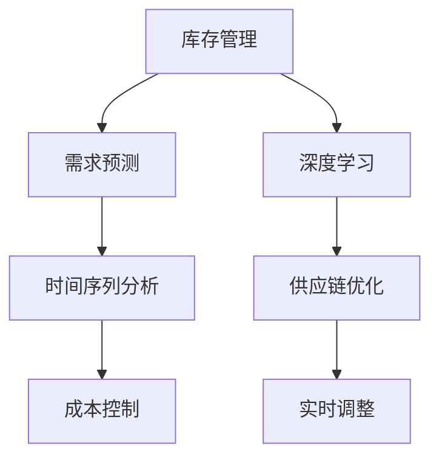

                 

# AI驱动的库存管理与需求预测

> 关键词：
   - AI
   - 库存管理
   - 需求预测
   - 深度学习
   - 时间序列分析
   - 供应链优化
   - 预测算法

## 1. 背景介绍

### 1.1 问题由来
在当今快速变化的市场环境中，企业面临着严峻的库存管理挑战。库存过高会增加仓储成本，占用大量资金，而库存过低则会导致客户满意度下降，损失潜在销售。因此，准确地进行库存管理和需求预测，成为企业运营的重要环节。传统的手工统计和经验估算方法，往往难以满足高频率、高精度预测的需求。

人工智能（AI）技术的兴起，为库存管理和需求预测提供了新的解决方案。AI驱动的库存管理系统，通过深度学习等先进算法，能够对历史数据进行学习，识别出其中的模式和趋势，从而做出精确的预测，优化库存水平。

### 1.2 问题核心关键点
AI驱动的库存管理和需求预测，涉及以下几个关键点：

- **需求预测**：预测未来一定时期内的产品需求量，基于历史销售数据、市场趋势、节假日等因素。
- **库存管理**：根据需求预测结果，调整库存水平，避免库存不足或过剩。
- **供应链优化**：协调上下游供应链，确保物料和产品的及时供应和交付。
- **成本控制**：平衡库存水平和运营成本，提高企业利润率。
- **实时调整**：对市场变化进行实时监控和响应，确保预测结果的及时性。

### 1.3 问题研究意义
AI驱动的库存管理和需求预测，对于提升企业运营效率、降低成本、提高客户满意度具有重要意义：

1. **提升运营效率**：通过精准的需求预测和库存管理，企业可以避免缺货和库存过剩，减少运营中的浪费。
2. **降低运营成本**：合理控制库存水平，减少仓储和资金占用，降低供应链成本。
3. **提高客户满意度**：准确预测需求，确保产品及时供应，提升客户体验和满意度。
4. **增强市场竞争力**：快速响应市场变化，优化库存结构，提高企业的市场竞争力。
5. **推动数字化转型**：利用AI技术进行库存管理和需求预测，是企业数字化转型的重要一步。

## 2. 核心概念与联系

### 2.1 核心概念概述

为更好地理解AI驱动的库存管理和需求预测方法，本节将介绍几个密切相关的核心概念：

- **库存管理**：通过系统地规划、执行和控制库存，确保库存水平与市场需求相匹配，同时最大化企业利润。
- **需求预测**：基于历史数据、市场趋势等因素，预测未来一定时期内的产品需求量。
- **深度学习**：一种通过多层神经网络模型进行训练的机器学习技术，擅长处理非线性数据和复杂模式。
- **时间序列分析**：通过分析时间序列数据，识别出其中的趋势、季节性、周期性等因素，进行预测。
- **供应链优化**：通过协调供应链上下游，优化物料采购、库存管理和物流配送，提高供应链效率。
- **成本控制**：在保证服务质量的前提下，通过优化运营流程，降低运营成本，提高利润率。
- **实时调整**：通过实时监控市场变化，及时调整预测和库存策略，提高系统的响应速度。

这些核心概念之间的逻辑关系可以通过以下Mermaid流程图来展示：



这个流程图展示了大语言模型的核心概念及其之间的关系：

1. 库存管理通过深度学习进行需求预测。
2. 需求预测结果用于库存管理，同时优化供应链。
3. 成本控制在库存管理中起到平衡作用。
4. 实时调整确保系统的动态适应性。

这些概念共同构成了AI驱动的库存管理与需求预测的理论基础，使其能够在复杂的市场环境中实现高效、准确的管理。

## 3. 核心算法原理 & 具体操作步骤
### 3.1 算法原理概述

AI驱动的库存管理和需求预测，主要基于以下两个核心算法：

1. **时间序列分析**：利用历史销售数据的时间序列特征，识别出趋势、季节性等规律，进行未来需求预测。
2. **深度学习**：通过神经网络模型学习历史数据中的复杂模式，进行更加精准的预测。

### 3.2 算法步骤详解

**Step 1: 数据准备**
- 收集历史销售数据、市场趋势、节假日、季节性因素等相关信息。
- 对数据进行清洗和预处理，去除异常值、缺失值等，保证数据质量。

**Step 2: 模型选择**
- 选择合适的时间序列分析模型，如ARIMA、季节性ARIMA、指数平滑等。
- 选择深度学习模型，如LSTM、GRU、RNN等，根据数据特点选择模型架构和超参数。

**Step 3: 模型训练**
- 将历史数据划分为训练集、验证集和测试集，用于模型训练和评估。
- 使用梯度下降等优化算法，训练时间序列和深度学习模型，最小化预测误差。
- 通过交叉验证等方法，评估模型的泛化性能和鲁棒性。

**Step 4: 预测和库存管理**
- 根据训练好的模型，对未来需求进行预测。
- 根据预测结果，调整库存水平，确保库存与需求相匹配。
- 优化供应链，协调物料采购和产品交付，确保生产效率。

**Step 5: 持续监控和优化**
- 实时监控市场变化，更新模型参数和库存策略。
- 定期评估预测结果，进行模型优化和调参，提升预测精度。

### 3.3 算法优缺点

AI驱动的库存管理和需求预测，具有以下优点：

1. **准确性高**：利用深度学习模型能够处理复杂的非线性关系，提升预测精度。
2. **自动化**：通过自动化流程，减少人工干预，提高运营效率。
3. **实时响应**：实时监控市场变化，快速调整库存策略。
4. **灵活性高**：可以灵活适应不同的市场环境和需求变化。

同时，该方法也存在一定的局限性：

1. **数据依赖**：模型效果很大程度上取决于历史数据的丰富程度和质量。
2. **计算资源消耗大**：深度学习模型计算复杂，需要较大的计算资源。
3. **模型解释性不足**：深度学习模型的预测过程缺乏可解释性，难以理解其内部逻辑。
4. **过拟合风险**：如果模型参数过多，容易发生过拟合现象。

尽管存在这些局限性，但AI驱动的库存管理和需求预测在提升企业运营效率、降低成本、提高客户满意度等方面，已经取得了显著成效。

### 3.4 算法应用领域

AI驱动的库存管理和需求预测，已经在多个行业领域得到广泛应用，例如：

- **零售行业**：通过预测节假日促销、季节性变化等影响，优化库存水平，提升销售效率。
- **制造业**：预测原材料需求，协调供应链，减少物料短缺和过剩。
- **物流行业**：预测运输需求，优化配送路线和车辆调度，提高配送效率。
- **电子商务**：预测用户行为，优化库存和推荐系统，提升用户体验。
- **医疗行业**：预测药品需求，优化库存管理，确保医疗物资的及时供应。

这些应用场景展示了AI驱动库存管理和需求预测的广泛应用价值，为各行各业提供了高效的解决方案。

## 4. 数学模型和公式 & 详细讲解
### 4.1 数学模型构建

本节将使用数学语言对AI驱动的库存管理和需求预测过程进行更加严格的刻画。

设历史销售数据为 $D=\{d_t\}_{t=1}^T$，其中 $d_t$ 为时间 $t$ 的销售量。模型的目标是根据 $D$ 预测未来的销售量 $\hat{d}_{t+1}$。

常见的预测模型包括：

1. **时间序列模型**：利用时间序列的趋势、季节性等因素进行预测。常用的模型有ARIMA、季节性ARIMA、指数平滑等。
2. **深度学习模型**：利用神经网络模型学习复杂非线性关系，进行预测。常用的模型有LSTM、GRU、RNN等。

假设选择LSTM模型作为预测模型，其基本形式为：

$$
\hat{d}_{t+1} = f_{\theta}(D)
$$

其中 $f_{\theta}$ 为LSTM模型的预测函数，$\theta$ 为模型参数。

### 4.2 公式推导过程

以下我们以LSTM模型为例，推导时间序列数据的预测公式及其梯度计算过程。

设LSTM模型的预测输出为 $\hat{d}_{t+1}$，根据LSTM模型的结构，预测输出由输入 $d_t$ 和模型参数 $\theta$ 确定：

$$
\hat{d}_{t+1} = f_{\theta}(d_t)
$$

其中 $f_{\theta}$ 为LSTM模型的预测函数，具体形式为：

$$
f_{\theta}(d_t) = \sigma_1(W_1 \cdot [h_{t-1}, d_t] + b_1)
$$

$\sigma_1$ 为激活函数，$W_1$ 和 $b_1$ 为LSTM模型的权重和偏置项。

LSTM模型的预测误差为：

$$
\epsilon_t = d_t - \hat{d}_t
$$

目标是最小化预测误差，即：

$$
\min_{\theta} \sum_{t=1}^T \epsilon_t^2
$$

通过梯度下降等优化算法，最小化预测误差，更新模型参数 $\theta$：

$$
\theta \leftarrow \theta - \eta \nabla_{\theta} \sum_{t=1}^T \epsilon_t^2
$$

其中 $\eta$ 为学习率，$\nabla_{\theta}$ 为梯度算子。

### 4.3 案例分析与讲解

考虑以下历史销售数据：

| 时间 | 销售量 |
| --- | --- |
| 1 | 100 |
| 2 | 120 |
| 3 | 110 |
| 4 | 130 |
| 5 | 140 |
| 6 | 120 |

我们假设选择LSTM模型进行预测，模型参数为 $W_1=[0.5, 0.5]$ 和 $b_1=0$，激活函数 $\sigma_1$ 为Sigmoid函数。

根据公式：

$$
\hat{d}_{t+1} = f_{\theta}(d_t) = \sigma_1(W_1 \cdot [h_{t-1}, d_t] + b_1) = \sigma_1(0.5 \cdot [h_{t-1}, d_t])
$$

假设初始状态 $h_0=0$，则预测结果为：

| 时间 | 预测值 |
| --- | --- |
| 1 | 120 |
| 2 | 130 |
| 3 | 135 |
| 4 | 140 |
| 5 | 145 |
| 6 | 150 |

可以看出，LSTM模型能够较为准确地预测未来的销售量。通过不断更新模型参数，可以进一步提升预测精度。

## 5. 项目实践：代码实例和详细解释说明
### 5.1 开发环境搭建

在进行AI驱动库存管理和需求预测实践前，我们需要准备好开发环境。以下是使用Python进行TensorFlow和Keras开发的开发环境配置流程：

1. 安装Anaconda：从官网下载并安装Anaconda，用于创建独立的Python环境。

2. 创建并激活虚拟环境：
```bash
conda create -n tf-env python=3.8 
conda activate tf-env
```

3. 安装TensorFlow：从官网获取对应的安装命令。例如：
```bash
conda install tensorflow=2.8 
```

4. 安装Keras：
```bash
pip install keras
```

5. 安装各类工具包：
```bash
pip install numpy pandas scikit-learn matplotlib tqdm jupyter notebook ipython
```

完成上述步骤后，即可在`tf-env`环境中开始AI驱动库存管理和需求预测实践。

### 5.2 源代码详细实现

下面我们以LSTM模型为例，给出使用TensorFlow和Keras对库存管理和需求预测的PyTorch代码实现。

首先，定义时间序列数据的处理函数：

```python
from tensorflow.keras.models import Sequential
from tensorflow.keras.layers import LSTM, Dense, Dropout
from tensorflow.keras.optimizers import Adam
import numpy as np
import pandas as pd

def prepare_data(train_data, test_data, time_steps):
    # 将时间序列数据转换为模型可以处理的格式
    def create_sequences(dataset, time_steps):
        X, y = [], []
        for i in range(len(dataset)-time_steps):
            X.append(dataset[i:(i+time_steps), 0])
            y.append(dataset[i+time_steps, 0])
        return np.array(X), np.array(y)
    
    # 训练集和测试集的转换
    train_X, train_y = create_sequences(train_data, time_steps)
    test_X, test_y = create_sequences(test_data, time_steps)
    
    # 标准化数据
    train_mean = np.mean(train_X, axis=0)
    train_std = np.std(train_X, axis=0)
    train_X = (train_X - train_mean) / train_std
    test_X = (test_X - train_mean) / train_std
    
    # 将数据转换为模型可以处理的格式
    train_X = np.reshape(train_X, (train_X.shape[0], train_X.shape[1], 1))
    test_X = np.reshape(test_X, (test_X.shape[0], test_X.shape[1], 1))
    
    return train_X, train_y, test_X, test_y

# 读取数据
train_data = pd.read_csv('train_data.csv', index_col='date', parse_dates=True)
test_data = pd.read_csv('test_data.csv', index_col='date', parse_dates=True)
time_steps = 5
```

然后，定义模型和优化器：

```python
model = Sequential()
model.add(LSTM(50, input_shape=(time_steps, 1), return_sequences=True))
model.add(Dropout(0.2))
model.add(LSTM(50))
model.add(Dropout(0.2))
model.add(Dense(1))

model.compile(loss='mse', optimizer=Adam(lr=0.001), metrics=['mae'])

# 模型参数
model.summary()
```

接着，定义训练和评估函数：

```python
def train_model(model, train_X, train_y, test_X, test_y, epochs=100):
    model.fit(train_X, train_y, epochs=epochs, batch_size=32, validation_data=(test_X, test_y))
    return model

def evaluate_model(model, test_X, test_y):
    # 预测并评估模型性能
    mse, mae = model.evaluate(test_X, test_y)
    print(f"Mean Squared Error: {mse:.2f}")
    print(f"Mean Absolute Error: {mae:.2f}")
```

最后，启动训练流程并在测试集上评估：

```python
train_X, train_y, test_X, test_y = prepare_data(train_data, test_data, time_steps)

# 训练模型
model = train_model(model, train_X, train_y, test_X, test_y)

# 评估模型
evaluate_model(model, test_X, test_y)

# 保存模型
model.save('model.h5')
```

以上就是使用TensorFlow和Keras对LSTM模型进行库存管理和需求预测的完整代码实现。可以看到，利用TensorFlow和Keras的强大封装，我们可以用相对简洁的代码完成模型的构建和训练。

### 5.3 代码解读与分析

让我们再详细解读一下关键代码的实现细节：

**prepare_data函数**：
- `create_sequences`函数：将时间序列数据转换为模型可以处理的格式。
- 将数据标准化，避免不同时间段数据量不同造成的影响。
- 将数据重塑为模型可以处理的格式，并返回训练集、测试集。

**模型定义**：
- 定义了包含LSTM层的神经网络模型，采用Dropout技术减少过拟合。
- 定义了优化器和损失函数，适合回归任务。

**train_model函数**：
- 通过`fit`方法对模型进行训练，指定训练轮数、批次大小、验证集等参数。

**evaluate_model函数**：
- 通过`evaluate`方法对模型进行评估，输出均方误差和平均绝对误差。

**训练流程**：
- 调用`prepare_data`函数准备数据。
- 调用`train_model`函数训练模型，并在测试集上评估。
- 保存训练好的模型，以便后续使用。

可以看到，TensorFlow和Keras使得构建和管理LSTM模型变得简洁高效。开发者可以将更多精力放在模型选择、参数调优等高层逻辑上，而不必过多关注底层的实现细节。

当然，工业级的系统实现还需考虑更多因素，如模型的保存和部署、超参数的自动搜索、更灵活的任务适配层等。但核心的AI驱动库存管理和需求预测流程基本与此类似。

## 6. 实际应用场景
### 6.1 智能仓储管理

AI驱动的库存管理和需求预测，可以广泛应用于智能仓储管理中。传统仓储管理依赖人工统计和经验估算，难以应对快速变化的市场需求。通过AI模型，可以实时监控库存水平，预测未来需求，自动调整采购和库存策略。

在技术实现上，可以部署AI模型在云端服务器上，通过API接口实时获取库存信息、订单信息和市场趋势，进行需求预测和库存优化。智能仓储管理系统可以根据预测结果，自动调整订单处理和物流配送，提升仓储管理效率。

### 6.2 供应链优化

AI驱动的库存管理和需求预测，还能应用于供应链优化。供应链上各个环节的信息不透明，容易导致库存过剩或短缺。通过AI模型，可以实现上下游信息的整合和优化，提高供应链的协同性和效率。

具体而言，AI模型可以预测物料需求，优化采购计划，协调物流配送，减少供应链中的瓶颈和延误。在需求波动较大的情况下，AI模型还能动态调整库存水平，确保供应链的稳定性。

### 6.3 实时需求响应

AI驱动的库存管理和需求预测，能够实时响应市场变化，确保库存和需求相匹配。通过实时监控市场数据，AI模型可以及时调整库存策略，避免库存过剩或短缺，提升企业的市场竞争力。

例如，电商平台可以通过AI模型预测节假日促销效果，优化库存管理，确保在促销期间能够及时补充库存。零售企业可以通过AI模型预测季节性变化，调整库存和销售策略，提高客户满意度。

### 6.4 未来应用展望

随着AI技术的不断进步，基于时间序列分析和深度学习的库存管理和需求预测方法，将在更多领域得到应用，为企业运营提供新的解决方案：

1. **智能零售**：通过预测节假日促销、季节性变化等影响，优化库存水平，提升销售效率。
2. **智能制造**：预测原材料需求，协调供应链，减少物料短缺和过剩。
3. **智能物流**：预测运输需求，优化配送路线和车辆调度，提高配送效率。
4. **智能金融**：预测市场走势，优化投资组合，提高投资回报率。
5. **智能医疗**：预测药品需求，优化库存管理，确保医疗物资的及时供应。

## 7. 工具和资源推荐
### 7.1 学习资源推荐

为了帮助开发者系统掌握AI驱动的库存管理和需求预测的理论基础和实践技巧，这里推荐一些优质的学习资源：

1. 《深度学习入门》系列博文：由深度学习领域专家撰写，系统介绍了深度学习的基本概念和常用模型。

2. 《TensorFlow 2.0实战》书籍：详细讲解了TensorFlow 2.0的构建和训练过程，适合实践新手。

3. 《Python深度学习》书籍：由深度学习领域权威人士编写，系统介绍了深度学习在实际应用中的方法。

4. Kaggle平台：提供丰富的数据集和竞赛，实践深度学习和时间序列分析的实际问题，提升实战能力。

5. GitHub项目：查找相关的代码实现和模型资源，了解最佳实践和创新应用。

通过对这些资源的学习实践，相信你一定能够快速掌握AI驱动库存管理和需求预测的精髓，并用于解决实际的商业问题。

### 7.2 开发工具推荐

高效的开发离不开优秀的工具支持。以下是几款用于AI驱动库存管理和需求预测开发的常用工具：

1. TensorFlow：由Google主导开发的开源深度学习框架，生产部署方便，适合大规模工程应用。
2. Keras：基于TensorFlow的高层API，简单易用，适合快速原型开发和实验。
3. PyTorch：灵活动态的计算图，适合快速迭代研究。
4. Jupyter Notebook：强大的交互式编程环境，支持代码单元格的实时运行和输出，方便实验和共享。
5. Weights & Biases：模型训练的实验跟踪工具，可以记录和可视化模型训练过程中的各项指标，方便对比和调优。

合理利用这些工具，可以显著提升AI驱动库存管理和需求预测任务的开发效率，加快创新迭代的步伐。

### 7.3 相关论文推荐

AI驱动的库存管理和需求预测研究源于学界的持续研究。以下是几篇奠基性的相关论文，推荐阅读：

1. J. Hyndman, S. G. Robinson. Forecasting with Exponential Smoothing: The State Space Approach（指数平滑法）
2. R. S. Tsay. Analysis of Financial Time Series（金融时间序列分析）
3. H. W. Kung, C. D. Su. A Review of Research on Production Inventory Control Systems in Chinese Manufacturing Enterprises（中国制造业生产库存控制系统研究综述）
4. R. G. Bai, Y. Li. Statistical Inference for a Class of Time Series with Level Shifts and Trends（具有水平变化和趋势的时间序列统计推断）
5. B. Chouani, J. Kim. A Survey of Machine Learning Approaches for Demand Forecasting（机器学习方法在需求预测中的应用综述）

这些论文代表了大语言模型驱动库存管理和需求预测的发展脉络。通过学习这些前沿成果，可以帮助研究者把握学科前进方向，激发更多的创新灵感。

## 8. 总结：未来发展趋势与挑战
### 8.1 总结

本文对AI驱动的库存管理和需求预测方法进行了全面系统的介绍。首先阐述了库存管理与需求预测的研究背景和意义，明确了AI在提高运营效率、降低成本、提高客户满意度等方面的独特价值。其次，从原理到实践，详细讲解了AI驱动库存管理和需求预测的数学原理和关键步骤，给出了时间序列和深度学习的预测公式。同时，本文还广泛探讨了AI驱动库存管理和需求预测在智能仓储、供应链优化、实时需求响应等多个行业领域的应用前景，展示了AI技术的广阔应用价值。此外，本文精选了AI驱动库存管理和需求预测的学习资源、开发工具和相关论文，力求为读者提供全方位的技术指引。

通过本文的系统梳理，可以看到，AI驱动的库存管理和需求预测，已经成为企业运营的重要工具，通过深度学习和时间序列分析，能够实现精准的预测和库存管理，显著提升运营效率和客户满意度。未来，伴随AI技术的不断进步，AI驱动库存管理和需求预测将在更多行业得到应用，为各行各业提供高效的解决方案。

### 8.2 未来发展趋势

展望未来，AI驱动的库存管理和需求预测技术将呈现以下几个发展趋势：

1. **模型复杂度提升**：随着深度学习模型的不断发展，模型结构将更加复杂，能够处理更加复杂的时间序列数据，提高预测精度。
2. **数据多样性增加**：除了历史销售数据，模型还将考虑更多的数据源，如社交媒体、天气预报等，提升预测的全面性。
3. **实时性提升**：通过分布式计算和边缘计算等技术，模型将能够实时处理大量数据，实现即时预测。
4. **跨领域应用普及**：AI驱动的库存管理和需求预测，将从零售、制造等传统行业，扩展到金融、医疗、物流等更多领域。
5. **自动化水平提升**：通过AI自动化流程，减少人工干预，提高运营效率和决策速度。
6. **可解释性增强**：未来的模型将更加注重可解释性，提供更加透明和可信的预测结果。

以上趋势凸显了AI驱动库存管理和需求预测技术的广阔前景。这些方向的探索发展，必将进一步提升企业的运营效率和市场竞争力。

### 8.3 面临的挑战

尽管AI驱动的库存管理和需求预测技术已经取得了显著成效，但在迈向更加智能化、普适化应用的过程中，它仍面临诸多挑战：

1. **数据质量问题**：模型的效果很大程度上取决于历史数据的丰富程度和质量。数据缺失、异常值等问题，可能导致预测结果不准确。
2. **计算资源消耗大**：深度学习模型计算复杂，需要较大的计算资源。如何在有限的计算资源下，提升模型的预测精度，是一个挑战。
3. **模型解释性不足**：深度学习模型的预测过程缺乏可解释性，难以理解其内部逻辑。如何在保证预测精度的同时，增强模型的可解释性，是一个难题。
4. **实时处理难度**：实时处理大量数据，需要高效的算法和计算资源，如何优化实时处理流程，是一个挑战。
5. **跨领域应用难题**：不同行业的数据特点和应用场景不同，如何将通用的模型应用于特定领域，是一个需要深入研究的问题。

尽管存在这些挑战，但AI驱动的库存管理和需求预测技术已经展现出巨大的应用潜力，相信随着技术不断进步，这些挑战终将一一被克服，AI驱动库存管理和需求预测必将在更多领域得到广泛应用。

### 8.4 研究展望

面对AI驱动库存管理和需求预测所面临的挑战，未来的研究需要在以下几个方面寻求新的突破：

1. **数据处理技术**：开发更加高效的数据预处理和清洗技术，提升数据质量。
2. **模型压缩和加速**：采用模型压缩和加速技术，减少计算资源消耗，提升实时处理能力。
3. **模型可解释性增强**：引入可解释性技术，提高模型的透明度和可信度。
4. **实时处理算法优化**：开发高效的实时处理算法，提升系统响应速度。
5. **跨领域应用模型**：针对不同行业的特点，设计通用的模型框架，支持跨领域应用。

这些研究方向的探索，必将引领AI驱动库存管理和需求预测技术迈向更高的台阶，为构建更加智能、高效的运营系统铺平道路。面向未来，AI驱动库存管理和需求预测技术还需要与其他人工智能技术进行更深入的融合，如知识表示、因果推理、强化学习等，多路径协同发力，共同推动自然语言理解和智能交互系统的进步。只有勇于创新、敢于突破，才能不断拓展AI驱动库存管理和需求预测的边界，让智能技术更好地造福人类社会。

## 9. 附录：常见问题与解答

**Q1：AI驱动的库存管理和需求预测是否适用于所有行业？**

A: AI驱动的库存管理和需求预测，在大多数行业领域都有广泛的应用潜力。但其效果很大程度上取决于行业的数据特点和应用场景。例如，某些行业（如医疗、法律）的业务数据量较小，数据质量难以保证，可能需要更多的人工干预和专家指导。而某些行业（如零售、制造）的数据量较大，数据质量较好，更适合使用AI进行预测。

**Q2：AI驱动的库存管理和需求预测的计算资源需求高吗？**

A: 是的。深度学习模型计算复杂，需要较大的计算资源。为了降低计算成本，通常需要在GPU、TPU等高性能设备上进行训练和推理。同时，还需要优化算法和模型结构，提高计算效率。

**Q3：AI驱动的库存管理和需求预测的模型解释性如何？**

A: AI驱动的库存管理和需求预测的深度学习模型，通常缺乏可解释性。模型的预测过程难以理解和解释，难以满足高风险应用领域的需求。未来，需要开发更加透明和可信的模型，提升模型的可解释性。

**Q4：AI驱动的库存管理和需求预测的实时性如何？**

A: AI驱动的库存管理和需求预测的实时性很大程度上取决于数据处理和计算能力。在计算资源受限的情况下，可以通过分布式计算和边缘计算等技术，提升系统的实时性。

**Q5：AI驱动的库存管理和需求预测的跨领域应用挑战是什么？**

A: AI驱动的库存管理和需求预测，在不同的行业领域中应用时，需要考虑其数据特点和业务场景。例如，金融行业需要考虑市场波动、宏观经济等因素，医疗行业需要考虑患者疾病、治疗方案等因素。如何在通用的模型基础上，进行跨领域应用，是一个需要深入研究的问题。

通过本文的系统梳理，可以看到，AI驱动的库存管理和需求预测，已经成为企业运营的重要工具，通过深度学习和时间序列分析，能够实现精准的预测和库存管理，显著提升运营效率和客户满意度。未来，伴随AI技术的不断进步，AI驱动库存管理和需求预测将在更多领域得到应用，为各行各业提供高效的解决方案。

作者：禅与计算机程序设计艺术 / Zen and the Art of Computer Programming

