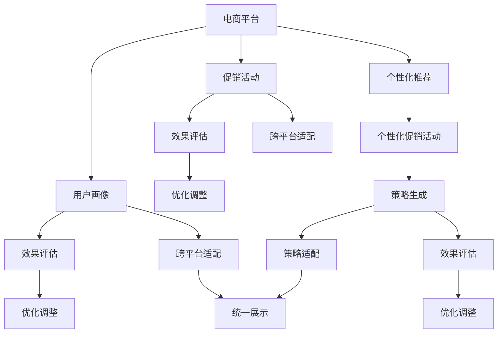

                 

# AI驱动的电商个性化促销活动设计系统

## 1. 背景介绍

### 1.1 问题由来
电商行业随着互联网技术的飞速发展，竞争愈发激烈，传统的促销方式（如价格战、折扣码等）已难以激起消费者的兴趣。为了提升转化率、提高客户满意度，电商企业正在探索更加个性化、精准化的促销策略。AI驱动的电商个性化促销活动设计系统，基于对用户行为、偏好和历史数据的深度学习分析，能够动态生成个性化的促销活动，实现高效的转化提升。

### 1.2 问题核心关键点
面向电商促销活动设计，AI驱动的系统必须解决以下几个关键问题：
1. **用户画像构建**：准确刻画用户特征，理解用户偏好。
2. **促销策略生成**：基于用户画像生成个性化的促销方案。
3. **效果评估优化**：持续跟踪促销活动效果，实时优化策略。
4. **跨平台适配**：确保促销策略在多个电商平台上实现一致性展示。
5. **安全性与合规性**：保障用户隐私，符合相关法律法规。

## 2. 核心概念与联系

### 2.1 核心概念概述

为更好地理解AI驱动的电商个性化促销活动设计系统，本节将介绍几个密切相关的核心概念：

- **电商平台**：包括购物网站、APP等线上电商平台，提供商品展示、交易、支付等服务。
- **用户画像**：通过用户行为数据、历史交易记录等，构建出详细的用户特征描述。
- **个性化推荐**：基于用户画像，推荐符合用户兴趣的商品，提升转化率。
- **促销活动**：通过各类优惠策略（如折扣、满减、赠品等）吸引用户购买，增加销量。
- **效果评估**：通过跟踪和分析促销活动数据，评估活动效果，进行优化调整。
- **跨平台适配**：确保促销策略在多个电商平台上具有统一性和一致性。
- **安全性与合规性**：保护用户隐私，确保促销活动符合相关法律法规。

这些核心概念之间的逻辑关系可以通过以下Mermaid流程图来展示：



这个流程图展示了一些核心概念及其之间的关系：

1. 电商平台收集用户数据。
2. 用户画像通过用户数据构建，用于个性化推荐和促销活动设计。
3. 个性化推荐和促销活动提升用户转化率。
4. 效果评估和优化调整持续改进促销策略。
5. 跨平台适配确保策略的一致性展示。
6. 安全性与合规性保障用户隐私和活动合法性。

## 3. 核心算法原理 & 具体操作步骤
### 3.1 算法原理概述

AI驱动的电商个性化促销活动设计系统，核心是一个基于深度学习算法的用户画像构建和促销策略生成系统。其核心思想是：通过深度学习算法分析用户历史行为数据，学习用户偏好，生成个性化的促销策略，并在电商平台上动态展示。

形式化地，假设电商平台的总用户数为 $N$，每个用户的历史行为数据为 $\mathcal{X}_i$，则系统可以构建出每个用户的详细画像 $\mathcal{P}_i$。基于这些用户画像，系统可以生成针对性的促销活动 $\mathcal{C}_i$，并展示给用户。促销活动的效果 $\mathcal{E}_i$ 可以通过电商平台上的交易数据来评估。持续跟踪这些效果数据，系统可以不断优化促销策略，提升整体转化率。

### 3.2 算法步骤详解

基于深度学习的电商个性化促销活动设计系统，一般包括以下几个关键步骤：

**Step 1: 收集用户数据**
- 收集电商平台上用户的行为数据，如浏览记录、购买历史、评分评论等。
- 将这些数据作为训练集，输入到深度学习模型中进行训练。

**Step 2: 构建用户画像**
- 使用深度学习算法，如神经网络，构建用户画像。
- 用户画像包含用户的兴趣偏好、购买力、消费习惯等信息。

**Step 3: 生成促销策略**
- 基于用户画像，设计个性化的促销活动。
- 促销活动可以包括折扣、满减、赠品、限时优惠等多种形式。

**Step 4: 动态展示**
- 在电商平台上动态展示生成的促销活动，吸引用户点击购买。
- 对于点击过的促销活动，继续跟踪其效果数据，进行持续优化。

**Step 5: 效果评估与优化**
- 跟踪用户点击、购买、转化等效果数据，评估促销活动的效果。
- 根据效果数据，持续优化促销策略，提高转化率。

**Step 6: 跨平台适配**
- 确保促销策略在多个电商平台上具有统一性。
- 可能需要对不同的平台进行一定的本地化适配。

**Step 7: 安全性与合规性**
- 保障用户隐私，符合GDPR、CCPA等法律法规。
- 合理使用用户数据，不进行未经授权的信息泄露。

以上是基于深度学习的电商个性化促销活动设计的一般流程。在实际应用中，还需要针对具体任务的特点，对各个环节进行优化设计，如改进用户画像构建方法，引入更多的跨平台适配技术，搜索最优的超参数组合等，以进一步提升系统性能。

### 3.3 算法优缺点

AI驱动的电商个性化促销活动设计系统具有以下优点：
1. 个性化的促销策略能够显著提升用户转化率，提高电商平台的销售额。
2. 基于深度学习算法的系统能够动态生成策略，适应用户偏好的变化。
3. 效果评估与优化机制，能够持续改进促销策略，最大化效果。
4. 跨平台适配机制，确保促销策略在多个平台上的一致性展示。
5. 安全性与合规性保障，保护用户隐私和合规使用数据。

同时，该方法也存在一定的局限性：
1. 数据质量要求高。系统依赖高质量的用户行为数据，数据的缺失或不准确会影响效果。
2. 计算资源需求大。深度学习模型需要大量的计算资源进行训练和优化。
3. 模型复杂度高。需要设计复杂的深度学习模型，维护成本较高。
4. 隐私保护问题。如何在使用用户数据时保护隐私，是一个重要的挑战。

尽管存在这些局限性，但就目前而言，基于深度学习的个性化促销活动设计方法已成为电商行业的重要范式。未来相关研究的重点在于如何进一步降低计算资源需求，提升系统实时性，同时兼顾隐私保护和模型泛化能力。

### 3.4 算法应用领域

AI驱动的电商个性化促销活动设计系统，在电商行业中已经得到了广泛的应用，覆盖了几乎所有常见场景，例如：

- 商品推荐：推荐符合用户兴趣的商品，增加购买概率。
- 新客激活：为新注册用户提供个性化优惠，吸引用户购买。
- 老客维护：对老用户进行定期提醒和特别优惠，增加复购率。
- 节日促销：根据节日热点，设计针对性的促销活动，提升销量。
- 清库存活动：对库存积压商品进行大力度折扣促销，快速清理。
- 跨平台整合：确保在多个电商平台上的促销活动一致展示，提升整体转化率。

除了上述这些经典应用外，AI驱动的促销系统还被创新性地应用到更多场景中，如广告投放优化、新用户引流、内容推荐等，为电商行业带来了全新的突破。随着深度学习模型的不断进步，相信电商个性化促销活动设计系统将不断迭代升级，为电商行业的发展注入新的动力。

## 4. 数学模型和公式 & 详细讲解 & 举例说明

### 4.1 数学模型构建

本节将使用数学语言对电商个性化促销活动设计系统的核心模型进行更加严格的刻画。

假设电商平台的总用户数为 $N$，每个用户的历史行为数据为 $\mathcal{X}_i$，则系统可以构建出每个用户的详细画像 $\mathcal{P}_i$。基于这些用户画像，系统可以生成针对性的促销活动 $\mathcal{C}_i$，并展示给用户。促销活动的效果 $\mathcal{E}_i$ 可以通过电商平台上的交易数据来评估。

设用户画像 $\mathcal{P}_i$ 包含 $d$ 个特征，即 $\mathcal{P}_i = \{p_{ij}\}_{j=1}^d$，其中 $p_{ij}$ 表示第 $i$ 个用户第 $j$ 个特征的值。设促销活动 $\mathcal{C}_i$ 包含 $k$ 个策略，即 $\mathcal{C}_i = \{c_{ik}\}_{k=1}^k$，其中 $c_{ik}$ 表示第 $i$ 个用户第 $k$ 个促销活动。

用户的点击和购买行为可以用 $\mathcal{B}_i = \{b_{ij}\}_{j=1}^d$ 表示，其中 $b_{ij}$ 表示第 $i$ 个用户第 $j$ 个特征对点击或购买的影响权重。

用户的促销活动效果可以用 $\mathcal{E}_i = \{e_{ik}\}_{k=1}^k$ 表示，其中 $e_{ik}$ 表示第 $i$ 个用户在第 $k$ 个促销活动下的转化率。

因此，系统的核心目标是通过深度学习算法学习 $d$ 个特征 $p_{ij}$ 和 $k$ 个促销策略 $c_{ik}$ 的组合权重，最大化促销活动的效果 $e_{ik}$。

### 4.2 公式推导过程

以下我们以一个简单的线性模型为例，推导用户画像和促销策略之间的映射关系。

设用户画像 $\mathcal{P}_i$ 和促销策略 $\mathcal{C}_i$ 分别为向量形式 $\mathbf{p}_i$ 和 $\mathbf{c}_i$，则用户点击和购买行为可以表示为：

$$
\mathbf{b}_i = \mathbf{W}_p \mathbf{p}_i + \mathbf{b}_p
$$

其中 $\mathbf{W}_p$ 为特征权重矩阵，$\mathbf{b}_p$ 为偏置向量。

设促销活动效果 $\mathcal{E}_i$ 为向量形式 $\mathbf{e}_i$，则促销策略的效果可以表示为：

$$
\mathbf{e}_i = \mathbf{W}_c \mathbf{c}_i + \mathbf{b}_c
$$

其中 $\mathbf{W}_c$ 为策略权重矩阵，$\mathbf{b}_c$ 为偏置向量。

综合上述两个公式，可以得到用户行为与促销策略的关系为：

$$
\mathbf{b}_i \sim \mathbf{W}_p \mathbf{p}_i + \mathbf{b}_p
$$

$$
\mathbf{e}_i \sim \mathbf{W}_c \mathbf{c}_i + \mathbf{b}_c
$$

为了最大化促销活动效果，我们需要最大化 $\mathbf{e}_i$，即：

$$
\max \limits_{\mathbf{p}_i, \mathbf{c}_i} \mathbf{e}_i = \max \limits_{\mathbf{p}_i, \mathbf{c}_i} (\mathbf{W}_c \mathbf{c}_i + \mathbf{b}_c)
$$

由于 $\mathbf{p}_i$ 和 $\mathbf{c}_i$ 之间存在复杂的非线性关系，我们引入神经网络模型来捕捉这种复杂关系。设神经网络模型的隐藏层数量为 $h$，则用户画像和促销策略的映射关系可以表示为：

$$
\mathbf{h}_i = \mathbf{W}_{ph} \mathbf{p}_i + \mathbf{b}_{ph}
$$

$$
\mathbf{c}_i = \mathbf{W}_{hc} \mathbf{h}_i + \mathbf{b}_{hc}
$$

综合上述公式，最大化促销活动效果可以转化为：

$$
\max \limits_{\mathbf{p}_i, \mathbf{c}_i} (\mathbf{W}_c (\mathbf{W}_{hc} (\mathbf{W}_{ph} \mathbf{p}_i + \mathbf{b}_{ph}) + \mathbf{b}_c)
$$

### 4.3 案例分析与讲解

假设我们有一个电商平台的促销系统，需要设计个性化的促销策略以提升用户转化率。我们收集了平台上的用户历史数据，包括浏览记录、购买历史、评分评论等。

首先，我们构建用户画像 $\mathcal{P}_i$，包含用户的性别、年龄、浏览时间、购买频率、评分评分等特征。设用户画像 $\mathcal{P}_i$ 包含 $d=5$ 个特征，即 $\mathcal{P}_i = \{p_{ij}\}_{j=1}^5$。

然后，我们设计了 $k=3$ 个促销策略，包括：
1. 全站满200减10元
2. 下单送10元优惠券
3. 限时折扣（90折）

设促销策略 $\mathcal{C}_i$ 包含 $k=3$ 个策略，即 $\mathcal{C}_i = \{c_{ik}\}_{k=1}^3$。其中 $c_{i1}$ 表示是否应用全站满减策略，$c_{i2}$ 表示是否送优惠券，$c_{i3}$ 表示是否应用限时折扣策略。

我们通过电商平台上的交易数据来评估促销活动的效果 $\mathcal{E}_i$，其中 $e_{i1}$ 表示全站满减策略的效果，$e_{i2}$ 表示优惠券策略的效果，$e_{i3}$ 表示限时折扣策略的效果。

最后，我们使用神经网络模型来构建用户画像和促销策略的映射关系，通过最大化 $\mathbf{e}_i$ 来生成最优的促销策略。

## 5. 项目实践：代码实例和详细解释说明
### 5.1 开发环境搭建

在进行促销系统开发前，我们需要准备好开发环境。以下是使用Python进行TensorFlow开发的环境配置流程：

1. 安装Anaconda：从官网下载并安装Anaconda，用于创建独立的Python环境。

2. 创建并激活虚拟环境：
```bash
conda create -n tf-env python=3.8 
conda activate tf-env
```

3. 安装TensorFlow：
```bash
pip install tensorflow
```

4. 安装各类工具包：
```bash
pip install numpy pandas scikit-learn matplotlib tqdm jupyter notebook ipython
```

完成上述步骤后，即可在`tf-env`环境中开始促销系统开发。

### 5.2 源代码详细实现

下面我们以生成个性化促销活动为例，给出使用TensorFlow对神经网络模型进行训练和预测的代码实现。

首先，定义神经网络模型的输入和输出：

```python
import tensorflow as tf

# 定义输入特征
input_shape = (5,)
input_data = tf.keras.Input(shape=input_shape)

# 定义隐藏层
hidden_layer = tf.keras.layers.Dense(32, activation='relu')(input_data)

# 定义输出层
output_layer = tf.keras.layers.Dense(3, activation='sigmoid')(hidden_layer)

# 构建模型
model = tf.keras.Model(inputs=input_data, outputs=output_layer)
```

然后，定义模型的损失函数和优化器：

```python
# 定义损失函数
loss_function = tf.keras.losses.BinaryCrossentropy()

# 定义优化器
optimizer = tf.keras.optimizers.Adam(learning_rate=0.001)
```

接着，定义训练和评估函数：

```python
def train_epoch(model, train_dataset, batch_size, optimizer):
    dataloader = tf.data.Dataset.from_tensor_slices(train_dataset)
    dataloader = dataloader.shuffle(10000).batch(batch_size)

    model.compile(optimizer=optimizer, loss=loss_function)

    model.fit(dataloader, epochs=100, validation_split=0.2)
    
def evaluate(model, test_dataset, batch_size):
    dataloader = tf.data.Dataset.from_tensor_slices(test_dataset)
    dataloader = dataloader.batch(batch_size)

    model.evaluate(dataloader)
```

最后，启动训练流程并在测试集上评估：

```python
epochs = 100
batch_size = 32

train_dataset = ...
test_dataset = ...

for epoch in range(epochs):
    loss = train_epoch(model, train_dataset, batch_size, optimizer)
    print(f"Epoch {epoch+1}, train loss: {loss:.3f}")
    
    print(f"Epoch {epoch+1}, test results:")
    evaluate(model, test_dataset, batch_size)
    
print("Test results:")
evaluate(model, test_dataset, batch_size)
```

以上就是使用TensorFlow对神经网络模型进行促销活动设计训练的完整代码实现。可以看到，TensorFlow提供了强大的API，使得神经网络模型的构建、训练和评估变得简洁高效。

### 5.3 代码解读与分析

让我们再详细解读一下关键代码的实现细节：

**神经网络模型定义**：
- `tf.keras.Input` 定义输入层，指定输入数据的形状。
- `tf.keras.layers.Dense` 定义全连接隐藏层，指定隐藏单元数量和激活函数。
- `tf.keras.layers.Dense` 定义输出层，指定输出节点数和激活函数。
- `tf.keras.Model` 构建整个模型，指定输入和输出。

**损失函数和优化器定义**：
- `tf.keras.losses.BinaryCrossentropy` 定义二分类交叉熵损失函数，适用于点击率预测。
- `tf.keras.optimizers.Adam` 定义Adam优化器，具有较好的收敛性和自适应能力。

**训练和评估函数**：
- `train_epoch` 函数：通过 `model.compile` 配置模型，使用 `model.fit` 进行训练，并设置验证集比例为20%。
- `evaluate` 函数：使用 `model.evaluate` 进行评估。

**训练流程**：
- 定义总的epoch数和batch size，开始循环迭代。
- 每个epoch内，在训练集上训练，输出平均损失。
- 在测试集上评估，输出测试结果。

可以看到，TensorFlow提供了丰富的API，方便构建、训练和评估神经网络模型。开发者可以根据需求，灵活配置模型结构、损失函数和优化器等参数，实现更加高效的促销活动设计。

当然，工业级的系统实现还需考虑更多因素，如模型的保存和部署、超参数的自动搜索、更灵活的任务适配层等。但核心的促销活动设计流程基本与此类似。

## 6. 实际应用场景
### 6.1 智能客服系统

基于AI驱动的个性化促销活动设计系统，在智能客服系统中也有广泛应用。智能客服系统可以通过用户对话记录和行为数据，构建详细的用户画像，并设计个性化的促销策略，提升客服响应效率和客户满意度。

在技术实现上，可以收集客服系统中的用户对话历史，将问题-回答对作为监督数据，在此基础上对预训练语言模型进行微调。微调后的模型能够自动理解用户意图，匹配最合适的促销方案进行回答。对于用户提出的新问题，还可以接入检索系统实时搜索相关内容，动态组织生成回答。如此构建的智能客服系统，能够高效处理用户咨询，提供个性化服务。

### 6.2 个性化推荐系统

在个性化推荐系统中，AI驱动的促销活动设计系统可以进一步提升推荐效果。通过分析用户的浏览、购买历史，构建详细的用户画像，设计个性化的促销策略，推荐符合用户兴趣的商品，增加购买概率。

在实践中，可以收集用户历史行为数据，提取和商品描述、标签等文本内容。将文本内容作为模型输入，用户的后续行为（如是否点击、购买等）作为监督信号，在此基础上微调预训练语言模型。微调后的模型能够从文本内容中准确把握用户的兴趣点。在推荐列表生成时，先用候选商品描述作为输入，由模型预测用户的兴趣匹配度，再结合其他特征综合排序，便可以得到个性化程度更高的推荐结果。

### 6.3 广告投放优化

在广告投放优化中，AI驱动的促销活动设计系统可以提升广告的点击率和转化率。通过分析用户行为数据，构建详细的用户画像，设计个性化的广告文案和促销策略，吸引用户点击和购买。

在实践中，可以收集用户在广告平台上的点击、浏览、购买等数据，提取和广告文案、商品描述等文本内容。将文本内容作为模型输入，用户的点击行为作为监督信号，在此基础上微调预训练语言模型。微调后的模型能够从文本内容中准确把握用户的兴趣点。在广告投放时，生成符合用户偏好的广告文案和促销策略，实现高效的广告投放优化。

### 6.4 未来应用展望

随着深度学习模型的不断进步，AI驱动的促销活动设计系统将不断迭代升级，为电商行业的发展注入新的动力。

在智慧零售领域，基于AI的促销活动设计系统可以为消费者提供更加个性化、精准化的服务，提升用户体验和满意度。

在智能城市治理中，AI驱动的促销活动设计系统可以帮助城市管理者提升服务质量，优化资源配置，构建更加智慧的城市治理体系。

在医疗健康领域，AI驱动的个性化促销活动设计系统可以提升医疗服务的智能化水平，辅助医生诊疗，提升患者满意度。

此外，在教育、金融、农业等众多领域，基于AI的促销活动设计系统也将不断涌现，为相关行业带来变革性影响。相信随着技术的日益成熟，AI驱动的促销活动设计系统必将在更多领域大放异彩，为人类社会的发展注入新的活力。

## 7. 工具和资源推荐
### 7.1 学习资源推荐

为了帮助开发者系统掌握AI驱动的电商个性化促销活动设计系统的理论基础和实践技巧，这里推荐一些优质的学习资源：

1. 《深度学习与人工智能》系列书籍：介绍了深度学习的基本概念和算法，适合初学者入门。

2. 《TensorFlow实战》书籍：介绍了TensorFlow的API和应用场景，适合深度学习开发者。

3. 《深度学习应用》在线课程：提供了深度学习在电商、金融、医疗等领域的应用案例，适合实践开发者。

4. 《深度学习入门》博客系列：提供了深度学习在NLP、图像处理、推荐系统等领域的应用实例，适合全面了解深度学习技术。

5. 《Kaggle竞赛指南》书籍：提供了深度学习竞赛的实战经验和技巧，适合竞赛开发者。

通过对这些资源的学习实践，相信你一定能够快速掌握AI驱动的电商个性化促销活动设计系统的精髓，并用于解决实际的电商促销问题。
###  7.2 开发工具推荐

高效的开发离不开优秀的工具支持。以下是几款用于AI驱动促销活动设计系统开发的常用工具：

1. TensorFlow：由Google主导开发的开源深度学习框架，生产部署方便，适合大规模工程应用。

2. PyTorch：基于Python的开源深度学习框架，灵活动态的计算图，适合快速迭代研究。

3. Keras：高层次的深度学习API，易于上手，适合初学者和快速原型开发。

4. Jupyter Notebook：提供交互式的编程环境，方便调试和分享代码。

5. Anaconda：提供Python环境管理和依赖管理，适合多项目、多用户开发。

6. Weights & Biases：模型训练的实验跟踪工具，可以记录和可视化模型训练过程中的各项指标，方便对比和调优。

合理利用这些工具，可以显著提升AI驱动促销活动设计系统的开发效率，加快创新迭代的步伐。

### 7.3 相关论文推荐

AI驱动的电商个性化促销活动设计系统，在学术界和产业界的发展始于学界的持续研究。以下是几篇奠基性的相关论文，推荐阅读：

1. Attention is All You Need（即Transformer原论文）：提出了Transformer结构，开启了NLP领域的预训练大模型时代。

2. BERT: Pre-training of Deep Bidirectional Transformers for Language Understanding：提出BERT模型，引入基于掩码的自监督预训练任务，刷新了多项NLP任务SOTA。

3. Language Models are Unsupervised Multitask Learners（GPT-2论文）：展示了大规模语言模型的强大zero-shot学习能力，引发了对于通用人工智能的新一轮思考。

4. Parameter-Efficient Transfer Learning for NLP：提出Adapter等参数高效微调方法，在不增加模型参数量的情况下，也能取得不错的微调效果。

5. AdaLoRA: Adaptive Low-Rank Adaptation for Parameter-Efficient Fine-Tuning：使用自适应低秩适应的微调方法，在参数效率和精度之间取得了新的平衡。

这些论文代表了大模型微调技术的发展脉络。通过学习这些前沿成果，可以帮助研究者把握学科前进方向，激发更多的创新灵感。

## 8. 总结：未来发展趋势与挑战

### 8.1 总结

本文对AI驱动的电商个性化促销活动设计系统进行了全面系统的介绍。首先阐述了系统在电商促销活动设计中的研究背景和意义，明确了系统在提升用户转化率、优化广告投放等方面的独特价值。其次，从原理到实践，详细讲解了系统的深度学习模型构建和优化过程，给出了系统开发的完整代码实例。同时，本文还广泛探讨了系统在智能客服、个性化推荐、广告投放等多个行业领域的应用前景，展示了系统的广泛适用性。此外，本文精选了系统的学习资源，力求为读者提供全方位的技术指引。

通过本文的系统梳理，可以看到，AI驱动的电商个性化促销活动设计系统已经成为电商行业的重要工具，通过深度学习技术，能够动态生成个性化促销策略，提升用户转化率和商家销售额。未来随着深度学习模型的不断进步，该系统将在更多领域得到应用，为社会经济发展注入新的动力。

### 8.2 未来发展趋势

展望未来，AI驱动的电商个性化促销活动设计系统将呈现以下几个发展趋势：

1. 模型规模持续增大。随着算力成本的下降和数据规模的扩张，深度学习模型将不断增大，能够处理更复杂的促销活动设计任务。

2. 微调方法日趋多样。除了传统的全参数微调外，未来会涌现更多参数高效的微调方法，如Adapter、LoRA等，在参数效率和精度之间取得新的平衡。

3. 跨平台适配能力提升。未来将实现更广泛的跨平台支持，确保促销策略在多个电商平台上的统一展示。

4. 实时性要求提升。系统需要处理更多的实时数据，提高处理速度和响应速度，满足用户需求。

5. 隐私保护技术进步。如何在使用用户数据时保护隐私，是一个重要的研究课题。

6. 跨模态融合能力增强。未来将引入图像、视频等多模态数据，实现更全面、准确的促销活动设计。

以上趋势凸显了AI驱动的促销活动设计系统的广阔前景。这些方向的探索发展，必将进一步提升系统的性能和应用范围，为电商行业的发展注入新的动力。

### 8.3 面临的挑战

尽管AI驱动的电商个性化促销活动设计系统已经取得了瞩目成就，但在迈向更加智能化、普适化应用的过程中，它仍面临着诸多挑战：

1. 数据质量瓶颈。系统依赖高质量的用户行为数据，数据的缺失或不准确会影响效果。

2. 计算资源需求大。深度学习模型需要大量的计算资源进行训练和优化。

3. 模型复杂度高。需要设计复杂的深度学习模型，维护成本较高。

4. 隐私保护问题。如何在使用用户数据时保护隐私，是一个重要的挑战。

5. 跨平台一致性。确保促销策略在多个电商平台上的统一展示，需要考虑多平台的用户行为差异。

6. 实时处理能力。系统需要处理更多的实时数据，提高处理速度和响应速度。

尽管存在这些挑战，但就目前而言，AI驱动的促销活动设计系统已成为电商行业的重要范式。未来相关研究的重点在于如何进一步降低计算资源需求，提升系统实时性，同时兼顾隐私保护和模型泛化能力。

### 8.4 研究展望

面向未来，AI驱动的电商个性化促销活动设计系统需要在以下几个方向进行研究：

1. 探索无监督和半监督微调方法。摆脱对大规模标注数据的依赖，利用自监督学习、主动学习等无监督和半监督范式，最大限度利用非结构化数据。

2. 研究参数高效和计算高效的微调范式。开发更加参数高效的微调方法，在固定大部分预训练参数的同时，只更新极少量的任务相关参数。同时优化微调模型的计算图，减少前向传播和反向传播的资源消耗。

3. 引入更多先验知识。将符号化的先验知识，如知识图谱、逻辑规则等，与神经网络模型进行巧妙融合，引导微调过程学习更准确、合理的语言模型。

4. 结合因果分析和博弈论工具。将因果分析方法引入微调模型，识别出模型决策的关键特征，增强输出解释的因果性和逻辑性。借助博弈论工具刻画人机交互过程，主动探索并规避模型的脆弱点，提高系统稳定性。

5. 纳入伦理道德约束。在模型训练目标中引入伦理导向的评估指标，过滤和惩罚有偏见、有害的输出倾向。同时加强人工干预和审核，建立模型行为的监管机制，确保输出符合人类价值观和伦理道德。

这些研究方向的探索，必将引领AI驱动的电商个性化促销活动设计系统迈向更高的台阶，为电商行业的发展注入新的动力。面向未来，系统需要与其他人工智能技术进行更深入的融合，如知识表示、因果推理、强化学习等，多路径协同发力，共同推动电商促销系统的进步。只有勇于创新、敢于突破，才能不断拓展系统的边界，让智能技术更好地造福人类社会。

## 9. 附录：常见问题与解答

**Q1：AI驱动的电商个性化促销活动设计系统是否适用于所有电商任务？**

A: AI驱动的促销活动设计系统在大多数电商任务上都能取得不错的效果，特别是对于数据量较小的任务。但对于一些特定领域的任务，如医学、法律等，仅仅依靠通用语料预训练的模型可能难以很好地适应。此时需要在特定领域语料上进一步预训练，再进行微调，才能获得理想效果。

**Q2：AI驱动的促销活动设计系统如何保证用户隐私？**

A: 在使用用户数据时，系统通过数据脱敏、差分隐私等技术，保护用户隐私。同时，系统在设计时也需要符合GDPR、CCPA等法律法规，确保用户数据的合法使用。

**Q3：AI驱动的促销活动设计系统如何处理多平台数据？**

A: 系统通过跨平台适配技术，确保促销策略在多个电商平台上的一致性展示。不同平台上的用户行为数据可以整合到一起，构建统一的个性化促销策略。

**Q4：AI驱动的促销活动设计系统如何实时处理海量数据？**

A: 系统通过优化算法和模型结构，提高数据处理速度。同时，利用分布式计算和云计算技术，实现海量数据的实时处理和分析。

**Q5：AI驱动的促销活动设计系统如何提升用户转化率？**

A: 系统通过深度学习模型构建用户画像，设计个性化的促销策略，提升用户点击率和购买率。同时，系统还通过效果评估和优化，持续改进促销策略，提升整体转化率。

这些问题的解答，展示了AI驱动的电商个性化促销活动设计系统的核心应用场景和关键技术细节，为系统的开发者和使用者提供了全面的指导和参考。

---

作者：禅与计算机程序设计艺术 / Zen and the Art of Computer Programming

